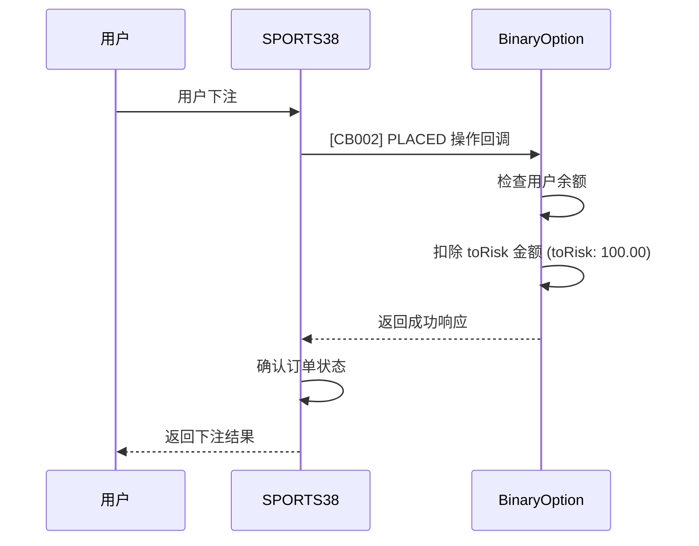
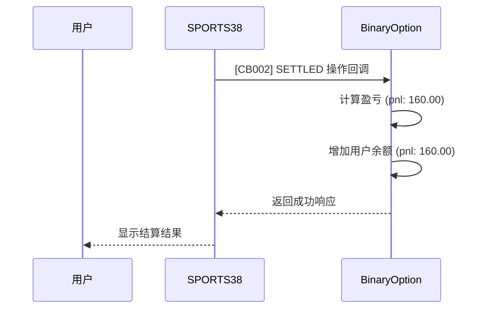
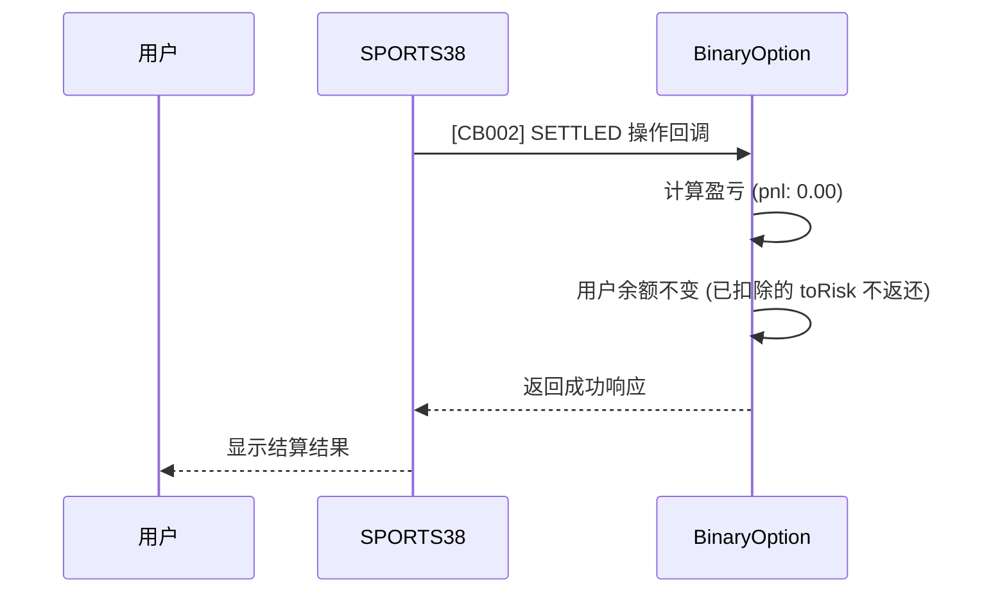
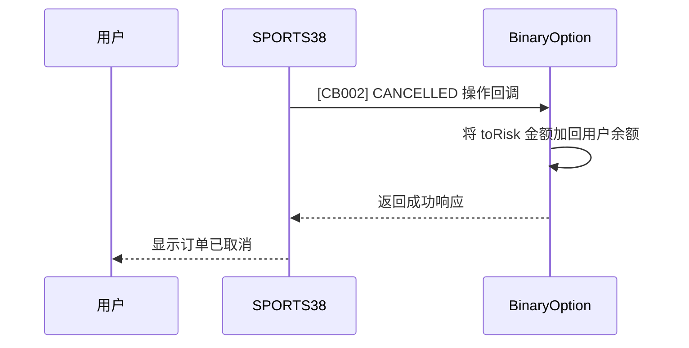

# BinaryOption 与 SPORTS38 API 集成文档

## 概述

本文档详细说明如何将 BinaryOption 系统与 SPORTS38 无缝钱包 API 进行集成。SPORTS38 作为主要投注平台，BinaryOption 作为资金管理平台，通过 API 回调机制实现用户资金流转。

## 核心需求

1. **获取用户唯一标识** - 获取 SPORTS38 用户 ID
2. **扣除或冻结用户资产** - 处理用户下注时的资金扣除
3. **增加或扣除用户资产** - 处理订单结算时的资金变动

## 需要用到的 API

### 1. SPORTS38 调用 BinaryOption 的回调接口

#### [CB001] 玩家设置回调
- **接口**: `POST {{ your_callback_domain }}/api/player/setting`
- **用途**: SPORTS38 获取 BinaryOption 系统中的玩家设置
- **请求体**:
  ```json
  {
    "playerId": "demo_player"
  }
  ```
- **响应体**:
  ```json
  {
    "errorCode": "",
    "message": "",
    "data": {
      "playerId": "demo_player",
      "oddsGroup": "A"
    },
    "success": true
  }
  ```

#### [CB002] 交易回调
- **接口**: `POST {{ your_callback_domain }}/api/transaction`
- **用途**: SPORTS38 通知 BinaryOption 处理交易（下注、结算等）
- **响应体**:
  ```json
  {
    "errorCode": "",
    "message": "",
    "data": {
      "orderId": 10004835,
      "adjustedBalance": 0,
      "positionTaken": null
    },
    "success": true
  }
  ```

### 2. BinaryOption 调用 SPORTS38 的接口

#### [A001] 登录 API
- **接口**: `POST {{ our_api_domain }}/api/v1/login`
- **用途**: 获取 SPORTS38 大厅登录 URL
- **请求体**:
  ```json
  {
    "locale": "en-US",
    "currencyCode": "HKD",
    "device": "DESKTOP",
    "playerId": "demo_player",
    "theme": "",
    "view": "",
    "timeZone": ""
  }
  ```
- **响应体**:
  ```json
  {
    "errorCode": "",
    "message": "",
    "data": {
      "url": "https://prostg.beatus88.com/proteus-ui/..."
    },
    "success": true
  }
  ```

## 资金流转流程

### 1. 用户下注流程



**回调数据示例**:
```json
{
  "action": "PLACED",
  "order": {
    "orderId": 10005211,
    "playerId": "demo_player",
    "status": "PENDING_ACCEPTANCE",
    "toRisk": 100.0000000,
    "stake": 100.0000000,
    "pnl": 0
  }
}
```

### 2. 订单结算流程（赢）



**回调数据示例**:
```json
{
  "action": "SETTLED",
  "order": {
    "orderId": 10005211,
    "playerId": "demo_player",
    "status": "SETTLED",
    "toRisk": 100.0000000,
    "pnl": 160.0000000,
    "settledStatus": "WON"
  }
}
```

### 3. 订单结算流程（输）



**回调数据示例**:
```json
{
  "action": "SETTLED",
  "order": {
    "orderId": 10005211,
    "playerId": "demo_player",
    "status": "SETTLED",
    "toRisk": 100.0000000,
    "pnl": 0.0000000,
    "settledStatus": "LOST"
  }
}
```

### 4. 订单取消流程



**回调数据示例**:
```json
{
  "action": "CANCELLED",
  "order": {
    "orderId": 10005211,
    "playerId": "demo_player",
    "status": "CANCELLED",
    "toRisk": 100.0000000,
    "pnl": 100.0000000
  }
}
```

## 集成实现步骤

### 1. 实现回调接口

在 BinaryOption 系统中实现以下接口：

```javascript
// CB001 - 玩家设置
app.post('/api/player/setting', (req, res) => {
  const { playerId } = req.body;
  // 从 BinaryOption 系统中获取玩家设置
  const playerSetting = getPlayerSetting(playerId);
  
  res.json({
    errorCode: "",
    message: "",
    data: {
      playerId: playerId,
      oddsGroup: playerSetting.oddsGroup || "A"
    },
    success: true
  });
});

// CB002 - 交易处理
app.post('/api/transaction', (req, res) => {
  const { action, order } = req.body;
  const { playerId, orderId, toRisk, pnl } = order;
  
  switch(action) {
    case "PLACED":
      // 扣除 toRisk 金额
      deductBalance(playerId, toRisk);
      break;
    case "SETTLED":
      // 根据 pnl 调整余额
      adjustBalance(playerId, pnl);
      break;
    case "CANCELLED":
      // 加回 toRisk 金额
      addBalance(playerId, toRisk);
      break;
    case "CASHED_OUT":
      // 根据 pnl 调整余额
      adjustBalance(playerId, pnl);
      break;
    case "RESETTLED":
      // 根据新的 pnl 调整余额
      adjustBalance(playerId, pnl);
      break;
  }
  
  res.json({
    errorCode: "",
    message: "",
    data: {
      orderId: orderId,
      adjustedBalance: pnl,
      positionTaken: null
    },
    success: true
  });
});
```

### 2. 调用 SPORTS38 登录 API

```javascript
async function getSprot38LoginUrl(playerId, currencyCode = "USD") {
  const request = {
    locale: "en-US",
    currencyCode: currencyCode,
    device: "DESKTOP",
    playerId: playerId,
    theme: "",
    view: "",
    timeZone: ""
  };
  
  // 使用 AES-256 加密请求体
  const encryptedData = encryptAES256(JSON.stringify(request), secretKey);
  
  const response = await fetch(`${sports38ApiDomain}/api/v1/login`, {
    method: 'POST',
    headers: {
      'Content-Type': 'application/json',
      'x-partner-key': partnerKey
    },
    body: JSON.stringify({ data: encryptedData })
  });
  
  return response.json();
}
```

## 重要注意事项

1. **安全性**: 所有请求必须使用 AES-256 加密算法进行编码
2. **回调重试**: 如果 CB002 回调返回失败，SPORTS38 会重试最多 5 次，间隔 1 分钟
3. **PLACED 操作特殊处理**: 如果 CB002 返回 PLACED 操作失败，SPORTS38 会发送 CANCELLED 操作
4. **pnl 计算**:
   - 对于中奖订单：pnl = toRisk + 赢取金额
   - 对于输掉订单：pnl = 0
   - 对于平局/退款：pnl = toRisk
5. **RESETTLED 逻辑**: 重新结算时需要比较当前 pnl 与之前保存的 pnl 值，计算差额进行调整

## 错误处理

| 错误代码 | 描述 | 处理方式 |
|----------|------|----------|
| INSUFFICIENT_FUNDS | 余额不足 | 拒绝下注请求 |
| INVALID_PLAYER_ID | 无效玩家 ID | 验证 playerId 是否存在 |
| SERVER_ERROR | 服务器错误 | 检查服务器日志 |

## 测试流程

1. 配置回调 URL 到 SPORTS38
2. 测试 [CB001] 玩家设置获取
3. 测试 [CB002] 各种交易操作 (PLACED, SETTLED, CANCELLED, CASHED_OUT, RESETTLED)
4. 测试 [A001] 登录接口
5. 完整流程测试：用户下注 → 余额扣除 → 订单结算 → 余额调整