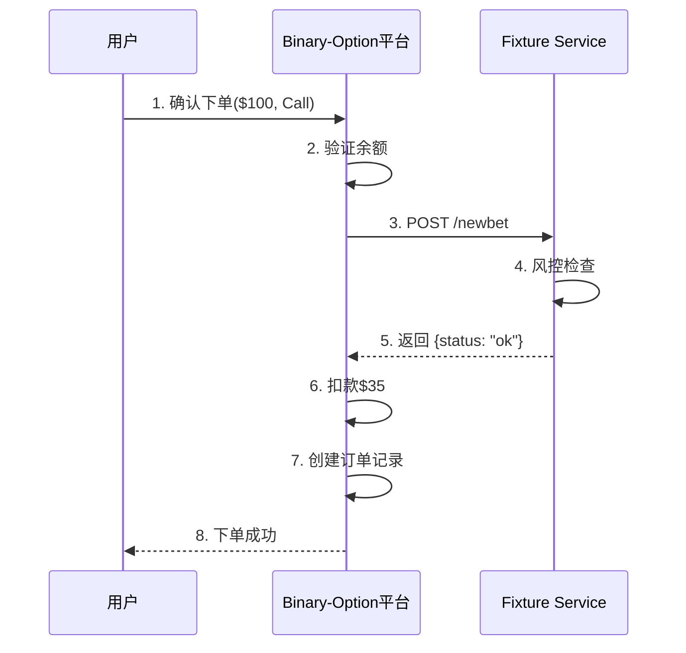
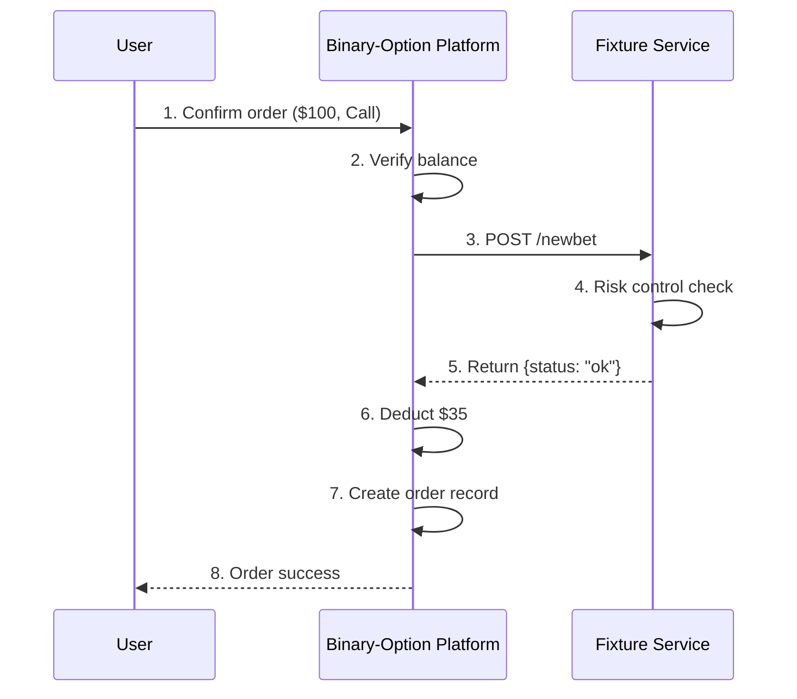

# Fixture（期权合约）问题整理

## 一、赔率计算问题

### 1.1 示例数据分析

根据fixtures或Tick订阅获取的数据：
```json
{
  "symbol": "BTCUSD",
  "side": "call",
  "strike": 30000,
  "expiration": "2025-08-15T11:15:00",
  "stake": 100.00,      // 期望赢得的金额
  "entryPrice": 0.35,    // 价格（获胜概率）
  "cost": 35.00,         // 实际支付金额
  "status": "OPEN"
}
```

### 1.2 赔率计算逻辑验证

**您的计算逻辑有误，正确的理解应该是：**

#### 错误理解 ❌
```
当前赔率：100 / 35 ≈ 2.857
如果支付: $100, side: call
- 如果赢：获得 $285.7（净赚 $185.7）
- 如果输：损失 $100
```

#### 正确理解 ✅
```
价格(entryPrice): 0.35 = 35%获胜概率
期望收益(stake): $100
实际成本(cost): $100 × 0.35 = $35

如果支付: $35（不是$100）, side: call
- 如果赢：获得 $100（净赚 $65）
- 如果输：损失 $35（不是$100）
- 赔率：100 / 35 ≈ 2.857倍
```

### 1.3 正确的结算逻辑

**用户下注流程：**
1. 用户选择投注金额（stake）：$100
2. 系统显示需要支付的成本：$100 × 0.35 = $35
3. 用户实际支付：$35

**结算条件（到期时间：2025-08-15T11:15:00）：**
- **如果 现价 > 30000**：用户获得$100，净利润 = $100 - $35 = $65
- **如果 现价 < 30000**：用户损失$35
- **如果 现价 = 30000**：平局处理（根据平台规则，可能退还本金或判输）

### 1.4 如何获取"现价"

**方案一：从市场数据服务获取**
```javascript
// 订阅市场价格
ws.send({
  "subscribe": "ticker",
  "symbol": "BTCUSD"
});

// 接收实时价格
{
  "type": "ticker",
  "symbol": "BTCUSD",
  "price": 30500.50,  // 当前市场价格
  "timestamp": "2025-08-15T11:15:00"
}
```

**方案二：从Fixture服务获取结算价**
```javascript
// 订阅meta更新，获取closed合约的最终状态
ws.send({
  "subscribe": "meta",
  "symbol": "BTCUSD"
});

// 接收结算通知
{
  "type": "meta",
  "closed": [{
    "expiration": "2025-08-15T11:15:00",
    "strike": 30000,
    "side": "call",
    "itm": true,  // true表示价内，即赢了
    "settlementPrice": 30500.50  // 结算价格（如果API提供）
  }]
}
```

## 二、关于newbet接口的技术问题

### 2.1 是否需要调用newbet？

**答案：是的，需要调用**

**调用时机和目的：**
- **时机**：用户在binary-option平台确认下单时
- **目的**：
  1. 风险管理验证
  2. 记录下注信息
  3. 锁定价格和条件
  4. 获取平台确认

**完整流程：**


### 2.2 如何避免重复下单？

**方案一：客户端幂等键**
```json
// 请求时带上唯一标识
POST /newbet
{
  "symbol": "BTCUSD",
  "expiration": "2025-08-15T11:15:00",
  "strike": 30000,
  "side": "call",
  "clientOrderId": "BO-20250815-123456",  // 客户端生成的唯一ID
  "userId": 10001
}
```

**方案二：服务端防重机制**
```java
@Service
public class BettingService {
    
    @Autowired
    private RedisTemplate redisTemplate;
    
    public Result placeBet(BetRequest request) {
        // 生成防重键
        String key = String.format("bet:%s:%s:%s:%s", 
            request.getUserId(),
            request.getSymbol(),
            request.getExpiration(),
            request.getStrike());
        
        // 设置5秒防重窗口
        Boolean success = redisTemplate.opsForValue()
            .setIfAbsent(key, "1", 5, TimeUnit.SECONDS);
        
        if (!success) {
            return Result.error("重复下单");
        }
        
        // 调用Fixture Service
        return callFixtureService(request);
    }
}
```

**方案三：数据库唯一约束**
```sql
-- 创建唯一索引防止重复
CREATE UNIQUE INDEX idx_unique_bet ON orders(
    user_id, 
    symbol, 
    expiration, 
    strike, 
    side,
    create_time
);
```

### 2.3 如何查询最终结算结果？

**方案一：主动轮询（不推荐）**
```javascript
// 定时查询合约状态
setInterval(async () => {
    const response = await fetch('/fixtures?symbol=BTCUSD&includeExpiredAfter=2025-08-15T11:00:00');
    const data = await response.json();
    
    // 查找已结算的合约
    const settled = data.closed.find(c => 
        c.expiration === '2025-08-15T11:15:00' &&
        c.strike === 30000 &&
        c.side === 'call'
    );
    
    if (settled) {
        console.log('结算结果：', settled.itm ? '赢' : '输');
    }
}, 5000);
```

**方案二：WebSocket订阅（推荐）**
```javascript
// 订阅meta更新
ws.send({
    "subscribe": "meta",
    "symbol": "BTCUSD"
});

// 监听结算通知
ws.on('message', (data) => {
    const msg = JSON.parse(data);
    if (msg.type === 'meta' && msg.closed) {
        msg.closed.forEach(contract => {
            if (contract.expiration === '2025-08-15T11:15:00' &&
                contract.strike === 30000 &&
                contract.side === 'call') {
                
                // 处理结算
                settleOrder({
                    orderId: 'xxx',
                    isWin: contract.itm,
                    settlementPrice: contract.settlementPrice
                });
            }
        });
    }
});
```

**方案三：Webhook回调（如果支持）**
```json
// 注册回调地址
POST /webhook/register
{
    "url": "https://binary-option.com/api/settlement/callback",
    "events": ["contract.settled"]
}

// 接收结算通知
POST /api/settlement/callback
{
    "event": "contract.settled",
    "data": {
        "symbol": "BTCUSD",
        "expiration": "2025-08-15T11:15:00",
        "strike": 30000,
        "side": "call",
        "itm": true,
        "settlementPrice": 30500.50
    }
}
```

## 三、建议的订单处理流程

```java
@Service
public class OrderService {
    
    /**
     * 创建订单
     */
    public Order createOrder(OrderRequest request) {
        // 1. 计算成本
        BigDecimal cost = request.getStake().multiply(request.getPrice());
        
        // 2. 检查余额
        if (account.getBalance().compareTo(cost) < 0) {
            throw new InsufficientBalanceException();
        }
        
        // 3. 调用Fixture Service验证
        NewBetResponse response = fixtureService.newBet(request);
        if (!"ok".equals(response.getStatus())) {
            throw new BetRejectedException(response.getMessage());
        }
        
        // 4. 创建订单
        Order order = new Order();
        order.setUserId(request.getUserId());
        order.setSymbol(request.getSymbol());
        order.setStrike(request.getStrike());
        order.setSide(request.getSide());
        order.setExpiration(request.getExpiration());
        order.setStake(request.getStake());
        order.setEntryPrice(request.getPrice());
        order.setCost(cost);
        order.setStatus(OrderStatus.PENDING);
        
        // 5. 扣款
        accountService.deduct(request.getUserId(), cost);
        
        // 6. 保存订单
        order.setStatus(OrderStatus.ACTIVE);
        orderMapper.insert(order);
        
        return order;
    }
    
    /**
     * 结算订单
     */
    public void settleOrder(Long orderId, boolean isWin) {
        Order order = orderMapper.findById(orderId);
        
        if (isWin) {
            // 赢了，支付stake金额
            accountService.credit(order.getUserId(), order.getStake());
            order.setPayout(order.getStake());
            order.setProfit(order.getStake().subtract(order.getCost()));
        } else {
            // 输了，不支付
            order.setPayout(BigDecimal.ZERO);
            order.setProfit(order.getCost().negate());
        }
        
        order.setStatus(OrderStatus.SETTLED);
        order.setSettleTime(new Date());
        orderMapper.update(order);
    }
}
```

---

# Fixture (Options Contract) Q&A Documentation

## 1. Odds Calculation

### 1.1 Example Data Analysis

Data from fixtures or Tick subscription:
```json
{
  "symbol": "BTCUSD",
  "side": "call",
  "strike": 30000,
  "expiration": "2025-08-15T11:15:00",
  "stake": 100.00,      // Amount to win
  "entryPrice": 0.35,    // Price (winning probability)
  "cost": 35.00,         // Actual payment
  "status": "OPEN"
}
```

### 1.2 Odds Calculation Logic Verification

**Your calculation logic is incorrect. The correct understanding should be:**

#### Wrong Understanding ❌
```
Current odds: 100 / 35 ≈ 2.857
If paying: $100, side: call
- If win: Get $285.7 (net profit $185.7)
- If lose: Loss $100
```

#### Correct Understanding ✅
```
Price (entryPrice): 0.35 = 35% winning probability
Expected return (stake): $100
Actual cost: $100 × 0.35 = $35

If paying: $35 (not $100), side: call
- If win: Get $100 (net profit $65)
- If lose: Loss $35 (not $100)
- Odds: 100 / 35 ≈ 2.857x
```

### 1.3 Correct Settlement Logic

**User Betting Process:**
1. User selects bet amount (stake): $100
2. System shows required payment: $100 × 0.35 = $35
3. User actually pays: $35

**Settlement Conditions (Expiration: 2025-08-15T11:15:00):**
- **If spot price > 30000**: User gets $100, net profit = $100 - $35 = $65
- **If spot price < 30000**: User loses $35
- **If spot price = 30000**: Draw (platform rules apply, may refund or consider as loss)

### 1.4 How to Get "Spot Price"

**Option 1: From Market Data Service**
```javascript
// Subscribe to market price
ws.send({
  "subscribe": "ticker",
  "symbol": "BTCUSD"
});

// Receive real-time price
{
  "type": "ticker",
  "symbol": "BTCUSD",
  "price": 30500.50,  // Current market price
  "timestamp": "2025-08-15T11:15:00"
}
```

**Option 2: From Fixture Service Settlement**
```javascript
// Subscribe to meta updates for final contract status
ws.send({
  "subscribe": "meta",
  "symbol": "BTCUSD"
});

// Receive settlement notification
{
  "type": "meta",
  "closed": [{
    "expiration": "2025-08-15T11:15:00",
    "strike": 30000,
    "side": "call",
    "itm": true,  // true means in-the-money (won)
    "settlementPrice": 30500.50  // Settlement price (if API provides)
  }]
}
```

## 2. Technical Questions about newbet

### 2.1 Do I Need to Call newbet?

**Answer: Yes, you need to call it**

**When and Why:**
- **When**: When user confirms order on binary-option platform
- **Purpose**:
  1. Risk management validation
  2. Record betting information
  3. Lock price and conditions
  4. Get platform confirmation

**Complete Flow:**


### 2.2 How to Avoid Duplicate Orders?

**Solution 1: Client-side Idempotency Key**
```json
// Include unique identifier in request
POST /newbet
{
  "symbol": "BTCUSD",
  "expiration": "2025-08-15T11:15:00",
  "strike": 30000,
  "side": "call",
  "clientOrderId": "BO-20250815-123456",  // Client-generated unique ID
  "userId": 10001
}
```

**Solution 2: Server-side Deduplication**
```java
@Service
public class BettingService {
    
    @Autowired
    private RedisTemplate redisTemplate;
    
    public Result placeBet(BetRequest request) {
        // Generate deduplication key
        String key = String.format("bet:%s:%s:%s:%s", 
            request.getUserId(),
            request.getSymbol(),
            request.getExpiration(),
            request.getStrike());
        
        // Set 5-second deduplication window
        Boolean success = redisTemplate.opsForValue()
            .setIfAbsent(key, "1", 5, TimeUnit.SECONDS);
        
        if (!success) {
            return Result.error("Duplicate order");
        }
        
        // Call Fixture Service
        return callFixtureService(request);
    }
}
```

**Solution 3: Database Unique Constraint**
```sql
-- Create unique index to prevent duplicates
CREATE UNIQUE INDEX idx_unique_bet ON orders(
    user_id, 
    symbol, 
    expiration, 
    strike, 
    side,
    create_time
);
```

### 2.3 How to Query Final Settlement Result?

**Option 1: Active Polling (Not Recommended)**
```javascript
// Periodically query contract status
setInterval(async () => {
    const response = await fetch('/fixtures?symbol=BTCUSD&includeExpiredAfter=2025-08-15T11:00:00');
    const data = await response.json();
    
    // Find settled contracts
    const settled = data.closed.find(c => 
        c.expiration === '2025-08-15T11:15:00' &&
        c.strike === 30000 &&
        c.side === 'call'
    );
    
    if (settled) {
        console.log('Settlement result:', settled.itm ? 'Win' : 'Lose');
    }
}, 5000);
```

**Option 2: WebSocket Subscription (Recommended)**
```javascript
// Subscribe to meta updates
ws.send({
    "subscribe": "meta",
    "symbol": "BTCUSD"
});

// Listen for settlement notifications
ws.on('message', (data) => {
    const msg = JSON.parse(data);
    if (msg.type === 'meta' && msg.closed) {
        msg.closed.forEach(contract => {
            if (contract.expiration === '2025-08-15T11:15:00' &&
                contract.strike === 30000 &&
                contract.side === 'call') {
                
                // Process settlement
                settleOrder({
                    orderId: 'xxx',
                    isWin: contract.itm,
                    settlementPrice: contract.settlementPrice
                });
            }
        });
    }
});
```

**Option 3: Webhook Callback (If Supported)**
```json
// Register callback URL
POST /webhook/register
{
    "url": "https://binary-option.com/api/settlement/callback",
    "events": ["contract.settled"]
}

// Receive settlement notification
POST /api/settlement/callback
{
    "event": "contract.settled",
    "data": {
        "symbol": "BTCUSD",
        "expiration": "2025-08-15T11:15:00",
        "strike": 30000,
        "side": "call",
        "itm": true,
        "settlementPrice": 30500.50
    }
}
```

## 3. Recommended Order Processing Flow

```java
@Service
public class OrderService {
    
    /**
     * Create Order
     */
    public Order createOrder(OrderRequest request) {
        // 1. Calculate cost
        BigDecimal cost = request.getStake().multiply(request.getPrice());
        
        // 2. Check balance
        if (account.getBalance().compareTo(cost) < 0) {
            throw new InsufficientBalanceException();
        }
        
        // 3. Call Fixture Service for validation
        NewBetResponse response = fixtureService.newBet(request);
        if (!"ok".equals(response.getStatus())) {
            throw new BetRejectedException(response.getMessage());
        }
        
        // 4. Create order
        Order order = new Order();
        order.setUserId(request.getUserId());
        order.setSymbol(request.getSymbol());
        order.setStrike(request.getStrike());
        order.setSide(request.getSide());
        order.setExpiration(request.getExpiration());
        order.setStake(request.getStake());
        order.setEntryPrice(request.getPrice());
        order.setCost(cost);
        order.setStatus(OrderStatus.PENDING);
        
        // 5. Deduct payment
        accountService.deduct(request.getUserId(), cost);
        
        // 6. Save order
        order.setStatus(OrderStatus.ACTIVE);
        orderMapper.insert(order);
        
        return order;
    }
    
    /**
     * Settle Order
     */
    public void settleOrder(Long orderId, boolean isWin) {
        Order order = orderMapper.findById(orderId);
        
        if (isWin) {
            // Won, pay stake amount
            accountService.credit(order.getUserId(), order.getStake());
            order.setPayout(order.getStake());
            order.setProfit(order.getStake().subtract(order.getCost()));
        } else {
            // Lost, no payout
            order.setPayout(BigDecimal.ZERO);
            order.setProfit(order.getCost().negate());
        }
        
        order.setStatus(OrderStatus.SETTLED);
        order.setSettleTime(new Date());
        orderMapper.update(order);
    }
}
```