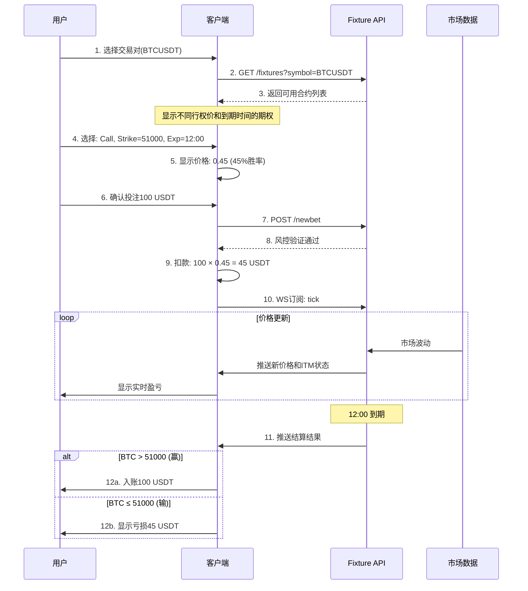

# Options Betting - Fixture Service API

## 概述

这是一个期权投注的Fixture服务API文档，提供了期权合约（fixtures）的创建、查询、下注和实时价格推送功能。

## 一、核心概念解释

### 1. Fixture（期权合约）
- **定义**：预先设定的期权合约，包含了所有交易条件
- **作用**：标准化的交易产品，用户只能选择已存在的fixture进行交易
- **生命周期**：创建 → 开放交易 → 到期结算 → 关闭

### 2. 期权基础概念

#### Option（期权）
- **定义**：赋予持有人在特定时间以特定价格买入或卖出标的资产的权利
- **二元期权特点**：只有两种结果 - 盈利固定金额或损失全部投资

#### Call Option（看涨期权）
- **定义**：预测标的资产价格会**上涨**超过行权价
- **盈利条件**：到期时价格 > 行权价
- **例子**：BTC现价50000，买入行权价51000的Call，如果到期时BTC>51000则盈利

#### Put Option（看跌期权）
- **定义**：预测标的资产价格会**下跌**低于行权价
- **盈利条件**：到期时价格 < 行权价
- **例子**：BTC现价50000，买入行权价49000的Put，如果到期时BTC<49000则盈利

## REST API

**基础URL**: `<website>/v1/api/`

### 1. 获取期权合约列表

**端点**: `/fixtures`  
**方法**: `GET`

#### 请求参数

| 参数 | 类型 | 说明 | 示例 |
|-----|------|------|------|
| **symbol** | string | 标的资产符号 | "BTCUSDT", "ETHUSDT" |
| | | • 交易对的标识符 | |
| | | • 决定了期权基于哪个资产 | |
| **includeExpiredAfter** | datetime | 包含此时间后过期的合约 | "2024-01-15T10:00:00Z" |
| | | • 可选参数 | |
| | | • 用于查看历史已结算的合约 | |
| | | • 不传则只返回当前活跃合约 | |

#### 响应格式

##### open数组（开放合约）

| 参数 | 类型 | 说明 | 示例 | 专业解释 |
|-----|------|------|------|----------|
| **expiration** | datetime | 到期时间 | "2024-01-15T12:00:00Z" | 期权自动结算的时间点，过了这个时间无法再交易 |
| **strike** | float | 行权价格 | 50000.00 | 判断输赢的价格基准线 |
| **side** | string | 期权类型 | "call" 或 "put" | 看涨或看跌 |
| **itm** | boolean | 是否价内 | true/false | **In The Money**的缩写，表示当前是否处于盈利状态 |
| **price** | float | 当前价格 | 0.65 | **范围0-1**，表示获胜概率 |
| | | | | • 0.65 = 65%概率获胜 |
| | | | | • 投资100元，价格0.65，需支付65元 |
| | | | | • 如果赢，获得100元（净赚35元） |
| | | | | • 如果输，损失65元 |
| **openInterest** | integer | 未平仓量 | 1500 | 当前持有该合约的总数量，反映市场活跃度 |

```json
{
    "open": [                             // 开放的合约
        {
            "expiration": "<datetime>",   // 到期时间
            "strike": "<float>",          // 行权价
            "side": "put" / "call",       // 期权类型：看跌/看涨
            "itm": "<bool>",              // 是否价内期权(In The Money)
            "price": "<float>",           // 当前价格 (0-1之间)
            "openInterest": "<int>"       // 未平仓合约数
        },
        ...
    ],
    "closed": [                           // 已关闭的合约
        {
            "expiration": "<datetime>",
            "strike": "<float>",
            "side": "put" / "call",
            "itm": "<bool>",
            "price": "<float>",
            "openInterest": "<int>"
        },
        ...
    ]
}
```

**说明**: 
- 请求所有开放的期权合约
- 可选择性地包含指定日期后已过期的合约
- 服务会自动在指定的到期时间和行权价水平内创建合约
- 价格范围在0-1之间，实际购买时需乘以选定的权利金

### 2. 创建新投注

**端点**: `/newbet`  
**方法**: `POST`

#### 请求参数

| 参数 | 类型 | 说明 | 示例 | 使用场景 |
|-----|------|------|------|----------|
| **symbol** | string | 标的资产 | "BTCUSDT" | 选择哪个交易对 |
| **expiration** | datetime | 到期时间 | "2024-01-15T12:00:00Z" | 必须匹配现有fixture |
| **strike** | float | 行权价 | 50000.00 | 必须匹配现有fixture |
| **side** | string | 方向 | "call" 或 "put" | 看涨或看跌 |
| **amount** | float | 投注金额 | 100.00 | 投注的金额 |
| **orderId** | string | 订单ID | "ORDER_12345" | 用于关联和追踪 |

```json
{
    "symbol": "<str>",           // 交易标的符号
    "expiration": "<datetime>",  // 到期时间
    "strike": "<float>",         // 行权价
    "side": "put" / "call",      // 期权类型
    "amount": "<float>",         // 投注金额
    "orderId": "<str>"          // 订单ID
}
```

#### 响应格式

| 参数 | 类型 | 说明 | 可能值 |
|-----|------|------|--------|
| **status** | string | 请求状态 | "ok": 下注成功<br>"error": 下注失败 |
| **message** | string | 详细信息 | "Order placed successfully"<br>"Fixture already expired"<br>"Insufficient balance" |

```json
{
    "status": "ok" / "error",   // 请求状态
    "message": "..."             // 状态描述
}
```

**说明**: 
- 请求购买期权合约
- 主要用于风险管理目的
- 如果合约已过期，将返回错误

## WebSocket API

**基础URL**: `<website>/v1/ws/`

### 1. 订阅元数据更新

#### 发送消息

| 参数 | 说明 |
|------|------|
| **subscribe** | "meta" - 订阅类型：元数据更新 |
| **symbol** | 关注的交易对，如"BTCUSDT" |

```json
{
    "subscribe": "meta",  // 订阅类型：元数据更新
    "symbol": "BTCUSDT"   // 关注的交易对
}
```

#### 接收消息

| 参数 | 说明 |
|------|------|
| **type** | "meta" - 消息类型标识 |
| **opened** | 新创建的合约列表 |
| **closed** | 刚到期的合约列表 |
| | • 包含最终ITM状态 |
| | • 包含最终未平仓量 |

```json
{
    "type": "meta",
    "symbol": "<str>",
    "opened": [                    // 新开放的合约
        {
            "expiration": "<datetime>",
            "strike": "<float>",
            "side": "put" / "call"
        },
        ...
    ],
    "closed": [                    // 已关闭的合约
        {
            "expiration": "<datetime>",
            "strike": "<float>",
            "side": "put" / "call",
            "itm": "<bool>",
            "openInterest": "<int>"
        },
        ...
    ]
}
```

**说明**: 订阅通用更新，如合约创建或到期通知

### 2. 订阅价格更新

#### 发送消息

| 参数 | 说明 |
|------|------|
| **subscribe** | "tick" - 订阅类型：价格数据 |
| **symbol** | 关注的交易对，如"BTCUSDT" |

```json
{
    "subscribe": "tick",  // 订阅类型：价格数据
    "symbol": "BTCUSDT"   // 关注的交易对
}
```

#### 接收消息

| 参数 | 说明 | 更新频率 |
|------|------|----------|
| **type** | "tick" - 价格更新标识 | - |
| **fixtures** | 合约价格数组 | 实时 |
| **price** | 实时价格(0-1) | 随市场波动 |
| **itm** | 实时盈亏状态 | 价格穿越行权价时改变 |

```json
{
    "type": "tick",
    "symbol": "<str>",
    "fixtures": [
        {
            "expiration": "<datetime>",
            "strike": "<float>",
            "side": "put" / "call",
            "itm": "<bool>",
            "price": "<float>"         // 实时价格更新
        },
        ...
    ]
}
```

**说明**: 
- 订阅个别合约的价格更新
- 合约到期时自动终止订阅
- 客户端决定订阅哪些合约

## 二、专业术语详解

### ITM/OTM/ATM状态

| 状态 | 全称 | 中文 | Call期权条件 | Put期权条件 | 对用户的意义 |
|------|------|------|-------------|------------|--------------|
| **ITM** | In The Money | 价内 | 现价 > 行权价 | 现价 < 行权价 | 如果现在到期会盈利 |
| **OTM** | Out of The Money | 价外 | 现价 < 行权价 | 现价 > 行权价 | 如果现在到期会亏损 |
| **ATM** | At The Money | 平价 | 现价 = 行权价 | 现价 = 行权价 | 不赚不赔的临界点 |

### 价格计算逻辑

#### Price（价格）的含义
```
价格 = 获胜概率

影响因素：
1. 剩余时间：时间越短，价格越接近0或1
2. 现价与行权价的距离：距离越远，价格越偏离0.5
3. 波动率：波动越大，价格越接近0.5
4. 市场情绪：买入压力会推高价格
```

#### 实际交易示例
```
场景：BTC现价 = 50,000 USDT
合约：行权价 = 51,000，到期时间 = 1小时后，类型 = Call
价格：0.35（系统计算出35%概率会涨到51,000以上）

用户下注100 USDT：
- 实际支付：100 × 0.35 = 35 USDT
- 如果赢（BTC > 51,000）：获得100 USDT，净赚65 USDT
- 如果输（BTC ≤ 51,000）：损失35 USDT
- 预期收益率：65/35 = 185.7%
```

### Open Interest（未平仓量）

**定义**：当前所有未到期的该合约持仓总量

**作用**：
1. **流动性指标**：数值越大，说明越多人参与
2. **市场情绪**：Call的OI > Put的OI，说明市场看涨
3. **风险管理**：平台用于控制总体风险敞口

**计算方式**：
```
新用户买入 +1
用户平仓 -1
到期自动清零
```

## 三、业务流程示例

### 完整交易流程



## 重要说明

1. **价格机制**:
   - 没有买卖价差(bid-ask spread)
   - 只有单一价格
   - 所有买卖订单作为"市价单"执行
   - 价格范围: 0-1

2. **架构分离**:
   - 实际的买卖、用户管理在客户端服务(交易所)进行
   - 此API仅用于风险管理目的

---

## 四、文档理解与分析

### 业务模型理解

这个API描述的是一个**二元期权交易系统**的核心服务：

1. **Fixture（期权合约）概念**:
   - Fixture是预定义的期权合约
   - 包含到期时间(expiration)、行权价(strike)、类型(put/call)
   - 系统自动创建和管理这些合约

2. **价格模型**:
   - 采用0-1之间的概率定价模型
   - 1表示100%会盈利，0表示100%会亏损
   - 实际投注金额 = 价格 × 权利金

3. **ITM (In The Money) 状态**:
   - Call期权: 当前价格 > 行权价时为ITM
   - Put期权: 当前价格 < 行权价时为ITM
   - ITM状态决定到期时是否盈利

### 系统架构特点

1. **服务分离**:
   - Fixture Service: 管理期权合约和定价（此API）
   - Client Service: 处理用户交易和账户管理
   - 这种分离有利于风控和系统稳定性

2. **实时性要求**:
   - WebSocket推送价格更新
   - 支持meta（合约状态）和tick（价格）两种订阅
   - 价格需要根据标的资产实时波动调整

3. **风险管理**:
   - `/newbet`端点用于风控验证
   - 可以拒绝高风险投注
   - 统计未平仓量(openInterest)

### 与现有系统集成建议

1. **数据模型映射**:
   - Fixture → Order (订单表)
   - Symbol → 交易对
   - Price → 赔率

2. **价格计算**:
   - 需要实现Black-Scholes或类似的期权定价模型
   - 根据剩余时间、波动率、标的价格实时计算

3. **WebSocket集成**:
   - 可以复用现有的market-service WebSocket架构
   - 添加fixture类型的消息推送

4. **风控集成**:
   - 在order-service中实现newbet验证逻辑
   - 检查用户余额、持仓限制等

## 五、风险提示

1. **价格波动风险**：期权价格可能快速变化
2. **时间价值衰减**：越接近到期，时间价值越少
3. **全损风险**：二元期权可能损失全部投资
4. **流动性风险**：Open Interest低时可能难以成交

## 六、对接建议

1. **价格精度**：建议保留4位小数（0.0001）
2. **时间同步**：服务器时间必须精确同步
3. **缓存策略**：fixture列表可缓存1-5秒
4. **重连机制**：WebSocket断线需自动重连并重新订阅
5. **风控限制**：
   - 单笔最大投注额
   - 用户持仓上限
   - 到期前X秒停止交易

这个API设计简洁清晰，适合快速实现二元期权交易功能。