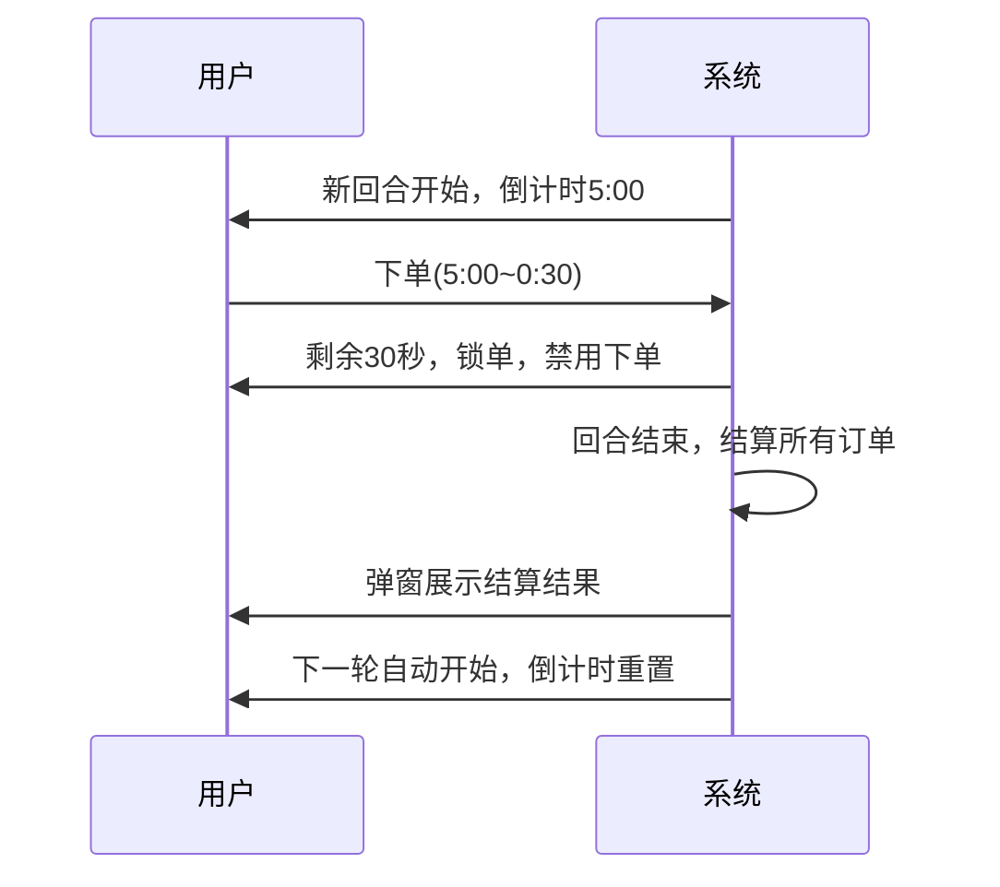
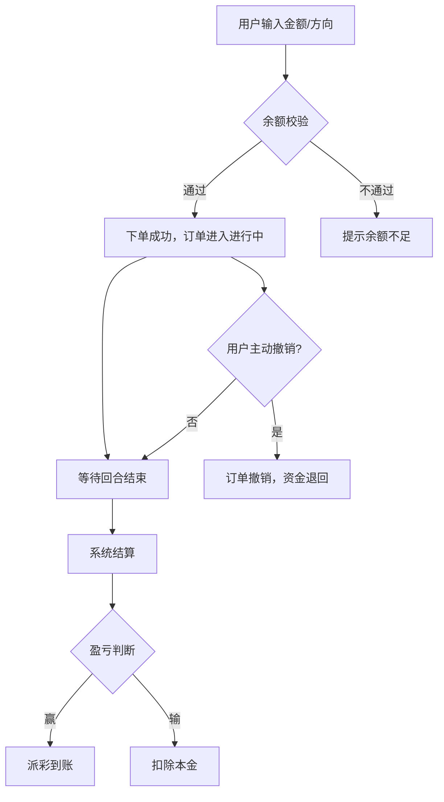

# 二元期权平台产品需求文档(PRD)

| 版本   | 日期         | 作者         | 说明                     |
|--------|--------------|--------------|--------------------------|
| v0.1   | 2025年7月16日 | Barry   | 初稿                     |
| v0.2   | 2025年7月16日 | Barry   | 模拟交易，风控限额，价格监控和结算，收入分配                     |
| v0.3   | 2025年7月17日 | Barry   | 多周期下单详细                     |

## 1. 产品背景与目标
- 本项目为基于BTSE交易所的加密货币二元期权交易平台，面向全球数字资产用户，提供极简、透明、公平的二元期权交易体验。
- 目标：打造支持多币种、多时长、实盘/模拟账户隔离、自动结算、国际化、响应式适配的MVP平台。
- 成功标准：MVP阶段实现BTC/USDT 5分钟回合实盘与模拟交易，系统稳定、结算准确、用户体验流畅，具备后续多币种/多时长扩展能力。

## 2. 术语与定义
- **二元期权**：到期时根据标的价格涨跌结果获得固定收益或损失的金融衍生品。
- **回合**：每5分钟为一个交易周期，用户可在回合内下单，订单将在当前周期结算。
- **实盘账户**：与BTSE主账户对接的真实资金账户。
- **模拟账户**：平台内虚拟资金账户，仅用于体验和测试。
- **盘口/赔率**：根据实时资金池和投注方向动态计算的赔率，用于结算。
- **PNL**：Profit and Loss，盈亏统计。
- **风控**：对用户下单、资金、结算等环节的风险管理措施，包括限额、黑名单、风控事件等。
- **黑名单**：被平台限制交易或登录的用户名单。
- **全局配置**：平台级参数配置，支持动态调整。
- **分表归档**：对大表(如订单、流水)按月归档，提升性能。
- **多环境**：生产、预发布、测试等环境的独立配置与管理。

## 3. 用户与角色
- **普通用户**：进行注册、登录、资产管理、下单、查看历史、切换实盘/模拟账户等操作。
- **管理员**：通过后台管理用户、品类、订单、统计、风控、黑名单、全局配置、归档数据、环境信息等。

## 4. 产品范围
### 4.1 功能范围(MVP)
- 支持多币种/多时长(MVP仅开放BTC/USDT和5分钟回合，其他币种和时长功能开发预留但暂不开放)。
- 实盘与模拟两套账户体系，前后端均需适配。
- 多交易所价格聚合，自动结算与实时到账。
- 订单管理、历史记录、PNL统计、后台管理、国际化、响应式适配。
- 主要功能点：
  - 用户系统打通(external_id映射)
  - 资产选择组件(多币种UI、币种切换逻辑、国际化)
  - 实盘/模拟切换(账户切换、余额校验、UI适配，**切换需二次确认弹窗**)
  - 5分钟倒计时组件(精准倒计时、回合切换、UI适配，**锁单前30秒红色警告，自动禁用投注**)
  - 实时K线图展示(6小时历史、1秒刷新、BTSE WebSocket API推送)
  - 当前价格/盘口展示(BTSE行情、盘口/赔率、UI)
  - UP/DOWN按钮(投注方向、交互、风控校验)
  - 金额输入与快捷按钮(25/50/75/100%、手动输入、风控，**最小$10，最大$10,000，余额实时校验**)
  - 投注确认弹窗(预期收益、倍率、二次确认，**需展示预期收益和倍数**)
  - 余额显示与校验(实盘/模拟余额、风控、UI)
  - 当前投注列表(本回合投注，实时刷新)
  - 资金池/赔率展示(总奖池、UP/DOWN比例、倍率，**奖池Dashboard**)
  - 结算结果提示(胜/负/平，动画，国际化，**盈利弹窗有动画/吉祥物，亏损弹窗风格克制，带SIMULATED标签，Next Trade按钮**)
  - 个人投注历史、公共回合结果、PNL盈亏统计(**支持虚拟余额重置**)
  - 投注限额设置、风险偏好配置、虚拟账户管理(余额重置)
  - 响应式布局(PC/移动端适配)、多语言切换与国际化适配
  - 管理后台(用户、品类、订单、统计、权限、国际化、风控、黑名单、全局配置、分表归档、分环境等)
  - 风控限额配置、风控事件日志、用户黑名单管理
  - 全局配置项管理(key-value)、重要参数变更日志

## 5. 主要用户流程
1. **首次登录时，必须阅读并同意风险披露与AML条款，方可进入平台。**
2. 用户通过平台入口访问，选择BTC/USDT交易对，进入交易主界面。
3. 切换实盘/模拟账户，系统自动校验余额及风控。
4. 选择回合时长(MVP仅5分钟)，查看实时K线、盘口、赔率。
5. 输入投注金额，选择UP或DOWN，确认下单。
6. 等待回合结束，系统自动结算，展示结果及盈亏。
7. 用户可在历史记录页面查看个人投注、PNL统计。
8. 可在个人设置中调整限额、风险偏好、重置模拟余额。
9. 后台管理可对用户、品类、订单、统计、风控、黑名单、全局配置等进行维护和分析。

## 5.1 轮次流程时序图(Mermaid 示例)

## 6. 功能需求明细

### 6.1 用户系统
- **external_id映射、登录状态打通**
  - 支持与BTSE用户系统账号打通，用户可通过external_id唯一标识。
  - 登录后自动识别用户身份，保持会话有效性，支持单点登录。
  - 用户可在平台内查看和管理个人基础信息。
  - 用户可安全退出登录，退出后需清除本地敏感信息。
- **首次登录强制风险披露与AML同意**
  - 用户首次登录时，必须阅读并同意风险披露与AML条款，方可进入平台。

### 6.2 账户与资产管理
- **账户余额展示与校验**
  - 交易主界面右上角清晰展示当前账户余额(如2,340.00 USDT)，支持实盘/模拟账户切换。
  - 切换账户类型时，界面需同步展示对应余额。
  - 下单前需校验余额是否充足，不足时给出友好提示。
- **资产切换(多币种UI、币种切换逻辑)**
  - 支持多币种资产展示，MVP阶段仅开放BTC/USDT。
  - 用户可在主界面币种选择区切换币种，切换后所有相关数据(盘口、余额、历史等)需同步刷新。
- **虚拟账户余额重置**
  - 用户可在模拟账户下自主重置余额，重置后余额恢复为初始值，历史记录不受影响。
  - 每日重置次数可配置，防止恶意刷测试资金。

### 6.3 交易与订单
- 平台支持多种回合周期(如5分钟、10分钟、15分钟等)，用户可在主交易界面选择参与的周期。
- 具体下单归属、锁单期、结算规则及举例，详见6.18 多周期下单说明。
- 订单列表支持按周期筛选和查看不同周期的进行中和已结算订单。
- 主交易界面：
  - 顶部展示平台Logo、主导航、账户余额、用户中心等。
  - 明显位置展示“Binary Options”标题及实盘/模拟切换(Demo开关，**切换需二次确认弹窗**)。
  - 币种选择区(如BTC，下拉切换)、24h高低、成交量等信息。
  - 中部为实时K线图，展示价格走势、历史下单点(带+50、-20等标记)，支持缩放和拖动。
  - 右侧为下单区：
    - 投资金额输入框，支持快捷加20、50、75、100按钮，**最小$10，最大$10,000，余额实时校验**。
    - 当前可用余额展示。
    - “Bet Higher”(绿色)和“Bet Lower”(红色)下单按钮，分别对应看涨/看跌。
    - 下单前弹出确认弹窗，展示方向、金额、预期收益、赔率，需二次确认。
    - **具体下单归属、锁单期、结算规则详见6.18 多周期下单说明。**
  - 底部为当前订单列表Tab(Options)，分为Ongoing(进行中)和Settled/Expired(已结算)两类。

- **订单列表**
  - 用户可通过主界面底部或菜单进入订单列表页。
  - 顶部为“Options”标题，Tab切换“Ongoing(进行中)”与“Expired(已结算)”。
  - 每个订单卡片包含：
    - 币种及图标(如BTC)
    - 归属周期(如5分钟、10分钟)
    - 下单时间、下单价格
    - 结算时间、结算价格
    - 投注金额及方向(绿色为Higher，红色为Lower)
    - 盈亏(绿色为正，红色为负)
  - 进行中订单实时刷新结算倒计时，已结算订单显示最终盈亏。
  - 支持上下滚动浏览历史订单。

- **结算结果弹窗**
  - 每个订单结算完成后，自动弹出盈亏结果弹窗。
  - 盈利时弹窗顶部展示庆祝动画和吉祥物形象，Total P&L为绿色正数。
  - 亏损时弹窗风格克制，Total P&L为红色负数。
  - 下方有提示文案(如“恭喜您本轮盈利！”或“很遗憾本轮亏损，请再接再厉！”)。
  - “Next Trade”按钮，点击后关闭弹窗并返回交易主界面。
  - 弹窗为强提示，需主动操作关闭。
  - 支持国际化，所有文案可根据语言切换。
  - **盈利弹窗有动画/吉祥物，亏损弹窗风格克制，带SIMULATED标签，Next Trade按钮**。

### 6.4 实时行情与盘口
- **实时K线图(6小时历史、1秒刷新、BTSE WebSocket API推送)**
  - **行情数据获取**：所有价格、K线、盘口等行情数据均直接从BTSE获取，通过WebSocket API实时推送。
  - 交易界面展示当前币种6小时K线图，数据每秒自动刷新。
  - 支持缩放、拖动查看历史K线。
  - K线图上可标记用户历史下单点及盈亏。
- **当前价格、盘口、赔率展示**
  - 实时展示当前价格、盘口资金池、UP/DOWN赔率。
  - 盘口和赔率根据实时资金池动态变化，用户下单后需立即反映最新数据。
- **资金池/赔率动态计算与展示**
  - 展示当前回合UP/DOWN总投注金额、比例、对应赔率。
  - 赔率计算规则需透明，用户可查阅说明。
  - **奖池Dashboard**。

### 6.6 结算与盈亏
- 每个周期到期时，系统自动结算该周期内所有订单，结算结果(胜/负/平)实时推送给用户，并更新账户余额和历史记录。
- 结算弹窗、盈亏统计等功能均支持多周期，用户可按周期查看历史盈亏、胜率等数据。
- 结算失败或异常时，需有友好错误提示及申诉入口。
- 具体结算规则详见6.18 多周期下单说明。

### 6.7 风控与限额
- **投注限额设置、风险偏好配置**
  - 平台设有单笔、单日、单周、单月最大投注限额，具体数值由平台统一配置，用户不可自定义。
  - 风控限额超出时禁止下单，并给出提示。
- **风控校验、风控事件日志**
  - 所有下单、结算等关键操作均需经过风控校验，校验失败时记录风控事件日志。
  - 用户可在个人中心查看被风控拦截的历史记录及原因。
- **用户黑名单管理**
  - 平台可将违规用户加入黑名单，黑名单用户无法下单或登录。
  - 黑名单管理支持后台手动添加、自动触发等方式。

### 6.8 历史记录与统计
- 管理后台可按周期统计交易量、用户活跃度、盈亏分布等运营数据。
- 用户可查询个人所有投注历史，支持多条件筛选和导出。
- 平台可展示所有用户的公共回合结果(如开奖公告)。
- **支持PNL统计、虚拟余额重置**。

### 6.9 管理后台
- **用户、品类、订单、统计、权限、国际化、风控、黑名单、全局配置等管理**
  - 管理员可通过后台对上述各类数据进行增删改查、导出、权限分配等操作。
- **重要参数变更日志**
  - 所有关键参数变更需记录日志，便于追溯和审计。

### 6.10 国际化与响应式
- **多语言切换与国际化适配**
  - 平台支持中英文等多语言切换，所有界面、提示、邮件等均需国际化。
- **响应式布局(PC/移动端适配)**
  - 平台界面需自适应不同终端，保证PC和移动端用户体验一致。

### 6.11 配置与环境信息展示
- **全局配置项管理(key-value)**
  - 平台支持通过界面动态调整全局参数(如风控限额、币种开关等)。

### 6.12 规则与风控补充
- **价格快照留存**：每轮起始价、结算价、盘口等关键数据需留存快照，便于后续审计和用户申诉。
- **订单撤销规则**：明确规定在“进行中”状态下是否允许撤销订单，需设定撤销截止时间点，撤销后资金即时退回账户。
- **模拟账户重置频率**：每日/每周最多重置次数，防止恶意刷模拟资金。
- **资金转入/转出限制**：单笔、单日最大转入/转出金额，防止洗钱和异常资金流动。
- **余额不足处理**：下单、转账、提现等操作余额不足时，需有明确提示和阻断。

### 6.13 下单与结算流程图(Mermaid 示例)

### 6.14 Demo Trading(模拟交易)
- 平台为所有用户提供模拟账户(Demo Trading)，用于体验和测试，无需真实资金。
- 模拟账户初始余额为10,000 USDT，用户可在个人中心自主重置余额。
- 每日/每周最多重置余额次数有限制，防止恶意刷模拟资金。
- 模拟交易与实盘交易界面、功能一致，但所有盈亏、结算均不涉及真实资金。
- 模拟订单、结算、历史记录等均有“SIMULATED”标签，防止混淆。

### 6.15 风控限额规则
- 平台设有单笔、单日、单周、单月最大投注限额，具体数值由平台统一配置，用户不可自定义。
- 超过限额时，系统自动禁止下单，并给出友好提示。
- 示例：单日最大投注额100,000 USDT，单周500,000 USDT，单月2,000,000 USDT。
- 所有限额校验均在下单前进行，后台可实时调整。

### 6.16 价格监控与结算规则
- 具体结算时机、结算价、盈亏判断、平局规则详见6.18 多周期下单说明。

### 6.17 收入分配与手续费
- 平台对所有盈利订单收取10%手续费(如用户盈利100 USDT，实际到账90 USDT)。
- 亏损订单不收取手续费。
- 手续费比例可后台配置，所有结算明细中需明确展示手续费扣除项。

### 6.18 多周期下单说明
- 平台支持多种回合周期(如5分钟、10分钟、15分钟等)，用户可在主交易界面选择参与的周期。
- 每个周期独立计时、独立结算，用户可同时参与多个周期的下单。
- 详细举例：
    - 假设当前时间为01:03:00，平台支持5分钟和10分钟两个周期：
        - 用户A选择5分钟周期，在01:03:00下单，系统记录**下单价格**为BTC/USDT的**01:03:00实时价格**。
        - 用户B选择10分钟周期，在01:08:00下单，系统记录**下单价格**为BTC/USDT的**01:08:00实时价格**。
        - 用户X选择10分钟周期，在01:09:31下单(**距离本周期结束小于30秒**)，系统提示“本轮下单已截止，请等待下一轮”。
    - 结算时机：
        - 用户A的订单将在**当前5分钟周期**结束时(即01:05:00)结算，**结算价格**为BTC/USDT的**01:05:00实时价格**。
        - 用户B的订单将在**当前10分钟周期**结束时(即01:10:00)结算，**结算价格**为BTC/USDT的**01:10:00实时价格**。
    - 盈亏判断：
        - 以用户A为例：如果用户A下单方向为UP，且01:05:00的价格高于01:03:00的下单价，则盈利；反之则亏损。
        - 若结算价与下单价完全相同，则判为平局，本金返还。
    - 多用户多周期：
        - 用户C在01:04:00也下了一个5分钟周期订单，下单价为01:04:00的实时价格，结算时机同样为01:05:00，结算价为01:05:00的实时价格。
        - 用户A、C的订单虽然结算时机相同，但各自的下单价不同，盈亏独立计算。
        - 用户B的10分钟订单与A、C的5分钟订单结算时机不同，互不影响。

## 7. 参考资料
- [IQ Option 示例](https://iqoption.com/traderoom)
- [Rollbit 示例](https://rollbit.com/trading/BTC)
- [Figma 原型链接](https://www.figma.com/design/NzWOl31hVKE8vmdfCMMyd8/Binary-Options?node-id=4-2&t=xnpx2oSC4IcWuFTE-1) 