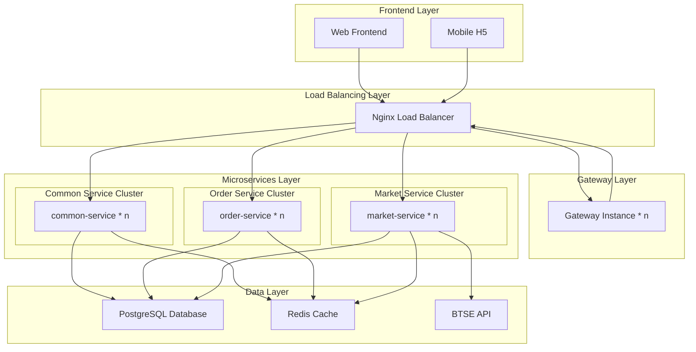
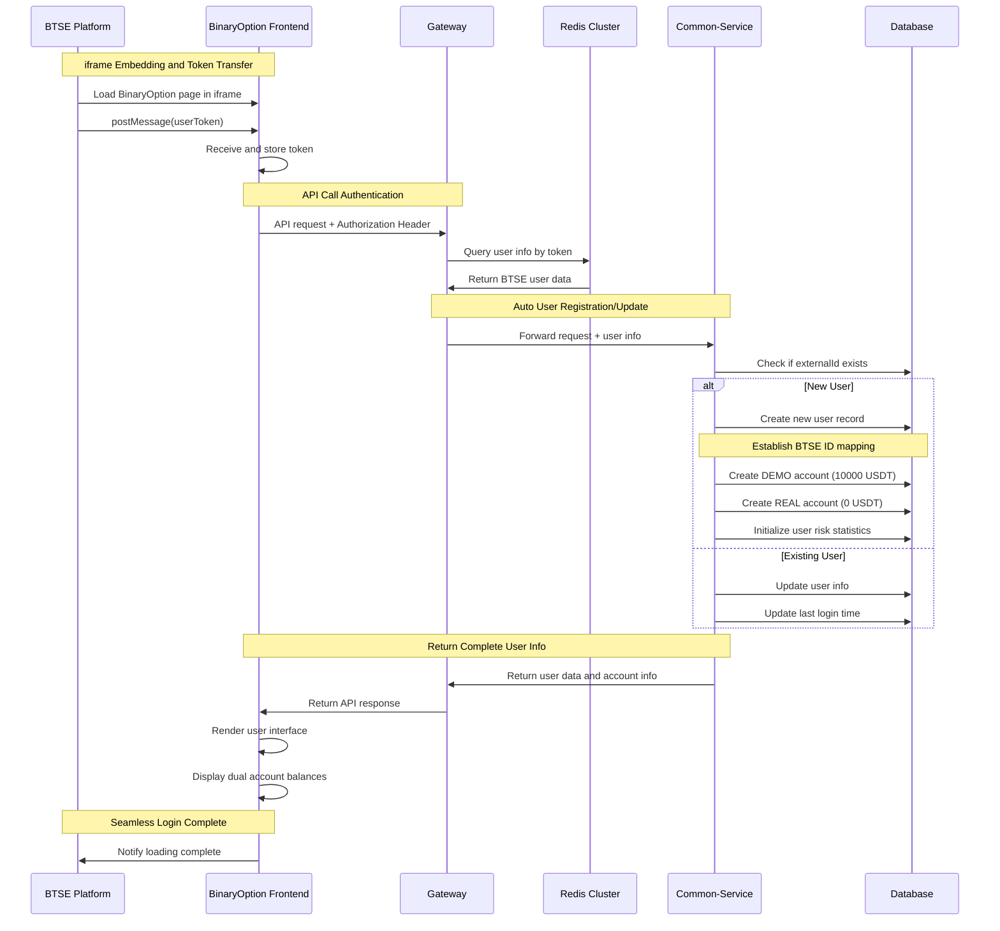
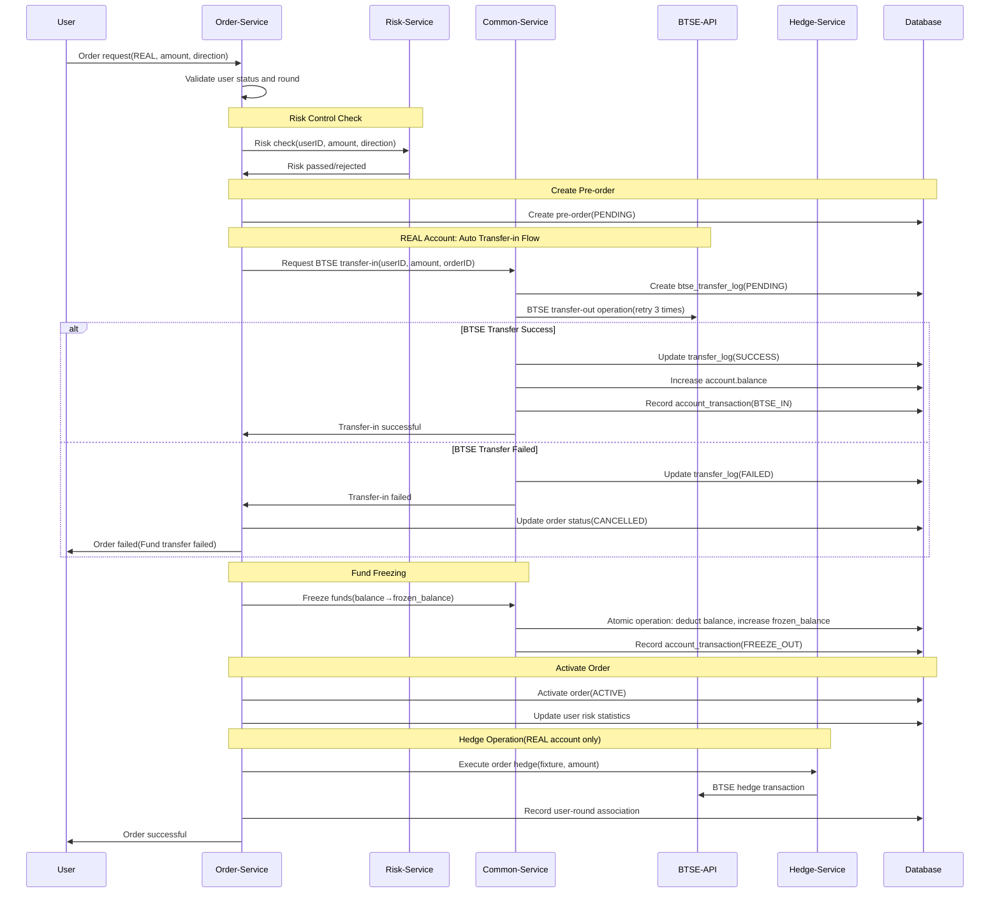
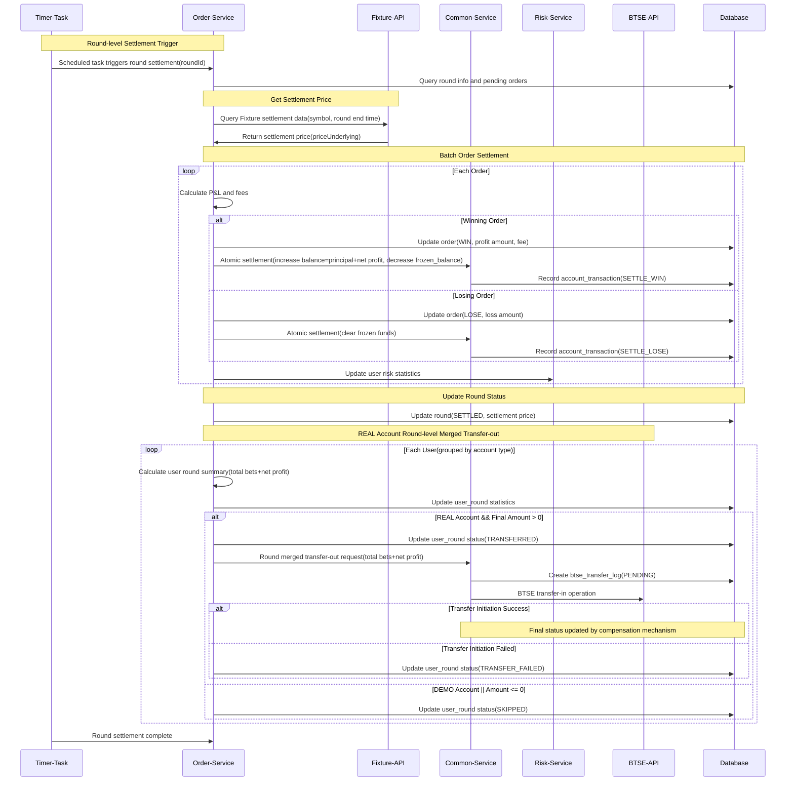

# BinaryOption Platform Project Presentation - PPT Version

## Presentation Overview
- **Duration**: 30-45 minutes
- **Environment**: Staging Environment
- **Entry Point**: https://staging.btse.co
- **Trading Interface**: https://borc.btse.co
- **API Gateway**: https://api.btse.co/borc/

---

## Page 1: Project Introduction - Business Vision

### BinaryOption Platform
Next-generation binary options trading platform with enterprise-grade architecture

### Core Value Propositions
- **Dual Account System**: Seamless DEMO and REAL trading experience
- **Real-time Integration**: Direct integration with BTSE exchange
- **Risk Management**: Built-in hedging and risk control mechanisms
- **iframe Integration**: Seamless embedding in BTSE platform, no separate login required

---

## Page 2: Core Feature Matrix

| Feature | Description | Business Impact |
|---------|------------|----------------|
| **iframe Integration** | Seamless embedded authentication | Enhanced security, better UX |
| **Dual Accounts** | DEMO + REAL accounts | Risk-free learning, smooth transition |
| **Real-time Trading** | WebSocket market data | Instant updates, better decisions |
| **Auto Hedging** | Automatic risk management | Reduced platform risk |
| **Settlement Engine** | Automated round settlement | Accurate, timely payouts |
| **Compensation System** | Self-healing mechanisms | 99.9% reliability |

---

## Page 3: Demo Environment Setup

### Access Method
1. Open browser and visit: https://staging.btse.co
2. Log in to BTSE account
3. Find "Binary Options" feature entry
4. Click to enter, BinaryOption interface will be displayed as embedded iframe
5. System automatically completes user authentication and account creation

### Demo Scenario Settings
- Current system is set to 5-minute trading rounds
- Only BTC-USDT trading pair is available
- Includes complete risk control demonstration

---

## Page 4: Scenario 1 - User Auto-Login

### Demonstration Narrative
"Let's see how BTSE users seamlessly access binary options trading"

### Operation Steps
1. User finds "Binary Options" entry in BTSE platform
2. Click to enter, iframe automatically loads BinaryOption interface
3. System automatically completes user authentication in background
4. Automatically creates or associates user account
5. Displays both DEMO and REAL account balances

### Behind-the-Scenes Technical Flow
- BTSE → iframe postMessage → token transmission
- BinaryOption receives token → Redis queries user info
- Auto user registration/update → establish ID mapping
- Dual account system initialization → interface rendering complete

---

## Page 5: Scenario 2 - DEMO Trading Experience

### Demonstration Narrative
"New traders start with risk-free DEMO trading"

### Web Interface Operation
1. Auto-enter trading interface after login
2. Top displays DEMO account preset funds (10,000 USDT)
3. Left side shows real-time market data panel
4. Main interface displays price chart (Note: Currently only BTC-USDT is available)

### Real-time Data Demo
- Observe BTC-USDT price auto-updates every second
- Rise/fall marked with green/red in real-time
- K-line chart draws new price points in real-time
- 24-hour price change calculated and displayed in real-time

---

## Page 6: DEMO Trading Order Placement Demo

### Create DEMO Order
1. Trading pair fixed as "BTC-USDT" (currently the only one available)
2. Set trade amount: Enter "100"
3. Select direction: Click "Buy Up" button
4. Click "Confirm Order" button

### Risk Control Demo (New)
1. Try placing large order: Enter "2000"
2. System prompts: "Exceeds single order limit (1000 USDT)"
3. Modify to "800", order successful
4. Select "Buy Down" direction

### Interface Effects Display
- Order confirmation popup shows order details
- Active orders panel shows countdown (4:59, 4:58, 4:57...)
- Current price displays with real-time updates
- P&L status calculated in real-time (green profit/red loss)
- Automatic settlement after 5-minute expiry
- Order status changes from "In Progress" to "Settled"

---

## Page 7: Scenario 3 - REAL Trading & BTSE Integration

### Demonstration Narrative
"When ready, traders can switch to real funds trading"

### Account Switch Demo
1. Click account switch button in top-right corner
2. Select "REAL Account"
3. Interface displays REAL account balance
4. Note interface color theme change (distinguishing DEMO/REAL)

---

## Page 8: REAL Account Trading Demo

### Create REAL Order
1. Confirm switched to REAL account (clear interface indicator)
2. Trading pair: "BTC-USDT" (only option)
3. Enter amount "50" (note conservative amount)
4. Select "Buy Up" direction

### Risk Control Limit Demo (Important)
1. **Single Order Limit Test**:
   - Try entering "1500" USDT
   - System prompts: "Exceeds single trade limit (1000 USDT)"
   - Adjust to "500" USDT, order successful

2. **Daily Cumulative Limit Test**:
   - After placing several consecutive orders
   - Try placing another order, prompted: "Approaching daily cumulative limit (5000 USDT)"
   - Demonstrates strict execution of risk control mechanisms

---

## Page 10: FAQs - Fund Security & Real-time Reconciliation

### Focus 1: Fund Security & Real-time Reconciliation

#### Q1: How is user fund security ensured?
**Answer**:
- **Fund Custody**: REAL account funds 100% stored at BTSE, we don't directly handle user funds
- **Pre-freeze Mechanism**: Freeze funds before order placement, ensuring sufficient funds during trading
- **Real-time Reconciliation Design**: Every transaction has complete btse_transfer_log records, supporting real-time reconciliation
- **Audit Trail**: All fund movements have account_transaction records, verifiable anytime

#### Q2: How to ensure fund data consistency between platform and BTSE?
**Answer**:
- **Three-layer Reconciliation**: Order-level, round-level, daily automatic reconciliation
- **Compensation System**: Automatic retry for abnormal transfers, automatic handling of timeout orders
- **Manual Verification**: Complete reconciliation reports and discrepancy handling process provided

---

## Page 11: FAQs - BTSE Integration Stability Assurance

### Focus 2: BTSE Integration Stability Assurance

#### Q3: How does the system respond when BTSE API is unavailable?
**Answer**:
- **Multi-layer Retry Mechanism**: Auto-retry 3 times with exponential backoff strategy
- **Circuit Breaker Protection**: Auto circuit break on API anomaly, protecting system stability
- **Compensation System**: Scheduled tasks handle failed transfers and hedge operations
- **Degradation Strategy**: When BTSE unavailable, DEMO trading unaffected, REAL trading pauses with user notification

#### Q4: How to monitor BTSE integration health status?
**Answer**:
- **Real-time Monitoring**: Check BTSE API health every 30 seconds
- **Alert Mechanism**: Immediate alert notifications on API anomaly
- **Status Panel**: Admin dashboard displays BTSE connection status and response time
- **Auto Recovery**: Automatic service restart when API recovers

---

## Page 12: FAQs - System Scalability

### Focus 3: System Scalability

#### Q5: How much user growth can the platform support?
**Answer**:
- **Microservices Architecture**: Each service scales independently, supports horizontal scaling
- **Caching Strategy**: Redis cluster, 95% cache hit rate, reduces database pressure
- **Load Balancing**: Nginx auto-scaling (K8S can be considered in future)

#### Q6: How scalable are new trading pairs and features?
**Answer**:
- **Configuration-based Design**: New trading pairs only need configuration, no code changes
- **Plugin Architecture**: New features through modular development, no impact on existing system
- **API Standardization**: Unified interface specifications, easy integration of new external services
- **Database Design**: Reserved extension fields, supports rapid business iteration

---

## Page 13: FAQs - System Usability

### Focus 4: System Usability

#### Q7: Is the learning and usage cost high for users?
**Answer**:
- **Zero Registration Process**: BTSE users use directly, no additional registration needed
- **DEMO Experience**: New users experience DEMO trading first, lowering learning threshold
- **Intuitive Interface**: Simple trading interface, mastered in 5 minutes
- **Real-time Guidance**: Clear step prompts in trading process

#### Q8: Is platform management and operations complex?
**Answer**:
- **Automated Operations**: Scheduled tasks automatically handle settlement, reconciliation, compensation
- **Monitoring Panel**: Complete admin dashboard, real-time system status viewing
- **One-click Deployment**: Docker containerization, standardized deployment process
- **Remote Support**: 7x24 technical support and remote assistance provided

---

## Page 14: FAQs - Potential Risks & API Dependencies

### Focus 5: Potential Risks & API Dependencies

#### Q9: What is the system's biggest technical risk?
**Answer**:
- **BTSE API Dependency**: Core risk is strong dependency on BTSE API
- **Risk Mitigation**: Multiple compensation mechanisms, circuit breaker protection, auto recovery
- **Alternative Plans**: Reserved multi-exchange integration interfaces, quick switching capability
- **Risk Monitoring**: Real-time API stability monitoring, advance warnings

#### Q10: How to handle extended BTSE service interruption?
**Answer**:
- **Business Degradation**: DEMO trading continues, REAL trading pauses
- **User Notification**: Timely notify users of service status and expected recovery time
- **Data Protection**: All trading data preserved intact, auto-processing after recovery
- **Emergency Plan**: Detailed emergency response process and customer service scripts

---

## Page 15: Business Expansion - SaaS Service Planning

### Focus 6: Business Expansion

#### Q11: Are there plans to develop BinaryOption into a SaaS service for other platforms to integrate?
**Answer**:
- **Business Prospect**: Indeed planned, this is a promising business model
- **Technical Reserve**: Our microservices architecture naturally supports multi-tenancy
- **Standardized Design**: Three core standardized integration solutions already considered

### SaaS Integration Standardization Solutions

#### 1. User Integration Standards
- **Unified User Identification**: Support OAuth, JWT, API Key and other authentication methods
- **User Mapping Mechanism**: Establish mapping between third-party platform user IDs and BinaryOption user IDs
- **Permission Control**: Role-based permission management, supports customized permissions for different platforms
- **User Data Isolation**: Complete multi-tenant data isolation, ensuring data security

#### 2. Account Integration Standards
- **Account Type Extension**: Support DEMO and REAL account types
- **Fund Flow Standardization**: Unified fund in/out interfaces, adapt to different platforms' fund management methods
- **Risk Control Parameter Configuration**: Each integrated platform can customize risk control rules and trading limits

#### 3. Page Integration Standards
- **White Label Solution**: Fully customizable UI themes and brand identity
- **iframe Standardization**: Provide standard iframe embedding SDK, support responsive design
- **API Interface**: Provide complete REST API, support custom frontend development
- **Component-based Design**: Trading components, chart components, account components can be embedded independently

---

## Page 16: Expected Revenue Models

### Expected Revenue Models

#### 1. Tiered Commission Sharing Model
- **Monthly Volume < $1M**: Share 20% of trading fees
- **Monthly Volume > $20M**: Share 10% of trading fees
- **Advantage**: Win-win with client business growth, incentivize clients to increase volume

#### 2. Fixed Annual Fee Model
- **Basic**: $50K/year, supports 50K DAU, basic features
- **Professional**: $150K/year, supports 200K DAU, advanced analytics + risk control
- **Overage Fees**: Excess users charged at $1/user/year

#### 3. Hybrid Model (Recommended)
- **Annual Fee**: Covers platform base costs and technical support
- **Revenue Share**: Performance-based revenue sharing
- **Example**: Professional annual fee $100K + 10-15% fee sharing

### Technical Implementation Advantages
- **Existing Architecture**: Microservices architecture naturally supports multi-tenancy
- **Data Isolation**: Complete data isolation through tenant ID
- **Configuration-based**: Trading parameters, UI themes, risk control rules all configurable
- **Rapid Deployment**: New client integration only needs 2-3 days for configuration and testing

---

## Q&A

## Page 17: Appendix - Technical Architecture Design

### Architecture Design Overview

---

## Page 18: Appendix - Core Process - User Creation (iframe Integration)

**Process Summary**: When BTSE users click to enter binary options functionality, the system automatically identifies user identity and creates corresponding trading accounts. New users receive a practice DEMO account (preset 10000 USDT) and a real trading REAL account, the entire process requires no registration or login operations.

---

## Page 19: Appendix - Core Process - Order Placement (REAL Account)

**Process Summary**: After user submits trading order, system performs risk check first, then automatically transfers funds from BTSE for REAL account, freezes corresponding amount, activates order and executes auto-hedging. The entire process ensures fund security and controlled risk.

---

## Page 20: Core Process - Settlement (Round-level Merged Settlement)

**Process Summary**: Every 5 minutes the system automatically settles a trading round. System gets real market price, determines P&L for each order, updates user account balance. For REAL account profits, system automatically transfers back to user's BTSE account.

---

### Open Discussion Session
- In-depth technical discussion
- Business cooperation possibilities
- Customization requirements communication
- Future development planning exchange

### Contact Information
- **Technical Support**: 7x24 technical support provided
- **Business Cooperation**: Welcome deep cooperation discussions
- **Custom Development**: Support personalized requirements customization
- **Training Services**: Complete training and technical support provided

---