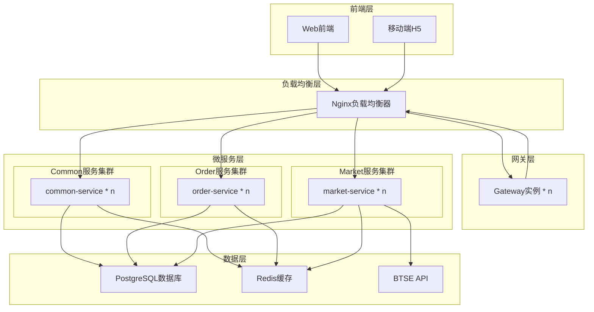
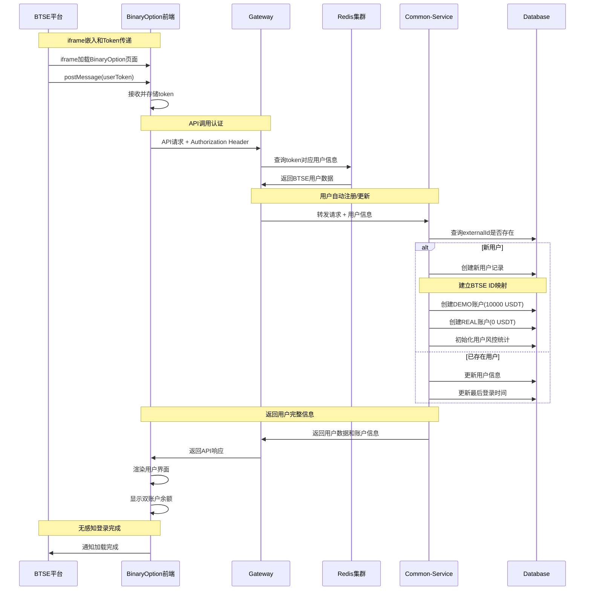
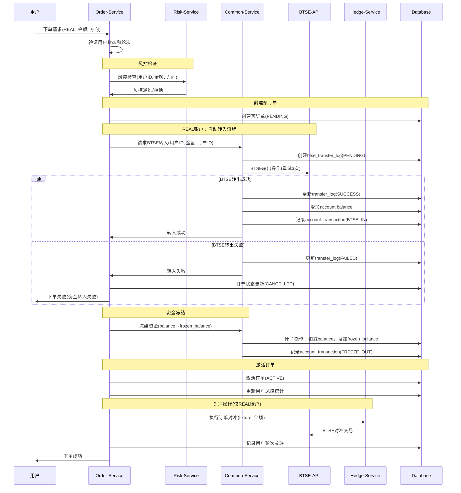
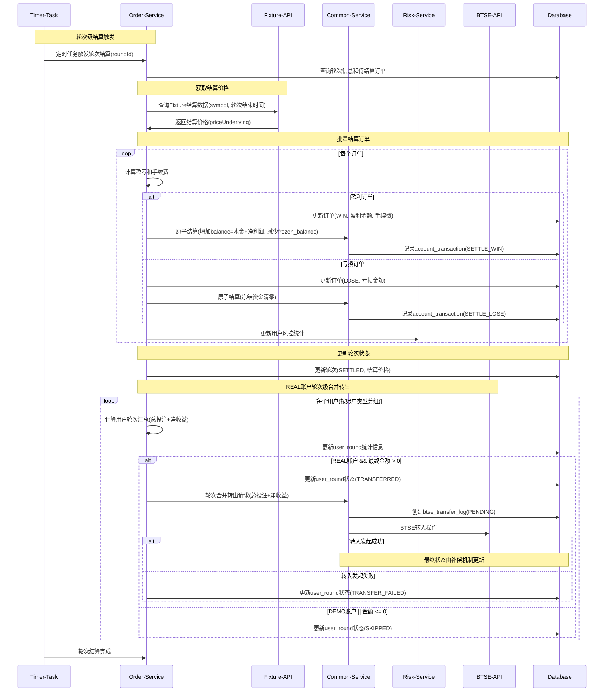

# BinaryOption 平台 - 项目演示与Demo指南

## 演示概览

**时长**：30-45 分钟  
**环境**：Staging 环境  
- 入口：https://staging.btse.co
- 交易界面：https://borc.btse.co
- API 网关：https://api.btse.co/borc/

---

## 第一部分：项目介绍（5分钟）

### 1.1 业务愿景

**BinaryOption 平台** - 具有企业级架构的新一代二元期权交易平台

**核心价值主张：**
- **双账户体系**：无缝的 DEMO 和 REAL 交易体验
- **实时集成**：与 BTSE 交易所直接集成
- **风险管理**：内置对冲和风控机制
- **iframe集成**：无缝嵌入BTSE平台，无需独立登录

### 1.2 核心功能矩阵

| 功能 | 描述 | 业务影响 |
|------|------|---------|
| **iframe集成** | 无缝嵌入认证 | 增强安全性，更好的用户体验 |
| **双账户** | DEMO + REAL 账户 | 无风险学习，平滑过渡 |
| **实时交易** | WebSocket 市场数据 | 即时更新，更好的决策 |
| **自动对冲** | 自动风险管理 | 降低平台风险 |
| **结算引擎** | 自动轮次结算 | 准确、及时的支付 |
| **补偿系统** | 自我修复机制 | 99.9% 可靠性 |

### 2. 架构设计

### 3.1 核心流程-用户创建（iframe集成模式）

**流程简述**：BTSE用户点击进入二元期权功能时，系统会自动识别用户身份并创建对应的交易账户。新用户会获得一个练习用的DEMO账户（预设10000元）和一个真实交易的REAL账户，整个过程无需注册或登录操作。

### 3.2 核心流程-下单（REAL账户）

**流程简述**：用户提交交易订单后，系统会先进行风险检查，然后为REAL账户自动从BTSE转入资金，冻结相应金额，激活订单并执行自动对冲。整个过程确保资金安全和风险可控。

### 3.3 核心流程-结算（轮次级合并结算）

**流程简述**：每5分钟系统会自动结算一轮交易。系统获取市场真实价格，判断每个订单的盈亏，更新用户账户余额。对于REAL账户的盈利部分，系统会自动转回到用户的BTSE账户中。

---

## 第二部分：实时演示流程（20分钟）

### 演示环境准备

**访问方式：**
1. 打开浏览器访问：https://staging.btse.co
2. 登录BTSE账户
3. 找到"二元期权"功能入口
4. 点击进入，BinaryOption界面将以iframe形式嵌入显示
5. 系统自动完成用户身份验证和账户创建

### 演示场景：完整交易之旅

**重要说明**：
- 当前系统设定为5分钟一个交易轮次
- 只开放BTC-USDT交易对
- 包含完整的风控演示

#### 场景 1：用户入驻（3分钟）

**叙述**："让我们看看BTSE用户如何无缝接入二元期权交易"

**操作步骤：**
1. 用户在BTSE平台中找到"二元期权"入口
2. 点击进入，iframe自动加载BinaryOption界面
3. 系统后台自动完成用户身份验证
4. 自动创建或关联用户账户
5. 显示DEMO和REAL两个账户余额

**幕后技术流程：**
- BTSE → iframe postMessage → token传递
- BinaryOption接收token → Redis查询用户信息
- 自动用户注册/更新 → 建立ID映射关系
- 双账户体系初始化 → 界面渲染完成

**演示要点**：
- 展示iframe嵌入的无缝体验
- 强调零登录步骤的用户体验
- 显示自动创建的双账户体系
- 演示BTSE用户信息的同步

#### 场景 2：DEMO 交易体验（5分钟）

**叙述**："新交易者从无风险的 DEMO 交易开始"

**Web界面操作：**
1. 登录后自动进入交易界面
2. 顶部显示 DEMO 账户预设资金（10,000 USDT）
3. 左侧显示实时市场数据面板
4. 主界面显示价格图表（注意：当前只开放BTC-USDT交易）

**实时数据演示：**
- 观察BTC-USDT价格每秒自动更新
- 涨跌用绿色/红色实时标识
- K线图表实时绘制新的价格点
- 24小时涨跌幅实时计算显示

**交易界面演示：**

**步骤 4：创建 DEMO 订单**
1. 交易对固定为 "BTC-USDT"（目前唯一开放）
2. 设置交易金额：输入 "100"
3. 选择方向：点击 "买涨" 按钮
4. 选择时长："5分钟"
5. 点击 "确认订单" 按钮

**风控演示（新增）：**
1. 尝试下大额订单：输入 "2000"
2. 系统提示："超过单笔限额（1000 USDT）"
3. 修改为 "800"，成功下单
4. 选择 "买跌" 方向
5. 选择 "5分钟" 时长

**界面效果展示**：
- 订单确认弹窗，显示订单详情
- 活跃订单面板显示倒计时（4:59, 4:58, 4:57...）
- 当前价格实时跳动显示
- 盈亏状态实时计算（绿色盈利/红色亏损）
- 5分钟到期后自动结算
- 余额数字动画更新
- 订单状态从 "进行中" 变为 "已结算"

#### 场景 3：REAL 交易与 BTSE 集成（8分钟）

**叙述**："准备好后，交易者可以切换到真实资金交易"

**账户切换演示：**
1. 点击右上角账户切换按钮
2. 选择 "REAL 账户"
3. 界面显示 REAL 账户余额
4. 注意界面颜色主题变化（区分 DEMO/REAL）

**REAL 账户交易演示：**

**步骤 6：创建 REAL 订单**
1. 确认已切换到 REAL 账户（界面有明显标识）
2. 交易对："BTC-USDT"（唯一可选）
3. 输入金额 "50"（注意金额相对保守）
4. 选择 "买涨" 方向
5. 选择时长："5分钟"
6. 点击确认，可能会有额外的 REAL 账户确认弹窗

**风控限制演示（重要）：**
1. **单笔限额测试**：
   - 尝试输入 "1500" USDT
   - 系统提示："超过单笔交易限额（1000 USDT）"
   - 调整为 "500" USDT，成功下单

2. **日累计限额测试**：
   - 连续下几笔订单后
   - 尝试再下单时提示："接近日累计限额（5000 USDT）"
   - 展示风控机制的严格执行

**关键演示点**：
1. **订单生命周期**：
   - PENDING → ACTIVE（BTSE 确认后）
   - 自动对冲到 BTSE
   - 实时盈亏跟踪（5分钟周期）
   - 轮次级合并结算转账

2. **风险管理（重点展示）**：
   - 单笔限额：1000 USDT
   - 日累计限额：5000 USDT
   - 连续亏损限制：3笔后强制冷却
   - 自动对冲执行

3. **5分钟结算展示**：
   - 订单进行中：显示5分钟倒计时
   - 结算倒计时：最后30秒高亮显示
   - 轮次结算：每5分钟统一结算
   - 结果通知：批量结算通知
   - 余额更新：REAL账户轮次合并转出
   - 交易历史：按轮次聚合显示

---

## 第三部分：提问环节（5-10分钟）

### 核心关注点与常见问题

#### **🔒 重点1：资金安全性与实时对账**

**Q1：用户资金如何保障安全？**
- **回答**：
  - **资金托管**：REAL账户资金100%存放在BTSE，我们不直接接触用户资金
  - **预冻结机制**：下单前先冻结资金，确保交易时资金充足
  - **实时对账设计**：每笔交易都有完整的btse_transfer_log记录，支持实时对账
  - **审计追踪**：所有资金流动都有account_transaction记录，可随时核查

**Q2：如何确保平台与BTSE的资金数据一致性？**
- **回答**：
  - **三层对账机制**：订单级、轮次级、日级自动对账
  - **补偿系统**：异常转账自动重试，超时订单自动处理
  - **实时监控**：Redis缓存BTSE余额，异常立即告警
  - **人工核查**：提供完整的对账报告和差异处理流程

#### **🔗 重点2：BTSE集成稳定性保障**

**Q3：BTSE API不可用时系统如何应对？**
- **回答**：
  - **多层重试机制**：自动重试3次，指数退避策略
  - **熔断保护**：API异常时自动熔断，保护系统稳定
  - **补偿系统**：定时任务处理失败的转账和对冲操作
  - **降级策略**：BTSE不可用时，DEMO交易不受影响，REAL交易暂停并通知用户

**Q4：如何监控BTSE集成的健康状态？**
- **回答**：
  - **实时监控**：每30秒检测BTSE API健康状态
  - **告警机制**：API异常立即发送告警通知
  - **状态面板**：管理后台显示BTSE连接状态和响应时间
  - **自动恢复**：API恢复后自动重启相关服务

#### **📈 重点3：系统扩展性**

**Q5：平台能支持多大规模的用户增长？**
- **回答**：
  - **微服务架构**：每个服务独立扩展，支持水平扩容
  - **缓存策略**：Redis集群，95%缓存命中率，减少数据库压力
  - **负载均衡**：Nginx 自动扩缩容（后续可以考虑采用K8S）

**Q6：新增交易对和功能的扩展性如何？**
- **回答**：
  - **配置化设计**：新增交易对只需配置，无需修改代码
  - **插件式架构**：新功能通过模块化开发，不影响现有系统
  - **API标准化**：统一的接口规范，便于集成新的外部服务
  - **数据库设计**：预留扩展字段，支持业务快速迭代

#### **👥 重点4：系统易用性**

**Q7：用户学习和使用成本高吗？**
- **回答**：
  - **零注册流程**：BTSE用户直接使用，无需额外注册
  - **DEMO体验**：新用户先体验DEMO交易，降低学习门槛
  - **直观界面**：简洁的交易界面，5分钟即可上手
  - **实时引导**：交易流程有清晰的步骤提示

**Q8：平台管理和运维复杂吗？**
- **回答**：
  - **自动化运维**：定时任务自动处理结算、对账、补偿
  - **监控面板**：完整的管理后台，实时查看系统状态
  - **一键部署**：Docker容器化，标准化部署流程
  - **远程支持**：提供7x24技术支持和远程协助

#### **⚠️ 重点5：潜在风险与API依赖性**

**Q9：系统最大的技术风险是什么？**
- **回答**：
  - **BTSE API依赖**：核心风险是对BTSE API的强依赖
  - **风险缓解**：多重补偿机制、熔断保护、自动恢复
  - **备选方案**：预留多交易所集成接口，可快速切换
  - **风险监控**：实时监控API稳定性，提前预警

**Q10：如何应对BTSE服务长时间中断？**
- **回答**：
  - **业务降级**：DEMO交易继续服务，REAL交易暂停
  - **用户通知**：及时通知用户服务状态和预计恢复时间
  - **数据保护**：所有交易数据完整保存，恢复后自动处理
  - **应急预案**：制定详细的应急响应流程和客服话术

#### **💼 商业化扩展：SaaS服务规划**

**Q11：是否有计划将BinaryOption打造成SaaS服务，让其他平台也能接入？**
- **回答**：
  - **商业前景**：确实有计划，这是一个很有前景的商业模式
  - **技术储备**：我们的微服务架构天然支持多租户接入
  - **标准化设计**：已经考虑了三个核心标准化接入方案

**SaaS接入标准化方案**：

**1. 用户接入标准**：
- **统一用户识别**：支持OAuth、JWT、API Key等多种认证方式
- **用户映射机制**：建立第三方平台用户ID与BinaryOption用户ID的映射
- **权限控制**：基于角色的权限管理，支持不同平台的个性化权限配置
- **用户数据隔离**：多租户数据完全隔离，确保数据安全

**2. 账户接入标准**：
- **账户类型扩展**：支持DEMO、REAL账户类型
- **资金流标准化**：统一的资金进出接口，适配不同平台的资金管理方式
- **风控参数配置**：每个接入平台可自定义风控规则和交易限额

**3. 页面接入标准**：
- **白标解决方案**：完全定制化的UI主题和品牌标识
- **iframe标准化**：提供标准的iframe嵌入SDK，支持响应式设计
- **API接口**：提供完整的REST API，支持自定义前端开发
- **组件化设计**：交易组件、图表组件、账户组件可独立嵌入

**预期收费模式**：

**1. 阶梯式手续费分成模式**：
- **月交易量 < $100万**：分成20%的交易手续费
- **月交易量 $100万-$500万**：分成15%的交易手续费
- **月交易量 $500万-$2000万**：分成12%的交易手续费
- **月交易量 > $2000万**：分成10%的交易手续费
- **优势**：与客户业务增长共赢，激励客户做大交易量

**2. 固定年费模式**：
- **基础版**：$5万/年，支持5万日活用户，基础功能
- **专业版**：$15万/年，支持20万日活用户，高级分析+风控
- **企业版**：$50万/年，支持100万日活用户，完全定制+专属支持
- **超量费用**：超出用户数按$1/用户/年收费

**3. 混合模式**（推荐）：
- **年费**：覆盖平台基础成本和技术支持
- **分成**：基于实际业务表现的收益分享
- **例如**：专业版年费$10万 + 10-15%手续费分成

**技术实现优势**：
- **现有架构**：微服务架构天然支持多租户
- **数据隔离**：通过租户ID实现完全数据隔离
- **配置化**：交易参数、UI主题、风控规则全部可配置
- **快速部署**：新客户接入只需2-3天完成配置和测试

