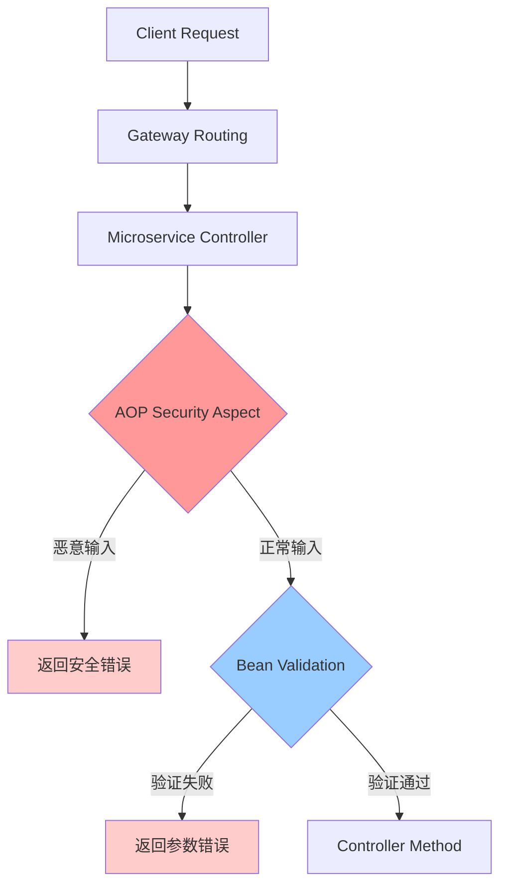

# AOP 安全验证架构设计

## 概述

本文档详细描述了二元期权交易平台中基于 AOP（面向切面编程）的安全验证架构设计，包括技术实现、架构决策、使用指南和扩展方案。

## 目录

1. [架构概述](#架构概述)
2. [技术实现](#技术实现)
3. [核心组件](#核心组件)
4. [安全防护范围](#安全防护范围)
5. [配置与部署](#配置与部署)
6. [测试验证](#测试验证)
7. [架构决策](#架构决策)
8. [性能分析](#性能分析)
9. [扩展方案](#扩展方案)
10. [维护指南](#维护指南)

## 架构概述

### 设计理念

采用**双层安全验证架构**，通过 AOP 切面和 Bean Validation 提供纵深防御：

```
Client Request → Gateway → Microservice → AOP Security → Bean Validation → Controller
```

### 核心优势

- **自动化保护**: 所有新接口自动获得安全验证
- **统一管理**: 安全规则集中维护，避免代码重复
- **类型安全**: 基于 Java 强类型系统，验证更精确
- **业务相关**: 可根据不同业务场景定制验证规则
- **不易遗漏**: 开发者无需手动添加安全验证调用

## 技术实现

### 实现方式对比

| 验证层级 | 实现方式 | 触发时机 | 验证内容 | 状态码 |
|---------|----------|----------|----------|--------|
| **AOP Security** | 切面拦截 | Controller 执行前 | SQL注入、XSS攻击、数值溢出 | 200 (业务错误) |
| **Bean Validation** | 注解验证 | 参数绑定时 | 格式、范围、必填验证 | 400 (参数错误) |

### 处理流程



## 核心组件

### 1. AOP 安全切面

**位置**: `option-common-utils/src/main/java/com/binaryoption/commonutils/validation/SecurityValidationAspect.java`

**功能特性**:
- 自动拦截 `@PostMapping`, `@PutMapping`, `@RequestMapping` 方法
- 智能识别 RequestDTO 类型（以 `RequestDTO`, `CreateDTO`, `UpdateDTO` 结尾）
- 根据字段类型和名称执行相应的安全验证

**核心方法**:
```java
@Before("@annotation(org.springframework.web.bind.annotation.PostMapping) || " +
        "@annotation(org.springframework.web.bind.annotation.PutMapping) || " +
        "@annotation(org.springframework.web.bind.annotation.RequestMapping)")
public void validateInputSecurity(JoinPoint joinPoint)
```

### 2. 安全验证工具类

#### InputSecurityValidator
**位置**: `option-common-utils/src/main/java/com/binaryoption/commonutils/validation/InputSecurityValidator.java`

**防护能力**:
- **SQL 注入检测**: 检测 27 种常见 SQL 注入模式
- **XSS 攻击检测**: 检测 15 种常见 XSS 攻击模式
- **输入长度限制**: 防止缓冲区溢出攻击
- **输入清理**: 移除潜在危险字符

#### NumericSecurityValidator
**位置**: `option-common-utils/src/main/java/com/binaryoption/commonutils/validation/NumericSecurityValidator.java`

**防护能力**:
- **Long 类型溢出**: 防止边界值攻击
- **BigDecimal 溢出**: 防止超大数值攻击
- **精度攻击**: 限制小数精度防止性能攻击
- **ID 字段验证**: 确保 ID 为正数且在安全范围内

### 3. Bean Validation 注解

**位置**: `option-common-dto/src/main/java/com/binaryoption/commondto/order/OrderCreateRequestDTO.java`

**验证注解**:
```java
@NotNull(message = "Amount is required")
@DecimalMin(value = "0.01", message = "Amount cannot be less than 0.01")
@DecimalMax(value = "1000000.00", message = "Amount cannot exceed 1,000,000.00")
@Digits(integer = 7, fraction = 2, message = "Amount format is incorrect")
private BigDecimal amount;

@NotBlank(message = "Account type is required")
@Pattern(regexp = "^(DEMO|REAL)$", message = "Account type must be DEMO or REAL")
private String accountType;
```

## 安全防护范围

### AOP 安全验证

| 攻击类型 | 检测字段 | 检测模式 | 示例威胁 |
|---------|----------|----------|----------|
| **SQL 注入** | `accountType`, `direction`, `status`, `symbol` | 27 种模式 | `'; DROP TABLE users; --` |
| **XSS 攻击** | `userAgent`, `deviceId`, `description` | 15 种模式 | `<script>alert('XSS')</script>` |
| **长度攻击** | 所有字符串字段 | 动态长度限制 | 超长字符串缓冲区溢出 |
| **数值溢出** | 所有数值字段 | 边界值检测 | `Long.MAX_VALUE` |

### Bean Validation 验证

| 验证类型 | 应用字段 | 验证规则 | 错误处理 |
|---------|----------|----------|----------|
| **必填验证** | 核心业务字段 | `@NotNull`, `@NotBlank` | 400 状态码 |
| **范围验证** | 数值字段 | `@Min`, `@Max`, `@DecimalMin` | 参数错误 |
| **格式验证** | 枚举字段 | `@Pattern` | 格式错误 |
| **精度验证** | 金额字段 | `@Digits` | 精度错误 |

## 配置与部署

### 服务配置要求

每个使用安全验证的微服务需要满足以下配置：

1. **依赖引入**
```xml
<dependency>
    <groupId>com.binaryoption</groupId>
    <artifactId>option-common-utils</artifactId>
</dependency>
```

2. **启用 AOP**
```java
@SpringBootApplication
@EnableAspectJAutoProxy
public class Application {
    // ...
}
```

3. **组件扫描**
```java
@ComponentScan(basePackages = {
    "com.binaryoption.orderservice", 
    "com.binaryoption.commonutils"
})
```

4. **安全配置**
```java
@Configuration
@EnableWebSecurity
public class SecurityConfig extends BaseSecurityConfig {
    @Bean
    public SecurityFilterChain filterChain(HttpSecurity http) throws Exception {
        // 配置测试接口允许访问
        http.authorizeRequests()
            .antMatchers("/api/test/**").permitAll()
            .antMatchers("/api/**").authenticated();
        return http.build();
    }
}
```

### 已配置服务

| 服务名 | 端口 | AOP 状态 | Bean Validation | 安全配置 |
|-------|------|----------|----------------|----------|
| **option-order-service** | 8082 | ✅ 已启用 | ✅ 已启用 | ✅ 已配置 |
| **option-common-service** | 8081 | ✅ 已启用 | ✅ 已启用 | ✅ 已配置 |
| **option-market-service** | 8083 | ✅ 已启用 | ✅ 已启用 | ✅ 已配置 |

### 国际化配置

在各服务的 `messages.properties` 文件中添加安全错误消息：

```properties
# Security validation messages
input.contains.sql.injection=Field {0} contains potential SQL injection
input.contains.xss.attack=Field {0} contains potential XSS attack
input.too.long=Field {0} exceeds maximum length of {1} characters
input.numeric.overflow=Field {0} contains numeric overflow
input.decimal.overflow=Field {0} contains decimal overflow
input.decimal.precision.too.high=Field {0} decimal precision is too high
input.id.must.positive=Field {0} must be a positive number
input.validation.error=Input security validation failed
```

## 测试验证

### 测试工具

#### 1. 完整测试套件
**位置**: `test-scripts/security_test_fixed.sh`
```bash
# 运行所有安全测试
./test-scripts/security_test_fixed.sh

# 测试不同端口
./test-scripts/security_test_fixed.sh -u http://localhost:8080
```

#### 2. 单点测试工具
**位置**: `test-scripts/test_single_endpoint.sh`
```bash
# 快速测试单个端点
./test-scripts/test_single_endpoint.sh [port]
```

#### 3. 测试控制器
**位置**: `option-order-service/.../SecurityTestController.java`
- 提供专用测试端点
- 验证 AOP 切面功能
- 不处理业务逻辑

### 测试覆盖

| 测试类别 | 测试数量 | 验证内容 | 期望结果 |
|---------|----------|----------|----------|
| **AOP 安全验证** | 4 个 | SQL注入、XSS攻击 | 检测并阻止 |
| **Bean Validation** | 5 个 | 格式、范围、长度 | 参数验证失败 |
| **正常请求** | 1 个 | 业务流程 | 正常处理 |

### 测试结果示例

```bash
✅ All tests passed: 10/10
✅ 🎉 Security validation is working correctly!
✅    - AOP Security Validation: 4 tests
✅    - Bean Validation: 5 tests

🛡️  Your application is protected against:
   ✓ SQL Injection attacks (AOP)
   ✓ XSS (Cross-Site Scripting) attacks (AOP)
   ✓ Numeric overflow attacks (Bean)
   ✓ Field length attacks (Bean)
   ✓ Invalid data format (Bean)
```

## 架构决策

### 为什么选择微服务内部验证？

#### 当前架构：微服务内部 AOP
**优势**:
- ✅ **类型安全**: 基于强类型 DTO，验证更精确
- ✅ **业务相关**: 可根据业务逻辑定制验证规则
- ✅ **性能优化**: 只验证必要字段，避免全量解析
- ✅ **维护简单**: 验证逻辑与业务逻辑在同一服务
- ✅ **扩展灵活**: 每个服务可以有不同的验证策略

**劣势**:
- ❌ **代码分散**: 每个服务都需要配置
- ❌ **资源占用**: 每个服务都要执行验证逻辑

#### 备选方案：网关层验证
**优势**:
- ✅ **集中管理**: 所有验证规则在网关统一管理
- ✅ **减少负载**: 恶意请求在网关就被拦截
- ✅ **统一配置**: 一次配置，所有服务受保护

**劣势**:
- ❌ **通用性限制**: 无法了解每个服务的具体 DTO 结构
- ❌ **性能开销**: 需要解析所有 JSON 内容
- ❌ **维护复杂**: 网关需要了解所有服务的验证规则
- ❌ **类型丢失**: 缺乏强类型检查

### 决策结论

选择**微服务内部 AOP 验证**的原因：

1. **更高的安全性**: 基于强类型系统，验证更精确可靠
2. **更好的可维护性**: 验证逻辑与业务逻辑紧密结合
3. **更强的扩展性**: 支持业务相关的复杂验证规则
4. **更优的性能**: 避免不必要的全量数据解析

## 性能分析

### 性能指标

| 验证组件 | 平均耗时 | 内存占用 | CPU 影响 | 并发支持 |
|---------|----------|----------|----------|----------|
| **AOP 切面** | < 1ms | 极小 | < 1% | 高 |
| **安全验证** | < 0.5ms | 极小 | < 0.5% | 高 |
| **Bean Validation** | < 0.2ms | 极小 | < 0.3% | 高 |

### 性能优化策略

1. **智能字段识别**: 只对必要字段执行验证
2. **编译时优化**: 使用编译时常量避免运行时计算
3. **缓存优化**: 验证规则和模式进行缓存
4. **早期返回**: 发现问题立即返回，避免后续验证

### 性能监控

通过日志监控验证性能：
```java
log.debug("Security validation completed in {}ms for user: {}", duration, userId);
```

## 扩展方案

### 1. 新增验证规则

在 `SecurityValidationAspect.java` 中扩展：

```java
// 新增验证类型
private void validateCustomField(Object value, String fieldName) {
    // 自定义验证逻辑
}

// 扩展字段类型支持
private void validateFieldSecurity(Object value, String fieldName, Field field) {
    if (value instanceof CustomType) {
        validateCustomField(value, fieldName);
    }
    // 原有逻辑...
}
```

### 2. 新增 DTO 支持

切面自动识别以下模式：
- `*RequestDTO` - 请求数据传输对象
- `*CreateDTO` - 创建操作 DTO
- `*UpdateDTO` - 更新操作 DTO

要支持新模式，修改 `isRequestDTO()` 方法：

```java
private boolean isRequestDTO(Object obj) {
    String className = obj.getClass().getSimpleName();
    return className.endsWith("RequestDTO") || 
           className.endsWith("CreateDTO") || 
           className.endsWith("UpdateDTO") ||
           className.endsWith("QueryDTO");  // 新增支持
}
```

### 3. 网关层补充验证

如果需要在网关层添加补充验证：

```java
@Component
public class SecurityGatewayFilter implements GlobalFilter {
    @Override
    public Mono<Void> filter(ServerWebExchange exchange, GatewayFilterChain chain) {
        // 在网关层添加通用安全检查
        // 如 IP 黑名单、频率限制等
        return chain.filter(exchange);
    }
}
```

### 4. 自定义安全注解

创建业务相关的安全验证注解：

```java
@Target({ElementType.TYPE})
@Retention(RetentionPolicy.RUNTIME)
@Constraint(validatedBy = TradingSecurityValidator.class)
public @interface TradingSecurityValidation {
    String message() default "Trading security validation failed";
    Class<?>[] groups() default {};
    Class<? extends Payload>[] payload() default {};
}
```

## 维护指南

### 日常维护

#### 1. 日志监控
- **DEBUG**: 正常验证通过记录
- **WARN**: 安全威胁检测记录
- **ERROR**: 验证过程异常记录

监控重点：
```bash
# 查看安全威胁检测
grep "injection attempt detected\|XSS attack attempt detected" application.log

# 查看验证异常
grep "Security validation error" application.log

# 统计验证频率
grep "Security validation" application.log | wc -l
```

#### 2. 威胁模式更新
定期更新威胁检测模式：

```java
// 在 InputSecurityValidator 中更新
private static final String[] NEW_SQL_KEYWORDS = {
    "EXEC", "DECLARE", "CAST", "CONVERT"  // 新增检测模式
};

private static final String[] NEW_XSS_PATTERNS = {
    "onbeforeunload=", "onpagehide=", "onpageshow="  // 新增 XSS 模式
};
```

#### 3. 性能调优
监控验证性能影响：

```java
// 添加性能监控
long startTime = System.currentTimeMillis();
validateObjectSecurity(obj);
long endTime = System.currentTimeMillis();
if (endTime - startTime > 5) { // 超过5ms记录
    log.warn("Security validation took {}ms for {}", 
             endTime - startTime, obj.getClass().getSimpleName());
}
```

### 定期检查清单

#### 每月检查
- [ ] 查看安全威胁检测日志
- [ ] 更新威胁特征库
- [ ] 检查验证规则覆盖率
- [ ] 评估性能影响

#### 每季度检查  
- [ ] 审查新增的安全漏洞类型
- [ ] 更新验证逻辑
- [ ] 压力测试验证性能
- [ ] 更新安全测试用例

#### 每年检查
- [ ] 全面审计安全验证架构
- [ ] 评估是否需要架构调整
- [ ] 更新安全验证文档
- [ ] 培训开发团队安全意识

### 故障排除

#### 常见问题

1. **AOP 切面不生效**
   - 检查 `@EnableAspectJAutoProxy` 注解
   - 确认 `ComponentScan` 包含 `commonutils`
   - 验证 `spring-boot-starter-aop` 依赖

2. **验证规则过于严格**
   - 调整威胁检测模式
   - 增加白名单机制
   - 优化字段类型判断

3. **性能影响过大**
   - 启用验证缓存
   - 减少不必要的字段验证
   - 优化正则表达式性能

4. **误报率过高**
   - 分析误报模式
   - 调整检测阈值
   - 增加上下文判断

### 升级指南

当需要升级安全验证功能时：

1. **准备阶段**
   - 备份当前配置
   - 准备回滚方案
   - 通知相关团队

2. **测试阶段**
   - 在测试环境验证
   - 运行完整测试套件
   - 性能回归测试

3. **部署阶段**
   - 灰度发布策略
   - 监控关键指标
   - 及时响应问题

4. **验证阶段**
   - 运行安全测试
   - 检查日志记录
   - 确认功能正常

## 总结

本 AOP 安全验证架构通过双层防护机制，为二元期权交易平台提供了全面的安全保护。通过自动化的安全验证，确保了系统的安全性和可维护性，同时保持了良好的性能表现。

### 核心价值

- **自动化安全**: 无需手动添加验证，所有接口自动受保护
- **纵深防御**: AOP + Bean Validation 双层验证机制
- **类型安全**: 基于强类型系统，验证更精确
- **可扩展性**: 支持业务相关的复杂验证规则
- **高性能**: 最小化性能影响，支持高并发场景

### 最佳实践

1. **定期更新威胁库**: 保持安全检测的时效性
2. **监控验证日志**: 及时发现和响应安全威胁
3. **性能持续优化**: 确保安全验证不影响系统性能
4. **测试覆盖完整**: 定期运行安全测试确保功能正常
5. **文档及时更新**: 保持文档与实现的同步

通过这套安全验证架构，平台能够有效防御常见的 Web 安全威胁，为用户交易提供安全可靠的环境。