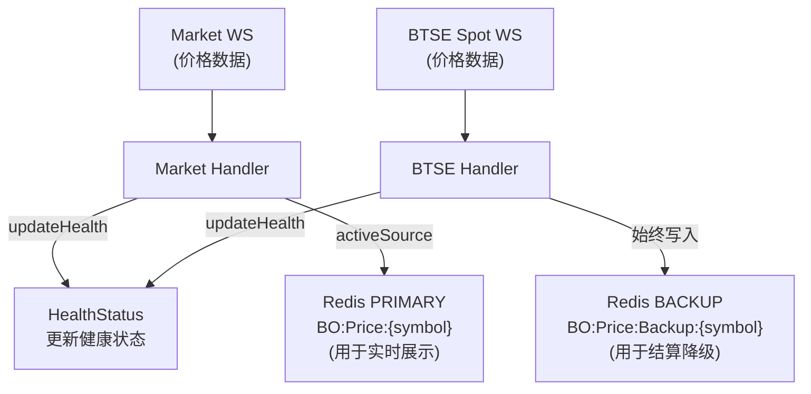

# 报价数据源优化方案

## 1. 业务背景

### 1.1 现状问题
- **单点故障风险**: 当前报价系统仅依赖Market WebSocket数据源
- **可用性不足**: 单一数据源出现异常时，整个报价系统无法正常工作
- **数据可靠性**: 缺少备用数据源，无法应对网络抖动、服务宕机等异常情况

### 1.2 优化目标
- **高可用性**: 支持多数据源，单一数据源故障不影响业务
- **自动切换**: 主数据源故障时自动切换到备用数据源
- **自动回切**: 主数据源恢复时自动切回，保证数据质量
- **平滑切换**: 数据源切换时无感知，不影响用户体验
- **监控告警**: 完善的监控和日志，便于运维

## 2. 架构设计

### 2.1 整体架构


### 2.2 核心组件

| 组件 | 职责 |
|------|------|
| BtseWebSocketClient | 主数据源，连接Market WebSocket |
| BtseSpotWebSocketClient | 备用数据源，连接BTSE Spot WebSocket |
| PriceSourceManager | 管理数据源，执行健康检查和切换策略 |

### 2.3 数据源配置

| 数据源 | 类型 | 优先级 | 说明 |
|--------|------|--------|------|
| Market WebSocket | PRIMARY | 100 | 主数据源，优先使用 |
| BTSE Spot WebSocket | BACKUP | 50 | 备用数据源，故障时切换 |

### 2.4 健康检查参数

| 参数 | 默认值 | 说明 |
|------|--------|------|
| 检查间隔 | 5秒 | 每5秒执行一次健康检查 |
| 最大连续失败次数 | 3次 | 连续3次健康检查失败则切换（共15秒） |
| 回切时间点 | 0/15/30/45分 | 只在轮次边界时间点才允许回切主数据源 |

## 3. 数据处理流程

### 3.1 数据接收流程



### 3.2 Redis缓存设计

| 缓存Key | 数据来源 | 用途 | 说明 |
|---------|----------|------|------|
| BO:Price:{symbol} | activeSource | 实时行情展示 | 只有当前活跃数据源写入 |
| BO:Price:Backup:{symbol} | BACKUP源 | 结算降级 | 备用源始终写入，作为结算备份 |

**写入策略**：
- PRIMARY源：写入 `BO:Price:{symbol}`（当PRIMARY是activeSource时）
- BACKUP源：始终写入 `BO:Price:Backup:{symbol}`，同时当BACKUP是activeSource时也写入 `BO:Price:{symbol}`

### 3.3 健康检查流程


### 3.4 切换策略

#### 切换到备用源

| 项目 | 说明 |
|------|------|
| **触发条件** | 连续3次健康检查失败（15秒内无有效数据） |
| **检查逻辑** | 每5秒检查一次 → 失败则 consecutiveFailures++ → 当 >= 3 时立即切换 |
| **切换执行** | 1. 切换activeSource指针到BACKUP<br/>2. 记录切换日志和时间戳<br/>3. 发送告警通知 |

#### 回切到主数据源

| 项目 | 说明 |
|------|------|
| **触发条件** | 必须同时满足：<br/>1. 当前正在使用备用源<br/>2. 主数据源恢复健康（consecutiveFailures = 0）<br/>3. 当前时间是轮次边界（分钟数 % 15 == 0，即 0/15/30/45 分） |
| **设计原因** | - 轮次周期为15分钟，在轮次边界切换可确保当前轮次数据完整<br/>- 避免轮次中途切换导致的数据不一致<br/>- 最长等待时间不超过15分钟 |
| **回切执行** | 1. 切换activeSource指针到PRIMARY<br/>2. 记录回切日志和时间戳<br/>3. 发送恢复通知 |

#### 时间线示例


### 3.5 结算降级策略

#### 结算价格获取流程


#### 人工干预方案

当两个数据源都无法获取价格时，支持手工设置结算价格：

```sql
UPDATE bo_trading_round
SET end_price = {价格}, updated_at = NOW()
WHERE id = {轮次ID} AND status = 'LOCKED';
```

| 注意事项 | 说明 |
|----------|------|
| 状态限制 | 仅限 status = 'LOCKED' 的轮次可以手工设置 |
| 价格验证 | 设置前需确认价格来源的可靠性（如交易所官网、第三方API） |
| 审计追溯 | 操作需记录日志，便于审计追溯 |
| 自动继续 | 设置完成后，结算任务会自动检测到 end_price 并继续结算 |

| 降级层级 | 数据来源 | 说明 |
|----------|----------|------|
| Level 1 | BO:Price:{symbol} | 主数据源（activeSource），正常情况 |
| Level 2 | BO:Price:Backup:{symbol} | 备用数据源，主源无数据时自动降级 |
| Level 3 | bo_trading_round.end_price | 人工设置，两个数据源都无数据时 |

## 4. 配置管理

### 4.1 配置项（application.yml）

| 配置项 | 默认值 | 说明 |
|--------|--------|------|
| price-source.backup.enabled | true | 是否启用备用数据源 |
| price-source.backup.url | wss://ws.btse.com/ws/spot | 备用数据源地址 |

## 5. 监控和日志

### 5.1 关键日志

| 事件 | 日志级别 | 说明 |
|------|----------|------|
| 数据源启动 | INFO | Price source started: {name}, priority: {priority} |
| 健康检查异常 | WARN | Active source unhealthy: {name}, reason: {reason} |
| 数据源切换 | INFO | Price source switched: {old} -> {new} |
| 自动回切 | INFO | Auto switch back to primary source: {name} |
| 无可用数据源 | ERROR | No healthy price source available! |

### 5.2 监控指标

| 指标名称 | 类型 | 说明 |
|----------|------|------|
| price_source_active | Gauge | 当前活跃数据源 |
| price_source_health | Gauge | 数据源健康状态 (1=健康, 0=不健康) |
| price_source_data_age_seconds | Gauge | 数据延迟（秒） |
| price_source_switch_total | Counter | 切换次数 |
| price_source_consecutive_failures | Gauge | 连续失败次数 |


---

**文档版本**: v1.3
**创建时间**: 2025-11-28
**更新时间**: 2025-11-29
**状态**: 方案讨论中
