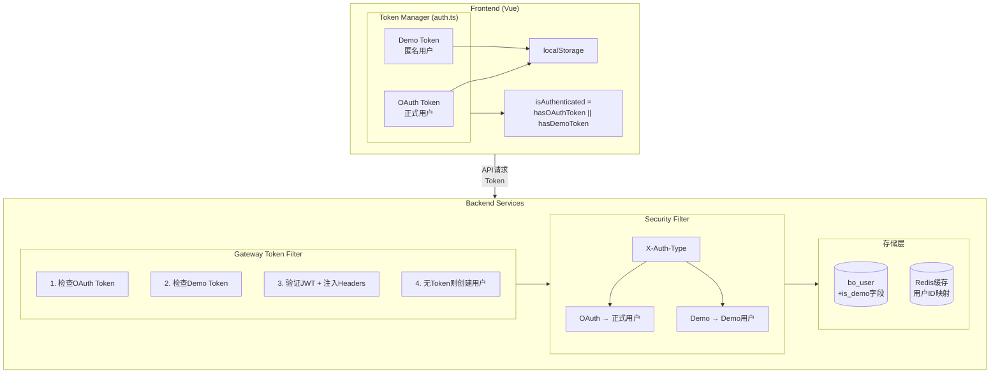
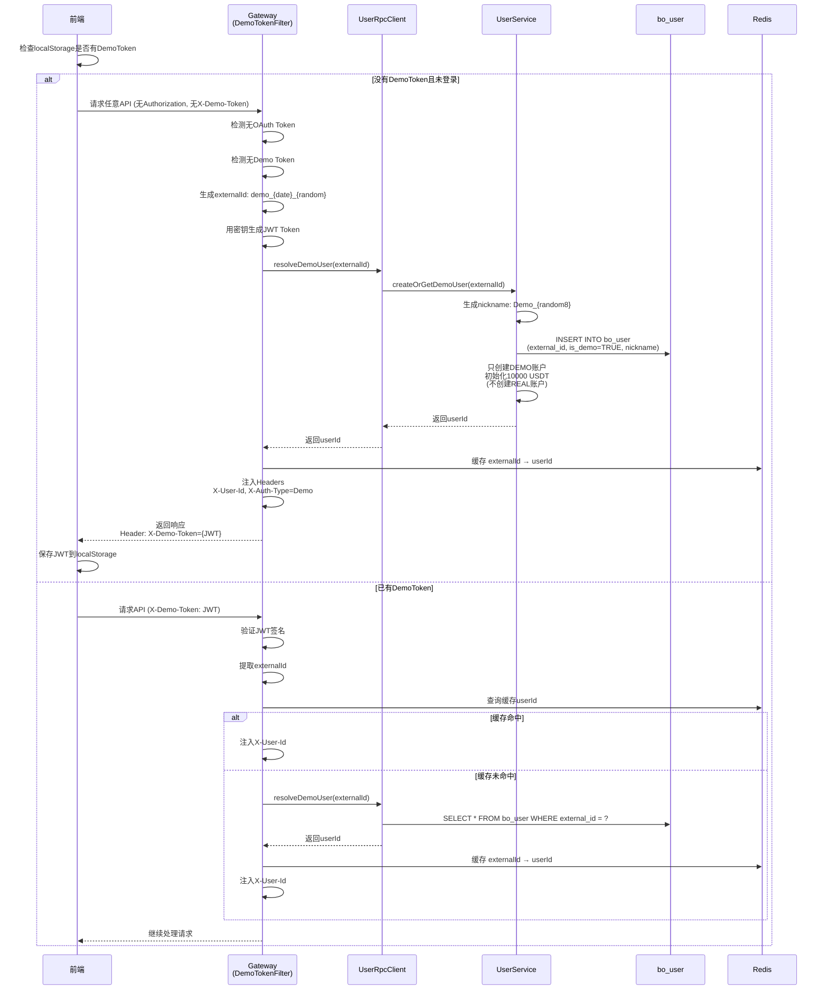
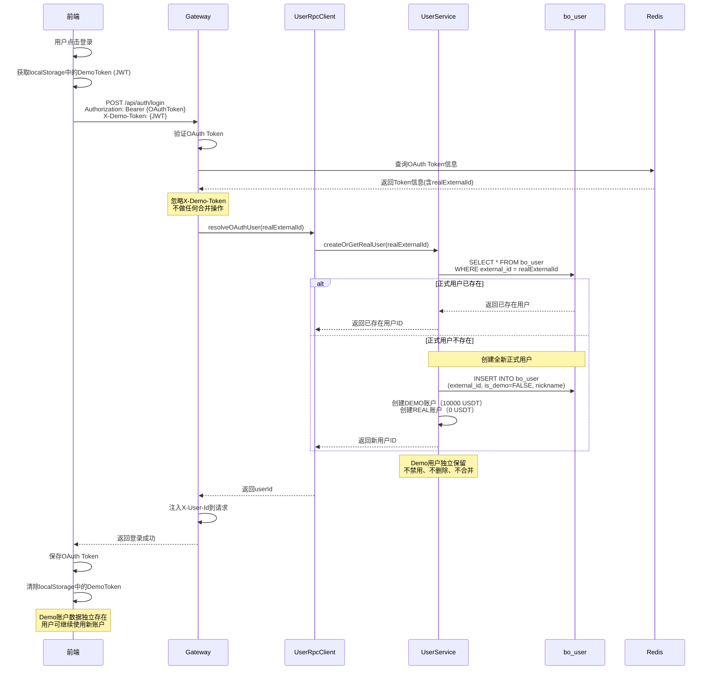
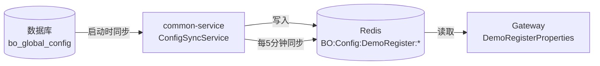
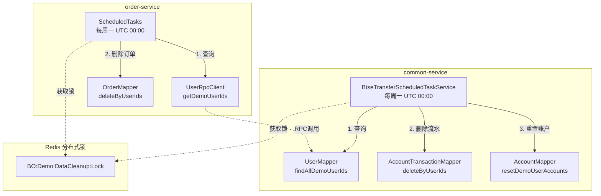

# Demo匿名交易方案

## 1. 业务背景

### 1.1 现状问题
- **注册门槛高**: 用户必须先注册才能体验Demo交易，导致流失率高
- **体验延迟**: 新用户无法立即体验产品核心功能
- **转化率低**: 部分用户因为注册流程繁琐而放弃使用

### 1.2 优化目标
- **即开即用**: 未登录用户可以直接进行Demo交易
- **独立账户**: 登录后创建全新正式用户，Demo账户独立保留
- **简单清晰**: 无数据合并，避免复杂的转换逻辑

## 2. 架构设计

### 2.1 整体架构



### 2.2 数据库设计

#### 2.2.1 用户表扩展 (bo_user)

| 字段 | 类型 | 说明 |
|------|------|------|
| is_demo | BOOLEAN | Demo用户标识（TRUE=Demo用户，FALSE=正式用户）|

**external_id用途**：
- **Demo用户**: 后端生成的标识（例如：`demo_20251128_abc123`）
- **正式用户**: OAuth提供的external_id

#### 2.2.2 账户创建规则

| 用户类型 | DEMO账户 | REAL账户 | 说明 |
|---------|----------|----------|------|
| Demo用户（首次访问） | ✅ 创建（10000 USDT） | ❌ 不创建 | 匿名用户只能使用Demo交易 |
| 正式用户（直接登录） | ✅ 创建（10000 USDT） | ✅ 创建（0 USDT） | 正式用户可以使用两种账户 |
| Demo用户登录后 | ❌ Demo用户独立保留 | ✅ 创建全新正式用户 | 不做合并，创建全新用户 |

### 2.3 Token设计（后端生成JWT）

#### 2.3.1 JWT结构

```
Header.Payload.Signature

Header:  { "alg": "HS256", "typ": "JWT" }
Payload: { "type": "demo", "sub": "demo_20251128_abc123", "iat": 1732752000 }
Signature: HMAC-SHA256(base64(Header) + "." + base64(Payload), SECRET_KEY)
```

**Payload字段**：
- `type`: 固定为 "demo"，标识Token类型
- `sub`: external_id，格式为 `demo_{date}_{random}`
- `iat`: 签发时间戳

#### 2.3.2 生成流程

```
用户首次访问（无Token）
    ↓
Gateway检测无Token
    ↓
后端生成externalId: demo_20251128_abc123
    ↓
后端用密钥签名生成JWT
    ↓
创建Demo用户，返回JWT给前端
    ↓
前端保存到localStorage，后续请求携带
```

#### 2.3.3 验证流程

```
前端请求携带: X-Demo-Token: eyJhbGci...
    ↓
Gateway用密钥验证JWT签名
    ↓
签名有效 → 提取externalId → 查询userId
签名无效 → 拒绝请求
```

### 2.4 核心流程设计

#### 2.4.1 Demo用户创建流程



#### 2.4.2 Demo用户登录流程（不合并，创建新用户）



#### 2.4.3 Demo用户下单流程

```
Demo用户下单
    │
    ├─> 1. 前端携带JWT DemoToken
    │      POST /api/order/create
    │      Headers: { X-Demo-Token: JWT }
    │      Body: { symbol, direction, amount, duration }
    │
    ├─> 2. Gateway验证JWT并注入Headers
    │      ├─> 检测到X-Demo-Token
    │      ├─> 验证JWT签名
    │      ├─> 提取external_id
    │      ├─> 查询bo_user获取userId和isDemo
    │      └─> 注入Headers到请求:
    │            - X-User-Id: {userId}
    │            - X-Auth-Type: Demo
    │
    ├─> 3. OrderService检查账户类型
    │      ├─> 从Header获取X-Auth-Type
    │      ├─> 如果AuthType=Demo且accountType=REAL
    │      │      └─> 拒绝：Demo用户不能创建Real订单
    │      └─> 如果AuthType=Demo且accountType=DEMO
    │             └─> 允许：继续创建订单
    │
    └─> 4. 创建订单
           └─> 正常订单流程
```

## 3. 前端实现

### 3.1 认证状态管理 (auth.ts)

```typescript
// 状态
const token = ref<string>('')           // OAuth token（正式用户）
const demoToken = ref<string>('')       // Demo token（匿名用户）
const hasOAuthToken = ref<boolean>(false)

// 计算属性 - isAuthenticated 统一判断
const isAuthenticated = computed(() => {
  return hasOAuthToken.value || !!demoToken.value || !!localStorage.getItem('demo_token')
})

const isDemo = computed(() => {
  return !hasOAuthToken.value && (!!demoToken.value || !!localStorage.getItem('demo_token'))
})
```

**关键设计**：
- `isAuthenticated` 改为计算属性，自动包含 OAuth 和 Demo 判断
- 其他组件无需修改，继续使用 `authStore.isAuthenticated`

### 3.2 HTTP请求处理 (http.ts)

```typescript
// 请求拦截 - 添加Demo Token头
if (needAuth) {
  const demoToken = authStore.getDemoToken()
  if (demoToken) {
    headers['X-Demo-Token'] = demoToken
  }
}

// 响应拦截 - 保存服务端返回的Demo Token
const newDemoToken = response.headers.get('X-Demo-Token')
if (newDemoToken) {
  authStore.setDemoToken(newDemoToken)
}
```

### 3.3 iframe通信 (App.vue)

```typescript
function handleAuthentication(payload: { token: string; demoToken?: string }) {
  // 设置OAuth token（可能为空，表示Demo用户）
  authStore.setToken(token)

  // 如果父页面传递了Demo token，设置它
  if (demoToken) {
    authStore.setDemoToken(demoToken)
  }

  // 无论是否有OAuth token，都调用profile获取用户信息
  fetchProfile()
}
```

### 3.4 文件修改清单（前端）

| 文件 | 修改内容 |
|------|----------|
| `src/store/auth.ts` | Demo token管理，isAuthenticated改为计算属性 |
| `src/api/http.ts` | 请求添加X-Demo-Token，响应保存Demo Token |
| `src/App.vue` | 认证消息处理，profile获取 |
| `src/utils/iframeComm.ts` | 消息类型支持demoToken字段 |
| `public/iframe-test.html` | 三种认证模式测试（OAuth/Demo已有/Demo新建） |

## 4. 后端实现

### 4.1 Gateway过滤器

**OAuthTokenFilter.java** - 处理OAuth和Demo两种认证：
- 有OAuth Token → 走OAuth流程，忽略Demo Token
- 无OAuth但有Demo Token → 验证JWT，注入用户信息
- 无任何Token → 创建新Demo用户，返回JWT

**关键Header**：
- `X-User-Id`: 用户ID
- `X-Username`: 用户名
- `X-Auth-Type`: 认证类型（OAuth/Demo）

### 4.2 Security过滤器

**OAuthAuthenticationFilter.java** - 设置Spring Security上下文：
```java
// 支持OAuth和Demo两种认证类型
if (userId != null && username != null &&
    ("OAuth".equals(authType) || "Demo".equals(authType))) {
    // 创建认证token并设置到SecurityContext
}
```

### 4.3 文件修改清单（后端）

| 文件 | 修改内容 |
|------|----------|
| `option-gateway/.../OAuthTokenFilter.java` | 支持Demo Token验证和用户创建 |
| `option-security-base/.../OAuthAuthenticationFilter.java` | 支持Demo认证类型 |
| `option-common-service/.../UserService.java` | createOrGetDemoUser方法 |
| `option-common-utils/.../DemoTokenUtil.java` | JWT生成验证工具 |

## 5. 防止垃圾账号（已完成）

> ✅ **状态**: 已完成 - 2025-12-01

### 5.1 限制策略

| 策略 | 配置项 | 默认值 | 说明 |
|------|--------|--------|------|
| IP频率限制 | demo.register.ip-limit-per-hour | 5 | 同一IP每小时最多创建N个Demo账号 |
| 系统每日总量限制 | demo.register.daily-limit | 1000 | 单日整个系统最多创建N个Demo账号 |
| 限流开关 | demo.register.rate-limit-enabled | true | 是否启用限流 |

### 5.2 实现细节

**1. 配置存储架构**:



**2. Redis Key 常量** (`CacheConstants.java`):
```java
// 配置Key（common-service写入，Gateway读取）
String DEMO_REGISTER_RATE_LIMIT_ENABLED_KEY = "BO:Config:DemoRegister:RateLimitEnabled";
String DEMO_REGISTER_IP_LIMIT_PER_HOUR_KEY = "BO:Config:DemoRegister:IpLimitPerHour";
String DEMO_REGISTER_DAILY_LIMIT_KEY = "BO:Config:DemoRegister:DailyLimit";

// 计数器Key（Gateway读写）
static String buildDemoRegisterDailyKey(String date);  // BO:Demo:Register:Daily:{yyyyMMdd}
static String buildDemoRegisterIpKey(String ip, String hourKey);  // BO:Demo:Register:IP:{ip}:{yyyyMMddHH}
```

**3. common-service 配置同步** (`ConfigSyncService.java`):
- 应用启动时从数据库读取配置并写入 Redis
- 每5分钟定时同步，确保配置变更生效
- 支持手动刷新接口

**4. Gateway 配置读取** (`DemoRegisterProperties.java`):
- 从 Redis 读取配置
- Redis 不可用时使用默认值

**5. Gateway限流逻辑** (`OAuthTokenFilter.java`):
```
创建Demo用户前检查
    ↓
1. 检查系统每日总量
   Redis Key: BO:Demo:Register:Daily:{yyyyMMdd}
   如果 >= daily_limit → 返回 429 Too Many Requests
    ↓
2. 检查IP频率
   Redis Key: BO:Demo:Register:IP:{ip}:{yyyyMMddHH}
   如果 >= ip_limit_per_hour → 返回 429 Too Many Requests
    ↓
3. 通过检查 → 创建用户 → Redis计数器+1
```

**6. 数据库配置** (`sql/demo_rate_limit_config.sql`):
```sql
INSERT INTO bo_global_config (config_key, config_value, config_type, config_group, description, enabled, sort_order) VALUES
('demo.register.ip_limit_per_hour', '5', 'INTEGER', 'DEMO_REGISTER', 'Max Demo accounts per IP per hour', 1, 1),
('demo.register.daily_limit', '1000', 'INTEGER', 'DEMO_REGISTER', 'Max Demo accounts per day (system-wide)', 1, 2),
('demo.register.rate_limit_enabled', '1', 'BOOLEAN', 'DEMO_REGISTER', 'Enable Demo registration rate limiting', 1, 3);
```

**7. 修改配置生效流程**:
1. 修改数据库 `bo_global_config` 表中的配置值
2. 等待最多5分钟自动同步，或重启 common-service 立即生效
3. Gateway 下次读取时获取新配置

## 6. Demo数据定期清理

> ⏳ **状态**: 待开发

### 6.1 清理策略

| 策略 | 执行时间 | 说明 |
|------|----------|------|
| 周期性清理 | 每周一 UTC 00:00:00 | 清理所有Demo用户的交易数据，重置账户余额 |

### 6.2 清理范围

| 数据类型 | 表名 | 清理操作 | 负责服务 |
|---------|------|----------|----------|
| 订单记录 | bo_option_order | DELETE | order-service |
| 账户流水 | bo_account_transaction | DELETE | common-service |
| 账户余额 | bo_account | RESET | common-service |
| 用户记录 | bo_user | 保留 | - |

### 6.3 架构设计

**设计原则**: 各服务独立清理自己管理的数据，无跨服务RPC调用



### 6.4 执行流程

**common-service (账户/流水清理)**:
```
每周一 UTC 00:00:00
    ↓
1. 获取分布式锁 (BO:Demo:DataCleanup:Lock)
   TTL: 30分钟
    ↓
2. 查询 Demo 用户 ID 列表
   SELECT id FROM bo_user WHERE is_demo = TRUE
    ↓
3. 如果用户列表为空 → 结束
    ↓
4. 删除账户流水
   DELETE FROM bo_account_transaction WHERE user_id IN (...)
    ↓
5. 重置账户余额
   UPDATE bo_account SET balance=10000, frozen_balance=0, ...
    ↓
6. 记录清理结果日志
```

**order-service (订单清理)**:
```
每周一 UTC 00:01:00 (延迟1分钟，确保账户先清理)
    ↓
1. 获取分布式锁 (BO:Demo:Order:Cleanup:Lock)
   TTL: 30分钟
    ↓
2. 调用 RPC 获取 Demo 用户 ID 列表
   GET /rpc/borc/user/demo-user-ids
    ↓
3. 如果用户列表为空 → 结束
    ↓
4. 删除订单数据
   DELETE FROM bo_option_order WHERE user_id IN (...)
    ↓
5. 记录清理结果日志
```

### 6.5 实现细节

#### 6.5.1 Redis Key 常量 (`CacheConstants.java`)

```java
/**
 * Demo data cleanup task lock (common-service: account & transaction)
 * TTL: 30 minutes
 */
String LOCK_DEMO_DATA_CLEANUP = "BO:Demo:DataCleanup:Lock";

/**
 * Demo order cleanup task lock (order-service: orders)
 * TTL: 30 minutes
 */
String LOCK_DEMO_ORDER_CLEANUP = "BO:Demo:Order:Cleanup:Lock";
```

#### 6.5.2 Mapper 新增方法

**UserMapper.xml** (common-service):
```xml
<!-- Get all demo user IDs -->
<select id="findAllDemoUserIds" resultType="java.lang.Long">
    SELECT id FROM bo_user WHERE is_demo = TRUE
</select>
```

**AccountTransactionMapper.xml** (common-service):
```xml
<!-- Delete transactions by user IDs -->
<delete id="deleteByUserIds">
    DELETE FROM bo_account_transaction
    WHERE user_id IN
    <foreach collection="userIds" item="userId" open="(" separator="," close=")">
        #{userId}
    </foreach>
</delete>
```

**AccountMapper.xml** (common-service):
```xml
<!-- Reset demo user accounts to initial state -->
<update id="resetDemoUserAccounts">
    UPDATE bo_account
    SET balance = 10000.00,
        frozen_balance = 0,
        total_deposit = 10000.00,
        total_withdraw = 0,
        total_profit = 0,
        total_loss = 0,
        reset_count = reset_count + 1,
        last_reset_time = CURRENT_TIMESTAMP,
        update_time = CURRENT_TIMESTAMP
    WHERE user_id IN
    <foreach collection="userIds" item="userId" open="(" separator="," close=")">
        #{userId}
    </foreach>
</update>
```

**OrderMapper.xml** (order-service):
```xml
<!-- Delete orders by user IDs -->
<delete id="deleteByUserIds">
    DELETE FROM bo_option_order
    WHERE user_id IN
    <foreach collection="userIds" item="userId" open="(" separator="," close=")">
        #{userId}
    </foreach>
</delete>
```

#### 6.5.3 RPC 接口 (`UserRpcController.java`)

```java
/**
 * Get all demo user IDs (for order-service cleanup)
 */
@GetMapping("/demo-user-ids")
@Operation(summary = "Get demo user IDs", description = "Get all demo user IDs for cleanup")
public Result<List<Long>> getDemoUserIds() {
    List<Long> userIds = userMapper.findAllDemoUserIds();
    return Result.success(userIds);
}
```

#### 6.5.4 common-service 定时任务 (`BtseTransferScheduledTaskService.java`)

```java
/**
 * Demo data weekly cleanup task (account & transaction)
 * Runs every Monday at UTC 00:00:00
 */
@Scheduled(cron = "0 0 0 * * MON", zone = "UTC")
@DistributedScheduled(
    lockKey = CacheConstants.LOCK_DEMO_DATA_CLEANUP,
    expireTime = 30,
    timeUnit = TimeUnit.MINUTES,
    description = "Demo account/transaction weekly cleanup"
)
public void executeDemoDataCleanupTask() {
    log.info("Starting demo data cleanup (account/transaction)");

    try {
        // 1. Get demo user IDs
        List<Long> demoUserIds = userMapper.findAllDemoUserIds();

        if (demoUserIds == null || demoUserIds.isEmpty()) {
            log.info("No demo users found, cleanup skipped");
            return;
        }

        log.info("Found {} demo users for cleanup", demoUserIds.size());

        // 2. Delete transactions
        int transactionsDeleted = accountTransactionMapper.deleteByUserIds(demoUserIds);
        log.info("Deleted {} transactions for demo users", transactionsDeleted);

        // 3. Reset accounts
        int accountsReset = accountMapper.resetDemoUserAccounts(demoUserIds);
        log.info("Reset {} accounts for demo users", accountsReset);

        log.info("Demo data cleanup completed - transactions: {}, accounts reset: {}",
                transactionsDeleted, accountsReset);

    } catch (Exception e) {
        log.error("Demo data cleanup task failed", e);
    }
}
```

#### 6.5.5 order-service 定时任务 (`ScheduledTasks.java`)

```java
/**
 * Demo order weekly cleanup task
 * Runs every Monday at UTC 00:01:00 (1 min after account cleanup)
 */
@Scheduled(cron = "0 1 0 * * MON", zone = "UTC")
@DistributedScheduled(
    lockKey = CacheConstants.LOCK_DEMO_ORDER_CLEANUP,
    expireTime = 30,
    timeUnit = TimeUnit.MINUTES,
    description = "Demo order weekly cleanup"
)
public void executeDemoOrderCleanupTask() {
    log.info("Starting demo order cleanup");

    try {
        // 1. Get demo user IDs via RPC
        List<Long> demoUserIds = userRpcClient.getDemoUserIds();

        if (demoUserIds == null || demoUserIds.isEmpty()) {
            log.info("No demo users found, order cleanup skipped");
            return;
        }

        log.info("Found {} demo users for order cleanup", demoUserIds.size());

        // 2. Delete orders
        int ordersDeleted = orderMapper.deleteByUserIds(demoUserIds);
        log.info("Demo order cleanup completed - deleted {} orders", ordersDeleted);

    } catch (Exception e) {
        log.error("Demo order cleanup task failed", e);
    }
}
```

### 6.6 文件修改清单

```
BinaryOption/
├── option-common-utils/
│   └── src/main/java/com/binaryoption/commonutils/constants/
│       └── CacheConstants.java                              # 添加 LOCK_DEMO_DATA_CLEANUP, LOCK_DEMO_ORDER_CLEANUP
│
├── option-common-service/
│   └── src/main/
│       ├── java/com/binaryoption/commonservice/
│       │   ├── mapper/
│       │   │   ├── UserMapper.java                          # 添加 findAllDemoUserIds()
│       │   │   ├── AccountMapper.java                       # 添加 resetDemoUserAccounts()
│       │   │   └── AccountTransactionMapper.java            # 添加 deleteByUserIds()
│       │   ├── rpc/
│       │   │   └── UserRpcController.java                   # 添加 getDemoUserIds() 接口
│       │   └── task/
│       │       └── BtseTransferScheduledTaskService.java    # 添加账户/流水清理任务
│       └── resources/mapper/
│           ├── UserMapper.xml                               # 添加查询 Demo 用户 ID 的 SQL
│           ├── AccountMapper.xml                            # 添加重置账户的 SQL
│           └── AccountTransactionMapper.xml                 # 添加删除流水的 SQL
│
└── option-order-service/
    └── src/main/
        ├── java/com/binaryoption/orderservice/
        │   ├── mapper/
        │   │   └── OrderMapper.java                         # 添加 deleteByUserIds()
        │   └── task/
        │       └── ScheduledTasks.java                      # 添加订单清理任务
        └── resources/mapper/
            └── OrderMapper.xml                              # 添加删除订单的 SQL
```

### 6.7 注意事项

1. **执行顺序**: order-service 延迟1分钟执行，确保账户数据先清理完成
2. **独立锁**: 两个服务使用不同的分布式锁，互不阻塞
3. **时区处理**: 定时任务使用 UTC 时区，确保全球一致的清理时间
4. **数据安全**: 只清理 `is_demo=TRUE` 的用户数据，不影响正式用户
5. **容错设计**: 各服务独立执行，单个服务失败不影响另一个
6. **日志记录**: 完整记录清理过程，便于问题追踪

## 7. 总结

### 7.1 核心特点

- **改动最小**: 只需1个数据库字段（is_demo），无需索引
- **后端生成JWT**: 密钥安全保存在后端，前端只负责存储和携带
- **不做合并**: 登录时直接创建全新正式用户，Demo用户独立保留
- **逻辑简单**: 无复杂的数据合并和迁移逻辑，避免潜在问题
- **唯一性保证**: external_id作为唯一标识，nickname不要求唯一
- **前端兼容**: isAuthenticated改为计算属性，其他组件无需修改

### 7.2 Demo用户登录行为

| 场景 | 行为 | Demo用户 | 正式用户 |
|------|------|----------|----------|
| Demo用户首次登录 | 创建全新正式用户 | 独立保留 | 新创建 |
| Demo用户再次登录 | 返回已存在的正式用户 | 独立保留 | 已存在 |
| 正式用户直接登录 | 返回/创建正式用户 | 无关联 | 返回/创建 |

---

**文档版本**: v1.6
**创建时间**: 2025-11-28
**最后更新**: 2025-12-29
**状态**: 🚧 开发中

**变更记录**:
- v1.6 - 新增Demo数据定期清理设计：每周一UTC 00:00清理交易记录，重置账户余额
- v1.5 - 完成Demo注册限流功能：IP频率限制、每日总量限制
- v1.4 - 功能开发完成，补充前端实现细节，更新架构图
- v1.3 - 移除Demo转正式用户的合并逻辑，改为创建全新正式用户
