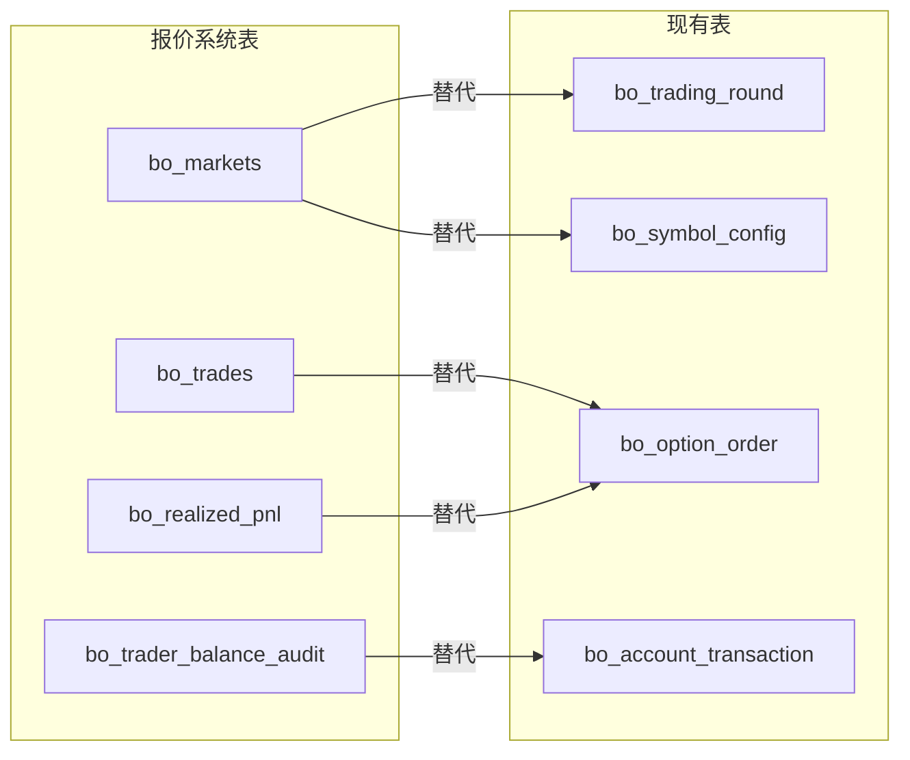

# 报价系统数据表设计 - 现有表结构对比分析

## 1. 概述

本文档分析报价系统（5. 报价系统.sql）中的数据表需求，对比现有 BinaryOption 系统的数据表结构，评估是否可以复用现有表来满足报价系统需求。

---

## 2. 报价系统数据表分析

报价系统定义了4张表：

| 表名 | 用途 |
|------|------|
| bo_markets | 市场/期权合约定义 |
| bo_trades | 交易记录 |
| bo_realized_pnl | 已实现盈亏 |
| bo_trader_balance_audit | 交易员余额审计 |

---

## 3. 逐表对比分析

### 3.1 bo_markets → 可被现有表替代 ✅

**报价系统表结构：**
```sql
CREATE TABLE bo_markets (
    market_id VARCHAR(255) PRIMARY KEY,
    underlying_asset VARCHAR(255) NOT NULL,      -- 标的资产类型 (stocks)
    duration VARCHAR(10) NOT NULL,               -- 时长 (1m, 5m)
    symbol VARCHAR(255) NOT NULL,                -- 交易对 (AAPL, GOOG)
    expiration_timestamp TIMESTAMP NOT NULL,     -- 到期时间
    strike_price DECIMAL(18, 8) NOT NULL,        -- 行权价
    option_type VARCHAR(4) NOT NULL,             -- CALL/PUT
    created_at TIMESTAMP
);
```

**现有表结构：**
```sql
-- bo_trading_round（交易轮次）
CREATE TABLE bo_trading_round (
    id BIGINT PRIMARY KEY,
    round_no VARCHAR(64) UNIQUE NOT NULL,          -- 轮次编号 → market_id
    symbol_id BIGINT NOT NULL,                     -- 交易对ID
    duration_minutes INTEGER NOT NULL,             -- 时长（分钟） → duration
    start_time TIMESTAMP NOT NULL,                 -- 开始时间
    lock_time TIMESTAMP NOT NULL,                  -- 锁定时间
    end_time TIMESTAMP NOT NULL,                   -- 结束时间 → expiration_timestamp
    start_price NUMERIC(32,16),                    -- 开盘价 → strike_price
    end_price NUMERIC(32,16),                      -- 收盘价
    status VARCHAR(16) DEFAULT 'OPEN' NOT NULL,    -- 状态
    total_up_amount NUMERIC(32,16) DEFAULT 0,
    total_down_amount NUMERIC(32,16) DEFAULT 0,
    create_time TIMESTAMP DEFAULT CURRENT_TIMESTAMP,
    update_time TIMESTAMP DEFAULT CURRENT_TIMESTAMP
);

-- bo_symbol_config（交易对配置）
CREATE TABLE bo_symbol_config (
    id BIGINT PRIMARY KEY,
    symbol VARCHAR(32) UNIQUE NOT NULL,            -- 交易对符号 → symbol
    base_currency VARCHAR(10) NOT NULL,
    quote_currency VARCHAR(10) NOT NULL,
    enabled SMALLINT DEFAULT 1,
    min_amount NUMERIC(32,16) DEFAULT 10,
    max_amount NUMERIC(32,16) DEFAULT 10000,
    btse_symbol VARCHAR(32),
    sort_order INTEGER DEFAULT 0,
    create_time TIMESTAMP DEFAULT CURRENT_TIMESTAMP,
    update_time TIMESTAMP DEFAULT CURRENT_TIMESTAMP
    -- underlying_asset 需要新增
);
```

**字段映射：**

| 报价系统字段 | 现有表 | 对应字段 | 说明 |
|-------------|--------|----------|------|
| market_id | bo_trading_round | round_no | 轮次唯一标识 |
| underlying_asset | bo_symbol_config | - | ❌ **缺失**：需要新增字段 |
| duration | bo_trading_round | duration_minutes | 时长（分钟） |
| symbol | bo_symbol_config | symbol | 交易对符号 |
| expiration_timestamp | bo_trading_round | end_time | 轮次结束时间 |
| strike_price | bo_trading_round | start_price | 开盘价（作为基准价） |
| option_type | bo_option_order | direction | UP/DOWN 对应 CALL/PUT |

**结论：** 通过 `bo_trading_round` + `bo_symbol_config` 组合可以替代，需要在 `bo_symbol_config` 中新增 `underlying_asset` 字段。

---

### 3.2 bo_trades → 可被现有表替代 ✅

**报价系统表结构：**
```sql
CREATE TABLE bo_trades (
    trade_id SERIAL PRIMARY KEY,
    trader_id INTEGER NOT NULL,                  -- 交易员ID
    market_id VARCHAR(255) NOT NULL,             -- 关联市场
    whitelabel VARCHAR(255) NOT NULL,            -- 白标标识
    trade_type VARCHAR(4) NOT NULL,              -- BUY/SELL
    quantity INTEGER NOT NULL,                   -- 数量
    price DECIMAL(18, 8) NOT NULL,               -- 价格
    probability_it_m DECIMAL(5, 4),              -- ITM概率
    created_at TIMESTAMP
);
```

**现有表结构：**
```sql
-- bo_option_order（期权订单）
CREATE TABLE bo_option_order (
    id BIGINT PRIMARY KEY,                         -- → trade_id
    user_id BIGINT NOT NULL,                       -- → trader_id
    account_type VARCHAR(16) NOT NULL,             -- 账户类型：REAL/DEMO
    symbol_id BIGINT NOT NULL,                     -- 交易对ID
    round_id BIGINT NOT NULL,                      -- → market_id
    round_no VARCHAR(64) NOT NULL,                 -- → market_id
    direction VARCHAR(8) NOT NULL,                 -- → trade_type (UP/DOWN)
    amount NUMERIC(32,16) NOT NULL,                -- → quantity
    odds NUMERIC(10,4) NOT NULL,                   -- 赔率（可计算ITM概率）
    expected_profit NUMERIC(32,16) NOT NULL,
    order_price NUMERIC(32,16) NOT NULL,           -- → price
    settle_price NUMERIC(32,16),
    status VARCHAR(16) DEFAULT 'PENDING' NOT NULL,
    profit NUMERIC(32,16),
    fee NUMERIC(32,16),
    cancel_time TIMESTAMP,
    settle_time TIMESTAMP,
    create_time TIMESTAMP DEFAULT CURRENT_TIMESTAMP,  -- → created_at
    update_time TIMESTAMP DEFAULT CURRENT_TIMESTAMP
    -- tenant_code 需要新增（对应 whitelabel）
);
```

**字段映射：**

| 报价系统字段 | 现有表 | 对应字段 | 说明 |
|-------------|--------|----------|------|
| trade_id | bo_option_order | id | 订单ID |
| trader_id | bo_option_order | user_id | 用户ID |
| market_id | bo_option_order | round_id + round_no | 关联轮次 |
| whitelabel | - | - | ❌ **缺失**：需要新增字段（如需多白标支持） |
| trade_type | bo_option_order | direction | UP/DOWN |
| quantity | bo_option_order | amount | 下注金额 |
| price | bo_option_order | order_price | 下单时价格 |
| probability_it_m | - | - | ❌ **缺失**：ITM概率可从odds计算 |

**结论：** `bo_option_order` 可以完全替代，whitelabel 如需支持需新增字段。

---

### 3.3 bo_realized_pnl → 可被现有表替代 ✅

**报价系统表结构：**
```sql
CREATE TABLE bo_realized_pnl (
    realized_pnl_id SERIAL PRIMARY KEY,
    trader_id INTEGER NOT NULL,
    trade_id INTEGER REFERENCES bo_trades(trade_id),
    pnl DECIMAL(18, 8) NOT NULL,
    calculated_at TIMESTAMP
);
```

**现有表结构：**
```sql
-- bo_option_order 中已包含盈亏字段
CREATE TABLE bo_option_order (
    id BIGINT PRIMARY KEY,                         -- → realized_pnl_id, trade_id
    user_id BIGINT NOT NULL,                       -- → trader_id
    ...
    profit NUMERIC(32,16),                         -- → pnl（已实现盈亏）
    settle_time TIMESTAMP,                         -- → calculated_at（结算时间）
    ...
);
```

**字段映射：**

| 报价系统字段 | 现有表 | 对应字段 | 说明 |
|-------------|--------|----------|------|
| realized_pnl_id | bo_option_order | id | 订单ID |
| trader_id | bo_option_order | user_id | 用户ID |
| trade_id | bo_option_order | id | 自引用 |
| pnl | bo_option_order | profit | 已实现盈亏 |
| calculated_at | bo_option_order | settle_time | 结算时间 |

**结论：** `bo_option_order` 的 `profit` 和 `settle_time` 字段已包含此功能，**无需独立表**。

---

### 3.4 bo_trader_balance_audit → 可被现有表替代 ✅

**报价系统表结构：**
```sql
CREATE TABLE bo_trader_balance_audit (
    audit_id SERIAL PRIMARY KEY,
    trader_id INTEGER NOT NULL,
    transaction_type VARCHAR(50) NOT NULL,       -- DEPOSIT/WITHDRAWAL/PNL_SETTLEMENT
    amount DECIMAL(18, 8) NOT NULL,
    trade_id INTEGER,                            -- 关联交易
    symbol VARCHAR(255),                         -- 结算汇总用
    whitelabel VARCHAR(255) NOT NULL,
    underlying_asset VARCHAR(255) NOT NULL,
    expiration_timestamp TIMESTAMP,              -- 结算汇总用
    created_at TIMESTAMP
);
```

**现有表结构：**
```sql
-- bo_account_transaction（账户流水）
CREATE TABLE bo_account_transaction (
    id BIGINT PRIMARY KEY,                         -- → audit_id
    user_id BIGINT NOT NULL,                       -- → trader_id
    account_id BIGINT NOT NULL,                    -- 关联账户（可获取币种和账户类型）
    type VARCHAR(16) NOT NULL,                     -- → transaction_type（类型更丰富）
    amount NUMERIC(32,16) NOT NULL,                -- → amount
    frozen_amount NUMERIC(32,16) DEFAULT 0,
    balance_before NUMERIC(32,16) NOT NULL,
    balance_after NUMERIC(32,16) NOT NULL,
    frozen_before NUMERIC(32,16) DEFAULT 0,
    frozen_after NUMERIC(32,16) DEFAULT 0,
    ref_id BIGINT,                                 -- → trade_id（关联订单）
    ref_type VARCHAR(16),                          -- 关联类型：ORDER/BTSE_TRANSFER等
    description VARCHAR(255),
    remark VARCHAR(255),
    create_time TIMESTAMP DEFAULT CURRENT_TIMESTAMP  -- → created_at
    -- tenant_code 需要新增（对应 whitelabel）
);

-- bo_account（账户，通过 account_id 关联）
CREATE TABLE bo_account (
    id BIGINT PRIMARY KEY,
    user_id BIGINT NOT NULL,
    account_type VARCHAR(16) NOT NULL,             -- REAL/DEMO
    currency VARCHAR(10) NOT NULL,                 -- → symbol（币种）
    balance NUMERIC(32,16) DEFAULT 0 NOT NULL,
    frozen_balance NUMERIC(32,16) DEFAULT 0 NOT NULL,
    ...
    UNIQUE (user_id, account_type, currency)
);
```

**字段映射：**

| 报价系统字段 | 现有表 | 对应字段 | 说明 |
|-------------|--------|----------|------|
| audit_id | bo_account_transaction | id | 交易ID |
| trader_id | bo_account_transaction | user_id | 用户ID |
| transaction_type | bo_account_transaction | type | 交易类型（见下方） |
| amount | bo_account_transaction | amount | 金额 |
| trade_id | bo_account_transaction | ref_id + ref_type='ORDER' | 关联订单 |
| symbol | bo_account_transaction | account_id → bo_account (currency + account_type) | 通过账户关联币种和账户类型（DEMO/REAL） |
| whitelabel | - | - | B2B阶段新增 tenant_code |
| underlying_asset | - | - | 通过 symbol_config 关联查询 |
| expiration_timestamp | bo_account_transaction | ref_id → bo_option_order.round_id → bo_trading_round.end_time | 通过订单关联轮次 |

**支持的交易类型（type）：**
- DEPOSIT/WITHDRAW - 充提
- FREEZE_OUT/CANCEL - 冻结/取消
- BTSE_IN/BTSE_OUT - BTSE转账
- SETTLE_WIN/SETTLE_LOSE - 结算
- ADJUSTMENT/TRANSFER - 调整/转账
- DEMO_INIT - Demo初始化

**结论：** `bo_account_transaction` 已完全覆盖此功能，通过 `account_id` 可关联账户信息（用户、账户类型、币种），通过 `ref_id` 可关联订单和轮次信息。

---

## 4. 对比总结

### 4.1 可完全替代 ✅

| 报价系统表 | 现有替代方案 |
|-----------|-------------|
| bo_markets | bo_trading_round + bo_symbol_config |
| bo_trades | bo_option_order |
| bo_realized_pnl | bo_option_order.profit |
| bo_trader_balance_audit | bo_account_transaction |

### 4.2 需要新增/补充的字段 ⚠️

| 现有表 | 需新增字段 | 用途 | 必要性 |
|--------|-----------|------|--------|
| bo_symbol_config | underlying_asset | 标的资产类型（crypto/stocks/forex） | 中（如需区分资产类别） |
| bo_option_order | whitelabel | 白标标识 | 低（单白标系统不需要） |
| bo_user | whitelabel | 用户所属白标 | 低（单白标系统不需要） |

---

## 5. 现有表结构优势

现有 BinaryOption 系统的表结构相比报价系统有以下优势：

### 5.1 更完善的订单生命周期管理

```
bo_option_order.status: PENDING → ACTIVE → WIN/LOSE/DRAW/CANCELLED/EXPIRED
```
- 支持预订单机制（PENDING）
- 支持平局结算（DRAW）
- 支持订单取消和过期处理

### 5.2 更丰富的交易类型

```
bo_account_transaction.type:
- DEPOSIT, WITHDRAW          -- 充提
- FREEZE_OUT, CANCEL         -- 冻结/取消
- BTSE_IN, BTSE_OUT          -- BTSE转账
- SETTLE_WIN, SETTLE_LOSE    -- 结算
- ADJUSTMENT, TRANSFER       -- 调整/转账
- DEMO_INIT                  -- Demo初始化
```

### 5.3 风控体系完整

- `bo_user_risk_stats` - 用户风险统计（日/周/月/总）
- `bo_risk_config` - 风控配置
- `bo_risk_log` - 风控日志
- `bo_blacklist` - 黑名单管理

### 5.4 对冲机制支持

- `bo_option_order_hedge` - 订单对冲记录

### 5.5 轮次汇总统计

- `bo_user_round` - 用户轮次汇总（便于批量结算和BTSE转账）

---

## 6. 结论

**现有数据表结构可以完全满足报价系统的需求**，无需新建报价系统中定义的4张表。

### 6.1 推荐方案

1. **直接使用现有表结构**，不引入新表
2. **可选优化**：如需支持多资产类别或多白标，可在相应表中新增字段

### 6.2 字段扩展建议（可选）

**1. 资产类别字段**

如果未来需要支持多资产类别（crypto/stocks/forex），建议在 `bo_symbol_config` 表中新增：

```sql
ALTER TABLE bo_symbol_config
ADD COLUMN underlying_asset VARCHAR(32) DEFAULT 'crypto';

-- 可选值：crypto, stocks, forex, commodities
```

**2. 租户标识字段（B2B多租户）**

`whitelabel` 字段对应 B2B 方案中的租户标识（tenant_code），在 B2B 多租户架构实施时需要在相关表中新增：

```sql
-- 用户表：标识用户所属租户
ALTER TABLE bo_user
ADD COLUMN tenant_code VARCHAR(32) DEFAULT 'default';

-- 订单表：标识订单所属租户
ALTER TABLE bo_option_order
ADD COLUMN tenant_code VARCHAR(32) DEFAULT 'default';

-- 账户流水表：标识流水所属租户
ALTER TABLE bo_account_transaction
ADD COLUMN tenant_code VARCHAR(32) DEFAULT 'default';
```

> 注：B2B 多租户方案详见 `docs/16. B2B/1. 基本方案.md`

---

## 7. 数据表映射关系图



---

## 8. 报价系统集成修改意见

### 8.1 表结构调整

| 序号 | 修改项 | 说明 |
|------|--------|------|
| 1 | bo_trading_round.id 字段移除 | 去掉自增主键 id，将 round_no 作为主键 |
| 2 | round_no 重命名为 market_id | 与报价系统命名保持一致 |
| 3 | bo_trading_round 改名为 bo_markets | 表名统一为 bo_markets |
| 4 | user_id 调整 | 所有 user_id 需与 BTSE 用户 ID 一致，具体获取方法待确认 |
| 5 | underlying_asset 字段移除 | 不需要此字段 |
| 6 | bo_account_transaction 改名为 bo_trader_balance_audit | 与报价系统命名保持一致 |
| 7 | bo_account 改名为 bo_trader_balance | 与报价系统命名保持一致 |

### 8.2 修改后的表名映射

| 原表名 | 新表名 |
|--------|--------|
| bo_trading_round | bo_markets |
| bo_account | bo_trader_balance |
| bo_account_transaction | bo_trader_balance_audit |

### 8.3 主键调整

**bo_markets 表（原 bo_trading_round）：**
```sql
-- 修改前
CREATE TABLE bo_trading_round (
    id BIGINT PRIMARY KEY,
    round_no VARCHAR(64) UNIQUE NOT NULL,
    ...
);

-- 修改后
CREATE TABLE bo_markets (
    market_id VARCHAR(64) PRIMARY KEY,  -- 原 round_no，现为主键
    ...
);
```

---

## 9. BO 依赖的外部数据

### 9.1 数据依赖清单

| 数据类型 | 数据内容 | 获取方式 | 用途 |
|----------|----------|----------|------|
| 实时价格 | 不同 symbol 的实时价格 | WebSocket | 下单时获取当前价格 |
| 赔率数据 | 不同时间区间（1min/3min/5min）的赔率 | WebSocket | 计算预期收益 |
| 历史价格 | 最近5分钟价格数据 | Redis | 价格展示、趋势分析 |
| 结算价格 | 轮次结束时的最终价格 | 实时价格/历史价格 | 订单结算 |

### 9.2 数据获取说明

**1. 实时价格 + 赔率（WebSocket）**
- 通过 WebSocket 连接获取各 symbol 的实时行情
- 赔率数据按时间区间（1min/3min/5min）提供
- 用于下单时的价格和赔率展示

**2. 历史价格（Redis）**
- 已有现成数据存储在 Redis 中
- 支持价格走势图展示
- 具体数据获取方法待确认

**3. 结算价格**
- 如果采用赔率（WebSocket）实时价格或历史价格（Redis）作为结算价格，则无需单独提供结算价格接口。结算时直接从 Redis 或 WebSocket 获取对应时间点的价格
- api: /newbet 的是否还需要调用？

---

文档版本: v1.2
创建时间: 2025-12-02
更新时间: 2025-12-03
