# TGW-3：二元期权风险控制增强 - 技术设计 v1.10

**项目**：二元期权第一阶段增强
**要求 ID**：TGW-3
**文档版本**：v1.10（标准化结构）
**创建日期**：2025-12-24
**修订日期**：2025-12-25
**所有者**：开发团队

---

## 版本历史

### v1.10 文档标准化 ⭐
- 重新组织文档结构以遵循技术文档标准
- 按功能模块分组架构设计
- 表结构架构与表结构设计分离
- 按功能模块重新组织数据流设计
- 保留 v1.9 的所有技术内容

### v1.9 定时扫描模式⭐（继承）
- 连胜检测从事件驱动改为计划任务扫描
- 与订单业务逻辑解耦
- 扫描间隔：30秒
- 新结算订单增量扫描机制

### v1.8 黑名单模式（继承）
- 创建订单仅检查：黑名单+市场暂停+IP/设备指纹
- 定时任务检测到的其他风控策略
- 风险策略触发黑名单插入
- 通过最少的检查简化订单创建流程

---

## 目录

- [1. 需求概述](#1-需求概述)
  - [1.1 要求详情](#11-要求详情)
- [2. 架构设计](#2-架构设计)
  - [2.1 日盈控架构](#21-日盈控架构)
  - [2.2 连胜控制架构](#22-连胜控制架构)
  - [2.3 高胜率控制架构](#23-高胜率控制架构)
  - [2.4 高频交易控制架构](#24-高频交易控制架构)
  - [2.5 IP多账户控制架构](#25-ip多账户控制架构)
  - [2.6 市场波动控制架构](#26-市场波动控制架构)
- [3. 表结构架构](#3-表结构架构)
  - [3.1 日利润表结构](#31-日利润表结构)
  - [3.2 连胜表结构](#32-连胜表结构)
  - [3.3 高胜率表结构](#33-高胜率表结构)
  - [3.4 高频表结构](#34-高频表结构)
  - [3.5 市场停牌表结构](#35-市场停牌表结构)
- [4. 数据流设计](#4-数据流设计)
  - [4.1 订单创建风险检查流程](#41-订单创建风险检查流程)
  - [4.2 连胜检测流程](#42-连胜检测流程)
  - [4.3 每日盈利检测流程](#43-每日盈利检测流程)
  - [4.4 高胜率检测流程](#44-高胜率检测流程)
  - [4.5 高频检测流程](#45-高频检测流程)
  - [4.6 IP多账号检测流程](#46-ip多账号检测流程)
  - [4.7 市场波动检测流程](#47-市场波动检测流程)
- [5. 表结构设计](#5-表结构设计)
  - [5.1 数据库变更总结](#51-数据库变更总结)
  - [5.2 新的表结构](#52-新的表结构)
  - [5.3 扩展表结构](#53-扩展表结构)
  - [5.4 配置数据初始化](#54-配置数据初始化)
- [6. 业务流程设计](#6-业务流程设计)
  - [6.1 设备指纹采集](#61-设备指纹采集)
  - [6.2 Redis数据结构](#62-redis数据结构)
  - [6.3 性能优化策略](#63-性能优化策略)
- [7. 计划任务设计](#7-计划任务设计)
  - [7.1 任务列表](#71-任务列表)
  - [7.2 任务执行流程](#72-任务执行流程)

---

## 1. 需求概述

### 1.1 要求详情

#### 分类图

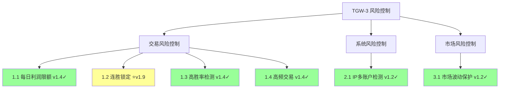
```mermaid
graph TB
    A[TGW-3 风险控制] --> B[交易风险控制]
    A --> C[系统风险控制]
    A --> D[市场风险控制]

    B --> B1[1.1 每日利润限额 v1.4✓]
    B --> B2[1.2 连胜锁定 ⭐v1.9]
    B --> B3[1.3 高胜率检测 v1.4✓]
    B --> B4[1.4 高频交易 v1.4✓]

    C --> C1[2.1 IP多账户检测 v1.2✓]

    D --> D1[3.1 市场波动保护 v1.2✓]

    style B1 fill:#9f9
    style B2 fill:#ff9
    style B3 fill:#9f9
    style B4 fill:#9f9
    style C1 fill:#9f9
    style D1 fill:#9f9
```

---

#### 📊 要求1.1：每日利润限额（v1.4+）

**触发条件**：用户24小时净利润≥+10,000 USDT（滚动窗口）

**行动**：
- 立即暂停用户投注
- 自动添加到黑名单
- 手动解锁后重新计算利润

**计算方法** ⭐v1.5：
- 基于订单`profit`字段值（已解决标志）
- 查询条件：`WHERE profit IS NOT NULL`
- 24小时滚动滑动窗口
- 窗口随时间不断更新

**配置**：
```sql
('DAILY_PROFIT_LIMIT', '10000.00', 'NUMBER', 'Daily profit limit (USDT)', 1),
('DAILY_PROFIT_CHECK_ENABLE', 'true', 'BOOLEAN', 'Enable daily profit check', 1),
('DAILY_PROFIT_BLACKLIST_DAYS', '7', 'NUMBER', 'Blacklist days for profit limit', 1),
('DAILY_PROFIT_ROLLING_HOURS', '24', 'NUMBER', 'Profit rolling window (hours)', 1)
```

---

#### 🎯要求1.2：连胜锁定⭐v1.9

**触发条件**：用户连胜≥8场

**行动**：
- 自动添加到黑名单
- 暂停新投注
- 需要人工审核才能解锁

**检测方法** ⭐v1.9：
- **计划任务扫描**：每 30 秒一次
- **增量处理**：仅处理自上次扫描以来新结算的订单
- **批处理**：每次扫描最多 1000 个用户
- **无业务入侵**：订单结算过程完全无感知检测

**计算逻辑**：
- 按用户+账户类型对增量订单进行分组
- 按订单ID顺序查看结果（时间顺序）
- 连续获胜增加计数，失败/平局重置为 0
- 达到8胜立即插入黑名单

**配置**：
```sql
('WIN_STREAK_LIMIT', '8', 'NUMBER', 'Win streak blacklist threshold', 1),
('WIN_STREAK_CHECK_ENABLE', 'true', 'BOOLEAN', 'Enable win streak check', 1),
('WIN_STREAK_BLACKLIST_DAYS', '7', 'NUMBER', 'Blacklist days for win streak', 1),
-- ⭐v1.9 New Configuration
('WIN_STREAK_SCAN_INTERVAL', '30', 'NUMBER', 'Win streak scan interval (seconds)', 1),
('WIN_STREAK_BATCH_SIZE', '1000', 'NUMBER', 'Max users per scan', 1),
('WIN_STREAK_ORDER_LIMIT', '100', 'NUMBER', 'Max orders per user per scan', 1)
```

---

#### 🎯要求1.3：高胜率检测（v1.4+）

**触发条件**：用户胜率>70%（样本量在配置范围内，订单金额满足最低要求）

**样本大小控制**：
- **下限**：10 个订单（可配置）- 如果低于则不检测
- **上限**：100 个订单（可配置）- 接受最近的上限订单

**数量控制**：
- **最低金额**：10 USDT（可配置）- 仅计算≥最低金额的订单
- **目的**：过滤小测试订单，避免误报

**固定标志** ⭐v1.5：
- **健康）状况**：`profit IS NOT NULL`
- **说明**：有数值的利润字段表示已结算订单

**计算公式**：
```sql
-- Valid order query conditions
WHERE profit IS NOT NULL              -- Settled orders ⭐v1.5
  AND amount >= MIN_BET_AMOUNT        -- Amount filter

-- Win rate calculation
Win Rate = Win Orders / Total Valid Orders
Sample Orders = Most Recent [lower_limit, upper_limit] valid orders
```

**行动**：
- 自动添加到黑名单
- 暂停新投注

**配置**：
```sql
('HIGH_WINRATE_THRESHOLD', '70.0', 'NUMBER', 'High win rate threshold (%)', 1),
('HIGH_WINRATE_SAMPLE_SIZE_MIN', '10', 'NUMBER', 'Min sample size', 1),
('HIGH_WINRATE_SAMPLE_SIZE_MAX', '100', 'NUMBER', 'Max sample size', 1),
('HIGH_WINRATE_MIN_BET_AMOUNT', '10.0', 'NUMBER', 'Min bet amount (USDT)', 1),
('HIGH_WINRATE_CHECK_ENABLE', 'true', 'BOOLEAN', 'Enable win rate check', 1),
('HIGH_WINRATE_BLACKLIST_DAYS', '7', 'NUMBER', 'Blacklist days', 1)
```

---

#### ⚡ 要求1.4：高频交易检测（v1.4+）

**触发条件**：用户1分钟下单≥20单

**行动**：
- **模式 1**：仅速率限制（默认）- 60 秒冷却时间
- **模式2**：自动黑名单（可配置）

**配置**：
```sql
('HIGH_FREQUENCY_THRESHOLD', '20', 'NUMBER', 'Orders per minute threshold', 1),
('HIGH_FREQUENCY_TIME_WINDOW', '60', 'NUMBER', 'Time window (seconds)', 1),
('HIGH_FREQUENCY_CHECK_ENABLE', 'true', 'BOOLEAN', 'Enable frequency check', 1),
('HIGH_FREQUENCY_AUTO_BLACKLIST', 'false', 'BOOLEAN', 'Auto blacklist (false=rate limit only)', 1),
('HIGH_FREQUENCY_BLACKLIST_DAYS', '3', 'NUMBER', 'Blacklist days', 1),
('HIGH_FREQUENCY_COOLDOWN_SECONDS', '60', 'NUMBER', 'Cooldown time (seconds)', 1)
```

---

#### 🖥️需求2.1：IP多账户检测（v1.2）

**触发条件**：相同IP地址，1小时投注次数≥500，来自≥3个不同设备指纹

**行动**：
- 立即阻止当前订单
- 自动将IP加入黑名单
- 该IP下所有用户暂停投注

**检测方法**：
- 订单创建过程实时检测（Redis统计）
- 计算每个 IP 和设备指纹集的赌注
- 滑动 1 小时窗口
- 设备指纹去重

**设备指纹采集**：
- 前端使用 FingerprintJS 库
- 通过 HTTP 标头传递`X-Device-Fingerprint`
- 后端验证和存储

**配置**：
```sql
('IP_MULTI_ACCOUNT_BET_THRESHOLD', '500', 'NUMBER', 'IP bet count threshold', 1),
('IP_MULTI_ACCOUNT_DEVICE_THRESHOLD', '3', 'NUMBER', 'IP device count threshold', 1),
('IP_MULTI_ACCOUNT_TIME_WINDOW', '3600', 'NUMBER', 'Detection time window (seconds)', 1),
('IP_MULTI_ACCOUNT_CHECK_ENABLE', 'true', 'BOOLEAN', 'Enable IP check', 1),
('IP_BLACKLIST_DAYS', '30', 'NUMBER', 'IP blacklist days', 1)
```

---

#### 📈 要求 3.1：市场波动保护 (v1.2)

**触发条件**：
- 交易对1分钟价格波动率≥5%
- 或连续3分钟单向波动率≥3%

**行动**：
- 自动暂停交易对
- 发送警报通知
- 5分钟后自动恢复（可配置）

**检测方法**：
- 实时价格变动监控
- 计算1分钟、3分钟波动率
- 基于 BTSE 市场数据

**配置**：
```sql
('MARKET_VOLATILITY_THRESHOLD_1MIN', '5.0', 'NUMBER', '1-min volatility threshold (%)', 1),
('MARKET_VOLATILITY_THRESHOLD_3MIN', '3.0', 'NUMBER', '3-min volatility threshold (%)', 1),
('MARKET_SUSPENSION_DURATION', '300', 'NUMBER', 'Suspension duration (seconds)', 1),
('MARKET_VOLATILITY_CHECK_ENABLE', 'true', 'BOOLEAN', 'Enable volatility check', 1)
```

---

## 2、架构设计

### 2.1 日盈控架构

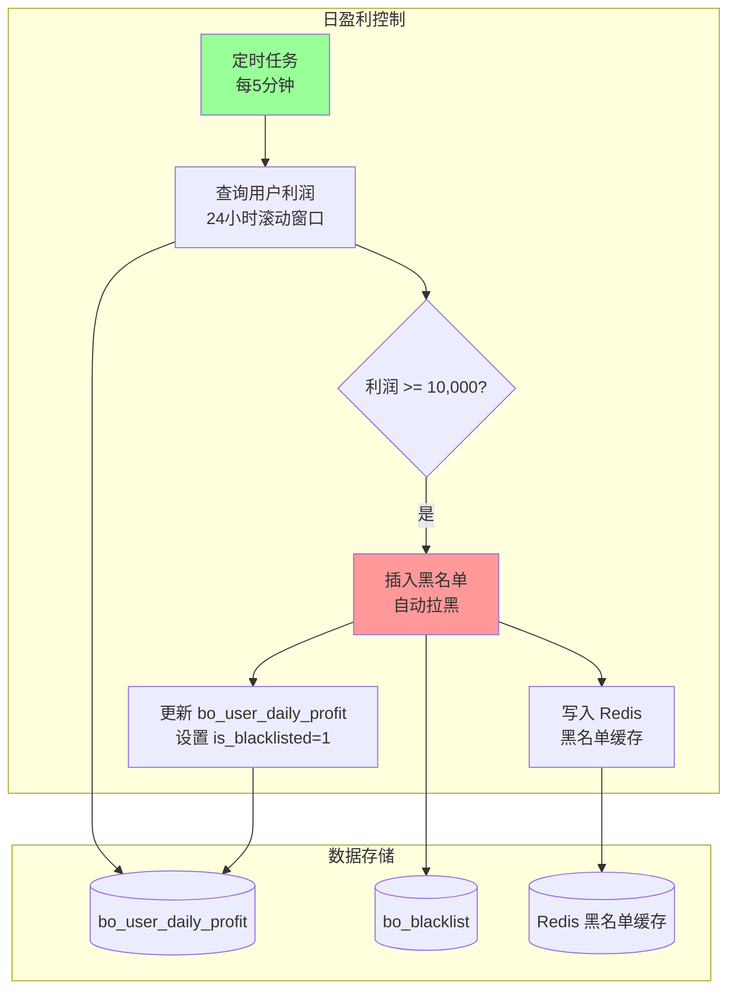
```mermaid
graph TB
    subgraph "日盈利控制"
        A[定时任务<br/>每5分钟]
        B[查询用户利润<br/>24小时滚动窗口]
        C{利润 >= 10,000?}
        D[插入黑名单<br/>自动拉黑]
        E[更新 bo_user_daily_profit<br/>设置 is_blacklisted=1]
        F[写入 Redis<br/>黑名单缓存]
    end

    subgraph "数据存储"
        G[(bo_user_daily_profit)]
        H[(bo_blacklist)]
        I[(Redis 黑名单缓存)]
    end

    A --> B
    B --> G
    B --> C
    C -->|是| D
    D --> H
    D --> E
    E --> G
    D --> F
    F --> I

    style A fill:#9f9
    style D fill:#f99
```

**主要特点**：
- ✅ 24小时滚动窗口计算
- ✅ 根据已结算的订单（`profit IS NOT NULL`)
- ✅ 定时任务检测（5分钟）
- ✅ 自动插入黑名单

---

### 2.2 连胜控制架构 ⭐v1.9

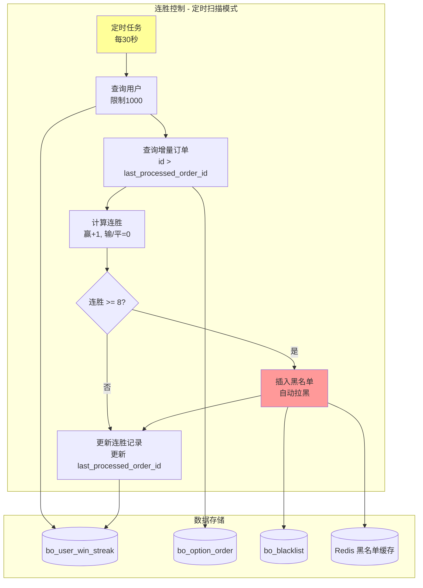
```mermaid
graph TB
    subgraph "连胜控制 - 定时扫描模式"
        A[定时任务<br/>每30秒]
        B[查询用户<br/>限制1000]
        C[查询增量订单<br/>id > last_processed_order_id]
        D[计算连胜<br/>赢+1, 输/平=0]
        E{连胜 >= 8?}
        F[插入黑名单<br/>自动拉黑]
        G[更新连胜记录<br/>更新 last_processed_order_id]
    end

    subgraph "数据存储"
        H[(bo_user_win_streak)]
        I[(bo_option_order)]
        J[(bo_blacklist)]
        K[(Redis 黑名单缓存)]
    end

    A --> B
    B --> H
    B --> C
    C --> I
    C --> D
    D --> E
    E -->|是| F
    E -->|否| G
    F --> J
    F --> K
    F --> G
    G --> H

    style A fill:#ff9
    style F fill:#f99
```

**主要特点** ⭐v1.9：
- ✅ 与订单业务彻底解耦
- ✅ 增量扫描（仅限新订单）
- ✅ 批处理（每次扫描 1000 个用户）
- ✅ 对订单结算性能零影响

---

### 2.3 高胜率控制架构

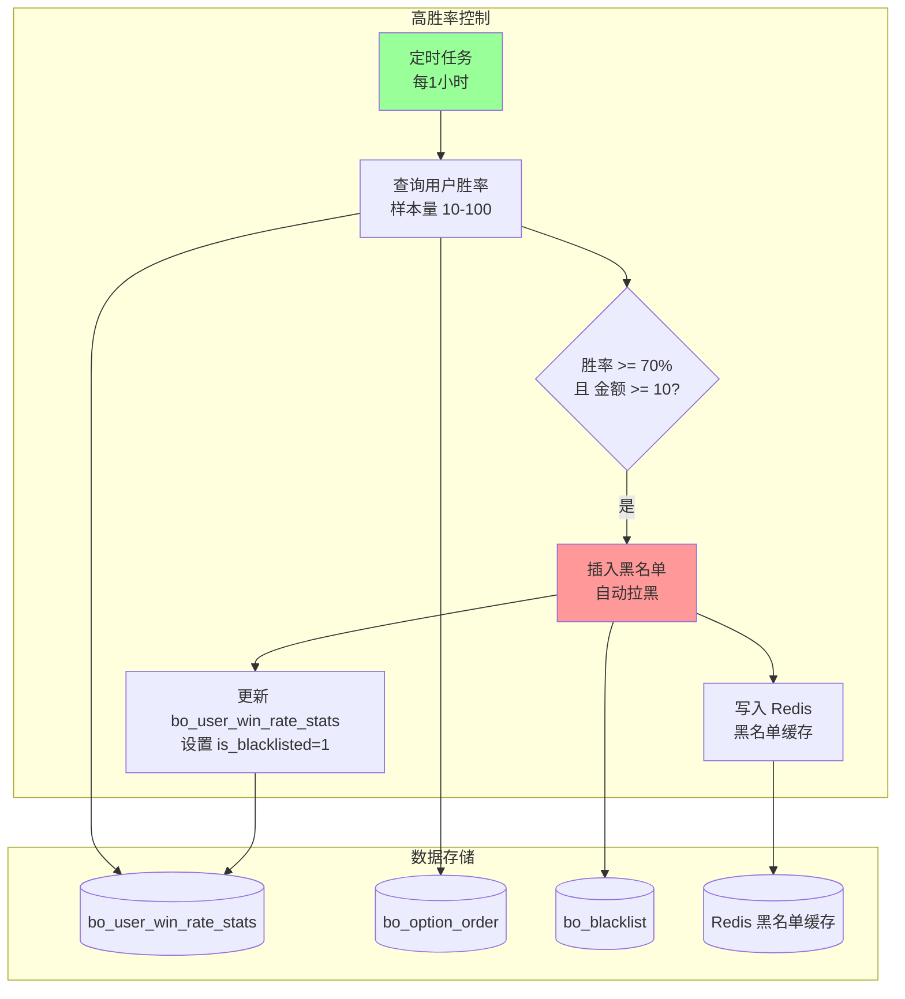
```mermaid
graph TB
    subgraph "高胜率控制"
        A[定时任务<br/>每1小时]
        B[查询用户胜率<br/>样本量 10-100]
        C{胜率 >= 70%<br/>且 金额 >= 10?}
        D[插入黑名单<br/>自动拉黑]
        E[更新 bo_user_win_rate_stats<br/>设置 is_blacklisted=1]
        F[写入 Redis<br/>黑名单缓存]
    end

    subgraph "数据存储"
        G[(bo_user_win_rate_stats)]
        H[(bo_option_order)]
        I[(bo_blacklist)]
        J[(Redis 黑名单缓存)]
    end

    A --> B
    B --> H
    B --> G
    B --> C
    C -->|是| D
    D --> I
    D --> E
    E --> G
    D --> F
    F --> J

    style A fill:#9f9
    style D fill:#f99
```

**主要特点**：
- ✅ 样本大小范围 [10, 100] 可配置
- ✅ 最低投注额筛选（10 USDT）
- ✅ 根据已结算的订单（`profit IS NOT NULL`)
- ✅ 定时任务检测（1小时）

---

### 2.4 高频交易控制架构

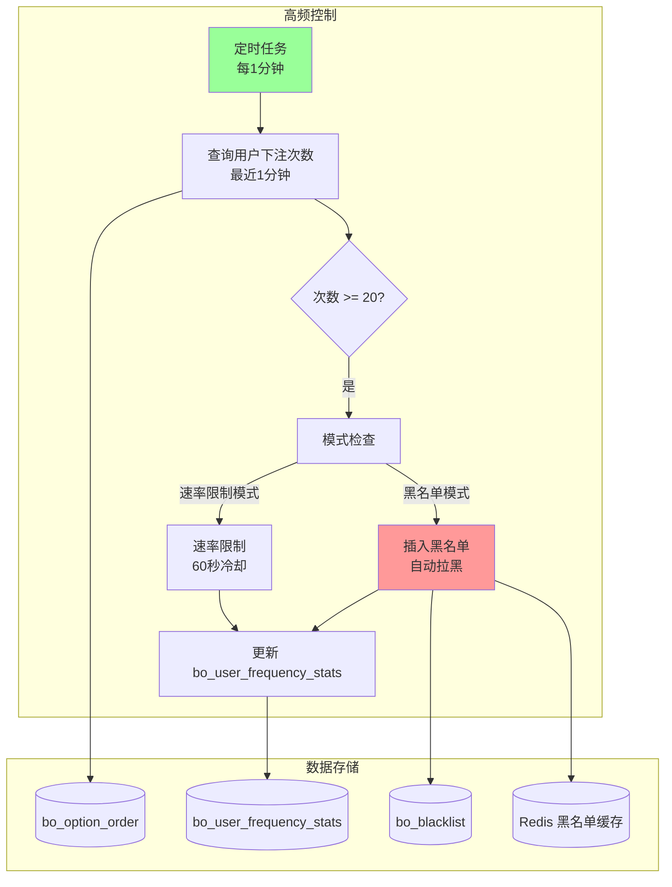
```mermaid
graph TB
    subgraph "高频控制"
        A[定时任务<br/>每1分钟]
        B[查询用户下注次数<br/>最近1分钟]
        C{次数 >= 20?}
        D[模式检查]
        E[速率限制<br/>60秒冷却]
        F[插入黑名单<br/>自动拉黑]
        G[更新 bo_user_frequency_stats]
    end

    subgraph "数据存储"
        H[(bo_option_order)]
        I[(bo_user_frequency_stats)]
        J[(bo_blacklist)]
        K[(Redis 黑名单缓存)]
    end

    A --> B
    B --> H
    B --> C
    C -->|是| D
    D -->|速率限制模式| E
    D -->|黑名单模式| F
    E --> G
    F --> J
    F --> K
    F --> G
    G --> I

    style A fill:#9f9
    style F fill:#f99
```

**主要特点**：
- ✅ 两种模式：速率限制（默认）/自动黑名单
- ✅ 滑动1分钟窗口
- ✅ 计划任务检测
- ✅ 冷却机制

---

### 2.5 IP多账户控制架构 ⭐v1.8

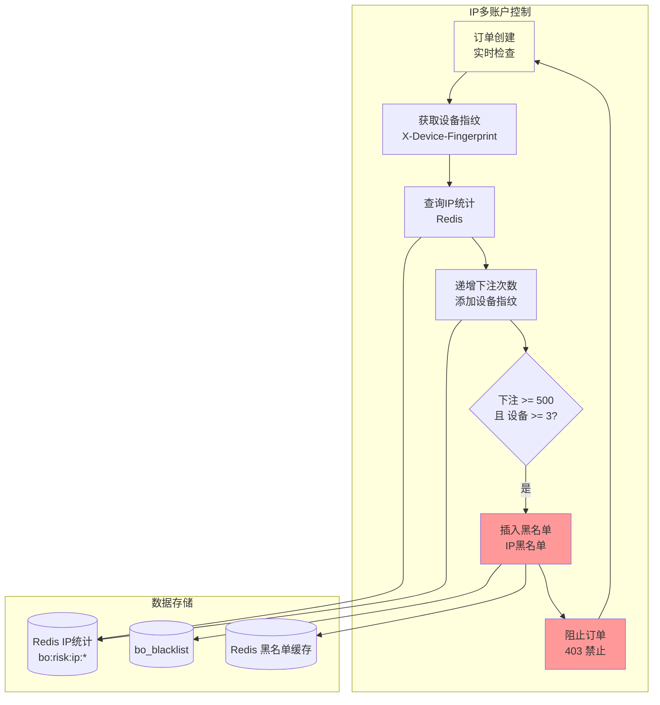
```mermaid
graph TB
    subgraph "IP多账户控制"
        A[订单创建<br/>实时检查]
        B[获取设备指纹<br/>X-Device-Fingerprint]
        C[查询IP统计<br/>Redis]
        D[递增下注次数<br/>添加设备指纹]
        E{下注 >= 500<br/>且 设备 >= 3?}
        F[插入黑名单<br/>IP黑名单]
        G[阻止订单<br/>403 禁止]
    end

    subgraph "数据存储"
        H[(Redis IP统计<br/>bo:risk:ip:*)]
        I[(bo_blacklist)]
        J[(Redis 黑名单缓存)]
    end

    A --> B
    B --> C
    C --> H
    C --> D
    D --> H
    D --> E
    E -->|是| F
    F --> I
    F --> J
    F --> G
    G --> A

    style A fill:#ffd
    style F fill:#f99
    style G fill:#f99
```

**主要特点** ⭐v1.8：
- ✅ 订单创建过程中的实时检测
- ✅ 设备指纹去重
- ✅ 触发后立即将 IP 列入黑名单
- ✅ Redis滑动窗口统计

---

### 2.6 市场波动控制架构

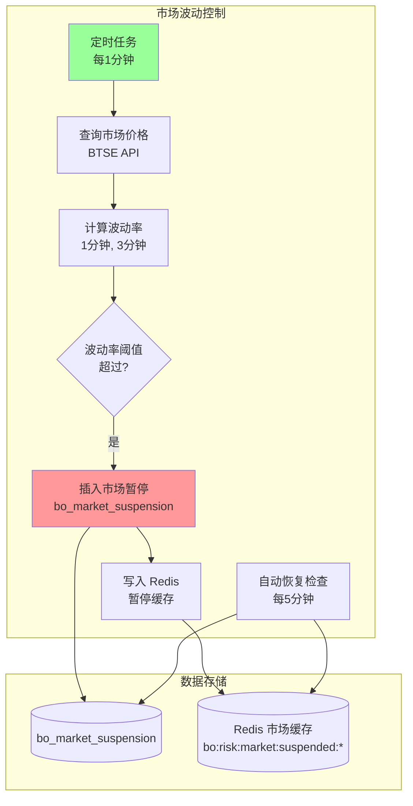
```mermaid
graph TB
    subgraph "市场波动控制"
        A[定时任务<br/>每1分钟]
        B[查询市场价格<br/>BTSE API]
        C[计算波动率<br/>1分钟, 3分钟]
        D{波动率阈值<br/>超过?}
        E[插入市场暂停<br/>bo_market_suspension]
        F[写入 Redis<br/>暂停缓存]
        G[自动恢复检查<br/>每5分钟]
    end

    subgraph "数据存储"
        H[(bo_market_suspension)]
        I[(Redis 市场缓存<br/>bo:risk:market:suspended:*)]
    end

    A --> B
    B --> C
    C --> D
    D -->|是| E
    E --> H
    E --> F
    F --> I
    G --> I
    G --> H

    style A fill:#9f9
    style E fill:#f99
```

**主要特点**：
- ✅ 实时价格监控
- ✅ 1 分钟阈值：5%，3 分钟阈值：3%
- ✅ 5分钟后自动恢复
- ✅ Redis 悬挂标志

---

## 3.表结构架构

### 3.1 日利润表结构

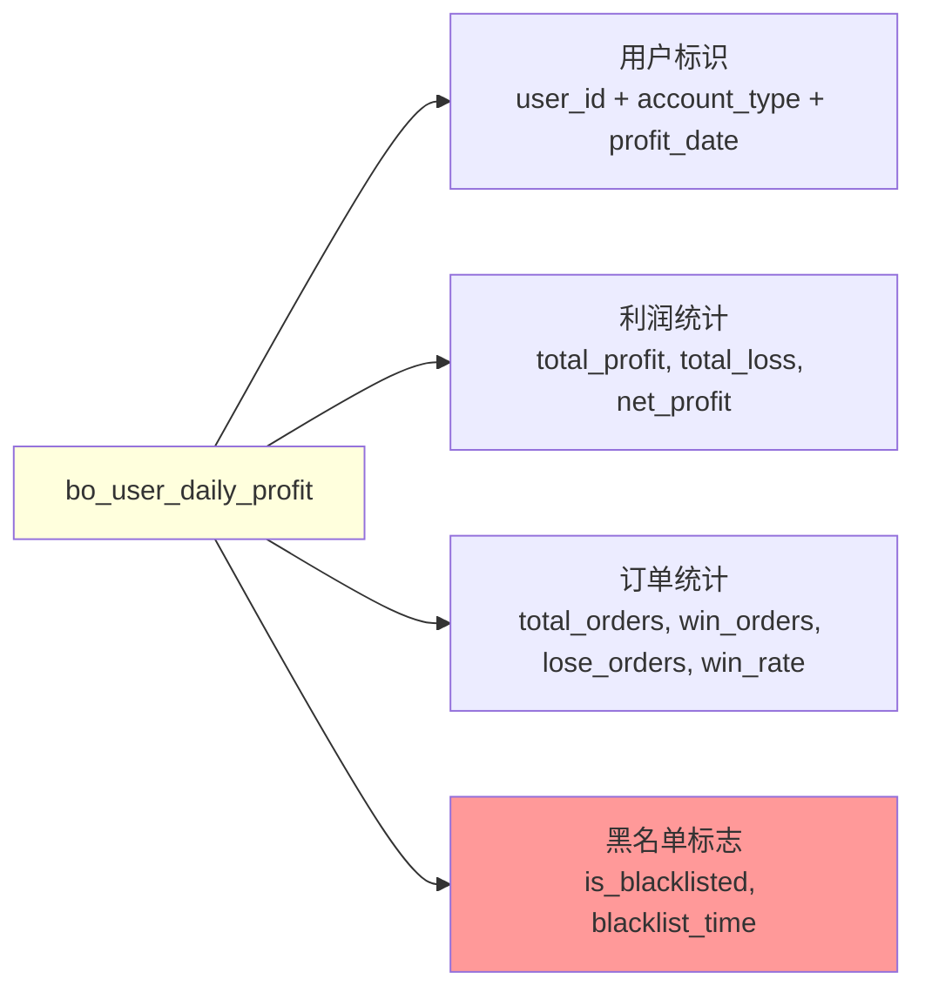
```mermaid
graph LR
    A[bo_user_daily_profit] --> B[用户标识<br/>user_id + account_type + profit_date]
    A --> C[利润统计<br/>total_profit, total_loss, net_profit]
    A --> D[订单统计<br/>total_orders, win_orders, lose_orders, win_rate]
    A --> E[黑名单标志<br/>is_blacklisted, blacklist_time]

    style A fill:#ffd
    style E fill:#f99
```

**关键字段**：
- `net_profit`：24小时净利润（total_profit -total_loss）
- `is_blacklisted`：利润限制黑名单标志
- `profit_date`：统计日期（滚动窗口）

**索引**：
- `uk_user_account_date`：唯一键（user_id、account_type、profit_date）
- `idx_net_profit`：净利润DESC指数
- `idx_blacklisted`：黑名单查询索引

---

### 3.2 连胜表结构 ⭐v1.9

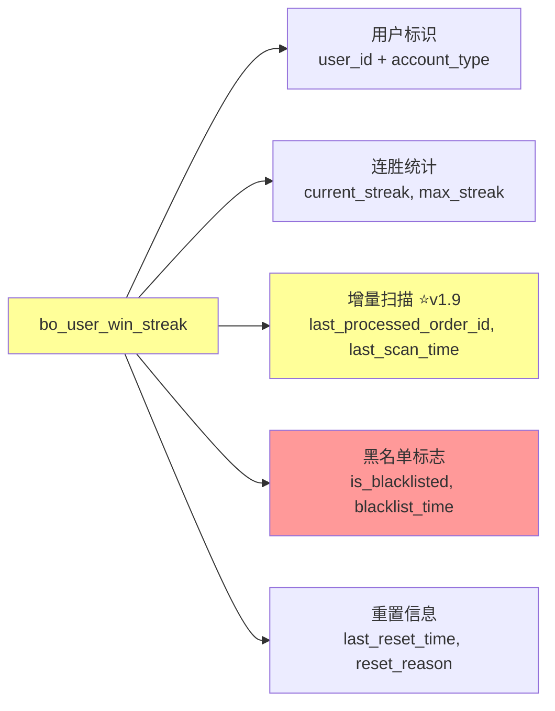
```mermaid
graph LR
    A[bo_user_win_streak] --> B[用户标识<br/>user_id + account_type]
    A --> C[连胜统计<br/>current_streak, max_streak]
    A --> D[增量扫描 ⭐v1.9<br/>last_processed_order_id, last_scan_time]
    A --> E[黑名单标志<br/>is_blacklisted, blacklist_time]
    A --> F[重置信息<br/>last_reset_time, reset_reason]

    style A fill:#ff9
    style D fill:#ff9
    style E fill:#f99
```

**关键字段** ⭐v1.9：
- `current_streak`：当前连续获胜
- `last_processed_order_id`：最后处理的最大订单ID（增量扫描起点）
- `last_scan_time`：上次扫描时间（监控和调试）
- `is_blacklisted`：连胜黑名单标志

**索引** ⭐v1.9：
- `uk_user_account`：唯一键（user_id，account_type）
- `idx_last_processed_order`：增量扫描索引

**关联索引** ⭐v1.9：
```sql
-- Order table incremental scan index
CREATE INDEX idx_order_incremental_scan
ON bo_option_order (user_id, account_type, id)
WHERE status IN ('WIN', 'LOSE', 'DRAW');
```

---

### 3.3 高胜率表结构

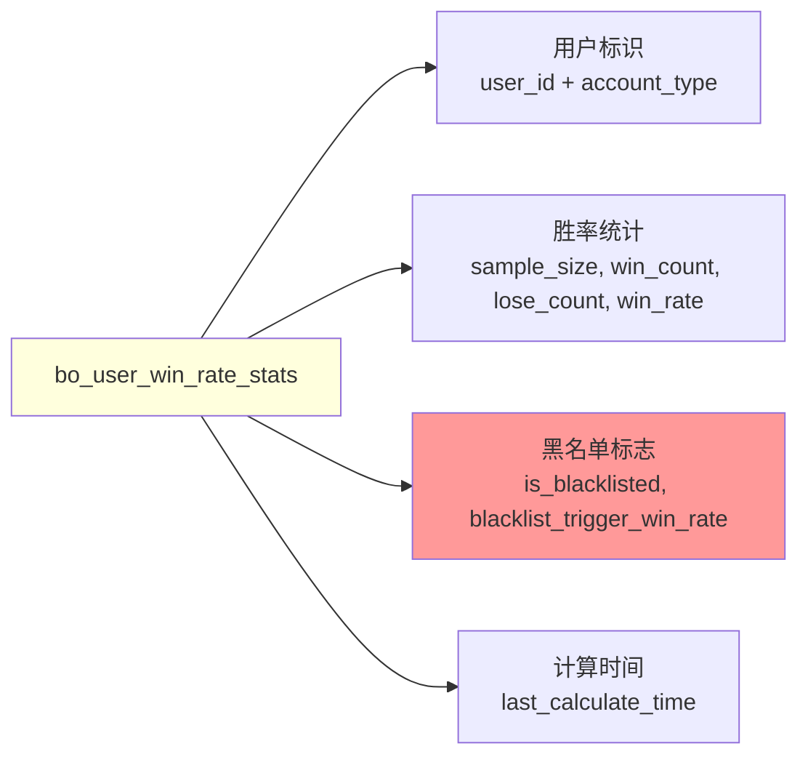
```mermaid
graph LR
    A[bo_user_win_rate_stats] --> B[用户标识<br/>user_id + account_type]
    A --> C[胜率统计<br/>sample_size, win_count, lose_count, win_rate]
    A --> D[黑名单标志<br/>is_blacklisted, blacklist_trigger_win_rate]
    A --> E[计算时间<br/>last_calculate_time]

    style A fill:#ffd
    style D fill:#f99
```

**关键字段**：
- `sample_size`：当前样本量（实际订单数）
- `win_rate`：胜率 (%) = win_count / 样本大小 * 100
- `blacklist_trigger_win_rate`：黑名单触发时的胜率
- `blacklist_trigger_sample_size`：黑名单触发时的样本大小

**索引**：
- `uk_user_account`：唯一键（user_id，account_type）
- `idx_win_rate`：胜率DESC指数
- `idx_sample_size`：样本量指数

---

### 3.4 高频表结构

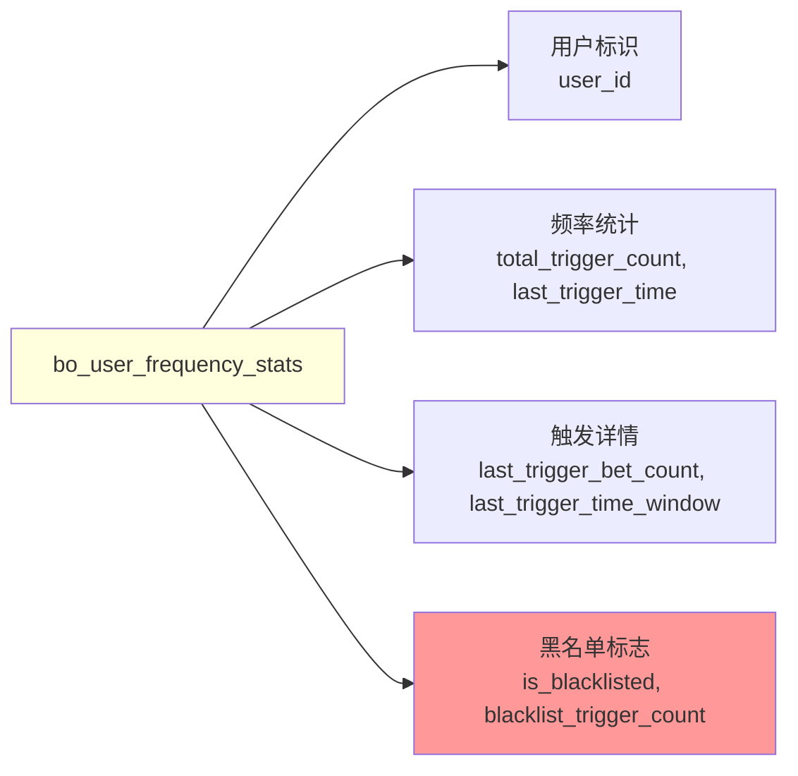
```mermaid
graph LR
    A[bo_user_frequency_stats] --> B[用户标识<br/>user_id]
    A --> C[频率统计<br/>total_trigger_count, last_trigger_time]
    A --> D[触发详情<br/>last_trigger_bet_count, last_trigger_time_window]
    A --> E[黑名单标志<br/>is_blacklisted, blacklist_trigger_count]

    style A fill:#ffd
    style E fill:#f99
```

**关键字段**：
- `total_trigger_count`：累计触发次数
- `last_trigger_bet_count`: 最后触发时的投注数
- `last_trigger_time_window`：最后一次触发的时间窗口（例如，202512241530）
- `is_blacklisted`：高频黑名单标志

**索引**：
- `uk_user`：唯一键（user_id）
- `idx_trigger_count`：触发​​次数 DESC 索引

---

### 3.5 市场停牌表结构

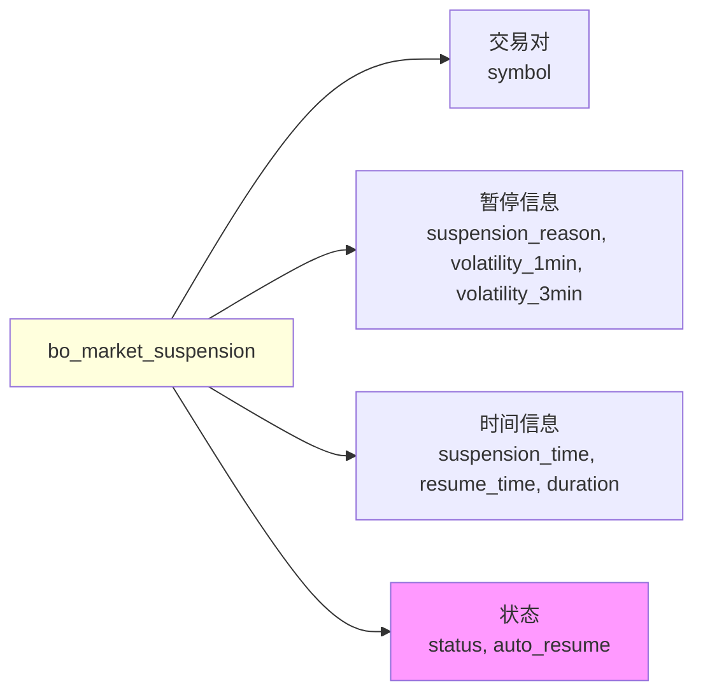
```mermaid
graph LR
    A[bo_market_suspension] --> B[交易对<br/>symbol]
    A --> C[暂停信息<br/>suspension_reason, volatility_1min, volatility_3min]
    A --> D[时间信息<br/>suspension_time, resume_time, duration]
    A --> E[状态<br/>status, auto_resume]

    style A fill:#ffd
    style E fill:#f9f
```

**关键字段**：
- `volatility_1min`：1分钟波动率（%）
- `volatility_3min`：3分钟波动率（%）
- `status`：状态（活动/恢复）
- `auto_resume`：自动恢复标志

**索引**：
- `idx_symbol_status`：（符号、状态）索引
- `idx_suspension_time`：暂停时间 DESC 指数

---

## 4. 数据流设计

### 4.1 订单创建风险检查流程 ⭐v1.8/v1.9

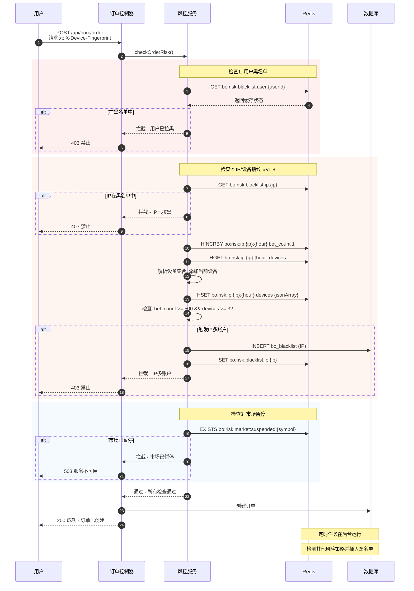
```mermaid
sequenceDiagram
    autonumber
    participant User as 用户
    participant OrderController as 订单控制器
    participant RiskControlService as 风控服务
    participant Redis
    participant DB as 数据库

    User->>OrderController: POST /api/borc/order<br/>请求头: X-Device-Fingerprint
    OrderController->>RiskControlService: checkOrderRisk()

    rect rgb(255, 240, 240)
        Note over RiskControlService,Redis: 检查1: 用户黑名单
        RiskControlService->>Redis: GET bo:risk:blacklist:user:{userId}
        Redis-->>RiskControlService: 返回缓存状态
        alt 在黑名单中
            RiskControlService-->>OrderController: 拦截 - 用户已拉黑
            OrderController-->>User: 403 禁止
        end
    end

    rect rgb(255, 245, 240)
        Note over RiskControlService,Redis: 检查2: IP/设备指纹 ⭐v1.8
        RiskControlService->>Redis: GET bo:risk:blacklist:ip:{ip}
        alt IP在黑名单中
            RiskControlService-->>OrderController: 拦截 - IP已拉黑
            OrderController-->>User: 403 禁止
        end

        RiskControlService->>Redis: HINCRBY bo:risk:ip:{ip}:{hour} bet_count 1
        RiskControlService->>Redis: HGET bo:risk:ip:{ip}:{hour} devices
        RiskControlService->>RiskControlService: 解析设备集合, 添加当前设备
        RiskControlService->>Redis: HSET bo:risk:ip:{ip}:{hour} devices {jsonArray}

        RiskControlService->>RiskControlService: 检查: bet_count >= 500 && devices >= 3?
        alt 触发IP多账户
            RiskControlService->>DB: INSERT bo_blacklist (IP)
            RiskControlService->>Redis: SET bo:risk:blacklist:ip:{ip}
            RiskControlService-->>OrderController: 拦截 - IP多账户
            OrderController-->>User: 403 禁止
        end
    end

    rect rgb(245, 250, 255)
        Note over RiskControlService,Redis: 检查3: 市场暂停
        RiskControlService->>Redis: EXISTS bo:risk:market:suspended:{symbol}
        alt 市场已暂停
            RiskControlService-->>OrderController: 拦截 - 市场已暂停
            OrderController-->>User: 503 服务不可用
        end
    end

    RiskControlService-->>OrderController: 通过 - 所有检查通过
    OrderController->>DB: 创建订单
    OrderController-->>User: 200 成功 - 订单已创建

    Note over Redis,DB: 定时任务在后台运行
    Note over Redis,DB: 检测其他风险策略并插入黑名单
```

**关键简化** (v1.8/v1.9)：
- ✅ 检查1：用户黑名单-Redis快速查询
- ✅ 检查2：IP/设备指纹-Redis实时统计，阈值立即列入黑名单⭐保留
- ✅ 检查3：市场暂停-Redis暂停标志

**删除了检查** (v1.8/v1.9)：
- ❌每日利润查看-改为计划任务
- ❌ 高胜率检查-改为计划任务
- ❌ 高频检查-改为计划任务
- ❌连胜检查-改为计划任务⭐v1.9扫描模式

---

### 4.2 连胜检测流程 ⭐v1.9

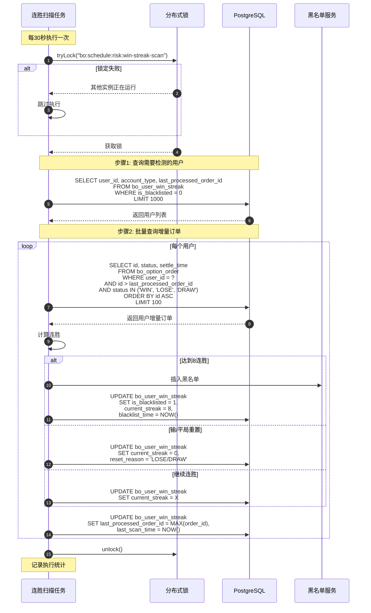
```mermaid
sequenceDiagram
    autonumber
    participant Task as 连胜扫描任务
    participant Lock as 分布式锁
    participant DB as PostgreSQL
    participant Blacklist as 黑名单服务

    Note over Task: 每30秒执行一次

    Task->>Lock: tryLock("bo:schedule:risk:win-streak-scan")
    alt 锁定失败
        Lock-->>Task: 其他实例正在运行
        Task->>Task: 跳过执行
    end

    Lock-->>Task: 获取锁

    Note over Task,DB: 步骤1: 查询需要检测的用户
    Task->>DB: SELECT user_id, account_type, last_processed_order_id<br/>FROM bo_user_win_streak<br/>WHERE is_blacklisted = 0<br/>LIMIT 1000
    DB-->>Task: 返回用户列表

    Note over Task,DB: 步骤2: 批量查询增量订单
    loop 每个用户
        Task->>DB: SELECT id, status, settle_time<br/>FROM bo_option_order<br/>WHERE user_id = ?<br/>AND id > last_processed_order_id<br/>AND status IN ('WIN', 'LOSE', 'DRAW')<br/>ORDER BY id ASC<br/>LIMIT 100
        DB-->>Task: 返回用户增量订单

        Task->>Task: 计算连胜

        alt 达到8连胜
            Task->>Blacklist: 插入黑名单
            Task->>DB: UPDATE bo_user_win_streak<br/>SET is_blacklisted = 1,<br/>current_streak = 8,<br/>blacklist_time = NOW()
        else 输/平局重置
            Task->>DB: UPDATE bo_user_win_streak<br/>SET current_streak = 0,<br/>reset_reason = 'LOSE/DRAW'
        else 继续连胜
            Task->>DB: UPDATE bo_user_win_streak<br/>SET current_streak = X
        end

        Task->>DB: UPDATE bo_user_win_streak<br/>SET last_processed_order_id = MAX(order_id),<br/>last_scan_time = NOW()
    end

    Task->>Lock: unlock()

    Note over Task: 记录执行统计
```

**性能优化**：
1. 限制扫描用户：每次扫描最多 1000 个用户
2. 增量查询：`id > last_processed_order_id`
3. 限价订单：每个用户最多100个增量订单
4. 批量更新：使用交易进行批量连胜更新

---

### 4.3 每日盈利检测流程

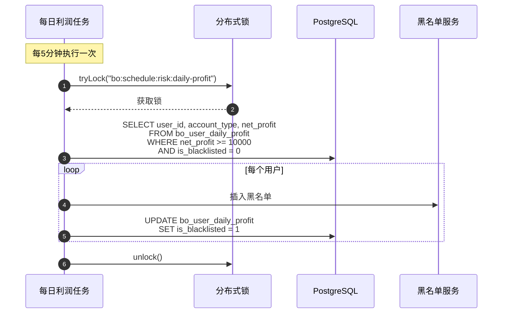
```mermaid
sequenceDiagram
    autonumber
    participant Task as 每日利润任务
    participant Lock as 分布式锁
    participant DB as PostgreSQL
    participant Blacklist as 黑名单服务

    Note over Task: 每5分钟执行一次

    Task->>Lock: tryLock("bo:schedule:risk:daily-profit")
    Lock-->>Task: 获取锁

    Task->>DB: SELECT user_id, account_type, net_profit<br/>FROM bo_user_daily_profit<br/>WHERE net_profit >= 10000<br/>AND is_blacklisted = 0

    loop 每个用户
        Task->>Blacklist: 插入黑名单
        Task->>DB: UPDATE bo_user_daily_profit<br/>SET is_blacklisted = 1
    end

    Task->>Lock: unlock()
```

---

### 4.4 高胜率检测流程

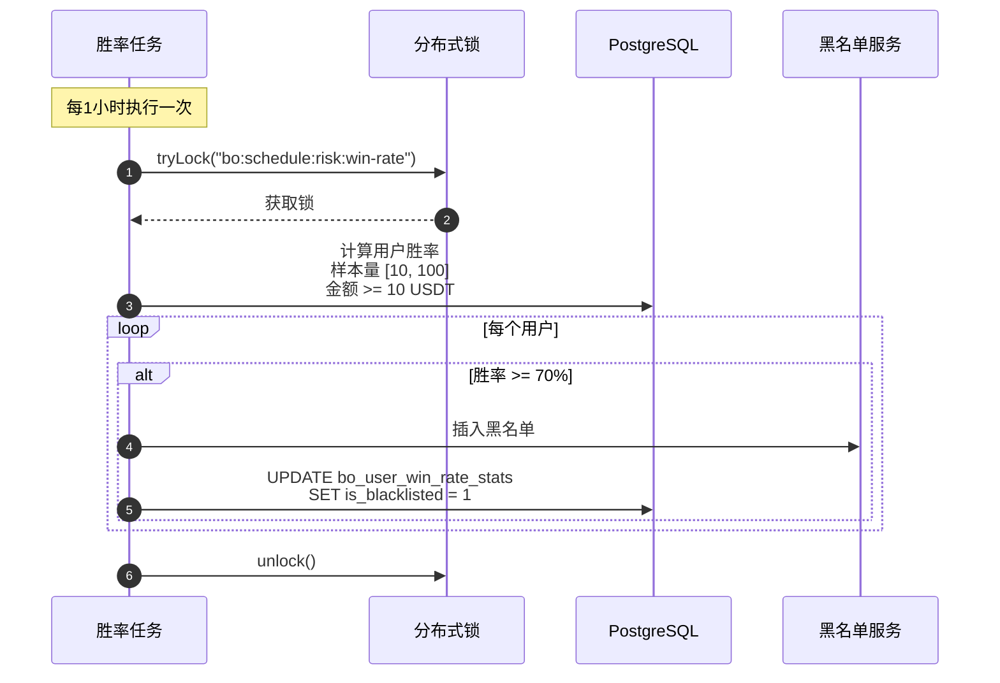
```mermaid
sequenceDiagram
    autonumber
    participant Task as 胜率任务
    participant Lock as 分布式锁
    participant DB as PostgreSQL
    participant Blacklist as 黑名单服务

    Note over Task: 每1小时执行一次

    Task->>Lock: tryLock("bo:schedule:risk:win-rate")
    Lock-->>Task: 获取锁

    Task->>DB: 计算用户胜率<br/>样本量 [10, 100]<br/>金额 >= 10 USDT

    loop 每个用户
        alt 胜率 >= 70%
            Task->>Blacklist: 插入黑名单
            Task->>DB: UPDATE bo_user_win_rate_stats<br/>SET is_blacklisted = 1
        end
    end

    Task->>Lock: unlock()
```

---

### 4.5 高频检测流程

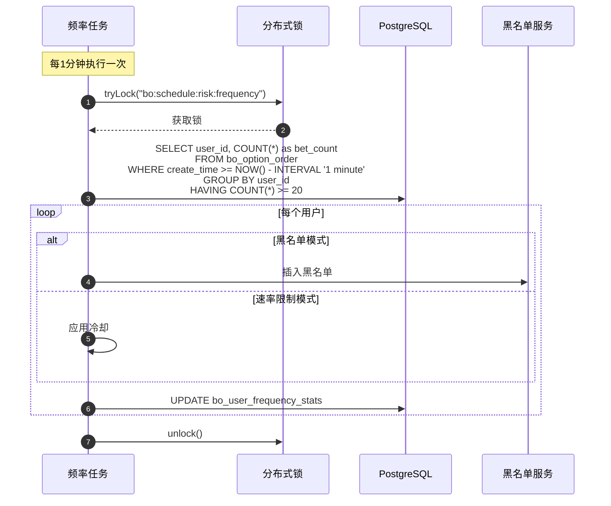
```mermaid
sequenceDiagram
    autonumber
    participant Task as 频率任务
    participant Lock as 分布式锁
    participant DB as PostgreSQL
    participant Blacklist as 黑名单服务

    Note over Task: 每1分钟执行一次

    Task->>Lock: tryLock("bo:schedule:risk:frequency")
    Lock-->>Task: 获取锁

    Task->>DB: SELECT user_id, COUNT(*) as bet_count<br/>FROM bo_option_order<br/>WHERE create_time >= NOW() - INTERVAL '1 minute'<br/>GROUP BY user_id<br/>HAVING COUNT(*) >= 20

    loop 每个用户
        alt 黑名单模式
            Task->>Blacklist: 插入黑名单
        else 速率限制模式
            Task->>Task: 应用冷却
        end
        Task->>DB: UPDATE bo_user_frequency_stats
    end

    Task->>Lock: unlock()
```

---

### 4.6 IP多账号检测流程

**第4.1节中介绍**（订单创建过程中的实时检查）

---

### 4.7 市场波动检测流程

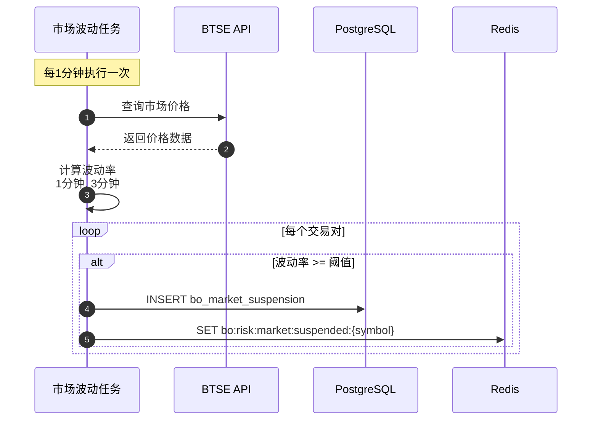
```mermaid
sequenceDiagram
    autonumber
    participant Task as 市场波动任务
    participant BTSE as BTSE API
    participant DB as PostgreSQL
    participant Redis

    Note over Task: 每1分钟执行一次

    Task->>BTSE: 查询市场价格
    BTSE-->>Task: 返回价格数据

    Task->>Task: 计算波动率<br/>1分钟, 3分钟

    loop 每个交易对
        alt 波动率 >= 阈值
            Task->>DB: INSERT bo_market_suspension
            Task->>Redis: SET bo:risk:market:suspended:{symbol}
        end
    end
```

---

## 5. 表结构设计

### 5.1 数据库变更总结

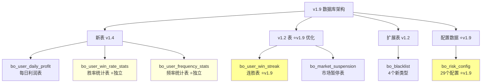
```mermaid
graph TD
    A[v1.9 数据库架构] --> B[新表 v1.4]
    A --> C[v1.2 表 ⭐v1.9 优化]
    A --> D[扩展表 v1.2]
    A --> E[配置数据 ⭐v1.9]

    B --> B1[bo_user_daily_profit<br/>每日利润表]
    B --> B2[bo_user_win_rate_stats<br/>胜率统计表 ⭐独立]
    B --> B3[bo_user_frequency_stats<br/>频率统计表 ⭐独立]

    C --> C1[bo_user_win_streak<br/>连胜表 ⭐v1.9]
    C --> C2[bo_market_suspension<br/>市场暂停表]

    D --> D1[bo_blacklist<br/>4个新类型]

    E --> E1[bo_risk_config<br/>29个配置 ⭐v1.9]

    style C1 fill:#ff9
    style E1 fill:#ff9
    style B2 fill:#ffd
    style B3 fill:#ffd
```

|运营|表|描述 |优先|
|-----------|-------|-------------|----------|
| **新** |`bo_user_daily_profit`|每日利润追踪表（v1.4）| P0|
| **新** |`bo_user_win_rate_stats`|胜率统计表⭐独立（v1.4）| P0|
| **新** |`bo_user_frequency_stats`|频率统计表⭐独立（v1.4）| P0|
| **继承+优化** |`bo_user_win_streak`|连胜表⭐v1.9增量扫描字段| P0|
| **继承** |`bo_market_suspension`|市场暂停表（v1.2）| - |
| **延长** |`bo_blacklist`|支持 4 个新类型值 | P0|
| **插入** |`bo_risk_config`| 29 个新配置 ⭐v1.9 | P0|

---

### 5.2 新的表结构

#### A. 用户日收益表

```sql
-- =====================================================
-- 表: bo_user_daily_profit
-- 描述: 用户每日利润追踪（24小时滚动窗口）
-- =====================================================
CREATE TABLE bo_user_daily_profit (
    id BIGINT AUTO_INCREMENT PRIMARY KEY,
    user_id BIGINT NOT NULL COMMENT '用户ID',
    account_type VARCHAR(20) NOT NULL COMMENT '账户类型: DEMO/REAL',
    profit_date DATE NOT NULL COMMENT '统计日期',

    -- 利润统计
    total_profit DECIMAL(20,2) DEFAULT 0 COMMENT '24小时总利润（净值）',
    total_loss DECIMAL(20,2) DEFAULT 0 COMMENT '24小时总损失',
    net_profit DECIMAL(20,2) DEFAULT 0 COMMENT '24小时净利润 = total_profit - total_loss',

    -- 订单统计
    total_orders INT DEFAULT 0 COMMENT '总订单数',
    win_orders INT DEFAULT 0 COMMENT '盈利订单数',
    lose_orders INT DEFAULT 0 COMMENT '亏损订单数',
    win_rate DECIMAL(5,2) DEFAULT 0 COMMENT '胜率 (%)',

    -- 黑名单标志
    is_blacklisted TINYINT(1) DEFAULT 0 COMMENT '利润限额拉黑标志',
    blacklist_time TIMESTAMP NULL COMMENT '拉黑时间',

    -- 时间戳
    last_update_time TIMESTAMP DEFAULT CURRENT_TIMESTAMP ON UPDATE CURRENT_TIMESTAMP,
    create_time TIMESTAMP DEFAULT CURRENT_TIMESTAMP,

    -- 索引
    UNIQUE KEY uk_user_account_date (user_id, account_type, profit_date),
    INDEX idx_net_profit (net_profit DESC),
    INDEX idx_blacklisted (is_blacklisted, user_id),
    INDEX idx_profit_date (profit_date)
) COMMENT '用户每日利润追踪表 - 24小时滚动窗口';
```

---

#### B. 用户胜率统计表

```sql
-- =====================================================
-- 表: bo_user_win_rate_stats
-- 描述: 用户胜率统计（独立表）
-- v1.5: 基于 profit IS NOT NULL 订单的统计
-- v1.6/v1.7: 仅由定时任务更新，订单创建时只读
-- =====================================================
CREATE TABLE bo_user_win_rate_stats (
    id BIGINT AUTO_INCREMENT PRIMARY KEY,
    user_id BIGINT NOT NULL COMMENT '用户ID',
    account_type VARCHAR(20) NOT NULL COMMENT '账户类型: DEMO/REAL',

    -- 胜率统计（可配置样本量）
    sample_size INT DEFAULT 0 COMMENT '当前样本量（实际订单数）',
    win_count INT DEFAULT 0 COMMENT '盈利订单数',
    lose_count INT DEFAULT 0 COMMENT '亏损订单数',
    draw_count INT DEFAULT 0 COMMENT '平局订单数',
    win_rate DECIMAL(5,2) DEFAULT 0 COMMENT '胜率 (%) = win_count / sample_size * 100',

    -- 黑名单标志
    is_blacklisted TINYINT(1) DEFAULT 0 COMMENT '高胜率拉黑标志',
    blacklist_time TIMESTAMP NULL COMMENT '拉黑时间',
    blacklist_trigger_win_rate DECIMAL(5,2) COMMENT '拉黑触发时的胜率',
    blacklist_trigger_sample_size INT COMMENT '拉黑触发时的样本量',

    -- 时间戳
    last_calculate_time TIMESTAMP NULL COMMENT '最后计算时间',
    last_update_time TIMESTAMP DEFAULT CURRENT_TIMESTAMP ON UPDATE CURRENT_TIMESTAMP,
    create_time TIMESTAMP DEFAULT CURRENT_TIMESTAMP,

    -- 索引
    UNIQUE KEY uk_user_account (user_id, account_type),
    INDEX idx_win_rate (win_rate DESC),
    INDEX idx_blacklisted (is_blacklisted, user_id),
    INDEX idx_sample_size (sample_size)
) COMMENT '用户胜率统计表 - v1.7: 仅由定时任务更新';
```

---

#### C. 用户频率统计表

```sql
-- =====================================================
-- 表: bo_user_frequency_stats
-- 描述: 用户频率统计（独立表）
-- =====================================================
CREATE TABLE bo_user_frequency_stats (
    id BIGINT AUTO_INCREMENT PRIMARY KEY,
    user_id BIGINT NOT NULL COMMENT '用户ID',

    -- 频率统计
    total_trigger_count INT DEFAULT 0 COMMENT '累计触发次数',
    last_trigger_time TIMESTAMP NULL COMMENT '最后触发时间',
    last_trigger_bet_count INT COMMENT '最后触发时的下注次数',
    last_trigger_time_window VARCHAR(20) COMMENT '最后触发的时间窗口（例如：202512241530）',

    -- 黑名单标志
    is_blacklisted TINYINT(1) DEFAULT 0 COMMENT '高频拉黑标志',
    blacklist_time TIMESTAMP NULL COMMENT '拉黑时间',
    blacklist_trigger_count INT COMMENT '拉黑触发时的下注次数',

    -- 时间戳
    last_update_time TIMESTAMP DEFAULT CURRENT_TIMESTAMP ON UPDATE CURRENT_TIMESTAMP,
    create_time TIMESTAMP DEFAULT CURRENT_TIMESTAMP,

    -- 索引
    UNIQUE KEY uk_user (user_id),
    INDEX idx_trigger_count (total_trigger_count DESC),
    INDEX idx_last_trigger_time (last_trigger_time),
    INDEX idx_blacklisted (is_blacklisted, user_id)
) COMMENT '用户频率统计表 - 高频交易触发历史';
```

---

#### D. 连胜榜 ⭐v1.9 优化

```sql
-- =====================================================
-- 表: bo_user_win_streak
-- 描述: 用户连胜表（v1.9：定时扫描模式）
-- =====================================================
CREATE TABLE bo_user_win_streak (
    id BIGINT AUTO_INCREMENT PRIMARY KEY,
    user_id BIGINT NOT NULL COMMENT '用户ID',
    account_type VARCHAR(20) NOT NULL COMMENT '账户类型: DEMO/REAL',

    -- 连胜统计
    current_streak INT DEFAULT 0 COMMENT '当前连胜次数',
    max_streak INT DEFAULT 0 COMMENT '历史最大连胜',
    last_win_time TIMESTAMP NULL COMMENT '最后盈利时间',
    last_order_id BIGINT COMMENT '最后订单ID',

    -- ⭐v1.9 新增: 增量扫描标记
    last_processed_order_id BIGINT DEFAULT 0 COMMENT '最后处理的最大订单ID',
    last_scan_time TIMESTAMP NULL COMMENT '最后扫描时间',

    -- 黑名单标志
    is_blacklisted TINYINT(1) DEFAULT 0 COMMENT '连胜拉黑标志',
    blacklist_time TIMESTAMP NULL COMMENT '拉黑时间',
    blacklist_trigger_streak INT COMMENT '拉黑触发时的连胜次数',

    -- 重置标记
    last_reset_time TIMESTAMP NULL COMMENT '最后重置时间',
    reset_reason VARCHAR(50) COMMENT '重置原因: LOSE/DRAW/MANUAL',

    -- 时间戳
    last_update_time TIMESTAMP DEFAULT CURRENT_TIMESTAMP ON UPDATE CURRENT_TIMESTAMP,
    create_time TIMESTAMP DEFAULT CURRENT_TIMESTAMP,

    -- 索引
    UNIQUE KEY uk_user_account (user_id, account_type),
    INDEX idx_current_streak (current_streak DESC),
    INDEX idx_blacklisted (is_blacklisted, user_id),
    INDEX idx_last_processed_order (last_processed_order_id)  -- ⭐v1.9 新增
) COMMENT '用户连胜表 - v1.9 定时扫描模式';
```

**⭐v1.9 索引优化**：
```sql
-- 订单表增量扫描索引
CREATE INDEX idx_order_incremental_scan
ON bo_option_order (user_id, account_type, id)
WHERE status IN ('WIN', 'LOSE', 'DRAW');

-- 部分索引优化: 仅索引已结算订单
CREATE INDEX idx_order_settled
ON bo_option_order (user_id, settle_time)
WHERE profit IS NOT NULL;
```

---

#### E. 市场暂停表（v1.2）

```sql
-- =====================================================
-- 表: bo_market_suspension
-- 描述: 市场暂停记录表（v1.2已实现）
-- =====================================================
CREATE TABLE bo_market_suspension (
    id BIGINT AUTO_INCREMENT PRIMARY KEY,
    symbol VARCHAR(20) NOT NULL COMMENT '交易对符号',

    -- 暂停信息
    suspension_reason VARCHAR(100) COMMENT '暂停原因',
    volatility_1min DECIMAL(10,2) COMMENT '1分钟波动率 (%)',
    volatility_3min DECIMAL(10,2) COMMENT '3分钟波动率 (%)',
    trigger_price DECIMAL(20,8) COMMENT '触发价格',

    -- 时间信息
    suspension_time TIMESTAMP DEFAULT CURRENT_TIMESTAMP COMMENT '暂停时间',
    resume_time TIMESTAMP NULL COMMENT '恢复时间',
    duration INT COMMENT '暂停时长（秒）',

    -- 状态
    status VARCHAR(20) DEFAULT 'ACTIVE' COMMENT '状态: ACTIVE/RESUMED',
    auto_resume TINYINT(1) DEFAULT 1 COMMENT '自动恢复标志',

    -- 时间戳
    last_update_time TIMESTAMP DEFAULT CURRENT_TIMESTAMP ON UPDATE CURRENT_TIMESTAMP,
    create_time TIMESTAMP DEFAULT CURRENT_TIMESTAMP,

    -- 索引
    INDEX idx_symbol_status (symbol, status),
    INDEX idx_suspension_time (suspension_time DESC)
) COMMENT '市场暂停记录表 - v1.2已实现';
```

---

### 5.3 扩展表结构

#### 扩展黑名单表

```sql
-- =====================================================
-- 扩展 bo_blacklist 表
-- 新增黑名单类型: DAILY_PROFIT, HIGH_WINRATE, HIGH_FREQUENCY, WIN_STREAK
-- =====================================================
-- v1.2已扩展，v1.4/v1.9无额外变更，仅支持新的类型值

-- 示例插入
INSERT INTO bo_blacklist (user_id, blacklist_type, reason, type, auto_trigger_rule, status) VALUES
(1001, 'DAILY_PROFIT', '自动拉黑: 每日利润超限', 'auto', 'DAILY_PROFIT_10K', 1),
(1002, 'HIGH_WINRATE', '自动拉黑: 胜率75.5% (样本量: 85)', 'auto', 'HIGH_WINRATE_70', 1),
(1003, 'HIGH_FREQUENCY', '自动拉黑: 1分钟内下注25次', 'auto', 'HIGH_FREQUENCY_20', 1),
(1004, 'WIN_STREAK', '自动拉黑: 连续8次盈利', 'auto', 'WIN_STREAK_8', 1);
```

---

### 5.4 配置数据初始化

```sql
-- =====================================================
-- 风控配置数据 - v1.9完整版
-- 表: bo_risk_config
-- =====================================================

-- ============ 每日利润限额配置 ============
INSERT INTO bo_risk_config (config_key, config_value, config_type, description, enabled) VALUES
('DAILY_PROFIT_LIMIT', '10000.00', 'NUMBER', '每日净利润限额 (USDT)', 1),
('DAILY_PROFIT_CHECK_ENABLE', 'true', 'BOOLEAN', '启用每日利润检查', 1),
('DAILY_PROFIT_BLACKLIST_DAYS', '7', 'NUMBER', '利润超限拉黑天数', 1),
('DAILY_PROFIT_ROLLING_HOURS', '24', 'NUMBER', '利润滚动窗口（小时）', 1),

-- ============ 连胜锁定配置 ⭐v1.9 ============
('WIN_STREAK_LIMIT', '8', 'NUMBER', '连胜拉黑阈值', 1),
('WIN_STREAK_CHECK_ENABLE', 'true', 'BOOLEAN', '启用连胜检查', 1),
('WIN_STREAK_BLACKLIST_DAYS', '7', 'NUMBER', '连胜拉黑天数', 1),
-- ⭐v1.9 新增配置
('WIN_STREAK_SCAN_INTERVAL', '30', 'NUMBER', '连胜扫描间隔（秒）', 1),
('WIN_STREAK_BATCH_SIZE', '1000', 'NUMBER', '每次扫描最大用户数', 1),
('WIN_STREAK_ORDER_LIMIT', '100', 'NUMBER', '每个用户每次扫描最大订单数', 1),

-- ============ 高胜率检测配置 ⭐优化 ============
('HIGH_WINRATE_THRESHOLD', '70.0', 'NUMBER', '高胜率拉黑阈值 (%)', 1),
('HIGH_WINRATE_SAMPLE_SIZE_MIN', '10', 'NUMBER', '最小样本量（订单数）', 1),
('HIGH_WINRATE_SAMPLE_SIZE_MAX', '100', 'NUMBER', '最大样本量（订单数）', 1),
('HIGH_WINRATE_MIN_BET_AMOUNT', '10.0', 'NUMBER', '最低投注金额 (USDT)', 1),
('HIGH_WINRATE_CHECK_ENABLE', 'true', 'BOOLEAN', '启用胜率检查', 1),
('HIGH_WINRATE_BLACKLIST_DAYS', '7', 'NUMBER', '高胜率拉黑天数', 1),

-- ============ 高频交易检测配置 ============
('HIGH_FREQUENCY_THRESHOLD', '20', 'NUMBER', '高频阈值（每分钟订单数）', 1),
('HIGH_FREQUENCY_TIME_WINDOW', '60', 'NUMBER', '检测时间窗口（秒）', 1),
('HIGH_FREQUENCY_CHECK_ENABLE', 'true', 'BOOLEAN', '启用频率检查', 1),
('HIGH_FREQUENCY_AUTO_BLACKLIST', 'false', 'BOOLEAN', '自动拉黑（false=仅速率限制）', 1),
('HIGH_FREQUENCY_BLACKLIST_DAYS', '3', 'NUMBER', '拉黑天数', 1),
('HIGH_FREQUENCY_COOLDOWN_SECONDS', '60', 'NUMBER', '冷却时间（秒）', 1),

-- ============ IP多账户检测配置 ⭐v1.8 ============
('IP_MULTI_ACCOUNT_BET_THRESHOLD', '500', 'NUMBER', 'IP下注次数阈值', 1),
('IP_MULTI_ACCOUNT_DEVICE_THRESHOLD', '3', 'NUMBER', 'IP设备数阈值', 1),
('IP_MULTI_ACCOUNT_TIME_WINDOW', '3600', 'NUMBER', '检测时间窗口（秒）', 1),
('IP_MULTI_ACCOUNT_CHECK_ENABLE', 'true', 'BOOLEAN', '启用IP检查', 1),
('IP_BLACKLIST_DAYS', '30', 'NUMBER', 'IP拉黑天数', 1),

-- ============ 市场波动保护配置 (v1.2) ============
('MARKET_VOLATILITY_THRESHOLD_1MIN', '5.0', 'NUMBER', '1分钟波动率阈值 (%)', 1),
('MARKET_VOLATILITY_THRESHOLD_3MIN', '3.0', 'NUMBER', '3分钟波动率阈值 (%)', 1),
('MARKET_SUSPENSION_DURATION', '300', 'NUMBER', '市场暂停时长（秒）', 1),
('MARKET_VOLATILITY_CHECK_ENABLE', 'true', 'BOOLEAN', '启用波动率检查', 1),

-- ============ 错误消息 ============
('DAILY_PROFIT_ERROR_MESSAGE', '您的账户已受限：每日利润超限。请联系客服。', 'STRING', '每日利润限额错误消息', 1),
('WIN_STREAK_ERROR_MESSAGE', '您的账户已受限：连续盈利超限。请联系客服。', 'STRING', '连胜锁定错误消息', 1),
('HIGH_WINRATE_ERROR_MESSAGE', '您的账户因胜率异常而受限。请联系客服。', 'STRING', '高胜率错误消息', 1),
('HIGH_FREQUENCY_ERROR_MESSAGE', '您的下单速度过快。请稍后再试。', 'STRING', '高频速率限制消息', 1),
('IP_MULTI_ACCOUNT_WARNING_MESSAGE', '检测到您的IP地址下有多个账户。您的活动正在被监控。', 'STRING', 'IP多账户警告消息', 1),
('MARKET_SUSPENDED_ERROR_MESSAGE', '该交易对因市场波动暂时停止交易。请稍后再试。', 'STRING', '市场暂停错误消息', 1);
```

**配置组**：

|集团|计数 |关键配置|
|-------|-------|-------------------|
|每日利润| 4 |`DAILY_PROFIT_LIMIT` |
|连胜⭐v1.9 | 6 |`WIN_STREAK_SCAN_INTERVAL` + `BATCH_SIZE` |
|高胜率| 6 |`HIGH_WINRATE_SAMPLE_SIZE_MIN/MAX` + `MIN_BET_AMOUNT` |
|高频| 6 |`HIGH_FREQUENCY_THRESHOLD` |
| IP多账户⭐v1.8 | 5 |`IP_MULTI_ACCOUNT_BET_THRESHOLD` + `DEVICE_THRESHOLD` |
|市场波动 (v1.2) | 4 |`MARKET_VOLATILITY_THRESHOLD_1MIN/3MIN` |
|错误消息 | 6 | - |

---

## 6. 业务流程设计

### 6.1 设备指纹采集

#### 前端集合

```javascript
// 导入 FingerprintJS
import FingerprintJS from '@fingerprintjs/fingerprintjs';

// 初始化并获取设备指纹
async function getDeviceFingerprint() {
  const fp = await FingerprintJS.load();
  const result = await fp.get();
  return result.visitorId; // 返回设备指纹
}

// 创建订单时包含设备指纹
async function createOrder(orderData) {
  const deviceFingerprint = await getDeviceFingerprint();

  return fetch('/api/borc/order', {
    method: 'POST',
    headers: {
      'Content-Type': 'application/json',
      'X-Device-Fingerprint': deviceFingerprint  // 通过请求头传递
    },
    body: JSON.stringify(orderData)
  });
}
```

#### 后台接待

```java
@PostMapping
public ApiResponse<OrderDTO> createOrder(
    @RequestBody @Valid CreateOrderRequest dto,
    @RequestHeader(value = "X-Real-IP", required = false) String clientIp,
    @RequestHeader(value = "User-Agent", required = false) String userAgent,
    @RequestHeader(value = "X-Device-Fingerprint", required = false) String deviceFingerprint,
    HttpServletRequest request) {

    // 获取用户ID
    Long userId = SecurityUtils.getCurrentUserId();

    // 如果没有 X-Real-IP，从请求中获取
    if (clientIp == null) {
        clientIp = getClientIp(request);
    }

    // 风控检查（包括IP/设备指纹检查）
    riskControlService.checkOrderRisk(userId, dto, clientIp, deviceFingerprint);

    // 创建订单
    return ApiResponse.success(orderService.createOrder(dto, clientIp, userAgent, deviceFingerprint));
}
```

---

### 6.2 Redis数据结构

#### A. 黑名单缓存

**密钥格式**：`bo:risk:blacklist:user:{userId}`或者`bo:risk:blacklist:ip:{ip}`
**类型**：字符串
**TTL**：根据黑名单过期时间设置

**更新时间**：
- 定时任务检测到风险策略触发时写入
- 当IP/设备指纹检查触发时写入
- 黑名单到期自动清除

---

#### B. IP统计缓存⭐v1.8

**密钥格式**：`bo:risk:ip:{ip}:{hourKey}`
**类型**：哈希
**TTL**：2 小时

**小时密钥生成**：`yyyyMMddHH`（例如，2025122514）

**字段**：
|领域 |类型 |描述 |
|-------|------|-------------|
| `bet_count`|整数|当前小时内该 IP 的投注次数 |
| `devices`| JSON 数组 |设备指纹集（去重）|

**例子**：
```
Key: bo:risk:ip:192.168.1.100:2025122514
Value: {
  "bet_count": 523,
  "devices": ["fp1", "fp2", "fp3", "fp4"]
}
TTL: 7200
```

**操作流程**：
1. 关于订单创建：`HINCRBY bet_count 1`
2. 创建订单时：解析设备 JSON，添加当前设备指纹，重新序列化
3. 检查：如果`bet_count >= 500`和`devices.length >= 3`,触发黑名单
4. 自动过期：2小时后自动清除

---

#### C. 市场暂停缓存（v1.2）

**密钥格式**：`bo:risk:market:suspended:{symbol}`
**类型**：哈希
**TTL**：根据暂停时长动态设置

**字段**：
|领域 |类型 |描述 |
|-------|------|-------------|
| `reason`|字符串|暂停原因 |
| `volatility_1min`|十进制| 1分钟波动率|
| `volatility_3min`|十进制| 3分钟波动率|
| `suspension_time`|时间戳|暂停时间 |
| `resume_time`|时间戳|预计恢复时间|

---

### 6.3 性能优化策略

#### A. 增量扫描机制

**核心思想**：仅处理自上次扫描以来新结算的订单

**执行**：
```sql
-- 查询增量订单
SELECT id, user_id, account_type, status, settle_time
FROM bo_option_order
WHERE user_id = ?
  AND account_type = ?
  AND id > ?  -- last_processed_order_id (增量起点)
  AND status IN ('WIN', 'LOSE', 'DRAW')
ORDER BY id ASC
LIMIT 100;
```

**性能改进**：
- ✅ 避免全表扫描
- ✅ 只处理新订单
- ✅ 每个用户最多100个订单，避免大量订单积压

---

#### B. 批处理优化

**批量查询用户**：
```sql
SELECT user_id, account_type, current_streak,
       last_processed_order_id, is_blacklisted
FROM bo_user_win_streak
WHERE is_blacklisted = 0  -- 仅处理未拉黑用户
  AND (last_scan_time IS NULL OR last_scan_time < NOW() - INTERVAL '30 second')
LIMIT 1000;  -- 限制批处理大小
```

**批量更新**：
```java
// 事务批量更新
@Transactional
public void batchUpdateWinStreak(List<UserWinStreak> updates) {
    for (UserWinStreak streak : updates) {
        winStreakMapper.updateByPrimaryKeySelective(streak);
    }
}
```

---

#### C. 索引优化

**订单表索引**：
```sql
-- 增量扫描索引
CREATE INDEX idx_order_incremental_scan
ON bo_option_order (user_id, account_type, id)
WHERE status IN ('WIN', 'LOSE', 'DRAW');

-- 部分索引：仅索引已结算订单
CREATE INDEX idx_order_settled
ON bo_option_order (user_id, settle_time)
WHERE profit IS NOT NULL;
```

**连胜表指数**：
```sql
-- 扫描任务查询索引
CREATE INDEX idx_win_streak_scan
ON bo_user_win_streak (is_blacklisted, last_scan_time);

-- 增量处理索引
CREATE INDEX idx_win_streak_processed
ON bo_user_win_streak (last_processed_order_id);
```

---

#### D. 性能监控指标

|公制|目标|描述 |
|--------|--------|-------------|
|单次扫描时间| < 10 秒 | 1000 个用户的扫描时间 |
|单用户处理时间| < 10 毫秒 |包括查询+计算+更新 |
|增量订单计数 | < 100 个订单/用户 | 30秒新增订单 |
|任务执行频率 | 30 多岁 |固定延迟|
|锁争用率| < 1% |多实例锁冲突率|

**监控日志**：
```java
log.info("Win streak scan completed - " +
         "users processed: {}, " +
         "orders scanned: {}, " +
         "blacklisted: {}, " +
         "duration: {}ms",
         processedUsers, totalOrders, blacklistedCount, duration);
```

---

## 7. 计划任务设计

### 7.1 任务列表

|任务名称 |频率|计划/延迟 |服务 |描述⭐v1.9 |
|-----------|-----------|-----------|---------|-------------------|
| **连胜扫描** ⭐ |每 30 秒 |`fixedDelay=30000`|订单服务 |增量扫描订单，检测连胜和黑名单 |
| **每日利润检测** |每 5 分钟 |`0 */5 * * * ?`|订单服务 |在触发器上插入黑名单 |
| **胜率检测** |每小时 :05 |`0 5 * * * ?`|订单服务 |在触发器上插入黑名单 |
| **频率检测** |每分钟 |`0 * * * * ?`|订单服务 |在触发器上插入黑名单 |
|黑名单过期检查 |每小时 :01 |`0 1 * * * ?`|订单服务 |自动删除过期黑名单 |
|市场波动监视器（v1.2）|每分钟 |`0 * * * * ?`|市场服务|检测市场波动 |
|市场恢复检查（v1.2）|每 5 分钟 |`0 */5 * * * ?`|市场服务|汽车恢复市场|

**分布式锁**：
- 所有定时任务均使用Redis分布式锁
- 锁定密钥格式：`bo:schedule:risk:{taskName}`
- 避免多实例环境下重复执行

---

### 7.2 任务执行流程

#### 连胜扫描任务 ⭐v1.9

```java
/**
 * 连胜检测定时任务 - v1.9
 */
@Component
@Slf4j
public class WinStreakScanTask {

    @Autowired
    private UserWinStreakMapper winStreakMapper;

    @Autowired
    private OrderMapper orderMapper;

    @Autowired
    private BlacklistService blacklistService;

    @Autowired
    private RiskConfigService riskConfigService;

    @Autowired
    private DistributedLock distributedLock;

    /**
     * 连胜检测扫描任务
     * 执行频率：每30秒
     */
    @Scheduled(fixedDelay = 30000)
    @DistributedScheduled(
        lockKey = "bo:schedule:risk:win-streak-scan",
        expireTime = 25,
        timeUnit = TimeUnit.SECONDS,
        description = "连胜检测扫描任务"
    )
    public void scanWinStreakIncremental() {
        log.debug("开始连胜扫描任务");

        try {
            // 获取配置
            int batchSize = riskConfigService.getIntValue("WIN_STREAK_BATCH_SIZE", 1000);
            int orderLimit = riskConfigService.getIntValue("WIN_STREAK_ORDER_LIMIT", 100);
            int winStreakLimit = riskConfigService.getIntValue("WIN_STREAK_LIMIT", 8);

            // 1. 查询需要检测的用户（未拉黑，限制批次大小）
            List<UserWinStreak> users = winStreakMapper.selectNeedScan(batchSize);

            if (users.isEmpty()) {
                log.debug("没有需要扫描连胜的用户");
                return;
            }

            int blacklistedCount = 0;
            int processedUsers = 0;
            int totalOrders = 0;

            // 2. 处理每个用户
            for (UserWinStreak userStreak : users) {
                try {
                    // 查询该用户的增量订单
                    List<Order> incrementalOrders = orderMapper.selectIncrementalOrders(
                        userStreak.getUserId(),
                        userStreak.getAccountType(),
                        userStreak.getLastProcessedOrderId(),
                        orderLimit
                    );

                    if (incrementalOrders.isEmpty()) {
                        continue;
                    }

                    totalOrders += incrementalOrders.size();

                    // 3. 计算连胜
                    int currentStreak = userStreak.getCurrentStreak();
                    Long maxOrderId = userStreak.getLastProcessedOrderId();

                    for (Order order : incrementalOrders) {
                        if ("WIN".equals(order.getStatus())) {
                            currentStreak++;

                            // 达到连胜阈值，立即拉黑
                            if (currentStreak >= winStreakLimit && userStreak.getIsBlacklisted() == 0) {
                                autoBlacklistUserForWinStreak(userStreak, currentStreak);
                                blacklistedCount++;
                                break; // 已拉黑，停止处理该用户
                            }
                        } else if ("LOSE".equals(order.getStatus()) || "DRAW".equals(order.getStatus())) {
                            // 重置连胜
                            currentStreak = 0;
                        }

                        maxOrderId = Math.max(maxOrderId, order.getId());
                    }

                    // 4. 更新连胜记录
                    userStreak.setCurrentStreak(currentStreak);
                    userStreak.setMaxStreak(Math.max(userStreak.getMaxStreak(), currentStreak));
                    userStreak.setLastProcessedOrderId(maxOrderId);
                    userStreak.setLastScanTime(LocalDateTime.now());

                    winStreakMapper.updateByPrimaryKey(userStreak);
                    processedUsers++;

                } catch (Exception e) {
                    log.error("处理用户连胜失败: {}", userStreak.getUserId(), e);
                }
            }

            log.info("连胜扫描完成 - 处理: {} 用户, {} 订单, 拉黑: {}",
                     processedUsers, totalOrders, blacklistedCount);

        } catch (Exception e) {
            log.error("连胜扫描任务执行异常", e);
        }
    }

    /**
     * 因连胜自动拉黑用户
     */
    private void autoBlacklistUserForWinStreak(UserWinStreak winStreak, int currentStreak) {
        try {
            int banDays = riskConfigService.getIntValue("WIN_STREAK_BLACKLIST_DAYS", 7);

            // 1. 创建黑名单记录
            Blacklist blacklist = new Blacklist();
            blacklist.setUserId(winStreak.getUserId());
            blacklist.setBlacklistType("WIN_STREAK");
            blacklist.setReason(String.format(
                "自动拉黑: 检测到%d连胜",
                currentStreak
            ));
            blacklist.setType("auto");
            blacklist.setAutoTriggerRule("WIN_STREAK_8");
            blacklist.setTriggerValue(String.format("连胜: %d", currentStreak));
            blacklist.setStartTime(LocalDateTime.now());
            blacklist.setEndTime(LocalDateTime.now().plusDays(banDays));
            blacklist.setStatus(1);

            blacklistService.insert(blacklist);

            // 2. 更新连胜拉黑标志
            winStreak.setIsBlacklisted(1);
            winStreak.setBlacklistTime(LocalDateTime.now());
            winStreak.setBlacklistTriggerStreak(currentStreak);

            log.warn("用户 {} 因{}连胜被拉黑",
                     winStreak.getUserId(), currentStreak);

        } catch (Exception e) {
            log.error("连胜拉黑用户失败: {}", winStreak.getUserId(), e);
        }
    }
}
```

---

## 概括

### v1.10 主要改进 ⭐

|改进|描述 |
|-------------|-------------|
| **文档标准化** |按照技术文档标准重组结构 |
| **基于特征的架构** |按功能模块分组架构设计（6大功能）|
| **分离表架构** |表结构架构与表结构设计分离|
| **数据流组织** |按功能模块重新组织数据流设计（7大流程）|
| **增强可读性** |清晰的章节层次结构和逻辑流程 |

### v1.9 核心优化（继承）

|优化| v1.2/v1.8 方法 | v1.9 方法 |
|--------------|-------------------|--------------|
| **连胜检测** |订单结算时触发 | ✅ 计划任务扫描（30 秒）|
| **业务耦合** |结算流程呼唤风险控制| ✅ 彻底解耦 |
| **订单结算表现** |每个订单 +5-10ms | ✅ 零影响（0ms）|
| **检测延迟** | 0秒（实时）| ✅ 最长 30 秒（可接受）|
| **批处理** |按订单处理 | ✅ 批量1000个用户 |
| **增量扫描** |不支持 | ✅ 支持 (last_processed_order_id) |
| **性能监控** |分散，难以追踪| ✅ 集中化，易于监控 |
| **维护困难** |高（业务入侵）| ✅ 低（独立模块） |

### 技术亮点

- ✨ **完全解耦**：订单业务完全不感知连胜检测⭐v1.9
- ✨ **增量扫描**：只处理新订单，避免重复计算⭐v1.9
- ✨ **批量优化**：1000个用户批量，最佳性能⭐v1.9
- ✨ **索引优化**：增量查询专用索引⭐v1.9
- ✨ **可观察性**：定时任务统一监控⭐v1.9
- ✨ **黑名单驱动**：所有风险策略都会触发黑名单插入
- ✨ **最小架构**：订单流仅检查黑名单+IP/设备指纹+市场暂停
- ✨ **实时拦截**：IP多账户异常立即拦截
- ✨ **设备指纹**：完整的设备指纹采集和验证机制
- ✨ **标准化文档**：遵循技术文档标准的清晰结构⭐v1.10

---

**文档维护**：
- 版本：v1.10（标准化结构）
- 创建日期：2025-12-24
- 修订日期：2025-12-25
- 所有者：开发团队
- 审稿人：技术负责人

---

*本文档是TGW-3要求v1.10（标准化结构）的技术设计规范，经过重新组织，遵循技术文档标准，采用基于特征的架构设计、分离的表结构架构和组织的数据流设计。保留v1.9的所有技术内容，包括完整的表结构SQL、流程图、业务逻辑和实施计划。*
