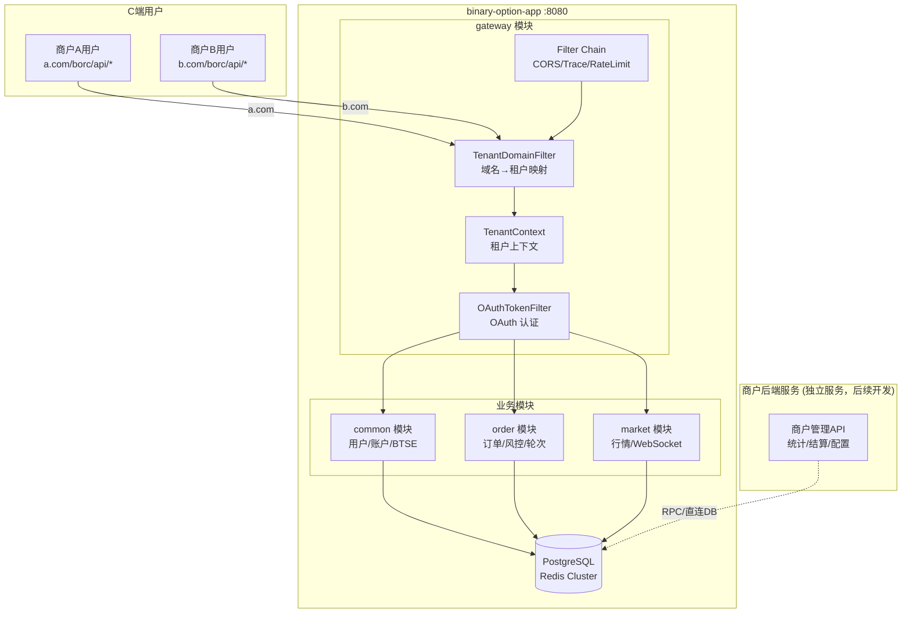
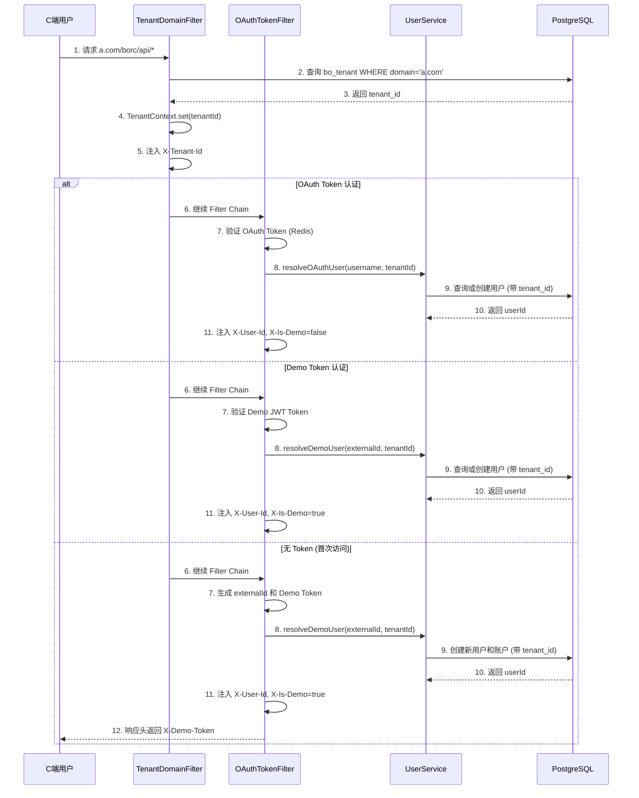
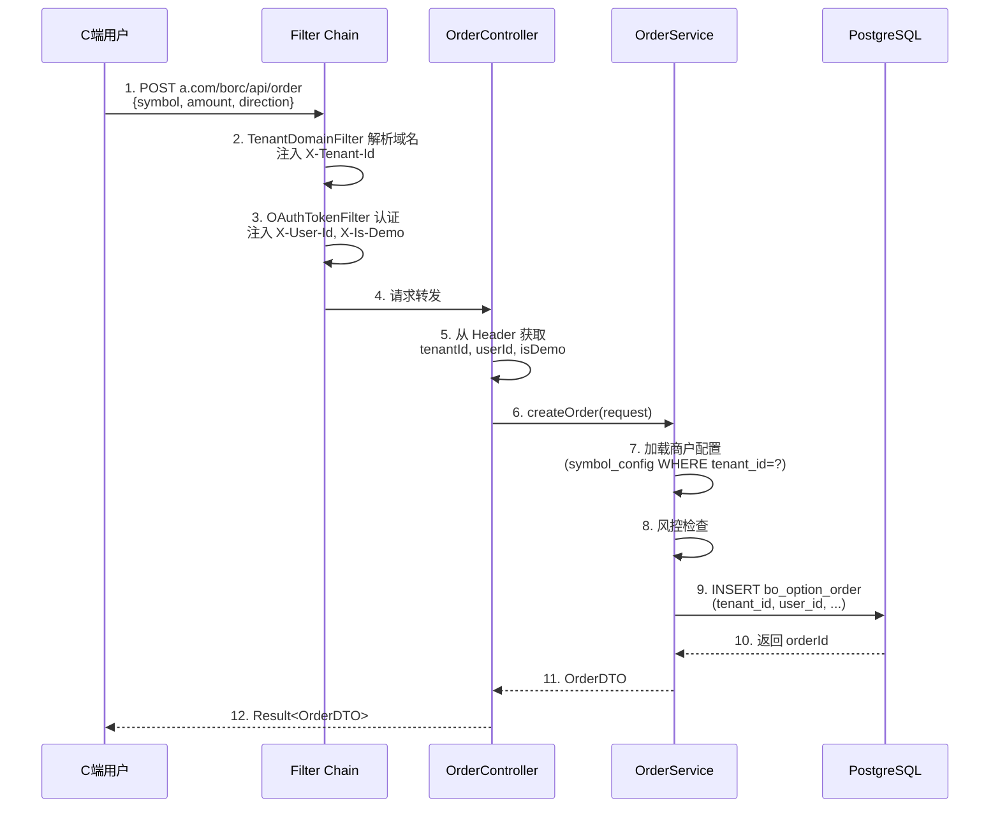
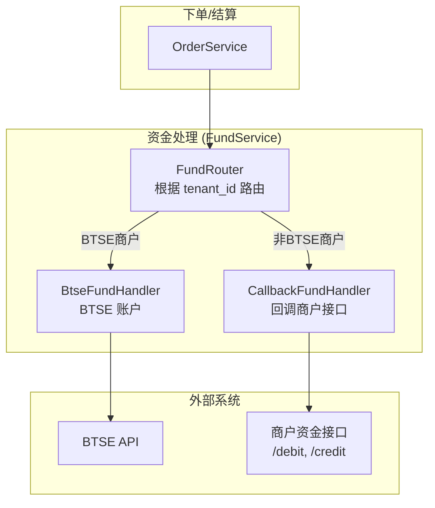
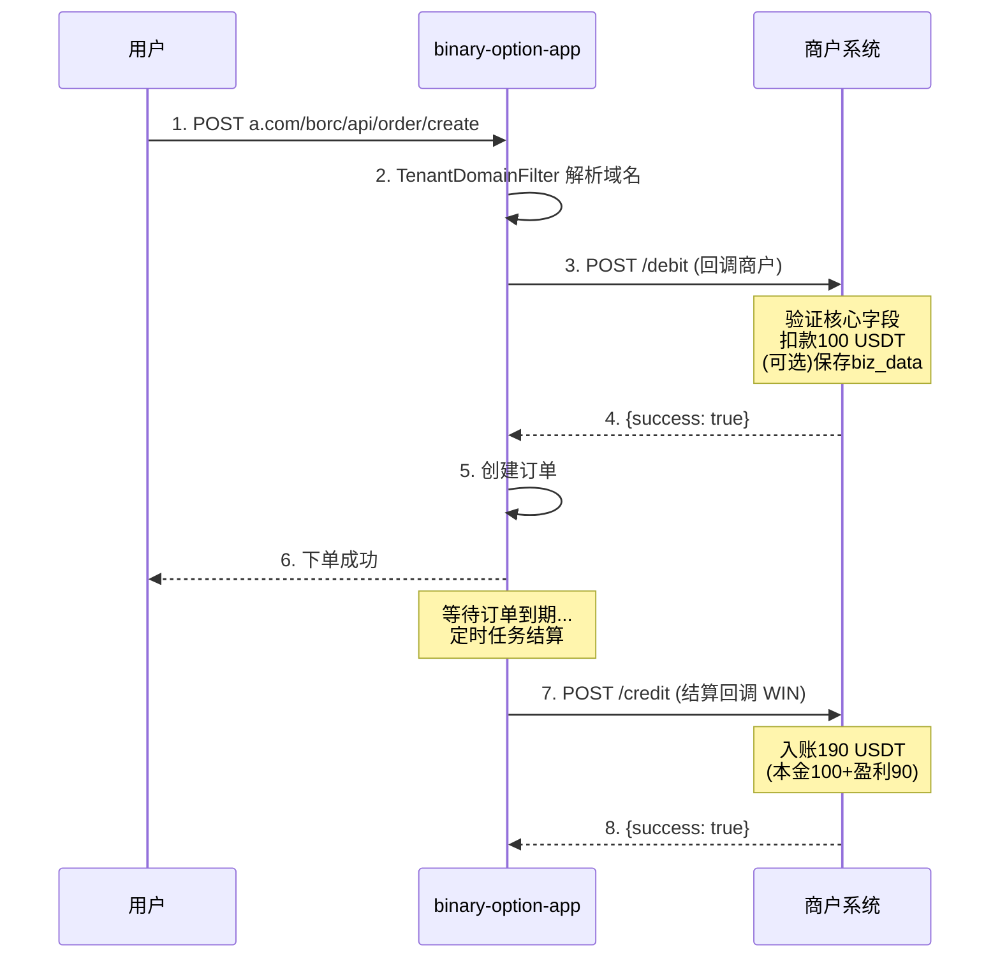
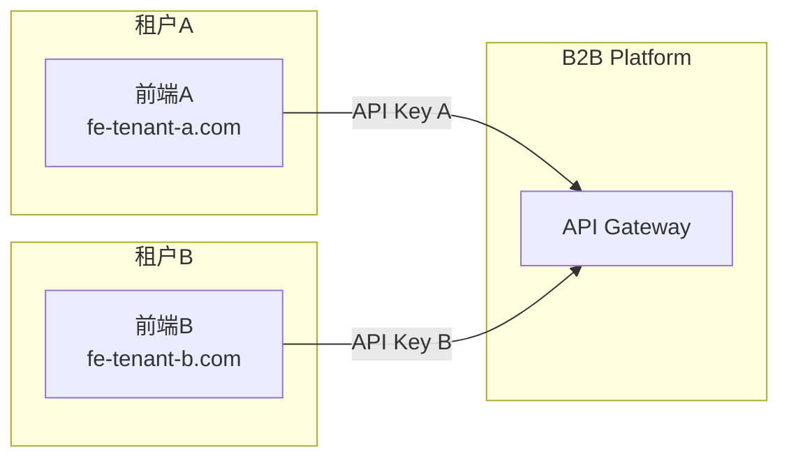
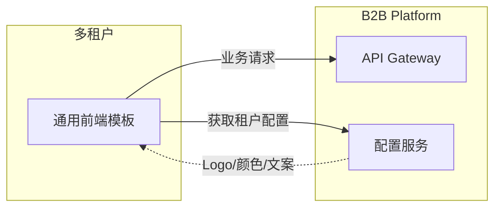

# B2B 平台基本方案

## 1. 概述

### 1.1 背景

为 BinaryOption (BO) 系统实现**多租户 (Multi-Tenant)** 能力，支持多个商户独立运营。

**核心能力**：
- 通过域名识别商户，数据按 `tenant_id` 隔离
- 商户独立配置（交易对、费率、风控）
- 资金处理支持 BTSE 和非 BTSE 两种模式


### 1.2 核心思路



> **架构说明**:
> - **租户隔离通过域名实现**：`a.com` → 商户A，`b.com` → 商户B
> - C端用户通过 `/borc/api/*` + OAuth Token 认证访问
> - `TenantDomainFilter` 根据 Host 请求头解析 tenant_code
> - 商户后端（管理、统计、结算）为独立服务，后续单独开发
> - 详见 [服务合并方案](../15.%20版本迭代/合并服务/服务合并方案.md)

### 1.3 设计目标

| 目标 | 说明 |
|------|------|
| **商户隔离** | 用户、订单、配置按 `tenant_id` 隔离 |
| **独立配置** | 各商户可独立配置交易对、费率、风控 |
| **资金灵活** | 支持 BTSE 账户和非 BTSE 账户两种资金模式 |
| **单体部署** | 在现有 binary-option-app 中扩展，无需新增服务 |

---

## 2. 核心流程

### 2.1 用户认证流程 (自动创建)

> 用户无需单独注册，首次请求时自动创建。通过域名识别商户，用户数据按 `tenant_id` 隔离。



**注入的请求头**：

| Header | 说明 | 来源 |
|--------|------|------|
| `X-Tenant-Id` | 商户ID | TenantDomainFilter (域名解析) |
| `X-User-Id` | 用户ID | OAuthTokenFilter (认证) |
| `X-Is-Demo` | 是否Demo账户 | OAuthTokenFilter (认证) |

### 2.2 下单流程 (C端用户)



---

## 3. 资金处理架构

### 3.1 背景

当前 BO 系统的 REAL 账户资金使用 **BTSE 账户**。为支持非 BTSE 商户，需要将资金处理逻辑抽象，通过 `tenant_id` 区分不同的资金处理方式。

### 3.2 资金处理模式



### 3.3 商户资金配置

| 字段 | 说明 |
|------|------|
| `fund_type` | 资金类型：`BTSE` / `CALLBACK` |
| `callback_url` | 回调地址（fund_type=CALLBACK 时必填） |

```sql
-- bo_tenant 表增加资金配置
ALTER TABLE bo_tenant ADD COLUMN fund_type VARCHAR(16) DEFAULT 'BTSE';
-- BTSE: 使用 BTSE 账户
-- CALLBACK: 回调商户接口处理资金
```

### 3.4 资金处理接口

#### 3.4.1 接口定义

```java
public interface FundHandler {
    // 下单扣款
    Result<Void> debit(Long tenantId, Long userId, BigDecimal amount, String orderId);

    // 结算入账
    Result<Void> credit(Long tenantId, Long userId, BigDecimal amount, String orderId);
}
```

#### 3.4.2 BTSE 实现 (现有逻辑)

```java
@Component
public class BtseFundHandler implements FundHandler {
    // 调用 BTSE API 进行资金操作
    // 现有 BtseTransferService 逻辑
}
```

#### 3.4.3 回调实现 (新增)

```java
@Component
public class CallbackFundHandler implements FundHandler {
    // 回调商户接口处理资金
    // POST {callback_url}/debit
    // POST {callback_url}/credit
}
```

---

## 4. 商户回调接口规范

### 4.1 设计思路

对于 `fund_type=CALLBACK` 的商户，BO 系统通过 HTTP 回调通知商户处理资金：

| 分类 | 说明 |
|------|------|
| **核心字段** | 用户、金额、订单ID 等通用信息 |
| **业务数据** | BO 订单详情（可选保存）|

### 4.2 接口规范

#### 4.2.1 扣款接口 (debit)

B2B 平台调用租户接口，请求扣除用户资金。

```
POST {租户API地址}/debit

Request Headers:
  X-Tenant-Code: {租户编码}
  X-Signature: {签名}
  X-Timestamp: {时间戳}

Request Body:
{
  // ===== 核心字段（通用，租户必须处理）=====
  "transaction_id": "TXN_001",       // 交易ID（幂等）
  "user_id": "U001",                 // 租户侧用户ID
  "amount": 100.00,                  // 金额
  "currency": "USDT",                // 币种

  // ===== 业务数据（扩展，租户可选保存）=====
  "app_code": "BO",                  // 应用标识
  "biz_type": "ORDER",               // 业务类型
  "biz_id": "BO_ORDER_001",          // 业务ID
  "biz_data": {                      // 业务详情（不同应用结构不同）
    "symbol": "BTC-USDT",
    "direction": "UP",
    "duration": 1,
    "odds": 1.90,
    "entry_price": 95000.00,
    "expire_time": "2025-12-02T10:01:00Z"
  }
}

Response (成功):
{
  "success": true,
  "client_transaction_id": "TENANT_TXN_001"  // 租户侧交易ID（可选）
}

Response (失败):
{
  "success": false,
  "error_code": "INSUFFICIENT_BALANCE",
  "error_message": "余额不足"
}
```

**租户实现逻辑**：
1. 验证签名
2. 检查用户余额（基于核心字段）
3. 扣除用户资金
4. （可选）保存 biz_data 作为备份
5. 返回结果

#### 4.2.2 入账接口 (credit)

B2B 平台调用租户接口，请求给用户入账。

```
POST {租户API地址}/credit

Request Headers:
  X-Tenant-Code: {租户编码}
  X-Signature: {签名}
  X-Timestamp: {时间戳}

Request Body:
{
  // ===== 核心字段（通用，租户必须处理）=====
  "transaction_id": "TXN_002",       // 交易ID（幂等）
  "user_id": "U001",                 // 租户侧用户ID
  "amount": 190.00,                  // 金额（本金+盈利 或 退款金额）
  "currency": "USDT",                // 币种

  // ===== 业务数据（扩展，租户可选保存）=====
  "app_code": "BO",                  // 应用标识
  "biz_type": "SETTLEMENT",          // 业务类型
  "biz_id": "BO_ORDER_001",          // 业务ID
  "biz_data": {                      // 业务详情
    "result": "WIN",
    "original_amount": 100.00,
    "profit": 90.00,
    "settle_price": 95100.00,
    "settle_time": "2025-12-02T10:01:00Z"
  }
}

Response:
{
  "success": true,
  "client_transaction_id": "TENANT_TXN_002"
}
```

**租户实现逻辑**：
1. 验证签名
2. 给用户入账（基于核心字段的 amount）
3. （可选）保存 biz_data 作为备份
4. 返回结果

### 4.3 字段说明

#### 核心字段（所有应用通用）

| 字段 | 类型 | 必填 | 说明 |
|------|------|------|------|
| transaction_id | string | 是 | 交易ID，用于幂等 |
| user_id | string | 是 | 租户侧用户ID |
| amount | decimal | 是 | 金额 |
| currency | string | 是 | 币种 |

#### 业务数据（按应用扩展）

| 字段 | 类型 | 必填 | 说明 |
|------|------|------|------|
| app_code | string | 是 | 应用标识（BO/FUTURES/SPOT等） |
| biz_type | string | 是 | 业务类型（ORDER/SETTLEMENT/REFUND等） |
| biz_id | string | 是 | 业务ID |
| biz_data | object | 否 | 业务详情，结构由应用定义 |

#### biz_data 示例（不同应用）

**BinaryOption 下单**：
```json
{
  "symbol": "BTC-USDT",
  "direction": "UP",
  "duration": 1,
  "odds": 1.90,
  "entry_price": 95000.00
}
```

**Futures 开仓**：
```json
{
  "symbol": "BTC-USDT-PERP",
  "side": "LONG",
  "leverage": 10,
  "size": 0.1,
  "entry_price": 95000.00
}
```

### 4.4 完整流程

以 BO 下单为例：



### 4.5 租户配置

```sql
-- 租户配置表
CREATE TABLE bo_tenant (
    id BIGINT PRIMARY KEY,
    tenant_code VARCHAR(32) UNIQUE NOT NULL,
    tenant_name VARCHAR(64) NOT NULL,
    domain VARCHAR(128) UNIQUE NOT NULL,   -- 租户域名 (用于识别租户)
    fund_type VARCHAR(16) DEFAULT 'BTSE',  -- 资金类型: BTSE / CALLBACK
    callback_url VARCHAR(255),             -- 商户回调地址 (fund_type=CALLBACK 时必填)
    api_key VARCHAR(64) UNIQUE,            -- 商户后端 API Key (商户后端服务使用)
    api_secret VARCHAR(128),               -- 商户后端 API Secret
    status SMALLINT DEFAULT 1,
    create_time TIMESTAMP DEFAULT CURRENT_TIMESTAMP,
    update_time TIMESTAMP DEFAULT CURRENT_TIMESTAMP
);

-- 示例数据
INSERT INTO bo_tenant (tenant_code, tenant_name, domain, fund_type, callback_url) VALUES
('TENANT_A', '商户A', 'a.com', 'BTSE', NULL),                           -- BTSE 资金
('TENANT_B', '商户B', 'b.com', 'CALLBACK', 'https://api.b.com/callback'); -- 回调商户
```

### 4.6 错误码规范

租户返回的标准错误码：

| 错误码 | 说明 |
|--------|------|
| INSUFFICIENT_BALANCE | 余额不足 |
| USER_NOT_FOUND | 用户不存在 |
| USER_DISABLED | 用户已禁用 |
| DUPLICATE_TRANSACTION | 重复交易 |
| INVALID_AMOUNT | 金额无效 |
| SYSTEM_ERROR | 系统错误 |

### 4.7 方案优势

| 优势 | 说明 |
|------|------|
| **通用性强** | 同一接口适配所有应用（BO、Futures、Spot等） |
| **职责清晰** | 租户只关注资金流向，无需理解业务逻辑 |
| **数据完整** | 业务数据透传，租户可按需保存备份 |
| **扩展性好** | 新应用只需定义自己的 biz_data 结构 |
| **资金安全** | 平台不触碰资金，租户完全自主 |

---

## 5. 前端部署方案

### 5.1 方案选择

| 方案 | 说明 | 适用阶段 |
|------|------|----------|
| **独立部署** | 每个租户独立部署前端，支持完全定制 | 当前阶段 ✓ |
| **通用模板 + 后台配置** | 统一前端 + 可配置化（Logo、颜色、文案等） | 后续阶段 |

### 5.2 当前方案：独立部署



**优势**：
- 支持完全个性化定制（UI、交互、功能）
- 前期需求变化快，独立部署更灵活
- 各租户可独立迭代，互不影响

**适用场景**：
- 前期客户数量少
- 个性化需求多
- 快速响应定制需求

### 5.3 后续演进：通用模板 + 后台配置

当服务多家 B 端客户后，可演进为配置化方案：



**可配置项**：
- 品牌：Logo、Favicon、标题
- 样式：主题色、字体
- 功能：交易对开关、功能模块显隐
- 文案：多语言、提示语

---

## 6. 总结

### 6.1 方案优势

| 优势 | 说明 |
|------|------|
| **租户隔离** | 用户、订单、配置完全按租户 (`tenant_id`) 隔离 |
| **域名识别** | 通过 Host 请求头识别商户，无需 URL 路径区分 |
| **资金灵活** | 支持 BTSE 和非 BTSE 两种资金处理模式 |
| **单体部署** | Modular Monolith 架构，单 JAR 部署，运维简单 |
| **灵活配置** | 各租户可独立配置交易对、费率、风控 |
| **原生统计** | 直接 SQL 查询数据库，无数据同步问题 |

### 6.2 BO系统改动清单

**新增表**：

| 表名 | 说明 |
|------|------|
| bo_tenant | 商户信息表 (域名映射 + 回调地址) |

**用户相关表** (增加 `tenant_id` 字段)：

| 表名 | 字段 | 说明 |
|------|------|------|
| bo_user | +tenant_id | 用户归属商户 |
| bo_account | +tenant_id | 账户归属商户 |
| bo_account_transaction | +tenant_id | 流水归属商户 |
| bo_option_order | +tenant_id | 订单归属商户 |
| bo_user_round | +tenant_id | 用户轮次归属商户 |

**配置表** (增加 `tenant_id` 字段，支持商户独立配置)：

| 表名 | 字段 | 说明 |
|------|------|------|
| bo_symbol_config | +tenant_id | 商户独立交易对配置 |
| bo_duration_config | +tenant_id | 商户独立时长配置 |
| bo_risk_config | +tenant_id | 商户独立风控配置 |
| bo_global_config | +tenant_id | 商户独立全局配置 |

> **注**: `bo_settlement` (结算记录表) 在商户后端服务中管理，不在 binary-option-app 中

### 6.3 配置加载逻辑调整

```sql
-- 原逻辑
SELECT * FROM bo_symbol_config WHERE enabled = 1

-- 新逻辑 (商户隔离)
SELECT * FROM bo_symbol_config
WHERE enabled = 1
  AND (tenant_id = ? OR tenant_id IS NULL)
ORDER BY tenant_id DESC NULLS LAST
LIMIT 1

-- 说明：
-- tenant_id = NULL 为默认配置（平台兜底）
-- tenant_id = 123 为商户专属配置
-- 优先使用商户专属配置，无则使用默认配置
```

### 6.4 BinaryOption 技术架构

> 详见 [服务合并方案](../15.%20版本迭代/合并服务/服务合并方案.md)

| 项目 | 说明 |
|------|------|
| **架构模式** | Modular Monolith (模块化单体) |
| **应用名称** | binary-option-app |
| **端口** | 8080 (HTTP + WebSocket) |
| **模块划分** | common / order / market / gateway |
| **数据库** | PostgreSQL |
| **缓存** | Redis Cluster |
| **认证** | OAuth Token + Demo Token 双模式 |
| **实时数据** | WebSocket (ws://host:8080/ws/borc) |

**模块说明**:
- `common`: 用户、账户、BTSE 集成
- `order`: 订单、交易轮次、风控
- `market`: 行情缓存、WebSocket 推送
- `gateway`: Servlet Filter 链 (认证/限流/追踪)

### 6.5 B2B Gateway 实现方案

#### 6.5.1 设计决策

**决策**: 不单独部署 B2B Gateway 服务，直接在现有 `binary-option-app` 的 gateway 模块中扩展实现。

**理由**:
| 考量 | 说明 |
|------|------|
| **架构一致** | 现有是 Modular Monolith，B2B 功能作为 gateway 模块的扩展符合设计 |
| **代码复用** | 复用现有的 Filter 链、限流、追踪等基础能力 |
| **运维简单** | 仍然是单 JAR 部署，无需额外服务 |
| **后续可拆** | 如果未来接入更多应用，再拆分也不迟 |

#### 6.5.2 现有 Gateway 能力

```
binary-option-app/src/main/java/com/binaryoption/gateway/
├── config/
│   ├── GatewayFilterConfig.java      # Filter链配置
│   ├── RateLimitProperties.java      # 限流配置
│   └── DemoRegisterProperties.java
├── filter/
│   ├── OAuthTokenFilter.java         # OAuth认证
│   ├── RateLimitFilter.java          # 限流
│   ├── TraceIdFilter.java            # 链路追踪
│   ├── LocaleFilter.java             # 国际化
│   └── CorsBinaryFilter.java         # CORS
└── service/
    └── RateLimitService.java
```

#### 6.5.3 B2B 扩展内容

```
gateway/
├── filter/
│   └── TenantDomainFilter.java       # [新增] 域名→租户映射
├── service/
│   └── TenantService.java            # [新增] 租户管理（域名映射查询）
├── entity/
│   └── Tenant.java                   # [新增] 租户实体
└── context/
    └── TenantContext.java            # [新增] 租户上下文 (ThreadLocal)
```

#### 6.5.4 路由设计

| 路径模式 | 认证方式 | 租户识别 | 说明 |
|----------|----------|----------|------|
| `/borc/api/*` | OAuth Token | 域名 (Host) | C端用户请求 |
| `/rpc/borc/*` | 内部调用 | - | RPC 接口 |

> **租户通过域名区分**：`a.com/borc/api/*` → 商户A，`b.com/borc/api/*` → 商户B

#### 6.5.5 Filter 链顺序

```
请求 → CorsBinaryFilter
     → TraceIdFilter
     → TenantDomainFilter   ← 新增：解析 Host → tenant_code
     → OAuthTokenFilter     ← OAuth 认证
     → RateLimitFilter
     → LocaleFilter
     → Controller
```

#### 6.5.6 域名映射配置

```sql
-- bo_tenant 表增加域名字段
ALTER TABLE bo_tenant ADD COLUMN domain VARCHAR(128) UNIQUE;

-- 示例数据
INSERT INTO bo_tenant (tenant_code, tenant_name, domain) VALUES
('TENANT_A', '商户A', 'a.com'),
('TENANT_B', '商户B', 'b.com');
```

```java
// TenantDomainFilter.java
@Component
public class TenantDomainFilter extends OncePerRequestFilter {

    @Autowired
    private TenantService tenantService;

    @Override
    protected void doFilterInternal(HttpServletRequest request,
            HttpServletResponse response, FilterChain chain) {
        String host = request.getHeader("Host");
        String domain = extractDomain(host); // 去掉端口号

        String tenantCode = tenantService.getTenantCodeByDomain(domain);
        if (tenantCode == null) {
            response.sendError(400, "Unknown domain");
            return;
        }

        TenantContext.setTenantCode(tenantCode);
        try {
            chain.doFilter(request, response);
        } finally {
            TenantContext.clear();
        }
    }
}
```

#### 6.5.7 租户上下文

```java
// TenantContext.java
public class TenantContext {
    private static final ThreadLocal<String> TENANT_CODE = new ThreadLocal<>();

    public static void setTenantCode(String code) { TENANT_CODE.set(code); }
    public static String getTenantCode() { return TENANT_CODE.get(); }
    public static void clear() { TENANT_CODE.remove(); }
}

// 使用示例 - Service 层
public List<SymbolConfig> getActiveSymbols() {
    String tenantCode = TenantContext.getTenantCode();
    return symbolMapper.selectByTenant(tenantCode);
}
```

---

**文档版本**: v2.3
**创建时间**: 2025-12-01
**最后更新**: 2026-01-12
**状态**: 方案设计中

**变更说明 (v2.3)**:
- **简化为 BO 多租户**：移除多应用场景，聚焦 BinaryOption 系统的多租户实现
- **新增资金处理架构**：支持 BTSE 和非 BTSE 两种资金模式，通过 `fund_type` 区分
- **新增商户回调接口规范**：定义 debit/credit 回调接口，支持非 BTSE 商户资金处理
- **bo_tenant 表增加 fund_type 字段**：区分 BTSE 和 CALLBACK 两种资金处理方式

**历史变更**:
- v2.2: 租户隔离改为域名方式，移除多余流程，核心流程基于实际代码
- v2.1: 新增 TenantDomainFilter，商户后端独立服务
- v2.0: 初始 B2B 方案设计
