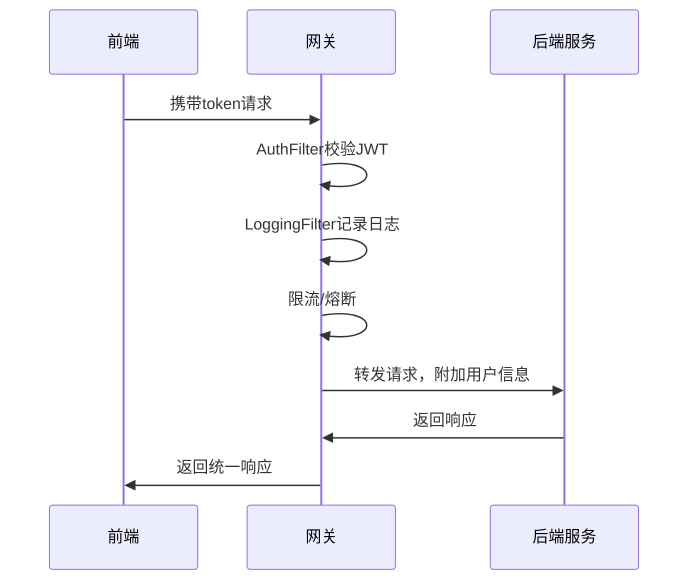

# 网关设计方案

## 1. 网关的作用和意义

在微服务架构中，API网关作为系统的统一入口，承担着请求路由、权限校验、协议适配、流量控制等多项核心职责。通过引入网关，可以有效提升系统的安全性、可维护性和扩展性。

## 2. 项目中网关的架构位置

本项目新增 `option-gateway` 微服务，作为所有外部请求的统一入口。网关负责将请求路由到后端各业务微服务（如订单、用户、行情等），并统一处理认证、限流等横向功能。

```
+---------+        +-----------------+        +---------------------+
|  前端   | -----> |   option-gateway| -----> |  各业务微服务       |
+---------+        +-----------------+        +---------------------+
```

- option-gateway 只对外暴露一个端口，隐藏后端服务细节。
- 所有外部流量必须经过网关，便于统一安全控制和监控。

## 3. 主要功能

1. 路由转发：根据请求路径，将流量转发到对应的微服务。
2. 统一认证与鉴权：集成JWT等认证机制，统一校验用户身份。
3. 限流与防刷：对接口进行限流，防止恶意请求。
4. 协议适配：支持HTTP、WebSocket等多种协议。
5. 统一日志与监控：记录所有请求日志，便于追踪和分析。
6. CORS处理：统一处理跨域请求。
7. API聚合（可选）：将多个微服务的数据聚合为一个接口返回。

## 4. 技术选型

- Spring Cloud Gateway：主流Java微服务网关，官方推荐，功能丰富。
- Spring Cloud Alibaba Nacos：注册中心+配置中心，实现服务发现和动态路由。
- JWT：统一认证与鉴权。
- Resilience4j/Sentinel：限流与熔断。
- Sleuth/Zipkin：链路追踪。
- Lombok、Actuator：开发效率与监控。

## 5. 代码目录结构示例

```
option-gateway/
├── pom.xml
└── src/
    └── main/
        ├── java/com/binaryoption/gateway/
        │   ├── GatewayApplication.java
        │   ├── config/
        │   │   └── GatewayConfig.java
        │   ├── filter/
        │   │   ├── AuthFilter.java
        │   │   └── LoggingFilter.java
        │   └── handler/
        │       └── FallbackHandler.java
        └── resources/
            ├── application.yml
            └── bootstrap.yml
```

- pom.xml：项目依赖配置。
- GatewayApplication.java：Spring Boot 启动类。
- config/：网关相关配置类。
- filter/：自定义全局过滤器（如认证、日志）。
- handler/：降级处理等自定义Handler。
- application.yml / bootstrap.yml：网关服务的配置文件（如路由、端口、注册中心等）。

## 6. 关键功能设计

### 6.1 动态路由
- 路由规则存储在Nacos配置中心，网关自动监听并刷新。
- 支持服务注册发现（lb://service-name）。

**application.yml 示例：**
```yaml
spring:
  application:
    name: option-gateway
  cloud:
    nacos:
      config:
        server-addr: 127.0.0.1:8848
        file-extension: yaml
    gateway:
      discovery:
        locator:
          enabled: true
          lower-case-service-id: true
```

**Nacos路由配置示例（DataId: option-gateway.yaml）：**
```yaml
spring:
  cloud:
    gateway:
      routes:
        - id: order-service
          uri: lb://option-order-service
          predicates:
            - Path=/order/**
        - id: user-service
          uri: lb://option-common-service
          predicates:
            - Path=/user/**
```

### 6.2 统一认证与鉴权（JWT）

#### 6.2.1 JWT工具与安全基础包分离
- JWT 相关工具类（如 JwtUtil）已迁移到 option-common-utils，供网关和各服务复用。
- Spring Security 相关基础类统一放在 option-security-base，仅业务服务依赖，网关不依赖。

#### 6.2.2 网关自定义 AuthFilter 实现
- 网关通过自定义 AuthFilter（实现 GlobalFilter）校验请求头中的 JWT Token。
- 校验通过后，解析 token 并将 userId、username 写入 X-User-Id、X-User-Name header，透传给后端服务。
- 推荐在 AuthFilter 解析 token 后打印日志，便于调试：

```java
System.out.println("【网关】解析token，userId=" + userId + ", username=" + username);
```

- 典型代码片段：
```java
@Component
public class AuthFilter implements GlobalFilter, Ordered {
    @Override
    public Mono<Void> filter(ServerWebExchange exchange, GatewayFilterChain chain) {
        String authHeader = exchange.getRequest().getHeaders().getFirst("Authorization");
        if (authHeader != null && authHeader.startsWith("Bearer ")) {
            String token = authHeader.substring(7);
            Map<String, Object> claims = JwtUtil.parseToken(token);
            Object userId = claims.get("userId");
            Object username = claims.get("username");
            // 日志
            System.out.println("【网关】解析token，userId=" + userId + ", username=" + username);
            // 注入 header
            ServerHttpRequest newRequest = exchange.getRequest().mutate()
                .header("X-User-Id", String.valueOf(userId))
                .header("X-User-Name", String.valueOf(username))
                .build();
            exchange = exchange.mutate().request(newRequest).build();
        }
        return chain.filter(exchange);
    }
    @Override
    public int getOrder() { return 0; }
}
```

#### 6.2.3 后端服务获取用户信息
- 后端服务通过 @RequestHeader("X-User-Id") 获取用户ID，无需自行解析 JWT。
- 例如：
```java
@GetMapping("/me")
public UserDTO getCurrentUser(@RequestHeader("X-User-Id") Long userId) {
    return userService.getUser(userId);
}
```

#### 6.2.4 JJWT 依赖管理最佳实践
- 统一在 parent pom.xml 的 dependencyManagement 中声明：
```xml
<dependencyManagement>
  <dependencies>
    <dependency>
      <groupId>io.jsonwebtoken</groupId>
      <artifactId>jjwt-api</artifactId>
      <version>0.11.5</version>
    </dependency>
    <dependency>
      <groupId>io.jsonwebtoken</groupId>
      <artifactId>jjwt-impl</artifactId>
      <version>0.11.5</version>
      <scope>runtime</scope>
    </dependency>
    <dependency>
      <groupId>io.jsonwebtoken</groupId>
      <artifactId>jjwt-jackson</artifactId>
      <version>0.11.5</version>
      <scope>runtime</scope>
    </dependency>
  </dependencies>
</dependencyManagement>
```
- 子模块只需声明 artifactId，无需写 version。
- 不再引用老的 `io.jsonwebtoken:jjwt` 聚合包。

#### 6.2.5 mock-token 接口说明
- `/user/mock-token` 接口为测试用，每次随机返回一个用户的 token，便于模拟不同用户访问。
- 生产环境应使用真实登录接口获取 token。

### 6.3 限流与熔断
- 可集成 Sentinel 或 Resilience4j。
- 支持基于IP、用户、接口等多维度限流。

**application.yml 限流配置示例：**
```yaml
spring:
  cloud:
    gateway:
      routes:
        - id: order-service
          uri: lb://option-order-service
          predicates:
            - Path=/order/**
          filters:
            - name: RequestRateLimiter
              args:
                redis-rate-limiter.replenishRate: 10
                redis-rate-limiter.burstCapacity: 20
```

### 6.4 日志与监控
- 全局日志过滤器（LoggingFilter），记录请求和响应日志。
- 集成 Spring Boot Actuator，暴露健康检查、监控端点。
- 可选集成链路追踪（Sleuth/Zipkin）。

### 6.5 熔断与降级
- 针对后端服务不可用时，返回自定义降级响应（FallbackHandler）。

## 7. 典型请求流程



## 8. 未来可扩展点

- 动态灰度发布、A/B测试
- API聚合、API文档聚合
- 黑白名单、IP防护
- 管理后台动态维护路由和限流规则

## 9. 参考开源项目

- [Spring Cloud Gateway 官方文档](https://docs.spring.io/spring-cloud-gateway/docs/current/reference/html/)
- [Spring Cloud Alibaba Nacos](https://github.com/alibaba/spring-cloud-alibaba)
- [Spring Cloud Gateway 示例项目](https://github.com/spring-cloud/spring-cloud-gateway)

## 10. 总结

主流网关方案 = Spring Cloud Gateway + Nacos动态路由 + JWT认证 + 限流熔断 + 日志监控

这样既能满足企业级微服务的高可用、高扩展、安全和运维需求，又能与Spring Cloud生态无缝集成。

---

如需详细的网关配置示例或与现有服务的集成方案，请参考后续开发文档。 