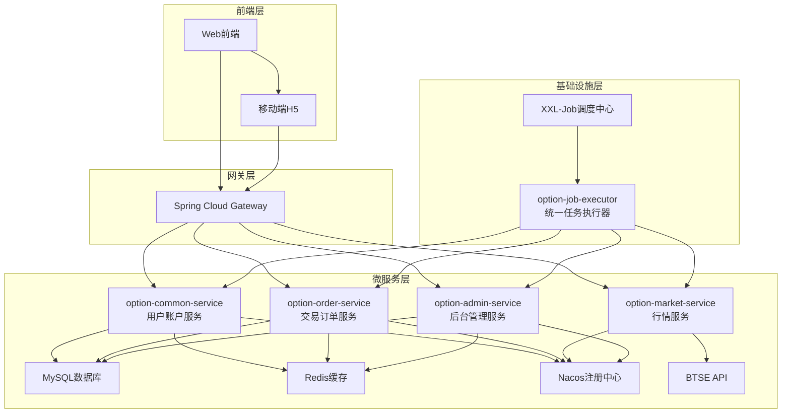

# 二元期权平台详细设计概述

## 版本修订记录

| 版本   | 日期         | 作者    | 说明                     |
|--------|--------------|---------|--------------------------|
| v1.0   | 2025年7月18日 | Barry  | 初稿                     |
| v1.1   | 2025年7月22日 | Barry | 更新实现状态，完成数据库实体映射 |
| v1.2   | 2025年7月22日 | Barry | 完成统一异常处理框架实现 |
| v1.3   | 2025年7月23日 | Barry | 完成安全配置统一，添加权限注解体系 |
| v1.4   | 2025年7月23日 | Barry | 重构为Gateway信任模式安全架构 |
| v1.5   | 2025年7月24日 | Barry | 新增统一任务执行器，完善系统架构 |
| v1.6   | 2025年7月31日 | Barry | 更新BTSE直接划转流程，优化交易体验 |
| v1.7   | 2025年8月04日 | Barry | 统一BTSE API管理，集成用户认证和赔率计算 |

## 1. 概述

本文档基于《二元期权平台产品需求文档(PRD)》，详细设计二元期权交易平台的技术架构、数据模型、API接口和业务流程。

### 1.1 设计原则

- **微服务架构**：按业务领域拆分服务，便于独立开发和部署
- **数据安全**：实盘/模拟账户严格隔离，风控校验全覆盖
- **高可用性**：支持水平扩展，关键服务冗余部署
- **实时性**：交易、行情、结算等核心流程实时处理
- **可扩展性**：支持多币种、多周期扩展

### 1.2 技术栈

- **框架**：Spring Boot 2.7.18, Spring Cloud Gateway
- **数据访问**：MyBatis 3.x（替代JPA，提供更好的SQL控制）
- **数据库**：MySQL 8.0, Redis 6.0
- **服务发现**：Nacos
- **任务调度**：XXL-Job
- **外部接口**：BTSE WebSocket API

### 1.3 当前实现状态

✅ **已完成**：

- **完整的微服务架构**（11个模块）：
  - option-common-service（用户账户服务）
  - option-order-service（交易订单服务）
  - option-market-service（行情数据服务）
  - option-admin-service（后台管理服务）
  - option-gateway（API网关服务）
  - option-job-executor（统一任务执行器）
  - option-security-base（安全框架基础）
  - option-common-utils（通用工具库）
  - option-common-dto（数据传输对象）
  - option-parent（Maven父项目）
  - option-xxl-job（任务调度框架）

- **完整的数据库设计**（17张表，包含索引和关系）

- **生产级安全架构**：
  - JWT认证与授权体系
  - 基于角色和权限的访问控制
  - Gateway信任模式安全配置
  - Redis权限缓存机制
  - AOP切面权限验证

- **统一任务调度系统**：
  - XXL-Job集成的分布式任务调度
  - 数据清理、统计聚合、订单结算等9个任务处理器
  - 任务监控和日志管理
  - 失败重试和告警机制

- **完整的基础设施**：
  - Spring Cloud微服务架构
  - Nacos服务发现和配置中心
  - Redis集群缓存
  - 统一异常处理和国际化支持
  - 生产级部署脚本和监控

✅ **业务功能完成度**：
- 用户注册、登录、账户管理 ✓
- 订单创建、风控校验、结算 ✓
- 行情数据采集、K线生成 ✓
- 后台管理、权限控制、统计报表 ✓
- 定时任务调度和数据维护 ✓

🔄 **持续优化**：
- WebSocket实时推送优化
- 性能监控和告警完善
- 前端界面集成和用户体验优化

## 2. 版本更新历史

### 2.1 v1.6版本更新概要 **[2025年7月31日]**

本次更新优化了资金流转流程，实现了与BTSE的直接集成：

**核心变更**：
1. **下单流程优化**：
   - 取消预充值步骤，下单时直接从BTSE划转资金
   - 划转成功后才创建订单，保证资金安全
   - 新增交易类型：`BTSE_IN`（BTSE转入）

2. **结算流程优化**：
   - 盈利自动转回BTSE，减少平台资金沉淀
   - 平局也自动转回BTSE（与盈利处理一致）
   - 新增交易类型：`BTSE_OUT`（BTSE转出）
   - 仅亏损场景资金保留在平台

3. **技术架构增强**：
   - 新增BTSE API客户端接口
   - 增强事务一致性保证
   - 完善异常处理和补偿机制

**影响范围**：
- 数据库：`account_transaction`表新增BTSE转账类型
- 业务流程：下单交易流程、自动结算流程
- 技术实现：新增BTSE直接划转集成
- 状态变化：订单状态数据变化说明

**标注说明**：文档中所有v1.6相关修改均以 **[v1.6更新]** 或 **[v1.6新增]** 标注。

### 2.2 v1.7版本更新概要 **[2025年8月04日]**

本次更新统一了所有BTSE API的调用，建立了中心化的API管理体系：

**核心变更**：
1. **BTSE API统一管理**：
   - 新增BTSE API统一管理章节
   - 将所有BTSE相关调用集中到BtseApiClient接口
   - 支持用户认证、赔率计算、资金管理、行情数据

2. **用户认证改造**：
   - 登录流程集成BTSE认证
   - 用户登录状态通过BTSE API验证
   - 自动同步BTSE用户信息到本地

3. **赔率计算优化**：
   - 赔率从BTSE实时获取
   - 支持本地缓存和降级策略
   - 动态赔率推送机制

4. **架构增强**：
   - 统一异常处理和监控
   - 熔断降级机制
   - API调用链路追踪

**影响范围**：
- 新架构：BTSE API统一管理
- 用户流程：用户注册登录流程
- 技术实现：赔率计算、用户认证、异常处理

**标注说明**：文档中所有v1.7相关修改均以 **[v1.7更新]** 或 **[v1.7新增]** 标注。

## 3. 整体架构图

## 4. 服务端口配置

| 服务模块 | 服务端口 | 额外端口 | 用途说明 |
|---------|---------|----------|----------|
| option-gateway | 8080 | - | API网关，统一入口 |
| option-common-service | 8081 | - | 用户账户服务 |
| option-order-service | 8082 | - | 交易订单服务 |
| option-market-service | 8083 | - | 行情数据服务 |
| option-admin-service | 8084 | - | 后台管理服务 |
| option-job-executor | 8085 | 10000 | 统一任务执行器 (10000为XXL-Job内部通信端口) |
| XXL-Job Admin | 9090 | - | 任务调度管理中心 |

## 5. 相关文档链接

- [系统架构设计](./207_02_系统架构设计.md) - 详细的系统架构和服务设计
- [数据库设计](./207_03_数据库设计.md) - 完整的数据库表结构设计
- [API接口设计](./207_04_API接口设计.md) - 所有服务的API接口文档
- [业务流程设计](./207_05_业务流程设计.md) - 核心业务流程详细设计
- [技术实现文档](./207_06_技术实现_基础.md) - 基础技术实现方案
- [BTSE集成文档](./207_07_技术实现_BTSE.md) - BTSE相关技术实现
- [安全设计](./207_08_安全设计.md) - 安全架构和权限控制
- [监控告警设计](./207_09_监控告警设计.md) - 监控告警体系
- [任务调度设计](./207_10_任务调度设计.md) - 统一任务调度系统

---
**文档版本**: v1.7  
**最后更新**: 2025年8月04日  
**维护者**: Barry