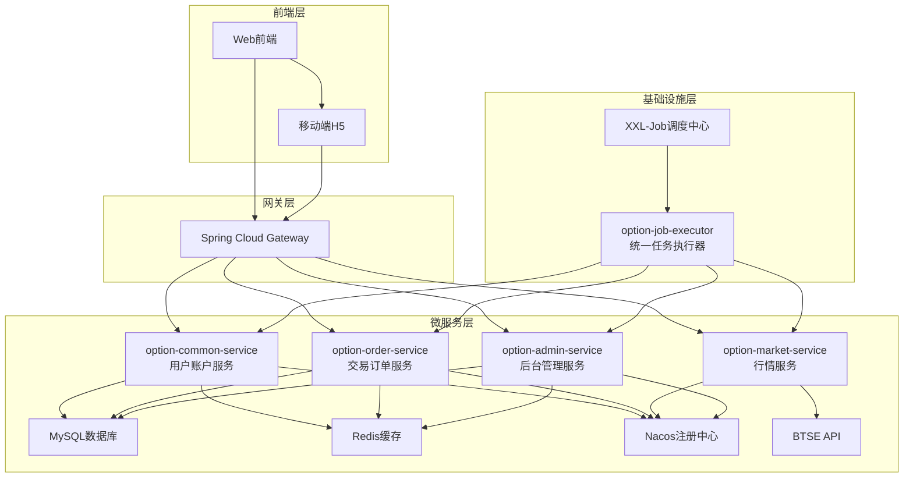
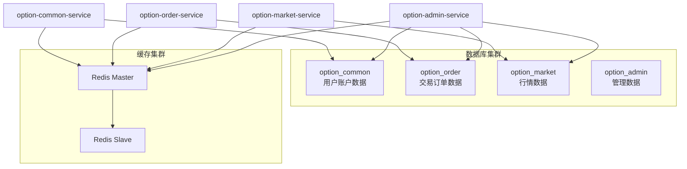
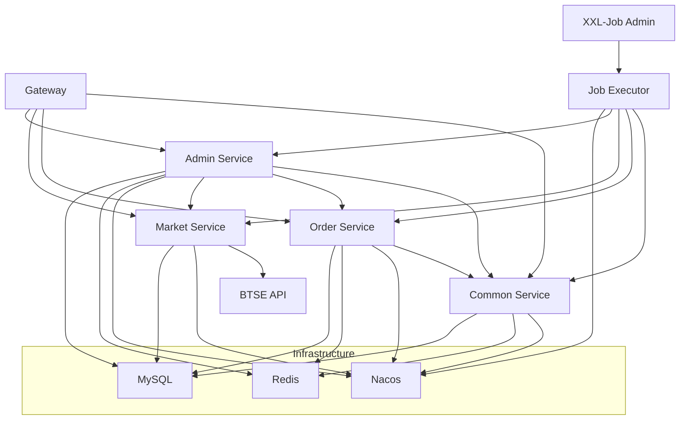

# 二元期权平台系统架构设计

## 1. 整体架构设计

### 1.1 架构图

### 1.2 服务端口配置

| 服务模块 | 服务端口 | 额外端口 | 用途说明 |
|---------|---------|----------|----------|
| option-gateway | 8080 | - | API网关，统一入口 |
| option-common-service | 8081 | - | 用户账户服务 |
| option-order-service | 8082 | - | 交易订单服务 |
| option-market-service | 8083 | - | 行情数据服务 |
| option-admin-service | 8084 | - | 后台管理服务 |
| option-job-executor | 8085 | 10000 | 统一任务执行器 (10000为XXL-Job内部通信端口) |
| XXL-Job Admin | 9090 | - | 任务调度管理中心 |

## 2. 微服务设计

### 2.1 option-common-service (用户账户服务)

**端口**: 8081  
**数据库**: option_common

**职责**:
- 用户管理：注册、登录、信息维护
- 账户管理：实盘/模拟账户、余额管理
- 资产管理：充值、提现、转账记录
- 基础配置：币种管理、全局参数

**核心表**:
- user (用户表)
- account (账户表)  
- account_transaction (资金流水表)
- symbol_config (币种配置表)
- global_config (全局配置表)

**主要接口**:
- `/user` - 用户管理接口
- `/account` - 账户管理接口
- `/transaction` - 资金流水接口
- `/config` - 配置管理接口

### 2.2 option-order-service (交易订单服务)

**端口**: 8082  
**数据库**: option_order

**职责**:
- 交易管理：下单、撤单、订单查询
- 回合管理：交易周期、倒计时、锁单
- 风控管理：限额校验、黑名单、风控日志
- 结算引擎：自动结算、盈亏计算、资金划转

**核心表**:
- option_order (订单表)
- trading_round (交易回合表)
- duration_config (周期配置表)
- risk_config (风控配置表)
- risk_log (风控日志表)

**主要接口**:
- `/order` - 订单管理接口
- `/round` - 回合管理接口
- `/risk` - 风控管理接口

### 2.3 option-market-service (行情服务)

**端口**: 8083  
**数据库**: option_market

**职责**:
- 行情推送：实时价格、K线数据
- BTSE集成：WebSocket连接管理
- 数据缓存：价格快照、历史数据

**核心表**:
- price_snapshot (价格快照表)
- kline_data (K线数据表)

**主要接口**:
- `/market` - 行情数据接口
- `/websocket` - WebSocket推送接口

### 2.4 option-admin-service (后台管理服务)

**端口**: 8084  
**数据库**: 跨数据库查询

**职责**:
- 用户管理：用户查询、账户管理、黑名单管理
- 交易管理：订单监控、回合管理、结算管理
- 风控管理：风控配置、风控日志、实时监控
- 系统配置：币种管理、周期配置、全局参数配置
- 数据统计：业务统计、财务报表、系统监控

**主要接口**:
- `/admin/users` - 用户管理接口
- `/admin/orders` - 订单管理接口
- `/admin/configs` - 配置管理接口
- `/admin/stats` - 统计分析接口
- `/admin/monitor` - 系统监控接口

### 2.5 option-job-executor (统一任务执行器)

**端口**: 8085 (内部通信: 10000)  
**依赖**: XXL-Job Admin

**职责**:
- 任务调度：基于XXL-Job的分布式定时任务管理
- 数据维护：数据清理、统计聚合、完整性检查
- 业务调度：订单结算、超时处理、系统监控
- 日志管理：任务执行日志、性能监控、异常告警

**核心任务处理器**:
- **市场数据类**: DataCleanupJobHandler, DataIntegrityJobHandler
- **统计聚合类**: DailyStatsJobHandler, HourlyStatsJobHandler, StatsCleanupJobHandler  
- **订单处理类**: OrderSettlementJobHandler, OrderTimeoutJobHandler
- **系统维护类**: HealthCheckJobHandler, LogCleanupJobHandler

**技术特性**:
- 支持任务失败重试和监控告警
- 通过Feign客户端调用业务服务接口
- 统一的任务执行日志和性能统计
- 支持动态任务配置和参数调整

### 2.6 option-gateway (API网关)

**端口**: 8080  

**职责**:
- 路由转发：请求分发、负载均衡
- 认证鉴权：JWT验证、用户身份传递
- 限流熔断：接口保护、异常处理

**核心功能**:
- 统一入口和路由规则
- JWT Token验证和用户信息传递
- 跨域处理和安全防护
- 请求日志和性能监控

## 3. 技术栈选型

### 3.1 核心框架

- **Spring Boot**: 2.7.18
- **Spring Cloud Gateway**: 网关路由
- **MyBatis**: 3.x (数据访问层)
- **Spring Security**: 安全框架
- **Spring Cloud OpenFeign**: 服务间调用

### 3.2 中间件

- **MySQL**: 8.0 (主数据库)
- **Redis**: 6.0 (缓存和会话)
- **Nacos**: 2.x (服务发现和配置中心)
- **XXL-Job**: 2.x (分布式任务调度)

### 3.3 监控工具

- **Spring Boot Actuator**: 应用监控
- **Micrometer**: 指标收集
- **Logback**: 日志框架
- **WebSocket**: 实时通信

### 3.4 外部集成

- **BTSE API**: 用户认证、赔率获取、资金划转
- **WebSocket**: 实时行情推送

## 4. 部署架构

### 4.1 环境规划

- **开发环境**: 单机部署，所有服务运行在本地
- **测试环境**: 容器化部署，模拟生产环境
- **生产环境**: 集群部署，高可用配置

### 4.2 数据库设计

### 4.3 服务依赖关系

## 5. 扩展性设计

### 5.1 水平扩展

- **无状态服务**: 所有业务服务设计为无状态，支持多实例部署
- **数据库分片**: 支持按用户ID或时间维度分片
- **缓存分布**: Redis集群模式，支持数据分片和高可用

### 5.2 垂直扩展

- **服务拆分**: 按业务边界清晰拆分，便于独立扩展
- **数据库分离**: 不同服务使用独立数据库，避免资源竞争
- **异步处理**: 重要业务流程支持异步处理，提高并发能力

### 5.3 容灾设计

- **多机房部署**: 支持跨机房部署，保证高可用
- **数据备份**: 定期数据备份和恢复机制
- **服务降级**: 关键服务支持降级策略，保证核心功能可用

---
**文档版本**: v1.7  
**最后更新**: 2025年8月04日  
**维护者**: Barry  
**相关文档**: [详细设计概述](./207_01_详细设计概述.md)