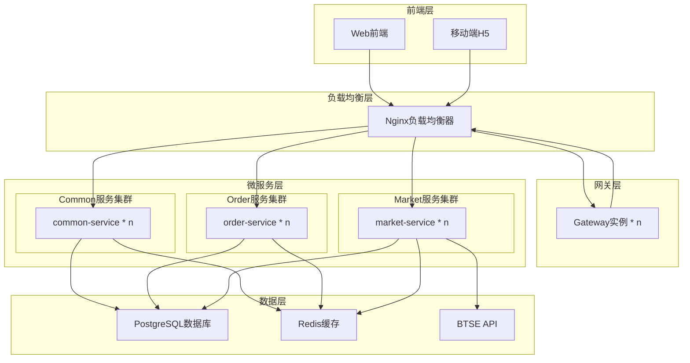
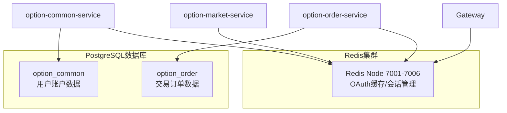
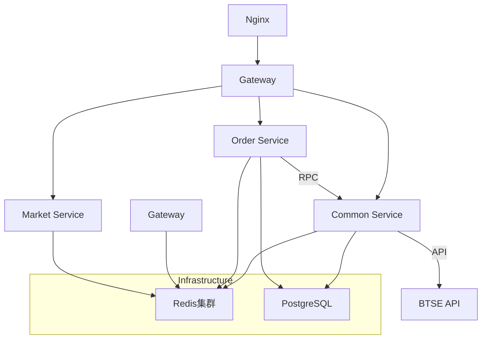

# 二元期权平台系统架构设计

## 1. 整体架构设计

### 1.1 架构图



### 1.2 服务端口配置

| 服务模块 | 端口 | 集群配置 | 用途说明 |
|---------|------|----------|----------|
| Nginx | 80/443 | 主备模式 | 负载均衡器，统一入口 |
| option-gateway | 8080 | n个实例 | API网关集群 |
| option-common-service | 8080 | n个实例 | 用户账户服务集群，BTSE集成 |
| option-order-service | 8080 | n个实例 | 交易订单服务集群，风控管理 |
| option-market-service | 8080 | n个实例 | WebSocket实时行情推送服务 |

### 1.3 Nginx负载均衡配置

**负载均衡策略**：
- **前端流量**: Nginx(80) → Gateway(8080)
- **服务路由**: Nginx(8080) → 各微服务(8080)
- **健康检查**: max_fails=3 fail_timeout=30s
- **长连接**: keepalive 保持连接池

**配置文件结构**：
```
nginx/
├── nginx.conf              # 主配置文件
└── conf.d/
    ├── upstream.conf       # 上游服务定义
    ├── default.conf        # 80端口入口配置
    ├── services.conf       # 8080端口服务路由
    └── proxy_params.conf   # 代理参数配置
```

**上游服务定义** (upstream.conf)：
```nginx
# Gateway上游 (端口80入口)
upstream gateway-upstream {
    server option-gateway:8080 max_fails=3 fail_timeout=30s;
    keepalive 32;
}

# Common Service上游
upstream common-service-upstream {
    server option-common-service:8080 max_fails=3 fail_timeout=30s weight=1;
    keepalive 16;
}

# Order Service上游
upstream order-service-upstream {
    server option-order-service:8080 max_fails=3 fail_timeout=30s weight=1;
    keepalive 16;
}

# Market Service上游
upstream market-service-upstream {
    server option-market-service:8080 max_fails=3 fail_timeout=30s weight=1;
    keepalive 16;
}
```

**80端口入口** (default.conf)：
```nginx
server {
    listen 80 default_server;
    
    # WebSocket路由 (直接到market-service)
    location /ws/market {
        proxy_pass http://market-service-upstream/ws/market;
        proxy_http_version 1.1;
        proxy_set_header Upgrade $http_upgrade;
        proxy_set_header Connection "upgrade";
        proxy_connect_timeout 7d;
        proxy_send_timeout 7d;
        proxy_read_timeout 7d;
    }
    
    # 所有API请求通过Gateway
    location / {
        proxy_pass http://gateway-upstream;
        proxy_http_version 1.1;
        proxy_set_header Host $host;
        proxy_set_header X-Real-IP $remote_addr;
        proxy_set_header X-Forwarded-For $proxy_add_x_forwarded_for;
    }
}
```

**8080端口服务路由** (services.conf)：
```nginx
server {
    listen 8080;
    
    # Common Service路由
    location /api/auth/ {
        proxy_pass http://common-service-upstream/api/auth/;
        include /etc/nginx/conf.d/proxy_params.conf;
    }
    
    location /api/user/ {
        proxy_pass http://common-service-upstream/api/user/;
        include /etc/nginx/conf.d/proxy_params.conf;
    }
    
    location /api/account/ {
        proxy_pass http://common-service-upstream/api/account/;
        include /etc/nginx/conf.d/proxy_params.conf;
    }
    
    # Order Service路由
    location /api/order/ {
        proxy_pass http://order-service-upstream/api/order/;
        include /etc/nginx/conf.d/proxy_params.conf;
    }
    
    location /api/public/order/ {
        proxy_pass http://order-service-upstream/api/public/order/;
        include /etc/nginx/conf.d/proxy_params.conf;
    }
}
```

## 2. 微服务设计

### 2.1 option-common-service (用户账户服务)

**端口**: 8080  
**数据库**: option_common (PostgreSQL)

**职责**:
- 用户管理：OAuth自动注册、用户信息维护
- 账户管理：DEMO/REAL双账户体系、余额管理
- BTSE集成：转账服务、资金流转、Mock API支持
- 资产管理：充值、提现、转账记录、统计更新
- 基础配置：交易对配置、全局参数

**核心表**:
- user (用户表) - OAuth用户数据
- account (账户表) - DEMO/REAL双账户体系  
- account_transaction (资金流水表) - 所有资金变动记录
- btse_transfer_log (BTSE转账记录表) - REAL账户资金流转
- symbol_config (交易对配置表)
- global_config (全局配置表)

**主要接口**:
- **用户管理** (`/api/user`)
  - `GET /profile` - 获取用户信息
  - `PUT /agreements` - 更新用户协议状态
- **账户管理** (`/api/account`)
  - `GET /list` - 获取账户列表
  - `GET /balance/{accountType}` - 获取账户余额
  - `POST /demo/claim-bonus` - DEMO账户领取奖金
- **转账服务** (`/api/account/transfer`)
  - `POST /from-btse` - BTSE转入
  - `POST /to-btse` - 转出到BTSE
  - `GET /history` - 转账历史记录
  - `GET /btse-logs` - BTSE转账日志
  - `GET /config` - 转账配置信息
- **RPC接口**: `resolveOAuthUser`、`getAccountBalance`、`atomicTransferOut`

### 2.2 option-order-service (交易订单服务)

**端口**: 8080  
**数据库**: option_order (PostgreSQL)

**职责**:
- 订单管理：创建订单、状态机管理(PENDING→ACTIVE→WIN/LOSE)
- 交易轮次：轮次创建、投注统计、自动结算
- 风控管理：限额校验、风险检查、对冲策略
- 结算引擎：基于Fixture的自动结算、盈亏计算、资金划转
- 预订单机制：REAL账户预订单，确保Client Transfer ID唯一性
- 补偿机制：处理超时PENDING订单，资金退回

**核心表**:
- orders (订单表) - 状态机管理PENDING→ACTIVE→WIN/LOSE
- trading_round (交易轮次表) - 轮次创建和统计
- duration_config (周期配置表)
- risk_config (风控配置表)
- order_hedge_log (订单对冲记录表)

**主要接口**:
- **订单管理** (`/api/order`)
  - `POST /` - 创建订单
  - `GET /{id}` - 获取订单详情
  - `POST /list/history` - 查询历史订单(按轮次聚合)
  - `GET /list/round/{roundId}` - 查询轮次订单
  - `POST /{id}/cancel` - 取消订单
  - `GET /stats` - 获取订单统计
- **公开接口** (`/api/public/order`)
  - `GET /symbols` - 获取交易对列表
  - `GET /round/current/{symbolId}` - 获取当前轮次信息
  - `GET /market/history` - 获取市场历史数据
- **RPC接口**: `settleOrdersByRound`、`compensatePendingOrders`、`performOrderHedge`

### 2.3 option-market-service (WebSocket服务)

**端口**: 8080  

**职责**:
- WebSocket实时行情推送
- 支持8个主流交易对(BTC, ETH, BNB等)
- 心跳检测和订阅管理
- Mock数据生成(每秒更新)

**主要接口**:
- **WebSocket** (`ws://localhost:8080/ws/market`)
  - 连接管理: `afterConnectionEstablished`/`afterConnectionClosed`
  - 消息处理: `handleTextMessage`
  - 支持命令: subscribe/unsubscribe/ping
- **测试页面**: `http://localhost:8080/market-test.html`


### 2.4 option-gateway (API网关)

**端口**: 8080  

**职责**:
- 路由转发：请求分发、负载均衡
- OAuth认证：BTSE OAuth Token验证、自动用户注册
- 用户解析：Mock用户ID映射、身份传递
- 限流熔断：接口保护、异常处理

**核心功能**:
- 统一入口和路由规则(common/order/market/btse-rpc)
- OAuth Token验证和用户信息传递
- Redis集群OAuth缓存集成
- 跨域处理和安全防护
- 请求日志和性能监控

### 2.5 OAuth集成架构

**业务流程**:
1. BTSE OAuth Token验证（Gateway过滤器）
2. Redis集群中读取OAuth用户数据
3. 自动用户注册（首次访问）
4. Mock用户ID(10000-99999)映射到本地数据库ID

**技术组件**:
- `OAuthTokenFilter.java` - Gateway OAuth Token过滤器
- `resolveOAuthUser` RPC接口 - 用户自动注册和ID解析
- Redis集群存储 - OAuth Token数据缓存
- JSON压缩存储 - 节省空间和避免语法错误

## 3. 技术栈选型

### 3.1 核心框架

- **Spring Boot**: 2.7.18
- **Spring Cloud Gateway**: 网关路由
- **MyBatis**: 3.x (数据访问层)
- **Spring Security**: 安全框架
- **Spring Cloud OpenFeign**: 服务间调用

### 3.2 数据库支持

- **数据库**: PostgreSQL 14.x
- **持久化框架**: MyBatis 3.x
- **连接池**: HikariCP
- **数据库分片**: 支持按用户ID或时间维度分片

### 3.3 中间件

- **PostgreSQL**: 14.x (主数据库)
- **Redis**: 6.0 (缓存和OAuth缓存)
- **Redis集群**: 6节点集群(127.0.0.1:7001-7006)
- **Nginx**: 1.24.x (负载均衡和反向代理)
  - 双端口架构: 80(外部入口) + 8080(内部路由)
  - 配置模块化: upstream/default/services/proxy_params
  - WebSocket支持: 7天超时设置

### 3.4 其他组件

- **Logback**: 日志框架
- **WebSocket**: 实时通信

### 3.5 外部集成

- **BTSE API**: 用户认证、赔率获取、资金划转
- **WebSocket**: 实时行情推送

## 4. 部署架构

### 4.1 环境规划

- **开发环境**: 单机部署，所有服务运行在本地
- **测试环境**: 容器化部署，模拟生产环境
- **生产环境**: 集群部署，高可用配置

### 4.2 数据存储架构

**数据库规划**：
- **option_common库**: 用户、账户、转账记录
- **option_order库**: 订单、交易轮次、风控记录

**Redis集群架构**：
- **6节点集群**: 7001-7006端口
- **用途**: OAuth缓存、会话管理、临时数据



### 4.3 服务依赖关系



## 5. 扩展性设计

### 5.1 水平扩展

- **无状态服务**: 所有业务服务设计为无状态，支持多实例部署
- **Nginx负载均衡**: 支持多服务实例动态负载均衡
- **数据库分片**: PostgreSQL支持按用户ID或时间维度分片
- **Redis集群**: 6节点集群模式，支持OAuth缓存和数据分片
- **服务拆分**: OrderService已拆分为5个专业服务，支持独立扩展

### 5.2 垂直扩展

- **服务拆分**: 按SOLID原则拆分，单一职责、便于独立扩展
- **数据库分离**: 不同服务使用独立数据库，避免资源竞争
- **原子操作**: 所有账户操作使用数据库级原子操作，保证并发安全
- **异步处理**: 重要业务流程支持异步处理，提高并发能力

### 5.3 容灾设计

- **多机房部署**: 支持跨机房部署，保证高可用
- **数据备份**: 定期数据备份和恢复机制
- **服务降级**: 关键服务支持降级策略，保证核心功能可用
