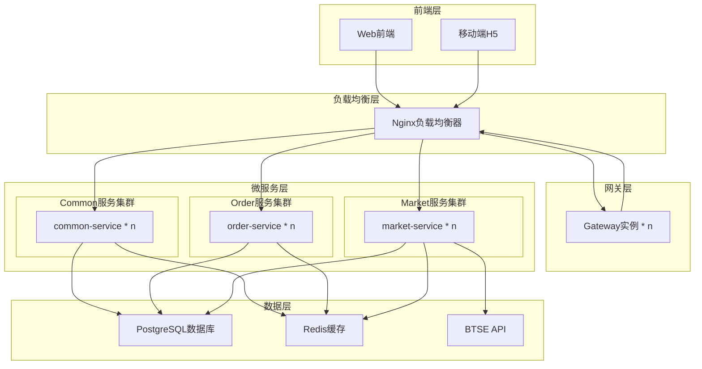
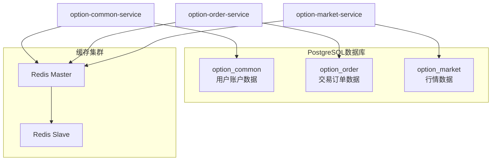
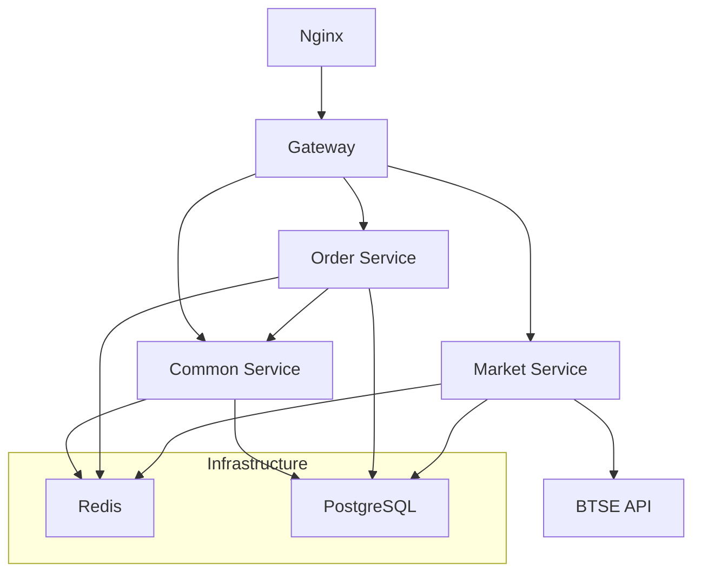

# 二元期权平台系统架构设计

## 1. 整体架构设计

### 1.1 架构图



### 1.2 服务端口配置

| 服务模块 | 端口范围 | 集群配置 | 用途说明 |
|---------|---------|----------|----------|
| Nginx | 80/443 | 主备模式 | 负载均衡器，统一入口 |
| option-gateway | 8080 | n个实例 | API网关集群 |
| option-common-service | 8080 | n个实例 | 用户账户服务集群 |
| option-order-service | 8080 | n个实例 | 交易订单服务集群 |
| option-market-service | 8080 | n个实例 | 行情数据服务集群 |

### 1.3 Nginx负载均衡配置

**负载均衡策略**：
- **前端流量**: Nginx → Gateway集群（轮询）
- **服务间调用**: Gateway → 各微服务集群（轮询/权重）
- **健康检查**: 自动检测服务实例状态，故障实例自动摘除

**Nginx配置示例(TEST)**：
```nginx
upstream gateway_cluster {
    server 127.0.0.1:8080 weight=1 max_fails=3 fail_timeout=30s;
    server 127.0.0.1:8081 weight=1 max_fails=3 fail_timeout=30s;
}

upstream common_service_cluster {
    server 127.0.0.1:8082 weight=1 max_fails=3 fail_timeout=30s;
    server 127.0.0.1:8083 weight=1 max_fails=3 fail_timeout=30s;
}

upstream order_service_cluster {
    server 127.0.0.1:8084 weight=1 max_fails=3 fail_timeout=30s;
    server 127.0.0.1:8085 weight=1 max_fails=3 fail_timeout=30s;
}

upstream market_service_cluster {
    server 127.0.0.1:8086 weight=1 max_fails=3 fail_timeout=30s;
    server 127.0.0.1:8087 weight=1 max_fails=3 fail_timeout=30s;
}

server {
    listen 80;
    
    # 前端请求转发到Gateway集群
    location / {
        proxy_pass http://gateway_cluster;
        proxy_set_header Host $host;
        proxy_set_header X-Real-IP $remote_addr;
    }
    
    # 直接服务调用（内部RPC）
    location /common/ {
        proxy_pass http://common_service_cluster/;
    }
    
    location /order/ {
        proxy_pass http://order_service_cluster/;
    }
    
    location /market/ {
        proxy_pass http://market_service_cluster/;
    }
}
```

## 2. 微服务设计

### 2.1 option-common-service (用户账户服务)

**端口**: 8081  
**数据库**: option_common

**职责**:
- 用户管理：注册、登录、信息维护
- 账户管理：实盘/模拟账户、余额管理
- 资产管理：充值、提现、转账记录
- 基础配置：币种管理、全局参数

**核心表**:
- user (用户表)
- account (账户表)  
- account_transaction (资金流水表)
- symbol_config (币种配置表)
- global_config (全局配置表)

**主要接口**:
- `/user` - 用户管理接口
- `/account` - 账户管理接口
- `/transaction` - 资金流水接口
- `/config` - 配置管理接口

### 2.2 option-order-service (交易订单服务)

**端口**: 8082  
**数据库**: option_order

**职责**:
- 交易管理：下单、撤单、订单查询
- 回合管理：交易周期、倒计时、锁单
- 风控管理：限额校验、黑名单、风控日志
- 结算引擎：自动结算、盈亏计算、资金划转

**核心表**:
- option_order (订单表)
- trading_round (交易回合表)
- duration_config (周期配置表)
- risk_config (风控配置表)
- risk_log (风控日志表)

**主要接口**:
- `/order` - 订单管理接口
- `/round` - 回合管理接口
- `/risk` - 风控管理接口

### 2.3 option-market-service (行情服务)

**端口**: 8083  
**数据库**: option_market

**职责**:
- 行情推送：实时价格、K线数据
- BTSE集成：WebSocket连接管理
- 数据缓存：价格快照、历史数据

**核心表**:
- price_snapshot (价格快照表)
- kline_data (K线数据表)

**主要接口**:
- `/market` - 行情数据接口
- `/websocket` - WebSocket推送接口

### 2.4 定时任务设计

**实现方案**: 各服务内置 Spring @Scheduled

**主要任务**:
- **option-order-service**:
  - 订单结算任务：每分钟执行
  - PENDING订单补偿：每分钟执行
  - 回合创建任务：每分钟执行
  
- **option-common-service**:
  - BTSE转账补偿：每分钟执行
  - 数据统计更新：每小时执行
  
- **option-market-service**:
  - 行情数据清理：每天执行
  - K线数据聚合：每5分钟执行

### 2.5 option-gateway (API网关)

**端口**: 8080  

**职责**:
- 路由转发：请求分发、负载均衡
- 认证鉴权：JWT验证、用户身份传递
- 限流熔断：接口保护、异常处理

**核心功能**:
- 统一入口和路由规则
- JWT Token验证和用户信息传递
- 跨域处理和安全防护
- 请求日志和性能监控

## 3. 技术栈选型

### 3.1 核心框架

- **Spring Boot**: 2.7.18
- **Spring Cloud Gateway**: 网关路由
- **MyBatis**: 3.x (数据访问层)
- **Spring Security**: 安全框架
- **Spring Cloud OpenFeign**: 服务间调用

### 3.2 中间件

- **PostgreSQL**: 14.x (主数据库)
- **Redis**: 6.0 (缓存和会话)
- **Nginx**: 1.24.x (负载均衡和反向代理)

### 3.3 其他组件

- **Logback**: 日志框架
- **WebSocket**: 实时通信
- **Spring @Scheduled**: 定时任务

### 3.4 外部集成

- **BTSE API**: 用户认证、赔率获取、资金划转
- **WebSocket**: 实时行情推送

## 4. 部署架构

### 4.1 环境规划

- **开发环境**: 单机部署，所有服务运行在本地
- **测试环境**: 容器化部署，模拟生产环境
- **生产环境**: 集群部署，高可用配置

### 4.2 数据库设计



### 4.3 服务依赖关系



## 5. 扩展性设计

### 5.1 水平扩展

- **无状态服务**: 所有业务服务设计为无状态，支持多实例部署
- **Nginx负载均衡**: 支持多服务实例动态负载均衡
- **数据库分片**: PostgreSQL支持按用户ID或时间维度分片
- **缓存分布**: Redis集群模式，支持数据分片和高可用

### 5.2 垂直扩展

- **服务拆分**: 按业务边界清晰拆分，便于独立扩展
- **数据库分离**: 不同服务使用独立数据库，避免资源竞争
- **异步处理**: 重要业务流程支持异步处理，提高并发能力

### 5.3 容灾设计

- **多机房部署**: 支持跨机房部署，保证高可用
- **数据备份**: 定期数据备份和恢复机制
- **服务降级**: 关键服务支持降级策略，保证核心功能可用

---
**文档版本**: v2.0  
**最后更新**: 2025年8月13日  
**维护者**: Barry  
**更新说明**:
- v2.0: 数据库从MySQL迁移到PostgreSQL
- 移除Nacos，使用Nginx做负载均衡
- 移除XXL-Job和相关服务，使用Spring @Scheduled
- 简化架构，移除监控工具和后台管理服务（二期补充）  
**相关文档**: [详细设计概述](./207_01_详细设计概述.md)