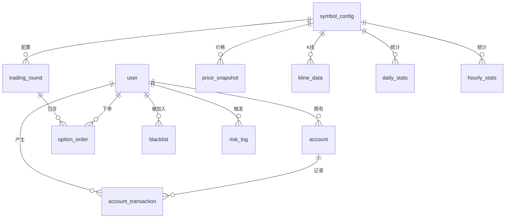

# 二元期权平台数据库设计

## 1. 数据库概述

### 1.1 数据库架构

系统采用微服务架构，每个服务使用独立的数据库：

- **option_common**: 用户账户相关数据
- **option_order**: 交易订单相关数据  
- **option_market**: 行情数据
- **option_admin**: 管理数据和统计数据

### 1.2 设计原则

- **数据隔离**: 不同服务使用独立数据库，避免耦合
- **数据一致性**: 关键业务数据保证ACID特性
- **扩展性**: 支持水平分片和垂直拆分
- **性能优化**: 合理设计索引，优化查询性能

## 2. option-common-service 数据表

### 2.1 用户表 (user)

```sql
CREATE TABLE `user` (
  `id` bigint NOT NULL AUTO_INCREMENT COMMENT '主键ID',
  `external_id` varchar(64) NOT NULL COMMENT '外部用户ID(BTSE用户ID)',
  `password` varchar(128) NOT NULL COMMENT '密码(加密)',
  `nickname` varchar(64) DEFAULT NULL COMMENT '昵称',
  `email` varchar(128) DEFAULT NULL COMMENT '邮箱',
  `phone` varchar(32) DEFAULT NULL COMMENT '手机号',
  `status` tinyint NOT NULL DEFAULT '1' COMMENT '状态(1:正常 2:禁用)',
  `signature` varchar(128) DEFAULT NULL COMMENT '个性签名',
  `risk_agreement` tinyint NOT NULL DEFAULT '0' COMMENT '风险协议(0:未同意 1:已同意)',
  `aml_agreement` tinyint NOT NULL DEFAULT '0' COMMENT 'AML协议(0:未同意 1:已同意)',
  `create_time` datetime NOT NULL COMMENT '创建时间',
  `update_time` datetime NOT NULL COMMENT '更新时间',
  PRIMARY KEY (`id`),
  UNIQUE KEY `uk_external_id` (`external_id`),
  UNIQUE KEY `uk_email` (`email`),
  UNIQUE KEY `uk_phone` (`phone`)
) ENGINE=InnoDB COMMENT='用户表';
```

**字段说明**:
- `external_id`: 关联BTSE用户ID，用于用户认证
- `status`: 1-正常，2-禁用
- `risk_agreement`: 风险协议同意状态
- `aml_agreement`: 反洗钱协议同意状态

### 2.2 账户表 (account)

```sql
CREATE TABLE `account` (
  `id` bigint NOT NULL AUTO_INCREMENT COMMENT '主键ID',
  `user_id` bigint NOT NULL COMMENT '用户ID',
  `account_type` varchar(16) NOT NULL COMMENT '账户类型(REAL:实盘 DEMO:模拟)',
  `currency` varchar(8) NOT NULL DEFAULT 'USDT' COMMENT '币种',
  `balance` decimal(32,16) NOT NULL DEFAULT '0.0000000000000000' COMMENT '可用余额',
  `frozen_balance` decimal(32,16) NOT NULL DEFAULT '0.0000000000000000' COMMENT '冻结余额',
  `total_deposit` decimal(32,16) NOT NULL DEFAULT '0.0000000000000000' COMMENT '累计充值',
  `total_withdraw` decimal(32,16) NOT NULL DEFAULT '0.0000000000000000' COMMENT '累计提现',
  `total_profit` decimal(32,16) NOT NULL DEFAULT '0.0000000000000000' COMMENT '累计盈利',
  `total_loss` decimal(32,16) NOT NULL DEFAULT '0.0000000000000000' COMMENT '累计亏损',
  `reset_count` int NOT NULL DEFAULT '0' COMMENT '重置次数(仅模拟账户)',
  `last_reset_time` datetime DEFAULT NULL COMMENT '最后重置时间',
  `create_time` datetime NOT NULL COMMENT '创建时间',
  `update_time` datetime NOT NULL COMMENT '更新时间',
  PRIMARY KEY (`id`),
  UNIQUE KEY `uk_user_type_currency` (`user_id`,`account_type`,`currency`),
  KEY `idx_user_id` (`user_id`)
) ENGINE=InnoDB COMMENT='账户表';
```

**字段说明**:
- `account_type`: REAL-实盘账户，DEMO-模拟账户
- `balance`: 可用余额，可用于下单
- `frozen_balance`: 冻结余额，下单后冻结资金
- `reset_count`: 模拟账户重置次数

### 2.3 资金流水表 (account_transaction)

```sql
CREATE TABLE `account_transaction` (
  `id` bigint NOT NULL AUTO_INCREMENT COMMENT '主键ID',
  `user_id` bigint NOT NULL COMMENT '用户ID',
  `account_id` bigint NOT NULL COMMENT '账户ID',
  `type` varchar(16) NOT NULL COMMENT '交易类型(DEPOSIT:充值 WITHDRAW:提现 CANCEL:撤单 BET_WIN:投注盈利 BET_LOSE:投注亏损 BET_DRAW:投注平局 RESET:重置 BTSE_IN:BTSE转入 BTSE_OUT:BTSE转出)', -- v1.6更新：新增BTSE转账类型
  `amount` decimal(32,16) NOT NULL COMMENT '交易金额',
  `balance_before` decimal(32,16) NOT NULL COMMENT '交易前余额',
  `balance_after` decimal(32,16) NOT NULL COMMENT '交易后余额',
  `ref_id` bigint DEFAULT NULL COMMENT '关联ID(订单ID等)',
  `ref_type` varchar(16) DEFAULT NULL COMMENT '关联类型(ORDER等)',
  `remark` varchar(255) DEFAULT NULL COMMENT '备注',
  `create_time` datetime NOT NULL COMMENT '创建时间',
  PRIMARY KEY (`id`),
  KEY `idx_user_account` (`user_id`,`account_id`),
  KEY `idx_ref` (`ref_id`,`ref_type`),
  KEY `idx_create_time` (`create_time`)
) ENGINE=InnoDB COMMENT='资金流水表';
```

**交易类型说明**:
- `DEPOSIT`: 充值
- `WITHDRAW`: 提现
- `CANCEL`: 撤单退款
- `BET_WIN`: 投注盈利
- `BET_LOSE`: 投注亏损
- `BET_DRAW`: 投注平局
- `RESET`: 账户重置
- `BTSE_IN`: BTSE转入 (v1.6新增)
- `BTSE_OUT`: BTSE转出 (v1.6新增)

### 2.4 币种配置表 (symbol_config)

```sql
CREATE TABLE `symbol_config` (
  `id` bigint NOT NULL AUTO_INCREMENT COMMENT '主键ID',
  `symbol` varchar(16) NOT NULL COMMENT '交易对(如BTC/USDT)',
  `base_currency` varchar(8) NOT NULL COMMENT '基础币种(BTC)',
  `quote_currency` varchar(8) NOT NULL COMMENT '计价币种(USDT)',
  `enabled` tinyint NOT NULL DEFAULT '1' COMMENT '是否启用(0:禁用 1:启用)',
  `min_amount` decimal(32,16) NOT NULL DEFAULT '10.0000000000000000' COMMENT '最小下注金额',
  `max_amount` decimal(32,16) NOT NULL DEFAULT '10000.0000000000000000' COMMENT '最大下注金额',
  `btse_symbol` varchar(32) NOT NULL COMMENT 'BTSE交易对名称',
  `sort_order` int NOT NULL DEFAULT '0' COMMENT '排序',
  `create_time` datetime NOT NULL COMMENT '创建时间',
  `update_time` datetime NOT NULL COMMENT '更新时间',
  PRIMARY KEY (`id`),
  UNIQUE KEY `uk_symbol` (`symbol`)
) ENGINE=InnoDB COMMENT='币种配置表';
```

### 2.5 全局配置表 (global_config)

```sql
CREATE TABLE `global_config` (
  `id` bigint NOT NULL AUTO_INCREMENT COMMENT '主键ID',
  `config_key` varchar(64) NOT NULL COMMENT '配置键',
  `config_value` text NOT NULL COMMENT '配置值',
  `config_type` varchar(16) NOT NULL COMMENT '配置类型(STRING:字符串 NUMBER:数字 BOOLEAN:布尔 JSON:JSON对象)',
  `config_group` varchar(32) NOT NULL COMMENT '配置分组(SYSTEM:系统 BUSINESS:业务 UI:界面)',
  `description` varchar(255) DEFAULT NULL COMMENT '配置描述',
  `enabled` tinyint NOT NULL DEFAULT '1' COMMENT '是否启用',
  `sort_order` int NOT NULL DEFAULT '0' COMMENT '排序',
  `create_time` datetime NOT NULL COMMENT '创建时间',
  `update_time` datetime NOT NULL COMMENT '更新时间',
  PRIMARY KEY (`id`),
  UNIQUE KEY `uk_config_key` (`config_key`),
  KEY `idx_config_group` (`config_group`)
) ENGINE=InnoDB COMMENT='全局配置表';
```

## 3. option-order-service 数据表

### 3.1 周期配置表 (duration_config)

```sql
CREATE TABLE `duration_config` (
  `id` bigint NOT NULL AUTO_INCREMENT COMMENT '主键ID',
  `duration_minutes` int NOT NULL COMMENT '周期时长(分钟)',
  `duration_name` varchar(32) NOT NULL COMMENT '周期名称(如5分钟)',
  `enabled` tinyint NOT NULL DEFAULT '1' COMMENT '是否启用(0:禁用 1:启用)',
  `lock_seconds` int NOT NULL DEFAULT '30' COMMENT '锁单时间(秒)',
  `base_odds` decimal(10,4) NOT NULL DEFAULT '1.9000' COMMENT '基础赔率',
  `fee_rate` decimal(6,4) NOT NULL DEFAULT '0.1000' COMMENT '手续费率(0.1表示10%)',
  `sort_order` int NOT NULL DEFAULT '0' COMMENT '排序',
  `create_time` datetime NOT NULL COMMENT '创建时间',
  `update_time` datetime NOT NULL COMMENT '更新时间',
  PRIMARY KEY (`id`),
  UNIQUE KEY `uk_duration` (`duration_minutes`)
) ENGINE=InnoDB COMMENT='周期配置表';
```

### 3.2 交易回合表 (trading_round)

```sql
CREATE TABLE `trading_round` (
  `id` bigint NOT NULL AUTO_INCREMENT COMMENT '主键ID',
  `round_no` varchar(64) NOT NULL COMMENT '回合编号',
  `symbol_id` bigint NOT NULL COMMENT '交易对ID',
  `duration_minutes` int NOT NULL COMMENT '周期时长(分钟)',
  `start_time` datetime NOT NULL COMMENT '开始时间',
  `lock_time` datetime NOT NULL COMMENT '锁单时间(结束前30秒)',
  `end_time` datetime NOT NULL COMMENT '结束时间',
  `start_price` decimal(32,16) DEFAULT NULL COMMENT '开盘价',
  `end_price` decimal(32,16) DEFAULT NULL COMMENT '收盘价',
  `status` varchar(16) NOT NULL DEFAULT 'OPEN' COMMENT '状态(OPEN:开放 LOCKED:锁单 SETTLED:已结算)',
  `total_up_amount` decimal(32,16) NOT NULL DEFAULT '0.0000000000000000' COMMENT 'UP总投注额',
  `total_down_amount` decimal(32,16) NOT NULL DEFAULT '0.0000000000000000' COMMENT 'DOWN总投注额',
  `create_time` datetime NOT NULL COMMENT '创建时间',
  `update_time` datetime NOT NULL COMMENT '更新时间',
  PRIMARY KEY (`id`),
  UNIQUE KEY `uk_round_no` (`round_no`),
  KEY `idx_symbol_time` (`symbol_id`,`start_time`),
  KEY `idx_status` (`status`)
) ENGINE=InnoDB COMMENT='交易回合表';
```

### 3.3 订单表 (option_order)

```sql
CREATE TABLE `option_order` (
  `id` bigint NOT NULL AUTO_INCREMENT COMMENT '主键ID',
  `user_id` bigint NOT NULL COMMENT '用户ID',
  `account_type` varchar(16) NOT NULL COMMENT '账户类型(REAL:实盘 DEMO:模拟)',
  `symbol_id` bigint NOT NULL COMMENT '交易对ID',
  `round_id` bigint NOT NULL COMMENT '回合ID',
  `round_no` varchar(64) NOT NULL COMMENT '回合编号',
  `direction` varchar(8) NOT NULL COMMENT '方向(UP:看涨 DOWN:看跌)',
  `amount` decimal(32,16) NOT NULL COMMENT '投注金额',
  `odds` decimal(10,4) NOT NULL COMMENT '赔率',
  `expected_profit` decimal(32,16) NOT NULL COMMENT '预期收益',
  `order_price` decimal(32,16) NOT NULL COMMENT '下单价格',
  `settle_price` decimal(32,16) DEFAULT NULL COMMENT '结算价格',
  `status` varchar(16) NOT NULL DEFAULT 'PENDING' COMMENT '状态(PENDING:进行中 WIN:盈利 LOSE:亏损 DRAW:平局 CANCELLED:已撤销)',
  `profit` decimal(32,16) DEFAULT NULL COMMENT '实际盈亏',
  `fee` decimal(32,16) DEFAULT NULL COMMENT '手续费',
  `cancel_time` datetime DEFAULT NULL COMMENT '撤销时间',
  `settle_time` datetime DEFAULT NULL COMMENT '结算时间',
  `create_time` datetime NOT NULL COMMENT '创建时间',
  `update_time` datetime NOT NULL COMMENT '更新时间',
  PRIMARY KEY (`id`),
  KEY `idx_user_symbol_round` (`user_id`,`symbol_id`,`round_id`),
  KEY `idx_round_status` (`round_id`,`status`),
  KEY `idx_user_create_time` (`user_id`,`create_time`)
) ENGINE=InnoDB COMMENT='订单表';
```

### 3.4 风控配置表 (risk_config)

```sql
CREATE TABLE `risk_config` (
  `id` bigint NOT NULL AUTO_INCREMENT COMMENT '主键ID',
  `config_key` varchar(64) NOT NULL COMMENT '配置键',
  `config_value` varchar(255) NOT NULL COMMENT '配置值',
  `config_type` varchar(16) NOT NULL COMMENT '配置类型(LIMIT:限额 BLACKLIST:黑名单 GLOBAL:全局)',
  `description` varchar(255) DEFAULT NULL COMMENT '描述',
  `enabled` tinyint NOT NULL DEFAULT '1' COMMENT '是否启用',
  `create_time` datetime NOT NULL COMMENT '创建时间',
  `update_time` datetime NOT NULL COMMENT '更新时间',
  PRIMARY KEY (`id`),
  UNIQUE KEY `uk_config_key` (`config_key`)
) ENGINE=InnoDB COMMENT='风控配置表';
```

### 3.5 风控日志表 (risk_log)

```sql
CREATE TABLE `risk_log` (
  `id` bigint NOT NULL AUTO_INCREMENT COMMENT '主键ID',
  `user_id` bigint NOT NULL COMMENT '用户ID',
  `risk_type` varchar(32) NOT NULL COMMENT '风控类型(AMOUNT_LIMIT:金额限制 FREQUENCY_LIMIT:频次限制 BLACKLIST:黑名单)',
  `risk_level` varchar(16) NOT NULL COMMENT '风险级别(LOW:低 MEDIUM:中 HIGH:高)',
  `action` varchar(32) NOT NULL COMMENT '处理动作(BLOCK:阻断 WARN:警告 LOG:记录)',
  `description` varchar(500) NOT NULL COMMENT '详细描述',
  `request_data` text COMMENT '请求数据',
  `create_time` datetime NOT NULL COMMENT '创建时间',
  PRIMARY KEY (`id`),
  KEY `idx_user_time` (`user_id`,`create_time`),
  KEY `idx_risk_type` (`risk_type`)
) ENGINE=InnoDB COMMENT='风控日志表';
```

## 4. option-market-service 数据表

### 4.1 价格快照表 (price_snapshot)

```sql
CREATE TABLE `price_snapshot` (
  `id` bigint NOT NULL AUTO_INCREMENT COMMENT '主键ID',
  `symbol_id` bigint NOT NULL COMMENT '交易对ID',
  `price` decimal(32,16) NOT NULL COMMENT '价格',
  `volume` decimal(32,16) DEFAULT NULL COMMENT '成交量',
  `timestamp` bigint NOT NULL COMMENT '时间戳(毫秒)',
  `source` varchar(16) NOT NULL DEFAULT 'BTSE' COMMENT '数据源',
  `create_time` datetime NOT NULL COMMENT '创建时间',
  PRIMARY KEY (`id`),
  KEY `idx_symbol_timestamp` (`symbol_id`,`timestamp`),
  KEY `idx_create_time` (`create_time`)
) ENGINE=InnoDB COMMENT='价格快照表';
```

### 4.2 K线数据表 (kline_data)

```sql
CREATE TABLE `kline_data` (
  `id` bigint NOT NULL AUTO_INCREMENT COMMENT '主键ID',
  `symbol_id` bigint NOT NULL COMMENT '交易对ID',
  `interval_type` varchar(8) NOT NULL COMMENT '时间间隔(1m,5m,15m,1h,1d)',
  `open_time` datetime NOT NULL COMMENT '开盘时间',
  `close_time` datetime NOT NULL COMMENT '收盘时间',
  `open_price` decimal(32,16) NOT NULL COMMENT '开盘价',
  `high_price` decimal(32,16) NOT NULL COMMENT '最高价',
  `low_price` decimal(32,16) NOT NULL COMMENT '最低价',
  `close_price` decimal(32,16) NOT NULL COMMENT '收盘价',
  `volume` decimal(32,16) DEFAULT NULL COMMENT '成交量',
  `create_time` datetime NOT NULL COMMENT '创建时间',
  `update_time` datetime NOT NULL COMMENT '更新时间',
  PRIMARY KEY (`id`),
  UNIQUE KEY `uk_symbol_interval_time` (`symbol_id`,`interval_type`,`open_time`),
  KEY `idx_symbol_interval` (`symbol_id`,`interval_type`)
) ENGINE=InnoDB COMMENT='K线数据表';
```

## 5. option-admin-service 数据表

### 5.1 黑名单表 (blacklist)

```sql
CREATE TABLE `blacklist` (
  `id` bigint NOT NULL AUTO_INCREMENT COMMENT '主键ID',
  `user_id` bigint NOT NULL COMMENT '用户ID',
  `reason` varchar(255) NOT NULL COMMENT '加入黑名单原因',
  `operator_id` bigint NOT NULL COMMENT '操作员ID',
  `operator_name` varchar(64) NOT NULL COMMENT '操作员姓名',
  `start_time` datetime NOT NULL COMMENT '生效时间',
  `end_time` datetime DEFAULT NULL COMMENT '失效时间(NULL表示永久)',
  `status` tinyint NOT NULL DEFAULT '1' COMMENT '状态(1:生效 0:失效)',
  `create_time` datetime NOT NULL COMMENT '创建时间',
  `update_time` datetime NOT NULL COMMENT '更新时间',
  PRIMARY KEY (`id`),
  KEY `idx_user_id` (`user_id`),
  KEY `idx_status_time` (`status`,`start_time`,`end_time`)
) ENGINE=InnoDB COMMENT='黑名单表';
```

### 5.2 管理员操作日志表 (admin_operation_log)

```sql
CREATE TABLE `admin_operation_log` (
  `id` bigint NOT NULL AUTO_INCREMENT COMMENT '主键ID',
  `operator_id` bigint NOT NULL COMMENT '操作员ID',
  `operator_name` varchar(64) NOT NULL COMMENT '操作员姓名',
  `operation_type` varchar(32) NOT NULL COMMENT '操作类型(USER_UPDATE:用户更新 CONFIG_UPDATE:配置更新等)',
  `operation_desc` varchar(255) NOT NULL COMMENT '操作描述',
  `target_type` varchar(32) DEFAULT NULL COMMENT '目标类型(USER:用户 CONFIG:配置等)',
  `target_id` varchar(64) DEFAULT NULL COMMENT '目标ID',
  `before_data` text COMMENT '操作前数据',
  `after_data` text COMMENT '操作后数据',
  `ip_address` varchar(64) DEFAULT NULL COMMENT '操作IP',
  `user_agent` varchar(255) DEFAULT NULL COMMENT '用户代理',
  `result` tinyint NOT NULL DEFAULT '1' COMMENT '操作结果(1:成功 0:失败)',
  `error_msg` varchar(500) DEFAULT NULL COMMENT '错误信息',
  `create_time` datetime NOT NULL COMMENT '创建时间',
  PRIMARY KEY (`id`),
  KEY `idx_operator_time` (`operator_id`,`create_time`),
  KEY `idx_operation_type` (`operation_type`),
  KEY `idx_target` (`target_type`,`target_id`)
) ENGINE=InnoDB COMMENT='管理员操作日志表';
```

### 5.3 每日统计表 (daily_stats)

```sql
CREATE TABLE `daily_stats` (
  `id` bigint NOT NULL AUTO_INCREMENT COMMENT '主键ID',
  `stat_date` date NOT NULL COMMENT '统计日期',
  `symbol_id` bigint DEFAULT NULL COMMENT '交易对ID(NULL表示全部)',
  `total_users` int NOT NULL DEFAULT '0' COMMENT '总用户数',
  `active_users` int NOT NULL DEFAULT '0' COMMENT '活跃用户数',
  `new_users` int NOT NULL DEFAULT '0' COMMENT '新增用户数',
  `total_orders` int NOT NULL DEFAULT '0' COMMENT '订单总数',
  `pending_orders` int NOT NULL DEFAULT '0' COMMENT '进行中订单数',
  `win_orders` int NOT NULL DEFAULT '0' COMMENT '盈利订单数',
  `lose_orders` int NOT NULL DEFAULT '0' COMMENT '亏损订单数',
  `draw_orders` int NOT NULL DEFAULT '0' COMMENT '平局订单数',
  `total_volume` decimal(32,16) NOT NULL DEFAULT '0.0000000000000000' COMMENT '交易总量',
  `total_profit` decimal(32,16) NOT NULL DEFAULT '0.0000000000000000' COMMENT '用户总盈利',
  `total_loss` decimal(32,16) NOT NULL DEFAULT '0.0000000000000000' COMMENT '用户总亏损',
  `total_fee` decimal(32,16) NOT NULL DEFAULT '0.0000000000000000' COMMENT '平台手续费收入',
  `win_rate` decimal(5,4) NOT NULL DEFAULT '0.0000' COMMENT '胜率',
  `avg_order_amount` decimal(32,16) NOT NULL DEFAULT '0.0000000000000000' COMMENT '平均下单金额',
  `create_time` datetime NOT NULL COMMENT '创建时间',
  `update_time` datetime NOT NULL COMMENT '更新时间',
  PRIMARY KEY (`id`),
  UNIQUE KEY `uk_date_symbol` (`stat_date`, `symbol_id`),
  KEY `idx_stat_date` (`stat_date`)
) ENGINE=InnoDB COMMENT='每日统计表';
```

### 5.4 每小时统计表 (hourly_stats)

```sql
CREATE TABLE `hourly_stats` (
  `id` bigint NOT NULL AUTO_INCREMENT COMMENT '主键ID',
  `stat_datetime` datetime NOT NULL COMMENT '统计时间(精确到小时)',
  `symbol_id` bigint DEFAULT NULL COMMENT '交易对ID(NULL表示全部)',
  `active_users` int NOT NULL DEFAULT '0' COMMENT '活跃用户数',
  `total_orders` int NOT NULL DEFAULT '0' COMMENT '订单总数',
  `total_volume` decimal(32,16) NOT NULL DEFAULT '0.0000000000000000' COMMENT '交易总量',
  `total_profit` decimal(32,16) NOT NULL DEFAULT '0.0000000000000000' COMMENT '用户总盈利',
  `total_loss` decimal(32,16) NOT NULL DEFAULT '0.0000000000000000' COMMENT '用户总亏损',
  `total_fee` decimal(32,16) NOT NULL DEFAULT '0.0000000000000000' COMMENT '平台手续费收入',
  `create_time` datetime NOT NULL COMMENT '创建时间',
  PRIMARY KEY (`id`),
  UNIQUE KEY `uk_datetime_symbol` (`stat_datetime`, `symbol_id`),
  KEY `idx_stat_datetime` (`stat_datetime`)
) ENGINE=InnoDB COMMENT='每小时统计表';
```

## 6. 数据库关系图



## 7. 索引优化建议

### 7.1 查询性能优化

- **用户查询**: `idx_user_id`, `uk_external_id`
- **订单查询**: `idx_user_create_time`, `idx_round_status`
- **资金流水**: `idx_user_account`, `idx_create_time`
- **时间范围查询**: 所有时间字段都建立索引

### 7.2 分片策略

- **按用户分片**: user_id作为分片键
- **按时间分片**: 历史数据按月分表
- **按交易对分片**: 大量数据按symbol_id分片

---
**文档版本**: v1.7  
**最后更新**: 2025年8月04日  
**维护者**: Barry  
**相关文档**: [详细设计概述](./207_01_详细设计概述.md), [系统架构设计](./207_02_系统架构设计.md)