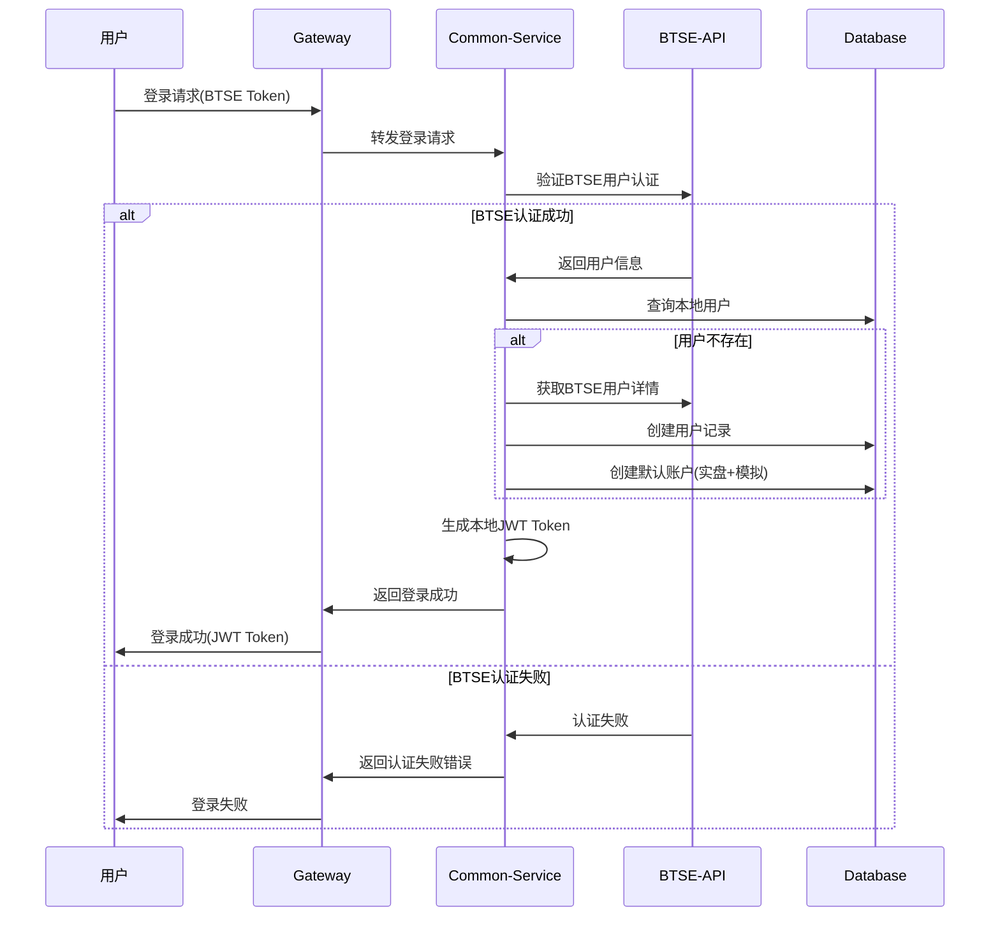
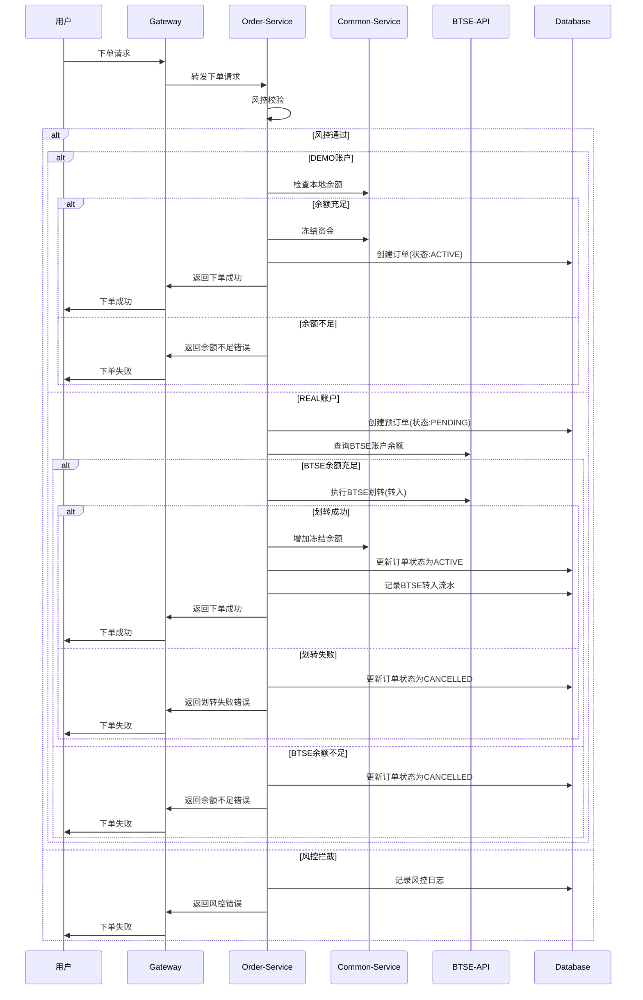
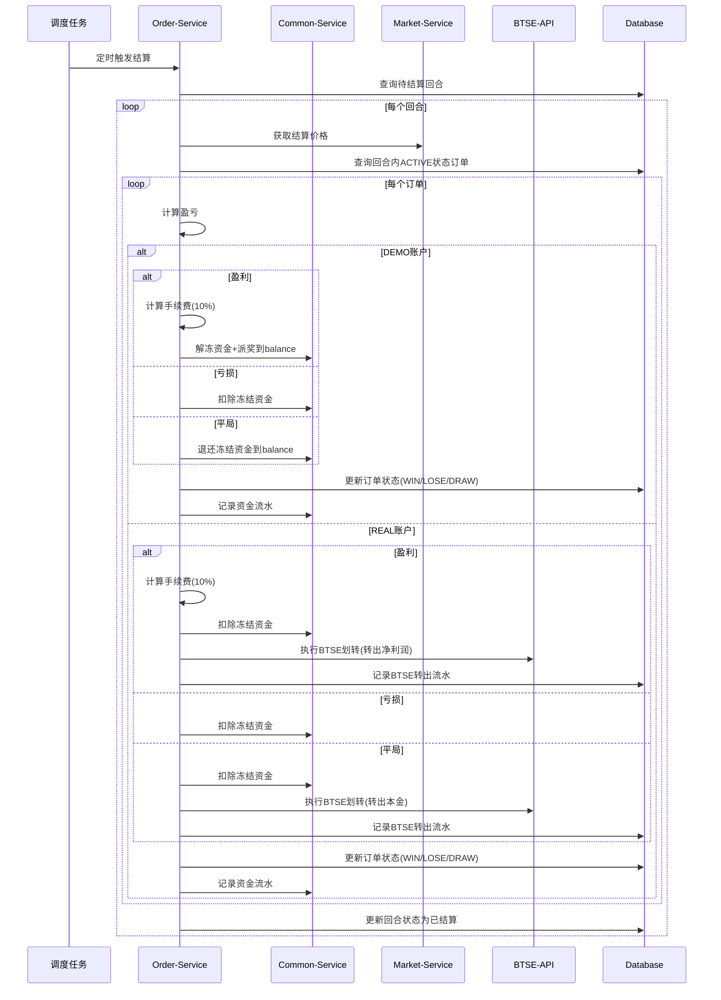
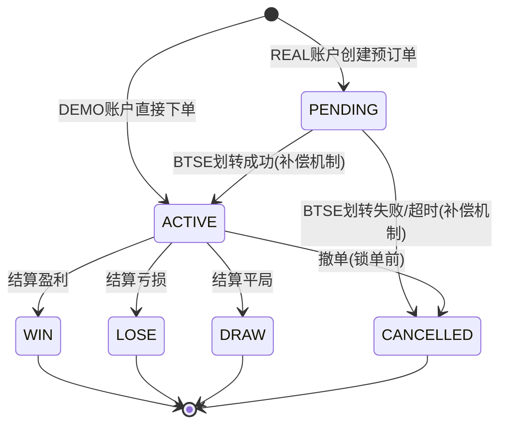
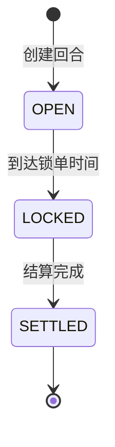
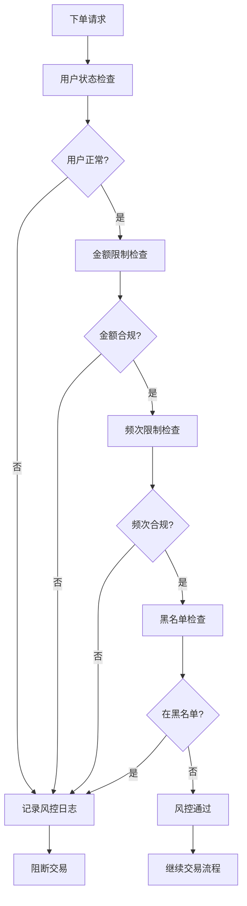
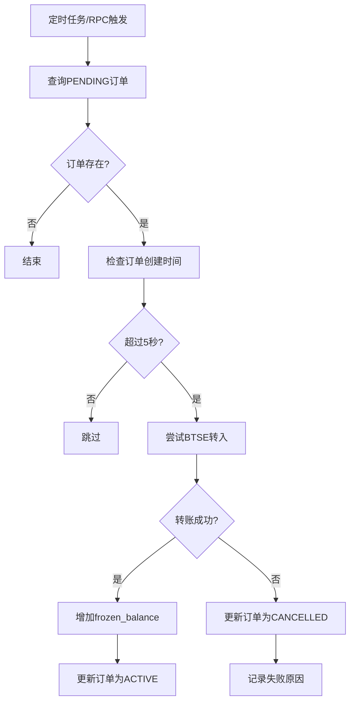
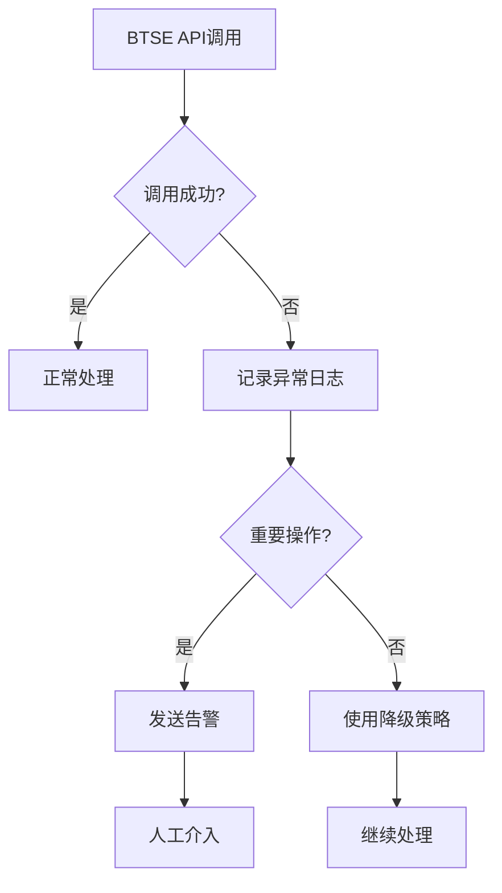

# 二元期权平台业务流程设计（流程图版）

> 文档版本: v1.9  
> 最后更新: 2025-08-06  

## 概述

本文档展示二元期权平台的核心业务流程图，包括用户注册登录、交易下单、自动结算和补偿机制等关键流程。

## 1. 用户创建和登录流程

### 1.1 流程图

### 1.2 核心特点
- 支持本地注册和BTSE认证双模式
- 自动创建DEMO和REAL两种账户类型（余额初始为0）
- DEMO账户可领取体验金，REAL账户需BTSE充值

---

## 2. 下单交易流程

### 2.1 流程图

### 2.2 资金流向差异

**DEMO账户**：
- balance → frozen_balance（直接ACTIVE订单）

**REAL账户**：
- BTSE → frozen_balance（先PENDING，后ACTIVE）
- 使用预订单ID确保幂等性

---

## 3. 自动结算流程

### 3.1 流程图

### 3.2 结算差异

**DEMO账户**：
- WIN：扣除frozen_balance，全部收益转balance
- LOSE：扣除frozen_balance
- DRAW：frozen_balance → balance (退还本金)

**REAL账户**：
- WIN：扣除frozen_balance，全部收益转BTSE
- LOSE：扣除frozen_balance
- DRAW：扣除frozen_balance，本金转BTSE

---

## 4. 订单状态流转

### 4.1 状态流转图

### 4.2 状态说明

| 状态 | 含义 | 触发条件 | 后续状态 |
|------|------|----------|----------|
| PENDING | 待确认 | REAL账户创建预订单 | ACTIVE/CANCELLED |
| ACTIVE | 进行中 | DEMO下单或REAL划转成功 | WIN/LOSE/DRAW/CANCELLED |
| WIN | 盈利 | 结算时用户预测正确 | 终态 |
| LOSE | 亏损 | 结算时用户预测错误 | 终态 |
| DRAW | 平局 | 结算价格等于下单价格 | 终态 |
| CANCELLED | 已撤销 | 划转失败/超时/用户撤单 | 终态 |

---

## 5. 回合管理流程

### 5.1 回合生命周期

### 5.2 回合重叠机制
- **5分钟回合**：每1分钟创建新回合，同时存在5个重叠回合
- **15分钟回合**：每3分钟创建新回合，同时存在5个重叠回合
- **30分钟回合**：每6分钟创建新回合，同时存在5个重叠回合

---

## 6. 风控处理流程

### 6.1 风控检查流程

### 6.2 风控限制规则
**金额限制**：
- 单笔最小金额：10 USDT
- 单笔最大金额：10,000 USDT
- 日累计限额：50,000 USDT

**频次限制**：
- 每分钟最多5笔订单
- 每小时最多100笔订单

---

## 7. 补偿机制流程

### 7.1 PENDING订单补偿流程

### 7.2 补偿机制特点
- **触发方式**：RPC接口、定时任务、手动触发
- **处理策略**：转账成功→ACTIVE，转账失败→CANCELLED
- **超时设置**：5秒超时检测
- **适用范围**：仅REAL账户（DEMO账户不会有PENDING订单）

---

## 8. 异常处理流程

### 8.1 BTSE API异常处理

### 8.2 数据一致性策略
- **下单时划转失败**：直接返回失败，不创建订单
- **结算时转出失败**：资金保留在平台，记录异常待处理
- **补偿机制**：定时任务重试失败的转账操作

---

## 业务流程总结

### 核心设计原则
1. **账户隔离**：DEMO和REAL账户完全独立
2. **状态机管理**：订单状态严格按流程流转
3. **补偿机制**：确保数据最终一致性
4. **风控优先**：多层风控检查保障系统安全

### 关键流程节点
1. **下单阶段**：DEMO直接ACTIVE，REAL先PENDING
2. **补偿阶段**：PENDING尝试完成BTSE转账
3. **结算阶段**：只处理ACTIVE订单，按账户类型差异化处理

### 资金安全保障
- 预订单机制确保资金安全
- Client Transfer ID保证幂等性
- 补偿机制处理异常情况
- 完整的审计日志记录

---

**文档版本**: v1.9  
**最后更新**: 2025年8月06日  
**维护者**: Barry  