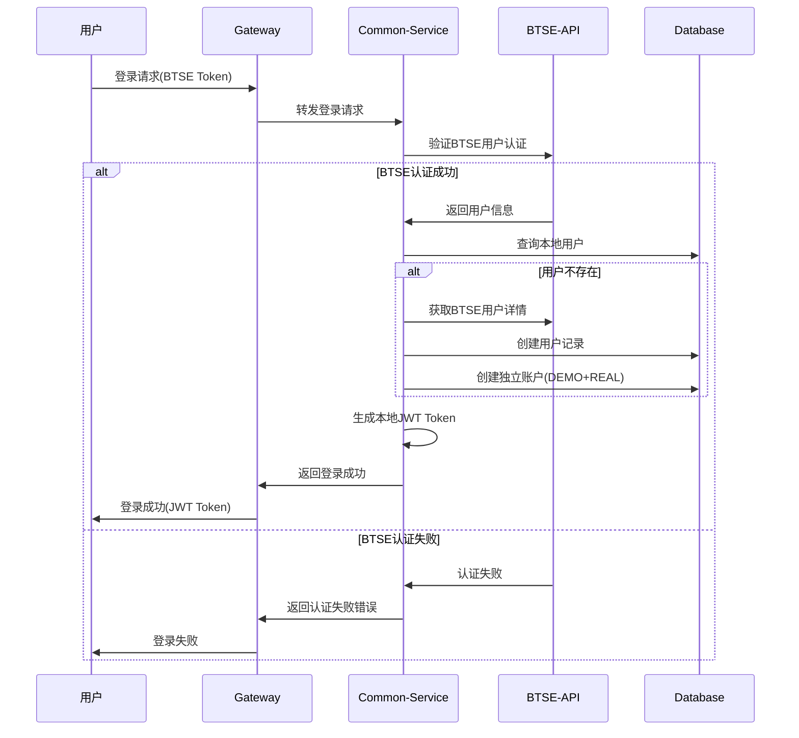
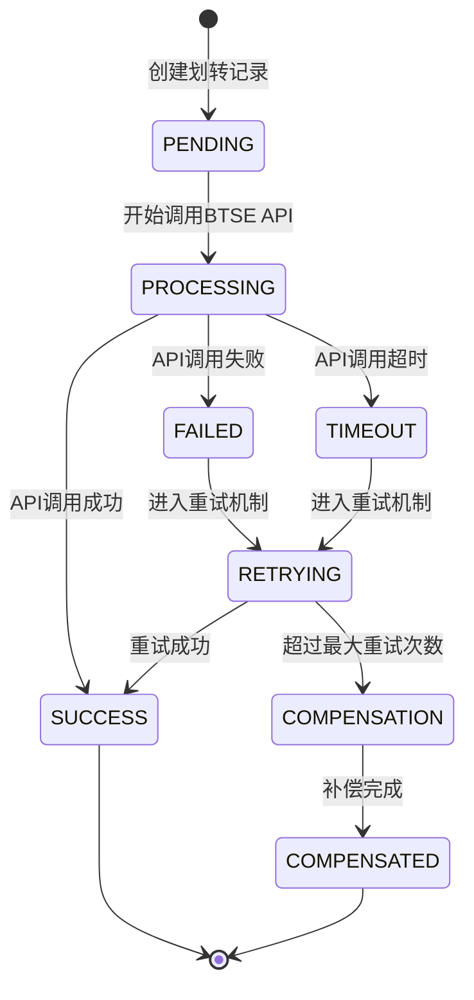
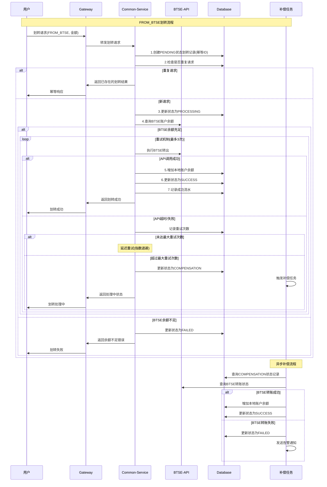
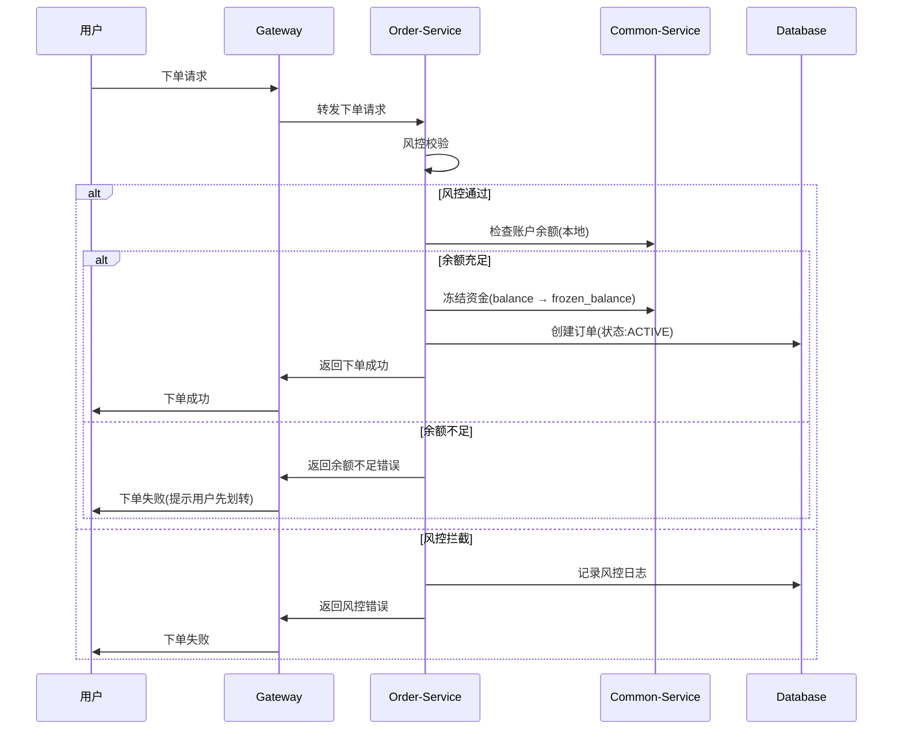
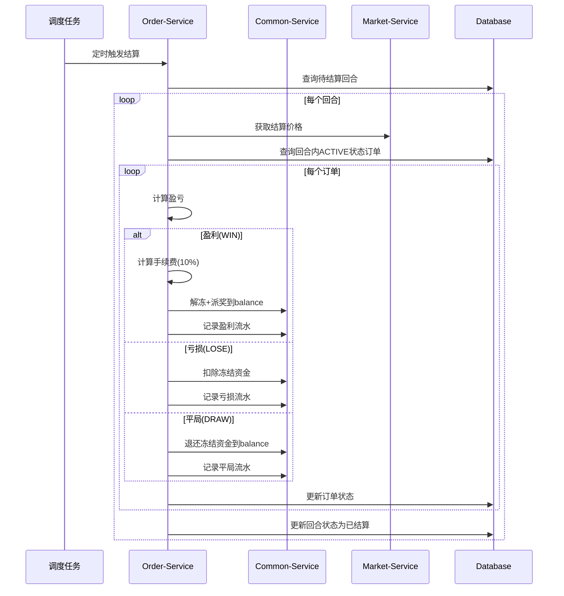
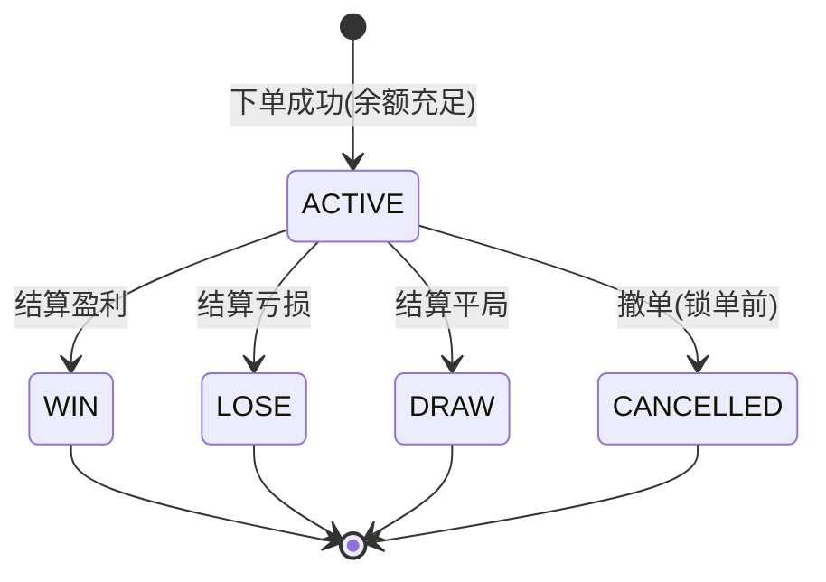
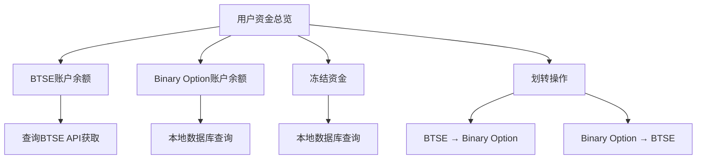

# 二元期权平台业务流程设计（独立账户模式）

## 1. 架构变更说明

### 1.1 核心变更
- **下单流程**：不再调用BTSE API，只使用本地账户余额
- **结算流程**：盈利资金直接到本地账户，不转回BTSE
- **新增账户划转功能**：用户主动进行BTSE ↔ Binary Option账户间资金划转
- **账户独立性**：Binary Option平台维护独立的用户账户体系

### 1.2 资金流向变更
**原流程（直接集成）**：
```
BTSE账户 ⇄ Binary Option冻结余额 → 结算时返回BTSE
```

**新流程（独立账户）**：
```
BTSE账户 → 账户划转 → Binary Option余额 → 下单冻结 → 结算解冻
```

## 2. 用户注册登录流程

### 2.1 流程图



### 2.2 账户初始化
创建用户时自动创建两种独立账户：

```sql
-- 创建用户记录
INSERT INTO user (external_id, nickname, email, status, create_time, update_time)
VALUES ('btse_user_123', 'BTSE用户', 'user@btse.com', 1, NOW(), NOW());

-- 创建REAL账户（独立余额，初始为0）
INSERT INTO account (user_id, account_type, currency, balance, frozen_balance, create_time, update_time)
VALUES (1, 'REAL', 'USDT', '0.0000000000000000', '0.0000000000000000', NOW(), NOW());

-- 创建DEMO账户（可领取体验金）
INSERT INTO account (user_id, account_type, currency, balance, frozen_balance, create_time, update_time)
VALUES (1, 'DEMO', 'USDT', '0.0000000000000000', '0.0000000000000000', NOW(), NOW());
```

## 3. 账户划转流程 **[新增功能]**

### 3.1 划转状态机设计



### 3.2 划转流程图（含异常处理）



### 3.3 幂等性设计

**幂等ID生成策略**：
```java
// 组合用户ID、方向、时间戳和随机数生成唯一ID
String idempotentId = userId + "_" + direction + "_" + timestamp + "_" + randomCode;
// 示例: "123_FROM_BTSE_20250808103000_ABC123"
```

**幂等性检查**：
```sql
-- 创建划转记录前检查是否已存在
SELECT id, status, result FROM account_transfer 
WHERE idempotent_id = ? AND user_id = ?;

-- 如果存在且状态为SUCCESS/FAILED，直接返回结果
-- 如果存在且状态为PENDING/PROCESSING，返回处理中
-- 如果不存在，创建新记录
```

### 3.4 重试机制设计

**重试策略**：
- **最大重试次数**：3次
- **退避策略**：指数退避 (1s, 2s, 4s)
- **重试条件**：超时、网络异常、BTSE系统繁忙
- **不重试条件**：余额不足、参数错误、用户不存在

**重试实现**：
```java
@Retryable(
    value = {BtseTimeoutException.class, BtseSystemException.class},
    maxAttempts = 3,
    backoff = @Backoff(delay = 1000, multiplier = 2)
)
public BtseTransferResponse callBtseWithRetry(TransferRequest request) {
    // BTSE API调用逻辑
}
```

### 3.5 补偿机制设计

**补偿任务触发条件**：
1. API调用超过最大重试次数
2. 系统异常导致状态不一致
3. 定时任务发现长时间未完成的划转

**补偿流程**：
```java
@Scheduled(fixedDelay = 300000) // 每5分钟执行
public void compensateTransfers() {
    // 1. 查询需要补偿的记录
    List<Transfer> needCompensation = findCompensationTransfers();
    
    for (Transfer transfer : needCompensation) {
        try {
            // 2. 查询BTSE真实状态
            BtseTransferStatus realStatus = queryBtseTransferStatus(transfer.getBtseTransferId());
            
            // 3. 根据真实状态进行补偿
            if ("SUCCESS".equals(realStatus.getStatus())) {
                // BTSE转账成功，补偿本地账户
                compensateLocalAccount(transfer);
            } else if ("FAILED".equals(realStatus.getStatus())) {
                // BTSE转账失败，更新本地状态
                updateTransferStatus(transfer.getId(), "FAILED");
            }
        } catch (Exception e) {
            log.error("补偿划转失败，ID：{}，错误：{}", transfer.getId(), e.getMessage());
        }
    }
}
```

### 3.6 划转类型

**FROM_BTSE（充值）**：
- 从BTSE账户转入Binary Option账户
- 用户需要有足够的BTSE余额
- 资金流向：BTSE → Binary Option

**TO_BTSE（提现）**：
- 从Binary Option账户转出到BTSE账户  
- 用户需要有足够的本地余额
- 资金流向：Binary Option → BTSE

### 3.3 划转限制

```sql
-- 划转配置表
INSERT INTO transfer_config VALUES
('transfer.min.amount', '10.0000000000000000', '最小划转金额'),
('transfer.max.amount', '50000.0000000000000000', '最大划转金额'),
('transfer.daily.limit', '100000.0000000000000000', '日划转限额'),
('transfer.fee.rate', '0.0000000000000000', '划转手续费率(暂时免费)');
```

### 3.7 数据库表结构设计

**account_transfer 表（新增）**：
```sql
CREATE TABLE account_transfer (
    id BIGINT PRIMARY KEY AUTO_INCREMENT,
    idempotent_id VARCHAR(100) NOT NULL UNIQUE COMMENT '幂等ID',
    user_id BIGINT NOT NULL COMMENT '用户ID',
    direction VARCHAR(20) NOT NULL COMMENT '方向：FROM_BTSE, TO_BTSE',
    amount DECIMAL(28,16) NOT NULL COMMENT '划转金额',
    currency VARCHAR(10) NOT NULL DEFAULT 'USDT' COMMENT '币种',
    status VARCHAR(20) NOT NULL COMMENT '状态：PENDING,PROCESSING,SUCCESS,FAILED,COMPENSATION,COMPENSATED',
    btse_transfer_id VARCHAR(100) COMMENT 'BTSE划转ID',
    retry_count INT DEFAULT 0 COMMENT '重试次数',
    error_message TEXT COMMENT '错误信息',
    request_data JSON COMMENT '请求数据',
    response_data JSON COMMENT '响应数据',
    balance_before DECIMAL(28,16) COMMENT '划转前余额',
    balance_after DECIMAL(28,16) COMMENT '划转后余额',
    create_time DATETIME NOT NULL DEFAULT CURRENT_TIMESTAMP,
    update_time DATETIME NOT NULL DEFAULT CURRENT_TIMESTAMP ON UPDATE CURRENT_TIMESTAMP,
    process_time DATETIME COMMENT '开始处理时间',
    complete_time DATETIME COMMENT '完成时间',
    
    INDEX idx_user_status (user_id, status),
    INDEX idx_idempotent (idempotent_id),
    INDEX idx_btse_transfer (btse_transfer_id),
    INDEX idx_compensation (status, create_time)
) COMMENT='账户划转记录表';
```

**transfer_config 表（新增）**：
```sql
CREATE TABLE transfer_config (
    id BIGINT PRIMARY KEY AUTO_INCREMENT,
    config_key VARCHAR(100) NOT NULL UNIQUE,
    config_value VARCHAR(500) NOT NULL,
    config_type VARCHAR(50) NOT NULL COMMENT 'LIMIT,RETRY,TIMEOUT',
    description VARCHAR(200),
    is_enabled TINYINT DEFAULT 1,
    create_time DATETIME DEFAULT CURRENT_TIMESTAMP,
    update_time DATETIME DEFAULT CURRENT_TIMESTAMP ON UPDATE CURRENT_TIMESTAMP
) COMMENT='划转配置表';

-- 初始化配置数据
INSERT INTO transfer_config VALUES
('transfer.min.amount', '10.0000000000000000', 'LIMIT', '最小划转金额', 1, NOW(), NOW()),
('transfer.max.amount', '50000.0000000000000000', 'LIMIT', '最大划转金额', 1, NOW(), NOW()),
('transfer.daily.limit', '100000.0000000000000000', 'LIMIT', '日划转限额', 1, NOW(), NOW()),
('transfer.retry.max.count', '3', 'RETRY', '最大重试次数', 1, NOW(), NOW()),
('transfer.retry.delay.base', '1000', 'RETRY', '重试基础延迟(毫秒)', 1, NOW(), NOW()),
('transfer.timeout.btse.api', '30000', 'TIMEOUT', 'BTSE API超时时间(毫秒)', 1, NOW(), NOW()),
('transfer.compensation.interval', '300000', 'TIMEOUT', '补偿任务间隔(毫秒)', 1, NOW(), NOW());
```

### 3.8 核心实现代码

**划转服务主要方法**：
```java
@Service
@Transactional
public class AccountTransferService {
    
    /**
     * 从BTSE划转到Binary Option
     */
    public TransferResult transferFromBtse(TransferRequest request) {
        // 1. 幂等性检查
        AccountTransfer existingTransfer = checkIdempotent(request.getIdempotentId());
        if (existingTransfer != null) {
            return buildResultFromTransfer(existingTransfer);
        }
        
        // 2. 创建划转记录
        AccountTransfer transfer = createTransferRecord(request);
        
        try {
            // 3. 更新状态为PROCESSING
            updateTransferStatus(transfer.getId(), "PROCESSING");
            
            // 4. 调用BTSE API（带重试）
            BtseTransferResponse btseResponse = callBtseWithRetry(transfer);
            
            // 5. 更新本地账户余额
            updateLocalBalance(transfer.getUserId(), transfer.getAmount(), "ADD");
            
            // 6. 更新划转状态为SUCCESS
            updateTransferSuccess(transfer.getId(), btseResponse);
            
            return TransferResult.success(transfer.getId());
            
        } catch (MaxRetryExceededException e) {
            // 7. 超过重试次数，进入补偿队列
            updateTransferStatus(transfer.getId(), "COMPENSATION");
            return TransferResult.processing(transfer.getId(), "系统正在处理中，请稍后查询结果");
            
        } catch (BusinessException e) {
            // 8. 业务异常，直接失败
            updateTransferStatus(transfer.getId(), "FAILED", e.getMessage());
            return TransferResult.failed(e.getMessage());
        }
    }
    
    /**
     * BTSE API调用（带重试）
     */
    @Retryable(
        value = {BtseTimeoutException.class, BtseSystemException.class},
        maxAttempts = 3,
        backoff = @Backoff(delay = 1000, multiplier = 2)
    )
    public BtseTransferResponse callBtseWithRetry(AccountTransfer transfer) {
        // 记录重试次数
        incrementRetryCount(transfer.getId());
        
        // 调用BTSE API
        BtseTransferRequest btseRequest = BtseTransferRequest.builder()
            .userId(transfer.getUserId())
            .amount(transfer.getAmount())
            .currency(transfer.getCurrency())
            .clientTransferId(transfer.getIdempotentId())
            .description("用户账户划转")
            .build();
            
        return btseApiClient.transferFromBtse(btseRequest);
    }
    
    /**
     * 补偿任务
     */
    @Scheduled(fixedDelayString = "${transfer.compensation.interval:300000}")
    public void compensateTransfers() {
        List<AccountTransfer> needCompensation = 
            transferMapper.findByStatusAndCreateTimeBefore("COMPENSATION", 
                LocalDateTime.now().minusMinutes(5));
                
        for (AccountTransfer transfer : needCompensation) {
            try {
                compensateTransfer(transfer);
            } catch (Exception e) {
                log.error("补偿划转异常，ID：{}，错误：{}", transfer.getId(), e.getMessage());
                // 发送告警
                sendAlertNotification(transfer, e);
            }
        }
    }
    
    private void compensateTransfer(AccountTransfer transfer) {
        // 查询BTSE真实状态
        BtseTransferStatus realStatus = 
            btseApiClient.queryTransferStatus(transfer.getBtseTransferId());
            
        if ("SUCCESS".equals(realStatus.getStatus())) {
            // BTSE成功，补偿本地账户
            updateLocalBalance(transfer.getUserId(), transfer.getAmount(), "ADD");
            updateTransferStatus(transfer.getId(), "SUCCESS");
            
        } else if ("FAILED".equals(realStatus.getStatus())) {
            // BTSE失败，更新本地状态
            updateTransferStatus(transfer.getId(), "FAILED", "BTSE划转失败");
            
        } else {
            // 状态未明确，继续等待下次补偿
            log.warn("BTSE划转状态未明确，ID：{}，状态：{}", 
                transfer.getId(), realStatus.getStatus());
        }
    }
}
```

### 3.9 划转数据记录

**创建划转记录**：
```sql
INSERT INTO account_transfer (
    idempotent_id, user_id, direction, amount, currency, status,
    request_data, balance_before, create_time
) VALUES (
    '123_FROM_BTSE_20250808103000_ABC123',
    1, 'FROM_BTSE', '1000.0000000000000000', 'USDT', 'PENDING',
    '{"userId": 1, "amount": "1000.0000000000000000", "direction": "FROM_BTSE"}',
    '500.0000000000000000', NOW()
);
```

**更新成功状态**：
```sql
UPDATE account_transfer SET 
    status = 'SUCCESS',
    btse_transfer_id = 'btse_123456789',
    balance_after = '1500.0000000000000000',
    response_data = '{"transferId": "btse_123456789", "status": "SUCCESS"}',
    complete_time = NOW(),
    update_time = NOW()
WHERE id = 1;
```

**记录账户变动**：
```sql
INSERT INTO account_transaction (
    user_id, account_id, type, direction, amount, 
    balance_before, balance_after, related_id, remark, create_time
) VALUES (
    1, 1, 'TRANSFER', 'IN', '1000.0000000000000000',
    '500.0000000000000000', '1500.0000000000000000', 
    '123_FROM_BTSE_20250808103000_ABC123', '从BTSE账户转入', NOW()
);
```

## 4. 下单交易流程 **[简化版]**

### 4.1 流程图



### 4.2 流程说明

**关键变更**：
- **统一处理**：DEMO和REAL账户都使用相同的下单流程
- **无BTSE调用**：下单时不再调用BTSE API
- **余额检查**：只检查本地账户余额
- **直接激活**：订单直接创建为ACTIVE状态，无PENDING状态

**资金流转**：
```
本地账户余额(balance) → 冻结余额(frozen_balance)
```

### 4.3 数据变化

```sql
-- 1. 检查账户余额
SELECT balance FROM account WHERE user_id = 1 AND account_type = 'REAL';

-- 2. 冻结资金
UPDATE account SET 
    balance = balance - 100.0000000000000000,
    frozen_balance = frozen_balance + 100.0000000000000000
WHERE user_id = 1 AND account_type = 'REAL';

-- 3. 创建订单(直接ACTIVE状态)
INSERT INTO option_order (
    user_id, account_type, symbol_id, round_id, direction, 
    amount, odds, status, create_time
) VALUES (
    1, 'REAL', 1, 123, 'UP', '100.0000000000000000', 
    '1.9000', 'ACTIVE', NOW()
);

-- 4. 记录资金流水
INSERT INTO account_transaction (type, amount, remark) 
VALUES ('BET_FREEZE', 100.0000000000000000, '下单冻结资金');
```

## 5. 自动结算流程 **[简化版]**

### 5.1 流程图



### 5.2 流程说明

**关键变更**：
- **统一处理**：DEMO和REAL账户结算流程完全相同
- **无BTSE调用**：结算时不调用BTSE API
- **本地结算**：所有盈利资金保留在本地账户
- **用户选择**：盈利后用户可选择是否提现到BTSE

**资金流转**：
- **盈利**：`frozen_balance` → `balance` (本金+净利润)
- **亏损**：扣除`frozen_balance`
- **平局**：`frozen_balance` → `balance` (退还本金)

### 5.3 结算示例

**盈利结算 (WIN)**：
```sql
-- 1. 更新订单状态
UPDATE option_order SET 
    status = 'WIN',
    expected_profit = 190.0000000000000000,  -- 本金100 + 赔率收益90
    profit = 90.0000000000000000,           -- 实际盈利
    fee = 9.0000000000000000,               -- 10%手续费
    settle_price = 45100.56789012,
    settle_time = NOW()
WHERE id = 1;

-- 2. 解冻并派发到余额
UPDATE account SET 
    balance = balance + 181.0000000000000000,        -- 本金100 + 盈利90 - 手续费9
    frozen_balance = frozen_balance - 100.0000000000000000
WHERE user_id = 1 AND account_type = 'REAL';

-- 3. 记录盈利流水
INSERT INTO account_transaction (type, amount, remark) 
VALUES ('BET_WIN', 181.0000000000000000, '投注盈利(含本金)');
```

**亏损结算 (LOSE)**：
```sql
-- 1. 更新订单状态
UPDATE option_order SET 
    status = 'LOSE',
    profit = -100.0000000000000000,
    fee = 0.0000000000000000,
    settle_price = 44900.98765432,
    settle_time = NOW()
WHERE id = 1;

-- 2. 扣除冻结资金
UPDATE account SET 
    frozen_balance = frozen_balance - 100.0000000000000000
WHERE user_id = 1 AND account_type = 'REAL';

-- 3. 记录亏损流水
INSERT INTO account_transaction (type, amount, remark) 
VALUES ('BET_LOSE', -100.0000000000000000, '投注亏损');
```

## 6. 订单状态流转 **[简化版]**

### 6.1 状态流转图



### 6.2 状态说明

| 状态 | 含义 | 触发条件 | 后续状态 |
|------|------|----------|----------|
| ACTIVE | 进行中 | 下单成功，资金已冻结 | WIN/LOSE/DRAW/CANCELLED |
| WIN | 盈利 | 结算时用户预测正确 | 终态 |
| LOSE | 亏损 | 结算时用户预测错误 | 终态 |
| DRAW | 平局 | 结算价格等于下单价格 | 终态 |
| CANCELLED | 已撤销 | 用户主动撤单 | 终态 |

**关键变更**：
- **移除PENDING状态**：无需BTSE划转确认
- **简化流程**：只有成功下单才创建订单
- **统一处理**：DEMO和REAL账户状态流转相同

## 7. 用户资金管理流程

### 7.1 资金概览页面



### 7.2 资金流转完整链路

**用户操作流程**：
1. **登录**: BTSE认证 → 创建本地账户
2. **充值**: BTSE → 账户划转 → Binary Option余额
3. **下单**: Binary Option余额 → 冻结余额
4. **结算**: 冻结余额 → Binary Option余额(盈利)/扣除(亏损)
5. **提现**: Binary Option余额 → 账户划转 → BTSE

## 8. API接口设计

### 8.1 账户划转接口

**从BTSE充值**：
```http
POST /api/account/transfer/from-btse
Content-Type: application/json
Authorization: Bearer {jwt_token}

{
  "amount": "1000.0000000000000000",
  "accountType": "REAL",
  "idempotentId": "user123_FROM_BTSE_20250808103000_ABC123"
}

Response:
{
  "code": 200,
  "message": "success",
  "data": {
    "transferId": "transfer_001",
    "status": "SUCCESS",  // SUCCESS, FAILED, PROCESSING
    "amount": "1000.0000000000000000",
    "estimatedTime": "2-5分钟"
  },
  "success": true
}
```

**提现到BTSE**：
```http
POST /api/account/transfer/to-btse
Content-Type: application/json
Authorization: Bearer {jwt_token}

{
  "amount": "500.0000000000000000",
  "accountType": "REAL",
  "idempotentId": "user123_TO_BTSE_20250808104000_DEF456"
}

Response:
{
  "code": 200,
  "message": "success", 
  "data": {
    "transferId": "transfer_002",
    "status": "PROCESSING",
    "amount": "500.0000000000000000",
    "estimatedTime": "2-5分钟"
  },
  "success": true
}
```

**查询划转状态**：
```http
GET /api/account/transfer/status/{transferId}
Authorization: Bearer {jwt_token}

Response:
{
  "code": 200,
  "data": {
    "transferId": "transfer_001",
    "status": "SUCCESS",
    "direction": "FROM_BTSE",
    "amount": "1000.0000000000000000",
    "createTime": "2025-08-08 10:30:00",
    "completeTime": "2025-08-08 10:32:15",
    "errorMessage": null
  }
}
```

**查询划转记录**：
```http
GET /api/account/transfer/history?accountType=REAL&status=SUCCESS&limit=20&offset=0
Authorization: Bearer {jwt_token}

Response:
{
  "code": 200,
  "data": {
    "transfers": [
      {
        "transferId": "transfer_001",
        "direction": "FROM_BTSE",
        "amount": "1000.0000000000000000",
        "status": "SUCCESS",
        "createTime": "2025-08-08 10:30:00",
        "completeTime": "2025-08-08 10:32:15"
      }
    ],
    "total": 1,
    "hasMore": false
  }
}
```

**重试划转**：
```http
POST /api/account/transfer/retry/{transferId}
Authorization: Bearer {jwt_token}

Response:
{
  "code": 200,
  "message": "重试请求已提交",
  "data": {
    "transferId": "transfer_003",
    "retryCount": 2,
    "status": "PROCESSING"
  }
}
```

### 8.2 账户余额接口

**查询账户余额**：
```http
GET /api/account/balance?accountType=REAL
Authorization: Bearer {jwt_token}

Response:
{
  "code": 200,
  "data": {
    "accountType": "REAL",
    "balance": "1500.0000000000000000",
    "frozenBalance": "100.0000000000000000",
    "availableBalance": "1400.0000000000000000"
  }
}
```

**查询BTSE余额**：
```http
GET /api/account/btse-balance
Authorization: Bearer {jwt_token}

Response:
{
  "code": 200,
  "data": {
    "availableBalance": "5000.0000000000000000",
    "currency": "USDT"
  }
}
```

## 9. 优势与特点

### 9.1 架构优势

**独立性**：
- Binary Option平台维护独立账户体系
- 减少对BTSE API的依赖
- 提高系统可用性和稳定性

**用户体验**：
- 快速下单，无需等待BTSE确认
- 盈利资金立即可用
- 用户可灵活选择资金存放位置

**风险控制**：
- 平台资金池管理
- 更好的流动性控制
- 减少外部API故障影响

### 9.2 技术优势

**性能提升**：
- 下单流程无外部API调用
- 结算速度更快
- 减少网络延迟和超时

**维护简化**：
- 减少BTSE API集成复杂度
- 降低分布式事务风险
- 简化状态管理

**扩展性**：
- 易于支持多币种
- 便于添加新的支付方式
- 支持更复杂的产品功能

## 10. 异常场景处理

### 10.1 常见异常场景

| 异常类型 | 处理策略 | 用户体验 | 补偿机制 |
|---------|----------|----------|----------|
| BTSE API超时 | 重试3次 → 进入补偿队列 | 显示"处理中" | 定时任务查询真实状态 |
| BTSE余额不足 | 立即返回失败 | 提示充值BTSE账户 | 无需补偿 |
| 网络异常 | 重试3次 → 进入补偿队列 | 显示"处理中" | 定时任务重新处理 |
| 系统异常 | 记录日志 → 人工处理 | 提示系统繁忙 | 人工介入补偿 |
| 重复请求 | 幂等性检查 | 返回原结果 | 无需补偿 |
| 数据库异常 | 事务回滚 | 提示稍后重试 | 无数据不一致 |

### 10.2 状态不一致处理

**场景1：BTSE成功，本地失败**
```java
// 补偿逻辑：查询BTSE状态，补偿本地账户
if (btseStatus.equals("SUCCESS") && localStatus.equals("FAILED")) {
    // 补偿本地账户余额
    updateLocalBalance(transfer.getUserId(), transfer.getAmount(), "ADD");
    updateTransferStatus(transfer.getId(), "SUCCESS");
    
    // 记录补偿日志
    log.info("补偿成功：BTSE转账成功但本地状态异常，ID：{}", transfer.getId());
}
```

**场景2：本地扣款成功，BTSE转账失败**
```java
// 补偿逻辑：回滚本地扣款
if (btseStatus.equals("FAILED") && localBalanceDeducted) {
    // 退回本地账户余额  
    updateLocalBalance(transfer.getUserId(), transfer.getAmount(), "ADD");
    updateTransferStatus(transfer.getId(), "FAILED", "BTSE转账失败，已退回余额");
    
    // 记录补偿日志
    log.info("补偿成功：BTSE转账失败，已退回用户余额，ID：{}", transfer.getId());
}
```

### 10.3 监控告警机制

**告警规则配置**：
```sql
INSERT INTO alert_config VALUES
('transfer.timeout.count', '10', '5分钟内超时划转数量超过阈值'),
('transfer.failed.rate', '0.1', '划转失败率超过阈值'),
('transfer.compensation.count', '5', '需要补偿的划转数量超过阈值'),
('transfer.large.amount', '10000.0000000000000000', '单笔大额划转告警'),
('transfer.daily.total', '100000.0000000000000000', '日划转总额超过阈值');
```

**告警实现**：
```java
@Service
public class TransferAlertService {
    
    /**
     * 检查并发送告警
     */
    @Scheduled(fixedRate = 60000) // 每分钟检查
    public void checkAndSendAlerts() {
        // 1. 超时告警
        checkTimeoutAlerts();
        
        // 2. 失败率告警
        checkFailureRateAlerts();
        
        // 3. 补偿队列告警
        checkCompensationQueueAlerts();
        
        // 4. 大额划转告警
        checkLargeAmountAlerts();
    }
    
    private void checkTimeoutAlerts() {
        LocalDateTime fiveMinutesAgo = LocalDateTime.now().minusMinutes(5);
        int timeoutCount = transferMapper.countTimeoutTransfers(fiveMinutesAgo);
        
        int threshold = alertConfigService.getIntValue("transfer.timeout.count", 10);
        if (timeoutCount > threshold) {
            sendAlert("划转超时告警", 
                String.format("5分钟内超时划转数量：%d，超过阈值：%d", timeoutCount, threshold));
        }
    }
    
    private void checkFailureRateAlerts() {
        LocalDateTime oneHourAgo = LocalDateTime.now().minusHours(1);
        TransferStats stats = transferMapper.getTransferStats(oneHourAgo);
        
        double failureRate = (double) stats.getFailedCount() / stats.getTotalCount();
        double threshold = alertConfigService.getDoubleValue("transfer.failed.rate", 0.1);
        
        if (failureRate > threshold) {
            sendAlert("划转失败率告警",
                String.format("1小时内划转失败率：%.2f%%，超过阈值：%.2f%%", 
                    failureRate * 100, threshold * 100));
        }
    }
    
    private void sendAlert(String title, String message) {
        // 发送钉钉/企微/邮件告警
        alertNotificationService.sendAlert(AlertLevel.HIGH, title, message);
        
        // 记录告警日志
        log.warn("📢 {}: {}", title, message);
    }
}
```

### 10.4 风险控制与监控

**划转风控规则**：
```java
@Service
public class TransferRiskService {
    
    /**
     * 划转前风控检查
     */
    public RiskCheckResult checkTransferRisk(TransferRequest request) {
        // 1. 金额限制检查
        if (!checkAmountLimit(request)) {
            return RiskCheckResult.reject("划转金额超出限制");
        }
        
        // 2. 频次限制检查
        if (!checkFrequencyLimit(request)) {
            return RiskCheckResult.reject("操作过于频繁，请稍后再试");
        }
        
        // 3. 日累计限额检查
        if (!checkDailyLimit(request)) {
            return RiskCheckResult.reject("今日累计划转已达上限");
        }
        
        // 4. 用户状态检查
        if (!checkUserStatus(request.getUserId())) {
            return RiskCheckResult.reject("账户状态异常，请联系客服");
        }
        
        // 5. 大额划转审核
        if (isLargeAmount(request.getAmount())) {
            return RiskCheckResult.requireApproval("大额划转需要审核");
        }
        
        return RiskCheckResult.pass();
    }
    
    private boolean checkFrequencyLimit(TransferRequest request) {
        // 检查5分钟内划转次数
        LocalDateTime fiveMinutesAgo = LocalDateTime.now().minusMinutes(5);
        int recentCount = transferMapper.countRecentTransfers(
            request.getUserId(), fiveMinutesAgo);
        
        return recentCount < 3; // 5分钟内最多3次
    }
}
```

**实时监控指标**：
```java
@Component
public class TransferMetrics {
    
    private final MeterRegistry meterRegistry;
    
    // 划转成功率
    private final Counter successCounter;
    private final Counter failureCounter;
    
    // 划转金额统计
    private final Timer transferTimer;
    private final DistributionSummary transferAmount;
    
    // 补偿队列大小
    private final Gauge compensationQueueSize;
    
    public void recordTransferSuccess(String direction, BigDecimal amount) {
        successCounter.increment(
            Tags.of("direction", direction, "result", "success"));
        transferAmount.record(amount.doubleValue());
    }
    
    public void recordTransferFailure(String direction, String reason) {
        failureCounter.increment(
            Tags.of("direction", direction, "result", "failure", "reason", reason));
    }
}
```

---

**文档版本**: v2.0 (独立账户模式)  
**最后更新**: 2025年8月08日  
**维护者**: Claude AI  
**主要变更**: 移除下单/结算中的BTSE API调用，新增独立的账户划转功能