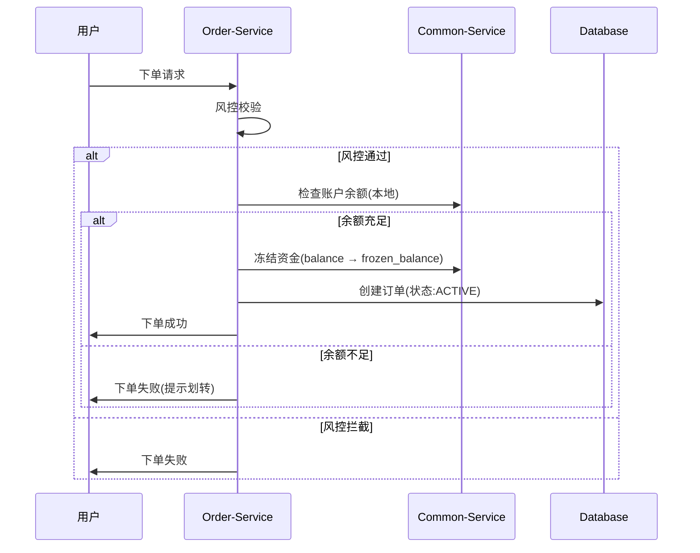

# 二元期权平台业务流程设计（独立账户模式-简版）

## 1. 核心架构变更

### 1.1 主要变更
- **下单流程**：不再调用BTSE API，只使用本地账户余额
- **结算流程**：盈利资金直接到本地账户，不转回BTSE
- **新增账户划转功能**：用户主动进行BTSE ↔ Binary Option账户间资金划转

### 1.2 资金流向对比
**原流程（直接集成）**：
```
BTSE账户 ⇄ Binary Option冻结余额 → 结算时返回BTSE
```

**新流程（独立账户）**：
```
BTSE账户 → 账户划转 → Binary Option余额 → 下单冻结 → 结算解冻
```

## 2. 用户注册登录流程

### 2.1 流程说明
1. **BTSE认证**：验证用户BTSE Token
2. **用户同步**：获取BTSE用户信息，创建本地用户
3. **账户初始化**：自动创建DEMO和REAL独立账户（初始余额为0）
4. **JWT生成**：生成本地JWT Token用于后续请求

## 3. 账户划转流程

### 3.1 划转流程图


### 3.2 关键特性
- **幂等性**：使用唯一ID防重复
- **重试机制**：API失败自动重试3次
- **补偿机制**：定时任务处理异常状态
- **状态追踪**：完整记录划转过程

## 4. 下单交易流程

### 4.1 流程图



### 4.2 流程说明
- **统一处理**：DEMO和REAL账户使用相同流程
- **无BTSE调用**：只使用本地账户余额
- **直接激活**：订单直接创建为ACTIVE状态

## 5. 自动结算流程

### 5.1 流程图


### 5.2 流程说明
- **统一处理**：DEMO和REAL账户结算流程相同
- **本地结算**：所有资金保留在本地账户
- **用户选择**：盈利后用户可选择提现到BTSE

## 6. 订单状态流转


## 7. 用户资金管理

### 7.1 资金概览


### 7.2 完整用户流程
1. **登录**: BTSE认证 → 创建本地账户
2. **充值**: BTSE → 账户划转 → Binary Option余额
3. **下单**: Binary Option余额 → 冻结余额
4. **结算**: 冻结余额 → Binary Option余额(盈利)/扣除(亏损)
5. **提现**: Binary Option余额 → 账户划转 → BTSE

## 8. 核心API接口

### 8.1 账户划转
```http
POST /api/account/transfer/from-btse
{
  "amount": "1000.0000000000000000",
  "accountType": "REAL"
}

POST /api/account/transfer/to-btse
{
  "amount": "500.0000000000000000", 
  "accountType": "REAL"
}

GET /api/account/transfer/history
```

### 8.2 账户余额
```http
GET /api/account/balance?accountType=REAL

GET /api/account/btse-balance
```

## 9. 架构优势

### 9.1 技术优势
- **性能提升**：下单无外部API调用，速度更快
- **可用性**：减少BTSE依赖，提高系统稳定性
- **维护性**：简化状态管理，降低复杂度

### 9.2 用户体验
- **快速下单**：无需等待BTSE确认
- **灵活资金**：用户可选择资金存放位置
- **即时可用**：盈利资金立即到账

### 9.3 风险控制
- **独立管理**：平台维护独立资金池
- **流动性控制**：更好的资金管控能力
- **故障隔离**：外部API故障不影响交易

---

**文档版本**: v2.0-简版  
**最后更新**: 2025年8月08日  
**主要变更**: 移除下单/结算中的BTSE API调用，新增独立的账户划转功能