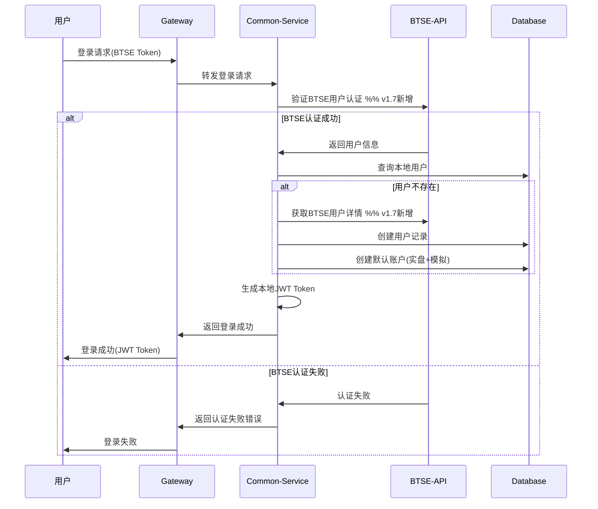
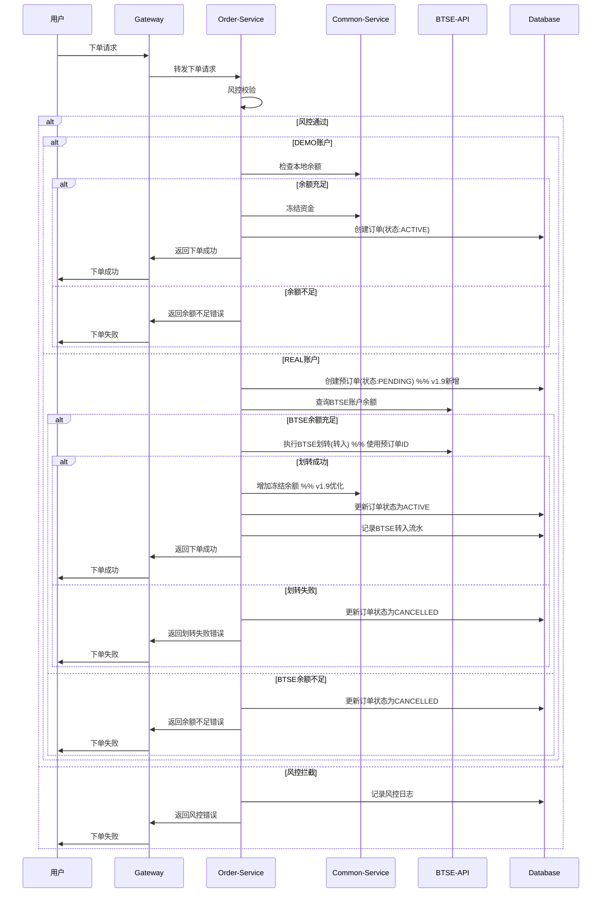
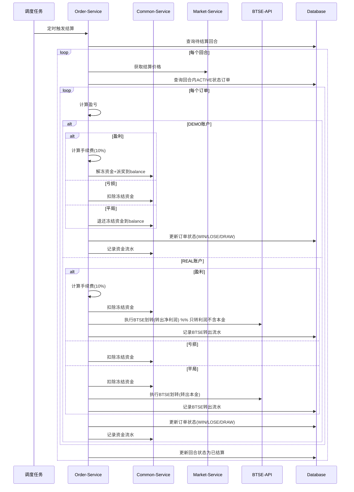
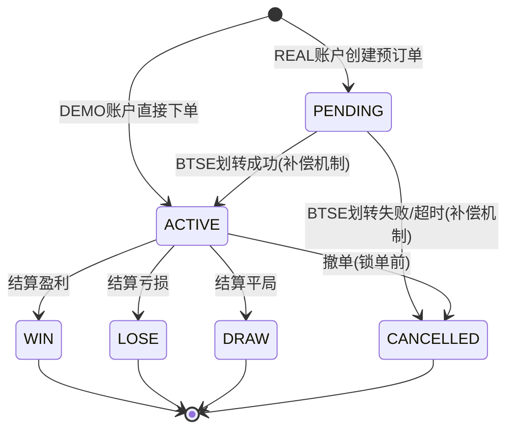
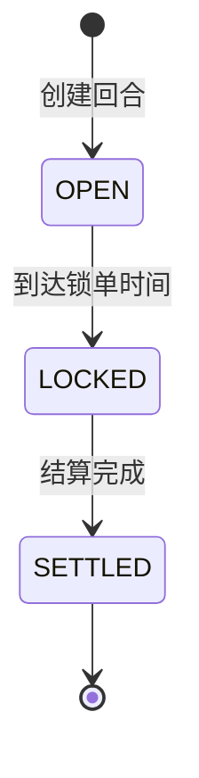
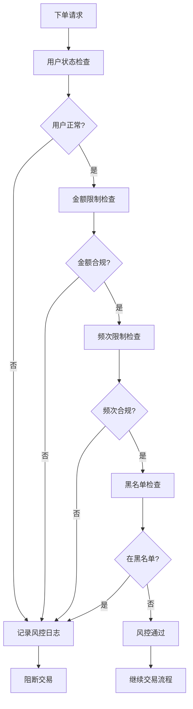
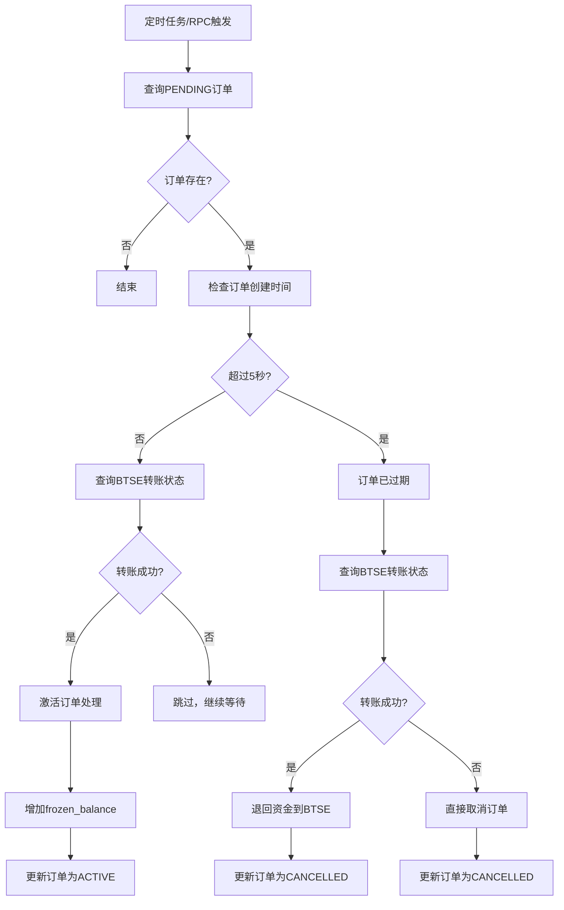
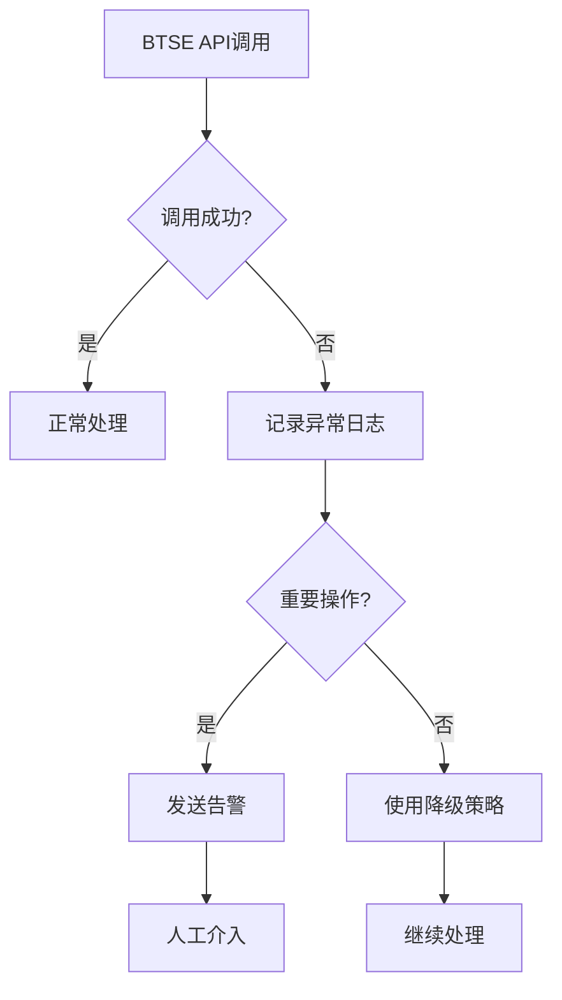

# 二元期权平台业务流程设计

## 1. 用户注册登录流程 **[v1.8更新：支持本地注册和BTSE认证并存]**

### 1.1 流程图



### 1.2 流程说明

**v1.8更新要点**：
- 支持本地注册和BTSE认证双模式
- 测试环境使用本地注册，生产环境使用BTSE认证
- 自动创建DEMO和REAL两种账户类型

**核心步骤**：
1. **认证方式选择**：根据环境配置选择本地或BTSE认证
2. **用户创建**：本地注册或BTSE用户同步
3. **账户初始化**：自动创建实盘和模拟账户（余额初始为0）
4. **JWT生成**：生成本地JWT Token用于后续请求
5. **账户余额管理**：DEMO账户可领取体验金，REAL账户需BTSE充值

### 1.3 数据变化

```sql
-- 创建用户记录
INSERT INTO user (external_id, nickname, email, status, create_time, update_time)
VALUES ('btse_user_123', 'BTSE用户', 'user@btse.com', 1, NOW(), NOW());

-- 创建实盘账户
INSERT INTO account (user_id, account_type, currency, balance, create_time, update_time)
VALUES (1, 'REAL', 'USDT', '0.0000000000000000', NOW(), NOW());

-- 创建模拟账户（初始余额为0，需通过API领取）
INSERT INTO account (user_id, account_type, currency, balance, create_time, update_time)
VALUES (1, 'DEMO', 'USDT', '0.0000000000000000', NOW(), NOW());
```

## 2. 下单交易流程 **[v1.9更新：优化REAL账户下单流程]**

### 2.1 流程图



### 2.2 流程说明

**v1.9更新要点**：
- DEMO账户使用本地余额，REAL账户使用BTSE余额
- REAL账户采用预订单机制（PENDING状态）
- 使用预订单ID作为Client Transfer ID确保幂等性
- 资金流向优化：REAL账户资金直接进入frozen_balance

**核心步骤**：
1. **风控校验**：检查用户状态、下注限额、频次限制
2. **账户类型判断**：
   - DEMO：检查本地余额，直接创建ACTIVE订单
   - REAL：创建PENDING预订单，查询BTSE余额
3. **REAL账户处理**：
   - 先创建预订单获取订单ID
   - 使用订单ID进行BTSE划转（保证幂等性）
   - 划转成功后更新订单为ACTIVE状态
4. **资金处理**：
   - DEMO：balance → frozen_balance
   - REAL：BTSE → frozen_balance（绕过balance）
5. **流水记录**：记录相应的资金流水

### 2.3 风控规则

**金额限制**：
- 单笔最小金额：10 USDT
- 单笔最大金额：10,000 USDT
- 日累计限额：50,000 USDT

**频次限制**：
- 每分钟最多5笔订单
- 每小时最多100笔订单

**用户状态检查**：
- 用户状态正常
- 未在黑名单中
- 已同意风险协议

### 2.4 数据变化

```sql
-- 1. BTSE转入流水
INSERT INTO account_transaction (user_id, account_id, type, amount, balance_before, balance_after, remark)
VALUES (1, 1, 'BTSE_IN', '100.0000000000000000', '0.0000000000000000', '100.0000000000000000', 'BTSE自动转入下单资金');

-- 2. 更新账户余额并冻结资金
UPDATE account SET 
    balance = balance + 100.0000000000000000,  -- 先增加余额
    frozen_balance = frozen_balance + 100.0000000000000000  -- 再冻结资金
WHERE id = 1;

-- 3. 创建订单
INSERT INTO option_order (user_id, account_type, symbol_id, round_id, direction, amount, odds, status, create_time)
VALUES (1, 'REAL', 1, 123, 'UP', '100.0000000000000000', '1.9000', 'PENDING', NOW());
```

## 3. 自动结算流程 **[v1.9更新：优化结算资金流向]**

### 3.1 流程图



### 3.2 流程说明

**v1.9更新要点**：
- DEMO账户结算资金回到balance，REAL账户结算资金转回BTSE
- REAL账户盈利仅转出净利润（不含本金）
- 结算只处理ACTIVE状态的订单
- PENDING订单通过独立的补偿机制处理

**结算逻辑**：

1. **订单查询**：
   - 只查询ACTIVE状态的订单
   - 按账户类型分别处理
   - PENDING订单不参与结算

2. **盈亏计算**：
   - 比较订单价格和结算价格
   - 计算实际盈利金额和手续费

3. **资金处理差异**：
   
   **DEMO账户**：
   - WIN：frozen_balance → balance (本金+净利润)
   - LOSE：扣除frozen_balance
   - DRAW：frozen_balance → balance (退还本金)
   
   **REAL账户**：
   - WIN：扣除frozen_balance，净利润转BTSE（不含本金）
   - LOSE：扣除frozen_balance
   - DRAW：扣除frozen_balance，本金转BTSE

4. **状态更新**：
   - 所有结算的订单更新为WIN/LOSE/DRAW
   - 结算完成后更新回合状态为SETTLED

### 3.3 结算时机

**定时结算**：
- 每分钟执行一次
- 查找已到结算时间的回合
- 批量处理所有待结算订单

**手动结算**：
- 管理员紧急处理
- 异常情况下的强制结算
- 需要指定结算价格和原因

**结算示例代码**：
```java
@Transactional
public void settleOrder(Order order, BigDecimal settlePrice) {
    // 1. 检查订单状态 - 只结算ACTIVE订单
    if (!"ACTIVE".equals(order.getStatus())) {
        return; // 非ACTIVE订单跳过
    }
    
    // 2. 计算盈亏
    BigDecimal profit = calculateProfit(order, settlePrice);
    BigDecimal fee = calculateFee(profit);
    String result = profit.compareTo(BigDecimal.ZERO) > 0 ? "WIN" : 
                   profit.compareTo(BigDecimal.ZERO) < 0 ? "LOSE" : "DRAW";
    
    // 3. 根据账户类型处理资金
    if ("DEMO".equals(order.getAccountType())) {
        // DEMO: 资金回到balance
        if ("WIN".equals(result)) {
            accountService.unfreezeAndAddBalance(order.getUserId(), 
                order.getAmount().add(profit).subtract(fee));
        } else if ("LOSE".equals(result)) {
            accountService.deductFrozenBalance(order.getUserId(), order.getAmount());
        } else { // DRAW
            accountService.unfreezeAndAddBalance(order.getUserId(), order.getAmount());
        }
    } else { // REAL账户
        // REAL: 先扣除frozen_balance
        accountService.deductFrozenBalance(order.getUserId(), order.getAmount());
        
        if ("WIN".equals(result)) {
            // 仅转出净利润
            btseTransferService.transferToBtseForSettlement(
                order.getUserId(), "REAL", profit.subtract(fee), order.getId(), "结算盈利");
        } else if ("DRAW".equals(result)) {
            // 转出本金
            btseTransferService.transferToBtseForSettlement(
                order.getUserId(), "REAL", order.getAmount(), order.getId(), "平局退还");
        }
        // LOSE不需要转账，资金已扣除
    }
    
    // 4. 更新订单状态
    updateOrderStatus(order, result, profit, fee, settlePrice);
}
```

### 3.4 各结果的数据变化

**REAL账户盈利结算 (WIN)**：
```sql
-- 1. 更新订单状态
UPDATE option_order SET 
    status = 'WIN',
    expected_profit = 190.0000000000000000,  -- 本金100 + 赔率收益90
    profit = 90.0000000000000000,           -- 实际盈利（不含本金）
    fee = 9.0000000000000000,               -- 10%手续费
    settle_price = 45100.56789012,
    settle_time = NOW()
WHERE id = 1;

-- 2. 扣除冻结资金（本金已冻结）
UPDATE account SET 
    frozen_balance = frozen_balance - 100.0000000000000000
WHERE id = 1;

-- 3. BTSE转出净利润（仅转出盈利部分，本金不转）
INSERT INTO btse_transfer_log (user_id, order_id, direction, amount, status) 
VALUES (1, 1, 'OUT', 81.0000000000000000, 'SUCCESS');  -- 盈利90 - 手续费9

-- 4. 记录流水
INSERT INTO account_transaction (type, amount, remark) 
VALUES ('BET_WIN', 81.0000000000000000, 'REAL账户投注盈利(净利润)');
```

**DEMO账户盈利结算 (WIN)**：
```sql
-- 1. 更新订单状态（同上）

-- 2. 解冻并派发到余额
UPDATE account SET 
    balance = balance + 181.0000000000000000,        -- 本金100 + 盈利90 - 手续费9
    frozen_balance = frozen_balance - 100.0000000000000000
WHERE id = 1;

-- 3. 记录流水
INSERT INTO account_transaction (type, amount, remark) 
VALUES ('BET_WIN', 181.0000000000000000, 'DEMO账户投注盈利(含本金)');
```

**亏损结算 (LOSE)**：
```sql
-- 1. 更新订单状态
UPDATE option_order SET 
    status = 'LOSE',
    profit = -100.0000000000000000,    -- 亏损本金
    fee = 0.0000000000000000,          -- 亏损不收手续费
    settle_price = 44900.98765432,
    settle_time = NOW()
WHERE id = 1;

-- 2. 扣除冻结资金
UPDATE account SET 
    frozen_balance = frozen_balance - 100.0000000000000000,
    total_loss = total_loss + 100.0000000000000000
WHERE id = 1;

-- 3. 记录流水
INSERT INTO account_transaction (type, amount, remark) 
VALUES ('BET_LOSE', -100.0000000000000000, '投注亏损');
```

**平局结算 (DRAW)**：

DEMO账户：
```sql
-- 1. 更新订单状态
UPDATE option_order SET 
    status = 'DRAW',
    profit = 0.0000000000000000,       -- 无盈亏
    fee = 0.0000000000000000,          -- 平局不收手续费
    settle_price = 45000.12345678,     -- 与下单价相同
    settle_time = NOW()
WHERE id = 1;

-- 2. 退还本金到余额
UPDATE account SET 
    balance = balance + 100.0000000000000000,
    frozen_balance = frozen_balance - 100.0000000000000000
WHERE id = 1;

-- 3. 记录流水
INSERT INTO account_transaction (type, amount, remark) 
VALUES ('BET_DRAW', 100.0000000000000000, 'DEMO账户平局退还本金');
```

REAL账户：
```sql
-- 1. 更新订单状态（同上）

-- 2. 扣除冻结资金
UPDATE account SET 
    frozen_balance = frozen_balance - 100.0000000000000000
WHERE id = 1;

-- 3. BTSE转出本金
INSERT INTO btse_transfer_log (user_id, order_id, direction, amount, status) 
VALUES (1, 1, 'OUT', 100.0000000000000000, 'SUCCESS');

-- 4. 记录流水
INSERT INTO account_transaction (type, amount, remark) 
VALUES ('BET_DRAW', 0.0000000000000000, 'REAL账户平局退还本金至BTSE');
```

## 4. 订单状态流转

### 4.1 状态流转图



### 4.2 状态说明

| 状态 | 含义 | 触发条件 | 后续状态 |
|------|------|----------|----------|
| PENDING | 待确认 | REAL账户创建预订单 | ACTIVE/CANCELLED |
| ACTIVE | 进行中 | DEMO下单或REAL划转成功 | WIN/LOSE/DRAW/CANCELLED |
| WIN | 盈利 | 结算时用户预测正确 | 终态 |
| LOSE | 亏损 | 结算时用户预测错误 | 终态 |
| DRAW | 平局 | 结算价格等于下单价格 | 终态 |
| CANCELLED | 已撤销 | 划转失败/超时/用户撤单 | 终态 |

### 4.3 状态变更规则

**PENDING → ACTIVE**：
- BTSE划转成功（通过补偿机制）
- 资金成功进入frozen_balance

**PENDING → CANCELLED**：
- BTSE划转失败
- 超过5秒未能完成划转

**ACTIVE → 结算状态**：
- 只有ACTIVE订单参与结算
- 根据盈亏结果更新为WIN/LOSE/DRAW

**可撤单条件**：
- 订单状态为ACTIVE
- 未到锁单时间（结束前30秒）
- 用户主动发起撤单请求

## 5. 回合管理流程

### 5.1 回合生命周期



### 5.2 回合创建流程

**定时创建机制**：
```java
@Scheduled(fixedDelay = 60000) // 每分钟执行
public void createNewRounds() {
    List<SymbolConfig> symbols = symbolConfigService.getAllEnabled();
    List<DurationConfig> durations = durationConfigService.getAllEnabled();
    
    for (SymbolConfig symbol : symbols) {
        for (DurationConfig duration : durations) {
            createRoundIfNeeded(symbol, duration);
        }
    }
}
```

**回合重叠机制**：
- 5分钟回合：每1分钟创建新回合，同时存在5个重叠回合
- 15分钟回合：每3分钟创建新回合，同时存在5个重叠回合
- 30分钟回合：每6分钟创建新回合，同时存在5个重叠回合

### 5.3 回合数据结构

```sql
INSERT INTO trading_round (
    round_no, symbol_id, duration_minutes, 
    start_time, lock_time, end_time,
    status, create_time
) VALUES (
    'BTC_5M_20250804_1030',  -- 回合编号
    1,                        -- BTC/USDT
    5,                        -- 5分钟周期
    '2025-08-04 10:30:00',   -- 开始时间
    '2025-08-04 10:34:30',   -- 锁单时间(结束前30秒)
    '2025-08-04 10:35:00',   -- 结束时间
    'OPEN',                   -- 状态
    NOW()                     -- 创建时间
);
```

## 6. 风控处理流程

### 6.1 风控检查流程



### 6.2 风控规则配置

**风控配置表数据示例**：
```sql
-- 单笔金额限制
INSERT INTO risk_config (config_key, config_value, config_type, description)
VALUES ('order.min.amount', '10.0000000000000000', 'LIMIT', '单笔最小下注金额');

INSERT INTO risk_config (config_key, config_value, config_type, description)
VALUES ('order.max.amount', '10000.0000000000000000', 'LIMIT', '单笔最大下注金额');

-- 频次限制
INSERT INTO risk_config (config_key, config_value, config_type, description)
VALUES ('order.max.per.minute', '5', 'LIMIT', '每分钟最大下单次数');

INSERT INTO risk_config (config_key, config_value, config_type, description)
VALUES ('order.max.per.hour', '100', 'LIMIT', '每小时最大下单次数');

-- 日累计限额
INSERT INTO risk_config (config_key, config_value, config_type, description)
VALUES ('order.daily.limit', '50000.0000000000000000', 'LIMIT', '日累计下注限额');
```

### 6.3 风控日志记录

```java
public void recordRiskLog(Long userId, String riskType, String action, String description) {
    RiskLog log = RiskLog.builder()
        .userId(userId)
        .riskType(riskType)
        .riskLevel(calculateRiskLevel(riskType))
        .action(action)
        .description(description)
        .createTime(LocalDateTime.now())
        .build();
    
    riskLogRepository.save(log);
}
```

## 7. 补偿机制流程 **[v1.9新增]**

### 7.1 PENDING订单补偿流程



### 7.2 补偿机制说明

**触发方式**：
- RPC接口：`/rpc/order/compensate-pending`
- 定时任务：每分钟自动执行
- 手动触发：管理员主动调用

**补偿逻辑**：
1. **查询条件**：
   - 状态为PENDING
   - 账户类型为REAL（DEMO账户不会有PENDING订单）
   
2. **处理策略**：
   - **未超时且转账成功**：激活订单（PENDING → ACTIVE）
   - **未超时且转账未成功**：跳过，继续等待
   - **已超时且转账成功**：取消订单并退回资金到BTSE
   - **已超时且转账未成功**：直接取消订单

3. **关键逻辑**：
   - **时间优先**：先检查是否超过5秒，超时订单必须取消
   - **资金安全**：超时订单如果已扣款，必须退回资金
   - **激活条件**：只有未超时且转账成功的订单才能激活

4. **补偿示例代码**：
```java
public CompensationResult compensatePendingOrders() {
    // 查询所有PENDING订单
    List<Order> pendingOrders = orderMapper.findPendingOrders();
    
    int successCount = 0;
    int failureCount = 0;
    
    for (Order order : pendingOrders) {
        try {
            // 1. 先检查是否超时（5秒）
            boolean isTimeout = isOrderTimeout(order, 5);
            
            if (!isTimeout) {
                // 未超时：检查转账状态决定是否激活
                boolean transferSuccess = btseTransferService.checkTransferStatus(order.getId());
                if (transferSuccess) {
                    // 转账成功：激活订单
                    accountService.addToFrozenBalance(order.getUserId(), order.getAmount());
                    orderMapper.updateStatus(order.getId(), "ACTIVE");
                    successCount++;
                } else {
                    // 转账未成功：跳过，继续等待
                    continue;
                }
            } else {
                // 已超时：订单必须取消，检查是否需要退款
                boolean transferSuccess = btseTransferService.checkTransferStatus(order.getId());
                if (transferSuccess) {
                    // 转账成功：需要退回资金到BTSE
                    btseTransferService.transferToBtse(
                        order.getUserId(), "REAL", order.getAmount(), "订单超时退款");
                }
                // 无论转账是否成功，都要取消订单
                orderMapper.updateStatus(order.getId(), "CANCELLED");
                failureCount++;
            }
        } catch (Exception e) {
            // 异常情况，更新为CANCELLED
            orderMapper.updateStatus(order.getId(), "CANCELLED");
            failureCount++;
        }
    }
    
    return new CompensationResult(pendingOrders.size(), successCount, failureCount);
}

private boolean isOrderTimeout(Order order, int timeoutSeconds) {
    return order.getCreateTime().plusSeconds(timeoutSeconds).isBefore(LocalDateTime.now());
}
```

## 8. 异常处理流程

### 8.1 BTSE API异常处理



### 8.2 数据一致性处理

**BTSE划转失败处理**：
1. **下单时划转失败**：直接返回失败，不创建订单
2. **结算时转出失败**：资金保留在平台，记录异常待处理
3. **补偿机制**：定时任务重试失败的转账操作

**数据库事务处理**：
```java
@Transactional(rollbackFor = Exception.class)
public void settleOrder(Order order) {
    try {
        // 1. 更新订单状态
        updateOrderStatus(order);
        
        // 2. 处理账户资金
        processAccountBalance(order);
        
        // 3. 记录资金流水
        recordTransaction(order);
        
        // 4. BTSE转出（可能失败）
        if (needTransferToBtse(order)) {
            transferToBtse(order);
        }
    } catch (BtseTransferException e) {
        // BTSE转出失败，记录待处理
        recordPendingTransfer(order, e);
        // 不回滚本地事务
    }
}
```

---
**文档版本**: v1.9  
**最后更新**: 2025年8月06日  
**维护者**: Barry  
**相关文档**: [详细设计概述](./207_01_详细设计概述.md), [系统架构设计](./207_02_系统架构设计.md), [API接口设计](./207_04_API接口设计.md), [BTSE API接入方案](./212_BTSE—API接入方案.md)