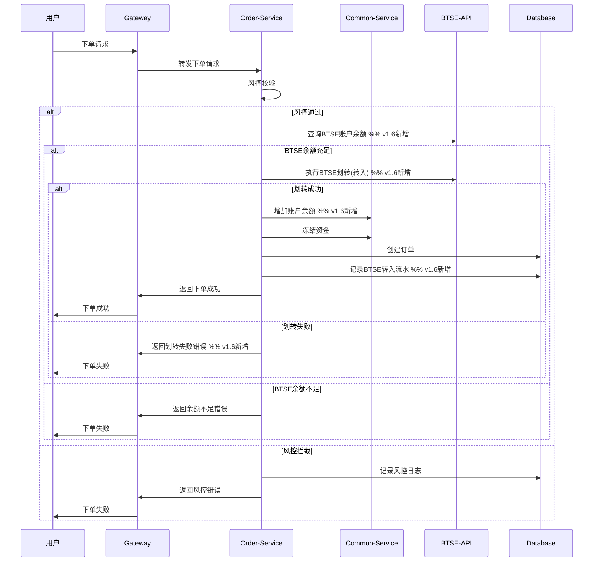
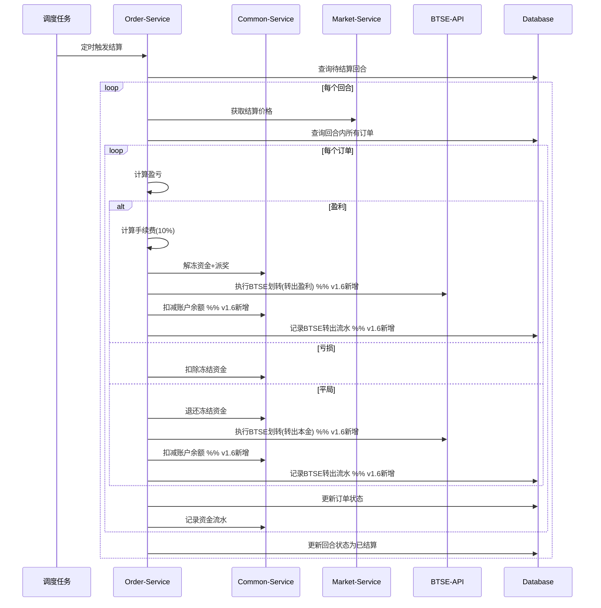
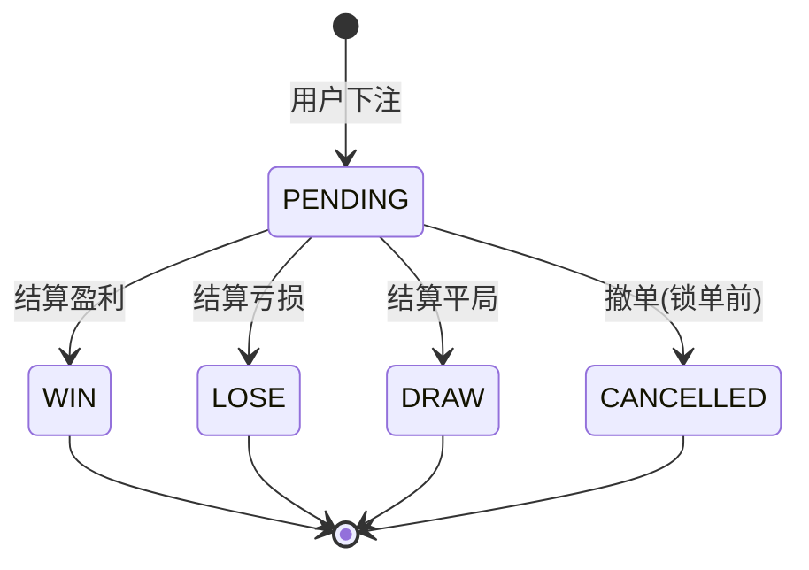

# 二元期权平台业务流程设计

## 1. 用户注册登录流程 **[v1.7更新：集成BTSE认证]**

### 1.1 流程图


### 1.2 流程说明

**v1.7更新要点**：
- 用户登录必须通过BTSE认证
- 自动同步BTSE用户信息到本地系统
- 首次登录自动创建用户和账户

**核心步骤**：
1. **BTSE认证验证**：使用BTSE Token验证用户身份
2. **用户信息同步**：获取BTSE用户详细信息
3. **本地用户创建**：首次登录自动创建本地用户记录
4. **账户初始化**：自动创建实盘和模拟账户
5. **JWT生成**：生成本地JWT Token用于后续请求

### 1.3 数据变化

```sql
-- 创建用户记录
INSERT INTO user (external_id, nickname, email, status, create_time, update_time)
VALUES ('btse_user_123', 'BTSE用户', 'user@btse.com', 1, NOW(), NOW());

-- 创建实盘账户
INSERT INTO account (user_id, account_type, currency, balance, create_time, update_time)
VALUES (1, 'REAL', 'USDT', '0.0000000000000000', NOW(), NOW());

-- 创建模拟账户
INSERT INTO account (user_id, account_type, currency, balance, create_time, update_time)
VALUES (1, 'DEMO', 'USDT', '10000.0000000000000000', NOW(), NOW());
```

## 2. 下单交易流程 **[v1.6更新：新增BTSE直接划转]**

### 2.1 流程图



### 2.2 流程说明

**v1.6更新要点**：
- 取消预充值步骤，下单时直接从BTSE划转资金
- 划转成功后才创建订单，保证资金安全
- 新增BTSE_IN交易类型记录划转流水

**核心步骤**：
1. **风控校验**：检查用户状态、下注限额、频次限制
2. **BTSE余额查询**：确认用户在BTSE有足够余额
3. **资金划转**：从BTSE向平台转入下注资金
4. **资金冻结**：冻结下注金额，避免重复使用
5. **订单创建**：记录订单信息和状态
6. **流水记录**：记录BTSE转入和资金冻结流水

### 2.3 风控规则

**金额限制**：
- 单笔最小金额：10 USDT
- 单笔最大金额：10,000 USDT
- 日累计限额：50,000 USDT

**频次限制**：
- 每分钟最多5笔订单
- 每小时最多100笔订单

**用户状态检查**：
- 用户状态正常
- 未在黑名单中
- 已同意风险协议

### 2.4 数据变化

```sql
-- 1. BTSE转入流水
INSERT INTO account_transaction (user_id, account_id, type, amount, balance_before, balance_after, remark)
VALUES (1, 1, 'BTSE_IN', '100.0000000000000000', '0.0000000000000000', '100.0000000000000000', 'BTSE自动转入下单资金');

-- 2. 更新账户余额并冻结资金
UPDATE account SET 
    balance = balance + 100.0000000000000000,  -- 先增加余额
    frozen_balance = frozen_balance + 100.0000000000000000  -- 再冻结资金
WHERE id = 1;

-- 3. 创建订单
INSERT INTO option_order (user_id, account_type, symbol_id, round_id, direction, amount, odds, status, create_time)
VALUES (1, 'REAL', 1, 123, 'UP', '100.0000000000000000', '1.9000', 'PENDING', NOW());
```

## 3. 自动结算流程 **[v1.6更新：盈利自动转回BTSE]**

### 3.1 流程图



### 3.2 流程说明

**v1.6更新要点**：
- 盈利自动转回BTSE，减少平台资金沉淀
- 平局也自动转回BTSE（与盈利处理一致）
- 仅亏损场景资金保留在平台

**结算逻辑**：
1. **价格获取**：从Market-Service获取结算时的真实价格
2. **盈亏计算**：比较订单价格和结算价格，确定订单结果
3. **手续费计算**：盈利订单收取10%手续费
4. **资金处理**：根据订单结果处理冻结资金
5. **BTSE转出**：盈利和平局自动转回BTSE
6. **状态更新**：更新订单和回合状态

### 3.3 结算时机

**定时结算**：
- 每分钟执行一次
- 查找已到结算时间的回合
- 批量处理所有待结算订单

**手动结算**：
- 管理员紧急处理
- 异常情况下的强制结算
- 需要指定结算价格和原因

### 3.4 各结果的数据变化

**盈利结算 (WIN)**：
```sql
-- 1. 更新订单状态
UPDATE option_order SET 
    status = 'WIN',
    profit = 90.0000000000000000,      -- 实际盈利
    fee = 9.0000000000000000,          -- 10%手续费
    settle_price = 45100.56789012,
    settle_time = NOW()
WHERE id = 1;

-- 2. 解冻并派发盈利
UPDATE account SET 
    balance = balance + 181.0000000000000000,        -- 本金100 + 盈利90 - 手续费9
    frozen_balance = frozen_balance - 100.0000000000000000,
    total_profit = total_profit + 81.0000000000000000
WHERE id = 1;

-- 3. BTSE转出盈利
UPDATE account SET 
    balance = balance - 181.0000000000000000  -- 转出全部盈利到BTSE
WHERE id = 1;

-- 4. 记录流水
INSERT INTO account_transaction (type, amount, remark) 
VALUES ('BET_WIN', 81.0000000000000000, '投注盈利(含本金,扣除手续费)');

INSERT INTO account_transaction (type, amount, remark) 
VALUES ('BTSE_OUT', 181.0000000000000000, 'BTSE自动转出盈利资金');
```

**亏损结算 (LOSE)**：
```sql
-- 1. 更新订单状态
UPDATE option_order SET 
    status = 'LOSE',
    profit = -100.0000000000000000,    -- 亏损本金
    fee = 0.0000000000000000,          -- 亏损不收手续费
    settle_price = 44900.98765432,
    settle_time = NOW()
WHERE id = 1;

-- 2. 扣除冻结资金
UPDATE account SET 
    frozen_balance = frozen_balance - 100.0000000000000000,
    total_loss = total_loss + 100.0000000000000000
WHERE id = 1;

-- 3. 记录流水
INSERT INTO account_transaction (type, amount, remark) 
VALUES ('BET_LOSE', -100.0000000000000000, '投注亏损');
```

**平局结算 (DRAW)**：
```sql
-- 1. 更新订单状态
UPDATE option_order SET 
    status = 'DRAW',
    profit = 0.0000000000000000,       -- 无盈亏
    fee = 0.0000000000000000,          -- 平局不收手续费
    settle_price = 45000.12345678,     -- 与下单价相同
    settle_time = NOW()
WHERE id = 1;

-- 2. 退还本金
UPDATE account SET 
    balance = balance + 100.0000000000000000,
    frozen_balance = frozen_balance - 100.0000000000000000
WHERE id = 1;

-- 3. BTSE转出本金
UPDATE account SET 
    balance = balance - 100.0000000000000000  -- 转出本金到BTSE
WHERE id = 1;

-- 4. 记录流水
INSERT INTO account_transaction (type, amount, remark) 
VALUES ('BET_DRAW', 0.0000000000000000, '投注平局退还本金');

INSERT INTO account_transaction (type, amount, remark) 
VALUES ('BTSE_OUT', 100.0000000000000000, 'BTSE自动转出平局退还资金');
```

## 4. 订单状态流转

### 4.1 状态流转图



### 4.2 状态说明

| 状态 | 含义 | 触发条件 | 后续状态 |
|------|------|----------|----------|
| PENDING | 进行中 | 用户下单成功 | WIN/LOSE/DRAW/CANCELLED |
| WIN | 盈利 | 结算时用户预测正确 | 终态 |
| LOSE | 亏损 | 结算时用户预测错误 | 终态 |
| DRAW | 平局 | 结算价格等于下单价格 | 终态 |
| CANCELLED | 已撤销 | 锁单前用户撤单 | 终态 |

### 4.3 状态变更规则

**可撤单条件**：
- 订单状态为PENDING
- 未到锁单时间（结束前30秒）
- 用户主动发起撤单请求

**自动结算条件**：
- 回合到达结束时间
- 获取到有效的结算价格
- 订单状态为PENDING

## 5. 回合管理流程

### 5.1 回合生命周期


### 5.2 回合创建流程

**定时创建机制**：
```java
@Scheduled(fixedDelay = 60000) // 每分钟执行
public void createNewRounds() {
    List<SymbolConfig> symbols = symbolConfigService.getAllEnabled();
    List<DurationConfig> durations = durationConfigService.getAllEnabled();
    
    for (SymbolConfig symbol : symbols) {
        for (DurationConfig duration : durations) {
            createRoundIfNeeded(symbol, duration);
        }
    }
}
```

**回合重叠机制**：
- 5分钟回合：每1分钟创建新回合，同时存在5个重叠回合
- 15分钟回合：每3分钟创建新回合，同时存在5个重叠回合
- 30分钟回合：每6分钟创建新回合，同时存在5个重叠回合

### 5.3 回合数据结构

```sql
INSERT INTO trading_round (
    round_no, symbol_id, duration_minutes, 
    start_time, lock_time, end_time,
    status, create_time
) VALUES (
    'BTC_5M_20250804_1030',  -- 回合编号
    1,                        -- BTC/USDT
    5,                        -- 5分钟周期
    '2025-08-04 10:30:00',   -- 开始时间
    '2025-08-04 10:34:30',   -- 锁单时间(结束前30秒)
    '2025-08-04 10:35:00',   -- 结束时间
    'OPEN',                   -- 状态
    NOW()                     -- 创建时间
);
```

## 6. 风控处理流程

### 6.1 风控检查流程


### 6.2 风控规则配置

**风控配置表数据示例**：
```sql
-- 单笔金额限制
INSERT INTO risk_config (config_key, config_value, config_type, description)
VALUES ('order.min.amount', '10.0000000000000000', 'LIMIT', '单笔最小下注金额');

INSERT INTO risk_config (config_key, config_value, config_type, description)
VALUES ('order.max.amount', '10000.0000000000000000', 'LIMIT', '单笔最大下注金额');

-- 频次限制
INSERT INTO risk_config (config_key, config_value, config_type, description)
VALUES ('order.max.per.minute', '5', 'LIMIT', '每分钟最大下单次数');

INSERT INTO risk_config (config_key, config_value, config_type, description)
VALUES ('order.max.per.hour', '100', 'LIMIT', '每小时最大下单次数');

-- 日累计限额
INSERT INTO risk_config (config_key, config_value, config_type, description)
VALUES ('order.daily.limit', '50000.0000000000000000', 'LIMIT', '日累计下注限额');
```

### 6.3 风控日志记录

```java
public void recordRiskLog(Long userId, String riskType, String action, String description) {
    RiskLog log = RiskLog.builder()
        .userId(userId)
        .riskType(riskType)
        .riskLevel(calculateRiskLevel(riskType))
        .action(action)
        .description(description)
        .createTime(LocalDateTime.now())
        .build();
    
    riskLogRepository.save(log);
}
```

## 7. 异常处理流程

### 7.1 BTSE API异常处理


### 7.2 数据一致性处理

**BTSE划转失败处理**：
1. **下单时划转失败**：直接返回失败，不创建订单
2. **结算时转出失败**：资金保留在平台，记录异常待处理
3. **补偿机制**：定时任务重试失败的转账操作

**数据库事务处理**：
```java
@Transactional(rollbackFor = Exception.class)
public void settleOrder(Order order) {
    try {
        // 1. 更新订单状态
        updateOrderStatus(order);
        
        // 2. 处理账户资金
        processAccountBalance(order);
        
        // 3. 记录资金流水
        recordTransaction(order);
        
        // 4. BTSE转出（可能失败）
        if (needTransferToBtse(order)) {
            transferToBtse(order);
        }
    } catch (BtseTransferException e) {
        // BTSE转出失败，记录待处理
        recordPendingTransfer(order, e);
        // 不回滚本地事务
    }
}
```

---
**文档版本**: v1.7  
**最后更新**: 2025年8月04日  
**维护者**: Barry  
**相关文档**: [详细设计概述](./207_01_详细设计概述.md), [系统架构设计](./207_02_系统架构设计.md), [API接口设计](./207_04_API接口设计.md)