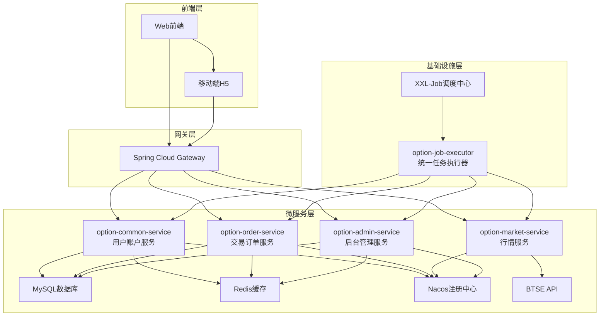
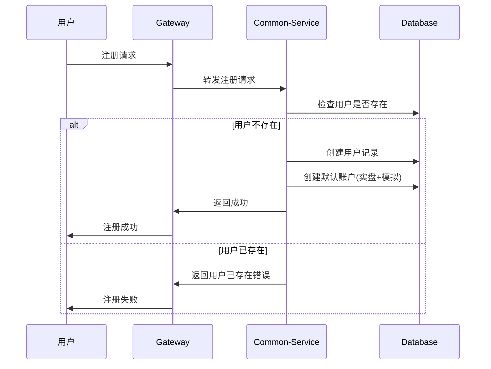
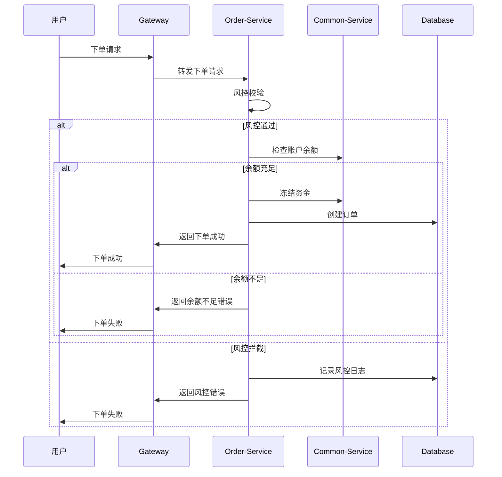
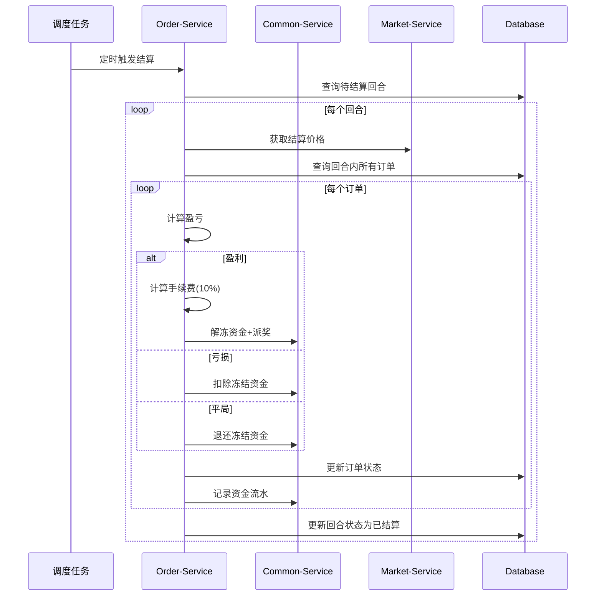
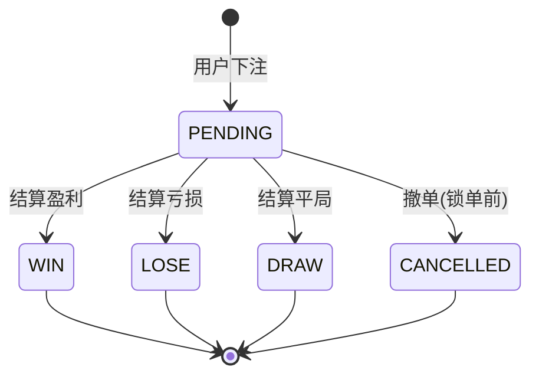
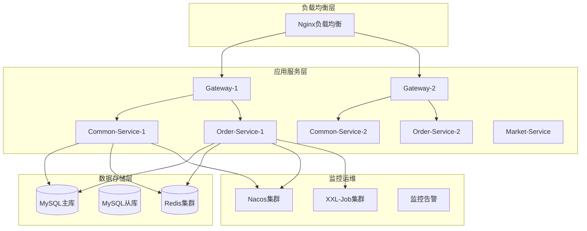
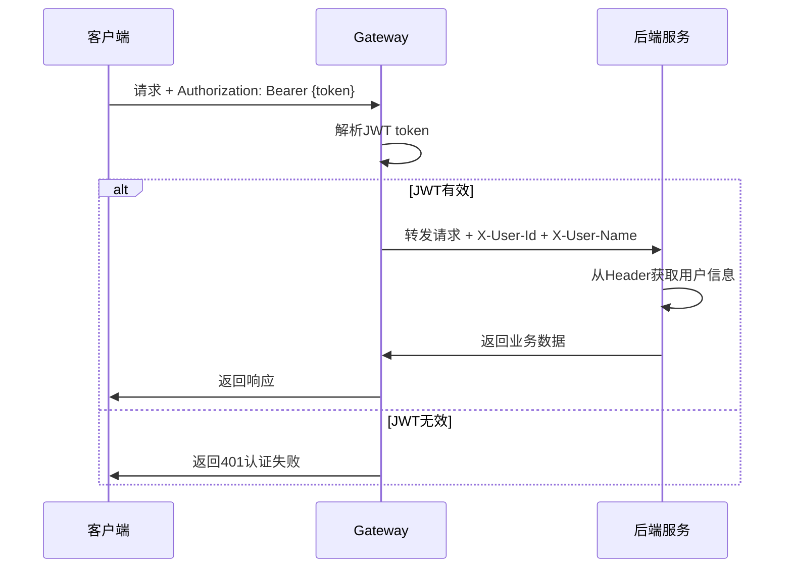

# 二元期权平台详细设计文档

| 版本   | 日期         | 作者    | 说明                     |
|--------|--------------|---------|--------------------------|
| v1.0   | 2025年7月18日 | Barry  | 初稿                     |
| v1.1   | 2025年7月22日 | Barry | 更新实现状态，完成数据库实体映射 |
| v1.2   | 2025年7月22日 | Barry | 完成统一异常处理框架实现 |
| v1.3   | 2025年7月23日 | Barry | 完成安全配置统一，添加权限注解体系 |
| v1.4   | 2025年7月23日 | Barry | 重构为Gateway信任模式安全架构 |
| v1.5   | 2025年7月24日 | Claude | 新增统一任务执行器，完善系统架构 |

## 1. 概述

本文档基于《二元期权平台产品需求文档(PRD)》，详细设计二元期权交易平台的技术架构、数据模型、API接口和业务流程。

### 1.1 设计原则
- **微服务架构**：按业务领域拆分服务，便于独立开发和部署
- **数据安全**：实盘/模拟账户严格隔离，风控校验全覆盖
- **高可用性**：支持水平扩展，关键服务冗余部署
- **实时性**：交易、行情、结算等核心流程实时处理
- **可扩展性**：支持多币种、多周期扩展

### 1.2 技术栈
- **框架**：Spring Boot 2.7.18, Spring Cloud Gateway
- **数据访问**：MyBatis 3.x（替代JPA，提供更好的SQL控制）
- **数据库**：MySQL 8.0, Redis 6.0
- **服务发现**：Nacos
- **任务调度**：XXL-Job
- **外部接口**：BTSE WebSocket API

### 1.3 当前实现状态
✅ **已完成**：
- **完整的微服务架构**（11个模块）：
  - option-common-service（用户账户服务）
  - option-order-service（交易订单服务）
  - option-market-service（行情数据服务）
  - option-admin-service（后台管理服务）
  - option-gateway（API网关服务）
  - option-job-executor（统一任务执行器）
  - option-security-base（安全框架基础）
  - option-common-utils（通用工具库）
  - option-common-dto（数据传输对象）
  - option-parent（Maven父项目）
  - option-xxl-job（任务调度框架）

- **完整的数据库设计**（17张表，包含索引和关系）
- **生产级安全架构**：
  - JWT认证与授权体系
  - 基于角色和权限的访问控制
  - Gateway信任模式安全配置
  - Redis权限缓存机制
  - AOP切面权限验证

- **统一任务调度系统**：
  - XXL-Job集成的分布式任务调度
  - 数据清理、统计聚合、订单结算等9个任务处理器
  - 任务监控和日志管理
  - 失败重试和告警机制

- **完整的基础设施**：
  - Spring Cloud微服务架构
  - Nacos服务发现和配置中心
  - Redis集群缓存
  - 统一异常处理和国际化支持
  - 生产级部署脚本和监控

✅ **业务功能完成度**：
- 用户注册、登录、账户管理 ✓
- 订单创建、风控校验、结算 ✓
- 行情数据采集、K线生成 ✓
- 后台管理、权限控制、统计报表 ✓
- 定时任务调度和数据维护 ✓

🔄 **持续优化**：
- WebSocket实时推送优化
- 性能监控和告警完善
- 前端界面集成和用户体验优化

## 2. 系统架构设计

### 2.1 整体架构图



### 2.2 服务端口配置

| 服务模块 | 服务端口 | 额外端口 | 用途说明 |
|---------|---------|----------|----------|
| option-gateway | 8080 | - | API网关，统一入口 |
| option-common-service | 8081 | - | 用户账户服务 |
| option-order-service | 8082 | - | 交易订单服务 |
| option-market-service | 8083 | - | 行情数据服务 |
| option-admin-service | 8084 | - | 后台管理服务 |
| option-job-executor | 8085 | 10000 | 统一任务执行器 (10000为XXL-Job内部通信端口) |
| XXL-Job Admin | 9090 | - | 任务调度管理中心 |

### 2.3 服务职责划分

#### 2.3.1 option-common-service (用户账户服务)
**职责**:
- 用户管理：注册、登录、信息维护
- 账户管理：实盘/模拟账户、余额管理
- 资产管理：充值、提现、转账记录
- 基础配置：币种管理、全局参数

#### 2.3.2 option-order-service (交易订单服务)  
**职责**:
- 交易管理：下单、撤单、订单查询
- 回合管理：交易周期、倒计时、锁单
- 风控管理：限额校验、黑名单、风控日志
- 结算引擎：自动结算、盈亏计算、资金划转

#### 2.3.3 option-market-service (行情服务)
**职责**:
- 行情推送：实时价格、K线数据
- BTSE集成：WebSocket连接管理
- 数据缓存：价格快照、历史数据

#### 2.3.4 option-admin-service (后台管理服务)
**职责**:
- 用户管理：用户查询、账户管理、黑名单管理
- 交易管理：订单监控、回合管理、结算管理
- 风控管理：风控配置、风控日志、实时监控
- 系统配置：币种管理、周期配置、全局参数配置
- 数据统计：业务统计、财务报表、系统监控

#### 2.3.5 option-job-executor (统一任务执行器) **[新增]**
**职责**:
- 任务调度：基于XXL-Job的分布式定时任务管理
- 数据维护：数据清理、统计聚合、完整性检查
- 业务调度：订单结算、超时处理、系统监控
- 日志管理：任务执行日志、性能监控、异常告警

**核心任务处理器**:
- **市场数据类**: DataCleanupJobHandler, DataIntegrityJobHandler
- **统计聚合类**: DailyStatsJobHandler, HourlyStatsJobHandler, StatsCleanupJobHandler  
- **订单处理类**: OrderSettlementJobHandler, OrderTimeoutJobHandler
- **系统维护类**: HealthCheckJobHandler, LogCleanupJobHandler

**技术特性**:
- 支持任务失败重试和监控告警
- 通过Feign客户端调用业务服务接口
- 统一的任务执行日志和性能统计
- 支持动态任务配置和参数调整

#### 2.3.6 option-gateway (API网关)
**职责**:
- 路由转发：请求分发、负载均衡
- 认证鉴权：JWT验证、用户身份传递
- 限流熔断：接口保护、异常处理

## 3. 数据库设计

### 3.1 option-common-service 数据表

#### 3.1.1 用户表 (user)
```sql
CREATE TABLE `user` (
  `id` bigint NOT NULL AUTO_INCREMENT COMMENT '主键ID',
  `external_id` varchar(64) NOT NULL COMMENT '外部用户ID(BTSE用户ID)',
  `password` varchar(128) NOT NULL COMMENT '密码(加密)',
  `nickname` varchar(64) DEFAULT NULL COMMENT '昵称',
  `email` varchar(128) DEFAULT NULL COMMENT '邮箱',
  `phone` varchar(32) DEFAULT NULL COMMENT '手机号',
  `status` tinyint NOT NULL DEFAULT '1' COMMENT '状态(1:正常 2:禁用)',
  `signature` varchar(128) DEFAULT NULL COMMENT '个性签名',
  `risk_agreement` tinyint NOT NULL DEFAULT '0' COMMENT '风险协议(0:未同意 1:已同意)',
  `aml_agreement` tinyint NOT NULL DEFAULT '0' COMMENT 'AML协议(0:未同意 1:已同意)',
  `create_time` datetime NOT NULL COMMENT '创建时间',
  `update_time` datetime NOT NULL COMMENT '更新时间',
  PRIMARY KEY (`id`),
  UNIQUE KEY `uk_external_id` (`external_id`),
  UNIQUE KEY `uk_email` (`email`),
  UNIQUE KEY `uk_phone` (`phone`)
) ENGINE=InnoDB COMMENT='用户表';
```

#### 3.1.2 账户表 (account)
```sql
CREATE TABLE `account` (
  `id` bigint NOT NULL AUTO_INCREMENT COMMENT '主键ID',
  `user_id` bigint NOT NULL COMMENT '用户ID',
  `account_type` varchar(16) NOT NULL COMMENT '账户类型(REAL:实盘 DEMO:模拟)',
  `currency` varchar(8) NOT NULL DEFAULT 'USDT' COMMENT '币种',
  `balance` decimal(32,16) NOT NULL DEFAULT '0.0000000000000000' COMMENT '可用余额',
  `frozen_balance` decimal(32,16) NOT NULL DEFAULT '0.0000000000000000' COMMENT '冻结余额',
  `total_deposit` decimal(32,16) NOT NULL DEFAULT '0.0000000000000000' COMMENT '累计充值',
  `total_withdraw` decimal(32,16) NOT NULL DEFAULT '0.0000000000000000' COMMENT '累计提现',
  `total_profit` decimal(32,16) NOT NULL DEFAULT '0.0000000000000000' COMMENT '累计盈利',
  `total_loss` decimal(32,16) NOT NULL DEFAULT '0.0000000000000000' COMMENT '累计亏损',
  `reset_count` int NOT NULL DEFAULT '0' COMMENT '重置次数(仅模拟账户)',
  `last_reset_time` datetime DEFAULT NULL COMMENT '最后重置时间',
  `create_time` datetime NOT NULL COMMENT '创建时间',
  `update_time` datetime NOT NULL COMMENT '更新时间',
  PRIMARY KEY (`id`),
  UNIQUE KEY `uk_user_type_currency` (`user_id`,`account_type`,`currency`),
  KEY `idx_user_id` (`user_id`)
) ENGINE=InnoDB COMMENT='账户表';
```

#### 3.1.3 资金流水表 (account_transaction)
```sql
CREATE TABLE `account_transaction` (
  `id` bigint NOT NULL AUTO_INCREMENT COMMENT '主键ID',
  `user_id` bigint NOT NULL COMMENT '用户ID',
  `account_id` bigint NOT NULL COMMENT '账户ID',
  `type` varchar(16) NOT NULL COMMENT '交易类型(DEPOSIT:充值 WITHDRAW:提现 CANCEL:撤单 BET_WIN:投注盈利 BET_LOSE:投注亏损 BET_DRAW:投注平局 RESET:重置)',
  `amount` decimal(32,16) NOT NULL COMMENT '交易金额',
  `balance_before` decimal(32,16) NOT NULL COMMENT '交易前余额',
  `balance_after` decimal(32,16) NOT NULL COMMENT '交易后余额',
  `ref_id` bigint DEFAULT NULL COMMENT '关联ID(订单ID等)',
  `ref_type` varchar(16) DEFAULT NULL COMMENT '关联类型(ORDER等)',
  `remark` varchar(255) DEFAULT NULL COMMENT '备注',
  `create_time` datetime NOT NULL COMMENT '创建时间',
  PRIMARY KEY (`id`),
  KEY `idx_user_account` (`user_id`,`account_id`),
  KEY `idx_ref` (`ref_id`,`ref_type`),
  KEY `idx_create_time` (`create_time`)
) ENGINE=InnoDB COMMENT='资金流水表';
```

#### 3.1.4 币种配置表 (symbol_config)
```sql
CREATE TABLE `symbol_config` (
  `id` bigint NOT NULL AUTO_INCREMENT COMMENT '主键ID',
  `symbol` varchar(16) NOT NULL COMMENT '交易对(如BTC/USDT)',
  `base_currency` varchar(8) NOT NULL COMMENT '基础币种(BTC)',
  `quote_currency` varchar(8) NOT NULL COMMENT '计价币种(USDT)',
  `enabled` tinyint NOT NULL DEFAULT '1' COMMENT '是否启用(0:禁用 1:启用)',
  `min_amount` decimal(32,16) NOT NULL DEFAULT '10.0000000000000000' COMMENT '最小下注金额',
  `max_amount` decimal(32,16) NOT NULL DEFAULT '10000.0000000000000000' COMMENT '最大下注金额',
  `btse_symbol` varchar(32) NOT NULL COMMENT 'BTSE交易对名称',
  `sort_order` int NOT NULL DEFAULT '0' COMMENT '排序',
  `create_time` datetime NOT NULL COMMENT '创建时间',
  `update_time` datetime NOT NULL COMMENT '更新时间',
  PRIMARY KEY (`id`),
  UNIQUE KEY `uk_symbol` (`symbol`)
) ENGINE=InnoDB COMMENT='币种配置表';
```

### 3.2 option-order-service 数据表

#### 3.2.1 周期配置表 (duration_config)
```sql
CREATE TABLE `duration_config` (
  `id` bigint NOT NULL AUTO_INCREMENT COMMENT '主键ID',
  `duration_minutes` int NOT NULL COMMENT '周期时长(分钟)',
  `duration_name` varchar(32) NOT NULL COMMENT '周期名称(如5分钟)',
  `enabled` tinyint NOT NULL DEFAULT '1' COMMENT '是否启用(0:禁用 1:启用)',
  `lock_seconds` int NOT NULL DEFAULT '30' COMMENT '锁单时间(秒)',
  `base_odds` decimal(10,4) NOT NULL DEFAULT '1.9000' COMMENT '基础赔率',
  `fee_rate` decimal(6,4) NOT NULL DEFAULT '0.1000' COMMENT '手续费率(0.1表示10%)',
  `sort_order` int NOT NULL DEFAULT '0' COMMENT '排序',
  `create_time` datetime NOT NULL COMMENT '创建时间',
  `update_time` datetime NOT NULL COMMENT '更新时间',
  PRIMARY KEY (`id`),
  UNIQUE KEY `uk_duration` (`duration_minutes`)
) ENGINE=InnoDB COMMENT='周期配置表';
```

#### 3.2.2 交易回合表 (trading_round)
```sql
CREATE TABLE `trading_round` (
  `id` bigint NOT NULL AUTO_INCREMENT COMMENT '主键ID',
  `round_no` varchar(64) NOT NULL COMMENT '回合编号',
  `symbol_id` bigint NOT NULL COMMENT '交易对ID',
  `duration_minutes` int NOT NULL COMMENT '周期时长(分钟)',
  `start_time` datetime NOT NULL COMMENT '开始时间',
  `lock_time` datetime NOT NULL COMMENT '锁单时间(结束前30秒)',
  `end_time` datetime NOT NULL COMMENT '结束时间',
  `start_price` decimal(32,16) DEFAULT NULL COMMENT '开盘价',
  `end_price` decimal(32,16) DEFAULT NULL COMMENT '收盘价',
  `status` varchar(16) NOT NULL DEFAULT 'OPEN' COMMENT '状态(OPEN:开放 LOCKED:锁单 SETTLED:已结算)',
  `total_up_amount` decimal(32,16) NOT NULL DEFAULT '0.0000000000000000' COMMENT 'UP总投注额',
  `total_down_amount` decimal(32,16) NOT NULL DEFAULT '0.0000000000000000' COMMENT 'DOWN总投注额',
  `create_time` datetime NOT NULL COMMENT '创建时间',
  `update_time` datetime NOT NULL COMMENT '更新时间',
  PRIMARY KEY (`id`),
  UNIQUE KEY `uk_round_no` (`round_no`),
  KEY `idx_symbol_time` (`symbol_id`,`start_time`),
  KEY `idx_status` (`status`)
) ENGINE=InnoDB COMMENT='交易回合表';
```

#### 3.2.3 订单表 (option_order)
```sql
CREATE TABLE `option_order` (
  `id` bigint NOT NULL AUTO_INCREMENT COMMENT '主键ID',
  `user_id` bigint NOT NULL COMMENT '用户ID',
  `account_type` varchar(16) NOT NULL COMMENT '账户类型(REAL:实盘 DEMO:模拟)',
  `symbol_id` bigint NOT NULL COMMENT '交易对ID',
  `round_id` bigint NOT NULL COMMENT '回合ID',
  `round_no` varchar(64) NOT NULL COMMENT '回合编号',
  `direction` varchar(8) NOT NULL COMMENT '方向(UP:看涨 DOWN:看跌)',
  `amount` decimal(32,16) NOT NULL COMMENT '投注金额',
  `odds` decimal(10,4) NOT NULL COMMENT '赔率',
  `expected_profit` decimal(32,16) NOT NULL COMMENT '预期收益',
  `order_price` decimal(32,16) NOT NULL COMMENT '下单价格',
  `settle_price` decimal(32,16) DEFAULT NULL COMMENT '结算价格',
  `status` varchar(16) NOT NULL DEFAULT 'PENDING' COMMENT '状态(PENDING:进行中 WIN:盈利 LOSE:亏损 DRAW:平局 CANCELLED:已撤销)',
  `profit` decimal(32,16) DEFAULT NULL COMMENT '实际盈亏',
  `fee` decimal(32,16) DEFAULT NULL COMMENT '手续费',
  `cancel_time` datetime DEFAULT NULL COMMENT '撤销时间',
  `settle_time` datetime DEFAULT NULL COMMENT '结算时间',
  `create_time` datetime NOT NULL COMMENT '创建时间',
  `update_time` datetime NOT NULL COMMENT '更新时间',
  PRIMARY KEY (`id`),
  KEY `idx_user_symbol_round` (`user_id`,`symbol_id`,`round_id`),
  KEY `idx_round_status` (`round_id`,`status`),
  KEY `idx_user_create_time` (`user_id`,`create_time`)
) ENGINE=InnoDB COMMENT='订单表';
```

#### 3.2.4 风控配置表 (risk_config)
```sql
CREATE TABLE `risk_config` (
  `id` bigint NOT NULL AUTO_INCREMENT COMMENT '主键ID',
  `config_key` varchar(64) NOT NULL COMMENT '配置键',
  `config_value` varchar(255) NOT NULL COMMENT '配置值',
  `config_type` varchar(16) NOT NULL COMMENT '配置类型(LIMIT:限额 BLACKLIST:黑名单 GLOBAL:全局)',
  `description` varchar(255) DEFAULT NULL COMMENT '描述',
  `enabled` tinyint NOT NULL DEFAULT '1' COMMENT '是否启用',
  `create_time` datetime NOT NULL COMMENT '创建时间',
  `update_time` datetime NOT NULL COMMENT '更新时间',
  PRIMARY KEY (`id`),
  UNIQUE KEY `uk_config_key` (`config_key`)
) ENGINE=InnoDB COMMENT='风控配置表';
```

#### 3.2.5 风控日志表 (risk_log)
```sql
CREATE TABLE `risk_log` (
  `id` bigint NOT NULL AUTO_INCREMENT COMMENT '主键ID',
  `user_id` bigint NOT NULL COMMENT '用户ID',
  `risk_type` varchar(32) NOT NULL COMMENT '风控类型(AMOUNT_LIMIT:金额限制 FREQUENCY_LIMIT:频次限制 BLACKLIST:黑名单)',
  `risk_level` varchar(16) NOT NULL COMMENT '风险级别(LOW:低 MEDIUM:中 HIGH:高)',
  `action` varchar(32) NOT NULL COMMENT '处理动作(BLOCK:阻断 WARN:警告 LOG:记录)',
  `description` varchar(500) NOT NULL COMMENT '详细描述',
  `request_data` text COMMENT '请求数据',
  `create_time` datetime NOT NULL COMMENT '创建时间',
  PRIMARY KEY (`id`),
  KEY `idx_user_time` (`user_id`,`create_time`),
  KEY `idx_risk_type` (`risk_type`)
) ENGINE=InnoDB COMMENT='风控日志表';
```

### 3.3 option-admin-service 数据表

#### 3.3.1 黑名单表 (blacklist)
```sql
CREATE TABLE `blacklist` (
  `id` bigint NOT NULL AUTO_INCREMENT COMMENT '主键ID',
  `user_id` bigint NOT NULL COMMENT '用户ID',
  `reason` varchar(255) NOT NULL COMMENT '加入黑名单原因',
  `operator_id` bigint NOT NULL COMMENT '操作员ID',
  `operator_name` varchar(64) NOT NULL COMMENT '操作员姓名',
  `start_time` datetime NOT NULL COMMENT '生效时间',
  `end_time` datetime DEFAULT NULL COMMENT '失效时间(NULL表示永久)',
  `status` tinyint NOT NULL DEFAULT '1' COMMENT '状态(1:生效 0:失效)',
  `create_time` datetime NOT NULL COMMENT '创建时间',
  `update_time` datetime NOT NULL COMMENT '更新时间',
  PRIMARY KEY (`id`),
  KEY `idx_user_id` (`user_id`),
  KEY `idx_status_time` (`status`,`start_time`,`end_time`)
) ENGINE=InnoDB COMMENT='黑名单表';
```

#### 3.3.2 管理员操作日志表 (admin_operation_log)
```sql
CREATE TABLE `admin_operation_log` (
  `id` bigint NOT NULL AUTO_INCREMENT COMMENT '主键ID',
  `operator_id` bigint NOT NULL COMMENT '操作员ID',
  `operator_name` varchar(64) NOT NULL COMMENT '操作员姓名',
  `operation_type` varchar(32) NOT NULL COMMENT '操作类型(USER_UPDATE:用户更新 CONFIG_UPDATE:配置更新等)',
  `operation_desc` varchar(255) NOT NULL COMMENT '操作描述',
  `target_type` varchar(32) DEFAULT NULL COMMENT '目标类型(USER:用户 CONFIG:配置等)',
  `target_id` varchar(64) DEFAULT NULL COMMENT '目标ID',
  `before_data` text COMMENT '操作前数据',
  `after_data` text COMMENT '操作后数据',
  `ip_address` varchar(64) DEFAULT NULL COMMENT '操作IP',
  `user_agent` varchar(255) DEFAULT NULL COMMENT '用户代理',
  `result` tinyint NOT NULL DEFAULT '1' COMMENT '操作结果(1:成功 0:失败)',
  `error_msg` varchar(500) DEFAULT NULL COMMENT '错误信息',
  `create_time` datetime NOT NULL COMMENT '创建时间',
  PRIMARY KEY (`id`),
  KEY `idx_operator_time` (`operator_id`,`create_time`),
  KEY `idx_operation_type` (`operation_type`),
  KEY `idx_target` (`target_type`,`target_id`)
) ENGINE=InnoDB COMMENT='管理员操作日志表';
```

#### 3.3.3 全局配置表 (global_config)
```sql
CREATE TABLE `global_config` (
  `id` bigint NOT NULL AUTO_INCREMENT COMMENT '主键ID',
  `config_key` varchar(64) NOT NULL COMMENT '配置键',
  `config_value` text NOT NULL COMMENT '配置值',
  `config_type` varchar(16) NOT NULL COMMENT '配置类型(STRING:字符串 NUMBER:数字 BOOLEAN:布尔 JSON:JSON对象)',
  `config_group` varchar(32) NOT NULL COMMENT '配置分组(SYSTEM:系统 BUSINESS:业务 UI:界面)',
  `description` varchar(255) DEFAULT NULL COMMENT '配置描述',
  `enabled` tinyint NOT NULL DEFAULT '1' COMMENT '是否启用',
  `sort_order` int NOT NULL DEFAULT '0' COMMENT '排序',
  `create_time` datetime NOT NULL COMMENT '创建时间',
  `update_time` datetime NOT NULL COMMENT '更新时间',
  PRIMARY KEY (`id`),
  UNIQUE KEY `uk_config_key` (`config_key`),
  KEY `idx_config_group` (`config_group`)
) ENGINE=InnoDB COMMENT='全局配置表';
```

#### 3.3.4 每日统计表 (daily_stats)
```sql
CREATE TABLE `daily_stats` (
  `id` bigint NOT NULL AUTO_INCREMENT COMMENT '主键ID',
  `stat_date` date NOT NULL COMMENT '统计日期',
  `symbol_id` bigint DEFAULT NULL COMMENT '交易对ID(NULL表示全部)',
  `total_users` int NOT NULL DEFAULT '0' COMMENT '总用户数',
  `active_users` int NOT NULL DEFAULT '0' COMMENT '活跃用户数',
  `new_users` int NOT NULL DEFAULT '0' COMMENT '新增用户数',
  `total_orders` int NOT NULL DEFAULT '0' COMMENT '订单总数',
  `pending_orders` int NOT NULL DEFAULT '0' COMMENT '进行中订单数',
  `win_orders` int NOT NULL DEFAULT '0' COMMENT '盈利订单数',
  `lose_orders` int NOT NULL DEFAULT '0' COMMENT '亏损订单数',
  `draw_orders` int NOT NULL DEFAULT '0' COMMENT '平局订单数',
  `total_volume` decimal(32,16) NOT NULL DEFAULT '0.0000000000000000' COMMENT '交易总量',
  `total_profit` decimal(32,16) NOT NULL DEFAULT '0.0000000000000000' COMMENT '用户总盈利',
  `total_loss` decimal(32,16) NOT NULL DEFAULT '0.0000000000000000' COMMENT '用户总亏损',
  `total_fee` decimal(32,16) NOT NULL DEFAULT '0.0000000000000000' COMMENT '平台手续费收入',
  `win_rate` decimal(5,4) NOT NULL DEFAULT '0.0000' COMMENT '胜率',
  `avg_order_amount` decimal(32,16) NOT NULL DEFAULT '0.0000000000000000' COMMENT '平均下单金额',
  `create_time` datetime NOT NULL COMMENT '创建时间',
  `update_time` datetime NOT NULL COMMENT '更新时间',
  PRIMARY KEY (`id`),
  UNIQUE KEY `uk_date_symbol` (`stat_date`, `symbol_id`),
  KEY `idx_stat_date` (`stat_date`)
) ENGINE=InnoDB COMMENT='每日统计表';
```

#### 3.3.5 每小时统计表 (hourly_stats)
```sql
CREATE TABLE `hourly_stats` (
  `id` bigint NOT NULL AUTO_INCREMENT COMMENT '主键ID',
  `stat_datetime` datetime NOT NULL COMMENT '统计时间(精确到小时)',
  `symbol_id` bigint DEFAULT NULL COMMENT '交易对ID(NULL表示全部)',
  `active_users` int NOT NULL DEFAULT '0' COMMENT '活跃用户数',
  `total_orders` int NOT NULL DEFAULT '0' COMMENT '订单总数',
  `total_volume` decimal(32,16) NOT NULL DEFAULT '0.0000000000000000' COMMENT '交易总量',
  `total_profit` decimal(32,16) NOT NULL DEFAULT '0.0000000000000000' COMMENT '用户总盈利',
  `total_loss` decimal(32,16) NOT NULL DEFAULT '0.0000000000000000' COMMENT '用户总亏损',
  `total_fee` decimal(32,16) NOT NULL DEFAULT '0.0000000000000000' COMMENT '平台手续费收入',
  `create_time` datetime NOT NULL COMMENT '创建时间',
  PRIMARY KEY (`id`),
  UNIQUE KEY `uk_datetime_symbol` (`stat_datetime`, `symbol_id`),
  KEY `idx_stat_datetime` (`stat_datetime`)
) ENGINE=InnoDB COMMENT='每小时统计表';
```

## 4. API接口设计

### 4.0 统一异常处理与响应格式 ✅

#### 4.0.1 统一响应格式
所有API接口统一使用`ApiResponse<T>`泛型响应格式：

```java
@Data
@Builder
@NoArgsConstructor
@AllArgsConstructor
public class ApiResponse<T> {
    private Integer code;        // 响应码
    private String message;      // 响应消息
    private T data;             // 响应数据（泛型）
    @Builder.Default
    private LocalDateTime timestamp = LocalDateTime.now(); // 响应时间
    
    // 成功响应
    public static <T> ApiResponse<T> success(T data) {
        return ApiResponse.<T>builder()
                .code(200)
                .message("success")
                .data(data)
                .build();
    }
    
    public static <T> ApiResponse<T> success(T data, String message) {
        return ApiResponse.<T>builder()
                .code(200)
                .message(message)
                .data(data)
                .build();
    }
    
    // 错误响应
    public static <T> ApiResponse<T> error(Integer code, String message) {
        return ApiResponse.<T>builder()
                .code(code)
                .message(message)
                .build();
    }
}
```

#### 4.0.2 业务异常类
统一的业务异常处理：

```java
@Getter
public class BusinessException extends RuntimeException {
    private final Integer code;
    
    public BusinessException(Integer code, String message) {
        super(message);
        this.code = code;
    }
    
    // 常用快捷方法
    public static BusinessException notFound(String message) {
        return new BusinessException(404, message);
    }
    
    public static BusinessException badRequest(String message) {
        return new BusinessException(400, message);
    }
    
    public static BusinessException forbidden(String message) {
        return new BusinessException(403, message);
    }
}
```

#### 4.0.3 全局异常处理器
每个服务继承统一的`GlobalExceptionHandler`：

```java
@RestControllerAdvice
@Slf4j
public class GlobalExceptionHandler {
    
    // 业务异常处理
    @ExceptionHandler(BusinessException.class)
    public ResponseEntity<ApiResponse<Void>> handleBusinessException(BusinessException e) {
        log.warn("Business exception: [{}] {}", e.getCode(), e.getMessage());
        ApiResponse<Void> response = ApiResponse.error(e.getCode(), e.getMessage());
        return ResponseEntity.ok(response);
    }
    
    // 参数验证异常
    @ExceptionHandler(MethodArgumentNotValidException.class)
    public ResponseEntity<ApiResponse<Map<String, String>>> handleValidationException(
            MethodArgumentNotValidException e) {
        Map<String, String> errors = new HashMap<>();
        e.getBindingResult().getAllErrors().forEach(error -> {
            String fieldName = ((FieldError) error).getField();
            String errorMessage = error.getDefaultMessage();
            errors.put(fieldName, errorMessage);
        });
        
        ApiResponse<Map<String, String>> response = ApiResponse.<Map<String, String>>builder()
                .code(400)
                .message("参数验证失败")
                .data(errors)
                .build();
        
        return ResponseEntity.badRequest().body(response);
    }
    
    // 其他系统异常
    @ExceptionHandler(Exception.class)
    public ResponseEntity<ApiResponse<Void>> handleGenericException(Exception e) {
        log.error("Unexpected error occurred", e);
        ApiResponse<Void> response = ApiResponse.serverError("系统内部错误");
        return ResponseEntity.status(500).body(response);
    }
}
```

#### 4.0.4 响应码规范
| 响应码 | 含义 | 使用场景 |
|--------|------|----------|
| 200 | 成功 | 正常业务处理成功 |
| 400 | 请求参数错误 | 参数验证失败、格式错误 |
| 401 | 未认证 | 用户未登录、Token无效 |
| 403 | 权限不足 | 用户权限不够、操作被禁止 |
| 404 | 资源不存在 | 用户不存在、订单不存在 |
| 405 | 方法不支持 | HTTP方法错误 |
| 409 | 业务冲突 | 用户已存在、重复操作 |
| 500 | 系统错误 | 服务内部异常、数据库连接异常 |

#### 4.0.5 成功响应示例
```json
{
  "code": 200,
  "message": "success",
  "data": {
    "id": 1,
    "username": "test_user",
    "email": "test@example.com"
  },
  "timestamp": "2025-07-22T10:30:45"
}
```

#### 4.0.6 错误响应示例
```json
{
  "code": 404,
  "message": "用户不存在",
  "data": null,
  "timestamp": "2025-07-22T10:30:45"
}
```

#### 4.0.7 参数验证错误响应示例
```json
{
  "code": 400,
  "message": "参数验证失败",
  "data": {
    "username": "用户名不能为空",
    "email": "邮箱格式不正确"
  },
  "timestamp": "2025-07-22T10:30:45"
}
```

### 4.1 option-common-service 接口

#### 4.1.1 用户管理接口

```http
# 创建用户
POST /user
Content-Type: application/json
{
  "externalId": "btse_user_123",
  "nickname": "用户昵称",
  "email": "user@example.com",
  "phone": "+8613800138000",
  "password": "password123"
}

# 获取当前用户信息 (Gateway信任模式)
GET /user/me
X-User-Id: 1
X-User-Name: testuser

# 同意风险协议
POST /user/agreement
{
  "riskAgreement": true,
  "amlAgreement": true
}
```

#### 4.1.2 账户管理接口

```http
# 获取账户列表 (Gateway信任模式)
GET /account/list?accountType=REAL
X-User-Id: 1
X-User-Name: testuser

# 获取账户余额 (Gateway信任模式)
GET /account/balance?accountType=REAL&currency=USDT
X-User-Id: 1
X-User-Name: testuser

# 重置模拟账户
POST /account/reset
{
  "accountType": "DEMO",
  "currency": "USDT"
}

# 获取资金流水 (Gateway信任模式)
GET /account/transactions?page=1&size=20&type=BET
X-User-Id: 1
X-User-Name: testuser
```

### 4.2 option-order-service 接口

#### 4.2.1 交易接口

```http
# 获取当前回合信息
GET /trading/rounds/current?symbolId=1&duration=5

# 下单 (Gateway信任模式)
POST /order/place
X-User-Id: 1
X-User-Name: testuser
{
  "symbolId": 1,
  "accountType": "REAL", 
  "direction": "UP",
  "amount": "100.0000000000000000"
}

# 撤单 (Gateway信任模式)
POST /order/cancel/{orderId}
X-User-Id: 1
X-User-Name: testuser

# 获取我的订单 (Gateway信任模式)
GET /order/my?status=PENDING&page=1&size=20
X-User-Id: 1
X-User-Name: testuser

# 获取订单详情 (Gateway信任模式)
GET /order/{orderId}
X-User-Id: 1
X-User-Name: testuser
```

#### 4.2.2 风控接口

```http
# 风控校验
POST /risk/check
{
  "userId": 123,
  "action": "PLACE_ORDER",
  "amount": "1000.0000000000000000",
  "accountType": "REAL"
}

# 获取风控日志 (Gateway信任模式)
GET /risk/logs?userId=123&page=1&size=20
X-User-Id: 1
X-User-Name: testuser
```

### 4.3 option-admin-service 接口

#### 4.3.1 用户管理接口

```http
# 获取用户列表 (需要JWT认证)
GET /admin/users?page=1&size=20&status=1&keyword=test
Authorization: Bearer {jwt_token}

# 获取用户详情 (需要JWT认证)
GET /admin/users/{userId}
Authorization: Bearer {jwt_token}

# 更新用户状态
PUT /admin/users/{userId}/status
{
  "status": 2,  // 1:正常 2:禁用
  "reason": "违规操作"
}

# 获取用户账户信息
GET /admin/users/{userId}/accounts

# 获取用户资金流水
GET /admin/users/{userId}/transactions?page=1&size=20
```

#### 4.3.2 交易管理接口

```http
# 获取订单列表
GET /admin/orders?page=1&size=20&status=PENDING&symbolId=1

# 获取订单详情
GET /admin/orders/{orderId}

# 获取回合列表
GET /admin/rounds?page=1&size=20&status=OPEN&symbolId=1

# 获取回合详情
GET /admin/rounds/{roundId}

# 手动结算回合(紧急情况)
POST /admin/rounds/{roundId}/settle
{
  "settlePrice": "45000.12345678",
  "reason": "紧急处理"
}
```

#### 4.3.3 风控管理接口

```http
# 获取风控配置
GET /admin/risk/configs

# 更新风控配置
PUT /admin/risk/configs/{configKey}
{
  "configValue": "10000",
  "enabled": true
}

# 获取风控日志
GET /admin/risk/logs?page=1&size=20&riskType=AMOUNT_LIMIT

# 黑名单管理
GET /admin/risk/blacklist?page=1&size=20
POST /admin/risk/blacklist
{
  "userId": 123,
  "reason": "异常交易行为",
  "duration": 7  // 天数，0表示永久
}
```

#### 4.3.4 系统配置接口

```http
# 币种配置管理
GET /admin/configs/symbols
PUT /admin/configs/symbols/{symbolId}
{
  "enabled": true,
  "minAmount": "10.0000000000000000",
  "maxAmount": "10000.0000000000000000"
}

# 周期配置管理
GET /admin/configs/durations
PUT /admin/configs/durations/{durationId}
{
  "enabled": true,
  "lockSeconds": 30
}

# 全局配置管理
GET /admin/configs/global
PUT /admin/configs/global/{configKey}
{
  "configValue": "value",
  "description": "配置说明"
}
```

#### 4.3.5 数据统计接口

```http
# 业务概览统计
GET /admin/stats/overview?startDate=2025-07-01&endDate=2025-07-18

# 交易统计
GET /admin/stats/trading?startDate=2025-07-01&endDate=2025-07-18&symbolId=1

# 用户统计
GET /admin/stats/users?startDate=2025-07-01&endDate=2025-07-18

# 财务统计
GET /admin/stats/finance?startDate=2025-07-01&endDate=2025-07-18

# 实时监控数据
GET /admin/monitor/realtime
```

## 5. 业务流程设计

### 5.1 用户注册登录流程



### 5.2 下单交易流程



### 5.3 自动结算流程



### 5.4 订单状态流转与数据变化

#### 5.4.1 订单状态流转图


#### 5.4.2 各状态对应的数据变化

**1. 下注阶段 (PENDING)**
```sql
-- 订单表：创建订单记录
INSERT INTO option_order (user_id, amount, direction, status, ...) 
VALUES (123, 100.0000000000000000, 'UP', 'PENDING', ...);

-- 账户表：转移资金到冻结余额
UPDATE account SET 
    balance = balance - 100.0000000000000000,
    frozen_balance = frozen_balance + 100.0000000000000000
WHERE user_id = 123 AND account_type = 'REAL';

-- 资金流水：不记录冻结流水
```

**2. 撤单阶段 (CANCELLED)**
```sql
-- 订单表：更新为撤单状态
UPDATE option_order SET 
    status = 'CANCELLED', cancel_time = NOW()
WHERE id = 订单ID;

-- 账户表：退还冻结资金
UPDATE account SET 
    balance = balance + 100.0000000000000000,
    frozen_balance = frozen_balance - 100.0000000000000000
WHERE user_id = 123;

-- 资金流水：记录撤单退款
INSERT INTO account_transaction (type, amount, remark) 
VALUES ('CANCEL', 100.0000000000000000, '撤单退还资金');
```

**3. 盈利结算 (WIN)**
```sql
-- 订单表：记录盈利结果
UPDATE option_order SET 
    status = 'WIN',
    profit = 90.0000000000000000,      -- 实际盈利
    fee = 9.0000000000000000,          -- 10%手续费
    settle_price = 45100.56789012,
    settle_time = NOW()
WHERE id = 订单ID;

-- 账户表：派发盈利(扣除手续费)
UPDATE account SET 
    balance = balance + 181.0000000000000000,        -- 本金100 + 盈利90 - 手续费9
    frozen_balance = frozen_balance - 100.0000000000000000,
    total_profit = total_profit + 81.0000000000000000  -- 净盈利
WHERE user_id = 123;

-- 资金流水：记录净盈利
INSERT INTO account_transaction (type, amount, remark) 
VALUES ('BET_WIN', 81.0000000000000000, '投注盈利(含本金,扣除手续费)');
```

**4. 亏损结算 (LOSE)**
```sql
-- 订单表：记录亏损结果
UPDATE option_order SET 
    status = 'LOSE',
    profit = -100.0000000000000000,    -- 亏损本金
    fee = 0.0000000000000000,          -- 亏损不收手续费
    settle_price = 44900.98765432,
    settle_time = NOW()
WHERE id = 订单ID;

-- 账户表：扣除冻结资金
UPDATE account SET 
    frozen_balance = frozen_balance - 100.0000000000000000,
    total_loss = total_loss + 100.0000000000000000
WHERE user_id = 123;
-- 注意：balance不变，资金已在下注时扣除

-- 资金流水：记录亏损
INSERT INTO account_transaction (type, amount, remark) 
VALUES ('BET_LOSE', -100.0000000000000000, '投注亏损');
```

**5. 平局结算 (DRAW)**
```sql
-- 订单表：记录平局结果
UPDATE option_order SET 
    status = 'DRAW',
    profit = 0.0000000000000000,       -- 无盈亏
    fee = 0.0000000000000000,          -- 平局不收手续费
    settle_price = 45000.12345678,     -- 与下单价相同
    settle_time = NOW()
WHERE id = 订单ID;

-- 账户表：退还本金
UPDATE account SET 
    balance = balance + 100.0000000000000000,
    frozen_balance = frozen_balance - 100.0000000000000000
WHERE user_id = 123;

-- 资金流水：记录平局退款
INSERT INTO account_transaction (type, amount, remark) 
VALUES ('BET_DRAW', 0.0000000000000000, '投注平局退还本金');
```

## 6. 关键技术实现

### 6.0 后台服务技术实现

#### 6.0.1 数据获取机制
option-admin-service通过以下方式获取数据：

**直接数据库查询**
```java
@Service
public class AdminUserService {
    
    @Autowired
    private UserRepository userRepository;
    
    @Autowired
    private AccountRepository accountRepository;
    
    // 用户列表查询(支持分页、筛选)
    public PageResult<UserVO> getUserList(UserQueryDTO query) {
        // 直接查询数据库，支持复杂条件筛选
        return userRepository.findByConditions(query);
    }
    
    // 用户详情及关联账户信息
    public UserDetailVO getUserDetail(Long userId) {
        User user = userRepository.findById(userId);
        List<Account> accounts = accountRepository.findByUserId(userId);
        return UserDetailVO.builder()
            .user(user)
            .accounts(accounts)
            .build();
    }
}
```

**RPC调用业务服务**
```java
@Component
public class AdminOrderService {
    
    @Autowired
    private OrderServiceClient orderServiceClient;  // Feign客户端
    
    @Autowired
    private CommonServiceClient commonServiceClient;
    
    // 获取订单详情(通过RPC调用)
    public OrderDetailVO getOrderDetail(Long orderId) {
        OrderDTO order = orderServiceClient.getOrder(orderId);
        UserDTO user = commonServiceClient.getUser(order.getUserId());
        
        return OrderDetailVO.builder()
            .order(order)
            .user(user)
            .build();
    }
    
    // 手动结算回合
    public void manualSettleRound(Long roundId, ManualSettleRequest request) {
        orderServiceClient.manualSettle(roundId, request);
    }
}
```

#### 6.0.2 统计数据实现

**定时统计任务**
```java
@Component
public class StatsCalculationJob {
    
    @Autowired
    private DailyStatsService dailyStatsService;
    
    @Autowired
    private HourlyStatsService hourlyStatsService;
    
    // 每小时执行一次，计算上一小时统计
    @XxlJob("calculateHourlyStats")
    public void calculateHourlyStats() {
        LocalDateTime lastHour = LocalDateTime.now().minusHours(1)
            .withMinute(0).withSecond(0).withNano(0);
        
        List<SymbolConfig> symbols = symbolConfigService.getAllEnabled();
        
        // 按交易对统计
        for (SymbolConfig symbol : symbols) {
            HourlyStats stats = calculateHourlyStatsForSymbol(lastHour, symbol.getId());
            hourlyStatsService.save(stats);
        }
        
        // 全局统计
        HourlyStats globalStats = calculateHourlyStatsForSymbol(lastHour, null);
        hourlyStatsService.save(globalStats);
    }
    
    // 每日凌晨2点执行，计算昨日统计
    @XxlJob("calculateDailyStats")
    public void calculateDailyStats() {
        LocalDate yesterday = LocalDate.now().minusDays(1);
        
        List<SymbolConfig> symbols = symbolConfigService.getAllEnabled();
        
        // 按交易对统计
        for (SymbolConfig symbol : symbols) {
            DailyStats stats = calculateDailyStatsForSymbol(yesterday, symbol.getId());
            dailyStatsService.save(stats);
        }
        
        // 全局统计
        DailyStats globalStats = calculateDailyStatsForSymbol(yesterday, null);
        dailyStatsService.save(globalStats);
    }
    
    // 计算指定日期和交易对的统计数据
    private DailyStats calculateDailyStatsForSymbol(LocalDate date, Long symbolId) {
        String symbolCondition = symbolId != null ? "AND symbol_id = ?" : "";
        List<Object> params = new ArrayList<>();
        params.add(date);
        if (symbolId != null) params.add(symbolId);
        
        String sql = """
            SELECT 
                COUNT(DISTINCT o.user_id) as active_users,
                COUNT(o.id) as total_orders,
                COUNT(CASE WHEN o.status = 'PENDING' THEN 1 END) as pending_orders,
                COUNT(CASE WHEN o.status = 'WIN' THEN 1 END) as win_orders,
                COUNT(CASE WHEN o.status = 'LOSE' THEN 1 END) as lose_orders,
                COUNT(CASE WHEN o.status = 'DRAW' THEN 1 END) as draw_orders,
                COALESCE(SUM(o.amount), 0) as total_volume,
                COALESCE(SUM(CASE WHEN o.profit > 0 THEN o.profit ELSE 0 END), 0) as total_profit,
                COALESCE(SUM(CASE WHEN o.profit < 0 THEN ABS(o.profit) ELSE 0 END), 0) as total_loss,
                COALESCE(SUM(o.fee), 0) as total_fee,
                COALESCE(AVG(o.amount), 0) as avg_order_amount
            FROM option_order o
            WHERE DATE(o.create_time) = ? {symbolCondition}
            """.replace("{symbolCondition}", symbolCondition);
        
        // 查询新增用户数
        String newUserSql = "SELECT COUNT(*) FROM user WHERE DATE(create_time) = ?";
        int newUsers = jdbcTemplate.queryForObject(newUserSql, Integer.class, date);
        
        // 查询总用户数(截止到当日)
        String totalUserSql = "SELECT COUNT(*) FROM user WHERE DATE(create_time) <= ?";
        int totalUsers = jdbcTemplate.queryForObject(totalUserSql, Integer.class, date);
        
        return jdbcTemplate.queryForObject(sql, params.toArray(), (rs, rowNum) -> {
            int totalOrders = rs.getInt("total_orders");
            int winOrders = rs.getInt("win_orders");
            BigDecimal winRate = totalOrders > 0 ? 
                BigDecimal.valueOf(winOrders).divide(BigDecimal.valueOf(totalOrders), 4, RoundingMode.HALF_UP) : 
                BigDecimal.ZERO;
            
            return DailyStats.builder()
                .statDate(date)
                .symbolId(symbolId)
                .totalUsers(totalUsers)
                .activeUsers(rs.getInt("active_users"))
                .newUsers(newUsers)
                .totalOrders(totalOrders)
                .pendingOrders(rs.getInt("pending_orders"))
                .winOrders(winOrders)
                .loseOrders(rs.getInt("lose_orders"))
                .drawOrders(rs.getInt("draw_orders"))
                .totalVolume(rs.getBigDecimal("total_volume"))
                .totalProfit(rs.getBigDecimal("total_profit"))
                .totalLoss(rs.getBigDecimal("total_loss"))
                .totalFee(rs.getBigDecimal("total_fee"))
                .winRate(winRate)
                .avgOrderAmount(rs.getBigDecimal("avg_order_amount"))
                .createTime(LocalDateTime.now())
                .updateTime(LocalDateTime.now())
                .build();
        });
    }
}
```

**统计查询服务**
```java
@Service
public class AdminStatsService {
    
    @Autowired
    private DailyStatsRepository dailyStatsRepository;
    
    @Autowired
    private HourlyStatsRepository hourlyStatsRepository;
    
    @Autowired
    private JdbcTemplate jdbcTemplate;
    
    // 查询历史统计数据(从预计算表)
    public List<DailyStatsVO> getDailyStats(String startDate, String endDate, Long symbolId) {
        LocalDate start = LocalDate.parse(startDate);
        LocalDate end = LocalDate.parse(endDate);
        
        return dailyStatsRepository.findByDateRangeAndSymbol(start, end, symbolId)
            .stream()
            .map(this::convertToVO)
            .collect(Collectors.toList());
    }
    
    // 查询当日实时统计(直接计算)
    public DailyStatsVO getTodayStats(Long symbolId) {
        LocalDate today = LocalDate.now();
        
        // 先尝试从统计表查询
        Optional<DailyStats> cached = dailyStatsRepository.findByStatDateAndSymbolId(today, symbolId);
        if (cached.isPresent()) {
            return convertToVO(cached.get());
        }
        
        // 实时计算当日数据
        return calculateRealtimeStats(today, symbolId);
    }
    
    // 实时监控数据
    public RealtimeMonitorVO getRealtimeMonitor() {
        String sql = """
            SELECT 
                (SELECT COUNT(*) FROM trading_round WHERE status IN ('OPEN', 'LOCKED')) as active_rounds,
                (SELECT COUNT(*) FROM option_order WHERE create_time >= DATE_SUB(NOW(), INTERVAL 1 HOUR)) as recent_orders,
                (SELECT COUNT(*) FROM user WHERE create_time >= CURDATE()) as today_new_users,
                (SELECT COUNT(DISTINCT user_id) FROM option_order WHERE create_time >= CURDATE()) as today_active_users
            """;
        
        return jdbcTemplate.queryForObject(sql, (rs, rowNum) -> 
            RealtimeMonitorVO.builder()
                .activeRounds(rs.getInt("active_rounds"))
                .recentOrders(rs.getInt("recent_orders"))
                .todayNewUsers(rs.getInt("today_new_users"))
                .todayActiveUsers(rs.getInt("today_active_users"))
                .timestamp(System.currentTimeMillis())
                .build());
    }
}
```

#### 6.0.3 配置管理实现
```java
@Service
public class AdminConfigService {
    
    @Autowired
    private RiskConfigRepository riskConfigRepository;
    
    @Autowired
    private SymbolConfigRepository symbolConfigRepository;
    
    @Autowired
    private RedisTemplate redisTemplate;
    
    // 动态更新风控配置
    @Transactional
    public void updateRiskConfig(String configKey, String configValue) {
        RiskConfig config = riskConfigRepository.findByConfigKey(configKey);
        if (config != null) {
            config.setConfigValue(configValue);
            config.setUpdateTime(LocalDateTime.now());
            riskConfigRepository.save(config);
            
            // 更新Redis缓存，供其他服务实时读取
            redisTemplate.opsForHash().put("risk_configs", configKey, configValue);
        }
    }
    
    // 币种配置管理
    public void updateSymbolConfig(Long symbolId, SymbolConfigUpdateRequest request) {
        SymbolConfig config = symbolConfigRepository.findById(symbolId).orElseThrow();
        config.setEnabled(request.getEnabled());
        config.setMinAmount(request.getMinAmount());
        config.setMaxAmount(request.getMaxAmount());
        symbolConfigRepository.save(config);
        
        // 更新Redis缓存
        redisTemplate.opsForHash().put("symbol_configs", symbolId.toString(), 
            JSON.toJSONString(config));
    }
    
    // 黑名单管理
    public void addToBlacklist(Long userId, String reason) {
        // 1. 保存到数据库
        Blacklist blacklist = Blacklist.builder()
            .userId(userId)
            .reason(reason)
            .status((byte)1)
            .startTime(LocalDateTime.now())
            .build();
        blacklistRepository.save(blacklist);
        
        // 2. 添加到Redis集合，供业务服务快速查询
        redisTemplate.opsForSet().add("blacklist_users", userId.toString());
    }
    
    public void removeFromBlacklist(Long userId) {
        // 1. 更新数据库状态
        Blacklist blacklist = blacklistRepository.findByUserIdAndStatus(userId, (byte)1);
        if (blacklist != null) {
            blacklist.setStatus((byte)0);
            blacklist.setUpdateTime(LocalDateTime.now());
            blacklistRepository.save(blacklist);
        }
        
        // 2. 从Redis集合移除
        redisTemplate.opsForSet().remove("blacklist_users", userId.toString());
    }
}
```

**业务服务读取Redis配置**
```java
// option-order-service 风控校验
@Service
public class RiskControlService {
    
    @Autowired
    private RedisTemplate redisTemplate;
    
    @Autowired
    private RiskConfigRepository riskConfigRepository;
    
    // 获取风控配置
    public String getRiskConfig(String configKey) {
        // 优先从Redis读取
        String value = (String) redisTemplate.opsForHash().get("risk_configs", configKey);
        if (value == null) {
            // Redis没有则从数据库加载并缓存
            RiskConfig config = riskConfigRepository.findByConfigKey(configKey);
            if (config != null) {
                value = config.getConfigValue();
                redisTemplate.opsForHash().put("risk_configs", configKey, value);
            }
        }
        return value;
    }
    
    // 检查用户是否在黑名单
    public boolean isUserBlacklisted(Long userId) {
        return redisTemplate.opsForSet().isMember("blacklist_users", userId.toString());
    }
    
    // 风控校验
    public RiskResult checkBetLimit(Long userId, BigDecimal amount, String accountType) {
        // 黑名单检查
        if (isUserBlacklisted(userId)) {
            return RiskResult.block("用户已被加入黑名单");
        }
        
        // 单笔限额检查
        String minAmountStr = getRiskConfig("MIN_BET_AMOUNT");
        String maxAmountStr = getRiskConfig("MAX_BET_AMOUNT");
        
        BigDecimal minAmount = new BigDecimal(minAmountStr != null ? minAmountStr : "10");
        BigDecimal maxAmount = new BigDecimal(maxAmountStr != null ? maxAmountStr : "10000");
        
        if (amount.compareTo(minAmount) < 0 || amount.compareTo(maxAmount) > 0) {
            return RiskResult.block("单笔投注金额超限");
        }
        
        return RiskResult.pass();
    }
}
```

### 6.1 回合管理策略

#### 6.1.1 回合生成
- 使用XXL-Job定时任务，每分钟检查并生成新回合
- 支持5分钟、10分钟、15分钟等多周期并行
- 回合编号格式：`BTC_USDT_5M_20250718_1430`

#### 6.1.2 倒计时实现
```java
@Component
public class RoundCountdownService {
    
    public RoundCountdown getCurrentCountdown(Long symbolId, Integer duration) {
        TradingRound round = getCurrentRound(symbolId, duration);
        if (round == null) return null;
        
        long now = System.currentTimeMillis();
        long lockTime = round.getLockTime().getTime();
        long endTime = round.getEndTime().getTime();
        
        if (now >= endTime) {
            return RoundCountdown.builder()
                .status("SETTLED")
                .remainingSeconds(0)
                .build();
        } else if (now >= lockTime) {
            return RoundCountdown.builder()
                .status("LOCKED")
                .remainingSeconds((int)((endTime - now) / 1000))
                .build();
        } else {
            return RoundCountdown.builder()
                .status("OPEN")
                .remainingSeconds((int)((lockTime - now) / 1000))
                .lockWarning(now >= lockTime - 30000) // 前30秒警告
                .build();
        }
    }
}
```

### 6.2 风控限额校验实现

#### 6.2.1 Redis滑动窗口限额方案
使用Redis + 自动过期的方式实现用户交易限额校验：

**Redis存储结构**:
```redis
# 用户各维度限额追踪
user_daily_limit:{userId}:{date} = {amount}     # 日限额，24小时过期
user_weekly_limit:{userId}:{week} = {amount}    # 周限额，7天过期  
user_monthly_limit:{userId}:{month} = {amount}  # 月限额，30天过期
```

#### 6.2.2 限额校验服务实现
```java
@Service
public class RiskControlService {
    
    @Autowired
    private RedisTemplate redisTemplate;
    
    // 下单前限额校验
    public RiskResult checkBetLimit(Long userId, BigDecimal amount, String accountType) {
        LocalDate today = LocalDate.now();
        
        // 1. 单笔限额检查
        BigDecimal minAmount = getRiskConfig("MIN_BET_AMOUNT", "10");
        BigDecimal maxAmount = getRiskConfig("MAX_BET_AMOUNT", "10000");
        if (amount.compareTo(minAmount) < 0 || amount.compareTo(maxAmount) > 0) {
            return RiskResult.block("单笔投注金额超限");
        }
        
        // 2. 黑名单检查
        if (isUserBlacklisted(userId)) {
            return RiskResult.block("用户已被加入黑名单");
        }
        
        // 3. 单日限额检查
        BigDecimal dailyLimit = getRiskConfig("DAILY_BET_LIMIT", "100000");
        String dailyKey = "user_daily_limit:" + userId + ":" + today.format(DateTimeFormatter.ofPattern("yyyyMMdd"));
        BigDecimal dailyUsed = getAmountFromRedis(dailyKey);
        if (dailyUsed.add(amount).compareTo(dailyLimit) > 0) {
            return RiskResult.block("日投注额度超限，当前已用:" + dailyUsed + "，限额:" + dailyLimit);
        }
        
        // 4. 单周限额检查
        BigDecimal weeklyLimit = getRiskConfig("WEEKLY_BET_LIMIT", "500000");
        String weeklyKey = "user_weekly_limit:" + userId + ":" + getWeekKey(today);
        BigDecimal weeklyUsed = getAmountFromRedis(weeklyKey);
        if (weeklyUsed.add(amount).compareTo(weeklyLimit) > 0) {
            return RiskResult.block("周投注额度超限");
        }
        
        // 5. 单月限额检查
        BigDecimal monthlyLimit = getRiskConfig("MONTHLY_BET_LIMIT", "2000000");
        String monthlyKey = "user_monthly_limit:" + userId + ":" + today.format(DateTimeFormatter.ofPattern("yyyyMM"));
        BigDecimal monthlyUsed = getAmountFromRedis(monthlyKey);
        if (monthlyUsed.add(amount).compareTo(monthlyLimit) > 0) {
            return RiskResult.block("月投注额度超限");
        }
        
        return RiskResult.pass();
    }
    
    // 下单成功后更新限额使用量
    @Transactional
    public void updateBetLimitUsage(Long userId, BigDecimal amount) {
        LocalDate today = LocalDate.now();
        
        String dailyKey = "user_daily_limit:" + userId + ":" + today.format(DateTimeFormatter.ofPattern("yyyyMMdd"));
        String weeklyKey = "user_weekly_limit:" + userId + ":" + getWeekKey(today);
        String monthlyKey = "user_monthly_limit:" + userId + ":" + today.format(DateTimeFormatter.ofPattern("yyyyMM"));
        
        // 原子性增加金额并设置过期时间
        redisTemplate.opsForValue().increment(dailyKey, amount.doubleValue());
        redisTemplate.expire(dailyKey, Duration.ofDays(1));
        
        redisTemplate.opsForValue().increment(weeklyKey, amount.doubleValue());
        redisTemplate.expire(weeklyKey, Duration.ofDays(7));
        
        redisTemplate.opsForValue().increment(monthlyKey, amount.doubleValue());
        redisTemplate.expire(monthlyKey, Duration.ofDays(30));
    }
    
    // 撤单时减少使用量
    public void reduceBetLimitUsage(Long userId, BigDecimal amount) {
        LocalDate today = LocalDate.now();
        
        String dailyKey = "user_daily_limit:" + userId + ":" + today.format(DateTimeFormatter.ofPattern("yyyyMMdd"));
        String weeklyKey = "user_weekly_limit:" + userId + ":" + getWeekKey(today);
        String monthlyKey = "user_monthly_limit:" + userId + ":" + today.format(DateTimeFormatter.ofPattern("yyyyMM"));
        
        redisTemplate.opsForValue().increment(dailyKey, -amount.doubleValue());
        redisTemplate.opsForValue().increment(weeklyKey, -amount.doubleValue());
        redisTemplate.opsForValue().increment(monthlyKey, -amount.doubleValue());
    }
    
    private BigDecimal getAmountFromRedis(String key) {
        Double value = redisTemplate.opsForValue().get(key);
        return value != null ? BigDecimal.valueOf(value) : BigDecimal.ZERO;
    }
    
    private String getWeekKey(LocalDate date) {
        return date.getYear() + "W" + date.get(WeekFields.ISO.weekOfYear());
    }
}
```

#### 6.2.3 方案优势
- **高性能**: Redis原子操作，毫秒级响应
- **自动过期**: 无需定时清理过期数据  
- **实时准确**: 每次下单都实时更新和校验
- **支持撤单**: 撤单时可减少使用量
- **易于监控**: 可实时查看用户各维度使用情况

### 6.3 实时数据推送

#### 6.3.1 WebSocket推送
```java
@Component
public class TradingWebSocketHandler extends TextWebSocketHandler {
    
    @EventListener
    public void handleRoundUpdate(RoundUpdateEvent event) {
        TradingRound round = event.getRound();
        Map<String, Object> message = Map.of(
            "type", "ROUND_UPDATE",
            "roundId", round.getId(),
            "status", round.getStatus(),
            "countdown", getCountdown(round),
            "upOdds", round.getUpOdds(),
            "downOdds", round.getDownOdds()
        );
        
        broadcastToSymbolSubscribers(round.getSymbolId(), message);
    }
}
```

## 7. 部署架构

### 7.1 服务部署拓扑



### 7.2 环境配置

#### 7.2.1 开发环境
- 单机部署，使用Docker Compose
- MySQL单实例，Redis单实例
- Nacos单实例

#### 7.2.2 生产环境
- 集群部署，每个服务至少2个实例
- MySQL主从复制，Redis集群
- Nacos集群

## 8. 安全设计

### 8.1 数据安全
- **密码加密**：使用BCrypt加密存储
- **敏感数据**：交易金额等使用AES加密
- **传输安全**：HTTPS + WSS协议

### 8.2 接口安全

#### 8.2.1 Gateway信任模式安全架构 ✅

**架构核心思想**：
- **Gateway统一认证**：只有Gateway层处理JWT认证，下游服务完全信任Gateway
- **用户信息传递**：Gateway解析JWT后通过HTTP Header传递用户信息
- **服务差异化安全**：不同服务采用不同的安全策略
- **权限注解体系**：基于AOP的声明式权限控制（仅管理服务使用）

**安全配置分层**：
- **BaseSecurityConfig**：JWT认证模式，用于admin-service管理端
- **GatewayTrustSecurityConfig**：信任模式，用于business服务（common/order-service）
- **条件化配置**：通过`security.mode=jwt`配置选择认证模式

**权限注解使用示例**：

```java
// option-admin-service 管理员控制器 (使用JWT认证模式)
@RestController
@RequestMapping("/admin/users")
@RequireRole(value = "admin", description = "管理员权限")
public class AdminUserController {
    
    @GetMapping
    public ApiResponse<List<UserVO>> getUserList() {
        // 需要admin角色才能访问，JWT必需
        return userService.getUserList();
    }
    
    @PutMapping("/{userId}/status")
    @RequirePermission(value = "user:update", description = "用户状态更新权限")
    public ApiResponse<Void> updateUserStatus(@PathVariable Long userId) {
        // 需要JWT + user:update权限
        return userService.updateStatus(userId);
    }
}

// option-order-service 订单控制器 (使用Gateway信任模式)
@RestController
@RequestMapping("/order")
public class OrderController {
    
    @PostMapping
    public ApiResponse<OrderDTO> createOrder(@RequestBody OrderDTO dto) {
        // Gateway信任模式：无需JWT，直接从Header获取用户信息
        String userId = UserContext.getCurrentUserId();
        return orderService.createOrder(dto, Long.parseLong(userId));
    }
    
    @GetMapping("/my")
    public ApiResponse<List<OrderVO>> getMyOrders() {
        // 从Gateway传递的Header中获取用户ID
        String userId = UserContext.getCurrentUserId();
        if (userId == null) {
            throw BusinessException.unauthorized("user.not.authenticated", null);
        }
        return orderService.getOrdersByUserId(Long.parseLong(userId));
    }
}

// option-common-service 用户控制器 (使用Gateway信任模式)
@RestController
@RequestMapping("/user")
public class UserController {
    
    @GetMapping("/me")
    public ApiResponse<UserVO> getCurrentUser() {
        // Gateway信任模式：从UserContext获取用户信息
        String userId = UserContext.getCurrentUserId();
        if (userId == null) {
            throw BusinessException.unauthorized("user.not.authenticated", null);
        }
        return userService.getUser(Long.parseLong(userId));
    }
    
    @GetMapping("/list")
    public ApiResponse<List<UserVO>> getUserList() {
        // 无需认证的公开接口
        return userService.listUsers();
    }
}
```

**用户信息获取工具类**：
```java
// UserContext - 从Gateway传递的Header中获取用户信息
public class UserContext {
    private static final String USER_ID_HEADER = "X-User-Id";
    private static final String USER_NAME_HEADER = "X-User-Name";
    
    // 获取当前用户ID
    public static String getCurrentUserId() {
        return getHeader(USER_ID_HEADER);
    }
    
    // 获取当前用户名
    public static String getCurrentUsername() {
        return getHeader(USER_NAME_HEADER);
    }
    
    // 检查是否已认证
    public static boolean isAuthenticated() {
        return getCurrentUserId() != null;
    }
    
    private static String getHeader(String headerName) {
        ServletRequestAttributes attributes = (ServletRequestAttributes) RequestContextHolder.getRequestAttributes();
        if (attributes != null) {
            HttpServletRequest request = attributes.getRequest();
            return request.getHeader(headerName);
        }
        return null;
    }
}
```

**权限缓存机制（仅admin-service使用）**：
```java
@Service
public class PermissionCacheService {
    
    @Autowired(required = false)  // 可选依赖，Redis不可用时降级
    private RedisTemplate<String, Object> redisTemplate;
    
    // 缓存用户权限到Redis，30分钟过期
    public void cacheUserPermissions(Long userId, Set<String> permissions) {
        if (redisTemplate == null) {
            log.debug("Redis not configured, skipping cache for user permissions: {}", userId);
            return;
        }
        String key = "auth:permissions:user:" + userId;
        redisTemplate.opsForSet().add(key, permissions.toArray());
        redisTemplate.expire(key, 30, TimeUnit.MINUTES);
    }
    
    // 高性能权限检查
    public Boolean hasPermission(Long userId, String permission) {
        if (redisTemplate == null) {
            return null; // 表示缓存不可用，需要从数据库查询
        }
        String key = "auth:permissions:user:" + userId;
        return redisTemplate.opsForSet().isMember(key, permission);
    }
}
```

#### 8.2.2 JWT认证架构
- **认证流程**：Gateway统一处理JWT认证，后端服务无JWT依赖
- **请求流向**：`用户请求 → Gateway(JWT校验) → 后端服务(Header传递)`
- **用户信息传递**：Gateway解析JWT后通过Header传递用户信息给后端



#### 8.2.2 Header传递机制
Gateway在转发请求时注入以下Header：
```
X-User-Id: 123                    # 用户ID
X-User-Name: username             # 用户名
X-External-Id: btse_user_123      # 外部用户ID(可选)
```

后端服务Controller示例：
```java
@GetMapping("/me")
public Object getCurrentUser(@RequestHeader("X-User-Id") Long userId,
                           @RequestHeader("X-User-Name") String username) {
    // 直接使用Header中的用户信息，无需JWT处理
    return userService.getUser(userId);
}
```

#### 8.2.3 权限注解说明

**@RequirePermission**：方法级别权限控制
```java
@RequirePermission(value = "order:create", description = "创建订单权限")
@RequirePermission(value = {"order:read", "order:write"}, 
                  logical = LogicalOperator.AND,  // 需要同时拥有两个权限
                  description = "订单读写权限")
```

**@RequireRole**：角色级别权限控制
```java
@RequireRole(value = "admin", description = "管理员角色")
@RequireRole(value = {"admin", "operator"}, 
            logical = LogicalOperator.OR,  // 拥有其中任一角色即可
            description = "管理员或操作员角色")
```

**@AllowAnonymous**：允许匿名访问
```java
@AllowAnonymous("公开API - 无需认证")
```

**权限策略**：
- **order-service, common-service**：使用Gateway信任模式，无JWT认证，通过Header获取用户信息
- **admin-service**：使用JWT认证模式，所有管理接口都需要admin角色 + JWT token
- **权限粒度**：支持操作级别权限（如order:create, user:update），仅admin-service使用
- **降级处理**：Redis 等中间件为可选依赖，不可用时优雅降级

#### 8.2.4 其他安全措施
- **接口签名**：关键接口使用HMAC签名
- **限流防护**：Redis令牌桶限流

### 8.3 业务安全
- **账户隔离**：实盘/模拟严格隔离
- **资金安全**：所有资金变动有流水记录
- **风控保护**：多维度风控校验

## 9. 监控告警

### 9.1 业务监控
- **交易量监控**：实时交易量、成功率
- **资金监控**：余额变动、异常交易
- **用户行为**：登录量、活跃度

### 9.2 技术监控
- **服务监控**：接口响应时间、错误率
- **资源监控**：CPU、内存、磁盘使用率
- **中间件监控**：MySQL、Redis 状态

## 10. 扩展性设计

### 10.1 多币种扩展
- 币种配置表动态配置
- 新增币种无需代码变更
- 支持不同币种不同参数

### 10.2 多周期扩展
- 回合管理支持任意时长
- 调度任务动态生成回合
- 前端界面动态渲染

### 10.3 多交易所扩展
- 行情服务抽象化
- 支持多交易所价格聚合
- 故障切换机制

## 11. 当前实现详情 (v1.1新增)

### 11.1 数据库实体映射完成情况

#### 11.1.1 option-common-service 实体实现 ✅
```
src/main/java/com/binaryoption/commonservice/domain/
├── User.java                    # 用户表实体
├── Account.java                 # 账户表实体
├── AccountTransaction.java      # 资金流水表实体
└── SymbolConfig.java           # 币种配置表实体

src/main/java/com/binaryoption/commonservice/mapper/
├── UserMapper.java + UserMapper.xml
├── AccountMapper.java + AccountMapper.xml
├── AccountTransactionMapper.java + AccountTransactionMapper.xml
└── SymbolConfigMapper.java + SymbolConfigMapper.xml
```

#### 11.1.2 option-order-service 实体实现 ✅
```
src/main/java/com/binaryoption/orderservice/domain/
├── Order.java                   # 订单表实体(对应option_order表)
├── TradingRound.java           # 交易回合表实体
├── DurationConfig.java         # 周期配置表实体
├── RiskConfig.java            # 风控配置表实体
└── RiskLog.java               # 风控日志表实体

src/main/java/com/binaryoption/orderservice/mapper/
├── OrderMapper.java + OrderMapper.xml
├── TradingRoundMapper.java + TradingRoundMapper.xml
├── DurationConfigMapper.java + DurationConfigMapper.xml
├── RiskConfigMapper.java + RiskConfigMapper.xml
└── RiskLogMapper.java + RiskLogMapper.xml
```

#### 11.1.3 option-admin-service 实体实现 ✅
```
src/main/java/com/binaryoption/adminservice/domain/
├── Blacklist.java              # 黑名单表实体
├── AdminOperationLog.java      # 管理员操作日志表实体
├── GlobalConfig.java           # 全局配置表实体
├── DailyStats.java            # 每日统计表实体
└── HourlyStats.java           # 每小时统计表实体

src/main/java/com/binaryoption/adminservice/mapper/
├── BlacklistMapper.java + BlacklistMapper.xml
├── AdminOperationLogMapper.java + AdminOperationLogMapper.xml
├── GlobalConfigMapper.java + GlobalConfigMapper.xml
├── DailyStatsMapper.java + DailyStatsMapper.xml
└── HourlyStatsMapper.java + HourlyStatsMapper.xml
```

### 11.2 MyBatis映射特点

#### 11.2.1 复杂查询支持
- **动态SQL查询**：支持条件查询、分页查询、时间范围查询
- **批量操作**：支持批量插入、批量更新、批量删除
- **统计聚合**：支持COUNT、SUM、AVG等聚合查询
- **关联查询**：支持多表关联和子查询

#### 11.2.2 核心业务场景映射
```xml
<!-- 资金操作的原子性更新 -->
<update id="updateBalance">
    UPDATE account
    SET 
        balance = balance + #{balanceChange},
        frozen_balance = frozen_balance + #{frozenChange},
        update_time = NOW()
    WHERE id = #{id}
</update>

<!-- 风控日志的复合条件查询 -->
<select id="findByConditions" resultMap="AdminOperationLogResultMap">
    SELECT * FROM admin_operation_log
    <where>
        <if test="operatorId != null">AND operator_id = #{operatorId}</if>
        <if test="operationType != null">AND operation_type = #{operationType}</if>
        <if test="startTime != null">AND create_time >= #{startTime}</if>
        <if test="endTime != null">AND create_time <= #{endTime}</if>
    </where>
    ORDER BY create_time DESC
    LIMIT #{limit} OFFSET #{offset}
</select>
```

### 11.3 编译验证
```bash
# 最新编译状态
mvn clean compile -DskipTests
[INFO] BUILD SUCCESS
[INFO] Total time: 2.728 s

# 编译统计
- option-common-service: 15个源文件编译成功
- option-order-service: 17个源文件编译成功  
- option-admin-service: 15个源文件编译成功
- 所有Mapper XML文件加载正常
```

### 11.4 数据库初始化脚本
```sql
-- 位置：database/init.sql
-- 包含14张表的完整DDL语句
-- 包含基础配置数据的INSERT语句
-- 支持一键初始化整个数据库结构
```

### 11.5 下一阶段开发重点
1. **Service业务逻辑层开发**：基于完整的Mapper实现复杂业务逻辑
2. **Controller接口层开发**：RESTful API接口实现
3. **事务管理**：跨表操作的事务一致性保证
4. **缓存策略**：Redis缓存的合理使用
5. **异常处理**：统一的异常处理和错误码定义

## 12. 部署运维管理 **[新增]**

### 12.1 自动化部署脚本

项目提供完整的生产级部署脚本：

| 脚本名称 | 功能说明 | 使用示例 |
|---------|---------|----------|
| `start-all.sh` | 启动所有服务 | `./start-all.sh [dev/test/prod] [normal/debug]` |
| `stop-all.sh` | 停止所有服务 | `./stop-all.sh [force]` |
| `status.sh` | 检查服务状态 | `./status.sh` |
| `rebuild-restart.sh` | 重新打包并重启指定服务 | `./rebuild-restart.sh option-job-executor dev` |
| `package-all.sh` | 打包所有模块 | `./package-all.sh` |

### 12.2 服务启动顺序

系统采用依赖驱动的启动顺序：
1. **option-common-service** (8081) - 基础用户服务
2. **option-order-service** (8082) - 订单服务
3. **option-market-service** (8083) - 行情服务  
4. **option-admin-service** (8084) - 管理服务
5. **option-job-executor** (8085) - 任务执行器
6. **option-gateway** (8080) - API网关

### 12.3 任务调度管理

#### 12.3.1 XXL-Job管理中心
- **访问地址**: http://localhost:9090/xxl-job-admin
- **默认账号**: admin / 123456
- **执行器注册**: option-job-executor (127.0.0.1:10000)

#### 12.3.2 核心定时任务配置

| 任务名称 | Cron表达式 | 执行频率 | 功能说明 |
|---------|-----------|----------|----------|
| dataCleanupJobHandler | `0 0 2 * * ?` | 每天凌晨2点 | 清理过期行情数据 |
| dataIntegrityJobHandler | `0 */5 * * * ?` | 每5分钟 | 检查数据完整性 |
| dailyStatsJobHandler | `0 0 1 * * ?` | 每天凌晨1点 | 每日统计聚合 |
| hourlyStatsJobHandler | `0 5 * * * ?` | 每小时第5分钟 | 小时统计聚合 |
| statsCleanupJobHandler | `0 0 3 * * ?` | 每天凌晨3点 | 清理过期统计数据 |
| orderSettlementJobHandler | `0 * * * * ?` | 每分钟 | 订单结算处理 |
| orderTimeoutJobHandler | `0/30 * * * * ?` | 每30秒 | 订单超时处理 |
| healthCheckJobHandler | `0 */10 * * * ?` | 每10分钟 | 系统健康检查 |
| logCleanupJobHandler | `0 0 4 * * ?` | 每天凌晨4点 | 日志清理任务 |

#### 12.3.3 任务监控和告警
- **执行状态监控**: 通过XXL-Job Admin查看任务执行历史
- **失败重试机制**: 支持配置失败重试次数和间隔
- **日志管理**: 自动清理7天前的执行日志
- **健康检查**: 定期检查各服务健康状态

### 12.4 日志管理策略

#### 12.4.1 日志文件结构
```
logs/
├── xxl-job/jobhandler/     # XXL-Job任务执行日志
│   ├── 2025-07-24/         # 按日期目录存储
│   └── callbacklog/        # 回调日志
├── option-job-executor.log # 应用主日志
├── option-gateway.log      # 网关日志
├── option-common-service.log # 用户服务日志
├── option-order-service.log  # 订单服务日志
├── option-market-service.log # 行情服务日志
└── option-admin-service.log  # 管理服务日志
```

#### 12.4.2 日志清理策略
- **XXL-Job日志**: 自动清理7天前的任务执行日志
- **应用日志**: 通过LogCleanupJobHandler定期清理
- **清理频率**: 每天凌晨4点执行日志清理任务

### 12.5 监控和健康检查

#### 12.5.1 服务健康检查
所有服务提供标准的Spring Boot Actuator端点：
- **健康检查**: `GET /actuator/health`
- **服务信息**: `GET /actuator/info`  
- **性能指标**: `GET /actuator/metrics`

#### 12.5.2 服务状态监控
```bash
# 检查所有服务状态
./status.sh

# 输出示例：
✅ option-common-service (PID: 1234, Port: 8081) - 运行中
✅ option-order-service (PID: 1235, Port: 8082) - 运行中
✅ option-market-service (PID: 1236, Port: 8083) - 运行中
✅ option-admin-service (PID: 1237, Port: 8084) - 运行中
✅ option-job-executor (PID: 1238, Port: 8085) - 运行中
✅ option-gateway (PID: 1239, Port: 8080) - 运行中
```

---

**文档版本**: v1.5  
**最后更新**: 2025年7月24日  
**审核状态**: 待审核

### v1.5 更新内容 (2025-07-24)
- ✅ **统一任务执行器架构完成**：
  - 新增option-job-executor模块：完整的XXL-Job集成任务调度系统
  - 实现9个核心任务处理器：数据清理、统计聚合、订单结算、系统监控
  - 任务执行器与业务服务解耦：通过Feign客户端调用内部接口
  - 完善的任务监控和日志管理：支持失败重试、告警通知
- ✅ **生产级部署运维体系**：
  - 完整的自动化部署脚本：start-all.sh, stop-all.sh, status.sh, rebuild-restart.sh
  - 服务依赖驱动的启动顺序和健康检查机制
  - 统一的日志管理策略和自动清理机制
- ✅ **系统架构完善**：
  - 更新架构图包含任务执行器模块
  - 完善服务端口配置和职责划分
  - 新增部署运维管理章节

### v1.4 更新内容 (2025-07-23)
- ✅ **Gateway信任模式安全架构重构**：
  - 重构安全架构：Gateway统一JWT认证，下游服务信任模式
  - 新增GatewayTrustSecurityConfig信任模式安全配置
  - 新增UserContext工具类，从Header获取用户信息
  - 条件化安全配置：通过security.mode控制认证模式
  - 更新所有API接口示例，反映新的认证方式
  - 中间件可选依赖：Redis 等支持优雅降级
- ✅ **国际化消息统一**：
  - 修复中英文混合消息问题
  - 统一使用国际化消息码
  - 安全异常消息支持多语言

### v1.3 更新内容 (2025-07-23)
- ✅ **安全配置统一架构完成**：
  - 新增BaseSecurityConfig统一安全配置基类
  - 新增权限注解体系(@RequirePermission、@RequireRole、@AllowAnonymous)
  - 新增SecurityAspect AOP权限验证切面
  - 新增PermissionCacheService Redis权限缓存
  - 新增admin-service角色控制实现
  - 新增详细的权限注解使用示例和最佳实践
- ✅ **国际化支持框架完成**：
  - I18nConfig配置类和MessageUtils工具类
  - 多语言消息资源文件支持
  - Gateway语言检测和传递机制