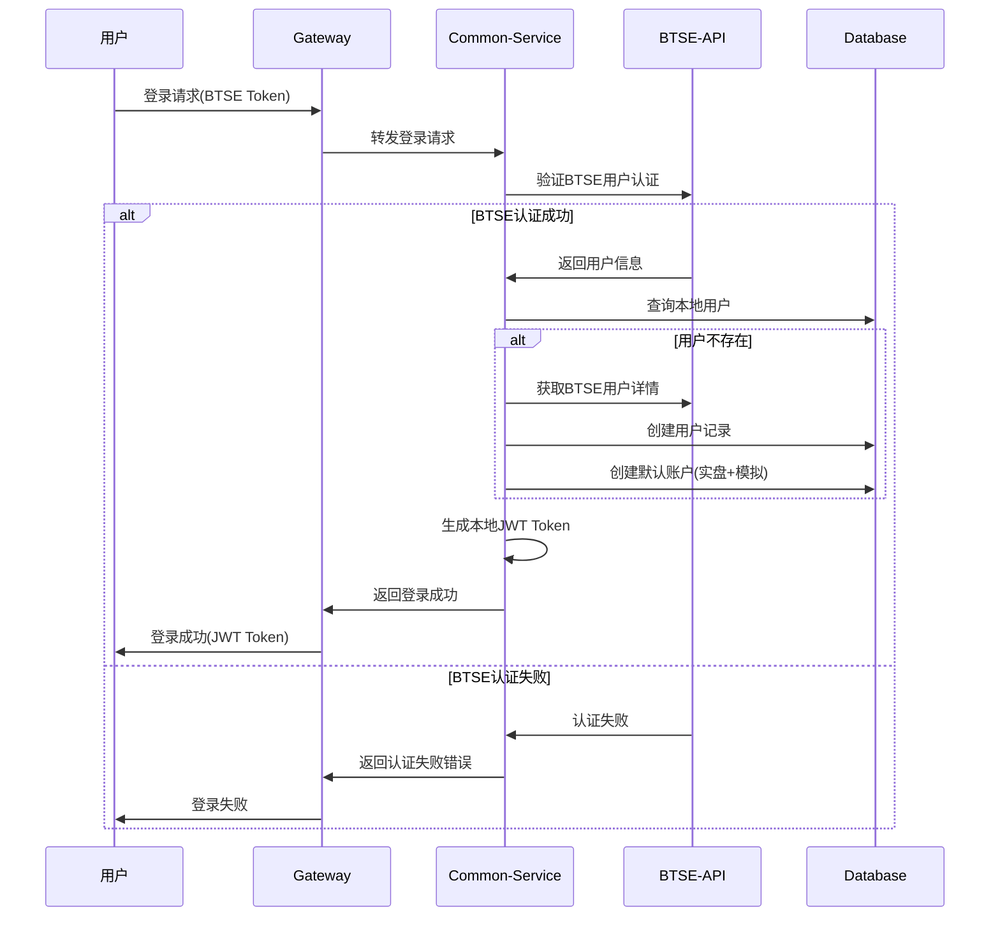
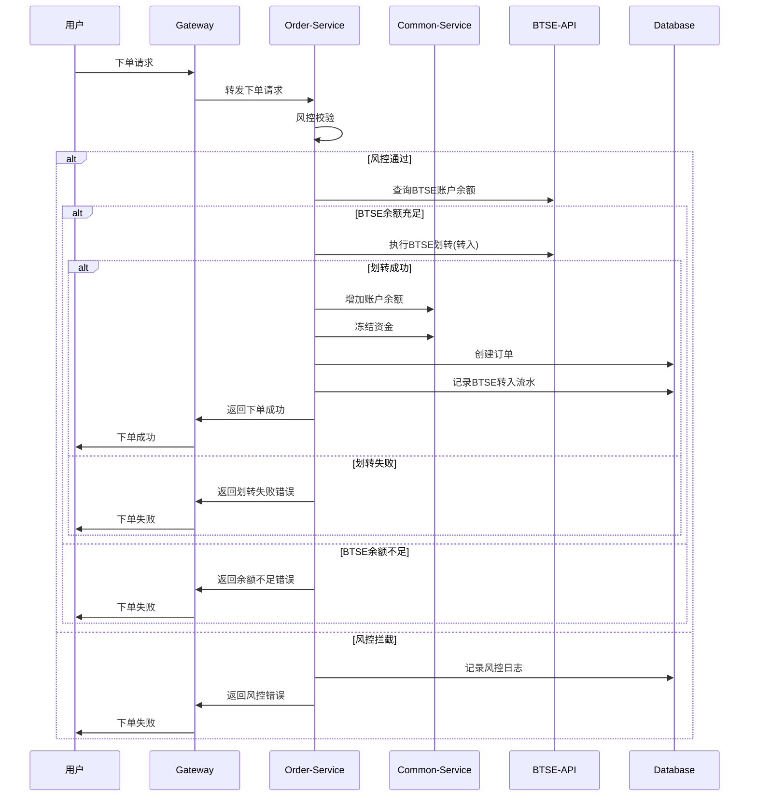
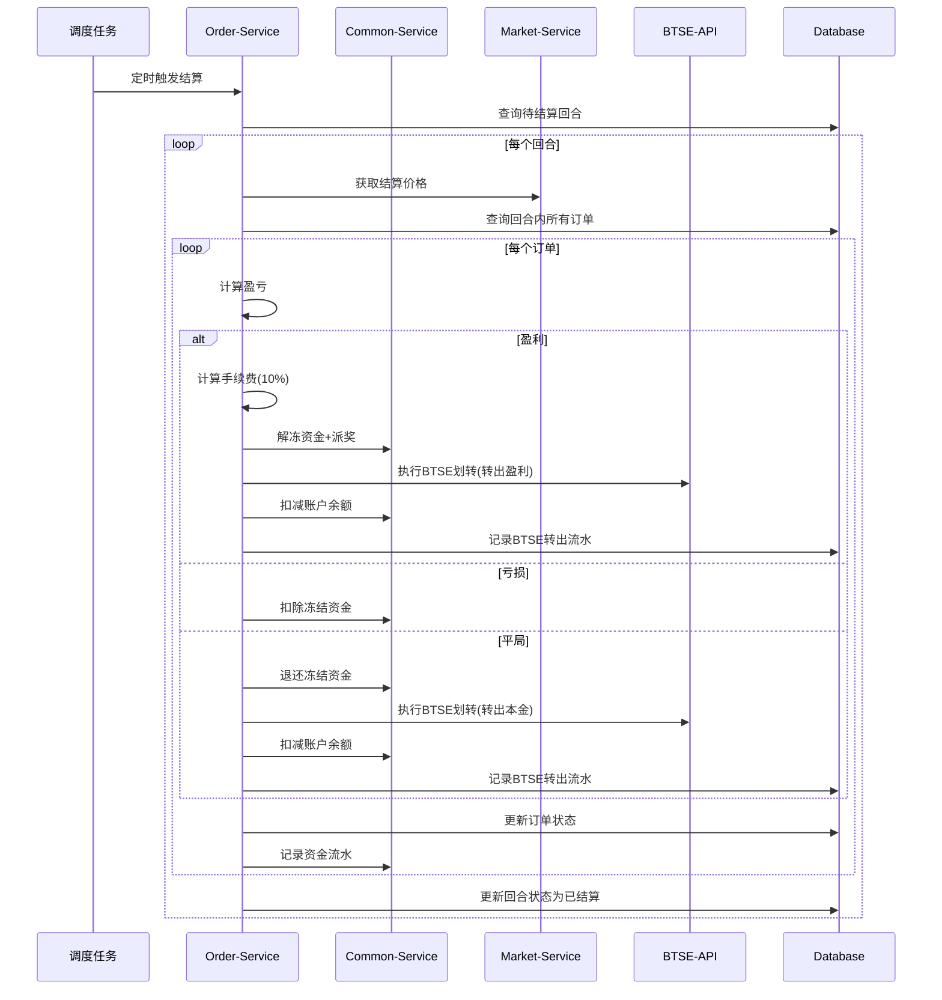

# 二元期权平台BTSE API接入方案

## 1. 版本更新概要

### v1.6版本更新（2025年7月31日）
**核心变更：BTSE直接划转相关功能**
- 下单流程优化：取消预充值步骤，下单时直接从BTSE划转资金
- 结算流程优化：盈利自动转回BTSE，减少平台资金沉淀
- 新增交易类型：`BTSE_IN`（BTSE转入）、`BTSE_OUT`（BTSE转出）

### v1.7版本更新（2025年8月04日）
**核心变更：集成BTSE认证相关功能**
- BTSE API统一管理：建立中心化的API管理体系
- 用户认证改造：登录流程集成BTSE认证
- 赔率计算优化：赔率从BTSE实时获取
- Mock解决方案：完整的开发测试Mock体系

## 2. 主要功能变更详细分析

### 2.1 BTSE API统一管理（v1.7新增）
**设计目标：**
- 统一所有BTSE API调用入口
- 支持用户认证、赔率计算、资金管理、行情数据
- 统一异常处理和监控
- 熔断降级机制

**核心组件：**
- `BtseApiClient` 接口：统一API调用接口
- `BtseApiClientImpl` 实现类：具体实现
- `BtseMockApiClient` Mock实现：开发测试环境
- 统一配置管理和异常处理

### 2.2 用户认证集成（v1.7新增）
**流程变更：**
- 用户登录必须通过BTSE认证验证
- 自动同步BTSE用户信息到本地系统
- 首次登录自动创建用户和账户
- Token刷新机制

### 2.3 BTSE直接划转（v1.6新增）
**下单流程改造：**
1. 风控校验 → 2. BTSE余额查询 → 3. 资金划转（BTSE→平台） → 4. 资金冻结 → 5. 订单创建

**结算流程改造：**
- **盈利场景**：派奖后自动转回BTSE
- **平局场景**：退还本金并转回BTSE  
- **亏损场景**：资金保留在平台

### 2.4 Mock解决方案（v1.7新增）
**设计原则：**
- 开发环境：完全使用Mock数据
- 测试环境：可配置使用Mock或真实API
- 生产环境：仅使用真实BTSE API
- 支持各种异常情况模拟

## 3. 需要修改的代码文件树形结构

```
/Users/administrator/Documents/BinaryOption/
├── option-common-service（用户账户服务）
│   ├── src/main/java/com/binaryoption/commonservice/
│   │   ├── service/
│   │   │   ├── UserService.java                    [需要修改] - 集成BTSE认证
│   │   │   ├── AccountService.java                 [需要修改] - 支持BTSE划转
│   │   │   └── BtseUserAuthService.java           [新增] - BTSE用户认证服务
│   │   ├── integration/                           [新增目录]
│   │   │   ├── BtseApiClient.java                 [新增] - BTSE API客户端接口
│   │   │   ├── BtseApiClientImpl.java             [新增] - BTSE API实现
│   │   │   ├── BtseMockApiClient.java             [新增] - Mock实现
│   │   │   └── dto/                               [新增目录] - BTSE相关DTO
│   │   │       ├── BtseAuthResponse.java          [新增]
│   │   │       ├── BtseUserInfo.java              [新增]
│   │   │       ├── BtseBalanceResponse.java       [新增]
│   │   │       └── BtseTransferRequest.java       [新增]
│   │   ├── config/
│   │   │   ├── BtseConfig.java                    [新增] - BTSE配置
│   │   │   └── BtseMockConfig.java                [新增] - Mock配置
│   │   └── domain/
│   │       └── User.java                          [可能需修改] - 添加BTSE相关字段
│   └── src/main/resources/
│       └── application.yml                        [需要修改] - 添加BTSE配置
│
├── option-order-service（订单服务）
│   ├── src/main/java/com/binaryoption/orderservice/
│   │   ├── service/
│   │   │   ├── OrderService.java                  [需要大幅修改] - 集成BTSE划转流程
│   │   │   ├── OrderSettlementService.java        [新增] - 独立的结算服务
│   │   │   └── BtseTransferService.java           [新增] - BTSE转账服务
│   │   ├── domain/
│   │   │   ├── Order.java                         [需要修改] - 添加BTSE转账ID字段
│   │   │   └── PendingReconciliation.java         [新增] - 待处理转账记录
│   │   └── mapper/
│   │       ├── OrderMapper.java                   [需要修改] - 新增查询方法
│   │       └── PendingReconciliationMapper.java   [新增]
│   └── src/main/resources/
│       └── mapper/
│           ├── OrderMapper.xml                    [需要修改]
│           └── PendingReconciliationMapper.xml    [新增]
│
├── option-market-service（行情服务）
│   ├── src/main/java/com/binaryoption/marketservice/
│   │   ├── service/
│   │   │   ├── OddsCalculationService.java        [新增] - 赔率计算服务
│   │   │   └── OddsPushService.java               [新增] - 赔率推送服务
│   │   └── integration/
│   │       └── BtseMarketDataClient.java          [新增] - BTSE行情数据客户端
│
├── option-admin-service（管理服务）
│   ├── src/main/java/com/binaryoption/adminservice/
│   │   ├── service/
│   │   │   └── SsoService.java                    [已存在] - 可能需要增强
│   │   └── controller/
│   │       └── BtseMockController.java            [新增] - Mock数据管理
│
├── option-gateway（网关服务）
│   └── src/main/resources/
│       └── application.yml                        [可能需修改] - 路由配置
│
├── option-job-executor（任务执行器）
│   ├── src/main/java/com/binaryoption/jobexecutor/
│   │   ├── handler/
│   │   │   ├── OrderSettlementHandler.java        [需要修改] - 集成BTSE转出
│   │   │   └── BtseReconciliationHandler.java     [新增] - BTSE对账任务
│   │   └── service/
│   │       └── BtseReconciliationService.java     [新增] - 补偿机制服务
│
├── option-common-dto（数据传输对象）
│   └── src/main/java/com/binaryoption/commondto/
│       ├── btse/                                  [新增目录]
│       │   ├── BtseAuthResponse.java              [新增]
│       │   ├── BtseUserInfo.java                  [新增]
│       │   ├── BtseBalanceResponse.java           [新增]
│       │   ├── BtseTransferRequest.java           [新增]
│       │   ├── BtseTransferResponse.java          [新增]
│       │   └── BtseOddsResponse.java              [新增]
│       └── admin/
│           └── BtseAdminInfoDTO.java              [已存在] - 可能需增强
│
├── option-common-utils（通用工具）
│   └── src/main/java/com/binaryoption/commonutils/
│       ├── btse/                                  [新增目录]
│       │   ├── BtseApiException.java              [新增] - BTSE API异常
│       │   └── BtseApiMonitorAspect.java          [新增] - API监控切面
│       └── annotation/
│           └── BtseApiCall.java                   [新增] - BTSE API调用注解
│
└── sql/
    ├── v1.6_upgrade.sql                           [新增] - v1.6数据库升级脚本
    ├── v1.7_upgrade.sql                           [新增] - v1.7数据库升级脚本
    └── binary_option.sql                          [需要修改] - 基础表结构
```

## 4. 数据库变更

### 4.1 v1.6版本数据库变更
```sql
-- 1. account_transaction表新增BTSE转账类型
ALTER TABLE account_transaction MODIFY COLUMN type varchar(16) 
COMMENT '交易类型(DEPOSIT:充值 WITHDRAW:提现 CANCEL:撤单 BET_WIN:投注盈利 BET_LOSE:投注亏损 BET_DRAW:投注平局 RESET:重置 BTSE_IN:BTSE转入 BTSE_OUT:BTSE转出)';

-- 2. option_order表添加BTSE转账ID字段
ALTER TABLE option_order ADD COLUMN btse_transfer_in_id varchar(64) DEFAULT NULL COMMENT 'BTSE转入流水ID';
ALTER TABLE option_order ADD COLUMN btse_transfer_out_id varchar(64) DEFAULT NULL COMMENT 'BTSE转出流水ID';

-- 3. 创建待处理转账记录表
CREATE TABLE pending_reconciliation (
    id bigint NOT NULL AUTO_INCREMENT COMMENT '主键ID',
    order_id bigint DEFAULT NULL COMMENT '关联订单ID',
    transfer_id varchar(64) DEFAULT NULL COMMENT 'BTSE转账ID',
    user_id bigint NOT NULL COMMENT '用户ID',
    external_user_id varchar(64) NOT NULL COMMENT '外部用户ID',
    amount decimal(32,16) NOT NULL COMMENT '转账金额',
    direction varchar(8) NOT NULL COMMENT '转账方向(IN/OUT)',
    status varchar(16) NOT NULL COMMENT '状态(PENDING/COMPLETED/FAILED)',
    retry_count int NOT NULL DEFAULT 0 COMMENT '重试次数',
    error_message text COMMENT '错误信息',
    last_error text COMMENT '最后错误',
    create_time datetime NOT NULL DEFAULT CURRENT_TIMESTAMP COMMENT '创建时间',
    completed_time datetime DEFAULT NULL COMMENT '完成时间',
    PRIMARY KEY (id),
    KEY idx_user_id (user_id),
    KEY idx_status (status),
    KEY idx_create_time (create_time)
) ENGINE=InnoDB DEFAULT CHARSET=utf8mb4 COLLATE=utf8mb4_unicode_ci COMMENT='待处理转账记录表';
```

### 4.2 v1.7版本数据库变更
```sql
-- 1. user表确保有external_id字段（用于BTSE用户ID）
-- 该字段已存在，无需修改

-- 2. 创建BTSE API调用日志表
CREATE TABLE btse_api_log (
    id bigint NOT NULL AUTO_INCREMENT COMMENT '主键ID',
    api_method varchar(64) NOT NULL COMMENT 'API方法名',
    request_data text COMMENT '请求数据',
    response_data text COMMENT '响应数据',
    status varchar(16) NOT NULL COMMENT '状态(SUCCESS/FAILED)',
    error_message text COMMENT '错误信息',
    duration_ms bigint NOT NULL COMMENT '耗时(毫秒)',
    create_time datetime NOT NULL DEFAULT CURRENT_TIMESTAMP COMMENT '创建时间',
    PRIMARY KEY (id),
    KEY idx_api_method (api_method),
    KEY idx_status (status),
    KEY idx_create_time (create_time)
) ENGINE=InnoDB DEFAULT CHARSET=utf8mb4 COLLATE=utf8mb4_unicode_ci COMMENT='BTSE API调用日志表';

-- 3. 创建BTSE转账日志表
CREATE TABLE btse_transfer_log (
    id bigint NOT NULL AUTO_INCREMENT COMMENT '主键ID',
    user_id varchar(64) NOT NULL COMMENT '用户ID',
    direction varchar(8) NOT NULL COMMENT '转账方向(IN/OUT)',
    amount decimal(32,16) NOT NULL COMMENT '转账金额',
    currency varchar(8) NOT NULL COMMENT '币种',
    transfer_id varchar(64) DEFAULT NULL COMMENT 'BTSE转账ID',
    status varchar(16) NOT NULL COMMENT '状态',
    error_message text COMMENT '错误信息',
    request_time datetime NOT NULL COMMENT '请求时间',
    response_time datetime DEFAULT NULL COMMENT '响应时间',
    PRIMARY KEY (id),
    KEY idx_user_id (user_id),
    KEY idx_transfer_id (transfer_id),
    KEY idx_status (status),
    KEY idx_request_time (request_time)
) ENGINE=InnoDB DEFAULT CHARSET=utf8mb4 COLLATE=utf8mb4_unicode_ci COMMENT='BTSE转账日志表';
```

## 5. 配置变更

### 5.1 application.yml新增配置
```yaml
# BTSE API配置
btse:
  api:
    base-url: https://api.btse.com
    websocket-url: wss://ws.btse.com
    auth:
      api-key: ${BTSE_API_KEY}
      api-secret: ${BTSE_API_SECRET}
    timeout:
      connect: 5000
      read: 10000
    retry:
      max-attempts: 3
      delay: 1000
    rate-limit:
      requests-per-second: 10
      burst-capacity: 20
  mock:
    enabled: ${BTSE_MOCK_ENABLED:true}  # 开发环境默认启用
    scenarios:
      auth-failure-rate: 0.05
      transfer-failure-rate: 0.02
      balance-insufficient-rate: 0.1
      api-timeout-rate: 0.01
    delays:
      min-delay: 100
      max-delay: 1000
    test-users:
      - external-id: "btse_test_001"
        balance: "10000.00"
        nickname: "测试用户001"
        email: "test001@btse.com"
      - external-id: "btse_test_002"
        balance: "5000.00"
        nickname: "测试用户002"
        email: "test002@btse.com"
```

## 6. 核心业务流程改造

### 6.1 用户登录流程（v1.7）


### 6.2 下单交易流程（v1.6）


### 6.3 自动结算流程（v1.6）


## 7. 实施计划

### 7.1 开发优先级
1. **高优先级**：BTSE API客户端基础框架、Mock实现
2. **中优先级**：用户认证改造、订单流程改造
3. **低优先级**：赔率计算优化、监控告警增强

### 7.2 阶段规划

#### 第一阶段：基础框架搭建（1-2周）
- [ ] 创建BTSE API客户端接口和实现
- [ ] 实现Mock客户端和测试数据
- [ ] 配置管理和异常处理
- [ ] 数据库表结构升级

#### 第二阶段：用户认证集成（1周）
- [ ] 修改用户登录流程
- [ ] 集成BTSE用户认证
- [ ] 自动用户创建和账户初始化
- [ ] 单元测试和集成测试

#### 第三阶段：订单流程改造（2-3周）
- [ ] 下单流程集成BTSE划转
- [ ] 结算流程集成BTSE转出
- [ ] 补偿机制和异常处理
- [ ] 完整的端到端测试

#### 第四阶段：优化和监控（1周）
- [ ] 赔率计算优化
- [ ] API监控和告警
- [ ] 性能优化
- [ ] 生产环境部署

### 7.3 风险控制
1. **数据一致性**：实现完整的事务回滚和补偿机制
2. **API限流**：避免BTSE API调用频率过高
3. **降级策略**：BTSE服务不可用时的备选方案
4. **监控告警**：关键操作失败时及时通知

### 7.4 测试策略
1. **单元测试**：各个服务模块的Mock测试
2. **集成测试**：BTSE API集成测试（使用Mock）
3. **压力测试**：高并发下的资金安全测试
4. **异常测试**：各种异常情况的恢复测试

## 8. 关键代码示例

### 8.1 BTSE API客户端接口
```java
@Component
public interface BtseApiClient {
    // 用户认证相关
    BtseAuthResponse verifyUserAuth(String externalUserId, String token);
    BtseUserInfo getUserInfo(String externalUserId);
    BtseTokenResponse refreshToken(String refreshToken);
    
    // 赔率计算相关
    BtseOddsResponse getCurrentOdds(String symbol, Integer duration);
    List<BtseOddsHistory> getOddsHistory(String symbol, LocalDateTime start, LocalDateTime end);
    
    // 资金管理相关
    BtseBalanceResponse getBalance(String userId, String currency);
    BtseTransferResponse transfer(BtseTransferRequest request);
    BtseTransferStatus getTransferStatus(String transferId);
    
    // 行情数据相关
    void subscribeMarketData(String symbol, MarketDataCallback callback);
    List<BtseKlineData> getKlineData(String symbol, String interval, Integer limit);
}
```

### 8.2 Mock API客户端实现
```java
@Component
@Profile({"dev", "test"})
@ConditionalOnProperty(name = "btse.mock.enabled", havingValue = "true")
@Slf4j
public class BtseMockApiClient implements BtseApiClient {
    
    @Autowired
    private BtseMockDataService mockDataService;
    
    @Override
    public BtseAuthResponse verifyUserAuth(String externalUserId, String token) {
        // 模拟认证验证
        if (mockDataService.shouldSimulateAuthFailure()) {
            throw new BtseApiException("Authentication failed");
        }
        
        return BtseAuthResponse.builder()
            .success(true)
            .externalUserId(externalUserId)
            .nickname("Mock User " + externalUserId)
            .email(externalUserId + "@btse.com")
            .build();
    }
    
    // 其他方法实现...
}
```

## 9. 下单和结算详细数据库操作

### 9.1 下单流程数据库操作详解（v1.6改造）

#### 9.1.0 资金流转逻辑说明
v1.6版本采用"即时转入即时冻结"的策略：

**传统模式（v1.5）**：
1. 用户预先充值到平台账户 → `balance` 增加
2. 下单时从 `balance` 转移到 `frozen_balance`
3. 结算后处理 `frozen_balance`

**新模式（v1.6优化版）**：
1. 下单时直接从BTSE转入资金到平台
2. 转入的资金**直接进入** `frozen_balance`（完全绕过 `balance`）
3. 结算时**直接从** `frozen_balance` 转回BTSE（完全绕过 `balance`）

**账户字段含义**：
- `balance`：可用余额（**在v1.6模式下基本不使用，始终为0或初始值**）
- `frozen_balance`：交易中资金（这是实际的资金流转字段）
- `total_deposit`：累计充值统计（包括所有BTSE转入）
- `total_withdraw`：累计提现统计（包括所有BTSE转出）
- `total_profit`：累计净盈利统计
- `total_loss`：累计亏损统计

**完全绕过balance的资金流转**：
- 初始状态：`balance=0, frozen_balance=0`
- 下单100 USDT：`balance=0, frozen_balance=100` （BTSE直接冻结）
- 盈利结算181 USDT：`balance=0, frozen_balance=0` （直接从冻结转回BTSE）
- 亏损结算：`balance=0, frozen_balance=0` （冻结资金归平台）
- 平局结算100 USDT：`balance=0, frozen_balance=0` （直接从冻结转回BTSE）

**优势**：
- ✅ **简化流程**：减少资金在账户内部的流转步骤
- ✅ **提高安全**：减少操作环节，降低出错概率  
- ✅ **清晰追踪**：资金要么在BTSE，要么在平台交易中，状态明确
- ✅ **高效处理**：避免balance和frozen_balance之间的转换

#### 9.1.1 下单成功完整数据库操作序列
```sql
-- 操作序列：风控校验 → BTSE划转 → 账户操作 → 订单创建 → 流水记录

-- 步骤1：BTSE转入成功后，直接增加冻结余额（因为资金将立即用于下注）
UPDATE account SET 
    frozen_balance = frozen_balance + 100.0000000000000000,  -- 直接冻结转入的资金
    total_deposit = total_deposit + 100.0000000000000000,    -- 累计充值统计
    update_time = NOW()
WHERE id = 1 AND user_id = 123;

-- 注意：这里不增加balance，因为资金转入后立即冻结用于下注
-- 账户状态：balance不变，frozen_balance +100

-- 步骤2：记录BTSE转入流水
INSERT INTO account_transaction (
    user_id, account_id, type, amount, 
    balance_before, balance_after, 
    ref_id, ref_type, remark, create_time
) VALUES (
    123, 1, 'BTSE_IN', 100.0000000000000000,
    0.0000000000000000, 0.0000000000000000,  -- 可用余额前后都是0（直接冻结）
    NULL, 'ORDER', 'BTSE自动转入下单资金(直接冻结)', NOW()
);

-- 步骤3：创建订单记录
INSERT INTO option_order (
    user_id, account_type, symbol_id, round_id, round_no,
    direction, amount, odds, expected_profit, order_price,
    status, btse_transfer_in_id, create_time, update_time
) VALUES (
    123, 'REAL', 1, 456, 'BTC_5M_20250804_1030',
    'UP', 100.0000000000000000, 1.9000, 90.0000000000000000, 45000.12345678,
    'PENDING', 'btse_transfer_20250804_001', NOW(), NOW()
);

-- 步骤4：记录资金冻结流水（实际上在步骤1已经冻结，这里只是记录）
INSERT INTO account_transaction (
    user_id, account_id, type, amount, 
    balance_before, balance_after, 
    ref_id, ref_type, remark, create_time
) VALUES (
    123, 1, 'FREEZE', 100.0000000000000000,
    0.0000000000000000, 0.0000000000000000,  -- 可用余额始终为0
    LAST_INSERT_ID(), 'ORDER', '下单资金冻结记录', NOW()
);

-- 步骤5：更新回合统计
UPDATE trading_round SET 
    total_up_amount = CASE WHEN 'UP' = 'UP' THEN total_up_amount + 100.0000000000000000 ELSE total_up_amount END,
    total_down_amount = CASE WHEN 'UP' = 'DOWN' THEN total_down_amount + 100.0000000000000000 ELSE total_down_amount END,
    update_time = NOW()
WHERE id = 456;

-- 步骤6：记录BTSE转账日志
INSERT INTO btse_transfer_log (
    user_id, direction, amount, currency, transfer_id, 
    status, request_time, response_time
) VALUES (
    'btse_user_123', 'IN', 100.0000000000000000, 'USDT', 'btse_transfer_20250804_001',
    'SUCCESS', NOW(), NOW()
);
```

#### 9.1.2 下单失败回滚操作
```sql
-- 当BTSE划转失败时，需要回滚已执行的操作
-- 由于采用先划转后创建订单的策略，通常无需回滚
-- 但如果在创建订单过程中出现异常，需要以下回滚操作：

-- 回滚1：取消资金冻结
UPDATE account SET 
    frozen_balance = frozen_balance - 100.0000000000000000,
    update_time = NOW()
WHERE id = 1 AND user_id = 123;

-- 回滚2：执行BTSE转出（返还资金）
-- 调用BTSE API执行转出操作，并记录转出流水

-- 回滚3：记录异常处理流水
INSERT INTO account_transaction (
    user_id, account_id, type, amount, 
    balance_before, balance_after, 
    ref_id, ref_type, remark, create_time
) VALUES (
    123, 1, 'BTSE_OUT', -100.0000000000000000,
    100.0000000000000000, 0.0000000000000000,
    NULL, 'ROLLBACK', '下单失败退还资金到BTSE', NOW()
);
```

### 9.2 结算流程数据库操作详解（v1.6改造）

#### 9.2.1 盈利结算数据库操作序列（优化版：完全绕过balance）
```sql
-- 假设订单：投注100 USDT，赔率1.9，预期收益90 USDT，手续费9 USDT(10%)
-- 优化逻辑：冻结资金直接转出到BTSE，不经过balance

-- 步骤1：更新订单状态为盈利
UPDATE option_order SET 
    status = 'WIN',
    profit = 90.0000000000000000,       -- 实际盈利（扣除手续费前）
    fee = 9.0000000000000000,           -- 10%手续费
    settle_price = 45100.56789012,      -- 结算价格
    settle_time = NOW(),
    update_time = NOW()
WHERE id = 789;

-- 步骤2：直接处理冻结资金（不经过balance）
UPDATE account SET 
    frozen_balance = frozen_balance - 100.0000000000000000,  -- 解冻本金
    total_profit = total_profit + 81.0000000000000000,       -- 累计净盈利(90-9)
    total_withdraw = total_withdraw + 181.0000000000000000,   -- 累计提现（直接转出）
    update_time = NOW()
WHERE id = 1 AND user_id = 123;
-- 注意：balance始终不变，保持原值

-- 步骤3：记录盈利结算流水
INSERT INTO account_transaction (
    user_id, account_id, type, amount, 
    balance_before, balance_after, 
    ref_id, ref_type, remark, create_time
) VALUES (
    123, 1, 'BET_WIN', 181.0000000000000000,
    0.0000000000000000, 0.0000000000000000,  -- balance始终不变
    789, 'ORDER', '投注盈利直接转出BTSE(本金100+盈利90-手续费9=181)', NOW()
);

-- 步骤4：BTSE转出盈利资金
-- 调用BTSE API，将181 USDT转出到用户BTSE账户

-- 步骤5：记录BTSE转出流水
INSERT INTO account_transaction (
    user_id, account_id, type, amount, 
    balance_before, balance_after, 
    ref_id, ref_type, remark, create_time
) VALUES (
    123, 1, 'BTSE_OUT', -181.0000000000000000,
    0.0000000000000000, 0.0000000000000000,  -- balance始终为0
    789, 'ORDER', 'BTSE自动转出盈利资金', NOW()
);

-- 步骤6：更新订单BTSE转出ID
UPDATE option_order SET 
    btse_transfer_out_id = 'btse_transfer_out_20250804_001',
    update_time = NOW()
WHERE id = 789;

-- 步骤7：记录BTSE转账日志
INSERT INTO btse_transfer_log (
    user_id, direction, amount, currency, transfer_id, 
    status, request_time, response_time
) VALUES (
    'btse_user_123', 'OUT', 181.0000000000000000, 'USDT', 'btse_transfer_out_20250804_001',
    'SUCCESS', NOW(), NOW()
);
```

#### 9.2.2 亏损结算数据库操作序列
```sql
-- 步骤1：更新订单状态为亏损
UPDATE option_order SET 
    status = 'LOSE',
    profit = -100.0000000000000000,    -- 亏损本金
    fee = 0.0000000000000000,          -- 亏损不收手续费
    settle_price = 44900.98765432,     -- 结算价格
    settle_time = NOW(),
    update_time = NOW()
WHERE id = 789;

-- 步骤2：扣除冻结资金（资金归平台所有）
UPDATE account SET 
    frozen_balance = frozen_balance - 100.0000000000000000,  -- 扣除冻结资金
    total_loss = total_loss + 100.0000000000000000,          -- 累计亏损
    update_time = NOW()
WHERE id = 1 AND user_id = 123;

-- 步骤3：记录亏损流水
INSERT INTO account_transaction (
    user_id, account_id, type, amount, 
    balance_before, balance_after, 
    ref_id, ref_type, remark, create_time
) VALUES (
    123, 1, 'BET_LOSE', -100.0000000000000000,
    100.0000000000000000, 100.0000000000000000,  -- 可用余额不变
    789, 'ORDER', '投注亏损', NOW()
);

-- 注意：亏损情况下不执行BTSE转出，资金保留在平台
```

#### 9.2.3 平局结算数据库操作序列（优化版：完全绕过balance）
```sql
-- 步骤1：更新订单状态为平局
UPDATE option_order SET 
    status = 'DRAW',
    profit = 0.0000000000000000,       -- 无盈亏
    fee = 0.0000000000000000,          -- 平局不收手续费
    settle_price = 45000.12345678,     -- 结算价格（与下单价相同）
    settle_time = NOW(),
    update_time = NOW()
WHERE id = 789;

-- 步骤2：直接处理冻结资金（不经过balance）
UPDATE account SET 
    frozen_balance = frozen_balance - 100.0000000000000000,  -- 解冻本金
    total_withdraw = total_withdraw + 100.0000000000000000,   -- 累计提现（直接转出）
    update_time = NOW()
WHERE id = 1 AND user_id = 123;
-- 注意：balance始终不变，profit和loss也不变

-- 步骤3：记录平局退还流水
INSERT INTO account_transaction (
    user_id, account_id, type, amount, 
    balance_before, balance_after, 
    ref_id, ref_type, remark, create_time
) VALUES (
    123, 1, 'BET_DRAW', 100.0000000000000000,
    0.0000000000000000, 0.0000000000000000,  -- balance始终不变
    789, 'ORDER', '投注平局直接转出BTSE退还本金', NOW()
);

-- 步骤4：BTSE转出本金
-- 调用BTSE API，将100 USDT转出到用户BTSE账户

-- 步骤5：记录BTSE转出流水
INSERT INTO account_transaction (
    user_id, account_id, type, amount, 
    balance_before, balance_after, 
    ref_id, ref_type, remark, create_time
) VALUES (
    123, 1, 'BTSE_OUT', -100.0000000000000000,
    0.0000000000000000, 0.0000000000000000,  -- balance始终为0
    789, 'ORDER', 'BTSE自动转出平局退还资金', NOW()
);

-- 步骤6：更新订单BTSE转出ID
UPDATE option_order SET 
    btse_transfer_out_id = 'btse_transfer_out_20250804_002',
    update_time = NOW()
WHERE id = 789;

-- 步骤7：记录BTSE转账日志
INSERT INTO btse_transfer_log (
    user_id, direction, amount, currency, transfer_id, 
    status, request_time, response_time
) VALUES (
    'btse_user_123', 'OUT', 100.0000000000000000, 'USDT', 'btse_transfer_out_20250804_002',
    'SUCCESS', NOW(), NOW()
);
```

### 9.3 异常处理和补偿机制

#### 9.3.1 BTSE转出失败的处理
```sql
-- 当结算时BTSE转出失败，创建待处理记录
INSERT INTO pending_reconciliation (
    order_id, user_id, external_user_id, amount, 
    direction, status, retry_count, error_message, create_time
) VALUES (
    789, 123, 'btse_user_123', 181.0000000000000000,
    'OUT', 'PENDING', 0, 'BTSE API timeout', NOW()
);

-- 同时记录转账失败日志
INSERT INTO btse_transfer_log (
    user_id, direction, amount, currency, transfer_id, 
    status, error_message, request_time, response_time
) VALUES (
    'btse_user_123', 'OUT', 181.0000000000000000, 'USDT', NULL,
    'FAILED', 'Connection timeout after 5000ms', NOW(), NOW()
);
```

#### 9.3.2 补偿机制定时任务查询
```sql
-- 查询待处理的转账记录
SELECT pr.*, o.amount as order_amount, u.external_id
FROM pending_reconciliation pr
LEFT JOIN option_order o ON pr.order_id = o.id  
LEFT JOIN user u ON pr.user_id = u.id
WHERE pr.status = 'PENDING' 
  AND pr.retry_count < 3
  AND pr.create_time > DATE_SUB(NOW(), INTERVAL 24 HOUR)
ORDER BY pr.create_time ASC
LIMIT 100;

-- 重试成功后更新状态
UPDATE pending_reconciliation SET 
    status = 'COMPLETED',
    completed_time = NOW(),
    retry_count = retry_count + 1
WHERE id = ?;
```

### 9.4 数据一致性检查SQL

#### 9.4.1 账户余额一致性检查
```sql
-- 检查账户余额与交易流水是否一致
SELECT 
    a.id as account_id,
    a.user_id,
    a.balance as current_balance,
    a.frozen_balance as current_frozen,
    COALESCE(SUM(CASE WHEN at.type IN ('DEPOSIT', 'BET_WIN', 'BTSE_IN') THEN at.amount ELSE 0 END), 0) as total_in,
    COALESCE(SUM(CASE WHEN at.type IN ('WITHDRAW', 'BET_LOSE', 'BTSE_OUT') THEN ABS(at.amount) ELSE 0 END), 0) as total_out,
    (a.balance + a.frozen_balance) as total_balance,
    (COALESCE(SUM(CASE WHEN at.type IN ('DEPOSIT', 'BET_WIN', 'BTSE_IN') THEN at.amount ELSE 0 END), 0) - 
     COALESCE(SUM(CASE WHEN at.type IN ('WITHDRAW', 'BET_LOSE', 'BTSE_OUT') THEN ABS(at.amount) ELSE 0 END), 0)) as calculated_balance
FROM account a
LEFT JOIN account_transaction at ON a.id = at.account_id
WHERE a.account_type = 'REAL'
GROUP BY a.id
HAVING ABS(total_balance - calculated_balance) > 0.0000000000000001;  -- 允许极小的精度误差
```

#### 9.4.2 订单与流水匹配检查
```sql
-- 检查订单是否都有对应的资金流水
SELECT 
    o.id as order_id,
    o.user_id,
    o.amount,
    o.status,
    o.btse_transfer_in_id,
    o.btse_transfer_out_id,
    COUNT(at_in.id) as transfer_in_count,
    COUNT(at_out.id) as transfer_out_count
FROM option_order o
LEFT JOIN account_transaction at_in ON o.id = at_in.ref_id AND at_in.ref_type = 'ORDER' AND at_in.type = 'BTSE_IN'
LEFT JOIN account_transaction at_out ON o.id = at_out.ref_id AND at_out.ref_type = 'ORDER' AND at_out.type = 'BTSE_OUT'
WHERE o.create_time >= DATE_SUB(NOW(), INTERVAL 1 DAY)
GROUP BY o.id
HAVING (transfer_in_count = 0)  -- 没有转入流水
    OR (o.status IN ('WIN', 'DRAW') AND transfer_out_count = 0);  -- 应该转出但没有转出流水
```

## 10. 监控和告警

### 10.1 关键指标
- BTSE API调用成功率
- 资金划转成功率
- 用户认证成功率
- API响应时间
- 异常重试次数

### 10.2 告警规则
- BTSE API调用失败率 > 5%
- 资金划转失败率 > 1%
- API响应时间 > 5秒
- 待处理转账记录 > 100条

---
**文档版本**: v1.0  
**创建日期**: 2025年8月04日  
**维护者**: Barry  
**相关文档**: [详细设计概述](./207_01_详细设计概述.md), [技术实现_BTSE](./207_07_技术实现_BTSE.md)