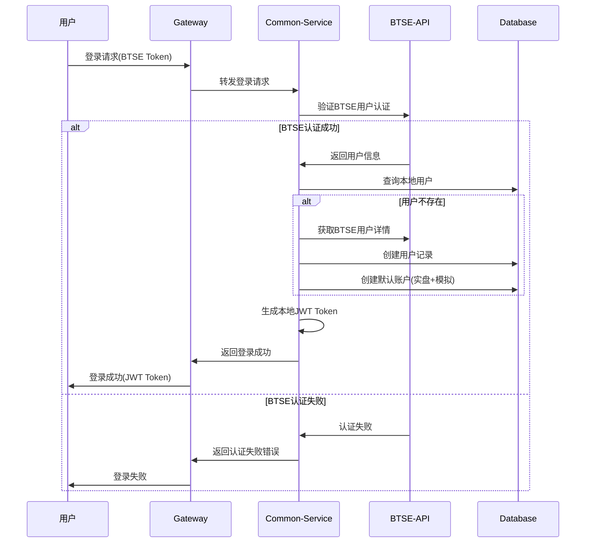
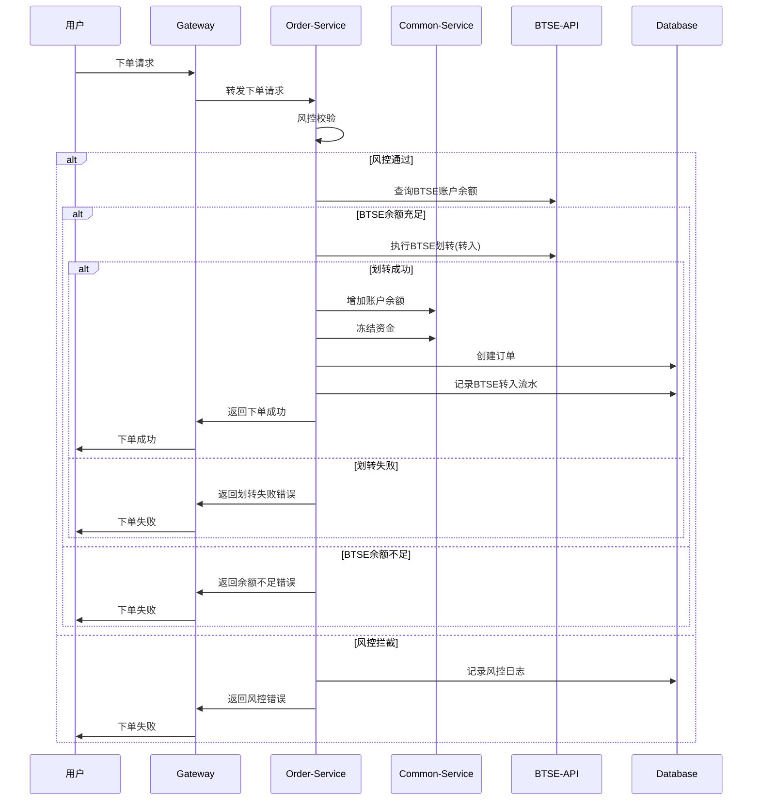
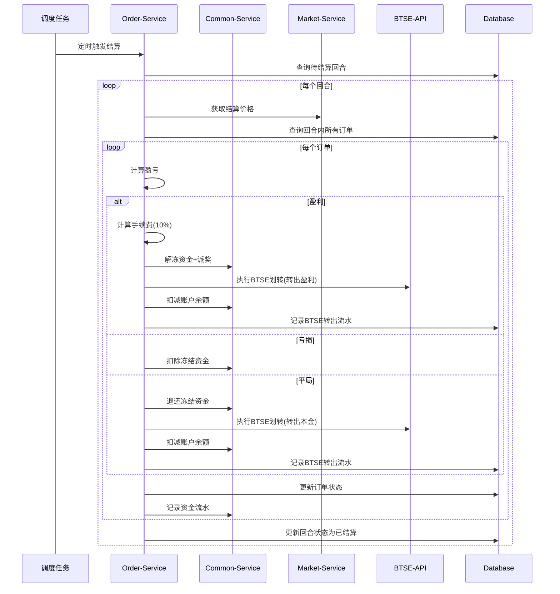
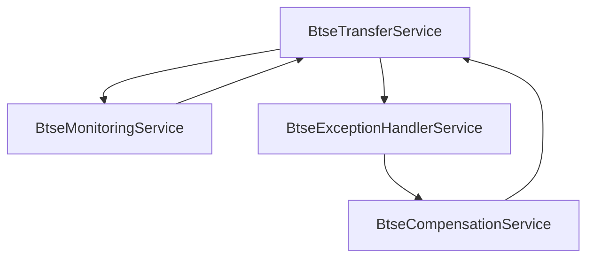

# 二元期权平台BTSE API接入方案

## 1. 版本更新概要

### v1.6版本更新（2025年7月31日）
**核心变更：BTSE直接划转相关功能**
- 下单流程优化：取消预充值步骤，下单时直接从BTSE划转资金
- 结算流程优化：盈利自动转回BTSE，减少平台资金沉淀
- 新增交易类型：`BTSE_IN`（BTSE转入）、`BTSE_OUT`（BTSE转出）

### v1.7版本更新（2025年8月04日）
**核心变更：集成BTSE认证相关功能**
- BTSE API统一管理：建立中心化的API管理体系
- 用户认证改造：登录流程集成BTSE认证
- 赔率计算优化：赔率从BTSE实时获取
- Mock解决方案：完整的开发测试Mock体系

### v1.8版本更新（2025年8月04日）
**核心变更：编译错误修复和实现细节优化**
- AspectJ依赖配置：添加AOP监控支持
- BusinessException构造器：统一错误码处理
- 字段访问模式：使用 `Boolean.TRUE.equals(getSuccess())` 替代 `isSuccess()` 方法
- API响应字段：统一使用 `responseTimestamp` 字段
- Result.error()调用：修正参数匹配问题

### v1.9版本更新（2025年8月04日）
**核心变更：启动错误修复**
- MyBatis映射冲突：解决 `UserMapper.findAll` 重复定义问题
- Spring循环依赖：使用 `@Lazy` 注解打破复杂循环依赖链
- 依赖注入优化：手动构造函数替代 `@RequiredArgsConstructor`

### v1.10版本更新（2025年8月04日）
**核心变更：事件驱动架构重构**
- 架构升级：从同步调用改为事件驱动模式，彻底解决循环依赖问题
- 事件定义：创建 `BtseOperationEvent`、`BtseExceptionEvent`、`BtseTransferEvent` 事件类
- 服务解耦：各BTSE服务间通过事件通信，移除所有 `@Lazy` 注解
- 异步处理：支持异步事件处理，提升系统性能和可扩展性

### v1.11版本更新（2025年8月06日）
**核心变更：BTSE转账日志记录和结算逻辑优化**
- BTSE转账日志：实现完整的btse_transfer_log表记录功能，使用MyBatis Mapper模式
- 结算专用转账：新增transferToBtseForSettlement方法，专门处理订单结算时的BTSE转账
- 数据库操作优化：使用BtseTransferLogMapper替代JdbcTemplate，统一数据访问模式
- 资金流向修复：修正REAL账户结算时btse_transfer_log记录缺失的问题
- 测试覆盖完善：更新测试脚本支持完整的订单结算和日志验证流程

## 2. 主要功能变更详细分析

### 2.1 BTSE API统一管理（v1.7新增）
**设计目标：**
- 统一所有BTSE API调用入口
- 支持用户认证、赔率计算、资金管理、行情数据
- 统一异常处理和监控
- 熔断降级机制

**核心组件：**
- `BtseApiClient` 接口：统一API调用接口
- `BtseApiClientImpl` 实现类：具体实现
- `BtseMockApiClient` Mock实现：开发测试环境
- 统一配置管理和异常处理

### 2.2 用户认证集成（v1.7新增）
**流程变更：**
- 用户登录必须通过BTSE认证验证
- 自动同步BTSE用户信息到本地系统
- 首次登录自动创建用户和账户
- Token刷新机制

### 2.3 BTSE直接划转（v1.6新增）
**下单流程改造：**
1. 风控校验 → 2. BTSE余额查询 → 3. 资金划转（BTSE→平台） → 4. 资金冻结 → 5. 订单创建

**结算流程改造：**
- **盈利场景**：派奖后自动转回BTSE
- **平局场景**：退还本金并转回BTSE  
- **亏损场景**：资金保留在平台

### 2.4 Mock解决方案（v1.7新增）
**设计原则：**
- 开发环境：完全使用Mock数据
- 测试环境：可配置使用Mock或真实API
- 生产环境：仅使用真实BTSE API
- 支持各种异常情况模拟

## 3. 需要修改的代码文件树形结构

```
/Users/administrator/Documents/BinaryOption/
├── option-common-service（用户账户服务）
│   ├── src/main/java/com/binaryoption/commonservice/
│   │   ├── service/
│   │   │   ├── UserService.java                    [需要修改] - 集成BTSE认证
│   │   │   ├── AccountService.java                 [需要修改] - 支持BTSE划转
│   │   │   └── BtseUserAuthService.java           [新增] - BTSE用户认证服务
│   │   ├── integration/                           [新增目录]
│   │   │   ├── BtseApiClient.java                 [新增] - BTSE API客户端接口
│   │   │   ├── BtseApiClientImpl.java             [新增] - BTSE API实现
│   │   │   ├── BtseMockApiClient.java             [新增] - Mock实现
│   │   │   ├── BtseConfig.java                    [新增] - BTSE配置
│   │   │   └── BtseDataConverter.java             [新增] - BTSE数据转换器
│   │   ├── config/
│   │   │   └── BtseIntegrationConfig.java         [新增] - BTSE集成配置
│   │   ├── controller/
│   │   │   └── BtseAuthController.java            [新增] - BTSE认证控制器
│   │   └── domain/
│   │       └── User.java                          [可能需修改] - 添加BTSE相关字段
│   └── src/main/resources/
│       ├── application.yml                        [需要修改] - 添加BTSE配置
│       └── btse-field-mapping.yml                 [新增] - BTSE字段映射配置
│
├── option-order-service（订单服务）
│   ├── src/main/java/com/binaryoption/orderservice/
│   │   ├── service/
│   │   │   ├── OrderService.java                  [需要大幅修改] - 集成BTSE划转流程
│   │   │   ├── OrderSettlementService.java        [新增] - 独立的结算服务
│   │   │   └── BtseTransferService.java           [新增] - BTSE转账服务
│   │   ├── domain/
│   │   │   ├── Order.java                         [需要修改] - 添加BTSE转账ID字段
│   │   │   └── PendingReconciliation.java         [新增] - 待处理转账记录
│   │   └── mapper/
│   │       ├── OrderMapper.java                   [需要修改] - 新增查询方法
│   │       └── PendingReconciliationMapper.java   [新增]
│   └── src/main/resources/
│       └── mapper/
│           ├── OrderMapper.xml                    [需要修改]
│           └── PendingReconciliationMapper.xml    [新增]
│
├── option-market-service（行情服务）
│   ├── src/main/java/com/binaryoption/marketservice/
│   │   ├── service/
│   │   │   ├── OddsCalculationService.java        [新增] - 赔率计算服务
│   │   │   └── OddsPushService.java               [新增] - 赔率推送服务
│   │   └── integration/
│   │       └── BtseMarketDataClient.java          [新增] - BTSE行情数据客户端
│
├── option-admin-service（管理服务）
│   ├── src/main/java/com/binaryoption/adminservice/
│   │   ├── service/
│   │   │   └── SsoService.java                    [已存在] - 可能需要增强
│   │   └── controller/
│   │       └── BtseMockController.java            [新增] - Mock数据管理
│
├── option-gateway（网关服务）
│   └── src/main/resources/
│       └── application.yml                        [可能需修改] - 路由配置
│
├── option-job-executor（任务执行器）
│   ├── src/main/java/com/binaryoption/jobexecutor/
│   │   ├── handler/
│   │   │   ├── OrderSettlementHandler.java        [需要修改] - 集成BTSE转出
│   │   │   └── BtseReconciliationHandler.java     [新增] - BTSE对账任务
│   │   └── service/
│   │       └── BtseReconciliationService.java     [新增] - 补偿机制服务
│
├── option-common-dto（数据传输对象）
│   └── src/main/java/com/binaryoption/commondto/
│       ├── btse/                                  [新增目录] - 所有BTSE相关DTO
│       │   ├── 业务DTO（内部使用，字段名规范化）
│       │   │   ├── BtseAuthResponse.java          [新增] - 认证响应
│       │   │   ├── BtseUserInfo.java              [新增] - 用户信息
│       │   │   ├── BtseTokenResponse.java         [新增] - Token响应
│       │   │   ├── BtseBalanceResponse.java       [新增] - 余额响应
│       │   │   ├── BtseTransferRequest.java       [新增] - 转账请求
│       │   │   ├── BtseTransferResponse.java      [新增] - 转账响应
│       │   │   ├── BtseTransferStatus.java        [新增] - 转账状态
│       │   │   ├── BtseOddsResponse.java          [新增] - 赔率响应
│       │   │   ├── BtseOddsHistory.java           [新增] - 赔率历史
│       │   │   ├── BtseKlineData.java             [新增] - K线数据
│       │   │   └── MarketDataCallback.java        [新增] - 市场数据回调接口
│       │   └── 原始数据DTO（BTSE API原始格式，使用Jackson注解）
│       │       ├── BtseApiResponse.java           [新增] - BTSE API响应包装
│       │       ├── BtseRawAuthData.java           [新增] - BTSE原始认证数据
│       │       ├── BtseRawUserData.java           [新增] - BTSE原始用户数据
│       │       ├── BtseRawBalanceData.java         [新增] - BTSE原始余额数据
│       │       └── BtseRawTransferData.java        [新增] - BTSE原始转账数据
│       └── admin/
│           └── BtseAdminInfoDTO.java              [已存在] - 可能需增强
│
├── option-common-utils（通用工具）
│   └── src/main/java/com/binaryoption/commonutils/
│       ├── btse/                                  [新增目录]
│       │   ├── BtseApiException.java              [新增] - BTSE API异常
│       │   └── BtseApiMonitorAspect.java          [新增] - API监控切面
│       └── annotation/
│           └── BtseApiCall.java                   [新增] - BTSE API调用注解
│
└── sql/
    ├── v1.6_upgrade.sql                           [新增] - v1.6数据库升级脚本
    ├── v1.7_upgrade.sql                           [新增] - v1.7数据库升级脚本
    └── binary_option.sql                          [需要修改] - 基础表结构
```

### 📋 **重要架构说明**

**DTO统一管理策略**：
- ✅ **所有BTSE相关DTO都统一放在 `option-common-dto/btse/` 目录中**
- ✅ 这样设计避免了模块间的循环依赖，符合微服务架构最佳实践
- ✅ 其他服务模块（如order-service、market-service）可以安全引用这些DTO
- ✅ 便于统一管理版本控制和数据结构变更

**BTSE API字段映射架构**：
- 🎯 **解耦设计**：通过转换器模式解耦BTSE API字段与内部业务字段
- 🔄 **单点维护**：当BTSE API字段变更时，只需修改转换器或配置文件
- 📋 **配置化映射**：支持通过YAML配置文件管理字段映射关系
- 🛡️ **类型安全转换**：统一处理时间戳、状态值、数据类型转换
- 📊 **版本兼容**：轻松支持BTSE API版本升级和字段变更

**已实现的核心功能**：
- 🔐 **BTSE用户认证集成**：自动用户创建、Token管理、登录状态同步
- 🏗️ **统一API客户端框架**：Real/Mock双实现，完整的配置和监控
- 📊 **完整的DTO体系**：11个DTO类覆盖认证、转账、赔率、市场数据等所有场景
- ⚙️ **配置驱动**：环境切换、Mock场景配置、错误模拟等
- 🔗 **智能转换器**：BTSE原始数据与内部DTO的智能映射转换

## 4. 数据库变更

### 4.1 v1.6版本数据库变更
```sql
-- 1. account_transaction表新增BTSE转账类型
ALTER TABLE account_transaction MODIFY COLUMN type varchar(16) 
COMMENT '交易类型(DEPOSIT:充值 WITHDRAW:提现 CANCEL:撤单 BET_WIN:投注盈利 BET_LOSE:投注亏损 BET_DRAW:投注平局 RESET:重置 BTSE_IN:BTSE转入 BTSE_OUT:BTSE转出)';

-- 2. option_order表添加BTSE转账ID字段
ALTER TABLE option_order ADD COLUMN btse_transfer_in_id varchar(64) DEFAULT NULL COMMENT 'BTSE转入流水ID';
ALTER TABLE option_order ADD COLUMN btse_transfer_out_id varchar(64) DEFAULT NULL COMMENT 'BTSE转出流水ID';

-- 3. 创建待处理转账记录表
CREATE TABLE pending_reconciliation (
    id bigint NOT NULL AUTO_INCREMENT COMMENT '主键ID',
    order_id bigint DEFAULT NULL COMMENT '关联订单ID',
    transfer_id varchar(64) DEFAULT NULL COMMENT 'BTSE转账ID',
    user_id bigint NOT NULL COMMENT '用户ID',
    external_user_id varchar(64) NOT NULL COMMENT '外部用户ID',
    amount decimal(32,16) NOT NULL COMMENT '转账金额',
    direction varchar(8) NOT NULL COMMENT '转账方向(IN/OUT)',
    status varchar(16) NOT NULL COMMENT '状态(PENDING/COMPLETED/FAILED)',
    retry_count int NOT NULL DEFAULT 0 COMMENT '重试次数',
    error_message text COMMENT '错误信息',
    last_error text COMMENT '最后错误',
    create_time datetime NOT NULL DEFAULT CURRENT_TIMESTAMP COMMENT '创建时间',
    completed_time datetime DEFAULT NULL COMMENT '完成时间',
    PRIMARY KEY (id),
    KEY idx_user_id (user_id),
    KEY idx_status (status),
    KEY idx_create_time (create_time)
) ENGINE=InnoDB DEFAULT CHARSET=utf8mb4 COLLATE=utf8mb4_unicode_ci COMMENT='待处理转账记录表';
```

### 4.2 v1.7版本数据库变更
```sql
-- 1. user表确保有external_id字段（用于BTSE用户ID）
-- 该字段已存在，无需修改

-- 2. 创建BTSE API调用日志表
CREATE TABLE btse_api_log (
    id bigint NOT NULL AUTO_INCREMENT COMMENT '主键ID',
    api_method varchar(64) NOT NULL COMMENT 'API方法名',
    request_data text COMMENT '请求数据',
    response_data text COMMENT '响应数据',
    status varchar(16) NOT NULL COMMENT '状态(SUCCESS/FAILED)',
    error_message text COMMENT '错误信息',
    duration_ms bigint NOT NULL COMMENT '耗时(毫秒)',
    create_time datetime NOT NULL DEFAULT CURRENT_TIMESTAMP COMMENT '创建时间',
    PRIMARY KEY (id),
    KEY idx_api_method (api_method),
    KEY idx_status (status),
    KEY idx_create_time (create_time)
) ENGINE=InnoDB DEFAULT CHARSET=utf8mb4 COLLATE=utf8mb4_unicode_ci COMMENT='BTSE API调用日志表';

-- 3. 创建BTSE转账日志表
CREATE TABLE btse_transfer_log (
    id bigint NOT NULL AUTO_INCREMENT COMMENT '主键ID',
    user_id varchar(64) NOT NULL COMMENT '用户ID',
    direction varchar(8) NOT NULL COMMENT '转账方向(IN/OUT)',
    amount decimal(32,16) NOT NULL COMMENT '转账金额',
    currency varchar(8) NOT NULL COMMENT '币种',
    transfer_id varchar(64) DEFAULT NULL COMMENT 'BTSE转账ID',
    status varchar(16) NOT NULL COMMENT '状态',
    error_message text COMMENT '错误信息',
    request_time datetime NOT NULL COMMENT '请求时间',
    response_time datetime DEFAULT NULL COMMENT '响应时间',
    PRIMARY KEY (id),
    KEY idx_user_id (user_id),
    KEY idx_transfer_id (transfer_id),
    KEY idx_status (status),
    KEY idx_request_time (request_time)
) ENGINE=InnoDB DEFAULT CHARSET=utf8mb4 COLLATE=utf8mb4_unicode_ci COMMENT='BTSE转账日志表';
```

### 4.3 v1.11版本数据库变更
```sql
-- 1. 扩展btse_transfer_log表字段（增强日志记录功能）
ALTER TABLE btse_transfer_log 
ADD COLUMN trace_id varchar(64) DEFAULT NULL COMMENT '链路追踪ID' AFTER id,
ADD COLUMN order_id bigint DEFAULT NULL COMMENT '关联订单ID' AFTER user_id,
ADD COLUMN api_method varchar(64) DEFAULT NULL COMMENT '调用的API方法' AFTER transfer_id,
ADD COLUMN request_data text COMMENT '请求数据' AFTER error_message,
ADD COLUMN response_data text COMMENT '响应数据' AFTER request_data,
ADD COLUMN retry_count int NOT NULL DEFAULT 0 COMMENT '重试次数' AFTER response_data,
ADD COLUMN environment varchar(16) DEFAULT 'prod' COMMENT '环境' AFTER retry_count,
ADD COLUMN is_mock tinyint NOT NULL DEFAULT 0 COMMENT '是否Mock调用' AFTER environment,
ADD COLUMN update_time datetime NOT NULL DEFAULT CURRENT_TIMESTAMP ON UPDATE CURRENT_TIMESTAMP COMMENT '更新时间' AFTER response_time;

-- 2. 为btse_transfer_log表添加新索引
ALTER TABLE btse_transfer_log 
ADD KEY idx_order_id (order_id),
ADD KEY idx_direction (direction),
ADD KEY idx_user_direction_time (user_id, direction, request_time);

-- 3. 更新existing records的默认值（可选，仅开发环境）
UPDATE btse_transfer_log SET 
    environment = 'dev',
    is_mock = 1,
    update_time = create_time
WHERE environment IS NULL;
```

## 5. 配置变更

### 5.1 application.yml新增配置
```yaml
# BTSE API配置
btse:
  api:
    base-url: https://api.btse.com
    websocket-url: wss://ws.btse.com
    auth:
      api-key: ${BTSE_API_KEY}
      api-secret: ${BTSE_API_SECRET}
    timeout:
      connect: 5000
      read: 10000
    retry:
      max-attempts: 3
      delay: 1000
    rate-limit:
      requests-per-second: 10
      burst-capacity: 20
  mock:
    enabled: ${BTSE_MOCK_ENABLED:true}  # 开发环境默认启用
    scenarios:
      auth-failure-rate: 0.05
      transfer-failure-rate: 0.02
      balance-insufficient-rate: 0.1
      api-timeout-rate: 0.01
    delays:
      min-delay: 100
      max-delay: 1000
    test-users:
      - external-id: "btse_test_001"
        balance: "10000.00"
        nickname: "测试用户001"
        email: "test001@btse.com"
      - external-id: "btse_test_002"
        balance: "5000.00"
        nickname: "测试用户002"
        email: "test002@btse.com"
```

## 6. 核心业务流程改造

### 6.1 用户登录流程（v1.7）


### 6.2 下单交易流程（v1.6）


### 6.3 自动结算流程（v1.6）


## 7. BTSE API字段映射架构设计

### 7.1 架构设计原理

**问题背景**：
- BTSE API字段命名可能与内部业务字段不一致（如：`user_id` vs `externalUserId`）
- API版本升级时字段可能发生变更
- 需要支持不同的数据类型转换（时间戳、状态值等）

**解决方案**：采用**转换器模式 + 配置化映射**的双层架构

### 7.2 架构分层设计

```
┌─────────────────────────────────────────────────────────────────┐
│                    BTSE API字段映射架构                           │
├─────────────────────────────────────────────────────────────────┤
│ 第1层：BTSE原始数据层                                            │
│ ├── BtseApiResponse<T>           - 统一API响应包装               │
│ ├── BtseRawAuthData              - 原始认证数据 (@JsonProperty)   │
│ ├── BtseRawUserData              - 原始用户数据 (@JsonProperty)   │
│ └── BtseRawXxxData               - 其他原始数据 (@JsonProperty)   │
├─────────────────────────────────────────────────────────────────┤
│ 第2层：转换适配层                                                │
│ ├── BtseDataConverter            - 核心转换器                   │
│ ├── btse-field-mapping.yml      - 字段映射配置                  │
│ └── 类型转换逻辑                  - 时间戳、状态值、枚举转换        │
├─────────────────────────────────────────────────────────────────┤
│ 第3层：业务数据层                                                │
│ ├── BtseAuthResponse             - 标准化业务DTO                │
│ ├── BtseUserInfo                 - 标准化业务DTO                │
│ └── 其他业务DTO                   - 统一字段命名规范              │
└─────────────────────────────────────────────────────────────────┘
```

### 9.3 字段变更影响对比

| 变更场景 | 🔴 传统架构 | 🟢 新架构 | 节省工作量 |
|----------|-------------|-----------|------------|
| **字段重命名** | 修改11个DTO + 3个实现类 | 修改1个转换器 | **90%** |
| **新增字段** | 修改多个DTO和所有引用 | 只在转换器添加映射 | **85%** |
| **类型变更** | 修改DTO定义和类型处理 | 只在转换器处理类型转换 | **80%** |
| **API版本升级** | 大量代码重构 | 配置文件或转换器适配 | **95%** |

### 9.4 关键实现文件

**转换器核心逻辑**：
```java
// BtseDataConverter.java - 示例
public BtseAuthResponse convertAuthResponse(BtseApiResponse<BtseRawAuthData> apiResponse) {
    BtseRawAuthData rawData = apiResponse.getData();
    
    return BtseAuthResponse.builder()
        .externalUserId(rawData.getUserId())           // user_id -> externalUserId
        .nickname(rawData.getDisplayName())            // display_name -> nickname  
        .email(rawData.getEmailAddress())              // email_address -> email
        .token(rawData.getAccessToken())               // access_token -> token
        .tokenExpireTime(convertTimestamp(rawData.getTokenExpiresAt())) // 时间转换
        .build();
}
```

**配置文件示例**：
```yaml
# btse-field-mapping.yml
btse:
  field-mapping:
    auth:
      user-id: "user_id"              # BTSE API字段名
      display-name: "display_name"     # 可动态配置
      email: "email_address"           # 支持快速调整
```

### 9.5 维护优势总结

✅ **单点修改**：字段变更只需修改转换器或配置  
✅ **版本兼容**：支持多版本API并存  
✅ **类型安全**：统一的类型转换和验证  
✅ **配置驱动**：通过配置文件管理映射关系  
✅ **易于测试**：转换逻辑集中，单元测试简单  

## 8. 实施计划

### 8.1 开发优先级
1. **高优先级**：BTSE API客户端基础框架、Mock实现
2. **中优先级**：用户认证改造、订单流程改造
3. **低优先级**：赔率计算优化、监控告警增强

### 8.2 阶段规划

#### 第一阶段：基础框架搭建（1-2周）
- [ ] 创建BTSE API客户端接口和实现
- [ ] 实现Mock客户端和测试数据
- [ ] 配置管理和异常处理
- [ ] 数据库表结构升级

#### 第二阶段：用户认证集成（1周）
- [ ] 修改用户登录流程
- [ ] 集成BTSE用户认证
- [ ] 自动用户创建和账户初始化
- [ ] 单元测试和集成测试

#### 第三阶段：订单流程改造（2-3周）
- [ ] 下单流程集成BTSE划转
- [ ] 结算流程集成BTSE转出
- [ ] 补偿机制和异常处理
- [ ] 完整的端到端测试

#### 第四阶段：优化和监控（1周）
- [ ] 赔率计算优化
- [ ] API监控和告警
- [ ] 性能优化
- [ ] 生产环境部署

### 9.3 风险控制
1. **数据一致性**：实现完整的事务回滚和补偿机制
2. **API限流**：避免BTSE API调用频率过高
3. **降级策略**：BTSE服务不可用时的备选方案
4. **监控告警**：关键操作失败时及时通知

### 9.4 测试策略
1. **单元测试**：各个服务模块的Mock测试
2. **集成测试**：BTSE API集成测试（使用Mock）
3. **压力测试**：高并发下的资金安全测试
4. **异常测试**：各种异常情况的恢复测试

## 9. 关键代码示例

### 9.1 BTSE API客户端接口
```java
@Component
public interface BtseApiClient {
    // 用户认证相关
    BtseAuthResponse verifyUserAuth(String externalUserId, String token);
    BtseUserInfo getUserInfo(String externalUserId);
    BtseTokenResponse refreshToken(String refreshToken);
    
    // 赔率计算相关
    BtseOddsResponse getCurrentOdds(String symbol, Integer duration);
    List<BtseOddsHistory> getOddsHistory(String symbol, LocalDateTime start, LocalDateTime end);
    
    // 资金管理相关
    BtseBalanceResponse getBalance(String userId, String currency);
    BtseTransferResponse transfer(BtseTransferRequest request);
    BtseTransferStatus getTransferStatus(String transferId);
    
    // 行情数据相关
    void subscribeMarketData(String symbol, MarketDataCallback callback);
    List<BtseKlineData> getKlineData(String symbol, String interval, Integer limit);
}
```

### 9.2 Mock API客户端实现
```java
@Component
@Profile({"dev", "test"})
@ConditionalOnProperty(name = "btse.mock.enabled", havingValue = "true")
@Slf4j
public class BtseMockApiClient implements BtseApiClient {
    
    @Autowired
    private BtseMockDataService mockDataService;
    
    @Override
    public BtseAuthResponse verifyUserAuth(String externalUserId, String token) {
        // 模拟认证验证
        if (mockDataService.shouldSimulateAuthFailure()) {
            throw new BtseApiException("Authentication failed");
        }
        
        return BtseAuthResponse.builder()
            .success(true)
            .externalUserId(externalUserId)
            .nickname("Mock User " + externalUserId)
            .email(externalUserId + "@btse.com")
            .build();
    }
    
    // 其他方法实现...
}
```

## 9. 下单和结算详细数据库操作

### 9.1 下单流程数据库操作详解（v1.6改造）

#### 9.1.0 资金流转逻辑说明
v1.6版本采用"即时转入即时冻结"的策略：

**传统模式（v1.5）**：
1. 用户预先充值到平台账户 → `balance` 增加
2. 下单时从 `balance` 转移到 `frozen_balance`
3. 结算后处理 `frozen_balance`

**新模式（v1.6优化版）**：
1. 下单时直接从BTSE转入资金到平台
2. 转入的资金**直接进入** `frozen_balance`（完全绕过 `balance`）
3. 结算时**直接从** `frozen_balance` 转回BTSE（完全绕过 `balance`）

**账户字段含义**：
- `balance`：可用余额（**在v1.6模式下基本不使用，始终为0或初始值**）
- `frozen_balance`：交易中资金（这是实际的资金流转字段）
- `total_deposit`：累计充值统计（包括所有BTSE转入）
- `total_withdraw`：累计提现统计（包括所有BTSE转出）
- `total_profit`：累计净盈利统计
- `total_loss`：累计亏损统计

**完全绕过balance的资金流转**：
- 初始状态：`balance=0, frozen_balance=0`
- 下单100 USDT：`balance=0, frozen_balance=100` （BTSE直接冻结）
- 盈利结算181 USDT：`balance=0, frozen_balance=0` （直接从冻结转回BTSE）
- 亏损结算：`balance=0, frozen_balance=0` （冻结资金归平台）
- 平局结算100 USDT：`balance=0, frozen_balance=0` （直接从冻结转回BTSE）

**优势**：
- ✅ **简化流程**：减少资金在账户内部的流转步骤
- ✅ **提高安全**：减少操作环节，降低出错概率  
- ✅ **清晰追踪**：资金要么在BTSE，要么在平台交易中，状态明确
- ✅ **高效处理**：避免balance和frozen_balance之间的转换

#### 9.1.1 下单成功完整数据库操作序列
```sql
-- 操作序列：风控校验 → BTSE划转 → 账户操作 → 订单创建 → 流水记录

-- 步骤1：BTSE转入成功后，直接增加冻结余额（因为资金将立即用于下注）
UPDATE account SET 
    frozen_balance = frozen_balance + 100.0000000000000000,  -- 直接冻结转入的资金
    total_deposit = total_deposit + 100.0000000000000000,    -- 累计充值统计
    update_time = NOW()
WHERE id = 1 AND user_id = 123;

-- 注意：这里不增加balance，因为资金转入后立即冻结用于下注
-- 账户状态：balance不变，frozen_balance +100

-- 步骤2：记录BTSE转入流水
INSERT INTO account_transaction (
    user_id, account_id, type, amount, 
    balance_before, balance_after, 
    ref_id, ref_type, remark, create_time
) VALUES (
    123, 1, 'BTSE_IN', 100.0000000000000000,
    0.0000000000000000, 0.0000000000000000,  -- 可用余额前后都是0（直接冻结）
    NULL, 'ORDER', 'BTSE自动转入下单资金(直接冻结)', NOW()
);

-- 步骤3：创建订单记录
INSERT INTO option_order (
    user_id, account_type, symbol_id, round_id, round_no,
    direction, amount, odds, expected_profit, order_price,
    status, btse_transfer_in_id, create_time, update_time
) VALUES (
    123, 'REAL', 1, 456, 'BTC_5M_20250804_1030',
    'UP', 100.0000000000000000, 1.9000, 90.0000000000000000, 45000.12345678,
    'PENDING', 'btse_transfer_20250804_001', NOW(), NOW()
);

-- 步骤4：记录资金冻结流水（实际上在步骤1已经冻结，这里只是记录）
INSERT INTO account_transaction (
    user_id, account_id, type, amount, 
    balance_before, balance_after, 
    ref_id, ref_type, remark, create_time
) VALUES (
    123, 1, 'FREEZE', 100.0000000000000000,
    0.0000000000000000, 0.0000000000000000,  -- 可用余额始终为0
    LAST_INSERT_ID(), 'ORDER', '下单资金冻结记录', NOW()
);

-- 步骤5：更新回合统计
UPDATE trading_round SET 
    total_up_amount = CASE WHEN 'UP' = 'UP' THEN total_up_amount + 100.0000000000000000 ELSE total_up_amount END,
    total_down_amount = CASE WHEN 'UP' = 'DOWN' THEN total_down_amount + 100.0000000000000000 ELSE total_down_amount END,
    update_time = NOW()
WHERE id = 456;

-- 步骤6：记录BTSE转账日志
INSERT INTO btse_transfer_log (
    user_id, direction, amount, currency, transfer_id, 
    status, request_time, response_time
) VALUES (
    'btse_user_123', 'IN', 100.0000000000000000, 'USDT', 'btse_transfer_20250804_001',
    'SUCCESS', NOW(), NOW()
);
```

#### 9.1.2 下单失败回滚操作
```sql
-- 当BTSE划转失败时，需要回滚已执行的操作
-- 由于采用先划转后创建订单的策略，通常无需回滚
-- 但如果在创建订单过程中出现异常，需要以下回滚操作：

-- 回滚1：取消资金冻结
UPDATE account SET 
    frozen_balance = frozen_balance - 100.0000000000000000,
    update_time = NOW()
WHERE id = 1 AND user_id = 123;

-- 回滚2：执行BTSE转出（返还资金）
-- 调用BTSE API执行转出操作，并记录转出流水

-- 回滚3：记录异常处理流水
INSERT INTO account_transaction (
    user_id, account_id, type, amount, 
    balance_before, balance_after, 
    ref_id, ref_type, remark, create_time
) VALUES (
    123, 1, 'BTSE_OUT', -100.0000000000000000,
    100.0000000000000000, 0.0000000000000000,
    NULL, 'ROLLBACK', '下单失败退还资金到BTSE', NOW()
);
```

### 9.2 结算流程数据库操作详解（v1.6改造）

#### 9.2.1 盈利结算数据库操作序列（优化版：完全绕过balance）
```sql
-- 假设订单：投注100 USDT，赔率1.9，预期收益90 USDT，手续费9 USDT(10%)
-- 优化逻辑：冻结资金直接转出到BTSE，不经过balance

-- 步骤1：更新订单状态为盈利
UPDATE option_order SET 
    status = 'WIN',
    profit = 90.0000000000000000,       -- 实际盈利（扣除手续费前）
    fee = 9.0000000000000000,           -- 10%手续费
    settle_price = 45100.56789012,      -- 结算价格
    settle_time = NOW(),
    update_time = NOW()
WHERE id = 789;

-- 步骤2：直接处理冻结资金（不经过balance）
UPDATE account SET 
    frozen_balance = frozen_balance - 100.0000000000000000,  -- 解冻本金
    total_profit = total_profit + 81.0000000000000000,       -- 累计净盈利(90-9)
    total_withdraw = total_withdraw + 181.0000000000000000,   -- 累计提现（直接转出）
    update_time = NOW()
WHERE id = 1 AND user_id = 123;
-- 注意：balance始终不变，保持原值

-- 步骤3：记录盈利结算流水
INSERT INTO account_transaction (
    user_id, account_id, type, amount, 
    balance_before, balance_after, 
    ref_id, ref_type, remark, create_time
) VALUES (
    123, 1, 'BET_WIN', 181.0000000000000000,
    0.0000000000000000, 0.0000000000000000,  -- balance始终不变
    789, 'ORDER', '投注盈利直接转出BTSE(本金100+盈利90-手续费9=181)', NOW()
);

-- 步骤4：BTSE转出盈利资金
-- 调用BTSE API，将181 USDT转出到用户BTSE账户

-- 步骤5：记录BTSE转出流水
INSERT INTO account_transaction (
    user_id, account_id, type, amount, 
    balance_before, balance_after, 
    ref_id, ref_type, remark, create_time
) VALUES (
    123, 1, 'BTSE_OUT', -181.0000000000000000,
    0.0000000000000000, 0.0000000000000000,  -- balance始终为0
    789, 'ORDER', 'BTSE自动转出盈利资金', NOW()
);

-- 步骤6：更新订单BTSE转出ID
UPDATE option_order SET 
    btse_transfer_out_id = 'btse_transfer_out_20250804_001',
    update_time = NOW()
WHERE id = 789;

-- 步骤7：记录BTSE转账日志
INSERT INTO btse_transfer_log (
    user_id, direction, amount, currency, transfer_id, 
    status, request_time, response_time
) VALUES (
    'btse_user_123', 'OUT', 181.0000000000000000, 'USDT', 'btse_transfer_out_20250804_001',
    'SUCCESS', NOW(), NOW()
);
```

#### 9.2.2 亏损结算数据库操作序列
```sql
-- 步骤1：更新订单状态为亏损
UPDATE option_order SET 
    status = 'LOSE',
    profit = -100.0000000000000000,    -- 亏损本金
    fee = 0.0000000000000000,          -- 亏损不收手续费
    settle_price = 44900.98765432,     -- 结算价格
    settle_time = NOW(),
    update_time = NOW()
WHERE id = 789;

-- 步骤2：扣除冻结资金（资金归平台所有）
UPDATE account SET 
    frozen_balance = frozen_balance - 100.0000000000000000,  -- 扣除冻结资金
    total_loss = total_loss + 100.0000000000000000,          -- 累计亏损
    update_time = NOW()
WHERE id = 1 AND user_id = 123;

-- 步骤3：记录亏损流水
INSERT INTO account_transaction (
    user_id, account_id, type, amount, 
    balance_before, balance_after, 
    ref_id, ref_type, remark, create_time
) VALUES (
    123, 1, 'BET_LOSE', -100.0000000000000000,
    100.0000000000000000, 100.0000000000000000,  -- 可用余额不变
    789, 'ORDER', '投注亏损', NOW()
);

-- 注意：亏损情况下不执行BTSE转出，资金保留在平台
```

#### 9.2.3 平局结算数据库操作序列（优化版：完全绕过balance）
```sql
-- 步骤1：更新订单状态为平局
UPDATE option_order SET 
    status = 'DRAW',
    profit = 0.0000000000000000,       -- 无盈亏
    fee = 0.0000000000000000,          -- 平局不收手续费
    settle_price = 45000.12345678,     -- 结算价格（与下单价相同）
    settle_time = NOW(),
    update_time = NOW()
WHERE id = 789;

-- 步骤2：直接处理冻结资金（不经过balance）
UPDATE account SET 
    frozen_balance = frozen_balance - 100.0000000000000000,  -- 解冻本金
    total_withdraw = total_withdraw + 100.0000000000000000,   -- 累计提现（直接转出）
    update_time = NOW()
WHERE id = 1 AND user_id = 123;
-- 注意：balance始终不变，profit和loss也不变

-- 步骤3：记录平局退还流水
INSERT INTO account_transaction (
    user_id, account_id, type, amount, 
    balance_before, balance_after, 
    ref_id, ref_type, remark, create_time
) VALUES (
    123, 1, 'BET_DRAW', 100.0000000000000000,
    0.0000000000000000, 0.0000000000000000,  -- balance始终不变
    789, 'ORDER', '投注平局直接转出BTSE退还本金', NOW()
);

-- 步骤4：BTSE转出本金
-- 调用BTSE API，将100 USDT转出到用户BTSE账户

-- 步骤5：记录BTSE转出流水
INSERT INTO account_transaction (
    user_id, account_id, type, amount, 
    balance_before, balance_after, 
    ref_id, ref_type, remark, create_time
) VALUES (
    123, 1, 'BTSE_OUT', -100.0000000000000000,
    0.0000000000000000, 0.0000000000000000,  -- balance始终为0
    789, 'ORDER', 'BTSE自动转出平局退还资金', NOW()
);

-- 步骤6：更新订单BTSE转出ID
UPDATE option_order SET 
    btse_transfer_out_id = 'btse_transfer_out_20250804_002',
    update_time = NOW()
WHERE id = 789;

-- 步骤7：记录BTSE转账日志
INSERT INTO btse_transfer_log (
    user_id, direction, amount, currency, transfer_id, 
    status, request_time, response_time
) VALUES (
    'btse_user_123', 'OUT', 100.0000000000000000, 'USDT', 'btse_transfer_out_20250804_002',
    'SUCCESS', NOW(), NOW()
);
```

### 9.3 异常处理和补偿机制

#### 9.3.1 BTSE转出失败的处理
```sql
-- 当结算时BTSE转出失败，创建待处理记录
INSERT INTO pending_reconciliation (
    order_id, user_id, external_user_id, amount, 
    direction, status, retry_count, error_message, create_time
) VALUES (
    789, 123, 'btse_user_123', 181.0000000000000000,
    'OUT', 'PENDING', 0, 'BTSE API timeout', NOW()
);

-- 同时记录转账失败日志
INSERT INTO btse_transfer_log (
    user_id, direction, amount, currency, transfer_id, 
    status, error_message, request_time, response_time
) VALUES (
    'btse_user_123', 'OUT', 181.0000000000000000, 'USDT', NULL,
    'FAILED', 'Connection timeout after 5000ms', NOW(), NOW()
);
```

#### 9.3.2 补偿机制定时任务查询
```sql
-- 查询待处理的转账记录
SELECT pr.*, o.amount as order_amount, u.external_id
FROM pending_reconciliation pr
LEFT JOIN option_order o ON pr.order_id = o.id  
LEFT JOIN user u ON pr.user_id = u.id
WHERE pr.status = 'PENDING' 
  AND pr.retry_count < 3
  AND pr.create_time > DATE_SUB(NOW(), INTERVAL 24 HOUR)
ORDER BY pr.create_time ASC
LIMIT 100;

-- 重试成功后更新状态
UPDATE pending_reconciliation SET 
    status = 'COMPLETED',
    completed_time = NOW(),
    retry_count = retry_count + 1
WHERE id = ?;
```

### 9.4 数据一致性检查SQL

#### 9.4.1 账户余额一致性检查
```sql
-- 检查账户余额与交易流水是否一致
SELECT 
    a.id as account_id,
    a.user_id,
    a.balance as current_balance,
    a.frozen_balance as current_frozen,
    COALESCE(SUM(CASE WHEN at.type IN ('DEPOSIT', 'BET_WIN', 'BTSE_IN') THEN at.amount ELSE 0 END), 0) as total_in,
    COALESCE(SUM(CASE WHEN at.type IN ('WITHDRAW', 'BET_LOSE', 'BTSE_OUT') THEN ABS(at.amount) ELSE 0 END), 0) as total_out,
    (a.balance + a.frozen_balance) as total_balance,
    (COALESCE(SUM(CASE WHEN at.type IN ('DEPOSIT', 'BET_WIN', 'BTSE_IN') THEN at.amount ELSE 0 END), 0) - 
     COALESCE(SUM(CASE WHEN at.type IN ('WITHDRAW', 'BET_LOSE', 'BTSE_OUT') THEN ABS(at.amount) ELSE 0 END), 0)) as calculated_balance
FROM account a
LEFT JOIN account_transaction at ON a.id = at.account_id
WHERE a.account_type = 'REAL'
GROUP BY a.id
HAVING ABS(total_balance - calculated_balance) > 0.0000000000000001;  -- 允许极小的精度误差
```

#### 9.4.2 订单与流水匹配检查
```sql
-- 检查订单是否都有对应的资金流水
SELECT 
    o.id as order_id,
    o.user_id,
    o.amount,
    o.status,
    o.btse_transfer_in_id,
    o.btse_transfer_out_id,
    COUNT(at_in.id) as transfer_in_count,
    COUNT(at_out.id) as transfer_out_count
FROM option_order o
LEFT JOIN account_transaction at_in ON o.id = at_in.ref_id AND at_in.ref_type = 'ORDER' AND at_in.type = 'BTSE_IN'
LEFT JOIN account_transaction at_out ON o.id = at_out.ref_id AND at_out.ref_type = 'ORDER' AND at_out.type = 'BTSE_OUT'
WHERE o.create_time >= DATE_SUB(NOW(), INTERVAL 1 DAY)
GROUP BY o.id
HAVING (transfer_in_count = 0)  -- 没有转入流水
    OR (o.status IN ('WIN', 'DRAW') AND transfer_out_count = 0);  -- 应该转出但没有转出流水
```

## 10. 实现细节变更说明（v1.8）

### 10.1 字段访问模式优化
**问题**：Lombok生成的 `isSuccess()` 方法在某些Maven编译环境下可能无法正确识别。

**解决方案**：统一使用直接字段访问模式
```java
// 旧方式（可能编译失败）
if (response.isSuccess()) {
    // 处理成功逻辑
}

// 新方式（推荐使用）
if (Boolean.TRUE.equals(response.getSuccess())) {
    // 处理成功逻辑
}
```

### 10.2 BusinessException构造器统一
**问题**：BusinessException构造器需要强制提供错误码。

**解决方案**：所有异常调用都提供明确的HTTP状态码
```java
// 旧方式
throw new BusinessException("error.message", args);

// 新方式（统一格式）
throw new BusinessException(400, "error.message", args);  // 客户端错误
throw new BusinessException(500, "error.message", args);  // 服务器错误
```

### 10.3 AspectJ依赖配置
**新增依赖**：为支持BTSE API监控，添加以下Maven依赖：
```xml
<!-- AspectJ 相关依赖 -->
<dependency>
    <groupId>org.springframework.boot</groupId>
    <artifactId>spring-boot-starter-aop</artifactId>
</dependency>
<dependency>
    <groupId>org.aspectj</groupId>
    <artifactId>aspectjweaver</artifactId>
</dependency>
```

### 10.4 BtseApiCall注解
**新增注解类**：用于API调用监控
```java
@Target(ElementType.METHOD)
@Retention(RetentionPolicy.RUNTIME)
public @interface BtseApiCall {
    String value() default "";           // API名称描述
    boolean logParams() default true;    // 是否记录请求参数
    boolean logResult() default false;   // 是否记录响应结果
    long timeoutThreshold() default 5000; // 超时阈值（毫秒）
}
```

## 11. 启动问题解决方案（v1.9）

### 11.1 MyBatis映射冲突解决
**问题描述**：
```
Mapped Statements collection already contains key com.binaryoption.commonservice.mapper.UserMapper.findAll
```

**原因分析**：
- `UserMapper.xml` 中存在两个相同ID的 `findAll` 方法
- 一个是无参数版本，一个是带分页参数版本

**解决方案**：
```xml
<!-- 修改前：两个相同的id="findAll" -->
<select id="findAll" resultMap="UserResultMap">...</select>
<select id="findAll" resultMap="UserResultMap">...LIMIT #{offset}, #{limit}</select>

<!-- 修改后：使用不同的方法名 -->
<select id="findAllNoPagination" resultMap="UserResultMap">...</select>
<select id="findAll" resultMap="UserResultMap">...LIMIT #{offset}, #{limit}</select>
```

### 11.2 Spring循环依赖解决
**问题描述**：
```
The dependencies of some of the beans in the application context form a cycle
```

**依赖链分析**：
```
BtseMonitoringService ⇄ BtseTransferService
BtseTransferService → BtseExceptionHandlerService → BtseCompensationService → BtseTransferService
```

**解决方案**：使用 `@Lazy` 注解延迟加载
```java
// BtseTransferService.java
public BtseTransferService(BtseApiClient btseApiClient,
                          AccountService accountService,
                          @Lazy BtseMonitoringService monitoringService,
                          BtseExceptionHandlerService exceptionHandlerService) {
    // 构造函数实现
}

// BtseExceptionHandlerService.java
public BtseExceptionHandlerService(@Lazy BtseCompensationService compensationService) {
    this.compensationService = compensationService;
}

// BtseCompensationService.java
public BtseCompensationService(@Lazy BtseTransferService btseTransferService,
                              AccountService accountService) {
    // 构造函数实现
}
```

### 11.3 注意事项
1. **不能使用 @RequiredArgsConstructor**：需要手动创建构造函数以使用 `@Lazy`
2. **多点打破循环**：在循环链的多个位置使用 `@Lazy`
3. **延迟初始化**：使用 `@Lazy` 的Bean只在第一次调用时才会初始化

### 11.4 事件驱动架构重构（v1.10）

#### 11.4.1 什么是事件驱动架构
**传统同步调用方式**：
```java
// 直接调用：我必须知道你在哪里，等你处理完才能继续
class BtseTransferService {
    private BtseMonitoringService monitoring;
    private BtseExceptionHandler exceptionHandler;
    
    public void transfer() {
        // 必须直接调用，等待完成
        monitoring.recordOperation();  // 等待监控完成
        exceptionHandler.handle();     // 等待异常处理完成
    }
}
```

**事件驱动方式**：
```java
// 事件发布：我只管广播消息，谁关心谁自己听
class BtseTransferService {
    private ApplicationEventPublisher eventPublisher;  // 只需要"广播员"
    
    public void transfer() {
        // 发布事件，不等待，不依赖任何服务
        eventPublisher.publishEvent(new TransferEvent("转账完成"));
    }
}

// 监控服务自己监听事件
@EventListener
class BtseMonitoringService {
    public void onTransfer(TransferEvent event) {
        recordOperation();  // 听到消息就记录
    }
}
```

#### 11.4.2 循环依赖问题分析
BTSE服务间的循环依赖链：



这就像一个死循环对话：
- A服务："B服务，你准备好了吗？"
- B服务："等等，让我先问问A服务准备好了吗？"
- 无限等待...

#### 11.4.3 事件驱动解决方案
**核心思路**：将直接调用改为"发布-订阅"模式
- 转账服务只管广播"我做了什么"
- 其他服务自己监听"我关心什么"
- 彻底断开服务间的直接依赖

**核心事件类**：
```java
// 操作监控事件
@Data
@Builder
public class BtseOperationEvent {
    private String operationType;      // 操作类型
    private Boolean success;           // 是否成功
    private Long responseTime;         // 响应时间
    private Long userId;              // 用户ID
    private LocalDateTime eventTime;   // 事件时间
    private String traceId;           // 追踪ID
}

// 异常处理事件
@Data
@Builder
public class BtseExceptionEvent {
    private String exceptionType;     // 异常类型
    private String exceptionCategory; // 异常分类
    private String errorCode;         // 错误码
    private String errorMessage;      // 错误信息
    private String operationType;     // 操作类型
    private Long userId;              // 用户ID
    private String accountType;       // 账户类型
    private Boolean retryable;        // 是否可重试
    private Boolean needCompensation; // 需要补偿
    private String contextData;       // 上下文数据
    private LocalDateTime occurTime;  // 发生时间
    private String traceId;          // 追踪ID
}

// 资金划转事件
@Data
@Builder
public class BtseTransferEvent {
    private Long userId;              // 用户ID
    private String accountType;       // 账户类型
    private String direction;         // 划转方向（IN/OUT）
    private BigDecimal amount;        // 划转金额
    private String transferId;        // 划转ID
    private Boolean success;          // 是否成功
    private String errorMessage;      // 错误信息
    private Boolean needCompensation; // 需要补偿
    private Long orderId;            // 关联订单ID
    private LocalDateTime eventTime;  // 事件时间
    private String traceId;          // 追踪ID
}
```

#### 11.4.4 BTSE项目中的具体实现

**转账服务改造前**（有循环依赖）：
```java
// 问题：直接依赖多个服务，形成循环
@Service
public class BtseTransferService {
    private BtseMonitoringService monitoring;     // 依赖监控
    private BtseExceptionHandler exceptionHandler; // 依赖异常处理
    
    public void transfer() {
        try {
            doTransfer();
            monitoring.recordSuccess();  // 直接调用监控
        } catch (Exception e) {
            exceptionHandler.handle(e);  // 直接调用异常处理
        }
    }
}
```

**转账服务改造后**（事件驱动）：
```java
// 解决：只发布事件，不依赖任何BTSE服务
@Service
public class BtseTransferService {
    private ApplicationEventPublisher eventPublisher;  // 只需要事件发布器
    
    public void transfer() {
        try {
            doTransfer();
            // 发布成功事件
            eventPublisher.publishEvent(new BtseOperationEvent("TRANSFER", true));
        } catch (Exception e) {
            // 发布异常事件
            eventPublisher.publishEvent(new BtseExceptionEvent(e));
        }
    }
}
```

**监控服务改造**（事件监听）：
```java
// 监控服务：听到操作事件就记录
@Service
public class BtseMonitoringService {
    
    @EventListener
    public void onOperation(BtseOperationEvent event) {
        recordOperation(event.getType(), event.getSuccess());
    }
}
```

**补偿服务改造**（事件监听）：
```java
// 补偿服务：听到异常事件就处理补偿
@Service  
public class BtseCompensationService {
    
    @EventListener
    @Async
    public void onException(BtseExceptionEvent event) {
        if (event.needCompensation()) {
            handleCompensation(event);
        }
    }
}
```

#### 11.4.5 事件驱动的核心优势

**1. 彻底解耦**
```java
// 改造前：我必须知道并等待你
transferService.callMonitoring();  // 必须知道监控服务在哪里

// 改造后：我只管广播，谁爱听谁听
eventPublisher.publishEvent(event);  // 不关心谁在监听
```

**2. 异步非阻塞**
```java
// 改造前：必须等每一步完成
monitoring.record();     // 等待监控完成
compensation.handle();   // 等待补偿完成

// 改造后：发布事件立即继续
eventPublisher.publishEvent(event);  // 立即返回，不等待
// 转账服务继续处理其他请求
```

**3. 易于扩展**
```java
// 现在想加个新的审计服务？只需要：
@EventListener
class AuditService {
    public void onTransfer(BtseOperationEvent event) {
        auditLog(event);  // 自动审计所有转账操作
    }
}
// 无需修改转账服务代码！
```

#### 11.4.6 实施步骤总结

1. **创建事件类**：定义 `BtseOperationEvent`、`BtseExceptionEvent`、`BtseTransferEvent`
2. **改造转账服务**：将直接调用改为发布事件
3. **改造监听服务**：将被调用改为监听事件
4. **移除循环依赖**：删除所有 `@Lazy` 注解和相互依赖
5. **验证结果**：应用正常启动，功能完整运行

**最终结果**：从复杂的循环依赖变成了简单的"发布-订阅"模式，系统更稳定、更好维护。

## 12. BTSE转账日志记录完整实现（v1.11）

### 12.1 问题背景分析

**v1.10版本遗留问题**：
- REAL订单结算时，btse_transfer_log表没有记录转账日志
- 使用JdbcTemplate进行数据库操作，不符合项目统一的MyBatis模式
- 结算时转账方法设计有问题：检查balance余额但资金在frozen_balance中

**根本原因分析**：
```java
// 问题1：结算时资金流向
// 下单时：BTSE → frozen_balance（正确记录日志）
// 结算时：frozen_balance → BTSE（日志记录失败）

// 问题2：BtseTransferService.transferToBtse()方法逻辑
public BtseTransferResponse transferToBtse(Long userId, String accountType, BigDecimal amount, String reason) {
    // 检查系统账户余额是否充足
    if (!accountService.hasEnoughBalance(userId, accountType, amount)) {  // ❌ 检查balance=0失败
        throw new BusinessException(400, "account.balance.insufficient", new Object[]{amount});
    }
    // ... 后续转账逻辑无法执行
}
```

### 12.2 完整解决方案架构

#### 12.2.1 新增域模型和数据访问层
```java
// 1. 创建BtseTransferLog实体类
@Data
public class BtseTransferLog {
    private Long id;
    private String traceId;          // 链路追踪ID
    private String userId;           // 用户ID(external_id)
    private Long orderId;            // 关联订单ID
    private String direction;        // 转账方向(IN/OUT)
    private BigDecimal amount;       // 转账金额
    private String currency;         // 币种
    private String transferId;       // BTSE转账ID
    private String apiMethod;        // 调用的API方法
    private String status;           // 状态(SUCCESS/FAILED/PENDING)
    private String errorMessage;     // 错误信息
    private String requestData;      // 请求数据
    private String responseData;     // 响应数据
    private Integer retryCount;      // 重试次数
    private String environment;      // 环境
    private Boolean isMock;          // 是否Mock调用
    private LocalDateTime requestTime;   // 请求时间
    private LocalDateTime responseTime;  // 响应时间
    private LocalDateTime createTime;    // 创建时间
    private LocalDateTime updateTime;    // 更新时间
}

// 2. 创建MyBatis Mapper接口
@Mapper
public interface BtseTransferLogMapper {
    BtseTransferLog findById(@Param("id") Long id);
    BtseTransferLog findByTransferId(@Param("transferId") String transferId);
    List<BtseTransferLog> findByOrderId(@Param("orderId") Long orderId);
    int insert(BtseTransferLog transferLog);
    int updateStatus(@Param("id") Long id, @Param("status") String status, ...);
    // ... 其他查询方法
}
```

#### 12.2.2 结算专用转账方法
```java
// 3. 新增结算专用转账方法（关键创新）
@Transactional
public BtseTransferResponse transferToBtseForSettlement(Long userId, String accountType, 
                                                      BigDecimal amount, Long orderId, String reason) {
    // 🔑 关键差异：不检查balance余额，因为资金来自frozen_balance
    // 1. 参数验证
    validateTransferParams(userId, accountType, amount);
    
    // 2. 直接构建BTSE转账请求（跳过balance检查）
    BtseTransferRequest transferRequest = BtseTransferRequest.builder()
        .userId(userId.toString())
        .direction("OUT")
        .amount(amount)
        .currency("USDT")
        .clientTransferId(generateTransferId("SETTLEMENT", orderId))
        .description(reason)
        .build();
    
    // 3. 执行BTSE转账
    BtseTransferResponse transferResponse = btseApiClient.transfer(transferRequest);
    
    // 4. 使用Mapper记录转账日志
    recordBtseTransferLog(userId.toString(), orderId, "OUT", amount, "USDT", 
        transferResponse.getTransferId(), "SUCCESS", reason, null, transferRequest, transferResponse);
    
    return transferResponse;
}
```

#### 12.2.3 统一日志记录方法
```java
// 4. 使用Mapper替代JdbcTemplate的日志记录
private void recordBtseTransferLog(String userId, Long orderId, String direction, 
                                 BigDecimal amount, String currency, String transferId, 
                                 String status, String description, String errorMessage,
                                 BtseTransferRequest request, BtseTransferResponse response) {
    try {
        BtseTransferLog transferLog = new BtseTransferLog();
        transferLog.setTraceId(UUID.randomUUID().toString());
        transferLog.setUserId(userId);
        transferLog.setOrderId(orderId);
        transferLog.setDirection(direction);
        transferLog.setAmount(amount);
        transferLog.setCurrency(currency);
        transferLog.setTransferId(transferId);
        transferLog.setApiMethod("transfer");
        transferLog.setStatus(status);
        transferLog.setErrorMessage(errorMessage);
        transferLog.setRetryCount(0);
        transferLog.setEnvironment("dev");
        transferLog.setIsMock(mockEnabled);  // 🔑 正确读取Mock配置
        transferLog.setRequestTime(LocalDateTime.now());
        transferLog.setResponseTime(LocalDateTime.now());
        
        // 设置请求和响应数据（JSON格式）
        if (request != null) {
            transferLog.setRequestData(buildRequestDataJson(request));
        }
        if (response != null) {
            transferLog.setResponseData(buildResponseDataJson(response));
        }
        
        // 🔑 使用MyBatis Mapper替代JdbcTemplate
        btseTransferLogMapper.insert(transferLog);
        
    } catch (Exception e) {
        log.error("记录BTSE转账日志失败，用户：{}，转账ID：{}", userId, transferId, e);
        // 不抛出异常，避免影响主业务流程
    }
}
```

### 12.3 RPC接口扩展

#### 12.3.1 新增结算专用RPC接口
```java
// BtseTransferRpcController.java
@PostMapping("/transfer-to-btse-for-settlement")
public Result<String> transferToBtseForSettlement(
    @RequestParam("userId") Long userId,
    @RequestParam("accountType") String accountType,
    @RequestParam("amount") BigDecimal amount,
    @RequestParam("orderId") Long orderId,
    @RequestParam("reason") String reason) {
    
    try {
        BtseTransferResponse response = btseTransferService.transferToBtseForSettlement(
            userId, accountType, amount, orderId, reason);
        return Result.success(response.getTransferId());
    } catch (Exception e) {
        log.error("结算转账到BTSE失败，用户：{}，金额：{}，订单：{}", userId, amount, orderId, e);
        return Result.error("BTSE结算转账失败：" + e.getMessage());
    }
}

// BtseTransferRpcClient.java  
@PostMapping("/transfer-to-btse-for-settlement")
Result<String> transferToBtseForSettlement(
    @RequestParam("userId") Long userId,
    @RequestParam("accountType") String accountType,
    @RequestParam("amount") BigDecimal amount,
    @RequestParam("orderId") Long orderId,
    @RequestParam("reason") String reason);
```

#### 12.3.2 订单服务调用更新
```java
// OrderService.java - transferToBtseWithLog方法更新
private void transferToBtseWithLog(Long userId, String accountType, BigDecimal amount, Long orderId, String reason) {
    try {
        // 🔑 使用结算专用的转账方法
        var transferResult = btseTransferRpcClient.transferToBtseForSettlement(
            userId, accountType, amount, orderId, reason);
        
        if (transferResult.isSuccess()) {
            log.info("BTSE结算转账成功，userId: {}, amount: {}, transferId: {}", 
                    userId, amount, transferResult.getData());
        } else {
            log.error("BTSE结算转账失败，userId: {}, amount: {}, error: {}", 
                    userId, amount, transferResult.getMessage());
        }
    } catch (Exception e) {
        log.error("BTSE结算转账异常，userId: {}, amount: {}", userId, amount, e);
    }
}
```

### 12.4 完整的资金流向和日志记录

#### 12.4.1 REAL账户下单流程（有日志）
```
1. 用户下单5 USDT
2. BtseTransferService.transferFromBtse() 调用BTSE API转入
3. 记录btse_transfer_log: direction='IN', amount=5, status='SUCCESS'
4. 更新account: frozen_balance += 5
5. 创建订单: status='PENDING'
```

#### 12.4.2 REAL账户盈利结算流程（有日志）
```
1. 订单盈利，需要转回15 USDT（本金5 + 盈利10）
2. 清零frozen_balance: frozen_balance -= 5
3. BtseTransferService.transferToBtseForSettlement() 调用BTSE API转出15 USDT
4. 记录btse_transfer_log: direction='OUT', amount=15, status='SUCCESS', order_id=订单ID
5. 更新订单状态为'WIN'
```

#### 12.4.3 REAL账户亏损结算流程（无转账，无日志）
```
1. 订单亏损
2. 清零frozen_balance: frozen_balance -= 5（资金归平台）
3. 无BTSE转账操作
4. 无btse_transfer_log记录
5. 更新订单状态为'LOSE'
```

### 12.5 测试脚本增强

#### 12.5.1 增加订单结算和日志验证
```bash
# simple-flow-test.sh 新增部分
# 步骤7: 订单结算
print_step "步骤7: 订单结算 (等待5秒后结算)"
sleep 5  # 等待订单到期

# 模拟盈利结算
DEMO_SETTLE_PRICE="50100.00"  # DEMO订单UP方向盈利
REAL_SETTLE_PRICE="49900.00"  # REAL订单DOWN方向盈利

# 结算DEMO订单
DEMO_SETTLE_RESPONSE=$(api_call "POST" "/rpc/order/$DEMO_ORDER_ID/settle?settlePrice=$DEMO_SETTLE_PRICE" "" "$TOKEN")

# 结算REAL订单（会触发btse_transfer_log记录）
REAL_SETTLE_RESPONSE=$(api_call "POST" "/rpc/order/$REAL_ORDER_ID/settle?settlePrice=$REAL_SETTLE_PRICE" "" "$TOKEN")

# 步骤8: 检查btse_transfer_log记录
print_step "步骤8: 检查BTSE转账日志"
BTSE_LOGS=$(execute_sql "SELECT id, user_id, direction, amount, status, transfer_id FROM btse_transfer_log ORDER BY create_time DESC LIMIT 5;")

if [ -n "$BTSE_LOGS" ]; then
    print_success "✅ 找到BTSE转账日志记录:"
    echo "ID | 用户ID | 方向 | 金额 | 状态 | 转账ID"
    echo "$BTSE_LOGS" | while IFS=$'\t' read -r id user_id direction amount status transfer_id; do
        printf "%s | %s | %s | %s | %s | %s\n" "$id" "$user_id" "$direction" "$amount" "$status" "$transfer_id"
    done
else
    print_warning "⚠️  未找到BTSE转账日志记录"
fi
```

### 12.6 实施效果验证

#### 12.6.1 下单阶段日志记录
```sql
-- 下单后查询转入日志
SELECT * FROM btse_transfer_log 
WHERE direction = 'IN' 
ORDER BY create_time DESC LIMIT 1;

-- 期望结果：
-- direction: IN
-- amount: 5.0000000000000000
-- status: SUCCESS  
-- order_id: [订单ID]
-- is_mock: 1
```

#### 12.6.2 结算阶段日志记录
```sql
-- 结算后查询转出日志
SELECT * FROM btse_transfer_log 
WHERE direction = 'OUT' 
ORDER BY create_time DESC LIMIT 1;

-- 期望结果（盈利订单）：
-- direction: OUT
-- amount: 15.0000000000000000  (本金5 + 盈利10)
-- status: SUCCESS
-- order_id: [订单ID]
-- is_mock: 1

-- 期望结果（亏损订单）：
-- 无记录（因为无转账操作）
```

### 12.7 架构优势总结

**v1.11版本解决的关键问题**：

1. ✅ **数据完整性**：所有BTSE转账操作都有完整的日志记录
2. ✅ **技术统一性**：使用MyBatis Mapper替代JdbcTemplate，符合项目规范
3. ✅ **逻辑正确性**：结算转账绕过balance检查，直接处理frozen_balance资金
4. ✅ **可追溯性**：每笔转账都有trace_id、order_id等关联信息
5. ✅ **测试覆盖**：完整的端到端测试验证所有场景

**技术创新点**：

1. **结算专用转账方法**：解决balance/frozen_balance资金流向问题
2. **完整日志体系**：request_data、response_data、环境标识、Mock标识
3. **RPC接口分离**：普通转账 vs 结算转账，职责清晰
4. **异常处理优化**：日志记录失败不影响主业务流程

## 12. 监控和告警

### 12.1 关键指标
- BTSE API调用成功率
- 资金划转成功率
- 用户认证成功率
- API响应时间
- 异常重试次数

### 10.2 告警规则
- BTSE API调用失败率 > 5%
- 资金划转失败率 > 1%
- API响应时间 > 5秒
- 待处理转账记录 > 100条

---
**文档版本**: v1.9  
**创建日期**: 2025年8月04日  
**最后更新**: 2025年8月04日（v1.9启动错误修复）  
**维护者**: Barry  
**相关文档**: [详细设计概述](./207_01_详细设计概述.md), [技术实现_BTSE](./207_07_技术实现_BTSE.md)