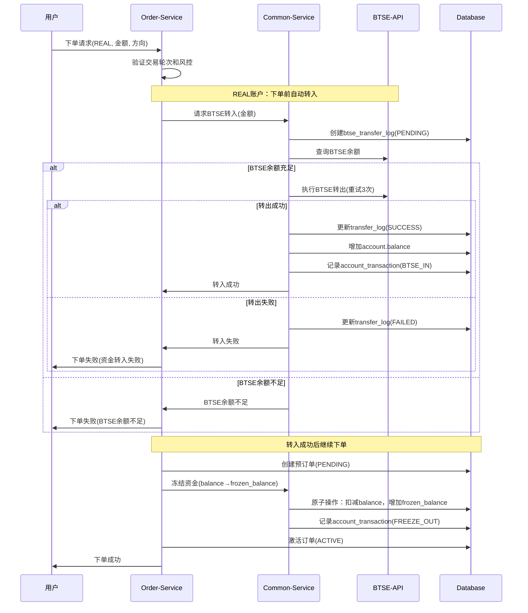
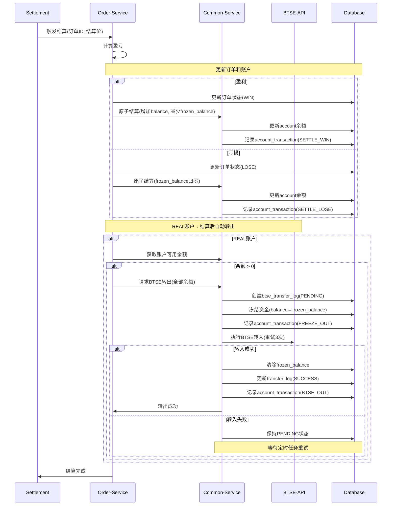
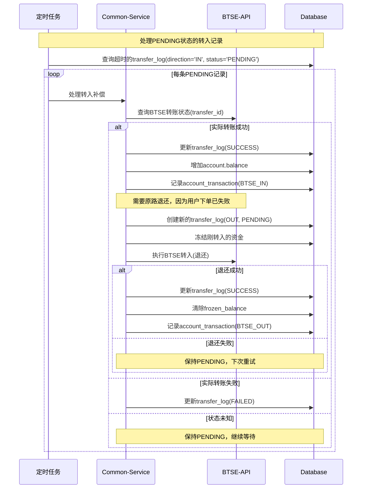
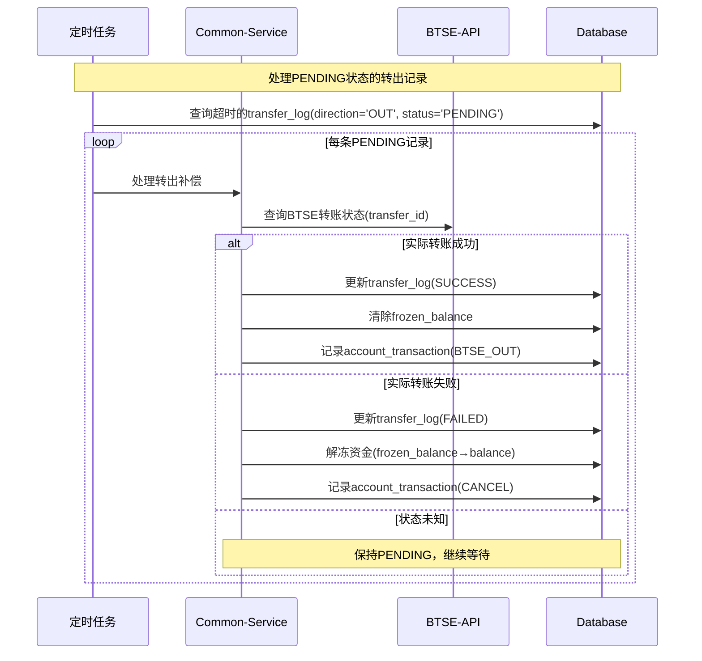

# 二元期权平台业务流程设计（下单+转入，结算+转出）

## 1. 概述

本文档描述优化后的REAL账户交易流程，将BTSE资金划转与订单操作合并，实现资金的实时流转：
- **下单时自动转入**：REAL账户下单前自动从BTSE转入资金
- **结算时自动转出**：REAL账户结算后自动将资金转回BTSE

> 注意：DEMO账户不涉及BTSE划转，仍使用本地余额

## 2. 核心流程变更

### 2.1 原流程 vs 新流程

#### 原流程（分离式）
```
1. 用户手动划转：BTSE → 本地账户
2. 使用本地余额下单
3. 订单结算到本地账户
4. 用户手动划转：本地账户 → BTSE
```

#### 新流程（合并式）
```
REAL账户：
1. 下单时：自动从BTSE转入 → 冻结资金 → 创建订单
2. 结算时：解冻资金 → 自动转出到BTSE

DEMO账户：
1. 下单时：本地余额 → 冻结资金 → 创建订单
2. 结算时：解冻资金 → 本地余额
```

## 3. 下单+转入流程（REAL账户）

### 3.1 流程图



### 3.2 关键步骤

1. **订单验证**
   - 验证用户状态
   - 检查交易轮次
   - 风控检查

2. **BTSE自动转入**（REAL账户特有）
   - 创建PENDING状态的transfer_log
   - 查询BTSE余额
   - 执行BTSE→账户转入（3次重试）
   - 更新本地balance
   - 记录account_transaction（ref_id关联transfer_log.id）

3. **资金冻结**
   - 原子操作：balance → frozen_balance
   - 记录account_transaction（ref_id关联order.id）

4. **订单激活**
   - 更新订单状态：PENDING → ACTIVE

### 3.3 异常处理

- **BTSE余额不足**：直接返回失败，不创建订单
- **BTSE API失败**：重试3次后失败，不创建订单
- **BTSE API超时**：记录PENDING状态，用户下单失败，等待定时任务处理
- **本地冻结失败**：取消预订单，资金已转入的保留在本地账户

## 4. 结算+转出流程（REAL账户）

### 4.1 流程图



### 4.2 关键步骤

1. **订单结算**
   - 计算盈亏（含手续费）
   - 更新订单状态（WIN/LOSE）
   - 原子性更新账户余额

2. **BTSE自动转出**（REAL账户特有）
   - 获取账户可用余额
   - 如果余额 > 0，执行转出：
     - 创建PENDING状态的transfer_log
     - 冻结全部余额
     - 执行账户→BTSE转出（3次重试）
     - 成功后清除frozen_balance
     - 记录account_transaction（ref_id关联transfer_log.id）

3. **异常处理**
   - 转出失败保持PENDING状态
   - 定时任务后续重试

### 4.3 批量结算优化

对于同一轮次的多个订单：
1. 先批量完成所有订单结算
2. 汇总该用户的总盈亏
3. 执行一次BTSE转出操作

## 5. 数据库事务设计

### 5.1 下单事务

```sql
-- 事务1：BTSE转入（仅REAL账户）
BEGIN;
  INSERT INTO btse_transfer_log (status='PENDING', direction='IN', ...);
  -- 调用BTSE API
  UPDATE btse_transfer_log SET status='SUCCESS';
  UPDATE account SET balance = balance + amount;
  INSERT INTO account_transaction (type='BTSE_IN', ref_id=transfer_log.id, ...);
COMMIT;

-- 事务2：创建订单
BEGIN;
  INSERT INTO option_order (status='PENDING', ...);
  UPDATE account SET balance = balance - amount, frozen_balance = frozen_balance + amount;
  INSERT INTO account_transaction (type='FREEZE_OUT', ref_id=order.id, ...);
  UPDATE option_order SET status='ACTIVE';
COMMIT;
```

### 5.2 结算事务

```sql
-- 事务1：订单结算
BEGIN;
  UPDATE option_order SET status='WIN/LOSE', profit=...;
  UPDATE account SET balance = balance + profit, frozen_balance = frozen_balance - amount;
  INSERT INTO account_transaction (type='SETTLE_WIN/LOSE', ref_id=order.id, ...);
  UPDATE account SET total_profit/total_loss = ...;
COMMIT;

-- 事务2：BTSE转出（仅REAL账户，余额>0）
BEGIN;
  INSERT INTO btse_transfer_log (status='PENDING', direction='OUT', ...);
  UPDATE account SET balance = 0, frozen_balance = balance;
  INSERT INTO account_transaction (type='FREEZE_OUT', ref_id=transfer_log.id, ...);
  -- 调用BTSE API
  UPDATE btse_transfer_log SET status='SUCCESS';
  UPDATE account SET frozen_balance = 0;
  INSERT INTO account_transaction (type='BTSE_OUT', ref_id=transfer_log.id, ...);
COMMIT;
```

## 6. 关键优化点

### 6.1 性能优化

1. **预订单机制**：先创建PENDING订单获取ID，避免重复
2. **原子操作**：使用数据库原子更新，避免并发问题
3. **批量处理**：同一用户多笔订单结算后合并转出

### 6.2 安全性

1. **幂等性**：使用唯一transfer_id防重复
2. **事务一致性**：account和account_transaction同一事务
3. **状态机**：严格的状态转换规则

### 6.3 可靠性

1. **重试机制**：BTSE API调用失败自动重试3次
2. **补偿机制**：PENDING状态的定时任务处理
3. **审计追踪**：完整的account_transaction记录

## 7. 配置参数

```yaml
btse:
  transfer:
    retry-times: 3              # API重试次数
    retry-interval: 1000        # 重试间隔(ms)
    pending-timeout: 300        # PENDING超时时间(秒)
    
account:
  real:
    auto-transfer-in: true      # 下单时自动转入
    auto-transfer-out: true     # 结算时自动转出
    min-transfer-amount: 1.0    # 最小转账金额
  demo:
    auto-transfer-in: false     # DEMO账户不自动转账
    auto-transfer-out: false
```

## 8. 监控指标

- **转账成功率**：成功/总数
- **转账延迟**：API调用耗时
- **PENDING订单数**：需要补偿的订单
- **账户余额一致性**：本地余额 vs BTSE余额

## 9. 注意事项

1. **DEMO账户**不执行BTSE划转，仅操作本地余额
2. **REAL账户**每次下单都需要BTSE余额充足
3. **结算转出**可能因网络等原因延迟，需要定时任务补偿
4. **账户余额**在转账过程中会有短暂的冻结状态

## 10. 定时任务补偿机制

### 10.1 转入超时补偿

对于下单时BTSE转入超时的情况，需要定时任务处理：



### 10.2 转出超时补偿

对于结算后BTSE转出超时的情况：



### 10.3 补偿任务配置

```yaml
scheduled-tasks:
  transfer-compensation:
    enabled: true
    cron: "0 */1 * * * *"        # 每分钟执行一次
    pending-timeout: 300         # 5分钟后开始补偿
    max-retry-times: 10          # 最大重试次数
    retry-interval: 60           # 重试间隔(秒)
```

### 10.4 关键逻辑

1. **转入超时补偿**：
   - 检查BTSE实际转账状态
   - 如果成功，需要立即原路退还（因为用户下单已失败）
   - 如果失败，标记为FAILED
   - 如果状态未知，继续等待

2. **转出超时补偿**：
   - 检查BTSE实际转账状态
   - 如果成功，更新状态并清除冻结
   - 如果失败，解冻资金返回余额
   - 如果状态未知，继续等待

3. **防重复处理**：
   - 使用分布式锁防止多实例重复处理
   - 更新时间戳记录最后处理时间

## 11. 后续优化方向

1. **预充值池**：维护一定金额在本地，减少转账频率
2. **智能转账**：根据用户交易习惯预测转账需求
3. **批量转账**：多个用户的转账请求合并处理
4. **缓存优化**：缓存BTSE余额查询结果