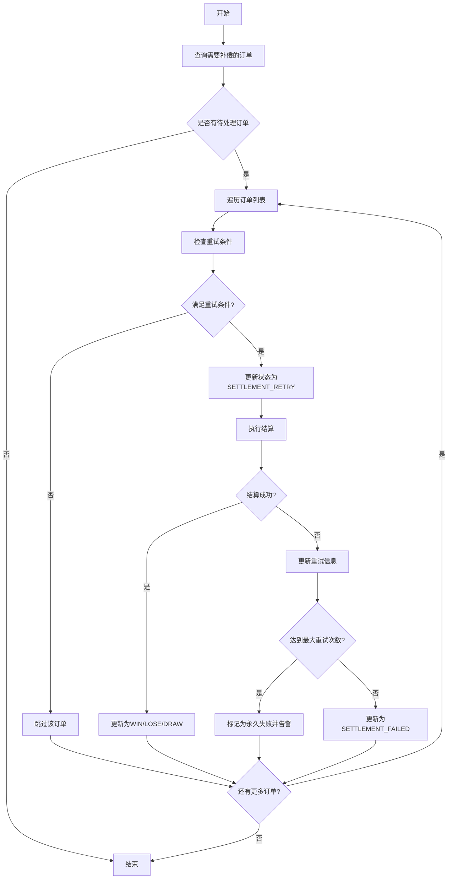

# 业务流程设计：结算重试补偿机制

## 1. 背景与问题

### 1.1 现状分析
当前订单结算服务（OrderSettlementService）存在以下问题：
- 结算失败的订单只记录错误日志，未进行重试处理
- 没有标记结算失败状态，可能导致重复结算或永久未结算
- 缺少系统性的补偿机制来处理异常场景

### 1.2 潜在风险
- **资金风险**：订单未结算导致用户资金无法正确处理
- **用户体验**：用户无法及时看到订单结果
- **数据一致性**：账户余额与订单状态不一致
- **运营风险**：需要人工介入处理失败订单

## 2. 设计目标

### 2.1 功能目标
- 自动识别结算失败的订单
- 实现自动重试机制
- 防止重复结算
- 提供失败告警机制
- 支持手动触发补偿

### 2.2 非功能目标
- **可靠性**：确保所有订单最终被正确结算
- **幂等性**：多次执行不会产生副作用
- **可观测性**：清晰的日志和监控指标
- **性能**：不影响正常结算流程

## 3. 解决方案设计

### 3.1 订单状态扩展

#### 3.1.1 新增订单状态
```java
// BusinessConstants.OrderStatus 新增
public static final String SETTLEMENT_FAILED = "SETTLEMENT_FAILED";  // 结算失败
public static final String SETTLEMENT_RETRY = "SETTLEMENT_RETRY";    // 重试中
```

#### 3.1.2 数据库字段扩展
```sql
-- 在option_order表新增字段
ALTER TABLE bo_option_order ADD COLUMN settlement_attempts INT DEFAULT 0 COMMENT '结算尝试次数';
ALTER TABLE bo_option_order ADD COLUMN last_settlement_error VARCHAR(500) COMMENT '最后一次结算失败原因';
ALTER TABLE bo_option_order ADD COLUMN last_settlement_attempt TIMESTAMP COMMENT '最后一次结算尝试时间';

-- 添加索引优化查询
CREATE INDEX idx_settlement_retry ON bo_option_order(status, settlement_attempts, last_settlement_attempt) 
WHERE status IN ('SETTLEMENT_FAILED', 'PENDING', 'ACTIVE');
```

### 3.2 结算重试机制

#### 3.2.1 重试策略
- **最大重试次数**：5次
- **重试间隔**：采用指数退避策略
  - 第1次：1分钟后
  - 第2次：5分钟后
  - 第3次：15分钟后
  - 第4次：30分钟后
  - 第5次：60分钟后

#### 3.2.2 重试条件
1. 订单状态为SETTLEMENT_FAILED
2. 重试次数未超过最大限制
3. 距离上次重试时间满足间隔要求
4. 轮次已达到结算时间

### 3.3 补偿任务实现

#### 3.3.1 定时任务配置
```java
/**
 * 结算失败补偿任务
 * 每5分钟执行一次，处理结算失败的订单
 */
@Scheduled(cron = "0 */5 * * * ?")
@DistributedScheduled(
    lockKey = CacheConstants.LOCK_SETTLEMENT_COMPENSATION,
    expireTime = 4,
    timeUnit = TimeUnit.MINUTES,
    description = "订单结算失败补偿任务"
)
public void executeSettlementCompensationTask() {
    // 补偿逻辑
}
```

#### 3.3.2 补偿流程



### 3.4 实现细节

#### 3.4.1 查询待补偿订单
```java
public List<Order> getOrdersForCompensation(int limit) {
    return orderMapper.findOrdersForSettlementCompensation(
        Arrays.asList("SETTLEMENT_FAILED", "PENDING", "ACTIVE"),
        MAX_RETRY_ATTEMPTS,
        LocalDateTime.now(),
        limit
    );
}
```

#### 3.4.2 计算重试间隔
```java
private boolean shouldRetry(Order order) {
    if (order.getSettlementAttempts() >= MAX_RETRY_ATTEMPTS) {
        return false;
    }
    
    if (order.getLastSettlementAttempt() == null) {
        return true;
    }
    
    int attempts = order.getSettlementAttempts();
    int delayMinutes = getRetryDelayMinutes(attempts);
    LocalDateTime nextRetryTime = order.getLastSettlementAttempt()
        .plusMinutes(delayMinutes);
    
    return LocalDateTime.now().isAfter(nextRetryTime);
}

private int getRetryDelayMinutes(int attempts) {
    switch (attempts) {
        case 0: return 1;
        case 1: return 5;
        case 2: return 15;
        case 3: return 30;
        case 4: return 60;
        default: return 120;
    }
}
```

#### 3.4.3 结算失败处理
```java
private void handleSettlementFailure(Order order, Exception e) {
    order.setStatus(BusinessConstants.OrderStatus.SETTLEMENT_FAILED);
    order.setSettlementAttempts(order.getSettlementAttempts() + 1);
    order.setLastSettlementError(StringUtils.substring(e.getMessage(), 0, 500));
    order.setLastSettlementAttempt(LocalDateTime.now());
    
    orderMapper.updateSettlementRetryInfo(order);
    
    // 达到最大重试次数，发送告警
    if (order.getSettlementAttempts() >= MAX_RETRY_ATTEMPTS) {
        alertService.sendSettlementFailureAlert(order);
        log.error("Order settlement permanently failed after {} attempts - orderId: {}", 
            MAX_RETRY_ATTEMPTS, order.getId());
    }
}
```

### 3.5 监控与告警

#### 3.5.1 监控指标
- 结算失败订单数量
- 重试成功率
- 平均重试次数
- 结算延迟时间

#### 3.5.2 告警条件
- 单个订单重试超过3次
- 最近1小时结算失败数超过10个
- 有订单超过24小时未结算

### 3.6 手动介入机制

#### 3.6.1 管理接口
```java
@PostMapping("/admin/settlement/retry/{orderId}")
public Result<Void> manualRetrySettlement(@PathVariable Long orderId) {
    // 手动触发结算重试
}

@PostMapping("/admin/settlement/force/{orderId}")
public Result<Void> forceSettlement(
    @PathVariable Long orderId,
    @RequestBody ForceSettlementRequest request) {
    // 强制结算（需要管理员权限）
}
```

## 4. 数据迁移方案

### 4.1 历史数据处理
1. 识别历史未结算订单
2. 批量更新状态为SETTLEMENT_FAILED
3. 触发补偿任务处理

### 4.2 迁移SQL
```sql
-- 识别需要补偿的历史订单
UPDATE bo_option_order 
SET status = 'SETTLEMENT_FAILED',
    settlement_attempts = 0,
    update_time = NOW()
WHERE status IN ('PENDING', 'ACTIVE')
  AND round_id IN (
    SELECT id FROM bo_trading_round 
    WHERE status = 'SETTLED' 
    AND end_time < DATE_SUB(NOW(), INTERVAL 1 HOUR)
  );
```

## 5. 测试方案

### 5.1 单元测试
- 重试逻辑测试
- 间隔计算测试
- 状态转换测试

### 5.2 集成测试
- 模拟结算失败场景
- 验证重试机制
- 验证幂等性

### 5.3 压力测试
- 大批量失败订单补偿
- 并发补偿测试

## 6. 上线方案

### 6.1 灰度发布
1. 先在测试环境验证
2. 生产环境灰度10%流量
3. 观察24小时后全量发布

### 6.2 回滚方案
- 关闭补偿任务开关
- 恢复订单状态
- 切换到旧版本代码

## 7. 风险评估

### 7.1 技术风险
- **风险**：重复结算导致资金异常
- **缓解**：使用数据库事务和状态检查确保幂等性

### 7.2 业务风险
- **风险**：大量历史订单同时补偿导致系统压力
- **缓解**：批量处理，限流控制

## 8. 后续优化

### 8.1 短期优化
- 增加更详细的结算失败原因分类
- 优化重试策略，根据失败原因调整间隔

### 8.2 长期优化
- 引入消息队列实现异步结算
- 建立结算链路追踪系统
- 实现自动故障诊断和修复

## 9. 实施计划

| 阶段 | 任务 | 工期 | 负责人 |
|------|------|------|--------|
| Phase 1 | 数据库改造和状态扩展 | 2天 | 后端开发 |
| Phase 2 | 补偿任务核心逻辑实现 | 3天 | 后端开发 |
| Phase 3 | 监控告警系统集成 | 2天 | 运维团队 |
| Phase 4 | 测试验证 | 3天 | 测试团队 |
| Phase 5 | 灰度发布和监控 | 2天 | 全体团队 |

## 10. 相关文档
- [订单结算流程设计](./201_业务流程设计(订单结算).md)
- [分布式定时任务设计](./210_分布式定时任务设计.md)
- [账户资金流转设计](./203_业务流程设计(账户资金流转).md)