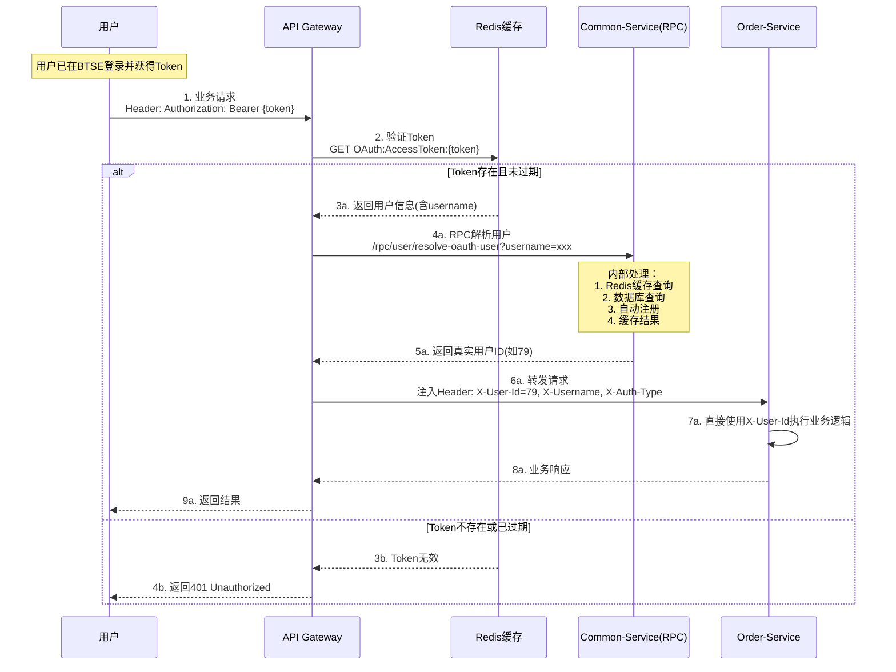

# OAuth接入方案 - 简化版

## 问题分析

当前OAuth接入存在以下问题：
1. **用户ID混淆**：OAuth token中的用户ID（如89453）是BTSE的mock ID，不是我们数据库的真实用户ID
2. **自动注册复杂**：Gateway层处理用户映射和自动注册逻辑过于复杂
3. **架构不清晰**：同时使用WebClient和RestTemplate，异步和同步混合

## 简化方案

### 核心原则
1. **明确用户ID概念**：严格区分OAuth用户ID（不使用）和真实用户ID（传递给服务）
2. **职责分离**：Gateway只负责token验证和用户名提取，用户创建交给BaseController
3. **统一架构**：使用统一的技术栈

### 架构设计

```
OAuth请求 → Gateway → BaseController → 其他服务
   ↓           ↓           ↓
Token验证   提取username  自动注册/查询真实用户ID
```

### 实现步骤

#### 1. Gateway层（关键职责）
- **职责**：token验证 + 用户ID解析 + 头信息注入
- **输出**：注入`X-User-Id`（真实数据库ID）、`X-Username`和`X-Auth-Type: OAuth`到请求头
- **处理逻辑**：OAuth token → 提取username → 查询/创建真实用户ID → 注入头信息

```java
// OAuthTokenFilter需要做：
1. 验证token
2. 提取username
3. 通过username获取/创建真实用户ID
4. 注入headers: X-User-Id(真实ID), X-Username, X-Auth-Type
```

#### 2. Common-service层（提供RPC接口）
- **职责**：提供用户查询和自动注册的RPC接口
- **位置**：option-common-service
- **接口**：供Gateway调用的用户操作接口

```java
// UserRpcController提供一个集成接口：
@GetMapping("/rpc/user/resolve-oauth-user")
public String resolveOAuthUser(@RequestParam String username) {
    // 1. 先从Redis缓存查询
    String cacheKey = "BO:User:Mapping:" + username;
    String cachedUserId = redisTemplate.opsForValue().get(cacheKey);
    if (cachedUserId != null) {
        log.debug("从缓存获取用户ID: username={}, userId={}", username, cachedUserId);
        return cachedUserId;
    }
    
    // 2. 从数据库查询用户
    UserDTO user = userService.getUserByExternalId(username);
    if (user != null) {
        // 缓存查询结果
        redisTemplate.opsForValue().set(cacheKey, user.getId().toString(), Duration.ofHours(24));
        return user.getId().toString();
    }
    
    // 3. 用户不存在，自动注册
    user = userService.autoRegisterOAuthUser(username, username + "@oauth.auto");
    if (user != null) {
        // 缓存新用户ID
        redisTemplate.opsForValue().set(cacheKey, user.getId().toString(), Duration.ofHours(24));
        return user.getId().toString();
    }
    
    return null; // 注册失败
}
```

#### 3. 其他服务集成
- **直接使用X-User-Id**：从Gateway注入的请求头直接获取真实用户ID
- **无需BaseController**：用户ID已经由Gateway解析完成

### 技术栈统一

#### Gateway层
- **Token验证**：RedisTemplate（同步）
- **HTTP客户端**：RestTemplate调用Common-service RPC接口

#### Common-service层
- **数据库操作**：MyBatis
- **用户操作**：UserService

#### 其他服务层
- **用户获取**：直接从X-User-Id请求头获取
- **RPC调用**：Feign Client（已有）

### 配置要求

#### Redis Key标准
```java
// OAuth token（保持不变）
OAuth:AccessToken:{token}

// 用户ID映射缓存（RPC接口内部使用）
BO:User:Mapping:{username} -> 真实用户ID
```

#### Header标准
```
X-User-Id: 79                       // 真实的数据库用户ID
X-Username: flowtest_1755259712     // OAuth用户名
X-Auth-Type: OAuth                  // 认证类型
```

### 时序图



### 优势

1. **清晰职责**：
   - Gateway：token验证 + 用户ID解析 + 头信息注入
   - Common-service：提供用户查询和注册RPC接口
   - 其他服务：直接使用真实用户ID执行业务逻辑

2. **高度集成**：
   - 一个RPC接口`resolveOAuthUser`完成所有用户相关操作
   - Gateway逻辑极简：验证token → 调用RPC → 注入用户ID
   - Common-service内部处理缓存、查询、注册的完整链路

3. **统一技术栈**：
   - Gateway：Spring Cloud Gateway + Redis + RestTemplate
   - Common-service：Spring Boot + MyBatis
   - 其他服务：直接读取请求头，无需继承

4. **错误处理简单**：
   - Gateway：token无效返回401，RPC调用失败返回500
   - Common-service：用户操作异常通过RPC返回
   - 链路清晰，易于调试

### 实现清单

#### Gateway修改
- [x] 保持UserRpcClient，用于调用Common-service RPC接口
- [x] 完善OAuthTokenFilter的用户ID映射逻辑
- [x] 确保注入真实的数据库用户ID到X-User-Id

#### Common-service修改
- [x] 提供resolveOAuthUser集成RPC接口（包含缓存、查询、注册）

#### 其他服务修改
- [ ] OrderController直接从X-User-Id获取用户ID
- [ ] 移除getCurrentUserId()中的OAuth处理逻辑

### Gateway实现（简化版）

```java
@Component  
public class OAuthTokenFilter implements GlobalFilter, Ordered {
    
    private final StringRedisTemplate redisTemplate;
    private final ObjectMapper objectMapper;
    
    @Override
    public Mono<Void> filter(ServerWebExchange exchange, GatewayFilterChain chain) {
        String path = exchange.getRequest().getPath().value();
        
        // 跳过公开路径
        if (isPublicPath(path)) {
            return chain.filter(exchange);
        }
        
        // 获取并验证Token
        String authorization = exchange.getRequest().getHeaders().getFirst("Authorization");
        if (authorization == null || !authorization.startsWith("Bearer ")) {
            return unauthorized(exchange, "Missing Authorization header");
        }
        
        String token = authorization.substring(7);
        
        // 从Redis验证Token
        return validateToken(token)
                .flatMap(tokenInfo -> {
                    if (tokenInfo == null) {
                        return unauthorized(exchange, "Invalid token");
                    }
                    
                    // 检查过期时间
                    if (isTokenExpired(tokenInfo)) {
                        return unauthorized(exchange, "Token expired");
                    }
                    
                    // 提取username，解析真实用户ID，注入请求头
                    String username = getUsername(tokenInfo);
                    String realUserId = resolveRealUserId(username); // 关键：获取真实用户ID
                    
                    if (realUserId == null) {
                        return unauthorized(exchange, "User resolve failed");
                    }
                    
                    ServerHttpRequest modifiedRequest = exchange.getRequest().mutate()
                            .header("X-User-Id", realUserId)        // 真实数据库用户ID
                            .header("X-Username", username)
                            .header("X-Auth-Type", "OAuth")
                            .build();
                            
                    return chain.filter(exchange.mutate().request(modifiedRequest).build());
                });
    }
    
    private Mono<JsonNode> validateToken(String token) {
        return Mono.fromCallable(() -> {
            String redisKey = "OAuth:AccessToken:" + token;
            String tokenJson = redisTemplate.opsForValue().get(redisKey);
            return tokenJson != null ? objectMapper.readTree(tokenJson) : null;
        });
    }
    
    private String getUsername(JsonNode tokenInfo) {
        return tokenInfo.get("metadata").get("username").asText();
    }
    
    // 关键方法：解析真实用户ID（大幅简化！）
    private String resolveRealUserId(String username) {
        // 一个RPC调用搞定：缓存查询 + 数据库查询 + 自动注册 + 缓存存储
        return userRpcClient.resolveOAuthUser(username);
    }
}
```

### 测试验证

1. **Token验证**：`curl -H "Authorization: Bearer {token}" /api/user/profile`
2. **自动注册**：新用户首次访问自动创建
3. **用户ID传递**：确认传递的是真实数据库ID
4. **完整流程**：OAuth登录 → 查询用户 → 下单

## 总结

这个简化方案的核心是**职责清晰**：
- Gateway专注token验证
- BaseController专注用户管理  
- 其他服务专注业务逻辑

通过这种分层，避免了复杂的跨服务用户映射，使整个OAuth接入变得简单可靠。