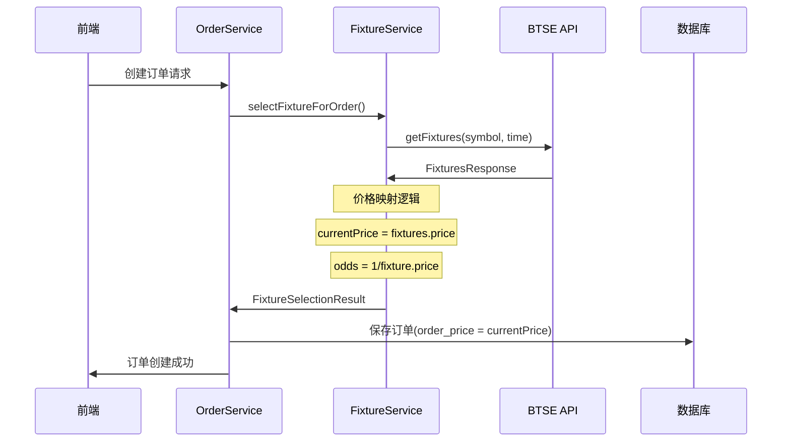
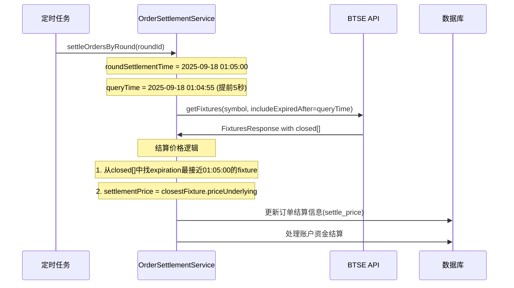

# Fixture接入方案 - 最终版

## 1. 概述

本文档详细描述了二元期权交易系统与BTSE Fixture API的集成方案，包括API调用流程、数据映射关系、以及与本地数据库的交互机制。

### 1.1 核心原则

- **统一价格来源**：`FixturesResponse.price` 作为唯一的市场价格源
- **简化映射关系**：避免复杂的数据转换和时间匹配
- **实时准确性**：确保下单和结算使用一致的价格来源

## 2. 架构组件

### 2.1 核心文件结构

```
option-common-service/
├── BtseDataConverter.java           # BTSE API数据转换器
├── BtseMarketApiClientImpl.java     # BTSE真实API客户端
└── BtseMarketMockApiClient.java     # BTSE模拟API客户端

option-order-service/
├── FixtureService.java              # Fixture业务逻辑服务
├── OrderService.java                # 订单服务
└── OrderSettlementService.java      # 订单结算服务
```

## 3. API调用流程

### 3.1 Fixtures API 调用

#### 3.1.1 输入参数
```java
// 方法签名
public FixturesResponseDTO getFixtures(String symbol, LocalDateTime includeExpiredAfter)

// 调用示例 - 下单时获取当前数据
String symbol = "BTC-USDT";  
// 下单时不传includeExpiredAfter，获取最新的open数据和当前价格

// 调用示例 - 结算时获取历史数据  
String symbol = "BTC-USDT";
LocalDateTime includeExpiredAfter = LocalDateTime.of(2025, 9, 18, 1, 4, 55);  // 2025-09-18 01:04:55
// 结算时传入略早于结算时间的时间点，获取closed数组中的历史数据
```

#### 3.1.2 BTSE API请求

**下单时的API请求**：
```http
GET https://api.btse.co/pricing-3.0/v3/api/fixtures?symbol=BTC-USD
Accept: */*
```

**结算时的API请求**（以5分钟轮次 2025-09-18 01:00:00 ~ 01:05:00 为例）：
```http
GET https://api.btse.co/pricing-3.0/v3/api/fixtures?symbol=BTC-USD&includeExpiredAfter=2025-09-18+01%3A04%3A55
Accept: */*
```

#### 3.1.3 BTSE API响应

**下单时的API响应** (不传includeExpiredAfter):
```json
{
  "symbol": "BTC-USD",
  "price": 116754.65,           // ⭐下单价格：当前市场价格
  "open": [                     // 当前可交易的合约
    {
      "expiration": "2025-09-18 01:05:00",
      "side": "call",
      "price": 0.5112577098311315    // ⭐期权价格：用于计算赔率
    },
    {
      "expiration": "2025-09-18 01:05:00", 
      "side": "put",
      "price": 0.5088942211559753
    }
  ],
  "closed": []                  // 下单时通常为空
}
```

**结算时的API响应** (includeExpiredAfter=2025-09-19 13:39:55) - **真实BTSE数据**:
```json
{
  "symbol": "BTC-USD", 
  "price": 116259.85,           // 当前价格（非结算价格）
  "open": [                     // 当前可交易的合约
    {
      "expiration": "2025-09-19 13:45:00",
      "side": "call",
      "price": 0.5191042040783408
    },
    {
      "expiration": "2025-09-19 13:45:00",
      "side": "put",
      "price": 0.5191042040783408
    }
  ],
  "closed": [                   // ⭐结算关键：过期时间大于13:39:55的已过期合约
    {
      "expiration": "2025-09-19 13:40:00",
      "strike": 116215.75,
      "side": "put",
      "openInterest": 1,
      "openInterestValue": 5,
      "price": 0.4688106304464619,       // 期权价格（非结算价格）
      "priceUnderlying": 116271.75,      // ⭐结算价格：13:40:00轮次结算时的市场价格
      "itm": false
    },
    {
      "expiration": "2025-09-19 13:40:00",
      "strike": 116215.9,
      "side": "call", 
      "openInterest": 1,
      "openInterestValue": 5,
      "price": 0.5344040363265767,       // 期权价格（非结算价格）
      "priceUnderlying": 116271.75,      // ⭐结算价格：13:40:00轮次结算时的市场价格
      "itm": true
    },
    {
      "expiration": "2025-09-19 13:40:00",
      "strike": 116222.55,
      "side": "put",
      "openInterest": 1, 
      "openInterestValue": 5,
      "price": 0.4727931084655705,       // 期权价格（非结算价格）
      "priceUnderlying": 116271.75,      // ⭐结算价格：13:40:00轮次结算时的市场价格
      "itm": false
    }
  ]
}
```

#### 3.1.4 内部DTO映射
```java
FixturesResponseDTO {
    symbol: "BTC-USDT",           // 转换回USDT格式
    price: 116754.65,             // 当前市场价格 ⭐核心字段
    open: [                       // 开放合约列表
        FixtureDTO {
            expiration: 2025-09-19T06:39:00,
            side: "call",
            price: 0.5112577098311315,    // 期权价格 ⭐用于计算赔率
            strike: 0,                    // BTSE不提供，设为0
            itm: false,                   // BTSE不提供，设为false
            priceUnderlying: null,        // 当前价格在上级price字段中
            openInterest: 0,              // BTSE不提供，设为0
            openInterestValue: 0          // BTSE不提供，设为0
        }
    ],
    closed: []                    // 已关闭合约列表
}
```

### 3.2 NewBet API 调用

#### 3.2.1 输入参数
```java
NewbetRequestDTO {
    symbol: "BTC-USDT",           // 自动转换为BTC-USD
    expiration: 2025-09-19T13:45:00,
    side: "call",
    currentPrice: 116259.85,      // 来自FixturesResponse.price
    price: 0.5191042040783408,    // 来自open[].price
    amount: 100.00,
    tradeId: "order_123456",
    exchangeId: "BTSE",
    userId: "system"
}
```

#### 3.2.2 BTSE API请求
```http
POST https://api.btse.co/pricing-3.0/v3/api/newbet
Content-Type: application/json
Accept: */*

{
  "symbol": "BTC-USD",
  "expiration": "2025-09-19 13:45:00",
  "side": "call",
  "priceUnderlying": 116259.85,
  "price": 0.5191042040783408,
  "amount": 100.00,
  "tradeId": "order_123456",
  "exchangeId": "BTSE",
  "userId": "system"
}
```

#### 3.2.3 BTSE API响应
```json
{
  "status": "ok",
  "message": "Bet placed successfully"
}
```

## 4. 数据映射关系

### 4.1 价格映射核心逻辑

| 场景 | 数据源 | 字段路径 | 用途 | 存储位置 |
|------|--------|----------|------|----------|
| **下单时** | `FixturesResponse.price` | 116259.85 | **订单价格** | `bo_option_order.order_price` |
| **下单时** | `open[].price` | 0.5191042040783408 | **赔率计算** | `bo_option_order.odds` (计算值：1/0.5191 ≈ 1.926) |
| **结算时** | `closed[].priceUnderlying` | 116271.75 | **结算价格** | `bo_option_order.settle_price` |

**关键说明**：
- **`FixturesResponse.price`** 下单时的当前市场价格
- **`open[].price`** 期权价格，用于计算赔率 (1/price)
- **`closed[].priceUnderlying`** 结算时从最接近结算时间的closed fixture获取
- **`closed[].price`** 期权价格（非结算价格），不用于结算计算

### 4.1.1 真实数据解析示例

以上面的真实BTSE数据为例，假设我们要结算 `2025-09-19 13:40:00` 轮次：

1. **查询参数**: `includeExpiredAfter=2025-09-19 13:39:55`
2. **返回的closed数组**包含3个13:40:00过期的fixtures
3. **结算价格提取**：所有fixtures的 `priceUnderlying` 都是 `116271.75`
4. **选择策略**：选择任意一个（因为同一轮次的priceUnderlying相同）
5. **最终结算价格**：`116271.75`

```java
// 代码逻辑示例
List<FixtureDTO> targetFixtures = closed.stream()
    .filter(f -> f.getExpiration().equals(LocalDateTime.of(2025, 9, 19, 13, 40, 0)))
    .collect(Collectors.toList());

// 所有fixtures的priceUnderlying都是116271.75，选择第一个即可
BigDecimal settlementPrice = targetFixtures.get(0).getPriceUnderlying(); // 116271.75
```

### 4.2 订单创建流程



### 4.3 订单结算流程



## 5. 数据库表关系

### 5.1 订单表 (bo_option_order)

| 字段名 | 类型 | 数据来源 | 说明 |
|--------|------|----------|------|
| `order_price` | DECIMAL(20,8) | `FixturesResponse.price` | 下单时的市场价格 |
| `odds` | DECIMAL(10,4) | `1/fixture.price` | 赔率（计算值） |
| `settle_price` | DECIMAL(20,8) | `FixturesResponse.price` | 结算时的市场价格 |
| `expected_profit` | DECIMAL(20,8) | `amount * (odds - 1)` | 预期净利润 |
| `profit` | DECIMAL(20,8) | 计算值 | 实际盈亏 |

### 5.2 交易轮次表 (bo_trading_round)

| 字段名 | 类型 | 数据来源 | 说明 |
|--------|------|----------|------|
| `start_price` | DECIMAL(20,8) | `FixturesResponse.price` | 轮次开始价格 |
| `end_price` | DECIMAL(20,8) | `FixturesResponse.price` | 轮次结算价格 |

## 6. 核心业务逻辑

### 6.1 Fixture选择逻辑 (FixtureService.java)

```java
public FixtureSelectionResult selectFixtureForOrder(Long symbolId, String direction, 
                                                   LocalDateTime roundTime, Integer durationMinutes) {
    // 1. 获取BTSE symbol
    String symbol = symbolService.getBtseSymbolById(symbolId);
    
    // 2. 调用Fixtures API
    FixtureRequestDTO request = FixtureRequestDTO.builder()
        .symbol(symbol)
        .includeExpiredAfter(roundTime)
        .build();
    Result<FixturesResponseDTO> result = btseRpcClient.getFixtures(request);
    FixturesResponseDTO fixtures = result.getData();
    
    // 3. 选择匹配的fixture（简化逻辑：只按side匹配）
    String side = convertDirectionToSide(direction); // UP->call, DOWN->put
    FixtureDTO fixture = fixtures.getOpen().stream()
        .filter(f -> side.equals(f.getSide()))
        .findFirst()
        .orElse(null);
    
    // 4. 计算赔率
    BigDecimal odds = calculateOddsFromFixturePrice(fixture.getPrice());
    // odds = 1 / fixture.price，范围限制在[1.01, 10.0]
    
    // 5. 返回结果
    return FixtureSelectionResult.builder()
        .fixture(fixture)
        .odds(odds)
        .symbol(symbol)
        .currentPrice(fixtures.getPrice())  // ⭐关键：使用FixturesResponse.price
        .build();
}

private BigDecimal calculateOddsFromFixturePrice(BigDecimal fixturePrice) {
    // 赔率 = 1 / fixture.price
    BigDecimal odds = BigDecimal.ONE.divide(fixturePrice, 4, RoundingMode.HALF_UP);
    
    // 确保赔率在合理范围内 [1.01 - 10.0]
    if (odds.compareTo(new BigDecimal("1.01")) < 0) {
        odds = new BigDecimal("1.01");
    } else if (odds.compareTo(new BigDecimal("10.0")) > 0) {
        odds = new BigDecimal("10.0");
    }
    
    return odds.setScale(2, RoundingMode.HALF_UP);
}
```

### 6.2 订单创建逻辑 (OrderService.java)

```java
private OrderCreationContext validateOrderRequest(OrderCreateRequestDTO request) {
    // 获取fixture信息（包含当前价格和赔率）
    FixtureService.FixtureSelectionResult fixtureResult = fixtureService.selectFixtureForOrder(
        request.getSymbolId(), 
        request.getDirection(), 
        round.getStartTime(),
        round.getDurationMinutes()
    );
    
    // ⭐关键：使用fixture结果中的当前价格
    BigDecimal currentPrice = fixtureResult.getCurrentPrice(); // 来自FixturesResponse.price
    BigDecimal odds = fixtureResult.getOdds();                 // 来自1/fixture.price计算
    
    return OrderCreationContext.builder()
        .round(round)
        .currentPrice(currentPrice)      // 订单价格
        .odds(odds)                      // 订单赔率
        .fixtureResult(fixtureResult)
        .build();
}

private Order createPreOrder(OrderCreateRequestDTO request, OrderCreationContext context) {
    Order preOrder = new Order();
    // ... 其他字段设置
    preOrder.setOrderPrice(context.getCurrentPrice());  // ⭐使用FixturesResponse.price
    preOrder.setOdds(context.getOdds());               // ⭐使用计算的赔率
    preOrder.setExpectedProfit(calculateExpectedProfit(request.getAmount(), context.getOdds()));
    // ...
    return preOrder;
}
```

### 6.3 订单结算逻辑 (OrderSettlementService.java)

```java
public void settleOrdersByRound(Long roundId) {
    // 1. 获取轮次信息
    TradingRound round = tradingRoundMapper.findById(roundId);
    String symbol = symbolService.getBtseSymbolById(round.getSymbolId());
    LocalDateTime roundSettlementTime = round.getEndTime();  // 例如: 2025-09-18 01:05:00
    
    // 2. 获取结算价格（从closed数组的priceUnderlying获取）
    BigDecimal roundSettlePrice = getSettlementPriceFromFixture(symbol, roundSettlementTime);
    
    // 3. 结算所有订单
    List<Order> orders = orderMapper.findPendingOrdersByRound(roundId);
    for (Order order : orders) {
        settleOrder(order.getId(), roundSettlePrice);
    }
    
    // 4. 更新轮次状态
    updateRoundSettlement(round, roundSettlePrice);
}

private BigDecimal getSettlementPriceFromFixture(String symbol, LocalDateTime roundSettlementTime) {
    // 调用fixture API，includeExpiredAfter参数获取包含历史数据的响应
    // 例如: includeExpiredAfter=2025-09-18 01:04:55，获取过期时间大于此时间的closed数据
    LocalDateTime queryTime = roundSettlementTime.minusSeconds(5); // 提前5秒查询确保包含目标时间
    
    FixtureRequestDTO request = FixtureRequestDTO.builder()
        .symbol(symbol)
        .includeExpiredAfter(queryTime)  // ⭐关键：获取包含结算时间点的历史数据
        .build();
    Result<FixturesResponseDTO> result = btseRpcClient.getFixtures(request);
    FixturesResponseDTO fixtures = result.getData();
    
    // ⭐从closed数组中查找最接近结算时间的fixture的priceUnderlying
    BigDecimal settlementPrice = getClosestSettlementPrice(fixtures.getClosed(), roundSettlementTime);
    
    if (settlementPrice == null) {
        // 如果没有找到合适的closed数据，fallback到当前价格
        settlementPrice = fixtures.getPrice();
    }
    
    return settlementPrice;
}

private BigDecimal getClosestSettlementPrice(List<FixtureDTO> closedFixtures, LocalDateTime roundSettlementTime) {
    // 寻找最接近结算时间的closed fixture
    FixtureDTO closestFixture = closedFixtures.stream()
        .filter(fixture -> fixture.getExpiration() != null && fixture.getPriceUnderlying() != null)
        .min((f1, f2) -> {
            long diff1 = Math.abs(Duration.between(roundSettlementTime, f1.getExpiration()).toSeconds());
            long diff2 = Math.abs(Duration.between(roundSettlementTime, f2.getExpiration()).toSeconds());
            return Long.compare(diff1, diff2);
        })
        .orElse(null);
    
    if (closestFixture == null) {
        return null;
    }
    
    // ⭐关键：使用closed fixture的priceUnderlying作为结算价格
    return closestFixture.getPriceUnderlying();
}
```

## 7. 数据转换层 (BtseDataConverter.java)

### 7.1 Fixtures响应转换

```java
public FixturesResponseDTO convertFixturesResponse(Map<String, Object> data) {
    List<FixtureDTO> openFixtures = new ArrayList<>();
    List<FixtureDTO> closedFixtures = new ArrayList<>();
    
    // 转换开放的合约
    Object openData = data.get("open");
    if (openData instanceof List) {
        List<Map<String, Object>> openList = (List<Map<String, Object>>) openData;
        for (Map<String, Object> fixtureMap : openList) {
            openFixtures.add(convertSingleFixture(fixtureMap));
        }
    }
    
    // 转换已关闭的合约  
    Object closedData = data.get("closed");
    if (closedData instanceof List) {
        List<Map<String, Object>> closedList = (List<Map<String, Object>>) closedData;
        for (Map<String, Object> fixtureMap : closedList) {
            closedFixtures.add(convertSingleFixture(fixtureMap));
        }
    }
    
    // ⭐提取核心价格字段
    String symbol = (String) data.get("symbol");
    BigDecimal price = parseBigDecimal(data.get("price"));  // 当前市场价格
    
    return FixturesResponseDTO.builder()
        .symbol(symbol)
        .price(price)           // ⭐核心：当前市场价格
        .open(openFixtures)     // 开放合约
        .closed(closedFixtures) // 已关闭合约
        .build();
}

private FixtureDTO convertSingleFixture(Map<String, Object> fixtureMap) {
    // 解析时间格式：支持 "2025-09-19 06:39:00" 格式
    LocalDateTime expiration = parseDateTime(fixtureMap.get("expiration"));
    
    return FixtureDTO.builder()
        .expiration(expiration)
        .side(String.valueOf(fixtureMap.get("side")))           // call/put
        .price(parseBigDecimal(fixtureMap.get("price")))        // ⭐期权价格（用于计算赔率）
        // BTSE不提供的字段设为默认值
        .strike(BigDecimal.ZERO)
        .itm(false)
        .priceUnderlying(null)          // 当前价格在上级price字段中
        .openInterest(0)
        .openInterestValue(BigDecimal.ZERO)
        .build();
}
```

## 8. Mock实现 (BtseMarketMockApiClient.java)

### 8.1 Mock数据生成逻辑

```java
public FixturesResponseDTO getFixtures(String symbol, LocalDateTime includeExpiredAfter) {
    List<FixtureDTO> openFixtures = new ArrayList<>();
    List<FixtureDTO> closedFixtures = new ArrayList<>();
    
    LocalDateTime now = LocalDateTime.now();
    // 时间对齐：按5分钟取整
    int currentMinute = now.getMinute();
    int roundedMinute = (currentMinute / 5) * 5;
    LocalDateTime alignedNow = now.withMinute(roundedMinute).withSecond(0).withNano(0);
    
    // 生成未来12个5分钟周期的开放合约
    for (int i = 1; i <= 12; i++) {
        LocalDateTime expiration = alignedNow.plusMinutes(i * 5);
        
        // 每个时间点生成call和put两种合约
        openFixtures.add(createMockFixture(expiration, "call", symbol));
        openFixtures.add(createMockFixture(expiration, "put", symbol));
    }
    
    // 生成过去12个5分钟周期的已关闭合约
    for (int i = 1; i <= 12; i++) {
        LocalDateTime expiration = alignedNow.minusMinutes(i * 5);
        
        closedFixtures.add(createMockFixture(expiration, "call", symbol));
        closedFixtures.add(createMockFixture(expiration, "put", symbol));
    }
    
    // ⭐生成当前市场价格
    BigDecimal currentPrice = generateRandomPrice(symbol);
    
    return FixturesResponseDTO.builder()
        .symbol(symbol)
        .price(currentPrice)       // ⭐Mock当前市场价格
        .open(openFixtures)
        .closed(closedFixtures)
        .build();
}

private FixtureDTO createMockFixture(LocalDateTime expiration, String side, String symbol) {
    return FixtureDTO.builder()
        .expiration(expiration)
        .side(side)
        .price(new BigDecimal(ThreadLocalRandom.current().nextDouble(0.1, 0.9)))  // Mock期权价格
        .strike(generateRandomPrice(symbol))
        .itm(ThreadLocalRandom.current().nextBoolean())
        .priceUnderlying(generateRandomPrice(symbol))
        .openInterest(ThreadLocalRandom.current().nextInt(100, 1000))
        .openInterestValue(new BigDecimal(ThreadLocalRandom.current().nextInt(1000, 10000)))
        .build();
}
```

## 9. 配置和环境

### 9.1 应用配置

```yaml
# 启用Mock API (开发环境)
btse:
  market-api:
    mock:
      enabled: true

# 使用真实API (生产环境)  
btse:
  market-api:
    mock:
      enabled: false
    base-url: "https://api.btse.co/pricing-3.0/v3/api/"
```

### 9.2 Symbol转换

| 前端使用 | BTSE API | 转换逻辑 |
|---------|----------|----------|
| BTC-USDT | BTC-USD | 请求时：USDT→USD |
| ETH-USDT | ETH-USD | 响应时：USD→USDT |

## 10. 错误处理和边界情况

### 10.1 Fixture选择失败处理

```java
// 当没有匹配的fixture时
if (fixture == null) {
    log.error("No suitable fixture found! side={}, durationMinutes={}, available fixtures count={}", 
        side, durationMinutes, fixtures.getOpen().size());
    throw new BusinessException(500, "fixture.no.suitable", 
        new Object[]{symbol, side, durationMinutes});
}
```

### 10.2 API调用失败处理

```java
// BTSE API调用失败
try {
    ResponseEntity<String> response = btseRestTemplate.exchange(url, HttpMethod.GET, entity, String.class);
} catch (Exception e) {
    log.error("Failed to get fixtures for symbol: {}", symbol, e);
    throw new BtseApiException("Failed to get fixtures", e);
}
```

### 10.3 数据解析异常处理

```java
// 时间解析异常
try {
    if (dateTimeStr.contains(" ")) {
        expiration = LocalDateTime.parse(dateTimeStr.replace(" ", "T"));
    }
} catch (Exception e) {
    log.warn("Failed to parse expiration time: {}", expirationObj, e);
}

// 数值解析异常
private BigDecimal parseBigDecimal(String value) {
    if (value == null || "null".equalsIgnoreCase(value.trim())) {
        return BigDecimal.ZERO;
    }
    try {
        return new BigDecimal(value.trim());
    } catch (NumberFormatException e) {
        log.warn("BigDecimal parsing failed: {}", value, e);
        return BigDecimal.ZERO;
    }
}
```

## 11. 性能优化和监控

### 11.1 缓存策略

- **Symbol配置缓存**：交易对配置信息缓存，避免频繁数据库查询
- **API响应缓存**：考虑对短期内相同请求的响应进行缓存

### 11.2 监控指标

- **API调用延迟**：监控BTSE API响应时间
- **API成功率**：监控API调用成功/失败比例  
- **Fixture选择成功率**：监控fixture匹配成功率
- **价格异常检测**：监控价格波动异常情况

## 12. 总结

### 12.1 核心优势

1. **统一价格源**：所有价格数据来源于`FixturesResponse.price`，确保一致性
2. **简化映射**：避免复杂的数据转换和时间匹配逻辑
3. **实时准确**：下单和结算使用相同的价格获取方式
4. **易于维护**：清晰的数据流和简单的业务逻辑

### 12.2 关键数据流

**下单流程**（基于真实BTSE数据）：
```
BTSE API Response.price (116259.85) → Order.orderPrice
BTSE API open[].price (0.5191042040783408) → 计算赔率 (1/0.5191≈1.926) → Order.odds
```

**结算流程**（基于真实BTSE数据）：
```
BTSE API includeExpiredAfter=2025-09-19 13:39:55 → closed[]数组(3个fixtures)
    ↓
找到expiration=2025-09-19 13:40:00的fixtures
    ↓
所有fixtures的priceUnderlying都是116271.75 → Order.settlePrice
```

### 12.3 重要说明

- **下单价格来源**：`FixturesResponse.price` 提供下单时的当前市场价格
- **结算价格来源**：`closed[].priceUnderlying` 提供结算时的历史市场价格
- **includeExpiredAfter参数的作用**：用于获取包含历史过期合约的closed数组
- **fixture.price用途**：仅用于计算赔率（1/price），不用作市场价格
- **Symbol自动转换**：前端USDT与BTSE USD之间的自动转换
- **Mock与真实API一致**：Mock实现与真实API保持相同的数据结构和业务逻辑
- **时间匹配策略**：结算时查找expiration最接近结算时间的closed fixture
- **Fallback机制**：如果没有合适的closed数据，使用当前价格作为fallback

---

*文档版本：v4.0*  
*最后更新：2025-09-19*  
*更新内容：澄清价格映射逻辑，结算价格使用closed[].priceUnderlying，下单价格使用FixturesResponse.price*