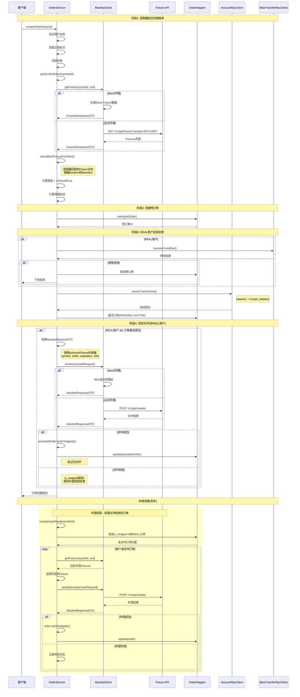

# Fixture API 接入技术方案

## 1. 业务需求分析

### 1.1 核心功能
基于 Options Betting Fixture API 文档，需要实现：

1. **赔率计算服务**：根据市场数据计算二元期权的实时价格（0-1之间的概率）
2. **Newbet对冲服务**：用户下单后自动对冲风险的接口调用

### 1.2 关键概念映射

| Fixture API概念 | 现有系统概念 | 说明 |
|----------------|------------|------|
| Fixture | Order | 期权合约 → 订单 |
| Symbol | 交易对 | 如 BTCUSDT |
| Strike | 行权价 | 判断盈亏的价格基准 |
| Expiration | 到期时间 | 结算时间点 |
| Price (0-1) | 赔率/胜率 | 获胜概率 |
| ITM | 当前盈亏状态 | In The Money |
| OpenInterest | 持仓量 | 风险敞口统计 |

### 1.3 现有架构分析

通过分析现有的 `BtseApiClient` 接口，发现：

1. **接口层**：`BtseApiClient` 定义了各种 BTSE 相关操作接口
2. **实现层**：
   - `BtseApiClientImpl`：正式环境调用真实API
   - `BtseMockApiClient`：Mock环境生成模拟数据
3. **双环境支持**：通过 `@ConditionalOnProperty` 控制使用哪个实现
4. **现有功能**：用户认证、资金管理、市场数据等

## 2. 技术方案设计

### 2.1 极简设计原则

**完全按照 Fixture API 的请求/响应格式设计，不做任何转换或兼容**

- 创建独立的 Fixture 相关 DTO，与现有系统解耦
- 新增独立的 `getFixtures()` 和 `newbet()` 方法
- 请求和响应格式完全匹配 Fixture API 文档
- Mock 实现返回相同格式的数据

```
┌─────────────────────────────────────────────────────────┐
│                    极简架构设计                          │
├─────────────────────────────────────────────────────────┤
│                  BtseApiClient                          │
│  ┌──────────────────────────────────────────────────┐   │
│  │ // 新增 Fixture API 方法                         │   │
│  │ FixturesResponseDTO getFixtures(String symbol,   │   │
│  │                    LocalDateTime expiredAfter)   │   │
│  │ NewbetResponseDTO newbet(NewbetRequestDTO req)   │   │
│  └──────────────────────────────────────────────────┘   │
├─────────────────────────────────────────────────────────┤
│              实现层 (双环境支持)                         │
│  ┌──────────────┐  ┌──────────────────────────────┐   │
│  │BtseApiClientImpl│  │    BtseMockApiClient        │   │
│  │              │  │                              │   │
│  │ • 调用真实    │  │ • 返回相同格式的Mock数据      │   │
│  │   Fixture API│  │ • 简单随机生成                │   │
│  │ • 直接传递    │  │ • 格式完全一致                │   │
│  └──────────────┘  └──────────────────────────────┘   │
├─────────────────────────────────────────────────────────┤
│            独立的 Fixture DTO (与 API 文档一致)          │
│  ┌──────────────────────────────────────────────────┐   │
│  │ FixtureDTO         - 单个fixture数据             │   │
│  │ FixturesResponseDTO - GET /fixtures 响应         │   │
│  │ NewbetRequestDTO   - POST /newbet 请求           │   │
│  │ NewbetResponseDTO  - POST /newbet 响应           │   │
│  └──────────────────────────────────────────────────┘   │
└─────────────────────────────────────────────────────────┘
```

### 2.2 接口设计

#### 2.2.1 BtseApiClient 接口新增方法

```java
public interface BtseApiClient {
    
    // === 现有方法保持不变（删除 getCurrentOdds） ===
    // ... 其他现有方法 ...
    
    // === 新增 Fixture API 方法 ===
    
    /**
     * 获取期权合约列表
     * @param symbol 交易对
     * @param includeExpiredAfter 可选，包含此时间后过期的合约
     * @return Fixture列表响应
     */
    FixturesResponseDTO getFixtures(String symbol, LocalDateTime includeExpiredAfter);
    
    /**
     * 创建新投注（对冲）
     * @param request 投注请求
     * @return 投注响应
     */
    NewbetResponseDTO newbet(NewbetRequestDTO request);
}
```

#### 2.2.2 Fixture DTO 定义（完全匹配 API 文档）

```java
// 单个 Fixture 数据
@Data
@Builder
@NoArgsConstructor
@AllArgsConstructor
public class FixtureDTO {
    private LocalDateTime expiration;  // 到期时间
    private BigDecimal strike;         // 行权价
    private String side;               // "call" 或 "put"
    private Boolean itm;               // 是否价内 (In The Money)
    private BigDecimal price;          // 价格 (0-1之间)
    private Integer openInterest;      // 未平仓量
}

// GET /fixtures 响应
@Data
@Builder
@NoArgsConstructor
@AllArgsConstructor
public class FixturesResponseDTO {
    private List<FixtureDTO> open;     // 开放的合约
    private List<FixtureDTO> closed;   // 已关闭的合约
}

// POST /newbet 请求
@Data
@Builder
@NoArgsConstructor
@AllArgsConstructor
public class NewbetRequestDTO {
    private String symbol;             // 交易标的
    private LocalDateTime expiration;  // 到期时间
    private BigDecimal strike;         // 行权价
    private String side;               // "call" 或 "put"
    private BigDecimal amount;         // 投注金额
    private String orderId;           // 订单ID（用于关联和追踪）
}

// POST /newbet 响应
@Data
@Builder
@NoArgsConstructor
@AllArgsConstructor
public class NewbetResponseDTO {
    private String status;             // "ok" 或 "error"
    private String message;            // 状态描述
    
    // 额外的追踪字段
    private String newbetId;           // Fixture API 返回的ID
    private LocalDateTime timestamp;   // 响应时间
}

```

## 3. Mock实现方案

### 3.1 Mock数据一致性原则

**关键要求**：Mock实现必须与真实API保持完全一致的参数处理和验证逻辑

#### 参数处理一致性
1. **参数验证**：Mock和实际API使用相同的验证规则
2. **错误消息**：Mock错误消息与Fixture API保持一致
3. **数据格式**：返回数据结构完全相同
4. **边界条件**：过期时间、参数缺失等边界情况处理一致

#### getFixtures 方法一致性
- 接收symbol参数（必需）
- 可选的includeExpiredAfter参数用于查看历史
- 返回相同结构的FixturesResponseDTO
- Mock和真实API返回格式完全一致

#### newbet 方法一致性
- 接收完整的6个参数：symbol, strikePrice, expiration, side, amount, orderId
- 执行相同的参数验证：非空检查、side值检查、过期时间检查
- 返回相同结构的BtseNewbetResponseDTO
- 成功/失败状态码与Fixture API保持一致

### 3.2 BtseMockApiClient 实现

```java
@Component
@ConditionalOnProperty(name = "btse.api.mock.enabled", havingValue = "true")
public class BtseMockApiClient implements BtseApiClient {
    
    // === 新增 Fixture API 方法 ===
    
    @Override
    public FixturesResponseDTO getFixtures(String symbol, LocalDateTime includeExpiredAfter) {
        log.info("[MOCK] Getting fixtures for symbol: {}, includeExpiredAfter: {}", 
                 symbol, includeExpiredAfter);
        
        simulateDelay();
        
        // 获取当前市场价格
        BigDecimal currentPrice = getCurrentMarketPrice(symbol);
        
        // 生成 3-5 个开放的 fixtures
        List<FixtureDTO> openFixtures = new ArrayList<>();
        int[] durations = {5, 15, 30, 60}; // 分钟
        
        for (int duration : durations) {
            // 生成 Call 和 Put 各一个
            openFixtures.add(generateMockFixture(symbol, currentPrice, duration, "call"));
            openFixtures.add(generateMockFixture(symbol, currentPrice, duration, "put"));
        }
        
        // 生成已关闭的 fixtures（根据 includeExpiredAfter 参数）
        List<FixtureDTO> closedFixtures = new ArrayList<>();
        if (includeExpiredAfter != null) {
            // 如果指定了时间，生成该时间后过期的合约
            if (includeExpiredAfter.isBefore(LocalDateTime.now().minusMinutes(30))) {
                closedFixtures.add(generateMockFixture(symbol, currentPrice, -30, "call"));
            }
            if (includeExpiredAfter.isBefore(LocalDateTime.now().minusMinutes(60))) {
                closedFixtures.add(generateMockFixture(symbol, currentPrice, -60, "put"));
            }
        }
        
        return FixturesResponseDTO.builder()
            .open(openFixtures)
            .closed(closedFixtures)
            .build();
    }
    
    @Override
    public NewbetResponseDTO newbet(NewbetRequestDTO request) {
        log.info("[MOCK] Executing newbet: {}", request);
        
        simulateDelay();
        
        // 参数验证
        if (request.getSymbol() == null || request.getStrike() == null || 
            request.getExpiration() == null || request.getSide() == null ||
            request.getAmount() == null || request.getOrderId() == null) {
            return NewbetResponseDTO.builder()
                .status("error")
                .message("Missing required parameters")
                .timestamp(LocalDateTime.now())
                .build();
        }
        
        // 验证side参数
        if (!"call".equalsIgnoreCase(request.getSide()) && 
            !"put".equalsIgnoreCase(request.getSide())) {
            return NewbetResponseDTO.builder()
                .status("error")
                .message("Invalid side parameter. Must be 'call' or 'put'")
                .timestamp(LocalDateTime.now())
                .build();
        }
        
        // 验证到期时间
        if (request.getExpiration().isBefore(LocalDateTime.now())) {
            return NewbetResponseDTO.builder()
                .status("error")
                .message("Fixture already expired")
                .timestamp(LocalDateTime.now())
                .build();
        }
        
        // 95%成功率
        if (random.nextDouble() < 0.95) {
            return NewbetResponseDTO.builder()
                .status("ok")
                .message("Order placed successfully")
                .newbetId("mock_" + UUID.randomUUID().toString())
                .timestamp(LocalDateTime.now())
                .build();
        } else {
            return NewbetResponseDTO.builder()
                .status("error")
                .message("Insufficient liquidity")
                .timestamp(LocalDateTime.now())
                .build();
        }
    }
    
    // === 辅助方法 ===
    
    private FixtureDTO generateMockFixture(String symbol, BigDecimal currentPrice, 
                                          int durationMinutes, String side) {
        LocalDateTime expiration = durationMinutes > 0 
            ? LocalDateTime.now().plusMinutes(durationMinutes)
            : LocalDateTime.now().minusMinutes(-durationMinutes);
        
        // 生成行权价：当前价格上下2%范围
        BigDecimal strikeOffset = currentPrice.multiply(
            BigDecimal.valueOf(-0.02 + random.nextDouble() * 0.04)
        );
        BigDecimal strike = currentPrice.add(strikeOffset)
            .setScale(2, RoundingMode.HALF_UP);
        
        // 计算ITM状态
        boolean itm = "call".equals(side) 
            ? currentPrice.compareTo(strike) > 0
            : currentPrice.compareTo(strike) < 0;
        
        // 根据ITM状态生成价格
        BigDecimal price = itm
            ? BigDecimal.valueOf(0.5 + random.nextDouble() * 0.3)  // 0.5-0.8
            : BigDecimal.valueOf(0.2 + random.nextDouble() * 0.3); // 0.2-0.5
        
        return FixtureDTO.builder()
            .expiration(expiration)
            .strike(strike)
            .side(side)
            .itm(itm)
            .price(price.setScale(4, RoundingMode.HALF_UP))
            .openInterest(100 + random.nextInt(500))
            .build();
    }
    
    // ===== 简单辅助方法 =====
    
    private BigDecimal getCurrentMarketPrice(String symbol) {
        // 复用现有的 priceService 获取实时价格
        try {
            return priceService.getPrice(symbol);
        } catch (Exception e) {
            // 降级到模拟价格
            return BigDecimal.valueOf(45000 + random.nextDouble() * 10000);
        }
    }
}
```

## 4. 正式API实现方案

### 4.1 BtseApiClientImpl 实现

```java
@Component
@ConditionalOnProperty(name = "btse.api.mock.enabled", havingValue = "false", matchIfMissing = true)
public class BtseApiClientImpl implements BtseApiClient {
    
    // === 新增 Fixture API 方法 ===
    
    @Override
    public FixturesResponseDTO getFixtures(String symbol, LocalDateTime includeExpiredAfter) {
        log.info("Getting fixtures for symbol: {}, includeExpiredAfter: {}", 
                 symbol, includeExpiredAfter);
        
        try {
            String url = btseConfig.getApi().getFixtureBaseUrl() + "/v1/api/fixtures";
            
            HttpHeaders headers = createAuthHeaders();
            
            // 构建查询参数
            UriComponentsBuilder builder = UriComponentsBuilder.fromHttpUrl(url)
                .queryParam("symbol", symbol);
            
            if (includeExpiredAfter != null) {
                builder.queryParam("includeExpiredAfter", includeExpiredAfter.toString());
            }
            
            HttpEntity<?> entity = new HttpEntity<>(headers);
            
            ResponseEntity<FixturesResponseDTO> response = btseRestTemplate.exchange(
                builder.toUriString(), HttpMethod.GET, entity, FixturesResponseDTO.class);
            
            // 直接返回响应，不做任何转换
            return response.getBody();
                
        } catch (Exception e) {
            log.error("Failed to get fixtures for symbol: {}", symbol, e);
            // 返回空列表而不是null
            return FixturesResponseDTO.builder()
                .open(new ArrayList<>())
                .closed(new ArrayList<>())
                .build();
        }
    }
    
    @Override
    public NewbetResponseDTO newbet(NewbetRequestDTO request) {
        log.info("Executing newbet: {}", request);
        
        try {
            String url = btseConfig.getApi().getFixtureBaseUrl() + "/v1/api/newbet";
            
            HttpHeaders headers = createAuthHeaders();
            headers.setContentType(MediaType.APPLICATION_JSON);
            
            HttpEntity<NewbetRequestDTO> entity = new HttpEntity<>(request, headers);
            
            ResponseEntity<NewbetResponseDTO> response = btseRestTemplate.postForEntity(
                url, entity, NewbetResponseDTO.class);
            
            // 直接返回响应
            return response.getBody();
                
        } catch (Exception e) {
            log.error("Failed to execute newbet: {}", request, e);
            return NewbetResponseDTO.builder()
                .status("error")
                .message(e.getMessage())
                .timestamp(LocalDateTime.now())
                .build();
        }
    }
    
    // ===== 私有方法 =====
    
    private HttpHeaders createAuthHeaders() {
        HttpHeaders headers = new HttpHeaders();
        // 添加 Fixture API 所需的认证头
        if (btseConfig.getApi().getFixtureApiKey() != null) {
            headers.set("Authorization", "Bearer " + btseConfig.getApi().getFixtureApiKey());
        }
        return headers;
    }
}
```

## 5. 配置管理和错误处理

### 5.1 配置扩展

```yaml
# application.yml (在现有btse配置基础上扩展)
btse:
  api:
    # 现有配置保持不变...
    base-url: "${BTSE_API_BASE_URL:https://api.btse.com}"
    
    # 新增 Fixture API 配置
    fixture-base-url: "${FIXTURE_API_BASE_URL:https://api.fixture.com}"
    fixture-api-key: "${FIXTURE_API_KEY:}"
    
    # 连接配置
    timeout:
      connect: 5000      # 连接超时 5秒
      read: 10000        # 读取超时 10秒
    
    # 重试配置  
    retry:
      max-attempts: 3    # 最大重试次数
      delay: 1000        # 重试间隔 1秒

  mock:
    enabled: "${BTSE_MOCK_ENABLED:true}"
    # Mock配置
    fixture:
      min-price: 0.1     # 最小价格
      max-price: 0.9     # 最大价格
      success-rate: 0.95 # Mock成功率

# 对冲配置
hedge:
  enabled: true
  max-retry: 5           # 最大重试次数
  retry-delay: 30000     # 重试间隔 30秒
  batch-size: 100        # 批量补偿大小
  timeout-threshold: 300 # 超时阈值 5分钟
  
# 监控配置
monitoring:
  hedge:
    alert-threshold: 0.1  # 失败率告警阈值 10%
    latency-threshold: 5000 # 延迟告警阈值 5秒
```

### 5.2 配置类设计

```java
@Data
@Component
@ConfigurationProperties(prefix = "hedge")
public class HedgeProperties {
    private Boolean enabled = true;
    private Integer maxRetry = 5;
    private Long retryDelay = 30000L;
    private Integer batchSize = 100;
    private Long timeoutThreshold = 300000L;
}

@Data
@Component  
@ConfigurationProperties(prefix = "btse.api.fixture")
public class FixtureApiProperties {
    private String baseUrl;
    private String apiKey;
    private Timeout timeout = new Timeout();
    private Retry retry = new Retry();
    
    @Data
    public static class Timeout {
        private Integer connect = 5000;
        private Integer read = 10000;
    }
    
    @Data
    public static class Retry {
        private Integer maxAttempts = 3;
        private Long delay = 1000L;
    }
}
```

### 5.3 统一错误处理

```java
@Component
public class FixtureErrorHandler {
    
    /**
     * 统一处理Fixture API错误
     */
    public void handleFixtureError(String operation, Exception ex, Long orderId) {
        if (ex instanceof ConnectTimeoutException) {
            log.error("Fixture API连接超时, operation: {}, orderId: {}", operation, orderId);
            // 记录超时告警
            alertService.sendTimeoutAlert(operation, orderId);
            
        } else if (ex instanceof SocketTimeoutException) {
            log.error("Fixture API读取超时, operation: {}, orderId: {}", operation, orderId);
            // 记录到重试队列
            retryQueue.add(new RetryTask(operation, orderId));
            
        } else if (ex instanceof HttpClientErrorException) {
            HttpClientErrorException httpEx = (HttpClientErrorException) ex;
            if (httpEx.getStatusCode() == HttpStatus.TOO_MANY_REQUESTS) {
                log.warn("Fixture API限流, operation: {}, orderId: {}", operation, orderId);
                // 延迟重试
                scheduleDelayedRetry(operation, orderId, 60000L);
            } else {
                log.error("Fixture API客户端错误, status: {}, operation: {}, orderId: {}", 
                         httpEx.getStatusCode(), operation, orderId);
            }
            
        } else if (ex instanceof HttpServerErrorException) {
            log.error("Fixture API服务端错误, operation: {}, orderId: {}", operation, orderId);
            // 服务端错误，加入补偿队列
            compensationService.addToQueue(orderId);
            
        } else {
            log.error("Fixture API未知错误, operation: {}, orderId: {}", operation, orderId, ex);
        }
        
        // 更新监控指标
        metricsService.recordError(operation, ex.getClass().getSimpleName());
    }
    
    /**
     * 根据错误类型决定是否可重试
     */
    public boolean isRetryable(Exception ex) {
        if (ex instanceof ConnectTimeoutException || 
            ex instanceof SocketTimeoutException) {
            return true;
        }
        
        if (ex instanceof HttpClientErrorException) {
            HttpClientErrorException httpEx = (HttpClientErrorException) ex;
            // 429 Too Many Requests 可重试
            return httpEx.getStatusCode() == HttpStatus.TOO_MANY_REQUESTS;
        }
        
        if (ex instanceof HttpServerErrorException) {
            // 5xx 服务端错误可重试
            return true;
        }
        
        return false;
    }
}
```

### 5.4 重试机制实现

```java
@Component
public class FixtureRetryService {
    
    @Retryable(
        value = {ConnectTimeoutException.class, SocketTimeoutException.class},
        maxAttempts = 3,
        backoff = @Backoff(delay = 1000, multiplier = 2)
    )
    public FixturesResponseDTO getFixturesWithRetry(String symbol, LocalDateTime expiredAfter) {
        return btseApiClient.getFixtures(symbol, expiredAfter);
    }
    
    @Retryable(
        value = {ConnectTimeoutException.class, HttpServerErrorException.class},
        maxAttempts = 3,
        backoff = @Backoff(delay = 2000, multiplier = 2)
    )
    public NewbetResponseDTO newbetWithRetry(NewbetRequestDTO request) {
        return btseApiClient.newbet(request);
    }
    
    @Recover
    public FixturesResponseDTO recoverGetFixtures(Exception ex, String symbol, LocalDateTime expiredAfter) {
        log.error("获取Fixtures重试失败，使用降级数据, symbol: {}", symbol, ex);
        // 返回空数据或缓存数据
        return FixturesResponseDTO.builder()
            .open(Collections.emptyList())
            .closed(Collections.emptyList())
            .build();
    }
    
    @Recover  
    public NewbetResponseDTO recoverNewbet(Exception ex, NewbetRequestDTO request) {
        log.error("Newbet重试失败，加入补偿队列, orderId: {}", request.getOrderId(), ex);
        // 加入补偿队列
        compensationService.addToQueue(Long.valueOf(request.getOrderId()));
        
        return NewbetResponseDTO.builder()
            .status("error")
            .message("服务暂时不可用，已加入补偿队列")
            .timestamp(LocalDateTime.now())
            .build();
    }
}
```

## 6. 风险控制和边界条件处理

### 6.1 关键风险点识别

#### 6.1.1 对冲时效性风险
- **问题**：Fixture可能在对冲前过期
- **解决方案**：对冲前检查expiration时间，过期则使用最新的Fixture
- **代码实现**：
```java
// 在对冲前检查Fixture是否过期
if (orderHedge.getFixtureExpiration().isBefore(LocalDateTime.now())) {
    log.warn("Fixture已过期，重新获取最新Fixture，orderId: {}", orderId);
    // 重新获取并更新Fixture信息
    updateExpiredFixture(orderHedge, order);
}
```

#### 6.1.2 重复对冲风险
- **问题**：网络重试可能导致重复newbet调用
- **解决方案**：通过数据库唯一约束和幂等性检查防止重复
- **代码实现**：
```java
// 检查是否已有成功的对冲
if ("SUCCESS".equals(orderHedge.getHedgeStatus()) && 
    orderHedge.getNewbetId() != null) {
    return "订单已对冲成功，newbetId: " + orderHedge.getNewbetId();
}
```

#### 6.1.3 市场价格获取失败风险
- **问题**：市场价格服务不可用时继续下单会导致定价错误
- **解决方案**：市场价格获取失败时立即终止下单流程
- **代码实现**：
```java
try {
    currentPrice = marketRpcClient.getCurrentPrice(request.getSymbolId());
    log.info("获取到当前价格: {}", currentPrice);
} catch (Exception e) {
    log.error("获取市场价格失败，无法继续下单: {}", e.getMessage());
    throw new BusinessException(500, "market.price.unavailable", 
        new Object[]{"交易对ID: " + request.getSymbolId()});
}
```

#### 6.1.4 对冲失败累积风险
- **问题**：大量对冲失败可能导致风险敞口过大
- **解决方案**：设置重试上限和告警机制
- **监控指标**：对冲成功率、失败订单累积金额

### 6.2 边界条件处理

#### 6.2.1 极端市场条件
```java
// 市场极端波动时的处理
if (Math.abs(currentPrice.subtract(lastPrice).doubleValue() / lastPrice.doubleValue()) > 0.1) {
    log.warn("市场波动剧烈，暂停自动对冲，symbol: {}", symbol);
    // 人工介入处理
    return "市场波动过大，对冲暂停";
}
```

#### 6.2.2 API限流处理
```java
// 添加限流和退避机制
@RateLimiter(name = "fixture-api", fallbackMethod = "hedgeFallback")
public NewbetResponseDTO newbet(NewbetRequestDTO request) {
    // 正常调用
}

public NewbetResponseDTO hedgeFallback(NewbetRequestDTO request, Exception ex) {
    log.warn("Fixture API限流，延迟重试: {}", request.getOrderId());
    // 延迟重试机制
}
```

### 6.3 数据一致性保障

#### 6.3.1 分布式事务处理
```java
// 使用Saga模式处理跨服务事务
@SagaOrchestration
public void processOrderWithHedge(OrderCreateRequestDTO request) {
    // 1. 创建订单
    Order order = createOrder(request);
    
    // 2. 创建对冲记录
    OrderHedge hedge = createHedgeRecord(order);
    
    // 3. 执行对冲（可补偿）
    executeHedge(hedge);
}
```

#### 6.3.2 补偿事务设计
```java
// 对冲失败的补偿逻辑
@Compensable
public void compensateFailedHedge(Long orderId) {
    // 回滚对冲记录状态
    // 记录补偿日志
    // 触发人工介入流程
}
```

## 7. 需要调整的现有代码

### 7.1 删除 getCurrentOdds 相关代码
由于采用独立的 Fixture API，以下 `getCurrentOdds` 相关代码需要删除或修改：

#### 需要删除的部分：
1. **BtseApiClient 接口**
   - 删除 `getCurrentOdds(String symbol, Integer duration)` 方法声明

2. **BtseApiClientImpl 实现**
   - 删除 `getCurrentOdds` 方法实现
   - 保留现有的其他方法不变

3. **BtseMockApiClient 实现**
   - 删除 `getCurrentOdds` 方法实现
   - 保留现有的其他方法不变

4. **BtseOddsResponseDTO**
   - 如果没有其他地方使用，可以考虑删除整个DTO类
   - 或者保留但不再扩展新字段

### 7.2 调用方需要调整的地方

#### OrderService.createOrder 具体修改方案

当前代码分析：
- **第95行**：调用 `calculateOdds()` 获取赔率（目前返回固定值 1.95）
- **第112行**：设置订单赔率 `preOrder.setOdds(odds)`
- **第113行**：计算预期利润 `calculateExpectedProfit(amount, odds)`

修改方案：

```java
// ===== 原代码（第85-96行）=====
// 5. 获取当前价格和赔率
log.info("步骤5: 获取当前价格和赔率");
try {
    currentPrice = marketRpcClient.getCurrentPrice(request.getSymbolId());
    log.info("获取到当前价格: {}", currentPrice);
} catch (Exception e) {
    log.warn("获取市场价格失败，使用测试价格: {}", e.getMessage());
    currentPrice = new BigDecimal("65600.0");
}
odds = calculateOdds(request.getSymbolId(), round.getId(), request.getDirection());
log.info("计算得到赔率: {}", odds);

// ===== 修改后代码 =====
// 5. 获取当前价格和Fixture数据
log.info("步骤5: 获取当前价格和期权合约数据");
BigDecimal strikePrice;  // 行权价
BigDecimal fixturePrice; // Fixture价格(0-1)
String side;            // call/put

try {
    currentPrice = marketRpcClient.getCurrentPrice(request.getSymbolId());
    log.info("获取到当前价格: {}", currentPrice);
} catch (Exception e) {
    log.error("获取市场价格失败，无法继续下单: {}", e.getMessage());
    throw new BusinessException(500, "market.price.unavailable", 
        new Object[]{"交易对ID: " + request.getSymbolId()});
}

// 获取Fixture合约列表
FixturesResponseDTO fixtures = btseApiClient.getFixtures(
    getSymbolName(request.getSymbolId()), null);

// 选择最合适的fixture（基于轮次duration）
FixtureDTO selectedFixture = selectBestFixtureForOrder(
    fixtures.getOpen(), 
    round.getDurationMinutes(), 
    request.getDirection(),
    currentPrice
);

if (selectedFixture == null) {
    throw new BusinessException(400, "no.suitable.fixture");
}

// 设置Fixture相关参数
strikePrice = selectedFixture.getStrike();
fixturePrice = selectedFixture.getPrice();
side = selectedFixture.getSide();

// 从Fixture价格计算传统赔率（用于兼容现有逻辑）
// Fixture价格是获胜概率，赔率 = 1 / 价格
odds = BigDecimal.ONE.divide(fixturePrice, 2, RoundingMode.HALF_UP);
log.info("选择的Fixture: strike={}, side={}, price={}, 计算赔率={}", 
         strikePrice, side, fixturePrice, odds);

// 保存Fixture信息到对冲管理表（用于后续对冲）
String symbolName = getSymbolName(request.getSymbolId());

// 在订单激活后创建对冲记录
OrderHedge orderHedge = OrderHedge.builder()
    .orderId(activatedOrder.getId())
    .fixtureSymbol(symbolName)
    .fixtureStrike(selectedFixture.getStrike())
    .fixtureExpiration(selectedFixture.getExpiration())
    .fixtureSide(selectedFixture.getSide())
    .hedgeStatus("PENDING")
    .retryCount(0)
    .createTime(LocalDateTime.now())
    .updateTime(LocalDateTime.now())
    .build();

orderHedgeMapper.insert(orderHedge);
```

新增辅助方法：

```java
/**
 * 选择最合适的Fixture用于下单
 * @param fixtures 可用的fixture列表
 * @param durationMinutes 轮次时长
 * @param direction 用户选择的方向(UP/DOWN)
 * @param currentPrice 当前市场价格
 * @return 选中的fixture，如果没有合适的返回null
 */
private FixtureDTO selectBestFixtureForOrder(List<FixtureDTO> fixtures, 
                                             Integer durationMinutes,
                                             String direction,
                                             BigDecimal currentPrice) {
    // 转换方向：UP -> call, DOWN -> put
    String targetSide = BusinessConstants.OrderDirection.UP.equals(direction) 
        ? "call" : "put";
    
    // 目标到期时间
    LocalDateTime targetExpiration = LocalDateTime.now().plusMinutes(durationMinutes);
    
    // 筛选并排序
    return fixtures.stream()
        .filter(f -> f.getSide().equals(targetSide))
        .min((f1, f2) -> {
            // 按到期时间最接近的排序
            long diff1 = Math.abs(Duration.between(targetExpiration, f1.getExpiration()).toMinutes());
            long diff2 = Math.abs(Duration.between(targetExpiration, f2.getExpiration()).toMinutes());
            return Long.compare(diff1, diff2);
        })
        .orElse(null);
}
```

#### calculateOdds 方法修改

```java
// ===== 原代码（第570-573行）=====
private BigDecimal calculateOdds(Long symbolId, Long roundId, String direction) {
    // TODO: 实现动态赔率计算
    return new BigDecimal("1.95");
}

// ===== 修改后：可以删除此方法 =====
// 赔率计算已经集成到 createOrder 中通过 Fixture API 获取
```

#### 数据库表结构设计

采用关联表设计，保持order表简洁性：

1. **order表修改**：只删除无用字段，不增加对冲相关字段
2. **新建对冲管理表**：`option_order_hedge` 独立管理对冲信息

#### PostgreSQL版本
```sql
-- Table: option_order (简化后结构，只删除无用字段)
CREATE TABLE option_order (
  id BIGSERIAL PRIMARY KEY,
  user_id bigint NOT NULL,
  account_type varchar(16) NOT NULL,
  symbol_id bigint NOT NULL,
  round_id bigint NOT NULL,
  round_no varchar(64) NOT NULL,
  direction varchar(8) NOT NULL,
  amount decimal(32,16) NOT NULL,
  odds decimal(10,4) NOT NULL,
  expected_profit decimal(32,16) NOT NULL,
  order_price decimal(32,16) NOT NULL,
  settle_price decimal(32,16),
  status varchar(16) NOT NULL DEFAULT 'PENDING',
  profit decimal(32,16),
  fee decimal(32,16),
  
  -- 删除以下无用字段：
  -- client_transfer_id, btse_transfer_id
  
  cancel_time timestamp,
  settle_time timestamp,
  create_time timestamp NOT NULL DEFAULT CURRENT_TIMESTAMP,
  update_time timestamp NOT NULL DEFAULT CURRENT_TIMESTAMP
);

-- Table: option_order_hedge (新建对冲管理表)
CREATE TABLE option_order_hedge (
  id BIGSERIAL PRIMARY KEY,
  order_id bigint NOT NULL,               -- 关联订单ID
  fixture_symbol varchar(32) NOT NULL,    -- Fixture交易对符号
  fixture_strike decimal(32,16) NOT NULL, -- Fixture行权价
  fixture_expiration timestamp NOT NULL,  -- Fixture到期时间
  fixture_side varchar(8) NOT NULL,       -- Fixture期权类型 ("call"/"put")
  hedge_status varchar(16) NOT NULL DEFAULT 'PENDING', -- 对冲状态
  newbet_id varchar(64),                  -- Fixture API返回的newbet ID
  hedge_time timestamp,                   -- 对冲成功时间
  error_message text,                     -- 对冲失败原因
  retry_count int NOT NULL DEFAULT 0,     -- 重试次数
  create_time timestamp NOT NULL DEFAULT CURRENT_TIMESTAMP,
  update_time timestamp NOT NULL DEFAULT CURRENT_TIMESTAMP,
  
  -- 索引和约束
  CONSTRAINT fk_order_hedge_order_id FOREIGN KEY (order_id) REFERENCES option_order(id),
  CONSTRAINT uk_order_hedge_order_id UNIQUE (order_id) -- 一个订单只能有一条对冲记录
);

-- 创建索引
CREATE INDEX idx_order_hedge_order_id ON option_order_hedge(order_id);
CREATE INDEX idx_order_hedge_status ON option_order_hedge(hedge_status);
CREATE INDEX idx_order_hedge_create_time ON option_order_hedge(create_time);
```

#### MySQL版本
```sql
-- Table: option_order (简化后结构，只删除无用字段)
CREATE TABLE option_order (
  id BIGINT AUTO_INCREMENT PRIMARY KEY,
  user_id BIGINT NOT NULL,
  account_type VARCHAR(16) NOT NULL,
  symbol_id BIGINT NOT NULL,
  round_id BIGINT NOT NULL,
  round_no VARCHAR(64) NOT NULL,
  direction VARCHAR(8) NOT NULL,
  amount DECIMAL(32,16) NOT NULL,
  odds DECIMAL(10,4) NOT NULL,
  expected_profit DECIMAL(32,16) NOT NULL,
  order_price DECIMAL(32,16) NOT NULL,
  settle_price DECIMAL(32,16),
  status VARCHAR(16) NOT NULL DEFAULT 'PENDING',
  profit DECIMAL(32,16),
  fee DECIMAL(32,16),
  
  -- 删除以下无用字段：
  -- client_transfer_id, btse_transfer_id
  
  cancel_time TIMESTAMP NULL,
  settle_time TIMESTAMP NULL,
  create_time TIMESTAMP NOT NULL DEFAULT CURRENT_TIMESTAMP,
  update_time TIMESTAMP NOT NULL DEFAULT CURRENT_TIMESTAMP ON UPDATE CURRENT_TIMESTAMP
) ENGINE=InnoDB DEFAULT CHARSET=utf8mb4 COLLATE=utf8mb4_unicode_ci;

-- Table: option_order_hedge (新建对冲管理表)
CREATE TABLE option_order_hedge (
  id BIGINT AUTO_INCREMENT PRIMARY KEY,
  order_id BIGINT NOT NULL,               -- 关联订单ID
  fixture_symbol VARCHAR(32) NOT NULL,    -- Fixture交易对符号
  fixture_strike DECIMAL(32,16) NOT NULL, -- Fixture行权价
  fixture_expiration TIMESTAMP NOT NULL,  -- Fixture到期时间
  fixture_side VARCHAR(8) NOT NULL,       -- Fixture期权类型 ("call"/"put")
  hedge_status VARCHAR(16) NOT NULL DEFAULT 'PENDING', -- 对冲状态
  newbet_id VARCHAR(64),                  -- Fixture API返回的newbet ID
  hedge_time TIMESTAMP NULL,              -- 对冲成功时间
  error_message TEXT,                     -- 对冲失败原因
  retry_count INT NOT NULL DEFAULT 0,     -- 重试次数
  create_time TIMESTAMP NOT NULL DEFAULT CURRENT_TIMESTAMP,
  update_time TIMESTAMP NOT NULL DEFAULT CURRENT_TIMESTAMP ON UPDATE CURRENT_TIMESTAMP,
  
  -- 索引和约束
  CONSTRAINT fk_order_hedge_order_id FOREIGN KEY (order_id) REFERENCES option_order(id) ON DELETE CASCADE,
  CONSTRAINT uk_order_hedge_order_id UNIQUE (order_id) -- 一个订单只能有一条对冲记录
) ENGINE=InnoDB DEFAULT CHARSET=utf8mb4 COLLATE=utf8mb4_unicode_ci;

-- 创建索引
CREATE INDEX idx_order_hedge_order_id ON option_order_hedge(order_id);
CREATE INDEX idx_order_hedge_status ON option_order_hedge(hedge_status);
CREATE INDEX idx_order_hedge_create_time ON option_order_hedge(create_time);
```

实体类设计：

#### Order 实体类（保持简洁）
```java
// 文件：option-order-service/src/main/java/com/binaryoption/orderservice/domain/Order.java

@Data
@Builder
@NoArgsConstructor
@AllArgsConstructor
public class Order {
    // ... 其他现有字段保持不变 ...
    
    // 删除以下两个字段及其引用：
    // private String clientTransferId; // 客户端转账ID（REAL账户专用）
    // private String btseTransferId;   // BTSE转账ID
    
    // 不再添加对冲相关字段，通过关联表管理
    
    // ... 其他字段 ...
}
```

#### OrderHedge 实体类（新建）
```java
// 文件：option-order-service/src/main/java/com/binaryoption/orderservice/domain/OrderHedge.java

@Data
@Builder
@NoArgsConstructor
@AllArgsConstructor
public class OrderHedge {
    private Long id;                      // 主键
    private Long orderId;                 // 关联订单ID
    private String fixtureSymbol;         // Fixture交易对符号
    private BigDecimal fixtureStrike;     // Fixture行权价
    private LocalDateTime fixtureExpiration; // Fixture到期时间
    private String fixtureSide;           // Fixture期权类型 ("call"/"put")
    private String hedgeStatus;           // 对冲状态 (PENDING/SUCCESS/FAILED)
    private String newbetId;              // Fixture API返回的newbet ID
    private LocalDateTime hedgeTime;      // 对冲成功时间
    private String errorMessage;          // 对冲失败原因
    private Integer retryCount;           // 重试次数
    private LocalDateTime createTime;     // 创建时间
    private LocalDateTime updateTime;     // 更新时间
}
```

需要新增和修改的文件：

#### 新增文件
1. **OrderHedge.java** - 对冲管理实体类
2. **OrderHedgeMapper.java** - 对冲数据访问接口  
3. **OrderHedgeMapper.xml** - 对冲数据映射配置

#### 修改文件
1. **Order.java** - 删除 `clientTransferId` 和 `btseTransferId` 字段
2. **OrderMapper.xml** - 删除无用字段映射
3. **OrderService.java** - 新增对冲管理逻辑
4. **OrderConverter.java** - 删除转换逻辑中对无用字段的处理
5. **测试代码** - 更新相关的单元测试

#### OrderHedgeMapper 接口
```java
// 文件：option-order-service/src/main/java/com/binaryoption/orderservice/mapper/OrderHedgeMapper.java

@Mapper
public interface OrderHedgeMapper {
    
    /**
     * 插入对冲记录
     */
    int insert(OrderHedge orderHedge);
    
    /**
     * 根据订单ID查询对冲记录
     */
    OrderHedge findByOrderId(@Param("orderId") Long orderId);
    
    /**
     * 更新对冲记录
     */
    int update(OrderHedge orderHedge);
    
    /**
     * 查询未对冲的REAL账户订单
     * 通过LEFT JOIN查询没有对冲记录或对冲状态为PENDING/FAILED的订单
     */
    List<Order> findUnhedgedRealOrders(@Param("limit") Integer limit);
    
    /**
     * 批量查询对冲记录
     */
    List<OrderHedge> findByOrderIds(@Param("orderIds") List<Long> orderIds);
}
```

#### 订单创建后的对冲（新增）

```java
// 在订单创建成功后，先创建对冲记录，再执行对冲
if (BusinessConstants.AccountType.REAL.equals(request.getAccountType())) {
    try {
        // 1. 创建对冲记录
        OrderHedge orderHedge = OrderHedge.builder()
            .orderId(activatedOrder.getId())
            .fixtureSymbol(symbolName)
            .fixtureStrike(selectedFixture.getStrike())
            .fixtureExpiration(selectedFixture.getExpiration())
            .fixtureSide(selectedFixture.getSide())
            .hedgeStatus("PENDING")
            .retryCount(0)
            .createTime(LocalDateTime.now())
            .updateTime(LocalDateTime.now())
            .build();
        
        orderHedgeMapper.insert(orderHedge);
        log.info("创建对冲记录成功，orderId: {}", activatedOrder.getId());
        
        // 2. 执行对冲
        String hedgeResult = performOrderHedge(activatedOrder.getId());
        log.info("订单对冲结果: orderId={}, result={}", activatedOrder.getId(), hedgeResult);
        
    } catch (Exception e) {
        log.error("订单对冲异常: orderId={}", activatedOrder.getId(), e);
        // 对冲异常，hedgeStatus保持PENDING，后续补偿机制处理
    }
}
```

#### 补偿newbet调用的RPC接口

由于订单创建时newbet可能失败，需要新增RPC接口用于补偿调用：

##### OrderRpcController 新增接口
```java
/**
 * 补偿newbet调用，确保REAL账户订单的对冲
 * @param orderId 订单ID
 * @return 补偿结果
 */
@PostMapping("/compensateNewbet")
public RpcResponseDTO<String> compensateNewbet(@RequestParam("orderId") Long orderId) {
    try {
        String result = orderService.compensateNewbet(orderId);
        return RpcResponseDTO.success(result);
    } catch (Exception e) {
        log.error("补偿newbet调用失败，orderId: {}", orderId, e);
        return RpcResponseDTO.error("COMPENSATE_NEWBET_FAILED", e.getMessage());
    }
}
```

##### OrderService 统一对冲方法
```java
/**
 * 统一的订单对冲方法
 * 使用对冲管理表中保存的Fixture信息，确保参数一致性
 * @param orderId 订单ID
 * @return 对冲结果描述
 */
@Transactional
public String performOrderHedge(Long orderId) {
    log.info("开始执行订单对冲，orderId: {}", orderId);
    
    // 1. 查询订单
    Order order = orderMapper.findById(orderId);
    if (order == null) {
        throw new BusinessException(404, "order.not.found");
    }
    
    // 2. 检查订单状态
    if (!BusinessConstants.OrderStatus.ACTIVE.equals(order.getStatus())) {
        return "订单状态不是ACTIVE，无需对冲";
    }
    
    // 3. 检查账户类型
    if (!BusinessConstants.AccountType.REAL.equals(order.getAccountType())) {
        return "非REAL账户，无需对冲";
    }
    
    // 4. 查询对冲记录
    OrderHedge orderHedge = orderHedgeMapper.findByOrderId(orderId);
    if (orderHedge == null) {
        log.warn("未找到对冲记录，尝试创建，orderId: {}", orderId);
        
        // 降级方案：重新获取Fixture信息并创建对冲记录
        String symbolName = getSymbolName(order.getSymbolId());
        FixturesResponseDTO fixtures = btseApiClient.getFixtures(symbolName, null);
        
        // 选择与订单方向匹配的fixture
        String targetSide = BusinessConstants.OrderDirection.UP.equals(order.getDirection()) 
            ? "call" : "put";
            
        FixtureDTO selectedFixture = fixtures.getOpen().stream()
            .filter(f -> f.getSide().equals(targetSide))
            .findFirst()
            .orElse(null);
            
        if (selectedFixture == null) {
            throw new BusinessException(400, "no.matching.fixture");
        }
        
        // 创建对冲记录
        orderHedge = OrderHedge.builder()
            .orderId(orderId)
            .fixtureSymbol(symbolName)
            .fixtureStrike(selectedFixture.getStrike())
            .fixtureExpiration(selectedFixture.getExpiration())
            .fixtureSide(selectedFixture.getSide())
            .hedgeStatus("PENDING")
            .retryCount(0)
            .createTime(LocalDateTime.now())
            .updateTime(LocalDateTime.now())
            .build();
            
        orderHedgeMapper.insert(orderHedge);
    }
    
    // 5. 检查是否已对冲成功
    if ("SUCCESS".equals(orderHedge.getHedgeStatus())) {
        return "订单已对冲成功，newbetId: " + orderHedge.getNewbetId();
    }
    
    // 6. 执行对冲
    try {
        // 构建newbet请求（使用对冲记录中保存的Fixture信息）
        NewbetRequestDTO newbetReq = NewbetRequestDTO.builder()
            .symbol(orderHedge.getFixtureSymbol())
            .strike(orderHedge.getFixtureStrike())
            .expiration(orderHedge.getFixtureExpiration())
            .side(orderHedge.getFixtureSide())
            .amount(order.getAmount())
            .orderId(String.valueOf(orderId))
            .build();
        
        log.info("使用对冲记录中的Fixture信息进行对冲: symbol={}, strike={}, side={}, expiration={}", 
                orderHedge.getFixtureSymbol(), orderHedge.getFixtureStrike(), 
                orderHedge.getFixtureSide(), orderHedge.getFixtureExpiration());
        
        // 更新重试次数
        orderHedge.setRetryCount(orderHedge.getRetryCount() + 1);
        orderHedge.setUpdateTime(LocalDateTime.now());
        
        // 调用newbet
        NewbetResponseDTO newbetResp = btseApiClient.newbet(newbetReq);
        
        if ("ok".equals(newbetResp.getStatus())) {
            // 更新对冲状态为成功
            orderHedge.setHedgeStatus("SUCCESS");
            orderHedge.setNewbetId(newbetResp.getNewbetId());
            orderHedge.setHedgeTime(LocalDateTime.now());
            orderHedge.setErrorMessage(null);
            orderHedgeMapper.update(orderHedge);
            
            log.info("订单对冲成功，orderId: {}, newbetId: {}", 
                    orderId, newbetResp.getNewbetId());
            return "对冲成功，newbetId: " + newbetResp.getNewbetId();
        } else {
            // 更新对冲状态为失败
            orderHedge.setHedgeStatus("FAILED");
            orderHedge.setErrorMessage(newbetResp.getMessage());
            orderHedgeMapper.update(orderHedge);
            
            log.warn("订单对冲失败，orderId: {}, message: {}", 
                    orderId, newbetResp.getMessage());
            return "对冲失败: " + newbetResp.getMessage();
        }
        
    } catch (Exception e) {
        // 更新对冲状态为失败
        orderHedge.setHedgeStatus("FAILED");
        orderHedge.setErrorMessage(e.getMessage());
        orderHedgeMapper.update(orderHedge);
        
        log.error("订单对冲异常，orderId: {}", orderId, e);
        throw new BusinessException(500, "hedge.order.error", new Object[]{e.getMessage()});
    }
}

/**
 * 补偿newbet调用 - 直接调用统一对冲方法
 * 针对对冲状态为PENDING/FAILED且订单状态为ACTIVE的REAL账户订单进行补偿
 */
@Transactional
public String compensateNewbet(Long orderId) {
    log.info("开始补偿newbet调用，orderId: {}", orderId);
    
    // 直接调用统一的对冲方法
    return performOrderHedge(orderId);
}
```

##### 批量补偿接口（推荐）
```java
/**
 * 批量补偿未对冲的REAL账户订单
 * @param limit 处理数量限制
 * @return 补偿结果统计
 */
@PostMapping("/batchCompensateNewbet")
public RpcResponseDTO<Map<String, Object>> batchCompensateNewbet(
        @RequestParam(value = "limit", defaultValue = "100") Integer limit) {
    try {
        Map<String, Object> result = orderService.batchCompensateNewbet(limit);
        return RpcResponseDTO.success(result);
    } catch (Exception e) {
        log.error("批量补偿newbet失败", e);
        return RpcResponseDTO.error("BATCH_COMPENSATE_FAILED", e.getMessage());
    }
}
```

```java
/**
 * 批量补偿newbet - 调用统一对冲方法
 */
@Transactional
public Map<String, Object> batchCompensateNewbet(Integer limit) {
    log.info("开始批量补偿newbet，限制数量: {}", limit);
    
    // 查询需要补偿的订单：REAL账户、ACTIVE状态、对冲状态为PENDING/FAILED
    List<Order> unhedgedOrders = orderHedgeMapper.findUnhedgedRealOrders(limit);
    
    int successCount = 0;
    int failCount = 0;
    List<String> failedOrderIds = new ArrayList<>();
    
    for (Order order : unhedgedOrders) {
        try {
            // 直接调用统一的对冲方法
            String result = performOrderHedge(order.getId());
            if (result.contains("对冲成功")) {
                successCount++;
            } else {
                failCount++;
                failedOrderIds.add(String.valueOf(order.getId()));
            }
        } catch (Exception e) {
            log.error("补偿订单失败，orderId: {}", order.getId(), e);
            failCount++;
            failedOrderIds.add(String.valueOf(order.getId()));
        }
    }
    
    Map<String, Object> result = new HashMap<>();
    result.put("totalProcessed", unhedgedOrders.size());
    result.put("successCount", successCount);
    result.put("failCount", failCount);
    result.put("failedOrderIds", failedOrderIds);
    
    log.info("批量补偿完成，总处理: {}, 成功: {}, 失败: {}", 
            unhedgedOrders.size(), successCount, failCount);
    
    return result;
}
```

##### OrderHedgeMapper.xml 查询配置（支持双数据库）
```xml
<!-- OrderHedgeMapper.xml -->
<mapper namespace="com.binaryoption.orderservice.mapper.OrderHedgeMapper">

    <!-- 插入对冲记录 -->
    <insert id="insert" parameterType="OrderHedge" useGeneratedKeys="true" keyProperty="id">
        INSERT INTO option_order_hedge (
            order_id, fixture_symbol, fixture_strike, fixture_expiration, 
            fixture_side, hedge_status, retry_count, create_time, update_time
        ) VALUES (
            #{orderId}, #{fixtureSymbol}, #{fixtureStrike}, #{fixtureExpiration},
            #{fixtureSide}, #{hedgeStatus}, #{retryCount}, #{createTime}, #{updateTime}
        )
    </insert>

    <!-- 根据订单ID查询对冲记录 -->
    <select id="findByOrderId" resultType="OrderHedge">
        SELECT * FROM option_order_hedge WHERE order_id = #{orderId}
    </select>

    <!-- 更新对冲记录 -->
    <update id="update" parameterType="OrderHedge">
        UPDATE option_order_hedge SET
            hedge_status = #{hedgeStatus},
            newbet_id = #{newbetId},
            hedge_time = #{hedgeTime},
            error_message = #{errorMessage},
            retry_count = #{retryCount},
            update_time = #{updateTime}
        WHERE id = #{id}
    </update>

    <!-- 查询未对冲的REAL账户订单 - MySQL版本 -->
    <select id="findUnhedgedRealOrders" resultType="Order" databaseId="mysql">
        SELECT o.* FROM option_order o
        LEFT JOIN option_order_hedge h ON o.id = h.order_id
        WHERE o.account_type = 'REAL' 
          AND o.status = 'ACTIVE'
          AND (h.hedge_status IS NULL OR h.hedge_status IN ('PENDING', 'FAILED'))
        ORDER BY o.create_time ASC
        LIMIT #{limit}
    </select>

    <!-- 查询未对冲的REAL账户订单 - PostgreSQL版本 -->
    <select id="findUnhedgedRealOrders" resultType="Order" databaseId="postgresql">
        SELECT o.* FROM option_order o
        LEFT JOIN option_order_hedge h ON o.id = h.order_id
        WHERE o.account_type = 'REAL' 
          AND o.status = 'ACTIVE'
          AND (h.hedge_status IS NULL OR h.hedge_status IN ('PENDING', 'FAILED'))
        ORDER BY o.create_time ASC
        LIMIT #{limit}
    </select>

    <!-- 批量查询对冲记录 -->
    <select id="findByOrderIds" resultType="OrderHedge">
        SELECT * FROM option_order_hedge 
        WHERE order_id IN
        <foreach collection="orderIds" item="orderId" open="(" separator="," close=")">
            #{orderId}
        </foreach>
    </select>

    <!-- 统计未对冲订单数量 - MySQL版本 -->
    <select id="countPendingHedges" resultType="long" databaseId="mysql">
        SELECT COUNT(*) FROM option_order o
        LEFT JOIN option_order_hedge h ON o.id = h.order_id
        WHERE o.account_type = 'REAL' 
          AND o.status = 'ACTIVE'
          AND (h.hedge_status IS NULL OR h.hedge_status IN ('PENDING', 'FAILED'))
    </select>

    <!-- 统计未对冲订单数量 - PostgreSQL版本 -->
    <select id="countPendingHedges" resultType="long" databaseId="postgresql">
        SELECT COUNT(*) FROM option_order o
        LEFT JOIN option_order_hedge h ON o.id = h.order_id
        WHERE o.account_type = 'REAL' 
          AND o.status = 'ACTIVE'
          AND (h.hedge_status IS NULL OR h.hedge_status IN ('PENDING', 'FAILED'))
    </select>

    <!-- 查询超时的对冲记录 - MySQL版本 -->
    <select id="findTimeoutHedges" resultType="OrderHedge" databaseId="mysql">
        SELECT h.* FROM option_order_hedge h
        INNER JOIN option_order o ON h.order_id = o.id
        WHERE h.hedge_status = 'PENDING'
          AND o.status = 'ACTIVE'
          AND o.account_type = 'REAL'
          AND h.create_time &lt; DATE_SUB(NOW(), INTERVAL #{timeoutMinutes} MINUTE)
        ORDER BY h.create_time ASC
        LIMIT #{limit}
    </select>

    <!-- 查询超时的对冲记录 - PostgreSQL版本 -->
    <select id="findTimeoutHedges" resultType="OrderHedge" databaseId="postgresql">
        SELECT h.* FROM option_order_hedge h
        INNER JOIN option_order o ON h.order_id = o.id
        WHERE h.hedge_status = 'PENDING'
          AND o.status = 'ACTIVE'
          AND o.account_type = 'REAL'
          AND h.create_time &lt; NOW() - INTERVAL '#{timeoutMinutes} MINUTES'
        ORDER BY h.create_time ASC
        LIMIT #{limit}
    </select>

</mapper>
```

#### MyBatis配置确保databaseId正确识别
```java
// MyBatisConfig.java (确保已存在)
@Configuration
public class MyBatisConfig {
    
    @Bean
    public DatabaseIdProvider databaseIdProvider() {
        DatabaseIdProvider databaseIdProvider = new VendorDatabaseIdProvider();
        Properties properties = new Properties();
        properties.setProperty("MySQL", "mysql");
        properties.setProperty("PostgreSQL", "postgresql");
        databaseIdProvider.setProperties(properties);
        return databaseIdProvider;
    }
}
```

##### 定时任务（可选）
```java
/**
 * 定时补偿未对冲订单
 * 每5分钟执行一次，调用统一的批量补偿方法
 */
@Scheduled(fixedRate = 5 * 60 * 1000)
@Async
public void scheduledCompensateNewbet() {
    if (!compensateEnabled) {
        return;
    }
    
    try {
        log.info("开始定时补偿newbet");
        Map<String, Object> result = batchCompensateNewbet(50);
        log.info("定时补偿完成: {}", result);
    } catch (Exception e) {
        log.error("定时补偿newbet异常", e);
    }
}
```

#### 需要新增的辅助方法

```java
/**
 * 根据 symbolId 获取 symbol 名称
 * 用于调用 Fixture API
 */
private String getSymbolName(Long symbolId) {
    try {
        return marketRpcClient.getSymbolName(symbolId);
    } catch (Exception e) {
        log.warn("获取交易对名称失败，使用默认格式，symbolId: {}", symbolId, e);
        return "SYMBOL_" + symbolId;  // 降级方案
    }
}
```

#### 其他可能需要调整的地方：
1. **RiskControlService** - 风控服务可能使用赔率
2. **PriceService** - 价格服务可能依赖赔率计算
3. **OrderController** - API 响应可能需要包含新字段
4. **测试代码** - 所有测试需要适配新的数据结构

### 6.3 数据转换逻辑
如果业务逻辑需要从 Fixture 数据中提取传统的"赔率"概念：
```java
// 从 Fixture price (0-1) 转换为传统赔率
BigDecimal odds = BigDecimal.ONE.divide(fixture.getPrice(), 2, RoundingMode.HALF_UP);
```

## 8. 监控和运维方案

### 8.1 监控指标设计

#### 8.1.1 业务监控指标
```java
// 关键业务指标
@Component
public class HedgeMetrics {
    
    @Autowired
    private MeterRegistry meterRegistry;
    
    // 对冲成功率
    public void recordHedgeSuccess(String symbol) {
        Counter.builder("hedge.success")
            .tag("symbol", symbol)
            .register(meterRegistry)
            .increment();
    }
    
    // 对冲失败率
    public void recordHedgeFailure(String symbol, String errorType) {
        Counter.builder("hedge.failure")
            .tag("symbol", symbol)
            .tag("error_type", errorType)
            .register(meterRegistry)
            .increment();
    }
    
    // 对冲延迟时间
    public void recordHedgeLatency(String symbol, long latencyMs) {
        Timer.builder("hedge.latency")
            .tag("symbol", symbol)
            .register(meterRegistry)
            .record(latencyMs, TimeUnit.MILLISECONDS);
    }
}
```

#### 8.1.2 系统监控指标
- **API响应时间**：Fixture API调用延迟
- **错误率**：newbet失败率分类统计
- **重试次数**：对冲重试次数分布
- **队列长度**：待补偿订单积压情况

### 8.2 告警策略

#### 8.2.1 实时告警
```yaml
# Prometheus告警规则示例
groups:
  - name: hedge.rules
    rules:
      - alert: HedgeFailureRateHigh
        expr: rate(hedge_failure_total[5m]) / rate(hedge_total[5m]) > 0.1
        for: 2m
        labels:
          severity: warning
        annotations:
          summary: "对冲失败率过高"
          
      - alert: HedgeLatencyHigh
        expr: histogram_quantile(0.95, hedge_latency_seconds) > 5
        for: 1m
        labels:
          severity: critical
        annotations:
          summary: "对冲延迟过高"
```

#### 8.2.2 批量补偿告警
```java
// 补偿任务监控
@Scheduled(fixedRate = 60000) // 每分钟检查
public void monitorPendingHedges() {
    long pendingCount = orderHedgeMapper.countPendingHedges();
    if (pendingCount > 100) {
        alertService.sendAlert("HEDGE_BACKLOG_HIGH", 
            "待对冲订单积压过多: " + pendingCount);
    }
}
```

### 8.3 故障恢复机制

#### 8.3.1 自动恢复
```java
// 断路器模式
@CircuitBreaker(name = "fixture-api", fallbackMethod = "hedgeFallback")
public NewbetResponseDTO newbet(NewbetRequestDTO request) {
    return fixtureApiClient.newbet(request);
}

// 降级处理
public NewbetResponseDTO hedgeFallback(NewbetRequestDTO request, Exception ex) {
    // 记录到补偿队列
    compensationQueue.add(request.getOrderId());
    return NewbetResponseDTO.builder()
        .status("error")
        .message("服务降级，已加入补偿队列")
        .build();
}
```

#### 8.3.2 数据修复工具
```java
// 数据一致性检查和修复
@RestController
public class HedgeMaintenanceController {
    
    @PostMapping("/maintenance/checkConsistency")
    public ResponseEntity<String> checkDataConsistency(
            @RequestParam LocalDateTime startTime,
            @RequestParam LocalDateTime endTime) {
        
        // 检查订单和对冲记录的一致性
        List<Long> inconsistentOrders = findInconsistentOrders(startTime, endTime);
        
        return ResponseEntity.ok("发现不一致订单: " + inconsistentOrders.size());
    }
    
    @PostMapping("/maintenance/repairData")
    public ResponseEntity<String> repairInconsistentData(
            @RequestBody List<Long> orderIds) {
        
        int repairedCount = 0;
        for (Long orderId : orderIds) {
            try {
                repairOrderHedgeData(orderId);
                repairedCount++;
            } catch (Exception e) {
                log.error("修复订单失败: {}", orderId, e);
            }
        }
        
        return ResponseEntity.ok("修复完成，成功修复: " + repairedCount);
    }
}
```

## 9. 开发优先级

### 9.1 第一阶段：核心功能实现
1. **创建 Fixture DTO 类**：FixtureDTO, FixturesResponseDTO, NewbetRequestDTO, NewbetResponseDTO
2. **实现 BtseMockApiClient.getFixtures()**：Mock数据生成
3. **实现 BtseMockApiClient.newbet()**：Mock对冲响应
4. **创建数据库表**：option_order_hedge表和相关索引

### 9.2 第二阶段：业务集成
1. **OrderService 集成**：使用 Fixture API 替代 getCurrentOdds
2. **对冲服务实现**：订单创建后调用 newbet
3. **补偿机制**：实现RPC接口和批量补偿逻辑
4. **基础监控**：添加关键业务指标监控

### 9.3 第三阶段：生产就绪
1. **实现正式API**：BtseApiClientImpl中的真实 Fixture API 调用
2. **完善监控**：告警规则、故障恢复机制
3. **运维工具**：数据一致性检查和修复工具
4. **性能优化**：API限流、缓存策略

### 9.4 第四阶段：清理和优化
1. **删除旧代码**：清理所有 getCurrentOdds 相关代码
2. **更新测试**：重写相关的单元测试和集成测试
3. **文档完善**：API文档、运维手册
4. **性能调优**：根据生产数据优化参数

## 10. 使用示例

### 10.1 获取 Fixtures
```java
// 获取当前开放的合约
FixturesResponseDTO fixtures = btseApiClient.getFixtures("BTCUSDT", null);

// 获取包含历史合约（过去1小时内过期的）
LocalDateTime oneHourAgo = LocalDateTime.now().minusHours(1);
FixturesResponseDTO fixturesWithHistory = btseApiClient.getFixtures("BTCUSDT", oneHourAgo);

// 遍历开放的合约
for (FixtureDTO fixture : fixtures.getOpen()) {
    log.info("Open fixture: strike={}, side={}, price={}, itm={}", 
             fixture.getStrike(), fixture.getSide(), 
             fixture.getPrice(), fixture.getItm());
}

// 遍历已关闭的合约
for (FixtureDTO fixture : fixturesWithHistory.getClosed()) {
    log.info("Closed fixture: strike={}, side={}, itm={}, openInterest={}", 
             fixture.getStrike(), fixture.getSide(), 
             fixture.getItm(), fixture.getOpenInterest());
}
```

### 10.2 执行 Newbet
```java
// 构建请求
NewbetRequestDTO request = NewbetRequestDTO.builder()
    .symbol("BTCUSDT")
    .strike(BigDecimal.valueOf(51000))
    .expiration(LocalDateTime.now().plusMinutes(30))
    .side("call")
    .amount(BigDecimal.valueOf(100))    // 投注金额
    .orderId("ORDER_12345")             // 订单ID
    .build();

// 执行对冲
NewbetResponseDTO response = btseApiClient.newbet(request);

if ("ok".equals(response.getStatus())) {
    log.info("Newbet成功: {}", response.getNewbetId());
} else {
    log.error("Newbet失败: {}", response.getMessage());
}
```

## 11. 完整业务流程时序图

### 11.1 从获取赔率到对冲的完整流程



### 11.2 关键节点说明

#### 阶段1: 获取期权合约和赔率
1. **Fixture选择**：根据duration和direction选择最合适的期权合约
2. **赔率计算**：`odds = 1 / fixturePrice`，保持与现有系统兼容
3. **双环境支持**：Mock和正式环境返回相同格式数据

#### 阶段2: 创建预订单
1. **预订单机制**：先插入数据库获得订单ID
2. **原子性保证**：确保订单ID唯一性

#### 阶段3: 资金处理
1. **REAL账户**：先从BTSE转入资金
2. **统一冻结**：balance -> frozen_balance（DEMO和REAL都执行）
3. **失败回滚**：任何环节失败都会取消预订单

#### 阶段4: 风险对冲
1. **仅REAL账户**：只对真实资金订单进行对冲
2. **使用Fixture参数**：复用获取赔率时选择的Fixture参数
3. **容错设计**：对冲失败不影响订单，通过`is_hedged`字段标记

#### 补偿机制
1. **异步处理**：不影响主流程性能
2. **批量补偿**：支持批量处理积压订单
3. **定时任务**：自动化补偿，确保最终一致性

### 11.3 关键技术点

#### Fixture选择算法
```java
// 1. 方向匹配：UP -> call, DOWN -> put
String targetSide = (direction == UP) ? "call" : "put";

// 2. 时间匹配：选择最接近目标到期时间的合约
LocalDateTime targetExpiration = now.plusMinutes(duration);
FixtureDTO best = fixtures.stream()
    .filter(f -> f.getSide().equals(targetSide))
    .min(comparing(f -> abs(duration(targetExpiration, f.getExpiration()))))
    .orElse(null);
```

#### 对冲参数一致性
```java
// 创建订单时选择的Fixture参数
FixtureDTO selectedFixture = selectBestFixtureForOrder(...);

// 对冲时使用相同参数
NewbetRequestDTO newbetReq = NewbetRequestDTO.builder()
    .symbol(symbolName)
    .strike(selectedFixture.getStrike())     // 相同行权价
    .expiration(selectedFixture.getExpiration()) // 相同到期时间
    .side(selectedFixture.getSide())         // 相同期权类型
    .amount(order.getAmount())
    .orderId(String.valueOf(orderId))
    .build();
```

## 12. 总结

### 优化后架构的核心优势

1. **零转换成本**：请求和响应格式完全匹配 Fixture API
2. **独立解耦**：新增的 Fixture 功能与现有系统完全独立
3. **易于测试**：Mock 返回相同格式，测试环境与生产环境一致
4. **快速实现**：不需要复杂的数据转换和兼容逻辑
5. **参数一致性**：订单表保存Fixture信息，确保对冲参数完全一致
6. **可靠对冲**：通过统一对冲方法和补偿机制确保最终一致性

### 关键设计亮点

#### 1. **关联表设计**
- **数据分离**：创建独立的 `option_order_hedge` 表管理对冲信息，保持 `option_order` 表简洁
- **参数一致性**：对冲时使用与获取赔率时相同的Fixture参数，避免时间差问题
- **数据完整性**：所有对冲必需的参数都保存在对冲表中，无需重新获取
- **扩展性强**：独立的对冲表便于后续功能扩展（如重试次数、错误消息等）

#### 2. **统一对冲架构**
- **单一方法**：`performOrderHedge(orderId)` 处理所有对冲场景
- **优先级策略**：优先使用订单保存的Fixture信息，降级时重新获取
- **代码复用**：订单创建对冲、单个补偿、批量补偿都使用同一方法

#### 3. **容错设计**
- **降级机制**：订单缺少Fixture信息时自动重新获取
- **异步补偿**：对冲失败不影响订单创建，通过补偿机制保证最终一致性
- **状态追踪**：`is_hedged` 字段精确记录对冲状态

### 核心原则

- **保持简单**：不做任何不必要的转换或适配
- **格式一致**：Mock 和真实 API 返回完全相同的数据结构
- **独立运行**：Fixture 功能独立于现有的赔率系统
- **直接传递**：API 响应直接传递给调用方，不做中间处理
- **参数持久化**：关键参数保存到数据库，确保对冲时的一致性
- **统一处理**：所有对冲操作使用相同的业务逻辑和异常处理

### 技术优势

1. **避免参数不匹配**：通过持久化Fixture信息解决时间差导致的参数变化问题
2. **简化补偿逻辑**：统一的对冲方法使补偿逻辑变得简单可靠
3. **降低维护成本**：集中的业务逻辑减少代码重复，提高可维护性
4. **提高可追溯性**：专门的对冲表完整记录对冲历史，便于问题排查
5. **保持表结构简洁**：order表不被对冲相关字段污染，符合单一职责原则
6. **便于功能扩展**：独立的对冲表支持更丰富的对冲管理功能（重试、状态跟踪等）

### 关联表设计的特殊优势

相比直接在order表中增加字段：

1. **职责分离**：订单管理和对冲管理分离，各自独立演进
2. **性能优化**：对冲查询不影响订单表的查询性能
3. **数据完整性**：一对一关系通过外键约束保证，同时支持级联操作
4. **扩展友好**：后续可以轻松添加对冲相关功能而不影响核心订单结构
5. **查询灵活**：可以方便地统计对冲成功率、失败原因等运营指标

这种设计既保持了极简原则，又通过合理的关联表架构解决了分布式系统中的参数一致性问题，是一个既优雅又可扩展的解决方案。