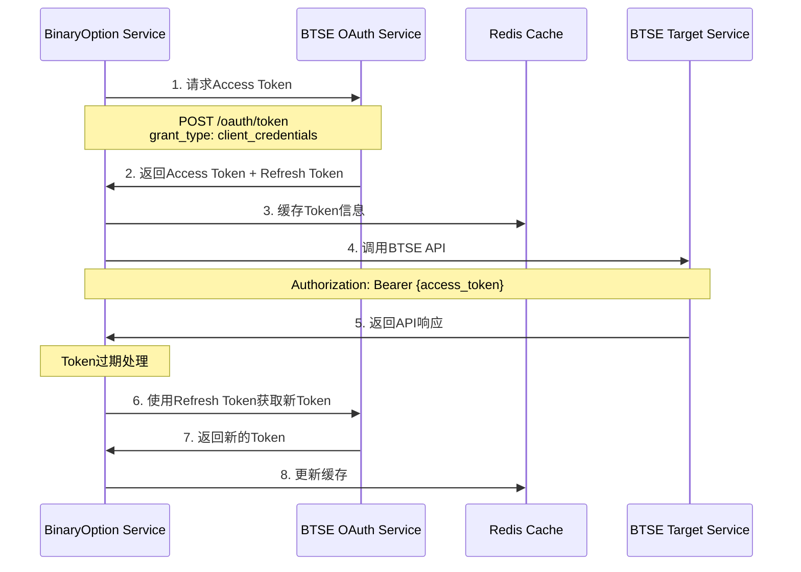

# BTSE Server-to-Server 认证接入方案

## 文档信息
- **创建时间**: 2025-08-19
- **文档版本**: v1.0
- **负责人**: 后端开发团队
- **文档类型**: 技术设计文档

---

## 1. 概述

### 1.1 项目背景
二元期权交易平台需要与BTSE系统进行服务间通信，包括：
- 用户账户余额查询
- 资金转账操作
- 交易对冲操作
- 其他BTSE API调用

### 1.2 认证方案
BTSE提供Server-to-Server认证方案，基于OAuth 2.0 Client Credentials流程，适用于服务间安全通信。

### 1.3 技术目标
- 实现安全的服务间认证机制
- 自动化token管理（获取、刷新、过期处理）
- 统一的BTSE API调用封装
- 完善的错误处理和重试机制
- 支持多环境配置（Dev/Staging/Testnet/Production）

---

## 2. BTSE Server-to-Server 认证机制

### 2.1 认证流程



### 2.2 Token获取API

#### 2.2.1 初始Token获取
**接口**: `POST /oauth/token`
**Content-Type**: `application/json`

**请求体**:
```json
{
  "client_id": "{{CLIENT_ID}}",
  "client_secret": "{{CLIENT_SECRET}}",
  "grant_type": "client_credentials",
  "scope": "wallet.read trade.read"
}
```

**响应体**:
```json
{
  "access_token": "eyJ0eXAiOiJKV1QiLCJhbGciOiJIUzI1NiJ9...",
  "token_type": "bearer",
  "expires_in": 86400,
  "refresh_token": "d06a99080e1f94c8de86b57ae866d1dc...",
  "refresh_token_expires_in": 172800,
  "scope": "wallet.read trade.read"
}
```

#### 2.2.2 Token刷新
**请求体**:
```json
{
  "client_id": "{{CLIENT_ID}}",
  "client_secret": "{{CLIENT_SECRET}}",
  "grant_type": "refresh_token",
  "refresh_token": "{{REFRESH_TOKEN}}",
  "scope": "wallet.read trade.read"
}
```

### 2.3 Redis缓存结构

**Key格式**: `OAuth:AccessToken:{access_token}`

**Value示例**:
```json
{
  "accessToken": "eyJ0eXAiOiJKV1QiLCJhbGciOiJIUzI1NiJ9...",
  "tokenType": "bearer",
  "expireTime": 1678791401849,
  "username": null,
  "metadata": null,
  "clientId": "binaryoption",
  "scopes": ["wallet.read", "trade.read"],
  "grantType": "client_credentials",
  "refreshToken": "d06a99080e1f94c8de86b57ae866d1dc...",
  "refreshTokenExpiresIn": 172800,
  "idToken": null,
  "deviceType": null,
  "deviceId": null,
  "extraMetadata": null
}
```

---

## 3. 环境配置

### 3.1 BTSE API端点

| 环境 | OAuth Token API | 说明 |
|------|----------------|------|
| Dev | https://api.btse.dev/oauth/token | 开发环境 |
| Staging | https://api.btse.co/oauth/token | 测试环境 |
| Testnet | https://testapi.btse.io/oauth/token | 测试网络 |
| Production | https://api.btse.com/oauth/token | 生产环境 |

### 3.2 Client凭证管理

**注意**: 各环境的Client ID相同，但Secret不同，需要分别申请配置。

```yaml
# application-dev.yml
btse:
  oauth:
    client-id: "binaryoption"
    client-secret: "${BTSE_DEV_CLIENT_SECRET}"
    base-url: "https://api.btse.dev"
    scopes: "wallet.read wallet.write trade.read"

# application-staging.yml  
btse:
  oauth:
    client-id: "binaryoption"
    client-secret: "${BTSE_STAGING_CLIENT_SECRET}"
    base-url: "https://api.btse.co"
    scopes: "wallet.read wallet.write trade.read"

# application-production.yml
btse:
  oauth:
    client-id: "binaryoption"
    client-secret: "${BTSE_PROD_CLIENT_SECRET}"
    base-url: "https://api.btse.com"
    scopes: "wallet.read wallet.write trade.read"
```

---

## 4. 技术实现方案

### 4.1 核心组件设计

#### 4.1.1 BtseOAuthService
负责OAuth token的生命周期管理

```java
@Service
public class BtseOAuthService {
    
    // Token获取
    public BtseTokenResponse getAccessToken()
    
    // Token刷新
    public BtseTokenResponse refreshAccessToken(String refreshToken)
    
    // Token验证和自动刷新
    public String getValidAccessToken()
    
    // Token缓存管理
    private void cacheTokenInfo(BtseTokenResponse tokenResponse)
    private BtseTokenInfo getCachedTokenInfo()
}
```

#### 4.1.2 BtseApiClient
统一的BTSE API调用客户端

```java
@Component
public class BtseApiClient {
    
    // 通用API调用方法
    public <T> T callApi(String endpoint, Object request, Class<T> responseType)
    
    // GET请求
    public <T> T get(String endpoint, Class<T> responseType)
    
    // POST请求  
    public <T> T post(String endpoint, Object request, Class<T> responseType)
    
    // 自动添加Authorization header
    private HttpHeaders createAuthHeaders()
}
```

#### 4.1.3 BtseTokenManager
Token管理和自动续期

```java
@Component
public class BtseTokenManager {
    
    // 检查token是否即将过期
    public boolean isTokenExpiringSoon(BtseTokenInfo tokenInfo)
    
    // 自动刷新token
    @Scheduled(fixedRate = 300000) // 5分钟检查一次
    public void autoRefreshToken()
    
    // 处理token过期异常
    public void handleTokenExpiration()
}
```

### 4.2 配置类

#### 4.2.1 BtseOAuthProperties
```java
@ConfigurationProperties(prefix = "btse.oauth")
@Data
public class BtseOAuthProperties {
    private String clientId;
    private String clientSecret;
    private String baseUrl;
    private String scopes;
    private int tokenRefreshBuffer = 300; // 提前5分钟刷新
    private int maxRetryAttempts = 3;
    private int retryDelay = 1000;
}
```

#### 4.2.2 BtseApiConfig
```java
@Configuration
@EnableConfigurationProperties(BtseOAuthProperties.class)
public class BtseApiConfig {
    
    @Bean
    public RestTemplate btseRestTemplate() {
        // 配置RestTemplate，包括连接池、超时等
    }
    
    @Bean
    public BtseOAuthService btseOAuthService() {
        // 创建OAuth服务实例
    }
}
```

### 4.3 数据模型

#### 4.3.1 Token响应模型
```java
@Data
public class BtseTokenResponse {
    @JsonProperty("access_token")
    private String accessToken;
    
    @JsonProperty("token_type")
    private String tokenType;
    
    @JsonProperty("expires_in")
    private Long expiresIn;
    
    @JsonProperty("refresh_token")
    private String refreshToken;
    
    @JsonProperty("refresh_token_expires_in")
    private Long refreshTokenExpiresIn;
    
    private String scope;
}
```

#### 4.3.2 Token缓存模型
```java
@Data
public class BtseTokenInfo {
    private String accessToken;
    private String tokenType;
    private Long expireTime; // 时间戳
    private String clientId;
    private List<String> scopes;
    private String grantType;
    private String refreshToken;
    private Long refreshTokenExpiresIn;
    
    // 计算是否过期
    public boolean isExpired() {
        return System.currentTimeMillis() >= expireTime;
    }
    
    // 计算是否即将过期
    public boolean isExpiringSoon(int bufferSeconds) {
        return System.currentTimeMillis() >= (expireTime - bufferSeconds * 1000);
    }
}
```

---

## 5. 核心服务实现

### 5.1 BtseOAuthService实现

```java
@Service
@Slf4j
public class BtseOAuthService {
    
    @Autowired
    private BtseOAuthProperties properties;
    
    @Autowired
    private RestTemplate btseRestTemplate;
    
    @Autowired
    private RedisTemplate<String, String> redisTemplate;
    
    private static final String REDIS_TOKEN_KEY_PREFIX = "OAuth:AccessToken:";
    
    /**
     * 获取有效的Access Token (自动处理刷新)
     */
    public String getValidAccessToken() {
        BtseTokenInfo cachedToken = getCachedTokenInfo();
        
        // 检查缓存的token
        if (cachedToken != null) {
            if (!cachedToken.isExpiringSoon(properties.getTokenRefreshBuffer())) {
                return cachedToken.getAccessToken();
            }
            
            // Token即将过期，尝试刷新
            if (cachedToken.getRefreshToken() != null) {
                try {
                    BtseTokenResponse refreshed = refreshAccessToken(cachedToken.getRefreshToken());
                    cacheTokenInfo(refreshed);
                    return refreshed.getAccessToken();
                } catch (Exception e) {
                    log.warn("Failed to refresh token, will get new token", e);
                }
            }
        }
        
        // 获取新token
        BtseTokenResponse newToken = getAccessToken();
        cacheTokenInfo(newToken);
        return newToken.getAccessToken();
    }
    
    /**
     * 获取新的Access Token
     */
    public BtseTokenResponse getAccessToken() {
        Map<String, String> requestBody = Map.of(
            "client_id", properties.getClientId(),
            "client_secret", properties.getClientSecret(),
            "grant_type", "client_credentials",
            "scope", properties.getScopes()
        );
        
        HttpHeaders headers = new HttpHeaders();
        headers.setContentType(MediaType.APPLICATION_JSON);
        
        HttpEntity<Map<String, String>> request = new HttpEntity<>(requestBody, headers);
        
        try {
            ResponseEntity<BtseTokenResponse> response = btseRestTemplate.postForEntity(
                properties.getBaseUrl() + "/oauth/token",
                request,
                BtseTokenResponse.class
            );
            
            if (response.getStatusCode().is2xxSuccessful() && response.getBody() != null) {
                log.info("Successfully obtained BTSE access token");
                return response.getBody();
            } else {
                throw new BtseApiException("Failed to obtain access token: " + response.getStatusCode());
            }
        } catch (Exception e) {
            log.error("Error obtaining BTSE access token", e);
            throw new BtseApiException("Failed to obtain access token", e);
        }
    }
    
    /**
     * 刷新Access Token
     */
    public BtseTokenResponse refreshAccessToken(String refreshToken) {
        Map<String, String> requestBody = Map.of(
            "client_id", properties.getClientId(),
            "client_secret", properties.getClientSecret(),
            "grant_type", "refresh_token",
            "refresh_token", refreshToken,
            "scope", properties.getScopes()
        );
        
        HttpHeaders headers = new HttpHeaders();
        headers.setContentType(MediaType.APPLICATION_JSON);
        
        HttpEntity<Map<String, String>> request = new HttpEntity<>(requestBody, headers);
        
        try {
            ResponseEntity<BtseTokenResponse> response = btseRestTemplate.postForEntity(
                properties.getBaseUrl() + "/oauth/token",
                request,
                BtseTokenResponse.class
            );
            
            if (response.getStatusCode().is2xxSuccessful() && response.getBody() != null) {
                log.info("Successfully refreshed BTSE access token");
                return response.getBody();
            } else {
                throw new BtseApiException("Failed to refresh access token: " + response.getStatusCode());
            }
        } catch (Exception e) {
            log.error("Error refreshing BTSE access token", e);
            throw new BtseApiException("Failed to refresh access token", e);
        }
    }
    
    /**
     * 缓存Token信息到Redis
     */
    private void cacheTokenInfo(BtseTokenResponse tokenResponse) {
        BtseTokenInfo tokenInfo = new BtseTokenInfo();
        tokenInfo.setAccessToken(tokenResponse.getAccessToken());
        tokenInfo.setTokenType(tokenResponse.getTokenType());
        tokenInfo.setExpireTime(System.currentTimeMillis() + tokenResponse.getExpiresIn() * 1000);
        tokenInfo.setClientId(properties.getClientId());
        tokenInfo.setScopes(Arrays.asList(properties.getScopes().split(" ")));
        tokenInfo.setGrantType("client_credentials");
        tokenInfo.setRefreshToken(tokenResponse.getRefreshToken());
        tokenInfo.setRefreshTokenExpiresIn(tokenResponse.getRefreshTokenExpiresIn());
        
        String redisKey = REDIS_TOKEN_KEY_PREFIX + tokenResponse.getAccessToken();
        String tokenJson = JsonUtils.toJson(tokenInfo);
        
        // 设置过期时间比token过期时间短一些
        long ttlSeconds = tokenResponse.getExpiresIn() - 60;
        redisTemplate.opsForValue().set(redisKey, tokenJson, ttlSeconds, TimeUnit.SECONDS);
        
        log.debug("Cached BTSE token info to Redis with TTL: {} seconds", ttlSeconds);
    }
    
    /**
     * 从Redis获取缓存的Token信息
     */
    private BtseTokenInfo getCachedTokenInfo() {
        // 这里需要实现一个机制来找到当前有效的token
        // 可以使用额外的键来存储当前token的引用
        String currentTokenKey = "OAuth:CurrentToken:" + properties.getClientId();
        String currentToken = redisTemplate.opsForValue().get(currentTokenKey);
        
        if (currentToken != null) {
            String tokenJson = redisTemplate.opsForValue().get(REDIS_TOKEN_KEY_PREFIX + currentToken);
            if (tokenJson != null) {
                return JsonUtils.fromJson(tokenJson, BtseTokenInfo.class);
            }
        }
        
        return null;
    }
}
```

### 5.2 BtseApiClient实现

```java
@Component
@Slf4j
public class BtseApiClient {
    
    @Autowired
    private BtseOAuthService oauthService;
    
    @Autowired
    private BtseOAuthProperties properties;
    
    @Autowired
    private RestTemplate btseRestTemplate;
    
    /**
     * 通用API调用方法
     */
    public <T> T callApi(String endpoint, Object request, Class<T> responseType, HttpMethod method) {
        String url = properties.getBaseUrl() + endpoint;
        
        int retryCount = 0;
        Exception lastException = null;
        
        while (retryCount <= properties.getMaxRetryAttempts()) {
            try {
                HttpHeaders headers = createAuthHeaders();
                HttpEntity<?> httpEntity = new HttpEntity<>(request, headers);
                
                ResponseEntity<T> response = btseRestTemplate.exchange(
                    url, method, httpEntity, responseType
                );
                
                if (response.getStatusCode().is2xxSuccessful()) {
                    return response.getBody();
                } else {
                    throw new BtseApiException("API call failed: " + response.getStatusCode());
                }
                
            } catch (HttpClientErrorException e) {
                if (e.getStatusCode() == HttpStatus.UNAUTHORIZED && retryCount == 0) {
                    // Token可能过期，清除缓存并重试
                    log.warn("Received 401, clearing token cache and retrying");
                    clearTokenCache();
                    retryCount++;
                    continue;
                }
                lastException = e;
                break;
            } catch (Exception e) {
                lastException = e;
                if (retryCount < properties.getMaxRetryAttempts()) {
                    log.warn("API call failed, retrying in {} ms. Attempt: {}/{}", 
                        properties.getRetryDelay(), retryCount + 1, properties.getMaxRetryAttempts());
                    
                    try {
                        Thread.sleep(properties.getRetryDelay());
                    } catch (InterruptedException ie) {
                        Thread.currentThread().interrupt();
                        break;
                    }
                }
                retryCount++;
            }
        }
        
        throw new BtseApiException("API call failed after " + retryCount + " attempts", lastException);
    }
    
    /**
     * GET请求
     */
    public <T> T get(String endpoint, Class<T> responseType) {
        return callApi(endpoint, null, responseType, HttpMethod.GET);
    }
    
    /**
     * POST请求
     */
    public <T> T post(String endpoint, Object request, Class<T> responseType) {
        return callApi(endpoint, request, responseType, HttpMethod.POST);
    }
    
    /**
     * 创建带认证的请求头
     */
    private HttpHeaders createAuthHeaders() {
        HttpHeaders headers = new HttpHeaders();
        headers.setContentType(MediaType.APPLICATION_JSON);
        
        String accessToken = oauthService.getValidAccessToken();
        headers.setBearerAuth(accessToken);
        
        return headers;
    }
    
    /**
     * 清除token缓存
     */
    private void clearTokenCache() {
        // 实现清除当前token缓存的逻辑
        oauthService.clearCurrentTokenCache();
    }
}
```

---

## 6. 集成方案

### 6.1 现有服务集成

#### 6.1.1 BtseTransferService重构
```java
@Service
public class BtseTransferService {
    
    @Autowired
    private BtseApiClient btseApiClient;
    
    /**
     * 替换原有Mock实现
     */
    public TransferResponse transferFunds(TransferRequest request) {
        // 使用真实BTSE API
        return btseApiClient.post("/v1/transfer", request, TransferResponse.class);
    }
    
    /**
     * 查询用户余额
     */
    public BalanceResponse getUserBalance(String userId) {
        return btseApiClient.get("/v1/user/" + userId + "/balance", BalanceResponse.class);
    }
}
```

#### 6.1.2 BtseFixtureService重构
```java
@Service
public class BtseFixtureService {
    
    @Autowired
    private BtseApiClient btseApiClient;
    
    /**
     * 创建对冲订单
     */
    public FixtureResponse createFixture(FixtureRequest request) {
        return btseApiClient.post("/v1/fixture", request, FixtureResponse.class);
    }
    
    /**
     * 查询对冲订单状态
     */
    public FixtureStatusResponse getFixtureStatus(String fixtureId) {
        return btseApiClient.get("/v1/fixture/" + fixtureId, FixtureStatusResponse.class);
    }
}
```

### 6.2 配置开关

#### 6.2.1 Feature Toggle
```java
@ConfigurationProperties(prefix = "btse.integration")
@Data
public class BtseIntegrationProperties {
    private boolean enableRealApi = false; // 默认false，使用Mock
    private boolean enableServerToServerAuth = false;
}
```

#### 6.2.2 条件化Bean创建
```java
@Configuration
public class BtseServiceConfig {
    
    @Bean
    @ConditionalOnProperty(name = "btse.integration.enable-real-api", havingValue = "true")
    public BtseTransferService realBtseTransferService() {
        return new RealBtseTransferService();
    }
    
    @Bean
    @ConditionalOnProperty(name = "btse.integration.enable-real-api", havingValue = "false", matchIfMissing = true)
    public BtseTransferService mockBtseTransferService() {
        return new MockBtseTransferService();
    }
}
```

---

## 7. 错误处理和监控

### 7.1 异常处理

#### 7.1.1 自定义异常
```java
public class BtseApiException extends RuntimeException {
    private final String errorCode;
    private final int httpStatus;
    
    public BtseApiException(String message) {
        super(message);
        this.httpStatus = 500;
        this.errorCode = "BTSE_API_ERROR";
    }
    
    public BtseApiException(String message, Throwable cause) {
        super(message, cause);
        this.httpStatus = 500;
        this.errorCode = "BTSE_API_ERROR";
    }
    
    public BtseApiException(String message, int httpStatus, String errorCode) {
        super(message);
        this.httpStatus = httpStatus;
        this.errorCode = errorCode;
    }
}
```

#### 7.1.2 全局异常处理
```java
@RestControllerAdvice
public class BtseApiExceptionHandler {
    
    @ExceptionHandler(BtseApiException.class)
    public ResponseEntity<Result<Void>> handleBtseApiException(BtseApiException e) {
        log.error("BTSE API error: {}", e.getMessage(), e);
        
        return ResponseEntity.status(HttpStatus.INTERNAL_SERVER_ERROR)
            .body(Result.error("BTSE_API_ERROR", "BTSE服务调用失败: " + e.getMessage()));
    }
}
```

### 7.2 监控和日志

#### 7.2.1 Token状态监控
```java
@Component
@Slf4j
public class BtseTokenMonitor {
    
    @Autowired
    private BtseOAuthService oauthService;
    
    @Autowired
    private MeterRegistry meterRegistry;
    
    @EventListener
    @Async
    public void onTokenRefresh(BtseTokenRefreshEvent event) {
        // 记录token刷新指标
        meterRegistry.counter("btse.token.refresh").increment();
        log.info("BTSE token refreshed successfully");
    }
    
    @EventListener
    @Async
    public void onTokenError(BtseTokenErrorEvent event) {
        // 记录token错误指标
        meterRegistry.counter("btse.token.error").increment();
        log.error("BTSE token error: {}", event.getError());
    }
}
```

#### 7.2.2 API调用监控
```java
@Aspect
@Component
@Slf4j
public class BtseApiMonitorAspect {
    
    @Autowired
    private MeterRegistry meterRegistry;
    
    @Around("execution(* com.binaryoption.*.service.Btse*.*(..))")
    public Object monitorBtseApiCall(ProceedingJoinPoint joinPoint) throws Throwable {
        String methodName = joinPoint.getSignature().getName();
        Timer.Sample sample = Timer.start(meterRegistry);
        
        try {
            Object result = joinPoint.proceed();
            
            // 记录成功指标
            meterRegistry.counter("btse.api.call", "method", methodName, "status", "success").increment();
            sample.stop(Timer.builder("btse.api.duration")
                .tag("method", methodName)
                .tag("status", "success")
                .register(meterRegistry));
            
            return result;
        } catch (Exception e) {
            // 记录失败指标
            meterRegistry.counter("btse.api.call", "method", methodName, "status", "error").increment();
            sample.stop(Timer.builder("btse.api.duration")
                .tag("method", methodName)
                .tag("status", "error")
                .register(meterRegistry));
            
            throw e;
        }
    }
}
```

---

## 8. 测试方案

### 8.1 单元测试

#### 8.1.1 BtseOAuthService测试
```java
@ExtendWith(MockitoExtension.class)
class BtseOAuthServiceTest {
    
    @Mock
    private RestTemplate btseRestTemplate;
    
    @Mock
    private RedisTemplate<String, String> redisTemplate;
    
    @InjectMocks
    private BtseOAuthService btseOAuthService;
    
    @Test
    void shouldGetAccessTokenSuccessfully() {
        // 测试token获取
        BtseTokenResponse mockResponse = createMockTokenResponse();
        
        when(btseRestTemplate.postForEntity(anyString(), any(), eq(BtseTokenResponse.class)))
            .thenReturn(ResponseEntity.ok(mockResponse));
        
        BtseTokenResponse result = btseOAuthService.getAccessToken();
        
        assertThat(result.getAccessToken()).isNotNull();
        verify(btseRestTemplate).postForEntity(anyString(), any(), eq(BtseTokenResponse.class));
    }
    
    @Test
    void shouldRefreshTokenWhenExpiringSoon() {
        // 测试token自动刷新逻辑
    }
}
```

### 8.2 集成测试

#### 8.2.1 BTSE API集成测试
```java
@SpringBootTest
@TestPropertySource(properties = {
    "btse.integration.enable-real-api=true",
    "btse.oauth.base-url=https://api.btse.dev"
})
class BtseApiIntegrationTest {
    
    @Autowired
    private BtseApiClient btseApiClient;
    
    @Test
    @Disabled("需要真实的BTSE环境和凭证")
    void shouldCallBtseApiSuccessfully() {
        // 测试真实的BTSE API调用
        Object response = btseApiClient.get("/v1/health", Object.class);
        assertThat(response).isNotNull();
    }
}
```

### 8.3 测试脚本

#### 8.3.1 Server-to-Server认证测试脚本
```bash
#!/bin/bash
# test-scripts/btse-server-auth-test.sh

source test-scripts/common/redis-cluster.sh

echo "=== BTSE Server-to-Server 认证测试 ==="

# 1. 测试token获取
echo "1. 测试获取Access Token..."
curl -X POST "https://api.btse.dev/oauth/token" \
  -H "Content-Type: application/json" \
  -d '{
    "client_id": "'${BTSE_CLIENT_ID}'",
    "client_secret": "'${BTSE_CLIENT_SECRET}'",
    "grant_type": "client_credentials",
    "scope": "wallet.read"
  }' | jq '.'

# 2. 测试API调用
echo "2. 测试API调用..."
ACCESS_TOKEN=$(get_btse_access_token)

curl -X GET "https://api.btse.dev/v1/user/balance" \
  -H "Authorization: Bearer ${ACCESS_TOKEN}" \
  -H "Content-Type: application/json" | jq '.'

echo "=== 测试完成 ==="
```

---

## 9. 部署和运维

### 9.1 环境变量配置

```bash
# Dev环境
export BTSE_DEV_CLIENT_SECRET="dev_secret_from_btse"
export BTSE_OAUTH_BASE_URL="https://api.btse.dev"

# Staging环境  
export BTSE_STAGING_CLIENT_SECRET="staging_secret_from_btse"
export BTSE_OAUTH_BASE_URL="https://api.btse.co"

# Production环境
export BTSE_PROD_CLIENT_SECRET="prod_secret_from_btse"
export BTSE_OAUTH_BASE_URL="https://api.btse.com"
```

### 9.2 健康检查

#### 9.2.1 BTSE连接健康检查
```java
@Component
public class BtseHealthIndicator implements HealthIndicator {
    
    @Autowired
    private BtseApiClient btseApiClient;
    
    @Override
    public Health health() {
        try {
            // 调用BTSE健康检查端点
            btseApiClient.get("/v1/health", Object.class);
            return Health.up()
                .withDetail("btse", "Connected")
                .build();
        } catch (Exception e) {
            return Health.down()
                .withDetail("btse", "Connection failed")
                .withDetail("error", e.getMessage())
                .build();
        }
    }
}
```

### 9.3 监控告警

#### 9.3.1 关键指标
- Token获取成功率
- Token刷新频率  
- API调用成功率
- API响应时间
- 错误率和错误类型

#### 9.3.2 告警规则
- Token获取失败率 > 5%
- API调用失败率 > 10%
- API响应时间 > 5秒
- Token过期时间 < 10分钟

---

## 10. 现有代码架构分析和改造方案

### 10.1 现有代码架构

#### 10.1.1 当前实现结构
```
BtseApiClient (接口)
├── BtseMockApiClient (Mock实现)
│   ├── @Primary
│   ├── @ConditionalOnProperty(name = "btse.mock.enabled", havingValue = "true")
│   └── 完整的Mock数据生成逻辑
└── BtseApiClientImpl (真实实现)
    ├── @Primary  
    ├── @ConditionalOnProperty(name = "btse.mock.enabled", havingValue = "false")
    └── 真实API调用（待完善）
```

#### 10.1.2 关键组件
- **BtseApiClient**: 统一接口定义
- **BtseMockApiClient**: Mock实现，包含完整的模拟逻辑
- **BtseApiClientImpl**: 真实API实现框架（尚未完成）
- **BtseConfig**: 配置管理
- **BtseDataConverter**: 数据转换器

### 10.2 Server-to-Server认证改造方案

#### 10.2.1 新增OAuth认证层
```java
// 新增：BtseOAuthManager.java
@Component
public class BtseOAuthManager {
    private String currentAccessToken;
    private String currentRefreshToken;
    private LocalDateTime tokenExpireTime;
    private final Object tokenLock = new Object();
    
    // Server-to-Server认证
    public String getServiceAccessToken() {
        synchronized(tokenLock) {
            if (isTokenValid()) {
                return currentAccessToken;
            }
            return refreshOrGetNewToken();
        }
    }
    
    // 用户认证（保留现有逻辑）
    public BtseAuthResponseDTO verifyUserAuth(String userId, String token) {
        // 现有用户认证逻辑
    }
}
```

#### 10.2.2 改造BtseApiClientImpl
```java
@Component
public class BtseApiClientImpl implements BtseApiClient {
    
    @Autowired
    private BtseOAuthManager oauthManager;
    
    // 增强：添加Server-to-Server认证头
    private HttpHeaders createAuthHeaders() {
        HttpHeaders headers = new HttpHeaders();
        headers.setContentType(MediaType.APPLICATION_JSON);
        
        // Server-to-Server认证
        String serviceToken = oauthManager.getServiceAccessToken();
        headers.setBearerAuth(serviceToken);
        
        return headers;
    }
    
    // 示例：改造transfer方法
    @Override
    public BtseTransferResponseDTO transfer(BtseTransferRequestDTO request) {
        HttpHeaders headers = createAuthHeaders(); // 使用新的认证头
        // ... 其余逻辑保持不变
    }
}
```

#### 10.2.3 Mock实现增强
```java
@Component  
public class BtseMockApiClient implements BtseApiClient {
    
    @Autowired(required = false)
    private BtseOAuthManager oauthManager;
    
    // Mock Server-to-Server认证
    private void simulateServerAuth() {
        if (oauthManager != null) {
            // 模拟token获取延迟
            simulateDelay();
            log.info("[MOCK] Simulated server-to-server authentication");
        }
    }
    
    @Override
    public BtseTransferResponseDTO transfer(BtseTransferRequestDTO request) {
        simulateServerAuth(); // 模拟认证
        // ... 现有Mock逻辑
    }
}
```

### 10.3 配置架构优化

#### 10.3.1 分层配置设计
```yaml
# application.yml - 基础配置
btse:
  # Mock控制
  mock:
    enabled: true  # 全局Mock开关
    
  # OAuth配置（新增）
  oauth:
    server-to-server:
      enabled: false  # Server-to-Server认证开关
      client-id: "${BTSE_S2S_CLIENT_ID}"
      client-secret: "${BTSE_S2S_CLIENT_SECRET}"
      scope: "wallet.read wallet.write trade.read"
      token-refresh-buffer: 300  # 提前5分钟刷新
    
    user-auth:
      enabled: true  # 用户OAuth认证
      
  # API配置
  api:
    base-url: "${BTSE_API_BASE_URL:https://api.btse.dev}"
    timeout: 30000
    retry:
      max-attempts: 3
      delay: 1000
```

#### 10.3.2 环境特定配置
```yaml
# application-dev.yml
btse:
  mock:
    enabled: true  # 开发环境使用Mock
  oauth:
    server-to-server:
      enabled: false  # 暂不启用S2S

# application-staging.yml  
btse:
  mock:
    enabled: false  # 测试环境使用真实API
  oauth:
    server-to-server:
      enabled: true  # 启用S2S认证
      
# application-production.yml
btse:
  mock:
    enabled: false
  oauth:
    server-to-server:
      enabled: true
```

### 10.4 渐进式迁移策略

#### 10.4.1 Phase 1: OAuth基础设施 (第3周)
```java
// Step 1: 创建OAuth管理组件
- [ ] BtseOAuthManager.java - OAuth token管理
- [ ] BtseOAuthProperties.java - OAuth配置
- [ ] BtseTokenCache.java - Token缓存管理

// Step 2: 保持现有功能不变
- [ ] 确保Mock功能继续正常工作
- [ ] 不影响现有的用户认证流程
```

#### 10.4.2 Phase 2: API客户端改造 (第4周)
```java
// Step 1: 增强BtseApiClientImpl
- [ ] 添加createAuthHeaders()方法
- [ ] 改造所有API方法使用新认证
- [ ] 实现重试和错误处理

// Step 2: Mock客户端兼容
- [ ] BtseMockApiClient添加OAuth模拟
- [ ] 确保Mock和真实实现行为一致
```

#### 10.4.3 Phase 3: 特性开关和测试 (第5周)
```java
// Step 1: 实现特性开关
@Component
public class BtseApiClientFactory {
    
    @Autowired
    private BtseMockApiClient mockClient;
    
    @Autowired
    private BtseApiClientImpl realClient;
    
    @Autowired
    private BtseConfig config;
    
    public BtseApiClient getClient() {
        if (config.getMock().isEnabled()) {
            return mockClient;
        }
        return realClient;
    }
    
    // 支持运行时切换
    public BtseApiClient getClient(boolean useMock) {
        return useMock ? mockClient : realClient;
    }
}

// Step 2: 完整测试
- [ ] 单元测试覆盖Mock和真实实现
- [ ] 集成测试验证S2S认证流程
- [ ] 性能测试和压力测试
```

### 10.5 代码改造详细步骤

#### 10.5.1 创建OAuth Service
```bash
# 1. 创建OAuth相关类
option-common-service/src/main/java/com/binaryoption/commonservice/integration/oauth/
├── BtseOAuthManager.java       # OAuth管理器
├── BtseOAuthProperties.java    # OAuth配置
├── BtseTokenCache.java         # Token缓存
└── BtseOAuthException.java     # OAuth异常
```

#### 10.5.2 改造现有Client
```bash
# 2. 改造现有客户端
option-common-service/src/main/java/com/binaryoption/commonservice/integration/
├── BtseApiClient.java          # 保持不变
├── BtseMockApiClient.java      # 添加OAuth模拟
├── BtseApiClientImpl.java      # 添加S2S认证
└── BtseApiClientFactory.java   # 新增：客户端工厂
```

#### 10.5.3 更新配置类
```bash
# 3. 更新配置
option-common-service/src/main/java/com/binaryoption/commonservice/integration/
├── BtseConfig.java             # 添加OAuth配置
└── BtseApiConfig.java          # 新增：API配置类
```

### 10.6 测试策略

#### 10.6.1 Mock测试
```java
@Test
public void testMockClientWithOAuth() {
    // 配置Mock模式
    when(btseConfig.getMock().isEnabled()).thenReturn(true);
    when(btseConfig.getOauth().getServerToServer().isEnabled()).thenReturn(true);
    
    // 执行transfer
    BtseTransferResponseDTO response = mockClient.transfer(request);
    
    // 验证OAuth模拟被调用
    verify(oauthManager, times(1)).getServiceAccessToken();
    
    // 验证结果
    assertThat(response.getStatus()).isEqualTo("SUCCESS");
}
```

#### 10.6.2 集成测试
```java
@SpringBootTest
@TestPropertySource(properties = {
    "btse.mock.enabled=false",
    "btse.oauth.server-to-server.enabled=true"
})
public class BtseApiIntegrationTest {
    
    @Test
    @Disabled("需要真实BTSE环境")
    public void testRealApiWithS2SAuth() {
        // 测试真实API调用with S2S认证
    }
}
```

### 10.7 监控和日志增强

#### 10.7.1 OAuth监控指标
```java
@Component
public class BtseOAuthMetrics {
    
    @Autowired
    private MeterRegistry meterRegistry;
    
    // Token获取成功/失败计数
    private Counter tokenSuccessCounter;
    private Counter tokenFailureCounter;
    
    // Token刷新计数
    private Counter tokenRefreshCounter;
    
    // API调用认证成功/失败计数
    private Counter authSuccessCounter;
    private Counter authFailureCounter;
    
    @PostConstruct
    public void init() {
        tokenSuccessCounter = Counter.builder("btse.oauth.token.success")
            .description("Successful token acquisitions")
            .register(meterRegistry);
            
        tokenFailureCounter = Counter.builder("btse.oauth.token.failure")
            .description("Failed token acquisitions")
            .register(meterRegistry);
    }
}
```

#### 10.7.2 详细日志记录
```java
@Aspect
@Component
public class BtseApiLoggingAspect {
    
    @Around("@annotation(btseApiCall)")
    public Object logApiCall(ProceedingJoinPoint joinPoint, BtseApiCall btseApiCall) {
        String operation = btseApiCall.value();
        MDC.put("btse.operation", operation);
        MDC.put("btse.mock", String.valueOf(btseConfig.getMock().isEnabled()));
        MDC.put("btse.s2s", String.valueOf(btseConfig.getOauth().getServerToServer().isEnabled()));
        
        try {
            log.info("BTSE API Call: {} [Mock={}, S2S={}]", 
                operation, 
                btseConfig.getMock().isEnabled(),
                btseConfig.getOauth().getServerToServer().isEnabled());
                
            Object result = joinPoint.proceed();
            
            log.info("BTSE API Success: {}", operation);
            return result;
            
        } catch (Exception e) {
            log.error("BTSE API Failed: {}", operation, e);
            throw e;
        } finally {
            MDC.clear();
        }
    }
}
```

## 11. 迁移计划时间表

### 11.1 第3周：基础设施搭建
- **Day 1-2**: 创建OAuth管理组件
  - BtseOAuthManager实现
  - Token缓存机制
  - 配置类更新
  
- **Day 3-4**: Mock增强
  - 添加OAuth模拟逻辑
  - 保持向后兼容
  
- **Day 5**: 单元测试
  - OAuth组件测试
  - Mock OAuth测试

### 11.2 第4周：API客户端改造  
- **Day 1-2**: BtseApiClientImpl改造
  - 添加S2S认证
  - 统一错误处理
  
- **Day 3-4**: 特性开关实现
  - BtseApiClientFactory
  - 运行时切换支持
  
- **Day 5**: 集成测试
  - Mock/Real切换测试
  - OAuth流程测试

### 11.3 第5周：全面测试和优化
- **Day 1-2**: 端到端测试
  - 完整业务流程测试
  - 异常场景测试
  
- **Day 3-4**: 性能优化
  - Token缓存优化
  - 连接池调优
  
- **Day 5**: 文档和部署
  - 更新操作文档
  - 部署脚本准备

### 11.4 回滚方案

通过多层配置开关实现灵活回滚：
```yaml
btse:
  # Level 1: 完全Mock模式
  mock:
    enabled: true  # 立即回滚到纯Mock
    
  # Level 2: 禁用S2S认证
  oauth:
    server-to-server:
      enabled: false  # 禁用S2S，使用原有认证
      
  # Level 3: 降级特定功能
  features:
    use-mock-transfer: true  # 仅transfer使用Mock
    use-mock-fixture: false  # fixture使用真实API
```

---

## 12. 代码实现建议

### 12.1 BtseOAuthManager实现示例

```java
package com.binaryoption.commonservice.integration.oauth;

import lombok.extern.slf4j.Slf4j;
import org.springframework.beans.factory.annotation.Autowired;
import org.springframework.data.redis.core.RedisTemplate;
import org.springframework.http.*;
import org.springframework.stereotype.Component;
import org.springframework.web.client.RestTemplate;

import java.time.LocalDateTime;
import java.util.Map;
import java.util.concurrent.TimeUnit;

@Component
@Slf4j
public class BtseOAuthManager {
    
    @Autowired
    private BtseOAuthProperties properties;
    
    @Autowired
    private RestTemplate restTemplate;
    
    @Autowired
    private RedisTemplate<String, String> redisTemplate;
    
    private static final String REDIS_TOKEN_KEY = "btse:oauth:s2s:token";
    private static final String REDIS_REFRESH_KEY = "btse:oauth:s2s:refresh";
    
    /**
     * 获取有效的Service Access Token
     */
    public synchronized String getServiceAccessToken() {
        // 1. 尝试从Redis获取缓存的token
        String cachedToken = redisTemplate.opsForValue().get(REDIS_TOKEN_KEY);
        if (cachedToken != null) {
            log.debug("Using cached S2S token");
            return cachedToken;
        }
        
        // 2. 尝试使用refresh token刷新
        String refreshToken = redisTemplate.opsForValue().get(REDIS_REFRESH_KEY);
        if (refreshToken != null) {
            try {
                return refreshAccessToken(refreshToken);
            } catch (Exception e) {
                log.warn("Failed to refresh token, will get new token", e);
            }
        }
        
        // 3. 获取新的token
        return getNewAccessToken();
    }
    
    /**
     * 获取新的Access Token
     */
    private String getNewAccessToken() {
        if (!properties.getServerToServer().isEnabled()) {
            log.debug("S2S authentication is disabled");
            return "mock_s2s_token";
        }
        
        try {
            String url = properties.getBaseUrl() + "/oauth/token";
            
            Map<String, String> requestBody = Map.of(
                "client_id", properties.getServerToServer().getClientId(),
                "client_secret", properties.getServerToServer().getClientSecret(),
                "grant_type", "client_credentials",
                "scope", properties.getServerToServer().getScope()
            );
            
            HttpHeaders headers = new HttpHeaders();
            headers.setContentType(MediaType.APPLICATION_JSON);
            
            HttpEntity<Map<String, String>> request = new HttpEntity<>(requestBody, headers);
            
            ResponseEntity<Map> response = restTemplate.postForEntity(url, request, Map.class);
            
            if (response.getStatusCode().is2xxSuccessful() && response.getBody() != null) {
                Map<String, Object> body = response.getBody();
                String accessToken = (String) body.get("access_token");
                String refreshToken = (String) body.get("refresh_token");
                Integer expiresIn = (Integer) body.get("expires_in");
                
                // 缓存token（提前5分钟过期）
                long ttl = expiresIn - properties.getServerToServer().getTokenRefreshBuffer();
                redisTemplate.opsForValue().set(REDIS_TOKEN_KEY, accessToken, ttl, TimeUnit.SECONDS);
                
                // 缓存refresh token
                if (refreshToken != null) {
                    Integer refreshExpiresIn = (Integer) body.get("refresh_token_expires_in");
                    redisTemplate.opsForValue().set(REDIS_REFRESH_KEY, refreshToken, 
                        refreshExpiresIn != null ? refreshExpiresIn : 172800, TimeUnit.SECONDS);
                }
                
                log.info("Successfully obtained new S2S access token");
                return accessToken;
            }
            
            throw new BtseOAuthException("Failed to obtain access token");
            
        } catch (Exception e) {
            log.error("Error obtaining S2S access token", e);
            throw new BtseOAuthException("Failed to obtain access token", e);
        }
    }
    
    /**
     * 刷新Access Token
     */
    private String refreshAccessToken(String refreshToken) {
        // 类似getNewAccessToken，但使用refresh_token grant_type
        // 实现略...
        return getNewAccessToken(); // 简化实现
    }
    
    /**
     * 清除缓存的token
     */
    public void clearTokenCache() {
        redisTemplate.delete(REDIS_TOKEN_KEY);
        redisTemplate.delete(REDIS_REFRESH_KEY);
        log.info("Cleared S2S token cache");
    }
}
```

### 12.2 增强的BtseApiClientImpl示例

```java
package com.binaryoption.commonservice.integration;

import com.binaryoption.commonservice.integration.oauth.BtseOAuthManager;
import lombok.extern.slf4j.Slf4j;
import org.springframework.beans.factory.annotation.Autowired;
import org.springframework.http.*;
import org.springframework.retry.annotation.Backoff;
import org.springframework.retry.annotation.Retryable;
import org.springframework.stereotype.Component;
import org.springframework.web.client.HttpClientErrorException;
import org.springframework.web.client.RestTemplate;

@Component
@Slf4j
public class BtseApiClientImpl implements BtseApiClient {
    
    @Autowired
    private BtseOAuthManager oauthManager;
    
    @Autowired
    private RestTemplate btseRestTemplate;
    
    @Autowired
    private BtseConfig btseConfig;
    
    /**
     * 创建带S2S认证的请求头
     */
    private HttpHeaders createAuthHeaders() {
        HttpHeaders headers = new HttpHeaders();
        headers.setContentType(MediaType.APPLICATION_JSON);
        
        // 添加Server-to-Server认证
        if (btseConfig.getOauth().getServerToServer().isEnabled()) {
            String serviceToken = oauthManager.getServiceAccessToken();
            headers.setBearerAuth(serviceToken);
            log.debug("Added S2S Bearer token to request headers");
        }
        
        return headers;
    }
    
    /**
     * 通用API调用方法with重试
     */
    @Retryable(
        value = {HttpClientErrorException.class},
        maxAttempts = 3,
        backoff = @Backoff(delay = 1000)
    )
    private <T> ResponseEntity<T> callApi(String url, HttpMethod method, 
                                          Object requestBody, Class<T> responseType) {
        HttpHeaders headers = createAuthHeaders();
        HttpEntity<?> entity = new HttpEntity<>(requestBody, headers);
        
        try {
            return btseRestTemplate.exchange(url, method, entity, responseType);
        } catch (HttpClientErrorException e) {
            if (e.getStatusCode() == HttpStatus.UNAUTHORIZED) {
                // Token可能过期，清除缓存并重试
                log.warn("Received 401, clearing token cache");
                oauthManager.clearTokenCache();
                throw e; // 触发重试
            }
            throw e;
        }
    }
    
    @Override
    public BtseTransferResponseDTO transfer(BtseTransferRequestDTO request) {
        log.info("Executing transfer with S2S auth: {}", request);
        
        try {
            String url = btseConfig.getApi().getBaseUrl() + "/wallet/transfer";
            
            // 使用新的通用方法
            ResponseEntity<BtseApiResponseDTO> response = callApi(
                url, HttpMethod.POST, request, BtseApiResponseDTO.class
            );
            
            return dataConverter.convertTransferResponse(response.getBody());
            
        } catch (Exception e) {
            log.error("Failed to execute transfer", e);
            // 错误处理...
        }
    }
}
```

### 12.3 配置类更新

```java
package com.binaryoption.commonservice.integration.oauth;

import lombok.Data;
import org.springframework.boot.context.properties.ConfigurationProperties;
import org.springframework.stereotype.Component;

@Component
@ConfigurationProperties(prefix = "btse.oauth")
@Data
public class BtseOAuthProperties {
    
    private String baseUrl = "https://api.btse.dev";
    private ServerToServer serverToServer = new ServerToServer();
    private UserAuth userAuth = new UserAuth();
    
    @Data
    public static class ServerToServer {
        private boolean enabled = false;
        private String clientId;
        private String clientSecret;
        private String scope = "wallet.read wallet.write trade.read";
        private int tokenRefreshBuffer = 300; // 提前5分钟刷新
        private int maxRetryAttempts = 3;
        private int retryDelay = 1000;
    }
    
    @Data
    public static class UserAuth {
        private boolean enabled = true;
        private int tokenCacheTtl = 86400; // 24小时
    }
}
```

### 12.4 测试脚本

```bash
#!/bin/bash
# test-scripts/btse-s2s-test.sh

echo "=== BTSE Server-to-Server Authentication Test ==="

# 设置环境变量
export BTSE_S2S_CLIENT_ID="binaryoption"
export BTSE_S2S_CLIENT_SECRET="test_secret"
export BTSE_API_BASE_URL="https://api.btse.dev"

# 1. 测试Mock模式
echo "1. Testing Mock Mode..."
curl -X POST "http://localhost:8081/test/btse/transfer" \
  -H "Content-Type: application/json" \
  -H "X-Mock-Mode: true" \
  -d '{
    "userId": "test_user",
    "amount": 100,
    "currency": "USDT",
    "direction": "IN"
  }' | jq '.'

# 2. 测试S2S认证模式
echo "2. Testing S2S Auth Mode..."
curl -X POST "http://localhost:8081/test/btse/transfer" \
  -H "Content-Type: application/json" \
  -H "X-Mock-Mode: false" \
  -H "X-S2S-Auth: true" \
  -d '{
    "userId": "test_user",
    "amount": 100,
    "currency": "USDT",
    "direction": "IN"
  }' | jq '.'

# 3. 测试Token刷新
echo "3. Testing Token Refresh..."
sleep 5
curl -X POST "http://localhost:8081/test/btse/token/refresh" \
  -H "Content-Type: application/json" | jq '.'

echo "=== Test Complete ==="
```

## 13. 风险和注意事项

### 11.1 主要风险
1. **BTSE API可用性**: 依赖BTSE服务稳定性
2. **网络延迟**: 外部API调用的网络风险
3. **凭证泄露**: Client Secret的安全管理
4. **Token过期**: 自动刷新机制的可靠性

### 11.2 缓解措施
1. **服务降级**: 保留Mock实现作为fallback
2. **重试机制**: 实现指数退避重试
3. **凭证管理**: 使用环境变量和密钥管理服务
4. **监控告警**: 实时监控token状态和API调用

### 11.3 注意事项
- Token刷新要提前进行，避免过期
- API调用要有合适的超时设置
- 错误处理要细致，区分不同类型的错误
- 日志记录要详细但避免记录敏感信息

---

## 12. 附录

### 12.1 相关文档
- [BTSE OAuth OpenAPI文档](https://api.btse.co/oauth/openapi)
- [RFC 6749 - OAuth 2.0](https://tools.ietf.org/html/rfc6749)
- [Spring Security OAuth2 Client](https://docs.spring.io/spring-security/reference/servlet/oauth2/client/index.html)

### 12.2 更新记录
| 版本 | 日期 | 更新内容 | 更新人 |
|------|------|----------|--------|
| v1.0 | 2025-08-19 | 初始版本 | 后端开发团队 |

---

**下次更新**: 根据实际实施进度进行更新