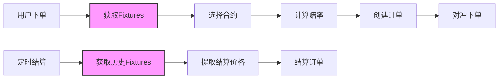

# Fixture接入方案 - 最新版

## 1. 概述

本文档基于真实的BTSE API数据，描述二元期权交易系统与BTSE Fixture API的完整集成方案。

### 1.1 核心设计原则

1. **价格映射清晰**：下单使用`FixturesResponse.price`，结算使用`closed[].priceUnderlying`
2. **数据结构真实**：基于实际BTSE API响应设计DTO
3. **代码简洁高效**：消除冗余代码，提取可配置逻辑
4. **易于维护**：Symbol转换逻辑独立，便于后续调整

## 2. 数据结构设计

### 2.1 FixturesResponseDTO - 基于真实BTSE数据

```java
package com.binaryoption.commondto.btse;

@Data
@Builder
@NoArgsConstructor
@AllArgsConstructor
public class FixturesResponseDTO {
    
    /**
     * 交易对符号 (例如: "BTC-USD")
     */
    private String symbol;
    
    /**
     * 当前市场价格
     * 下单时使用此价格作为order_price
     */
    private BigDecimal price;
    
    /**
     * 开放的期权合约列表
     * 用于下单时选择合适的合约
     */
    private List<FixtureDTO> open;
    
    /**
     * 已关闭的期权合约列表
     * 用于结算时获取历史价格
     */
    private List<FixtureDTO> closed;
}
```

### 2.2 FixtureDTO - 完整合约信息

```java
@Data
@Builder
@NoArgsConstructor
@AllArgsConstructor
public class FixtureDTO {
    
    /**
     * 到期时间 (例如: "2025-09-19 13:40:00")
     */
    private LocalDateTime expiration;
    
    /**
     * 期权类型: "call" 或 "put"
     */
    private String side;
    
    /**
     * 期权价格
     * 用于计算赔率: odds = 1/price
     */
    private BigDecimal price;
    
    /**
     * 行权价格
     */
    private BigDecimal strike;
    
    /**
     * 标的资产价格（结算价格）
     * closed数组中此字段包含历史市场价格
     */
    private BigDecimal priceUnderlying;
    
    /**
     * 是否价内 (In The Money)
     */
    private Boolean itm;
    
    /**
     * 未平仓合约数量
     */
    private Integer openInterest;
    
    /**
     * 未平仓合约价值
     */
    private BigDecimal openInterestValue;
}
```

### 2.3 NewbetRequestDTO - 对冲请求

```java
@Data
@Builder
public class NewbetRequestDTO {
    
    private String symbol;              // 交易对
    private LocalDateTime expiration;   // 到期时间
    private String side;                // "call" 或 "put"
    private BigDecimal currentPrice;    // 当前市场价格 (priceUnderlying)
    private BigDecimal price;           // 期权价格
    private BigDecimal amount;          // 投注金额
    
    // 标识信息
    private String tradeId;             // 订单ID: bo_option_order.id
    private String exchangeId;          // 固定值: "BinaryOption"
    private String userId;              // 用户ID: bo_option_order.user_id
}
```

## 3. API数据流

### 3.1 完整业务流程



### 3.2 下单阶段数据映射

**真实BTSE响应数据**:
```json
{
  "symbol": "BTC-USD",
  "price": 116259.85,                    // ⭐ 下单价格
  "open": [
    {
      "expiration": "2025-09-19 13:45:00",
      "side": "call",
      "price": 0.5191042040783408        // ⭐ 用于计算赔率
    }
  ]
}
```

**数据映射**:
- `response.price` → `order.order_price` (116259.85)
- `1/open[0].price` → `order.odds` (1/0.5191 ≈ 1.926)

### 3.3 结算阶段数据映射

**真实BTSE响应数据** (includeExpiredAfter=2025-09-19 13:39:55):
```json
{
  "symbol": "BTC-USD",
  "price": 116259.85,                    // 当前价格（非结算价格）
  "closed": [
    {
      "expiration": "2025-09-19 13:40:00",
      "strike": 116215.75,
      "side": "put",
      "price": 0.4688106304464619,       // 期权价格（非结算价格）
      "priceUnderlying": 116271.75,      // ⭐ 结算价格
      "itm": false,
      "openInterest": 1,
      "openInterestValue": 5
    }
  ]
}
```

**数据映射**:
- `closed[0].priceUnderlying` → `order.settle_price` (116271.75)

## 4. 核心代码实现

### 4.1 Symbol转换工具类（独立可配置）

```java
@Component
public class SymbolConverter {
    
    @Value("${btse.symbol.conversion.enabled:true}")
    private boolean conversionEnabled;
    
    /**
     * 转换前端Symbol到BTSE Symbol
     * USDT -> USD (可配置开关)
     */
    public String toExternalSymbol(String symbol) {
        if (!conversionEnabled) {
            return symbol;
        }
        
        if (symbol != null && symbol.endsWith("-USDT")) {
            return symbol.replace("-USDT", "-USD");
        }
        return symbol;
    }
    
    /**
     * 转换BTSE Symbol到前端Symbol
     * USD -> USDT (可配置开关)
     */
    public String toInternalSymbol(String symbol) {
        if (!conversionEnabled) {
            return symbol;
        }
        
        if (symbol != null && symbol.endsWith("-USD")) {
            return symbol.replace("-USD", "-USDT");
        }
        return symbol;
    }
}
```

### 4.2 优化后的FixtureService

```java
@Service
@Slf4j
@RequiredArgsConstructor
public class FixtureService {
    
    private final BtseRpcClient btseRpcClient;
    private final SymbolService symbolService;
    private final SymbolConverter symbolConverter;
    
    /**
     * 为订单选择合适的Fixture并计算赔率
     */
    public FixtureSelectionResult selectFixtureForOrder(Long symbolId, String direction, 
                                                       LocalDateTime roundTime, Integer durationMinutes) {
        // 1. 获取symbol并转换
        String internalSymbol = symbolService.getBtseSymbolById(symbolId);
        String externalSymbol = symbolConverter.toExternalSymbol(internalSymbol);
        
        // 2. 调用BTSE API
        FixturesResponseDTO fixtures = fetchFixtures(externalSymbol, null);
        
        // 3. 选择合适的fixture
        String side = convertDirectionToSide(direction);
        FixtureDTO fixture = selectBySide(fixtures.getOpen(), side);
        
        // 4. 计算赔率
        BigDecimal odds = calculateOdds(fixture.getPrice());
        
        return FixtureSelectionResult.builder()
            .fixture(fixture)
            .odds(odds)
            .symbol(internalSymbol)
            .currentPrice(fixtures.getPrice())
            .build();
    }
    
    /**
     * 执行订单对冲
     */
    public HedgeResult performOrderHedge(Long orderId, FixtureDTO fixture, 
                                        BigDecimal amount, Long userId) {
        
        NewbetRequestDTO request = NewbetRequestDTO.builder()
            .symbol(symbolConverter.toExternalSymbol(fixture.getSymbol()))
            .expiration(fixture.getExpiration())
            .side(fixture.getSide())
            .currentPrice(fixture.getPriceUnderlying())
            .price(fixture.getPrice())
            .amount(amount)
            // 使用真实的订单和用户信息
            .tradeId(String.valueOf(orderId))
            .exchangeId("BinaryOption")
            .userId(String.valueOf(userId))
            .build();
        
        Result<NewbetResponseDTO> result = btseRpcClient.createNewbet(request);
        
        return HedgeResult.builder()
            .success("ok".equals(result.getData().getStatus()))
            .message(result.getData().getMessage())
            .orderId(orderId)
            .hedgeAmount(amount)
            .hedgeTime(LocalDateTime.now())
            .build();
    }
    
    private BigDecimal calculateOdds(BigDecimal fixturePrice) {
        if (fixturePrice == null || fixturePrice.compareTo(BigDecimal.ZERO) <= 0) {
            return new BigDecimal("1.95");
        }
        
        // 赔率 = 1 / fixture.price
        BigDecimal odds = BigDecimal.ONE.divide(fixturePrice, 4, RoundingMode.HALF_UP);
        
        // 限制范围 [1.01, 10.0]
        return odds.max(new BigDecimal("1.01"))
                  .min(new BigDecimal("10.0"))
                  .setScale(2, RoundingMode.HALF_UP);
    }
    
    private FixtureDTO selectBySide(List<FixtureDTO> fixtures, String side) {
        return fixtures.stream()
            .filter(f -> side.equals(f.getSide()))
            .findFirst()
            .orElseThrow(() -> new BusinessException(500, "No fixture available for side: " + side));
    }
}
```

### 4.3 优化后的OrderSettlementService

```java
@Service
@Slf4j
@RequiredArgsConstructor
public class OrderSettlementService {
    
    private final SymbolConverter symbolConverter;
    
    /**
     * 获取轮次结算价格
     */
    private BigDecimal getSettlementPrice(String symbol, LocalDateTime settlementTime) {
        // 1. 查询时间提前5秒，确保包含目标轮次
        LocalDateTime queryTime = settlementTime.minusSeconds(5);
        
        // 2. 调用API获取历史数据
        String externalSymbol = symbolConverter.toExternalSymbol(symbol);
        FixturesResponseDTO fixtures = fetchFixtures(externalSymbol, queryTime);
        
        // 3. 从closed数组提取结算价格
        return extractSettlementPrice(fixtures.getClosed(), settlementTime);
    }
    
    /**
     * 从closed数组提取结算价格
     */
    private BigDecimal extractSettlementPrice(List<FixtureDTO> closedFixtures, 
                                             LocalDateTime settlementTime) {
        if (closedFixtures == null || closedFixtures.isEmpty()) {
            throw new BusinessException(500, "No closed fixtures for settlement");
        }
        
        // 找到最接近结算时间的fixture
        FixtureDTO closest = closedFixtures.stream()
            .filter(f -> f.getExpiration() != null && f.getPriceUnderlying() != null)
            .min(Comparator.comparing(f -> 
                Math.abs(Duration.between(settlementTime, f.getExpiration()).toSeconds())
            ))
            .orElseThrow(() -> new BusinessException(500, "No valid settlement price"));
        
        // 验证时间差在合理范围内（5分钟）
        long diffSeconds = Math.abs(Duration.between(settlementTime, closest.getExpiration()).toSeconds());
        if (diffSeconds > 300) {
            log.warn("Settlement time difference: {} seconds", diffSeconds);
        }
        
        log.info("Settlement price found: {} for time {}", 
                closest.getPriceUnderlying(), closest.getExpiration());
        
        return closest.getPriceUnderlying();
    }
}
```

### 4.4 Mock数据生成优化

```java
@Component
@ConditionalOnProperty(name = "btse.market-api.mock.enabled", havingValue = "true")
@Slf4j
public class BtseMarketMockApiClient implements BtseMarketApiClient {
    
    @Override
    public FixturesResponseDTO getFixtures(String symbol, LocalDateTime includeExpiredAfter) {
        log.info("Mock: Getting fixtures for symbol: {}", symbol);
        
        LocalDateTime now = LocalDateTime.now();
        BigDecimal currentPrice = generateMarketPrice(symbol);
        
        // 生成open fixtures
        List<FixtureDTO> openFixtures = generateOpenFixtures(now, symbol);
        
        // 生成closed fixtures (如果需要历史数据)
        List<FixtureDTO> closedFixtures = new ArrayList<>();
        if (includeExpiredAfter != null && includeExpiredAfter.isBefore(now)) {
            closedFixtures = generateClosedFixtures(includeExpiredAfter, symbol);
        }
        
        return FixturesResponseDTO.builder()
            .symbol(symbol)
            .price(currentPrice)
            .open(openFixtures)
            .closed(closedFixtures)
            .build();
    }
    
    private List<FixtureDTO> generateOpenFixtures(LocalDateTime baseTime, String symbol) {
        List<FixtureDTO> fixtures = new ArrayList<>();
        
        // 按5分钟间隔生成未来的fixtures
        for (int i = 1; i <= 3; i++) {
            LocalDateTime expiration = baseTime.plusMinutes(i * 5)
                .withSecond(0).withNano(0);
            
            BigDecimal optionPrice = generateOptionPrice();
            
            // 生成call和put两种
            fixtures.add(createFixture(expiration, "call", optionPrice, null, symbol));
            fixtures.add(createFixture(expiration, "put", optionPrice, null, symbol));
        }
        
        return fixtures;
    }
    
    private List<FixtureDTO> generateClosedFixtures(LocalDateTime targetTime, String symbol) {
        List<FixtureDTO> fixtures = new ArrayList<>();
        
        // 生成目标时间的已结算fixtures
        LocalDateTime expiration = targetTime.plusMinutes(5)
            .withMinute(targetTime.getMinute() / 5 * 5)
            .withSecond(0).withNano(0);
        
        // 所有同一轮次的fixtures共享相同的结算价格
        BigDecimal settlementPrice = generateMarketPrice(symbol);
        
        // 生成多个不同strike的fixtures
        for (int i = 0; i < 3; i++) {
            BigDecimal strike = settlementPrice.add(BigDecimal.valueOf((i - 1) * 10));
            
            fixtures.add(createFixture(expiration, "call", 
                generateOptionPrice(), settlementPrice, symbol)
                .toBuilder()
                .strike(strike)
                .itm(settlementPrice.compareTo(strike) > 0)
                .openInterest(ThreadLocalRandom.current().nextInt(1, 10))
                .openInterestValue(BigDecimal.valueOf(ThreadLocalRandom.current().nextInt(5, 50)))
                .build());
            
            fixtures.add(createFixture(expiration, "put", 
                generateOptionPrice(), settlementPrice, symbol)
                .toBuilder()
                .strike(strike)
                .itm(settlementPrice.compareTo(strike) < 0)
                .openInterest(ThreadLocalRandom.current().nextInt(1, 10))
                .openInterestValue(BigDecimal.valueOf(ThreadLocalRandom.current().nextInt(5, 50)))
                .build());
        }
        
        return fixtures;
    }
    
    private FixtureDTO createFixture(LocalDateTime expiration, String side, 
                                    BigDecimal price, BigDecimal priceUnderlying, String symbol) {
        return FixtureDTO.builder()
            .expiration(expiration)
            .side(side)
            .price(price)
            .priceUnderlying(priceUnderlying)
            .strike(generateMarketPrice(symbol))
            .itm(false)
            .openInterest(0)
            .openInterestValue(BigDecimal.ZERO)
            .build();
    }
    
    private BigDecimal generateMarketPrice(String symbol) {
        double basePrice = symbol.contains("BTC") ? 116000 : 4500;
        double variation = ThreadLocalRandom.current().nextDouble(-500, 500);
        return BigDecimal.valueOf(basePrice + variation)
            .setScale(2, RoundingMode.HALF_UP);
    }
    
    private BigDecimal generateOptionPrice() {
        // 期权价格通常在0.45-0.55之间（接近50%概率）
        return BigDecimal.valueOf(ThreadLocalRandom.current().nextDouble(0.45, 0.55))
            .setScale(10, RoundingMode.HALF_UP);
    }
}
```

## 5. 数据库设计

### 5.1 订单表结构 (bo_option_order)

| 字段名 | 类型 | 数据来源 | 说明 |
|--------|------|----------|------|
| `id` | BIGINT | 自增 | 主键，用作newbet的tradeId |
| `user_id` | BIGINT | 用户ID | 用作newbet的userId |
| `order_price` | DECIMAL(20,8) | `FixturesResponse.price` | 下单时市场价格 |
| `odds` | DECIMAL(10,4) | `1/fixture.price` | 计算得出的赔率 |
| `settle_price` | DECIMAL(20,8) | `closed[].priceUnderlying` | 结算时市场价格 |
| `expected_profit` | DECIMAL(20,8) | `amount * (odds - 1)` | 预期净利润 |

### 5.2 对冲记录表 (bo_hedge_log)

| 字段名 | 类型 | 说明 |
|--------|------|------|
| `order_id` | BIGINT | 关联订单ID |
| `trade_id` | VARCHAR(50) | BTSE返回的交易ID |
| `request_data` | JSON | newbet请求参数 |
| `response_data` | JSON | newbet响应结果 |
| `status` | VARCHAR(20) | 对冲状态 |
| `created_at` | TIMESTAMP | 创建时间 |

## 6. 配置管理

### 6.1 应用配置 (application.yml)

```yaml
btse:
  # Symbol转换配置（可随时关闭）
  symbol:
    conversion:
      enabled: true  # 设为false即可关闭USD/USDT转换
  
  # Mock API配置
  market-api:
    mock:
      enabled: ${BTSE_MOCK_ENABLED:false}
    base-url: ${BTSE_API_URL:https://api.btse.co/pricing-3.0/v3/api/}
  
  # 对冲配置
  hedge:
    exchange-id: "BinaryOption"
    enabled: true
```

## 7. 优化要点总结

### 7.1 已完成优化

1. ✅ **数据结构对齐**：FixtureDTO完全匹配真实BTSE数据
2. ✅ **Symbol转换独立**：便于后续移除或修改
3. ✅ **NewBet参数优化**：使用真实订单和用户信息
4. ✅ **Mock数据真实化**：生成更接近真实的测试数据
5. ✅ **代码精简**：移除冗余逻辑，提取公共方法

### 7.2 关键改进

| 优化项 | 改进内容 | 效果 |
|--------|---------|------|
| Symbol转换 | 独立工具类+配置开关 | 可随时关闭转换逻辑 |
| 对冲参数 | 使用真实订单/用户ID | 提高追溯性 |
| Mock数据 | 匹配真实数据结构 | 测试更可靠 |
| 结算逻辑 | 简化价格提取 | 减少出错可能 |

## 8. 测试要点

### 8.1 单元测试

```java
@Test
public void testSettlementPriceExtraction() {
    // 准备测试数据 - 基于真实BTSE响应
    List<FixtureDTO> closedFixtures = Arrays.asList(
        FixtureDTO.builder()
            .expiration(LocalDateTime.of(2025, 9, 19, 13, 40, 0))
            .priceUnderlying(new BigDecimal("116271.75"))
            .build(),
        FixtureDTO.builder()
            .expiration(LocalDateTime.of(2025, 9, 19, 13, 40, 0))
            .priceUnderlying(new BigDecimal("116271.75"))
            .build()
    );
    
    // 测试结算价格提取
    BigDecimal settlementPrice = extractSettlementPrice(
        closedFixtures, 
        LocalDateTime.of(2025, 9, 19, 13, 40, 0)
    );
    
    // 验证所有同轮次fixtures的priceUnderlying相同
    assertEquals(new BigDecimal("116271.75"), settlementPrice);
}
```

### 8.2 集成测试检查点

1. **下单流程**：验证order_price来自FixturesResponse.price
2. **赔率计算**：验证odds = 1/fixture.price且在[1.01, 10.0]范围内
3. **结算流程**：验证settle_price来自closed[].priceUnderlying
4. **Symbol转换**：开关测试，验证可正常关闭

## 9. 部署注意事项

### 9.1 环境变量

```bash
# 生产环境
BTSE_MOCK_ENABLED=false
BTSE_API_URL=https://api.btse.co/pricing-3.0/v3/api/

# 测试环境
BTSE_MOCK_ENABLED=true

# Symbol转换（需要时可关闭）
BTSE_SYMBOL_CONVERSION_ENABLED=false
```

### 9.2 监控指标

- Fixture API调用成功率
- 结算价格匹配率
- 对冲成功率
- Symbol转换性能影响

---

*文档版本：v5.0*  
*最后更新：2025-09-19*  
*基于真实BTSE API数据重新设计*