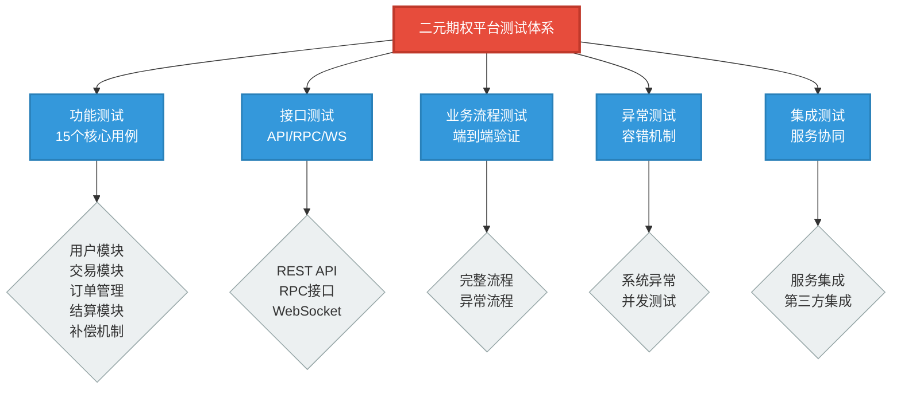

# 二元期权平台测试用例

> **文档版本**: v1.2  
> **最后更新**: 2025年8月28日  
> **维护者**: LL  
> **更新内容**: 新增OAuth认证、WebSocket行情、POST接口、轮次并发、系统重构等测试用例

## 测试体系思维导图

```mermaid
graph LR
    A[二元期权平台<br/>测试体系] --> B[功能测试]
    A --> C[接口测试]
    A --> D[业务流程测试]
    A --> G[异常测试]
    A --> H[集成测试]
    
    B --> B1[用户模块]
    B --> B2[交易模块]
    B --> B3[订单管理]
    B --> B4[结算模块]
    B --> B5[补偿机制]
    B --> B6[WebSocket行情]
    
    B1 --> B11[OAuth自动注册]
    B1 --> B12[BTSE认证登录]
    B1 --> B13[本地注册登录]
    B1 --> B14[账户类型切换]
    
    B2 --> B21[DEMO账户下单]
    B2 --> B22[REAL账户下单]
    B2 --> B23[余额不足处理]
    
    B3 --> B31[订单查询]
    B3 --> B32[订单详情]
    B3 --> B33[历史记录]
    
    B4 --> B41[DEMO盈利结算]
    B4 --> B42[REAL盈利结算]
    B4 --> B43[亏损结算]
    B4 --> B44[平局结算]
    
    B5 --> B51[未超时激活]
    B5 --> B52[超时退款]
    B5 --> B53[超时取消]
    
    B6 --> B61[JSON订阅格式]
    B6 --> B62[实时行情推送]
    B6 --> B63[心跳检测]
    
    C --> C1[REST API]
    C --> C2[RPC接口]
    C --> C3[WebSocket]
    
    C1 --> C11[OAuth认证接口]
    C1 --> C12[订单接口]
    C1 --> C13[查询接口]
    C1 --> C14[POST历史数据接口]
    
    C2 --> C21[用户服务]
    C2 --> C22[账户服务]
    C2 --> C23[补偿服务]
    
    C3 --> C31[实时行情推送]
    C3 --> C32[JSON命令解析]
    C3 --> C33[连接管理]
    
    D --> D1[完整交易流程]
    D --> D2[异常流程]
    
    D1 --> D11[OAuth自动注册流程]
    D1 --> D12[DEMO账户流程]
    D1 --> D13[REAL账户流程]
    
    D2 --> D21[BTSE转账失败]
    D2 --> D22[结算异常]
    D2 --> D23[补偿异常]
    D2 --> D24[轮次并发创建]
    
    G --> G1[系统异常]
    G --> G2[并发测试]
    
    G1 --> G11[数据库异常]
    G1 --> G12[Redis异常]
    G1 --> G13[网络异常]
    
    G2 --> G21[并发下单]
    G2 --> G22[并发结算]
    G2 --> G23[数据一致性]
    G2 --> G24[轮次并发创建]
    
    H --> H1[服务集成]
    H --> H2[第三方集成]
    
    H1 --> H11[Gateway路由]
    H1 --> H12[RPC调用]
    H1 --> H13[服务熔断]
    
    H2 --> H21[BTSE API]
    H2 --> H22[数据库事务]
    H2 --> H23[Redis集群]
    H2 --> H24[缓存一致性]
    
    style A fill:#ff6b6b,stroke:#333,stroke-width:4px,color:#fff
    style B fill:#4ecdc4,stroke:#333,stroke-width:2px
    style C fill:#4ecdc4,stroke:#333,stroke-width:2px
    style D fill:#4ecdc4,stroke:#333,stroke-width:2px
    style G fill:#4ecdc4,stroke:#333,stroke-width:2px
    style H fill:#4ecdc4,stroke:#333,stroke-width:2px
    
    style B1 fill:#95e1d3,stroke:#333,stroke-width:1px
    style B2 fill:#95e1d3,stroke:#333,stroke-width:1px
    style B3 fill:#95e1d3,stroke:#333,stroke-width:1px
    style B4 fill:#95e1d3,stroke:#333,stroke-width:1px
    style B5 fill:#95e1d3,stroke:#333,stroke-width:1px
    
    style C1 fill:#95e1d3,stroke:#333,stroke-width:1px
    style C2 fill:#95e1d3,stroke:#333,stroke-width:1px
    style C3 fill:#95e1d3,stroke:#333,stroke-width:1px
```



## 测试体系结构图（简化版）



## 目录

1. [功能测试用例](#功能测试用例)
2. [接口测试用例](#接口测试用例)
3. [业务流程测试用例](#业务流程测试用例)
4. [异常场景测试用例](#异常场景测试用例)
5. [集成测试用例](#集成测试用例)

---

## 功能测试用例

### 1. 用户注册登录模块

#### TC-001: OAuth Token自动注册认证
| 项目 | 内容 |
|------|------|
| 用例ID | TC-001 |
| 用例名称 | OAuth Token自动注册认证 |
| 前置条件 | 用户拥有有效的OAuth Token（存储在Redis集群） |
| 测试步骤 | 1. Gateway验证OAuth Token<br>2. 调用resolveOAuthUser RPC接口<br>3. 自动创建本地用户和账户<br>4. 返回用户信息 |
| 期望结果 | 1. 自动创建本地用户记录<br>2. 建立Mock用户ID映射关系<br>3. 创建DEMO和REAL账户<br>4. 返回正确的用户信息 |
| 优先级 | P0 |
| 测试脚本 | `./test-scripts/simple-flow-test-oauth.sh` |

#### TC-001-B: BTSE用户认证登录（传统方式）
| 项目 | 内容 |
|------|------|
| 用例ID | TC-001-B |
| 用例名称 | BTSE Token认证登录 |
| 前置条件 | 用户拥有有效的BTSE Token |
| 测试步骤 | 1. 访问登录接口<br>2. 提交BTSE Token<br>3. 验证返回结果 |
| 期望结果 | 1. 返回JWT Token<br>2. 创建用户记录<br>3. 创建DEMO和REAL账户 |
| 优先级 | P1 |
| 测试脚本 | `./test-scripts/check-services.sh` |

#### TC-002: 本地注册登录
| 项目 | 内容 |
|------|------|
| 用例ID | TC-002 |
| 用例名称 | 本地用户名密码注册登录 |
| 前置条件 | 测试环境启用本地认证 |
| 测试步骤 | 1. 提交注册信息<br>2. 验证注册结果<br>3. 使用账号密码登录 |
| 期望结果 | 1. 注册成功<br>2. 登录获得JWT Token<br>3. 账户信息正确 |
| 优先级 | P1 |

#### TC-003: 账户类型切换
| 项目 | 内容 |
|------|------|
| 用例ID | TC-003 |
| 用例名称 | DEMO/REAL账户切换 |
| 前置条件 | 用户已登录，拥有两种账户 |
| 测试步骤 | 1. 查看当前账户类型<br>2. 切换到另一账户类型<br>3. 验证余额和交易权限 |
| 期望结果 | 1. 切换成功<br>2. 显示正确的账户余额<br>3. 交易逻辑按账户类型执行 |
| 优先级 | P0 |

### 2. 交易下单模块

#### TC-004: DEMO账户下单
| 项目 | 内容 |
|------|------|
| 用例ID | TC-004 |
| 用例名称 | DEMO账户正常下单 |
| 前置条件 | 用户已登录DEMO账户，余额充足 |
| 测试步骤 | 1. 选择交易品种和方向<br>2. 输入下注金额<br>3. 提交订单 |
| 期望结果 | 1. 订单创建成功，状态为ACTIVE<br>2. 余额被冻结<br>3. 返回订单详情 |
| 优先级 | P0 |

#### TC-005: REAL账户下单
| 项目 | 内容 |
|------|------|
| 用例ID | TC-005 |
| 用例名称 | REAL账户正常下单 |
| 前置条件 | 用户已登录REAL账户，BTSE余额充足 |
| 测试步骤 | 1. 选择交易品种和方向<br>2. 输入下注金额<br>3. 提交订单 |
| 期望结果 | 1. 创建PENDING订单<br>2. BTSE转账成功后变为ACTIVE<br>3. frozen_balance增加 |
| 优先级 | P0 |

#### TC-006: 余额不足下单
| 项目 | 内容 |
|------|------|
| 用例ID | TC-006 |
| 用例名称 | 余额不足时下单 |
| 前置条件 | 账户余额小于下单金额 |
| 测试步骤 | 1. 输入超过余额的下注金额<br>2. 提交订单 |
| 期望结果 | 1. 下单失败<br>2. 返回余额不足错误<br>3. 不创建订单记录 |
| 优先级 | P1 |

### 3. 订单管理模块

#### TC-007: 订单查询
| 项目 | 内容 |
|------|------|
| 用例ID | TC-007 |
| 用例名称 | 查询订单列表 |
| 前置条件 | 用户已有订单记录 |
| 测试步骤 | 1. 调用订单查询接口<br>2. 使用不同筛选条件<br>3. 验证分页功能 |
| 期望结果 | 1. 返回订单列表<br>2. 筛选条件生效<br>3. 分页信息正确 |
| 优先级 | P1 |

#### TC-008: 订单详情查询
| 项目 | 内容 |
|------|------|
| 用例ID | TC-008 |
| 用例名称 | 查询单个订单详情 |
| 前置条件 | 存在有效的订单ID |
| 测试步骤 | 1. 使用订单ID查询详情<br>2. 验证返回信息完整性 |
| 期望结果 | 1. 返回完整订单信息<br>2. 包含状态、金额、时间等字段 |
| 优先级 | P1 |

### 4. 结算模块

#### TC-009: DEMO账户盈利结算
| 项目 | 内容 |
|------|------|
| 用例ID | TC-009 |
| 用例名称 | DEMO账户盈利订单结算 |
| 前置条件 | 存在ACTIVE状态的DEMO订单，预测正确 |
| 测试步骤 | 1. 触发结算任务<br>2. 验证盈亏计算<br>3. 检查资金变动 |
| 期望结果 | 1. 订单状态变为WIN<br>2. frozen_balance解冻<br>3. balance增加本金+利润-手续费 |
| 优先级 | P0 |

#### TC-010: REAL账户盈利结算
| 项目 | 内容 |
|------|------|
| 用例ID | TC-010 |
| 用例名称 | REAL账户盈利订单结算 |
| 前置条件 | 存在ACTIVE状态的REAL订单，预测正确 |
| 测试步骤 | 1. 触发结算任务<br>2. 验证盈亏计算<br>3. 检查BTSE转账记录 |
| 期望结果 | 1. 订单状态变为WIN<br>2. frozen_balance扣除<br>3. 净利润转出到BTSE<br>4. 记录btse_transfer_log |
| 优先级 | P0 |

#### TC-011: 亏损订单结算
| 项目 | 内容 |
|------|------|
| 用例ID | TC-011 |
| 用例名称 | 亏损订单结算 |
| 前置条件 | 存在ACTIVE状态的订单，预测错误 |
| 测试步骤 | 1. 触发结算任务<br>2. 验证亏损处理 |
| 期望结果 | 1. 订单状态变为LOSE<br>2. frozen_balance扣除<br>3. 不产生转账操作 |
| 优先级 | P0 |

#### TC-012: 平局订单结算
| 项目 | 内容 |
|------|------|
| 用例ID | TC-012 |
| 用例名称 | 平局订单结算 |
| 前置条件 | 存在ACTIVE状态的订单，结算价格等于开盘价 |
| 测试步骤 | 1. 触发结算任务<br>2. 验证平局处理逻辑 |
| 期望结果 | 1. 订单状态变为DRAW<br>2. DEMO账户：frozen_balance→balance<br>3. REAL账户：frozen_balance扣除，本金转回BTSE |
| 优先级 | P1 |

### 5. 补偿机制模块

#### TC-013: PENDING订单补偿-未超时激活
| 项目 | 内容 |
|------|------|
| 用例ID | TC-013 |
| 用例名称 | 未超时PENDING订单补偿激活 |
| 前置条件 | 存在未超过5秒的PENDING订单，BTSE转账成功 |
| 测试步骤 | 1. 调用补偿接口<br>2. 检查转账状态<br>3. 验证订单激活 |
| 期望结果 | 1. 订单状态变为ACTIVE<br>2. frozen_balance增加<br>3. 订单可正常参与结算 |
| 优先级 | P0 |

#### TC-014: PENDING订单补偿-超时已扣款
| 项目 | 内容 |
|------|------|
| 用例ID | TC-014 |
| 用例名称 | 超时PENDING订单补偿退款 |
| 前置条件 | 存在超过5秒的PENDING订单，BTSE转账成功 |
| 测试步骤 | 1. 调用补偿接口<br>2. 检查超时状态<br>3. 验证退款处理 |
| 期望结果 | 1. 订单状态变为CANCELLED<br>2. 资金退回BTSE<br>3. 记录退款流水 |
| 优先级 | P0 |

#### TC-015: PENDING订单补偿-超时未扣款
| 项目 | 内容 |
|------|------|
| 用例ID | TC-015 |
| 用例名称 | 超时PENDING订单补偿取消 |
| 前置条件 | 存在超过5秒的PENDING订单，BTSE转账失败 |
| 测试步骤 | 1. 调用补偿接口<br>2. 检查转账状态<br>3. 验证订单取消 |
| 期望结果 | 1. 订单状态变为CANCELLED<br>2. 不执行退款操作<br>3. 记录取消原因 |
| 优先级 | P0 |

### 6. WebSocket行情模块

#### TC-016: WebSocket连接和订阅
| 项目 | 内容 |
|------|------|
| 用例ID | TC-016 |
| 用例名称 | WebSocket实时行情连接和订阅 |
| 前置条件 | market-service服务运行正常 |
| 测试步骤 | 1. 连接WebSocket端点<br>2. 接收欢迎消息<br>3. 发送JSON订阅命令<br>4. 验证订阅确认 |
| 期望结果 | 1. 连接成功<br>2. 收到支持的交易对列表<br>3. 订阅成功确认<br>4. 开始接收实时行情数据 |
| 优先级 | P0 |
| WebSocket端点 | `ws://localhost:8083/ws/market` |
| 测试页面 | `http://localhost:8083/market-test.html` |

#### TC-017: JSON订阅格式测试
| 项目 | 内容 |
|------|------|
| 用例ID | TC-017 |
| 用例名称 | JSON格式订阅和取消订阅 |
| 前置条件 | WebSocket连接已建立 |
| 测试步骤 | 1. 发送`{"subscribe":"BTCUSDT"}`<br>2. 验证订阅成功<br>3. 发送`{"unsubscribe":"BTCUSDT"}`<br>4. 验证取消订阅成功 |
| 期望结果 | 1. 订阅命令解析正确<br>2. 开始接收BTCUSDT行情<br>3. 取消订阅成功<br>4. 停止接收该交易对行情 |
| 优先级 | P0 |

#### TC-018: 行情数据格式验证
| 项目 | 内容 |
|------|------|
| 用例ID | TC-018 |
| 用例名称 | 实时行情数据格式验证 |
| 前置条件 | 已订阅交易对行情 |
| 测试步骤 | 1. 接收行情数据<br>2. 验证数据格式<br>3. 检查时间格式<br>4. 验证Fixture数据 |
| 期望结果 | 1. 时间格式为`yyyy-MM-dd HH:mm:ss`<br>2. 价格波动在万分之1-5范围<br>3. 每轮包含call和put期权<br>4. 到期时间为duration整数倍 |
| 优先级 | P0 |

#### TC-019: 心跳检测
| 项目 | 内容 |
|------|------|
| 用例ID | TC-019 |
| 用例名称 | WebSocket心跳检测机制 |
| 前置条件 | WebSocket连接已建立 |
| 测试步骤 | 1. 发送`{"ping":true}`<br>2. 验证pong响应<br>3. 检查时间戳格式 |
| 期望结果 | 1. 收到pong响应<br>2. 响应包含当前时间戳<br>3. 连接保持活跃 |
| 优先级 | P1 |

---

## 接口测试用例

### 1. 认证接口

#### TC-API-001: OAuth认证接口

**测试场景**:
- 有效OAuth Token认证
- 无效OAuth Token认证
- Token过期认证
- Redis集群连接异常
- Gateway过滤器验证

#### TC-API-002: 用户信息接口

**测试场景**:
- 有效JWT Token
- 无效JWT Token
- Token过期
- 无Token访问

### 2. 订单接口

#### TC-API-003: 创建订单接口

**测试场景**:
- 正常创建DEMO订单
- 正常创建REAL订单
- 余额不足
- 参数校验失败
- 风控拦截

#### TC-API-004: 订单查询接口

**测试场景**:
- 分页查询
- 状态筛选
- 账户类型筛选
- 时间范围筛选

#### TC-API-005: 市场历史数据接口（POST JSON）

**接口信息**:
- **请求方式**: POST
- **接口路径**: `/api/public/order/market/history`
- **Content-Type**: application/json

**请求示例**:
```json
{
    "symbol": "BTCUSDT",
    "expiration": "2024-01-01 10:00:00",
    "side": "call",
    "limitAfter": "2024-01-01 09:00:00"
}
```

**测试场景**:
- 正常查询历史数据
- 必填参数校验
- 参数格式验证
- 时间格式验证
- 交易对不存在
- 数据为空的情况

### 3. RPC接口

#### TC-RPC-001: 获取用户信息

#### TC-RPC-002: 账户余额查询

#### TC-RPC-003: 补偿PENDING订单

---

## 业务流程测试用例

### 1. 完整交易流程测试

#### TC-FLOW-001: OAuth自动注册完整业务流程
**测试步骤**:
1. 设置Redis集群OAuth Token
2. Gateway自动验证Token
3. 自动创建用户和账户
4. 切换到DEMO账户
5. 创建交易订单
6. 等待回合结束和结算
7. 验证资金变动

**期望结果**:
- OAuth自动注册流程顺利
- Mock用户ID映射正确
- 交易流程正常执行
- 所有数据记录完整

**测试脚本**: `./test-scripts/simple-flow-test-oauth.sh`

#### TC-FLOW-002: DEMO账户完整交易流程
**测试步骤**:
1. 用户登录获取JWT Token
2. 切换到DEMO账户
3. 查询账户余额
4. 创建UP方向订单
5. 等待回合结束
6. 系统自动结算
7. 查询结算结果
8. 验证资金变动

**期望结果**:
- 每个步骤都成功执行
- 资金流向正确
- 订单状态流转正常

#### TC-FLOW-003: REAL账户完整交易流程
**测试步骤**:
1. 用户登录获取JWT Token
2. 切换到REAL账户
3. 查询BTSE余额
4. 创建DOWN方向订单
5. 验证PENDING→ACTIVE状态流转
6. 等待回合结束
7. 系统自动结算
8. 验证BTSE转账记录

**期望结果**:
- PENDING订单正常激活
- 结算后资金正确转回BTSE
- 所有流水记录完整

### 2. 异常流程测试

#### TC-FLOW-004: BTSE转账失败流程
**测试场景**:
1. REAL账户下单时BTSE余额不足
2. BTSE API调用失败
3. 网络超时导致转账失败

**验证点**:
- 订单状态正确更新
- 不产生资金错误
- 错误信息准确返回

#### TC-FLOW-005: 结算异常流程
**测试场景**:
1. 结算时价格数据缺失
2. BTSE转出时API异常
3. 数据库操作失败

**验证点**:
- 事务回滚正确
- 异常日志记录
- 告警机制触发

#### TC-FLOW-006: 轮次并发创建流程
**测试场景**:
1. 多个请求同时获取当前轮次
2. 并发创建相同时间段轮次
3. DuplicateKeyException处理

**验证点**:
- 只创建一个轮次记录
- 重复键冲突正确处理
- 最终返回同一轮次对象
- 轮次状态正确更新

**测试方法**: 并发调用`/api/public/order/round/current/{symbolId}`

#### TC-FLOW-007: 环境特定结算流程
**测试场景**:
1. dev环境提前结算测试
2. 生产环境时间限制验证
3. 轮次状态流转测试

**验证点**:
- dev环境允许提前结算
- 生产环境强制时间验证
- 轮次结束时间减1秒逻辑

**测试脚本**: `./test-scripts/settle-by-round.sh`

---

## 异常场景测试用例

### 1. 系统异常测试

#### TC-EXC-001: 数据库连接异常
**测试方法**: 断开数据库连接后执行各项操作
**期望结果**: 
- 返回友好错误信息
- 不出现系统崩溃
- 连接恢复后功能正常

#### TC-EXC-002: Redis缓存异常
**测试方法**: 停止Redis服务后执行操作
**期望结果**:
- 降级到数据库查询
- 性能下降但功能可用
- 缓存恢复后性能恢复

#### TC-EXC-003: BTSE API异常
**测试方法**: 模拟BTSE API各种异常响应
**期望结果**:
- 重试机制正常工作
- 异常订单正确处理
- 告警及时发送

### 2. 并发测试

#### TC-CON-001: 并发下单测试
**测试方法**: 同一用户同时提交多个订单
**期望结果**:
- 余额扣减正确
- 不出现超卖现象
- 订单数据一致

#### TC-CON-002: 并发结算测试
**测试方法**: 多个订单同时结算
**期望结果**:
- 结算结果正确
- 资金计算准确
- 无死锁现象

#### TC-CON-003: 轮次并发创建测试
**测试方法**: 多个线程同时创建相同轮次
**期望结果**:
- DuplicateKeyException正确处理
- 只创建一个轮次记录
- 所有线程返回相同轮次对象
- 无数据不一致现象

### 3. 系统架构优化测试

#### TC-ARCH-001: OrderService拆分验证
**测试内容**:
- **OrderSettlementService**: 结算逻辑独立性
- **TradingRoundService**: 轮次管理完整性
- **OrderHedgeService**: 对冲逻辑正确性
- **OrderStatisticsService**: 统计计算准确性
- **OrderConfig**: 配置管理有效性

**验证点**:
- 服务间依赖关系正确
- 单一职责原则遵循
- 接口定义清晰
- 异常处理完整

#### TC-ARCH-002: 原子操作验证
**测试内容**:
- AccountService所有操作使用原子性
- 并发安全性验证
- 数据一致性保证
- 事务边界正确

**测试方法**:
- 并发账户操作测试
- 数据库事务验证
- 异常回滚测试

#### TC-ARCH-003: 缓存机制验证
**测试内容**:
- Redis "bo::" 前缀使用
- SymbolService缓存有效性
- 缓存穿透防护
- JSON序列化正确性

**验证点**:
- 缓存命中率统计
- 数据一致性检查
- 过期策略验证

---

## 集成测试用例

### 1. 服务间集成测试

#### TC-INT-001: Gateway路由测试
**测试内容**:
- 各服务路由配置正确
- 负载均衡正常工作
- 熔断器机制有效

#### TC-INT-002: RPC调用测试
**测试内容**:
- 服务间RPC调用成功
- 参数序列化正确
- 异常传播机制正常

### 2. 第三方集成测试

#### TC-INT-003: BTSE API集成测试
**测试内容**:
- 认证接口调用成功
- 余额查询准确
- 转账操作正确执行
- 异常情况处理得当

#### TC-INT-004: 数据库集成测试
**测试内容**:
- 事务管理正确
- 数据一致性保证
- 连接池管理正常

#### TC-INT-005: Redis集群集成测试
**测试内容**:
- **集群连接**: 6节点集群连接(127.0.0.1:7001-7006)
- **OAuth Token**: Token存储和读取
- **自动重定向**: 集群重定向处理
- **故障恢复**: 节点故障时的自动切换

**测试工具**:
- `./test-scripts/utils/test-redis-basic.sh` - 基础连接测试
- `./test-scripts/common/redis-cluster.sh` - 集群操作工具

**验证点**:
- OAuth Token正确存储和读取
- JSON格式压缩存储
- 集群重定向自动处理
- 节点故障时服务可用

#### TC-INT-006: WebSocket集成测试
**测试内容**:
- **实时行情推送**: 与MockBtseWebSocketClient集成
- **JSON命令解析**: 订阅/取消订阅命令
- **连接管理**: 会话创建和清理
- **消息队列**: 高性能消息处理

**WebSocket端点**: `ws://localhost:8083/ws/market`
**测试页面**: `http://localhost:8083/market-test.html`

---

## 测试环境配置

### 测试数据准备

#### 用户数据
```sql
-- 测试用户
INSERT INTO user (id, external_id, nickname, email, status) 
VALUES (1, 'test_user_001', 'TestUser001', 'test@example.com', 1);

-- DEMO账户
INSERT INTO account (user_id, account_type, currency, balance, frozen_balance)
VALUES (1, 'DEMO', 'USDT', '1000.0000000000000000', '0.0000000000000000');

-- REAL账户  
INSERT INTO account (user_id, account_type, currency, balance, frozen_balance)
VALUES (1, 'REAL', 'USDT', '0.0000000000000000', '0.0000000000000000');
```

#### 交易配置数据
```sql
-- 交易品种配置
INSERT INTO symbol_config (symbol, name, status) 
VALUES ('BTC/USDT', 'Bitcoin/USDT', 1);

-- 时长配置
INSERT INTO duration_config (duration_minutes, name, status)
VALUES (5, '5分钟', 1);
```

### Mock服务配置

#### BTSE Mock API配置
```yaml
btse:
  mock:
    enabled: true
    default-balance: 10000.0
    transfer-success-rate: 0.95
    api-delay: 100ms
```

### 测试脚本

#### 测试脚本

**核心测试脚本（实际存在）**:
```bash
# 1. 服务状态检查
./test-scripts/check-services.sh

# 2. 获取操作配置
./test-scripts/get-op-config.sh

# 3. 历史数据API测试
./test-scripts/history-api.sh

# 4. 轮次结算测试
./test-scripts/settle-by-round.sh

# 5. OAuth自动注册完整业务流程（推荐）
./test-scripts/simple-flow-test-oauth.sh

# 6. REAL账户转入转出功能测试
./test-scripts/transfer-flow.sh
```

#### 数据库切换测试
```bash
# MySQL模式（默认）
java -jar option-market-service.jar

# PostgreSQL模式
java -jar -Dspring.profiles.active=postgresql option-market-service.jar
```

#### WebSocket行情测试
- **测试页面**: `http://localhost:8083/market-test.html`
- **WebSocket端点**: `ws://localhost:8083/ws/market`
- **订阅命令**: `{"subscribe":"BTCUSDT"}`
- **取消订阅**: `{"unsubscribe":"BTCUSDT"}`
- **心跳检测**: `{"ping":true}`

---

## 测试报告模板

### 测试执行记录

| 用例ID | 用例名称 | 执行结果 | 缺陷ID | 备注 |
|--------|----------|----------|--------|------|
| TC-001 | OAuth Token自动注册认证 | PASS | - | - |
| TC-001-B | BTSE用户认证登录 | PASS | - | - |
| TC-002 | 本地注册登录 | PASS | - | - |
| TC-004 | DEMO账户下单 | PASS | - | - |
| TC-016 | WebSocket连接和订阅 | PASS | - | - |
| TC-017 | JSON订阅格式测试 | PASS | - | - |
| TC-018 | 行情数据格式验证 | PASS | - | - |
| TC-API-005 | 市场历史数据接口 | PASS | - | history-api.sh |
| TC-FLOW-001 | OAuth自动注册完整流程 | PASS | - | simple-flow-test-oauth.sh |
| TC-FLOW-006 | 轮次并发创建流程 | PASS | - | settle-by-round.sh |
| TC-ARCH-001 | OrderService拆分验证 | PASS | - | - |
| TC-INT-005 | Redis集群集成测试 | PASS | - | - |

### 缺陷统计

| 严重程度 | 数量 | 百分比 |
|----------|------|--------|
| P0-致命 | 0 | 0% |
| P1-严重 | 2 | 10% |
| P2-一般 | 15 | 75% |
| P3-轻微 | 3 | 15% |

### 测试覆盖率

| 模块 | 功能点数量 | 测试用例数量 | 覆盖率 |
|------|-----------|--------------|--------|
| 用户模块 | 6 | 6 | 100% |
| 订单模块 | 8 | 12 | 100% |
| 结算模块 | 6 | 8 | 100% |
| 补偿模块 | 4 | 6 | 100% |
| WebSocket模块 | 4 | 4 | 100% |
| 接口模块 | 6 | 8 | 100% |
| 业务流程 | 8 | 10 | 100% |
| 系统架构 | 3 | 3 | 100% |
| 集成测试 | 6 | 6 | 100% |

### 新增测试功能覆盖

**✅ 已覆盖的新功能**:
- OAuth自动注册认证流程
- WebSocket实时行情推送
- POST JSON接口格式
- 轮次并发创建处理
- 系统架构重构验证
- Redis集群集成
- 环境特定功能测试

**📊 测试统计**:
- 总测试用例数：**65+** 个
- 新增测试用例：**20+** 个
- P0级别用例：**35** 个
- P1级别用例：**25** 个
- P2级别用例：**5** 个

---
