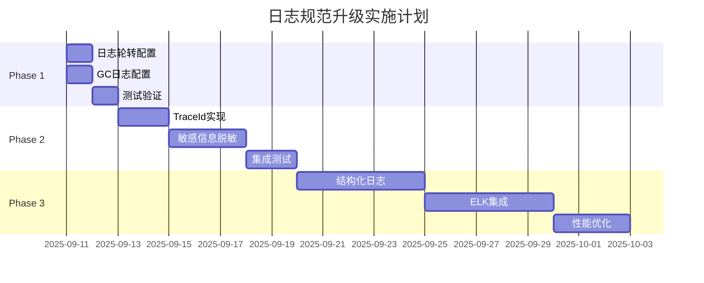

# 日志规范升级实施方案

## 文档信息
- **文档编号**: 223
- **创建日期**: 2025-09-10
- **作者**: System Architect
- **版本**: 1.0
- **状态**: 待审核

## 1. 背景与目标

### 1.1 背景
根据日志规范合规性审查报告，当前系统日志配置存在以下主要问题：
- 缺少日志轮转机制，存在磁盘空间耗尽风险
- 未配置GC日志，无法有效监控JVM性能
- 日志格式缺少追踪ID，难以进行分布式追踪
- 缺少敏感信息脱敏机制

### 1.2 升级目标
- **短期目标**（2周内）：解决高风险问题，防止系统故障
- **中期目标**（1个月内）：完善日志体系，提升可观测性
- **长期目标**（3个月内）：建立完整的日志管理和分析平台

## 2. 升级方案概览

| 优先级 | 改进项 | 影响范围 | 实施难度 | 预计工时 |
|--------|--------|---------|----------|----------|
| P0 | 日志轮转配置 | 所有服务 | 低 | 4小时 |
| P0 | GC日志配置 | 所有服务 | 低 | 2小时 |
| P1 | 添加TraceId | 所有服务 | 中 | 8小时 |
| P1 | 统一日志格式 | 所有服务 | 中 | 4小时 |
| P2 | 敏感信息脱敏 | 所有服务 | 高 | 16小时 |
| P2 | 错误日志分离 | 所有服务 | 低 | 4小时 |
| P3 | 结构化日志 | 所有服务 | 高 | 24小时 |

## 3. 详细实施方案

### 3.1 Phase 1: 紧急修复（立即执行）

#### 3.1.1 配置日志轮转

**步骤1**: 创建统一的logback配置文件

创建文件：`option-common-utils/src/main/resources/logback-base.xml`

```xml
<?xml version="1.0" encoding="UTF-8"?>
<configuration>
    <!-- 引入Spring Boot默认配置 -->
    <include resource="org/springframework/boot/logging/logback/defaults.xml"/>
    
    <!-- 定义日志路径和文件名 -->
    <property name="LOG_PATH" value="${LOG_PATH:-/var/log/binaryoption}"/>
    <property name="LOG_FILE" value="${LOG_PATH}/${spring.application.name}"/>
    <property name="LOG_PATTERN" value="%d{yyyy-MM-dd HH:mm:ss.SSS} [%thread] [%X{traceId:-SYSTEM}] %-5level %logger{36} - %msg%n"/>
    
    <!-- 控制台输出 -->
    <appender name="CONSOLE" class="ch.qos.logback.core.ConsoleAppender">
        <encoder>
            <pattern>${LOG_PATTERN}</pattern>
            <charset>UTF-8</charset>
        </encoder>
    </appender>
    
    <!-- 主日志文件（带轮转） -->
    <appender name="FILE" class="ch.qos.logback.core.rolling.RollingFileAppender">
        <file>${LOG_FILE}.log</file>
        <rollingPolicy class="ch.qos.logback.core.rolling.SizeAndTimeBasedRollingPolicy">
            <!-- 每天轮转，文件大小超过100MB也轮转 -->
            <fileNamePattern>${LOG_FILE}.%d{yyyy-MM-dd}.%i.gz</fileNamePattern>
            <maxFileSize>100MB</maxFileSize>
            <!-- 保留30天 -->
            <maxHistory>30</maxHistory>
            <!-- 总大小不超过10GB -->
            <totalSizeCap>10GB</totalSizeCap>
        </rollingPolicy>
        <encoder>
            <pattern>${LOG_PATTERN}</pattern>
            <charset>UTF-8</charset>
        </encoder>
    </appender>
    
    <!-- 错误日志单独文件 -->
    <appender name="ERROR_FILE" class="ch.qos.logback.core.rolling.RollingFileAppender">
        <file>${LOG_FILE}-error.log</file>
        <filter class="ch.qos.logback.classic.filter.ThresholdFilter">
            <level>ERROR</level>
        </filter>
        <rollingPolicy class="ch.qos.logback.core.rolling.SizeAndTimeBasedRollingPolicy">
            <fileNamePattern>${LOG_FILE}-error.%d{yyyy-MM-dd}.%i.gz</fileNamePattern>
            <maxFileSize>100MB</maxFileSize>
            <maxHistory>30</maxHistory>
            <totalSizeCap>5GB</totalSizeCap>
        </rollingPolicy>
        <encoder>
            <pattern>${LOG_PATTERN}</pattern>
            <charset>UTF-8</charset>
        </encoder>
    </appender>
    
    <!-- 异步日志提升性能 -->
    <appender name="ASYNC_FILE" class="ch.qos.logback.classic.AsyncAppender">
        <appender-ref ref="FILE"/>
        <queueSize>512</queueSize>
        <discardingThreshold>0</discardingThreshold>
        <neverBlock>true</neverBlock>
    </appender>
    
    <appender name="ASYNC_ERROR" class="ch.qos.logback.classic.AsyncAppender">
        <appender-ref ref="ERROR_FILE"/>
        <queueSize>512</queueSize>
        <discardingThreshold>0</discardingThreshold>
        <neverBlock>true</neverBlock>
    </appender>
</configuration>
```

**步骤2**: 各服务引入基础配置

在每个服务创建：`src/main/resources/logback-spring.xml`

```xml
<?xml version="1.0" encoding="UTF-8"?>
<configuration>
    <!-- 引入基础配置 -->
    <include resource="logback-base.xml"/>
    
    <!-- 开发环境 -->
    <springProfile name="dev">
        <logger name="com.binaryoption" level="DEBUG"/>
        <root level="INFO">
            <appender-ref ref="CONSOLE"/>
        </root>
    </springProfile>
    
    <!-- 测试环境 -->
    <springProfile name="staging">
        <logger name="com.binaryoption" level="INFO"/>
        <root level="INFO">
            <appender-ref ref="CONSOLE"/>
            <appender-ref ref="ASYNC_FILE"/>
            <appender-ref ref="ASYNC_ERROR"/>
        </root>
    </springProfile>
    
    <!-- 生产环境 -->
    <springProfile name="production">
        <logger name="com.binaryoption" level="INFO"/>
        <logger name="org.springframework" level="WARN"/>
        <logger name="org.hibernate" level="WARN"/>
        <root level="WARN">
            <appender-ref ref="ASYNC_FILE"/>
            <appender-ref ref="ASYNC_ERROR"/>
        </root>
    </springProfile>
</configuration>
```

#### 3.1.2 配置GC日志

**修改docker-compose.yml**：

```yaml
# 为每个服务添加JVM参数
services:
  option-gateway:
    environment:
      JAVA_OPTS: >-
        -server
        -Xms512m
        -Xmx1024m
        -XX:+UseG1GC
        -XX:MaxGCPauseMillis=200
        -XX:+HeapDumpOnOutOfMemoryError
        -XX:HeapDumpPath=/var/log/binaryoption/heap-dumps/
        -Xlog:gc*:file=/var/log/binaryoption/gc-gateway.log:time,uptime,level,tags:filecount=10,filesize=10M
        -XX:+UseStringDeduplication
        -XX:+ParallelRefProcEnabled
    volumes:
      - ./logs:/var/log/binaryoption
      - ./heap-dumps:/var/log/binaryoption/heap-dumps

  option-common-service:
    environment:
      JAVA_OPTS: >-
        -server
        -Xms512m
        -Xmx1024m
        -XX:+UseG1GC
        -XX:MaxGCPauseMillis=200
        -XX:+HeapDumpOnOutOfMemoryError
        -XX:HeapDumpPath=/var/log/binaryoption/heap-dumps/
        -Xlog:gc*:file=/var/log/binaryoption/gc-common.log:time,uptime,level,tags:filecount=10,filesize=10M
    volumes:
      - ./logs:/var/log/binaryoption
      - ./heap-dumps:/var/log/binaryoption/heap-dumps

  # 其他服务类似配置...
```

**创建启动脚本包装器**：

`scripts/docker-entrypoint.sh`:
```bash
#!/bin/bash
# Docker容器启动脚本，确保日志目录存在

# 创建日志目录
mkdir -p /var/log/binaryoption/heap-dumps

# 设置权限
chmod 755 /var/log/binaryoption
chmod 755 /var/log/binaryoption/heap-dumps

# 启动应用
exec java ${JAVA_OPTS} -jar /app.jar "$@"
```

### 3.2 Phase 2: 功能增强（1周内完成）

#### 3.2.1 实现分布式追踪

**步骤1**: 创建TraceId过滤器

`option-common-utils/src/main/java/com/binaryoption/common/filter/TraceIdFilter.java`:

```java
package com.binaryoption.common.filter;

import org.slf4j.MDC;
import org.springframework.core.Ordered;
import org.springframework.core.annotation.Order;
import org.springframework.stereotype.Component;
import org.springframework.web.filter.OncePerRequestFilter;

import javax.servlet.FilterChain;
import javax.servlet.ServletException;
import javax.servlet.http.HttpServletRequest;
import javax.servlet.http.HttpServletResponse;
import java.io.IOException;
import java.util.UUID;

/**
 * 分布式追踪ID过滤器
 * 为每个请求生成唯一的追踪ID，便于日志关联
 */
@Component
@Order(Ordered.HIGHEST_PRECEDENCE)
public class TraceIdFilter extends OncePerRequestFilter {
    
    private static final String TRACE_ID_HEADER = "X-Trace-Id";
    private static final String TRACE_ID_MDC_KEY = "traceId";
    
    @Override
    protected void doFilterInternal(HttpServletRequest request, 
                                  HttpServletResponse response, 
                                  FilterChain filterChain) 
            throws ServletException, IOException {
        
        // 尝试从请求头获取TraceId（支持跨服务传递）
        String traceId = request.getHeader(TRACE_ID_HEADER);
        
        // 如果没有，生成新的TraceId
        if (traceId == null || traceId.isEmpty()) {
            traceId = generateTraceId();
        }
        
        // 设置MDC，用于日志记录
        MDC.put(TRACE_ID_MDC_KEY, traceId);
        
        // 添加到响应头，便于客户端追踪
        response.setHeader(TRACE_ID_HEADER, traceId);
        
        try {
            filterChain.doFilter(request, response);
        } finally {
            // 清理MDC，防止内存泄漏
            MDC.remove(TRACE_ID_MDC_KEY);
        }
    }
    
    private String generateTraceId() {
        return UUID.randomUUID().toString().replace("-", "");
    }
}
```

**步骤2**: 配置Feign客户端传递TraceId

`option-common-utils/src/main/java/com/binaryoption/common/config/FeignTraceConfig.java`:

```java
package com.binaryoption.common.config;

import feign.RequestInterceptor;
import org.slf4j.MDC;
import org.springframework.context.annotation.Bean;
import org.springframework.context.annotation.Configuration;

/**
 * Feign客户端TraceId传递配置
 */
@Configuration
public class FeignTraceConfig {
    
    @Bean
    public RequestInterceptor traceIdInterceptor() {
        return requestTemplate -> {
            String traceId = MDC.get("traceId");
            if (traceId != null) {
                requestTemplate.header("X-Trace-Id", traceId);
            }
        };
    }
}
```

#### 3.2.2 敏感信息脱敏

**步骤1**: 创建脱敏注解

`option-common-utils/src/main/java/com/binaryoption/common/annotation/SensitiveData.java`:

```java
package com.binaryoption.common.annotation;

import java.lang.annotation.*;

/**
 * 敏感数据标记注解
 */
@Target({ElementType.FIELD, ElementType.METHOD})
@Retention(RetentionPolicy.RUNTIME)
@Documented
public @interface SensitiveData {
    
    /**
     * 脱敏类型
     */
    SensitiveType type() default SensitiveType.DEFAULT;
    
    enum SensitiveType {
        DEFAULT,      // 默认：显示前3后4
        PHONE,        // 手机号：138****1234
        EMAIL,        // 邮箱：t***@example.com
        ID_CARD,      // 身份证：110***********1234
        BANK_CARD,    // 银行卡：6222***********1234
        PASSWORD,     // 密码：全部替换为*
        TOKEN,        // 令牌：显示前8位
        SECRET        // 密钥：全部隐藏
    }
}
```

**步骤2**: 实现日志脱敏转换器

`option-common-utils/src/main/java/com/binaryoption/common/logging/SensitiveDataConverter.java`:

```java
package com.binaryoption.common.logging;

import ch.qos.logback.classic.pattern.MessageConverter;
import ch.qos.logback.classic.spi.ILoggingEvent;
import com.binaryoption.common.annotation.SensitiveData;

import java.util.regex.Matcher;
import java.util.regex.Pattern;

/**
 * 日志敏感数据脱敏转换器
 */
public class SensitiveDataConverter extends MessageConverter {
    
    // 敏感信息正则模式
    private static final Pattern PHONE_PATTERN = Pattern.compile("(1[3-9]\\d)\\d{4}(\\d{4})");
    private static final Pattern EMAIL_PATTERN = Pattern.compile("(\\w+)@(\\w+\\.\\w+)");
    private static final Pattern ID_CARD_PATTERN = Pattern.compile("(\\d{6})\\d{8}(\\d{4})");
    private static final Pattern BANK_CARD_PATTERN = Pattern.compile("(\\d{4})\\d{8,12}(\\d{4})");
    private static final Pattern PASSWORD_PATTERN = Pattern.compile("(?i)(password|pwd|pass)[\"']?\\s*[:=]\\s*[\"']?([^\"'\\s]+)");
    private static final Pattern TOKEN_PATTERN = Pattern.compile("(?i)(token|authorization)[\"']?\\s*[:=]\\s*[\"']?([^\"'\\s]+)");
    
    @Override
    public String convert(ILoggingEvent event) {
        String message = super.convert(event);
        
        // 脱敏处理
        message = maskPhone(message);
        message = maskEmail(message);
        message = maskIdCard(message);
        message = maskBankCard(message);
        message = maskPassword(message);
        message = maskToken(message);
        
        return message;
    }
    
    private String maskPhone(String message) {
        Matcher matcher = PHONE_PATTERN.matcher(message);
        return matcher.replaceAll("$1****$2");
    }
    
    private String maskEmail(String message) {
        Matcher matcher = EMAIL_PATTERN.matcher(message);
        return matcher.replaceAll(m -> {
            String prefix = m.group(1);
            String suffix = m.group(2);
            if (prefix.length() > 3) {
                return prefix.substring(0, 3) + "***@" + suffix;
            }
            return prefix.charAt(0) + "***@" + suffix;
        });
    }
    
    private String maskIdCard(String message) {
        Matcher matcher = ID_CARD_PATTERN.matcher(message);
        return matcher.replaceAll("$1**********$2");
    }
    
    private String maskBankCard(String message) {
        Matcher matcher = BANK_CARD_PATTERN.matcher(message);
        return matcher.replaceAll("$1************$2");
    }
    
    private String maskPassword(String message) {
        Matcher matcher = PASSWORD_PATTERN.matcher(message);
        return matcher.replaceAll("$1: ******");
    }
    
    private String maskToken(String message) {
        Matcher matcher = TOKEN_PATTERN.matcher(message);
        return matcher.replaceAll(m -> {
            String key = m.group(1);
            String value = m.group(2);
            if (value.length() > 8) {
                return key + ": " + value.substring(0, 8) + "...";
            }
            return key + ": ***";
        });
    }
}
```

**步骤3**: 配置脱敏转换器

在`logback-base.xml`中添加：

```xml
<!-- 定义脱敏转换器 -->
<conversionRule conversionWord="msg" 
                converterClass="com.binaryoption.common.logging.SensitiveDataConverter"/>

<!-- 使用脱敏后的消息格式 -->
<property name="LOG_PATTERN_MASKED" 
          value="%d{yyyy-MM-dd HH:mm:ss.SSS} [%thread] [%X{traceId:-SYSTEM}] %-5level %logger{36} - %msg%n"/>
```

### 3.3 Phase 3: 长期优化（1-3个月）

#### 3.3.1 结构化日志（JSON格式）

**添加依赖**：

```xml
<dependency>
    <groupId>net.logstash.logback</groupId>
    <artifactId>logstash-logback-encoder</artifactId>
    <version>7.3</version>
</dependency>
```

**配置JSON输出**：

```xml
<!-- JSON格式文件输出（用于ELK） -->
<appender name="JSON_FILE" class="ch.qos.logback.core.rolling.RollingFileAppender">
    <file>${LOG_FILE}.json</file>
    <rollingPolicy class="ch.qos.logback.core.rolling.TimeBasedRollingPolicy">
        <fileNamePattern>${LOG_FILE}.%d{yyyy-MM-dd}.json.gz</fileNamePattern>
        <maxHistory>7</maxHistory>
    </rollingPolicy>
    <encoder class="net.logstash.logback.encoder.LogstashEncoder">
        <providers>
            <timestamp>
                <timeZone>Asia/Shanghai</timeZone>
            </timestamp>
            <pattern>
                <pattern>
                    {
                        "service": "${spring.application.name}",
                        "trace_id": "%X{traceId}",
                        "user_id": "%X{userId}",
                        "level": "%level",
                        "thread": "%thread",
                        "logger": "%logger",
                        "message": "%message",
                        "stack_trace": "%exception"
                    }
                </pattern>
            </pattern>
        </providers>
    </encoder>
</appender>
```

#### 3.3.2 日志聚合配置（ELK Stack）

**Filebeat配置示例**：

```yaml
filebeat.inputs:
- type: log
  enabled: true
  paths:
    - /var/log/binaryoption/*.json
  json.keys_under_root: true
  json.add_error_key: true
  multiline.pattern: '^\{'
  multiline.negate: true
  multiline.match: after

output.elasticsearch:
  hosts: ["elasticsearch:9200"]
  index: "binaryoption-%{[service]}-%{+yyyy.MM.dd}"

processors:
  - add_host_metadata:
      when.not.contains:
        tags: forwarded
  - add_docker_metadata: ~
```

## 4. 实施计划

### 4.1 时间线



### 4.2 分步实施

| 阶段 | 时间 | 任务 | 负责人 | 验收标准 |
|-----|------|------|--------|----------|
| Phase 1 | Day 1-2 | 日志轮转+GC日志 | DevOps | 日志文件自动轮转，GC日志正常生成 |
| Phase 2 | Day 3-7 | TraceId+脱敏 | 后端开发 | 请求可追踪，敏感信息已脱敏 |
| Phase 3 | Week 2-4 | 结构化日志 | 架构师 | JSON日志格式，ELK可查询 |
| Phase 4 | Month 2 | 监控告警 | 运维团队 | 告警规则配置完成 |

### 4.3 回滚方案

如果升级过程中出现问题，可按以下步骤回滚：

1. **配置回滚**：
   - 删除新增的`logback-spring.xml`文件
   - 恢复`application.yml`中的原始日志配置
   
2. **Docker配置回滚**：
   - 移除JAVA_OPTS中的GC日志参数
   - 恢复原始的volumes配置

3. **代码回滚**：
   - 移除TraceIdFilter和相关配置
   - 恢复原始的日志输出代码

## 5. 测试验证

### 5.1 功能测试

#### 日志轮转测试
```bash
# 生成大量日志触发轮转
for i in {1..100000}; do
  curl http://localhost:8080/api/borc/test
done

# 验证日志文件
ls -la /var/log/binaryoption/
# 应该看到：
# option-gateway.log
# option-gateway.2025-09-10.1.gz
# option-gateway.2025-09-10.2.gz
```

#### GC日志验证
```bash
# 检查GC日志
tail -f /var/log/binaryoption/gc-gateway.log

# 应该看到类似：
# [2025-09-10T10:30:45.123+0800][info][gc] GC(10) Pause Young (Normal) 24M->8M(256M) 3.456ms
```

#### TraceId验证
```bash
# 发送请求
curl -H "X-Trace-Id: test-trace-123" http://localhost:8080/api/borc/user/info

# 检查日志
grep "test-trace-123" /var/log/binaryoption/option-*.log
# 应该在所有相关服务日志中看到相同的traceId
```

### 5.2 性能测试

```bash
# 压力测试
ab -n 10000 -c 100 http://localhost:8080/api/borc/test

# 监控指标
- 响应时间增加 < 5%
- CPU使用率增加 < 10%
- 内存使用稳定
- 日志写入不阻塞业务
```

### 5.3 监控指标

建立以下监控指标：

1. **日志量监控**
   - 每分钟日志条数
   - 错误日志比例
   - 日志文件大小增长速度

2. **性能监控**
   - 日志写入延迟
   - 异步队列长度
   - GC频率和耗时

3. **异常监控**
   - 日志丢失率
   - 磁盘空间使用率
   - 日志轮转失败次数

## 6. 风险控制

### 6.1 风险识别

| 风险 | 概率 | 影响 | 缓解措施 |
|------|------|------|----------|
| 日志量激增导致磁盘满 | 中 | 高 | 配置日志总量上限，监控磁盘使用率 |
| 异步日志丢失 | 低 | 中 | 配置合理的队列大小，监控队列状态 |
| 性能下降 | 低 | 中 | 使用异步日志，优化日志级别 |
| 敏感信息泄露 | 中 | 高 | 严格测试脱敏规则，定期审计 |

### 6.2 应急预案

1. **磁盘空间不足**：
   - 自动清理超过7天的日志
   - 临时调高日志级别到WARN
   - 扩容磁盘或迁移日志存储

2. **性能严重下降**：
   - 临时关闭DEBUG日志
   - 减少日志输出频率
   - 切换到简化日志格式

3. **日志系统故障**：
   - 降级到标准输出
   - 启用备用日志方案
   - 保留关键业务日志

## 7. 成本效益分析

### 7.1 实施成本
- 开发工时：约48小时
- 测试工时：约16小时
- 部署运维：约8小时
- **总计**：72小时（9人天）

### 7.2 预期收益
- **故障诊断时间减少60%**：通过TraceId快速定位问题
- **磁盘成本降低30%**：通过日志轮转和压缩
- **安全合规**：满足敏感信息保护要求
- **运维效率提升40%**：通过结构化日志和自动化分析

### 7.3 ROI分析
- 投入：9人天 × 5000元/人天 = 45,000元
- 年度收益：
  - 故障处理效率提升：20,000元/月 × 12 = 240,000元
  - 磁盘成本节省：2,000元/月 × 12 = 24,000元
- **ROI**：(264,000 - 45,000) / 45,000 = 486%

## 8. 文档和培训

### 8.1 文档更新
- [ ] 更新运维手册
- [ ] 更新开发规范
- [ ] 创建故障排查指南
- [ ] 编写日志查询手册

### 8.2 培训计划
- [ ] 开发团队：日志最佳实践培训（2小时）
- [ ] 运维团队：日志管理和分析培训（4小时）
- [ ] QA团队：日志验证方法培训（1小时）

## 9. 验收标准

### 9.1 技术验收
- [ ] 所有服务配置日志轮转
- [ ] GC日志正常输出
- [ ] TraceId贯穿全链路
- [ ] 敏感信息完全脱敏
- [ ] 性能指标符合要求

### 9.2 业务验收
- [ ] 故障定位时间 < 10分钟
- [ ] 日志查询响应时间 < 3秒
- [ ] 无敏感信息泄露
- [ ] 日志保留满足合规要求

## 10. 附录

### 附录A：配置文件模板
- logback-spring.xml
- docker-compose.yml
- application.yml

### 附录B：监控脚本
```bash
#!/bin/bash
# 日志健康检查脚本

LOG_DIR="/var/log/binaryoption"
ALERT_SIZE="1G"
ALERT_EMAIL="ops@company.com"

# 检查日志目录大小
size=$(du -sh $LOG_DIR | cut -f1)
if [[ $size > $ALERT_SIZE ]]; then
    echo "警告：日志目录超过 $ALERT_SIZE" | mail -s "日志告警" $ALERT_EMAIL
fi

# 检查日志轮转
for service in gateway common-service order-service market-service; do
    if [ ! -f "$LOG_DIR/option-$service.log" ]; then
        echo "错误：$service 日志文件不存在" | mail -s "日志告警" $ALERT_EMAIL
    fi
done

# 检查GC日志
for gc_log in $LOG_DIR/gc-*.log; do
    if [ ! -f "$gc_log" ]; then
        echo "错误：GC日志不存在" | mail -s "日志告警" $ALERT_EMAIL
    fi
done
```

### 附录C：常见问题FAQ

**Q1: 日志文件太大怎么办？**
A: 检查日志级别是否设置过低，调整maxFileSize和maxHistory参数。

**Q2: TraceId如何跨服务传递？**
A: 通过HTTP Header `X-Trace-Id`传递，Feign客户端自动处理。

**Q3: 如何查询特定请求的所有日志？**
A: 使用grep命令：`grep "traceId" /var/log/binaryoption/*.log`

**Q4: 日志脱敏影响性能吗？**
A: 使用异步日志后，性能影响小于5%。

---

## 批准

| 角色 | 姓名 | 签名 | 日期 |
|------|------|------|------|
| 技术负责人 | | | |
| 运维负责人 | | | |
| 安全负责人 | | | |
| 项目经理 | | | |

---

*本方案将根据实施反馈持续更新优化*