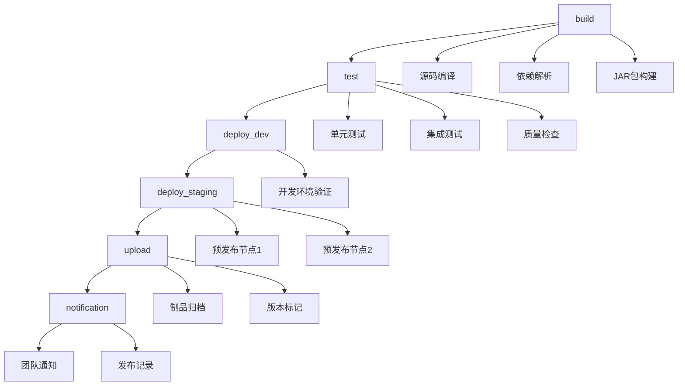

# BTSE GitLab CI/CD 模板解读

## 文档信息
- **创建时间**: 2025-08-20
- **文档版本**: v1.0
- **原始模板**: `docs/0. 客户资料/客户资料/gitlab-ci.yml`
- **目的**: 深度解读BTSE企业级CI/CD模板的设计理念和实现逻辑

---

## 1. 模板概览

### 1.1 核心设计理念
BTSE的GitLab CI/CD模板体现了企业级DevOps的最佳实践：
- **模板化复用**: 通过`include`引入标准化模板
- **分层架构**: 基础模板 + 项目定制化配置
- **渐进式部署**: 开发 → 预发布 → 生产的渐进式流程
- **分支策略**: 支持主干开发和功能分支并行

### 1.2 模板引入机制
```yaml
include:
  - project: 'nogle/btsecom/btse-backend/microservice_commons'          
    ref: 'main'
    file: '/commons-cicd/gitlab/pipeline/.gitlab-ci.job.yml'
```

**解析**:
- **项目路径**: `nogle/btsecom/btse-backend/microservice_commons` - BTSE微服务公共模板项目
- **版本控制**: `ref: 'main'` - 使用主分支的最新稳定版本
- **模板文件**: `/commons-cicd/gitlab/pipeline/.gitlab-ci.job.yml` - 标准化作业模板

**设计优势**:
- 集中维护CI/CD逻辑，确保企业标准一致性
- 模板更新时所有项目自动继承改进
- 项目只需关注业务配置，减少重复代码

---

## 2. 变量配置分析

### 2.1 核心变量设计
```yaml
variables:
  BUILD_IMAGE: "registry.gitlab.com/nogle/btsecom/btse-backend/binary_option/binaryoption-build-image-21:latest"
  TARGET_PROJECT_FOLDER: "."
  APP_SERVICE_NAME: "binaryoption"
```

### 2.2 变量解析

| 变量名 | 值 | 作用 | 设计考量 |
|--------|----|----- |----------|
| `BUILD_IMAGE` | `registry.gitlab.com/nogle/btsecom/btse-backend/binary_option/binaryoption-build-image-21:latest` | 标准化构建环境 | 确保构建一致性，包含所需工具链 |
| `TARGET_PROJECT_FOLDER` | `"."` | 项目根目录 | 支持单体和多模块项目结构 |
| `APP_SERVICE_NAME` | `"binaryoption"` | 应用标识 | 用于生成制品名称和部署标识 |

**设计亮点**:
- **标准化构建镜像**: 使用企业统一的构建环境，避免"在我机器上能跑"的问题
- **版本化镜像**: `binaryoption-build-image-21` 体现了版本管理策略
- **参数化配置**: 通过变量支持不同项目的定制化需求

---

## 3. 流水线阶段设计

### 3.1 阶段定义
```yaml
stages:
  - build      # 构建阶段
  - test       # 测试阶段
  - deploy_dev # 开发环境部署
  - deploy_staging # 预发布环境部署
  - upload     # 制品上传
  - notification # 通知发布
```

### 3.2 阶段流程分析



**设计理念**:
- **顺序执行**: 确保质量门禁，每个阶段验证通过才进入下一阶段
- **并行部署**: 预发布阶段支持多节点并行部署
- **制品管理**: upload阶段统一管理发布制品
- **可追溯性**: notification阶段确保变更记录完整

---

## 4. 分支策略深度解析

### 4.1 分支触发规则矩阵

| 分支类型 | 构建触发 | 测试执行 | 部署策略 | 制品管理 |
|----------|----------|----------|----------|----------|
| `main` | 自动 | 自动 | 自动→Dev, 手动→Staging | 自动上传 |
| `feature/*` | 手动 | 手动 | 手动→Dev | 不上传 |
| `rel/v*` | 自动 | 自动 | 手动→Dev/Staging | 自动+手动 |
| `merge_requests` | 自动 | 自动 | 不部署 | 不上传 |

### 4.2 主分支流程 (main)
```yaml
# 主分支自动构建
build:
  only:
    - main
    - merge_requests
    - /^rel\/v.*$/
  except:
    - schedules

# 主分支自动部署到开发环境
deploy:dev:
  only:
    - main
  except:
    - schedules

# 预发布环境手动部署
deploy:staging:01:
  only:
    - main
  when: manual
```

**工作流程**:
1. **代码提交** → 自动触发构建和测试
2. **构建成功** → 自动部署到开发环境 (10.1.29.45)
3. **开发验证** → 手动触发预发布部署 (10.1.35.186/187)
4. **预发布验证** → 自动上传制品和通知

### 4.3 功能分支流程 (feature/*)
```yaml
# 功能分支手动构建
build:feature:
  rules:
    - if: $CI_COMMIT_BRANCH =~ /^feature\/.*$/
      when: manual

# 功能分支部署
deploy:dev:feature:
  rules:
    - if: $CI_COMMIT_BRANCH =~ /^feature\/.*$/
```

**设计考量**:
- **手动触发**: 避免功能分支频繁构建消耗资源
- **隔离验证**: 支持功能分支独立部署验证
- **不影响主流程**: 功能分支不触发制品上传

### 4.4 发布分支流程 (rel/v*)
```yaml
# 发布分支支持
deploy:dev:manual:
  only:
    - /^rel\/v.*$/
  when: manual

# 发布分支预发布
deploy:staging:01:manual:
  only:
    - /^rel\/v.*$/
  when: manual

# 热修复制品管理
upload:testnet_prod:hotfix:auto:
  only:
    - /^rel\/v.*$/

upload:testnet_prod:hotfix:manual:
  only:
    - /^rel\/v.*$/
  when: manual
```

**发布策略**:
- **双模式支持**: 自动热修复 + 手动紧急发布
- **版本控制**: 基于分支名进行版本标记
- **完整流程**: 支持完整的发布和回滚流程

---

## 5. 部署架构分析

### 5.1 环境拓扑
```
开发环境: 10.1.29.45 (单节点)
   ↓ (自动部署)
预发布环境: 
   ├── 节点1: 10.1.35.186
   └── 节点2: 10.1.35.187 (双节点高可用)
   ↓ (手动确认)
生产环境: (通过制品上传，独立部署)
```

### 5.2 部署作业配置
```yaml
deploy:dev:
  extends:
    - .deploy:dev:v3    # 使用模板中的开发环境部署逻辑
  variables:
    HOST: "10.1.29.45"
    USER: "svdp.lmtd"
    SSH_PASSWORD: "$SSH_PWD"
```

**关键设计**:
- **模板复用**: 通过`extends`继承标准部署逻辑
- **参数化**: 通过`variables`传递环境特定配置
- **安全性**: 密码通过GitLab变量安全传递

### 5.3 双节点预发布策略
```yaml
deploy:staging:01:
  needs: [ "build", "deploy:dev" ]  # 依赖开发环境验证
  when: manual                      # 手动确认
  
deploy:staging:02:
  needs: [ "build", "deploy:dev" ]  # 并行部署
  when: manual
```

**高可用考量**:
- **依赖验证**: 确保开发环境验证通过
- **并行部署**: 两个节点可同时部署
- **手动控制**: 人工确认关键环境变更

---

## 6. 制品管理策略

### 6.1 制品上传流程
```yaml
upload:testnet_prod:
  stage: upload
  extends:
    - .upload_file:testnet_and_prod:v3
  needs: [ "build", "deploy:staging:01", "deploy:staging:02" ]
  only:
    - main
  except:
    - merge_requests
    - schedules
```

**流程控制**:
- **质量门禁**: 必须完成预发布环境验证
- **分支限制**: 只有主分支和发布分支可上传制品
- **排除规则**: 合并请求和定时任务不触发制品上传

### 6.2 发布分支制品管理
```yaml
# 自动热修复
upload:testnet_prod:hotfix:auto:
  needs: [ "build", "deploy:staging:01:manual", "deploy:staging:02:manual" ]

# 手动紧急发布
upload:testnet_prod:hotfix:manual:
  needs: [ "build" ]
  when: manual
```

**双重保障**:
- **常规流程**: 需要预发布验证的自动上传
- **紧急通道**: 跳过验证的手动上传（用于紧急修复）

---

## 7. 通知和发布管理

### 7.1 版本标签自动化
```yaml
release:tag:
  stage: notification
  extends:
    - .release:tag:v3
  needs: [ "build", "upload:testnet_prod" ]
```

**自动化发布**:
- **版本标记**: 自动基于提交和分支创建版本标签
- **发布记录**: 维护完整的发布历史
- **可追溯性**: 每个制品都有对应的Git标签

### 7.2 通知机制
```yaml
notification:testnet_prod:
  stage: notification
  extends:
    - .notification:testnet_and_prod:v3
  needs: [ "build", "upload:testnet_prod" ]
```

**通知策略**:
- **团队协作**: 自动通知相关团队成员
- **状态同步**: 实时更新部署状态
- **集成工具**: 可能集成Slack、钉钉等协作工具

---

## 8. 质量保证机制

### 8.1 定时健康检查
```yaml
schedule:check:
  stage: test
  extends:
    - .test:all:innerRunner:v3
  rules:
    - if: $CI_PIPELINE_SOURCE == "schedule"
```

**监控策略**:
- **定期验证**: 通过定时任务验证系统健康状态
- **主动发现**: 及时发现潜在问题
- **自动化运维**: 减少人工监控成本

### 8.2 失败处理
```yaml
allow_failure: false  # 大部分作业不允许失败
when: manual         # 关键节点需要人工确认
```

**容错设计**:
- **严格质量门禁**: 关键阶段不允许失败
- **人工干预点**: 在关键决策点引入人工确认
- **回滚机制**: 支持快速回滚到稳定版本

---

## 9. 模板设计优势

### 9.1 企业级特性
1. **标准化**: 统一的构建、测试、部署流程
2. **可维护性**: 模板集中维护，项目配置最小化
3. **可扩展性**: 支持不同项目的定制化需求
4. **安全性**: 密钥管理、权限控制、审计追踪

### 9.2 开发效率
1. **自动化程度高**: 减少手工操作，提高效率
2. **快速反馈**: 自动构建测试，及时发现问题
3. **并行处理**: 支持多分支、多环境并行开发
4. **一键部署**: 简化部署流程，降低出错风险

### 9.3 运维友好
1. **渐进式部署**: 降低生产环境风险
2. **多环境支持**: 完整的环境隔离和验证
3. **监控集成**: 自动化健康检查和通知
4. **制品管理**: 统一的版本控制和分发

---

## 10. 适用场景分析

### 10.1 适用项目类型
- **微服务架构**: 支持多服务协调构建部署
- **企业应用**: 严格的质量控制和审批流程
- **团队协作**: 多分支并行开发模式
- **持续交付**: 频繁发布的敏捷项目

### 10.2 组织要求
- **标准化需求**: 需要统一的DevOps标准
- **安全合规**: 有严格的安全和合规要求
- **团队规模**: 中大型开发团队
- **技术成熟度**: 具备一定的DevOps实践基础

### 10.3 技术栈匹配
- **Java生态**: 基于Maven/Gradle的Java项目
- **容器化**: 支持Docker容器化部署
- **GitLab**: 使用GitLab作为代码和CI/CD平台
- **SSH部署**: 传统的SSH远程部署方式

---

## 11. 学习要点总结

### 11.1 模板化思维
- **DRY原则**: 通过模板避免重复配置
- **职责分离**: 基础逻辑与业务配置分离
- **版本管理**: 模板版本化管理，支持渐进升级

### 11.2 企业级实践
- **质量门禁**: 多层次的质量检查机制
- **环境管理**: 清晰的环境晋升策略
- **权限控制**: 基于角色的操作权限管理

### 11.3 运维自动化
- **基础设施即代码**: CI/CD配置版本化管理
- **可观测性**: 完整的构建、部署、运行监控
- **故障恢复**: 自动化的故障检测和恢复机制

---

## 12. 项目应用指南

### 12.1 模板应用步骤
1. **环境准备**: 搭建GitLab环境，配置Runner
2. **模板引入**: 通过include引入BTSE标准模板
3. **参数配置**: 根据项目特点配置变量和环境
4. **权限设置**: 配置GitLab变量和SSH密钥
5. **流程验证**: 逐步验证各个阶段的执行效果

### 12.2 定制化建议
1. **保持标准**: 尽量使用模板默认行为
2. **最小定制**: 只定制必要的项目特定配置
3. **文档记录**: 记录所有定制化的原因和影响
4. **定期更新**: 跟随模板更新，保持最佳实践

### 12.3 注意事项
1. **依赖管理**: 确保模板项目的可访问性
2. **环境一致**: 保证各环境的配置一致性
3. **安全考虑**: 敏感信息通过GitLab变量管理
4. **监控告警**: 建立完善的监控和告警机制

---

**文档更新记录**

| 版本 | 日期 | 更新内容 | 作者 |
|------|------|----------|------|
| v1.0 | 2025-08-20 | 初始版本，完整解读BTSE CI/CD模板 | DevOps团队 |

**下次更新计划**: 基于模板理解，设计适合当前项目的CI/CD配置方案