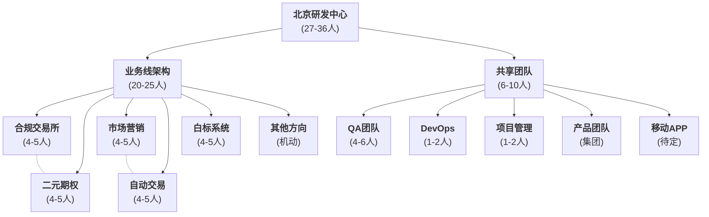

# BTSE 中国产研中心 - 业务架构（初稿）

### 1. 组织架构图



### 2. 人力分配统计
- **业务线研发（前端，后端）**: 20-25人 (6条线，每线4-5人)
- **共享资源**: 6-10人 (QA 4-6人、DevOps 1-2人、项目管理 1-2人、移动APP 待定)
- **产品团队**: 集团统筹安排
- **管理层**: 1人

**总计: 27-36人**
**备注: 最终人员数量需要根据实际的工作量决定**

### 3. 人员技能要求矩阵

#### 3.1 后端开发人员技能分级

##### 后端技术栈要求
```
核心框架: Java / Spring Boot / Spring Cloud
数据存储: PostgreSQL / MySQL / Redis
消息队列: Apache Kafka / RocketMQ (高频交易场景)
微服务注册: Nacos / Consul
网关路由: Spring Cloud Gateway / Kong
链路追踪: OpenTelemetry / SkyWalking / Zipkin
监控告警: Prometheus + Grafana / ELK Stack
缓存方案: Redis Cluster / Hazelcast
容器编排: Docker / Kubernetes
```

| 级别 | 核心技能要求 | 业务经验 | 适合业务线 | 年限 |
|------|-------------|-------------|-----------|----------|
| **Senior** | • 微服务架构设计 (Spring Cloud)<br/>• 高并发处理 (>10W QPS)<br/>• 分布式事务、缓存策略<br/>• 数据库性能调优 (MySQL/PostgreSQL) | • 金融产品开发经验<br/>• 风控系统设计<br/>• 交易系统架构 | • 合规交易所<br/>• 二元期权<br/>• 自动交易 | 5年+ |
| **Mid-Senior** | • Spring Boot 熟练使用<br/>• 数据库优化 (MySQL/PostgreSQL)<br/>• 消息队列 (RabbitMQ/Kafka)<br/>• RESTful API 设计 | • 金融业务理解<br/>• 支付/结算流程<br/>• 基础风控逻辑 | • 合规交易所<br/>• 二元期权<br/>• 白标系统 | 3-5年 |
| **Junior** | • Java 基础扎实<br/>• Spring 框架熟悉<br/>• 数据库基础操作 (SQL熟练)<br/>• 单元测试编写 | • 学习能力强<br/>• 金融概念了解 | • 市场营销<br/>• 白标系统<br/>• 其他方向 | 1-3年 |

#### 3.2 前端开发人员技能分级

##### 前端技术栈要求
```
核心框架: Vue 3 + Composition API + TypeScript
构建工具: Vite (主推) / Webpack
UI组件库: Element Plus / Ant Design Vue / TDesign
状态管理: Pinia (Vue 3推荐) / Vuex
路由管理: Vue Router
包管理: pnpm / npm / yarn
代码规范: ESLint + Prettier + Husky
测试框架: Vitest / Jest / Playwright
数据可视化: ECharts / D3.js / Chart.js
移动端: 响应式设计 + PWA (移动端方案待定)
```

| 级别 | 核心技能要求 | 业务经验 | 适合业务线 | 年限 |
|------|-------------|---------|-----------|----------|
| **Senior** | • Vue 3.x + TypeScript 精通<br/>• 前端架构设计<br/>• 性能优化 (首屏<2s)<br/>• 前端工程化体系 | • 交易界面开发<br/>• 实时数据展示<br/>• 复杂表单设计 | • 二元期权<br/>• 自动交易<br/>• 合规交易所 | 5年+ |
| **Mid-Senior** | • Vue/React 熟练<br/>• 组件库开发<br/>• 移动端适配<br/>• 数据可视化 (ECharts) | • 金融产品 UI/UX<br/>• 多端适配经验<br/>• 用户体验优化 | • 市场营销<br/>• 白标系统<br/>• 二元期权 | 3-5年 |
| **Junior** | • HTML/CSS/JS 基础<br/>• Vue 基础使用<br/>• 响应式布局<br/>• Git 协作 | • 学习能力强<br/>• UI 还原能力 | • 白标系统<br/>• 市场营销<br/>• 其他方向 | 1-3年 |

#### 3.3 QA测试人员技能分级

##### 测试技术栈要求
```
自动化测试: Selenium / Playwright / Cypress
API测试: Postman / REST Assured / Newman
性能测试: JMeter / K6 / Artillery
移动端测试: Appium / Maestro (移动端方案待定)
测试框架: TestNG / JUnit / Jest
Mock服务: WireMock / MockServer
CI/CD集成: Jenkins / GitHub Actions / GitLab CI
缺陷管理: Jira / TestRail / Allure
数据库测试: SQL验证 / Redis验证
安全测试: OWASP ZAP / Burp Suite (基础)
```

| 级别 | 核心技能要求 | 业务经验 | 适合业务线 | 年限 |
|------|-------------|---------|-----------|----------|
| **Senior** | • 自动化测试架构设计<br/>• 性能测试 (JMeter/K6)<br/>• 测试框架开发 (Selenium/Playwright)<br/>• API测试和Mock服务 | • 金融系统测试经验<br/>• 交易系统压力测试<br/>• 安全测试和合规验证 | • 全业务线架构<br/>• 复杂业务测试 | 5年+ |
| **Mid-Senior** | • 自动化测试用例编写<br/>• 接口测试 (Postman/REST Assured)<br/>• 数据库测试和验证<br/>• CI/CD集成测试 | • 金融业务理解<br/>• 回归测试策略<br/>• 缺陷分析和跟踪 | • 二元期权/交易所<br/>• 白标系统 | 3-5年 |
| **Junior** | • 功能测试执行<br/>• 测试用例设计<br/>• 缺陷管理工具使用<br/>• 基础自动化脚本 | • 学习能力强<br/>• 细致认真<br/>• 业务理解能力 | • 市场营销<br/>• 基础功能验证 | 1-3年 |

#### 3.4 DevOps工程师技能分级

##### DevOps技术栈要求
```
容器编排: Docker / Kubernetes / Helm
CI/CD: Jenkins / GitHub Actions / GitLab CI
监控告警: Prometheus + Grafana / ELK Stack
日志管理: Fluentd / Logstash / Filebeat
服务发现: Consul / Nacos
配置管理: Ansible / Terraform
代码质量: SonarQube / CodeClimate
镜像仓库: Harbor / Docker Hub
云平台: AWS / 阿里云 / 腾讯云 / 私有云
安全工具: Vault / RBAC
```

| 级别 | 核心技能要求 | 基础设施经验 | 适合职责 | 年限 |
|------|-------------|-------------|----------|----------|
| **Senior** | • Kubernetes集群管理<br/>• 云原生架构设计<br/>• 微服务监控体系 (Prometheus/Grafana)<br/>• 安全加固和合规配置 | • 大规模生产环境运维<br/>• 金融级安全要求<br/>• 灾备和高可用设计 | • 基础设施架构<br/>• 全平台DevOps | 5年+ |
| **Mid-Senior** | • Docker容器化部署<br/>• CI/CD流水线设计<br/>• 日志监控 (ELK Stack)<br/>• 数据库运维 (MySQL/PostgreSQL) | • 生产环境运维经验<br/>• 自动化部署实践<br/>• 性能调优经验 | • 平台运维部署<br/>• 监控告警管理 | 3-5年 |

#### 3.5 项目管理人员技能分级

##### 项目管理工具栈要求
```
项目管理: Jira / Azure DevOps / Monday
敏捷工具: Jira Agile / Azure Boards
文档协作: Confluence / Notion / 飞书文档
沟通协作: Slack / 钉钉 / 腾讯会议
版本控制: Git / GitHub / GitLab (基础了解)
数据分析: Excel / Power BI (基础)
原型设计: Figma / 墨刀 (基础了解)
时间管理: 甘特图 / 燃尽图
风险管理: 风险登记册 / RAID日志
质量管理: 测试管理 / 缺陷跟踪
```

| 级别 | 核心技能要求 | 管理经验 | 适合职责 | 年限 |
|------|-------------|---------|----------|----------|
| **Senior** | • 敏捷开发管理 (Scrum/Kanban)<br/>• 项目风险评估和控制<br/>• 跨团队协调和沟通<br/>• 项目交付和质量管理 | • 技术项目管理经验<br/>• 金融产品项目经验<br/>• 团队建设和激励 | • 大型项目<br/>• 多业务线协调 | 5年+ |
| **Mid-Senior** | • 项目计划制定和跟踪<br/>• 需求分析和管理<br/>• 团队协作工具使用<br/>• 基础数据分析能力 | • 软件项目管理经验<br/>• 敏捷方法实践<br/>• 团队协作经验 | • 单业务线项目<br/>• 中小型项目 | 3-5年 |

### 4. 业务线配置明细

#### 4.1 业务线人员配置表
| 业务线 | 技术负责人 | 人员小计 | 技术侧重点 | 
|--------|------------|----------|-----------|
| **合规交易所** | Senior后端工程师 |  4-5人 | 交易系统、合规监管、KYC/AML |
| **二元期权** | Senior后端工程师 | 4-5人 | 期权定价、实时风控、移动端交易 | 
| **市场营销** | Senior后端工程师 |  4-5人 | 数据可视化、A/B测试、用户增长 |
| **自动交易** | Senior后端工程师 |  4-5人 | 策略引擎、量化算法 | 
| **白标系统** | Senior后端工程师 |  4-5人 | 多租户SaaS、配置化、插件化 |
| **其他方向** | 机动配置 | 机动 | Web3、AI集成、新兴技术探索 | 

### 5. 共享资源配置

| 团队 | 人数 | 支持范围 | 技术要求 | 分配原则 |
|------|------|----------|----------|----------|
| QA团队 | 4-6 | 全业务线 | 自动化测试、性能测试 | 研发的25-30% |
| DevOps | 1-2 | 全业务线 | K8s、CI/CD、监控 | 基础设施70%，业务支持30% |
| 项目管理 | 1-2 | 全业务线 | 敏捷开发、技术管理 | 1个PM管理2-3个项目 |
| 产品团队 | 集团安排 | 全业务线 | 金融产品、B/C端经验 | 根据业务需要灵活配置 |


