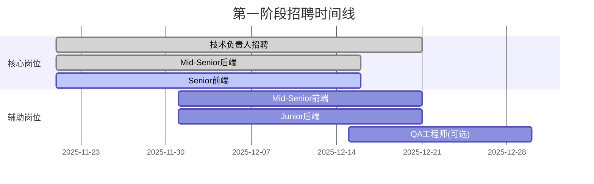
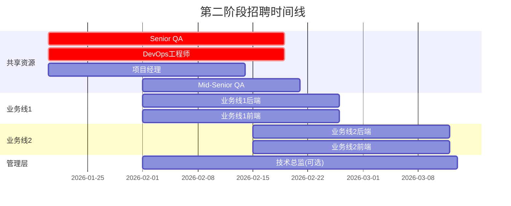
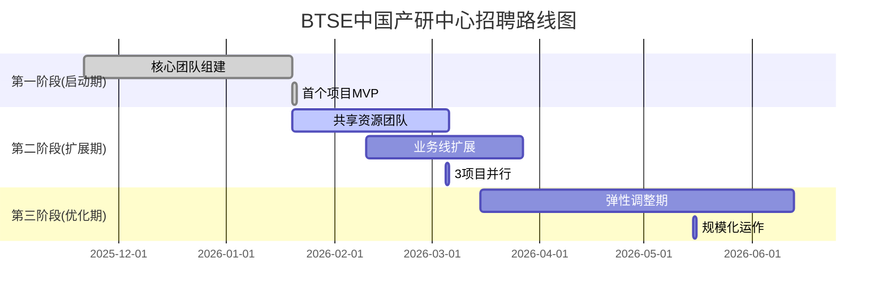

# BTSE 中国产研中心 - 分阶段招聘计划

> **制定日期**: 2025-11-21
> **版本**: v1.0
> **目标**: 构建高效、稳定、可扩展的研发团队

---

## 📋 目录

1. [总体策略](#总体策略)
2. [第一阶段：启动期（核心团队）](#第一阶段启动期核心团队)
3. [第二阶段：扩展期（并行开发）](#第二阶段扩展期并行开发)
4. [第三阶段：优化期（弹性调整）](#第三阶段优化期弹性调整)
5. [招聘时间线](#招聘时间线)
6. [风险控制](#风险控制)
7. [成功指标](#成功指标)

---

## 总体策略

### 核心原则

1. **质量优先**：宁缺毋滥，确保每位成员符合技术和文化要求
2. **渐进式扩张**：先小团队验证流程，再逐步扩大规模
3. **能力互补**：每个阶段注重技能多样性和团队协作
4. **业务驱动**：根据实际项目需求和业务目标调整招聘节奏

### 阶段目标对比

| 阶段 | 时间周期 | 团队规模 | 项目并行度（复杂度1个月+） | 核心目标 |
|------|----------|----------|------------|----------|
| **启动期** | 0-2个月 | 5-6人 | 1-2个项目 | 流程验证、基础建设 |
| **扩展期** | 3-4个月 | 10-15人 | 3-4个项目 | 规模化交付、引入管理层 |
| **优化期** | 5个月+ | 15-25人 | 4-6个项目 | 高效运作、持续优化 |

---

## 第一阶段：启动期（核心团队）

### 🎯 阶段目标

**时间**: 第0-2个月
**团队规模**: 5-6人
**项目能力**: 1个完整项目的独立交付

**核心使命**:
- ✅ 建立基础研发流程和规范
- ✅ 完成首个业务线项目
- ✅ 验证技术栈和架构设计
- ✅ 沉淀团队协作模式和最佳实践

### 👥 人员配置（5-6人）

#### 1. 技术负责人 × 1（必须）
**角色定位**: 团队Leader
- **技能要求**:
  - Senior级后端工程师（Java/Spring Cloud）
  - 微服务架构设计经验
  - 金融系统开发背景（交易/风控/支付）
  - 团队管理经验（3人以上）
- **职责**:
  - 架构设计和技术选型
  - 代码审查和技术把关
  - 团队管理和任务分配
  - 对接产品和业务需求
- **招聘优先级**: ⭐⭐⭐⭐⭐（最高）

#### 2. 后端工程师 × 2
**配置**: 1个Mid-Senior + 1个Junior

**Mid-Senior后端（必须）**:
- **技能要求**:
  - 3-5年Java开发经验
  - Spring Boot/MySQL/Redis熟练
  - 微服务开发经验
  - 金融业务理解（优先）
- **职责**:
  - 核心业务模块开发
  - 数据库设计和优化
  - 接口设计和文档编写
  - 协助技术负责人进行架构落地
- **招聘优先级**: ⭐⭐⭐⭐⭐

**Junior后端（可选，资源允许时）**:
- **技能要求**:
  - 1-3年Java开发经验
  - Spring基础扎实
  - 学习能力强
- **职责**:
  - 辅助功能开发
  - 单元测试编写
  - 文档整理
- **招聘优先级**: ⭐⭐⭐

#### 3. 前端工程师 × 2
**配置**: 1个Senior/Mid-Senior + 1个Mid-Senior/Junior

**Senior/Mid-Senior前端（必须）**:
- **技能要求**:
  - Vue 3 + TypeScript精通
  - 前端工程化经验
  - 交易界面开发经验（优先）
  - 移动端适配能力
- **职责**:
  - 前端架构设计
  - 核心页面开发
  - 组件库建设
  - 前端性能优化
- **招聘优先级**: ⭐⭐⭐⭐⭐

**Mid-Senior/Junior前端（必须）**:
- **技能要求**:
  - Vue/React熟练使用
  - 响应式布局
  - UI还原能力
- **职责**:
  - 功能页面开发
  - 组件开发
  - 前后端联调
- **招聘优先级**: ⭐⭐⭐⭐

#### 4. QA测试工程师 × 1（可选）
**Mid-Senior QA**:
- **技能要求**:
  - 3-5年测试经验
  - 自动化测试能力（Selenium/Postman）
  - 接口测试熟练
  - 金融系统测试经验（优先）
- **职责**:
  - 测试用例设计
  - 功能测试和回归测试
  - 自动化测试脚本编写
  - 缺陷跟踪和质量把控
- **招聘优先级**: ⭐⭐⭐
- **备注**: 如果前期资源紧张，可由开发兼任，第二阶段必须补充

### 📅 招聘时间线（第一阶段）



**招聘顺序**:
1. **Week 1-2**: 启动技术负责人、Mid-Senior后端、Senior前端招聘
2. **Week 2-3**: 技术负责人到岗，启动Mid-Senior前端招聘
3. **Week 3-4**: 核心团队到位（4人），启动Junior岗位招聘
4. **Week 4-6**: 全员到位，进入项目开发

### 🎯 阶段里程碑

| 时间节点 | 里程碑 | 验收标准 |
|---------|--------|----------|
| **第2周** | 技术负责人到岗 | 完成技术选型和架构设计 |
| **第4周** | 核心团队到位（4人） | 完成基础框架搭建和CI/CD |
| **第6周** | 全员到位（5-6人） | 完成第一个功能模块开发 |
| **第8周** | MVP上线 | 完成首个业务线项目MVP发布 |

### 💰 薪资预算（第一阶段）

| 岗位 | 薪资范围（月薪） | 人数 | 月度成本 |
|------|-----------------|------|----------|
| 技术负责人 | 40-60K | 1 | 50K |
| Mid-Senior后端 | 25-35K | 1 | 30K |
| Senior前端 | 25-35K | 1 | 30K |
| Mid-Senior前端 | 20-28K | 1 | 24K |
| Junior后端 | 15-20K | 1 | 17.5K |
| QA工程师 | 20-28K | 1 | 24K |
| **总计** | - | 6 | **175.5K/月** |

**年度预算**: 175.5K × 12 = 210.6万/年

---

## 第二阶段：扩展期（并行开发）

### 🎯 阶段目标

**时间**: 第3-4个月
**团队规模**: 10-15人
**项目能力**: 3个项目并行开发

**核心使命**:
- ✅ 复制第一阶段成功经验，扩展到多个业务线
- ✅ 引入管理层，建立正式的团队管理结构
- ✅ 完善共享资源（QA、DevOps、PM）
- ✅ 建立标准化流程和质量体系

### 👥 人员配置（新增5-9人）

#### 1. 业务线扩展（新增6-8人）

**新增业务线**: 2-3条（如合规交易所、市场营销、白标系统）

**每条业务线配置（3-4人）**:
- Senior/Mid-Senior后端 × 1
- Mid-Senior/Junior后端 × 1
- Mid-Senior前端 × 1
- Junior前端 × 0-1（根据需要）

**招聘优先级**:
- 合规交易所: ⭐⭐⭐⭐⭐（金融核心）
- 市场营销: ⭐⭐⭐⭐（增长驱动）
- 白标系统: ⭐⭐⭐（商业拓展）

#### 2. 共享资源团队（新增3-4人）

##### DevOps工程师 × 1（必须）
**Mid-Senior DevOps**:
- **技能要求**:
  - Docker/Kubernetes熟练
  - CI/CD流水线设计
  - 监控告警（Prometheus/Grafana）
  - 云平台运维经验
- **职责**:
  - 基础设施建设（70%）
  - 业务线部署支持（30%）
  - 监控告警体系搭建
  - 自动化工具开发
- **招聘优先级**: ⭐⭐⭐⭐⭐

##### 项目经理 × 1（必须）
**Mid-Senior PM**:
- **技能要求**:
  - 3-5年项目管理经验
  - 敏捷开发实践（Scrum/Kanban）
  - 技术背景优先
  - 金融项目经验（优先）
- **职责**:
  - 管理2-3个业务线项目
  - 项目计划和进度跟踪
  - 跨团队协调
  - 风险管理和质量把控
- **招聘优先级**: ⭐⭐⭐⭐

##### QA工程师 × 2（必须）
**配置**: 1个Senior + 1个Mid-Senior

**Senior QA（测试Leader）**:
- **技能要求**:
  - 5年+测试经验
  - 自动化测试架构设计
  - 性能测试（JMeter/K6）
  - 金融系统测试经验
- **职责**:
  - 测试团队建设
  - 测试流程和规范制定
  - 自动化测试框架搭建
  - 关键项目质量把控
- **招聘优先级**: ⭐⭐⭐⭐⭐

**Mid-Senior QA**:
- **技能要求**:
  - 3-5年测试经验
  - 自动化测试用例编写
  - 接口测试熟练
- **职责**:
  - 功能测试和回归测试
  - 自动化测试脚本开发
  - 缺陷管理
- **招聘优先级**: ⭐⭐⭐⭐

#### 3. 技术管理层（可选，根据实际情况）

##### 技术总监/研发经理 × 1
**Senior技术管理**:
- **技能要求**:
  - 8年+研发经验
  - 团队管理经验（10人+）
  - 架构设计能力
  - 金融行业背景
- **职责**:
  - 技术战略和规划
  - 团队建设和人才培养
  - 跨业务线技术协调
  - 对接集团和外部团队
- **招聘优先级**: ⭐⭐⭐
- **备注**: 如果第一阶段的技术负责人能力突出，可内部晋升；否则外部招聘

### 📅 招聘时间线（第二阶段）

**启动时间**: 第一阶段MVP上线后（约第2个月末）



**招聘顺序**:
1. **第9周**: 启动共享资源招聘（Senior QA、DevOps、PM）
2. **第10-11周**: 共享资源到位，启动第一条新业务线招聘
3. **第12-13周**: 第一条新业务线到位，启动第二条业务线招聘
4. **第14-16周**: 全员到位，3个项目并行开发

### 🎯 阶段里程碑

| 时间节点 | 里程碑 | 验收标准 |
|---------|--------|----------|
| **第10周** | 共享资源团队组建 | DevOps、QA、PM到位 |
| **第12周** | 第一条新业务线启动 | 团队到位，完成技术方案 |
| **第14周** | 第二条新业务线启动 | 团队到位，完成技术方案 |
| **第16周** | 3个项目并行 | 所有业务线进入开发阶段 |

### 💰 薪资预算（第二阶段新增）

| 岗位 | 薪资范围（月薪） | 人数 | 月度成本 |
|------|-----------------|------|----------|
| Senior QA | 30-40K | 1 | 35K |
| Mid-Senior QA | 20-28K | 1 | 24K |
| DevOps工程师 | 28-38K | 1 | 33K |
| 项目经理 | 25-35K | 1 | 30K |
| 业务线后端 | 20-35K | 3 | 75K |
| 业务线前端 | 18-30K | 3 | 66K |
| 技术总监(可选) | 50-70K | 1 | 60K |
| **新增总计** | - | 10-11 | **323K/月** |

**第二阶段总成本**: (175.5K + 323K) × 12 = 598.6万/年

---

## 第三阶段：优化期（弹性调整）

### 🎯 阶段目标

**时间**: 第5个月+
**团队规模**: 15-25人（弹性）
**项目能力**: 4-6个项目并行开发

**核心使命**:
- ✅ 根据业务实际需求调整人员配置
- ✅ 优化团队结构和协作效率
- ✅ 建立人才梯队和培养体系
- ✅ 探索新业务方向和技术创新

### 👥 人员配置原则

#### 1. 业务驱动调整
**根据业务优先级和项目进展动态调整**:

| 业务场景 | 人员配置策略 | 预期规模 |
|---------|-------------|---------|
| 现有业务线扩展 | 每线增加1-2人 | +3-6人 |
| 新增业务线（自动交易） | 新建4-5人团队 | +4-5人 |
| 白标系统快速推进 | 临时增援2-3人 | +2-3人 |
| 移动APP开发 | 新建移动端团队 | +3-4人 |

#### 2. 共享资源扩充
**根据业务线数量按比例增加**:

| 资源类型 | 配比原则 | 第三阶段目标 |
|---------|---------|-------------|
| QA团队 | 研发人数的25-30% | 4-6人 |
| DevOps | 每10人配1个 | 2人 |
| 项目经理 | 每3个项目配1个 | 2人 |

#### 3. 技术深度加强
**引入专家级人才**:
- 架构师（微服务/云原生）
- 算法工程师（量化交易）
- 安全工程师（金融安全）
- 数据工程师（数据分析）

### 📊 灵活调整机制

#### 触发条件
1. **业务需求激增**: 某业务线订单量/用户量增长>50%
2. **项目延期**: 关键项目延期>2周
3. **质量问题**: 线上Bug率>阈值
4. **人员流失**: 核心岗位离职

#### 调整策略
| 场景 | 短期方案 | 长期方案 |
|------|---------|---------|
| 人手不足 | 内部调配、外包支持 | 招聘新人、提升效率 |
| 技能缺口 | 外部专家咨询 | 培训、引入专家 |
| 质量问题 | 增加QA资源 | 流程优化、自动化 |
| 管理问题 | 外部顾问 | 管理层招聘、培训 |

### 🎯 第三阶段目标规模

**保守估计（15-18人）**:
- 业务线研发: 10-12人（3条线，每线3-4人）
- QA团队: 3-4人
- DevOps: 1-2人
- 项目管理: 1人
- 技术管理: 1人

**积极扩展（20-25人）**:
- 业务线研发: 15-18人（4-5条线，每线3-4人）
- QA团队: 4-6人
- DevOps: 2人
- 项目管理: 2人
- 技术管理: 1人

### 💰 薪资预算（第三阶段）

**保守预算**: (598.6万 + 新增5-8人 × 平均25K × 12) = 748.6万/年
**扩展预算**: (598.6万 + 新增10-15人 × 平均25K × 12) = 898.6万/年

---

## 招聘时间线

### 完整时间线（0-6个月）



### 关键里程碑

| 时间节点 | 阶段 | 里程碑 | 团队规模 |
|---------|------|--------|----------|
| **第2个月末** | 第一阶段 | MVP上线 | 5-6人 |
| **第4个月末** | 第二阶段 | 3个项目并行 | 10-15人 |
| **第6个月末** | 第三阶段 | 规模化运作 | 15-25人 |

---

## 风险控制

### 招聘风险

| 风险 | 概率 | 影响 | 应对措施 |
|------|------|------|----------|
| 核心岗位招聘困难 | 高 | 高 | • 提前启动招聘<br>• 拓展招聘渠道<br>• 提高薪资竞争力 |
| 候选人薪资预期超预算 | 中 | 中 | • 设置薪资浮动范围<br>• 强化非薪酬吸引力<br>• 考虑股权激励 |
| 人员入职延迟 | 中 | 中 | • 预留1-2周缓冲期<br>• 提前启动招聘流程<br>• 建立候选人池 |
| 试用期不通过 | 低 | 高 | • 严格面试流程<br>• 试用期考核机制<br>• 快速决策机制 |

### 团队风险

| 风险 | 概率 | 影响 | 应对措施 |
|------|------|------|----------|
| 技术负责人能力不足 | 低 | 高 | • 严格面试评估<br>• 试用期技术考核<br>• 外部专家支持 |
| 团队磨合期长 | 中 | 中 | • Team Building活动<br>• 明确角色职责<br>• 定期1on1沟通 |
| 关键人员离职 | 低 | 高 | • 建立备份机制<br>• 知识文档化<br>• 人才梯队建设 |
| 跨团队协作困难 | 中 | 中 | • 明确协作流程<br>• 定期跨团队会议<br>• 共享资源统一管理 |

### 业务风险

| 风险 | 概率 | 影响 | 应对措施 |
|------|------|------|----------|
| 项目需求变化快 | 高 | 中 | • 敏捷开发模式<br>• 快速迭代<br>• 需求优先级管理 |
| 技术债务累积 | 中 | 中 | • 代码审查机制<br>• 重构时间预留<br>• 技术债务清单 |
| 质量问题频发 | 低 | 高 | • 强化测试覆盖<br>• 自动化测试<br>• 质量红线机制 |
| 第一阶段MVP失败 | 低 | 高 | • 充分需求调研<br>• 技术预研<br>• 快速试错机制 |

---

## 成功指标

### 第一阶段成功标准（0-2个月）

#### 团队建设
- [ ] 核心5-6人团队到位（100%到岗率）
- [ ] 技术负责人满意度>4/5
- [ ] 团队协作流程文档化

#### 项目交付
- [ ] MVP按时上线（±1周偏差）
- [ ] 核心功能可用性>95%
- [ ] 用户体验得分>4/5

#### 技术建设
- [ ] 基础架构搭建完成
- [ ] CI/CD流水线运行
- [ ] 代码覆盖率>60%

### 第二阶段成功标准（3-4个月）

#### 团队建设
- [ ] 团队扩展至10-15人
- [ ] 共享资源团队运作良好
- [ ] 管理层到位并有效运作

#### 项目交付
- [ ] 3个项目并行开发
- [ ] 项目按时交付率>80%
- [ ] 项目质量评分>4/5

#### 流程建设
- [ ] 测试自动化覆盖>50%
- [ ] 项目管理流程标准化
- [ ] 跨团队协作顺畅

### 第三阶段成功标准（5个月+）

#### 团队建设
- [ ] 团队规模稳定在15-25人
- [ ] 人员流失率<10%
- [ ] 团队满意度>4/5

#### 项目交付
- [ ] 4-6个项目稳定运行
- [ ] 项目按时交付率>85%
- [ ] 线上Bug率<业界平均

#### 效率提升
- [ ] 单位产出提升>30%
- [ ] 自动化覆盖>70%
- [ ] 技术债务可控

---

## 附录

### 招聘渠道推荐

#### 高端人才（Senior/技术管理）
- 猎头公司（推荐2-3家）
- LinkedIn主动挖掘
- 行业会议/技术大会
- 内部推荐（高激励）

#### 中端人才（Mid-Senior）
- Boss直聘、拉勾
- 技术社区（掘金、V2EX、GitHub）
- 校招（名校硕士）
- 内部推荐

#### 初级人才（Junior）
- 校招（应届生）
- 实习生转正
- 培训机构合作
- 技术社区

### 面试流程建议

#### 技术岗位（4轮）
1. **初筛** (HR/技术负责人, 30分钟)
2. **技术面试** (团队技术专家, 60-90分钟)
3. **架构/业务面试** (技术负责人/管理层, 60分钟)
4. **综合面试** (HR+技术管理, 30分钟)

#### 非技术岗位（3轮）
1. **初筛** (HR, 30分钟)
2. **专业面试** (直属Leader, 60分钟)
3. **综合面试** (管理层, 30分钟)

### 薪资结构建议

```
总包 = 月薪 × 12 + 年终奖 + 股权 + 其他福利

- 月薪: 70%
- 年终奖: 20% (1-3个月)
- 股权: 10% (期权/RSU)
- 福利: 五险一金、商业保险、带薪年假等
```

### KPI考核建议

#### 技术岗位
- 项目交付质量（40%）
- 技术能力提升（30%）
- 团队协作（20%）
- 创新贡献（10%）

#### 管理岗位
- 团队目标达成（40%）
- 团队建设（30%）
- 流程优化（20%）
- 技术战略（10%）

---

## 文档维护

**版本历史**:
- v1.0 (2025-11-21): 初始版本，制定三阶段招聘计划

**更新周期**: 每月评审，根据实际情况调整

**责任人**: 技术负责人 / 研发经理

**反馈渠道**: [内部飞书文档/邮件]

---

**制定人**: BTSE中国产研中心筹备组
**审批人**: [待定]
**生效日期**: 2025-11-21
